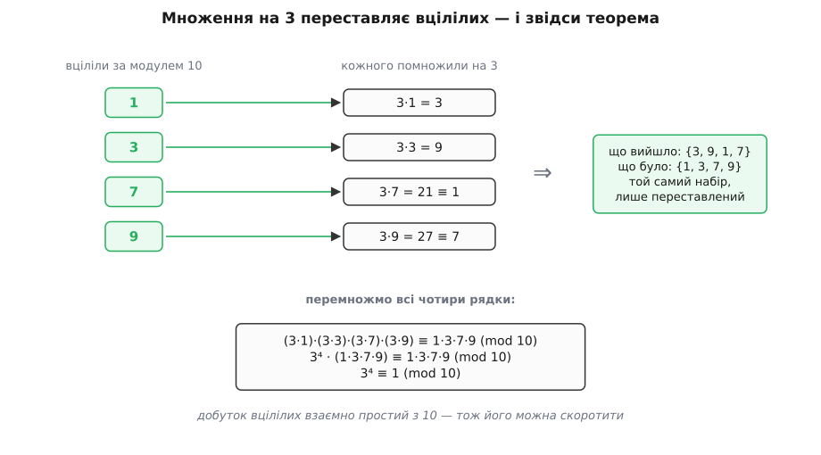
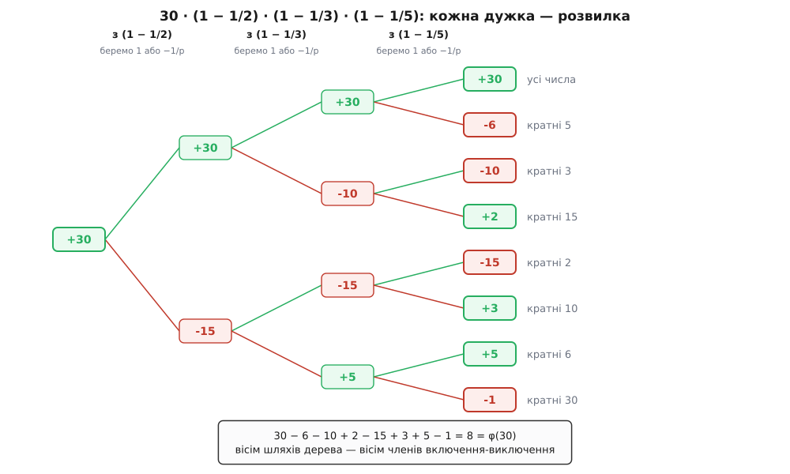
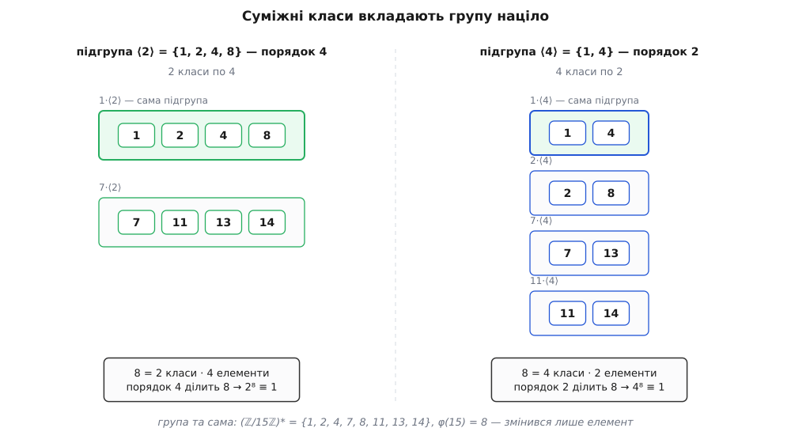

# 🧮 Теорема Ейлера: доведення без дірок

<preknowlist>
- [Модульна арифметика](topic:math-number-theory/modular-arithmetic) — запис a ≡ b (mod n), класи лишків і те, що за модулем вільно додають, віднімають і множать.
- [НСД і алгоритм Евкліда](topic:math-number-theory/gcd-euclidean) — найбільший спільний дільник, «взаємно прості» = НСД 1, і тотожність Безу: НСД(a, n) завжди подається як a·u + n·v за якихось цілих u, v.
- [Прості числа](topic:math-number-theory/prime-numbers) — прості числа, розклад на прості множники та його єдиність.
- [Комбінації і біноміальний коефіцієнт](topic:math-combinatorics/combinations) — C(m, j) як кількість способів вибрати j штук із m, і біном Ньютона.
</preknowlist>

Доведення міцне рівно настільки, наскільки міцний найслабший його крок. Теорему Ейлера — a^φ(n) ≡ 1 (mod n) за взаємно простих a і n — показують за півсторінки: беремо всі вцілілі лишки, множимо кожен на a, набір переставляється сам у себе, добутки скорочуються, готово. Викладка чесна, і кожне її твердження правдиве. Але одне місце в ній тримається на картинці, а не на доведенні, — і саме це місце несе всю вагу.

Місце таке: «множення на взаємно просте a не склеює лишки». Звучить майже як тавтологія, а насправді це нетривіальне твердження про цілі числа, і воно потребує окремої роботи. Розберімо його до кінця, а тоді складімо теорему заново — вже без дірок. Далі до цього долучаться ще три речі, кожна з яких у стислому викладі зазвичай лишається за дужками: формула φ(n) = n·∏(1 − 1/p), виведена рахунком, а не через мультиплікативність; погляд, з якого теорема Ейлера перестає бути окремим фактом і стає наслідком; і тонкість, через яку RSA працює навіть там, де теорема Ейлера вже не діє.

## Що саме доводимо

Спершу — точні означення, бо саме на них далі спиратиметься кожен крок. Модуль n ≥ 1 зафіксовано.

Число x назвімо **вцілілим**, якщо НСД(x, n) = 1. Властивість ця залежить лише від лишку: НСД(x, n) = НСД(x mod n, n), бо x і x mod n різняться на кратне n, а спільні дільники з n від додавання кратних n не міняються. Тому «вцілілий» — це властивість цілого класу лишків, а не окремого числа, і питання «скільки їх» має сенс.

**Функція Ейлера** φ(n) — кількість вцілілих серед 1, 2, …, n.

**Зведеною системою лишків** назвімо будь-який набір R із φ(n) чисел, попарно нерівних за модулем n, кожне з яких вціліле. Канонічний вибір — самі вцілілі з проміжку 1…n, але доведення жодного разу не скористається тим, що набір саме такий: важить лише кількість і попарна нерівність.

Мета:

```
Теорема Ейлера.   НСД(a, n) = 1   ⟹   a^φ(n) ≡ 1 (mod n)
```

## Крок, який проходять на слово

Ось твердження, на якому все тримається:

```
Закон скорочення.   НСД(a, n) = 1  і  a·x ≡ a·y (mod n)   ⟹   x ≡ y (mod n)
```

Розпишімо, що це означає в цілих числах. Конгруенція a·x ≡ a·y (mod n) — це рівно «n ділить a·(x − y)». Треба дійти до «n ділить x − y». Тобто множник a має **зникнути** з-під знака ділення, не лишивши по собі нічого.

Звичне пояснення таке: у n немає з a спільних множників, тож увесь n мусить поміститися всередині різниці (x − y) — дітися йому більше нікуди. Картинка гарна й веде до правильної відповіді. Але придивімося, що вона мовчки припускає. «У n немає з a спільних множників» — це вже погляд на n як на набір простих співмножників. Далі уявляється, що кожен простий дільник n, не знайшовши собі місця в a, змушений піти в (x − y). А «простий дільник добутку, що не ділить першого множника, ділить другий» — це і є лема Евкліда, тобто рівно той факт, який ми намагаємося обґрунтувати, лише для простого випадку. Картинка не довела нічого: вона переказала твердження іншими словами й додала до нього розклад на прості.

Додала, до речі, задорого. Єдиність розкладу на прості — теорема нітрохи не легша за нашу, і в стандартному викладі її доводять **через** лему Евкліда, а лему Евкліда — через тотожність Безу. Обпертися тут на єдиність розкладу означає піти по колу: взяти важчий результат, який сам стоїть на тому камені, що ми зараз кладемо.

Пряма дорога коротша і простих не згадує зовсім.

**Тотожність Безу.** Для будь-яких цілих a і n знайдуться цілі u, v, за яких a·u + n·v = НСД(a, n). Це не про прості числа й не про розклад — це про те, що множина всіх комбінацій {a·u + n·v} збігається з множиною кратних НСД; доведення (через найменший додатний елемент цієї множини) та спосіб дістати самі u, v розібрано в [розширеному алгоритмі Евкліда](topic:math-number-theory/gcd-euclidean/math-bezout.md). Нам вистачить самої рівності, і то лише у випадку НСД = 1:

```
НСД(a, n) = 1   ⟺   існують цілі u, v:   a·u + n·v = 1
```

Стрілка вправо — це Безу. Стрілка вліво задарма: будь-який спільний дільник a і n ділить лівий бік, отже ділить одиницю, отже сам дорівнює одиниці.

**Лема Евкліда (для взаємно простих).** Якщо НСД(n, a) = 1 і n ділить a·b, то n ділить b.

Доведення — один рядок, і весь фокус у тому, щоб помножити одиницю на b:

```
a·u + n·v = 1                      тотожність Безу
b = b·1 = b·(a·u + n·v)            помножили обидва боки на b
  = u·(a·b) + (b·v)·n              переставили множники

n ділить a·b        → n ділить перший доданок
n ділить n          → n ділить другий доданок
                    → n ділить їхню суму, тобто b                    ∎
```

Ось і все. Ніяких простих, ніякого розкладу — саме тому лема правдива не лише для простих n, а для будь-якого n, взаємно простого з a. Класичний випадок «p просте, p ділить a·b ⟹ p ділить a або p ділить b» — окремий її наслідок: якщо p не ділить a, то НСД(p, a) = 1, бо в простого дільники лише 1 і p.

Тепер закон скорочення падає сам:

```
a·x ≡ a·y (mod n)      →   n ділить a·(x − y)
НСД(a, n) = 1          →   за лемою Евкліда n ділить (x − y)
                       →   x ≡ y (mod n)                             ∎
```

**Побачити, як воно ламається.** Умова НСД(a, n) = 1 тут не оздоба — щойно її прибрати, скорочення видає неправду:

```
n = 10,  a = 2:      2·1 = 2  ≡  12 = 2·6   (mod 10)
                     скоротили на 2  →  1 ≡ 6 (mod 10)   — хибно

чому: НСД(2, 10) = 2, і жодних u, v з 2u + 10v = 1 не існує —
      ліворуч завжди парне, праворуч ні. Безу дає лише 2u + 10v = 2.
```

Двійка не зникає з-під знака ділення: вона лишає по собі п'ятірку, і рівність за модулем 10 перетворюється на рівність за модулем 5 — а це вже інше твердження (1 ≡ 6 mod 5 таки правда). Скорочення не бреше, коли його умову дотримано; воно бреше, коли його застосовують за звичкою.

> 🔧 **Навіщо це.** Різниця між картинкою й доведенням тут не педантизм, а робочий інструмент. Картинка «спільних множників немає, тож усе гаразд» не підказує, **що саме** станеться, коли множники таки є. Безу підказує точно: НСД(a, n) = d означає, що a·u + n·v ніколи не дасть менше за d, тож замість зникнути множник лишає по собі рівно n/d. Тому конгруенція a·x ≡ a·y (mod n) за d > 1 скорочується не в нікуди, а до x ≡ y (mod n/d) — рівність не зникає, вона слабшає в d разів. Це вже не абстракція: саме так гине код, що ділить за модулем без перевірки НСД — відповідь виходить не безглузда, а тихо правильна не за тим модулем.

**Добуток вцілілих вцілілий.** Знадобиться ще одна дрібниця, і Безу закриває її так само без простих. Нехай НСД(a, n) = 1 і НСД(b, n) = 1. Тоді знайдуться u, v, s, t із a·u + n·v = 1 та b·s + n·t = 1. Перемножмо ці дві одиниці:

```
1 = (a·u + n·v)·(b·s + n·t)
  = (a·b)·(u·s)  +  n·(a·u·t + v·b·s + n·v·t)
    └─ кратне a·b ─┘   └────────── кратне n ──────────┘
```

Одиниця подалася як комбінація a·b та n — а це, за стрілкою вліво з рівносильності вище, і означає НСД(a·b, n) = 1. Отже вцілілі замкнені щодо множення: скільки їх не перемножуй, з кола вцілілих не вийти.

Зверніть увагу, що сталося. Обидва факти, на яких стоятиме вся конструкція, вивелися з однієї рівності a·u + n·v = 1, і жоден із них не поцікавився, як n розкладається на прості. Теорема про остачі степенів простих не потребує зовсім.

## Теорема Ейлера, записана строго

Тепер усе на місці. Нехай НСД(a, n) = 1, а R = {r₁, r₂, …, r_φ} — зведена система лишків, φ = φ(n).

**Лема про тасування.** Відображення rᵢ ↦ (a·rᵢ mod n) — бієкція R на R.

Доводиться трьома окремими твердженнями, і кожне з них уже здобуте.

**Не виходить за межі R.** Число a·rᵢ вціліле, бо вцілілі a і rᵢ, а добуток вцілілих вцілілий. Узяття остачі цього не міняє: НСД(a·rᵢ mod n, n) = НСД(a·rᵢ, n) = 1. Отже a·rᵢ mod n — вцілілий лишок, тобто дорівнює за модулем n якомусь елементу R (набір R містить по одному представнику від кожного вцілілого класу — їх усього φ, стільки ж, скільки елементів у R, і вони попарно нерівні).

**Не склеює.** Якщо a·rᵢ ≡ a·rⱼ (mod n), то за законом скорочення rᵢ ≡ rⱼ (mod n). Але елементи R попарно нерівні за модулем n — отже i = j. Різні входи дають різні виходи.

**Отже бієкція.** Ін'єктивне відображення скінченної множини в себе неминуче й сюр'єктивне: φ різних значень мусять заповнити всі φ місць, вільних не лишається. Це навіть не властивість чисел — це рахунок. ∎


*Лема про тасування на найменшому цікавому прикладі. Обидва її стовпи видно просто: втекти з набору не можна (добуток вцілілих вцілілий), склеїтися не можна (закон скорочення) — а тоді чотирьом значенням нікуди дітися, крім чотирьох місць.*

**Доведення теореми.** Лема каже, що набір {a·r₁ mod n, …, a·r_φ mod n} — це той самий R, лише в іншому порядку. Добуток набору від порядку не залежить, тож

```
(a·r₁)·(a·r₂)·…·(a·r_φ)  ≡  r₁·r₂·…·r_φ    (mod n)
```

Ліворуч зберімо всі a докупи — їх рівно φ штук, звідси й показник:

```
a^φ · (r₁·r₂·…·r_φ)  ≡  r₁·r₂·…·r_φ    (mod n)
```

Позначмо P = r₁·r₂·…·r_φ. Кожен rᵢ вцілілий, а добуток вцілілих вцілілий — отже НСД(P, n) = 1, і до конгруенції a^φ·P ≡ 1·P можна застосувати закон скорочення. Скорочуємо на P:

```
a^φ(n)  ≡  1   (mod n)                                              ∎
```

Дірок не лишилося. Кожен крок спирається або на рахунок, або на тотожність Безу.

**Мала теорема Ферма — окремий випадок.** Візьмімо n = p просте. Тоді φ(p) = p − 1, бо жодне з чисел 1…p−1 не має з p спільного дільника, крім одиниці. Умова НСД(a, p) = 1 означає просто «p не ділить a». Підставмо — і дістанемо [малу теорему Ферма](topic:math-number-theory/fermat-little-theorem):

```
a^(p−1) ≡ 1 (mod p)     за умови, що p не ділить a
```

Жодної нової роботи: те саме доведення, лише зведена система лишків тут — усі ненульові лишки поспіль.

## Формула добутку через включення-виключення

Формулу φ(n) = n·∏(1 − 1/p) зазвичай виводять через мультиплікативність: доводять φ(m·k) = φ(m)·φ(k) за взаємно простих m, k (підпирає це [китайська теорема про залишки](topic:math-number-theory/chinese-remainder-theorem)), окремо рахують φ(pᵏ) і перемножують. Дорога правильна, але вона пояснює формулу через іншу теорему. Є коротша: порахувати вцілілих **прямо**, і побачити, як добуток виникає з рахунку сам.

**[Принцип включення-виключення](topic:math-combinatorics/inclusion-exclusion).** Нехай є скінченна множина U і в ній підмножини A₁, …, A_r. Кількість елементів, що не лежать **у жодній** з них:

```
|U \ (A₁ ∪ … ∪ A_r)| = Σ (−1)^|S| · |A_S|    по всіх підмножинах S ⊆ {1, …, r}
```

де A_S — перетин усіх Aᵢ з i ∈ S, а порожньому S відповідає |A_∅| = |U|. Для r = 2 це звичне |U| − |A₁| − |A₂| + |A₁ ∩ A₂|.

Чому це правда, видно, якщо рахувати внесок **одного** елемента. Візьмімо x ∈ U і нехай він лежить рівно в m із наших підмножин. Скільки разів його порахує права частина? Доданок за набором S ураховує x тоді й лише тоді, коли S цілком міститься в тих m підмножинах, яким x належить, — а таких S із розміром j є рівно C(m, j) штук. Отже сумарний внесок x дорівнює

```
Σ (−1)ʲ · C(m, j)   по j = 0…m   =   (1 − 1)^m   =   0^m
```

За [біномом Ньютона](topic:math-combinatorics/combinations) це просто розклад (1 − 1)^m. А 0^m дорівнює нулю за m ≥ 1 і одиниці за m = 0 — бо порожній добуток дорівнює одиниці. Тобто права частина рахує кожен елемент, що попав бодай кудись, рівно нуль разів, а кожен елемент, що не попав нікуди, — рівно один раз. Це і є ліва частина. ∎

Принцип цей давній і з плутаною атрибуцією: ним послуговувався Абрагам де Муавр ще 1718 року в «The Doctrine of Chances», рахуючи перестановки без нерухомих точок, але першу явну загальну форму опублікував португальський математик Даніел Аугусто да Сілва 1854 року, а 1883-го незалежно — Джеймс Джозеф Сильвестр; звідси назви «формула да Сілви» й «формула Сильвестра». Статус: раннє вживання де Муавром і незалежні публікації да Сілви та Сильвестра — усталені факти; хто «перший сформулював» — питання того, що вважати формулюванням, а не суперечка про документи.

**Застосуймо до φ(n).** Нехай p₁, …, p_r — **різні** прості дільники n. Візьмімо U = {1, 2, …, n} і Aᵢ = кратні pᵢ всередині U. Не вціліти — означає ділитися бодай на один простий дільник n, тобто попасти бодай в одне Aᵢ. Отже вцілілі — це рівно ті, хто не попав нікуди, і φ(n) — це ліва частина принципу.

Лишилося порахувати перетини. Кратних pᵢ у проміжку 1…n рівно n/pᵢ (число ділиться націло, бо pᵢ — дільник n). А перетин? Тут ховається крок, який теж варто не проґавити:

```
x ділиться на pᵢ  І  x ділиться на pⱼ    ⟺    x ділиться на pᵢ·pⱼ     (за i ≠ j)
```

Стрілка вліво очевидна. Стрілка вправо — знову **лема Евкліда**: з pᵢ | x маємо x = pᵢ·k, тоді pⱼ | pᵢ·k, а НСД(pⱼ, pᵢ) = 1 (різні прості), отже pⱼ | k, тобто x = pᵢ·pⱼ·(k/pⱼ). Той самий інструмент, що ніс закон скорочення, несе тепер і рахунок перетинів. Загалом для набору S маємо |A_S| = n / ∏(pᵢ : i ∈ S).

Підставмо все в принцип:

```
φ(n) = Σ (−1)^|S| · n / ∏(pᵢ : i ∈ S)      по всіх S ⊆ {p₁, …, p_r}
```

**Порахувати φ(30) рахунком.** Тут r = 3, простих три — 2, 3, 5, — тож доданків 2³ = 8:

```
30 = 2 · 3 · 5           різні прості: 2, 3, 5

  +30    усі числа 1…30
  −15    кратні 2
  −10    кратні 3
   −6    кратні 5
   +5    кратні 6   — відняті двічі, повертаємо
   +3    кратні 10  — відняті двічі, повертаємо
   +2    кратні 15  — відняті двічі, повертаємо
   −1    кратні 30  — відняті тричі, повернуті тричі: віднімаємо ще раз

φ(30) = 30 − 15 − 10 − 6 + 5 + 3 + 2 − 1 = 8
перевірка: 1, 7, 11, 13, 17, 19, 23, 29 — рівно вісім
```

**А тепер головне: чому сума згортається в добуток.** Погляньмо на добуток і **не** розкриваймо його поспіхом:

```
n · (1 − 1/p₁) · (1 − 1/p₂) · … · (1 − 1/p_r)
```

Щоб розкрити дужки, треба з кожної взяти рівно один доданок — або 1, або (−1/pᵢ) — і перемножити вибране. Кожен спосіб вибору дає один член розкладу, і різних способів рівно 2^r. Але вибір «з якої дужки взяти −1/pᵢ» — це рівно вибір підмножини S ⊆ {p₁, …, p_r}. А член, що з нього виходить:

```
n · ∏(−1/pᵢ : i ∈ S)  =  (−1)^|S| · n / ∏(pᵢ : i ∈ S)
```

Це слово в слово доданок включення-виключення за тим самим S. Отже відповідність між членами розкладу добутку й членами суми — не схожість і не збіг, а **тотожність**: те саме сімейство доданків, записане двома способами. Сума й добуток рівні тому, що це одна й та сама річ.


*Кожна дужка (1 − 1/p) — це розвилка на два: лишити одиницю (просте не бере участі) чи взяти −1/p (просте йде в набір). Шлях від кореня до листка вибирає підмножину простих; значення в листку — це і є доданок суми. Вісім шляхів, вісім доданків, і сума листків дає вісімку — а згорнути дерево назад у три дужки можна саме тому, що розвилки незалежні.*

Отже маємо формулу, і здобуто її голим рахунком:

```
φ(n) = n · (1 − 1/p₁) · (1 − 1/p₂) · … · (1 − 1/p_r)     по РІЗНИХ простих дільниках n
```

Заразом видно, чому показники в розкладі n не входять у формулу окремо. На саме n вони, звісно, впливають — а отже й на кожне n/pᵢ. Але набір «ножів», якими просіюють, від них не залежить: ножа з p² не існує, бо ділитися на p² — окремий випадок ділення на p, і жодного нового числа він не викидає. Дужок стільки, скільки **різних** простих; а скільки разів кожне входить, уже враховано у величині самого n.

**Перевірка на φ(360).**

```
360 = 2³ · 3² · 5        різні прості ті самі: 2, 3, 5

рахунком:  360 − 180 − 120 − 72 + 60 + 36 + 24 − 12 = 96
добутком:  360 · (1 − 1/2) · (1 − 1/3) · (1 − 1/5) = 360 · 1/2 · 2/3 · 4/5 = 96
```

Обидві дороги — та сама вісімка доданків, лише в одному випадку складених, а в другому згорнутих у дужки.

## Погляд згори: вцілілі утворюють групу

Доведення теореми Ейлера вище — бездоганне, але дивно мовчазне. Воно **перевіряє**, що a^φ(n) ≡ 1, і не каже ні слова про те, чому саме φ(n), а не якесь інше число. І воно геть безпорадне перед простим спостереженням: за модулем 12 маємо φ(12) = 4, проте 5² ≡ 7² ≡ 11² ≡ 1 — усе повертається до одиниці вже на другому кроці, удвічі раніше за обіцяне. Звідки взялася двійка? Доведення через добуток вцілілих цього не бачить: воно рахує весь набір цілком і на менші шматки не дивиться.

Погляд, який це пояснює, починається з того, що ми викидаємо з задачі числа.

Потрібне тут поняття — [група](topic:math-algebra/group-theory): множина G з однією дією (·), для якої виконано чотири вимоги — дія не виводить за межі G (замкненість); (x·y)·z = x·(y·z) (асоціативність); є нейтральний елемент e з e·x = x·e = x; у кожного x є обернений x⁻¹ з x·x⁻¹ = e. Ніяких інших вимог: групою буває що завгодно — повороти куба, перестановки карт, оборотні матриці, — аби дія слухалася цих чотирьох правил. Комутативність (x·y = y·x) до означення не входить, хоч у нашому випадку буде.

Перевірмо, що вцілілі лишки за модулем n із множенням за модулем — це група. Позначмо її (ℤ/nℤ)*.

**Замкненість.** Добуток вцілілих вцілілий — доведено вище через Безу.

**Асоціативність.** Успадкована від звичайного множення цілих: остача від добутку не залежить від того, як розставити дужки.

**Нейтральний.** Одиниця, і вона вціліла: НСД(1, n) = 1 за будь-якого n.

**Обернений.** Ось де знову працює та сама тотожність. НСД(a, n) = 1 дає a·u + n·v = 1; погляньмо на цю рівність за модулем n — доданок n·v зникає, лишається a·u ≡ 1 (mod n). Отже u — обернений до a. Він і сам вцілілий, бо з тієї ж рівності будь-який спільний дільник u і n ділив би одиницю. Це [обернений за модулем](topic:math-number-theory/modular-inverse), і Безу не просто доводить його існування, а видає його явно.

Отже (ℤ/nℤ)* — група, і **порядок** її (кількість елементів) дорівнює φ(n) за самим означенням φ. Теорема Ейлера в цих словах читається так: **елемент групи, піднесений до порядку групи, дає нейтральний**. Число a зникло — лишилася структура.

**Порядок елемента.** Візьмімо a ∈ G, G скінченна. Степені a, a², a³, … не можуть бути всі різні — місць у G скінченно, тож колись aⁱ = aʲ за i < j. Скоротімо на aⁱ (у групі це законно — множимо обидва боки на (a⁻¹)ⁱ) і дістанемо a^(j−i) = e, де j − i ≥ 1. Отже якийсь додатний степінь a таки дорівнює нейтральному; найменший такий назвімо d — це [мультиплікативний порядок](topic:math-number-theory/multiplicative-order) елемента a. Тоді набір

```
⟨a⟩ = { e, a, a², …, a^(d−1) }
```

замкнений щодо множення (показники додаються за модулем d) і містить обернені (a⁻¹ = a^(d−1)) — тобто це **підгрупа**, і в ній рівно d елементів.

**Суміжні класи.** Для підгрупи H ⊆ G і елемента g ∈ G назвімо суміжним класом набір g·H = {g·h : h ∈ H}. Три спостереження — і теорема готова.

**Клас має стільки ж елементів, скільки H.** Відображення h ↦ g·h ін'єктивне: з g·h₁ = g·h₂ множенням на g⁻¹ дістаємо h₁ = h₂. Отже |g·H| = |H| — усі класи однакові завбільшки.

**Класи вкривають усю G.** Будь-який g лежить у своєму власному класі, бо g = g·e ∈ g·H.

**Два класи або збігаються, або не перетинаються зовсім.** Нехай x ∈ g₁H ∩ g₂H, тобто x = g₁h₁ = g₂h₂. Тоді g₁ = g₂·(h₂h₁⁻¹), а h₂h₁⁻¹ ∈ H, бо H — підгрупа. Отже g₁H = g₂·(h₂h₁⁻¹)·H = g₂H — остання рівність тому, що множення на елемент H лише переставляє H саму в себе (та сама лема про тасування, тільки в групових словах). Проміжного стану «класи трохи перетнулися» не буває.

Складімо три спостереження. Класи вкривають G, попарно не перетинаються й усі однакові завбільшки — тобто вони **вкладають G націло**, як однакові плитки без щілин і без нахлистів. Якщо плиток k, а в кожній |H| штук:

```
Теорема Лагранжа.   |G| = k · |H|,   тобто |H| ділить |G|
```


*Група та сама, елемент інший — і розбиття інше. Але хоч би який елемент узяти, блоки виходять однакові між собою й вісімку вкривають націло; тому розмір блока не може бути яким завгодно — лише дільником вісімки. Порядок елемента затиснутий не арифметикою остач, а геометрією замощення.*

**Теорема Ейлера як наслідок.** Тепер усе складається в два рядки. Візьмімо G = (ℤ/nℤ)*, тобто |G| = φ(n), і a ∈ G з порядком d. Підгрупа ⟨a⟩ має рівно d елементів, тож за Лагранжем d ділить φ(n), тобто φ(n) = d·k за якогось цілого k. Тоді

```
a^φ(n) = a^(d·k) = (a^d)^k = 1^k = 1   (mod n)                      ∎
```

Ось і відповідь на питання, чому саме φ(n). Не тому, що φ(n) — «правильний» показник: правильний показник — це d, справжня довжина кільця степенів. А φ(n) працює лише тому, що d його **ділить**, і зайві оберти нічого не псують. Теорема Ейлера — не точне твердження про період, а твердження про кратність періоду, і Лагранж показує, звідки ця кратність береться.

Заразом розв'язалася й загадка модуля 12. Порядок 2 у групі з чотирьох елементів — цілком законна річ, бо 2 ділить 4; підгрупа ⟨5⟩ = {1, 5} просто вкладає (ℤ/12ℤ)* двома плитками замість однієї. Теорема Ейлера тут не помилилася — вона й не обіцяла найменшого показника, лише кратний.

Побачити замощення можна на будь-якому модулі:

```py
from math import gcd

def units(n: int) -> list[int]:
    """Вцілілі лишки за модулем n — елементи групи (Z/nZ)*."""
    return [x for x in range(1, n) if gcd(x, n) == 1]

def subgroup(a: int, n: int) -> list[int]:
    """<a> = {1, a, a², …} — циклічна підгрупа, породжена елементом a."""
    H, x = [], 1
    while True:
        H.append(x)
        x = x * a % n
        if x == 1:
            return sorted(H)

def cosets(a: int, n: int) -> list[list[int]]:
    """Розбиття (Z/nZ)* на суміжні класи g·<a>."""
    G, H, seen, out = units(n), subgroup(a, n), set(), []
    for g in G:
        if g in seen:
            continue                       # цей g уже накритий чужим класом
        c = sorted(g * h % n for h in H)
        out.append(c)
        seen |= set(c)
    return out

n, a = 15, 2
G, H, cs = units(n), subgroup(a, n), cosets(a, n)
print(G)                                   # [1, 2, 4, 7, 8, 11, 13, 14] — φ(15) = 8
print(H)                                   # [1, 2, 4, 8] — порядок 4
print(cs)                                  # [[1, 2, 4, 8], [7, 11, 13, 14]]

assert sum(len(c) for c in cs) == len(G)          # плитки вкривають усе
assert all(len(c) == len(H) for c in cs)          # плитки однакові
assert len(G) % len(H) == 0                       # Лагранж: |H| ділить |G|
assert pow(a, len(G), n) == 1                     # звідси й теорема Ейлера

for m in range(2, 200):                    # те саме на двох сотнях модулів
    for b in units(m):
        assert len(units(m)) % len(subgroup(b, m)) == 0
        assert pow(b, len(units(m)), m) == 1
```

> 🔧 **Навіщо це.** Погляд згори — не прикраса до вже доведеного факту, а те, що приносить нові. Теорема Ейлера каже лише «φ(n) підійде», і зупиняється. Лагранж каже «підійде будь-яке кратне справжнього порядку» — а це вже дозвіл шукати менше число. Саме на цьому дозволі стоїть функція Кармайкла λ(n) = НСК(p−1, q−1), яку сучасні стандарти RSA беруть замість φ(n): для n = 55 маємо φ = 40, а λ = НСК(4, 10) = 20, і секретний показник виходить удвічі коротший (3⁻¹ ≡ 7 mod 20 замість 27), тобто розшифрування вдвічі дешевше. Теорема Ейлера сама по собі такої заміни не виправдовує — виправдовує її саме структурний факт, що показники живуть за модулем порядку, а не за модулем розміру групи.

## RSA і повідомлення, не взаємно прості з модулем

Лишилася діра, і вона не в теоремі, а в тому, як теорему прикладають до RSA.

Нагадаймо схему: n = p·q для різних простих p, q; e взаємно просте з φ(n) = (p−1)(q−1); d — обернений до e за модулем φ(n), тобто e·d = 1 + k·φ(n). Шифрування c = m^e mod n, розшифрування c^d mod n. Викладка, що це повертає m:

```
c^d = m^(e·d) = m^(1 + k·φ(n)) = m · (m^φ(n))^k ≡ m · 1^k = m   (mod n)
```

Гляньте на передостанній перехід. Він підставив m^φ(n) ≡ 1 — тобто застосував теорему Ейлера до m. А теорема Ейлера вимагає НСД(m, n) = 1. Хто це перевіряв? Ніхто: m — довільне число, менше за n, і жодних обіцянок про його НСД із n схема не давала.

**Скільки таких m.** Порахувати легко: серед лишків 0…n−1 вцілілих рівно φ(n), отже невцілілих рівно

```
n − φ(n) = p·q − (p−1)(q−1) = p + q − 1
```

Для n = 55 це 5 + 11 − 1 = 15 повідомлень із 55 — майже третина, і на іграшкових числах діру не сховати. Для бойового 2048-бітного n частка інша: (p + q − 1)/n ≈ 1/p + 1/q ≈ 2⁻¹⁰²³. Влучити в таке m випадково — подія, якої не буде ніколи.

Але «ніколи не трапиться» — не доведення, а прогноз, і задовольнятися ним тут не варто аж двічі. По-перше, RSA обіцяє розшифрувати **будь-яке** m < n, а не «майже будь-яке»: твердження з винятками, яких ми не вміємо ні описати, ні виявити, — це вже не теорема, а спостереження. По-друге, недосяжність такого m — сама по собі цікавий факт, і варто розуміти, звідки вона. Побудувати m, кратне p, не знаючи p, не легше, ніж розкласти n: якби хтось таке вмів, він уже мав би множник. А якби таке m колись усе-таки трапилося, воно б себе негайно виказало — НСД(m, n) віддав би p одним алгоритмом Евкліда. Тобто випадок, який ми зараз латаємо, не просто рідкісний: щоб у нього попасти, треба вже мати те, заради приховування чого RSA й існує.

Тож потрібне доведення без умови взаємної простоти. І воно є — тільки будувати його треба не з теореми Ейлера, а нижче.

**Ключ — дивитися на p і q нарізно.** Замість того щоб доводити m^(e·d) ≡ m за модулем n, доведімо це окремо за модулем p і окремо за модулем q. Модулі ці прості, і за простого модуля випадків лише два — тоді як за складеного n їх ціла плутанина.

**За модулем p.** Розпишімо e·d = 1 + k·φ(n) = 1 + k·(p−1)·(q−1).

```
Випадок 1: p ділить m.
   Тоді m ≡ 0 (mod p), а отже й m^(e·d) ≡ 0 ≡ m (mod p).
   Рівність тримається — тривіально, але тримається.

Випадок 2: p не ділить m.
   Тоді НСД(m, p) = 1, і працює мала теорема Ферма: m^(p−1) ≡ 1 (mod p).

   m^(e·d) = m^(1 + k·(p−1)·(q−1))
           = m · (m^(p−1))^(k·(q−1))          зібрали (p−1) у показник
           ≡ m · 1^(k·(q−1)) = m   (mod p)
```

Обидва випадки дали те саме: m^(e·d) ≡ m (mod p). Той самий рахунок слово в слово проходить і для q. Отже

```
p ділить m^(e·d) − m      і      q ділить m^(e·d) − m
```

**Склеювання.** Тепер треба з двох конгруенцій зробити одну за модулем n = p·q. Це [китайська теорема про залишки](topic:math-number-theory/chinese-remainder-theorem): p і q різні прості, отже взаємно прості, а число, що ділиться на два взаємно прості числа, ділиться на їхній добуток. (І це, зрозуміло, знову лема Евкліда: p | X дає X = p·t, тоді q | p·t, а НСД(q, p) = 1, отже q | t, отже p·q | X.) Виходить:

```
n ділить m^(e·d) − m    →    m^(e·d) ≡ m (mod n)    для БУДЬ-ЯКОГО m         ∎
```

Умови взаємної простоти не лишилося. Теорема Ейлера дає RSA зручну картинку, але правильне доведення тримається на малій теоремі Ферма за кожним простим окремо плюс склеювання.

**Побачити на іграшкових числах.** Візьмімо p = 5, q = 11, n = 55, φ(n) = 40, e = 3, d = 27 (бо 3·27 = 81 = 1 + 2·40). Зашифруймо m = 5 — число, кратне p, тобто саме той випадок, до якого теорема Ейлера не застосовна:

```
шифруємо:      c = 5³ = 125 = 2·55 + 15    →   c = 15
розшифровуємо: 15²⁷ mod 55 = 5             →   п'ятірка повернулася

а тепер те саме нарізно:
   за модулем 5:   m ≡ 0,  і  15²⁷ ≡ 0 (mod 5)   ✓   випадок 1: обидва боки нулі
   за модулем 11:  m ≡ 5,  і  15²⁷ ≡ 5 (mod 11)  ✓   випадок 2: спрацював Ферма
   склеюємо: x ≡ 0 (mod 5), x ≡ 5 (mod 11)  →  єдиний такий лишок у 0…54 це 5  ✓
```

Розшифрування спрацювало — але не тому, що 5⁴⁰ ≡ 1 (це неправда: 5⁴⁰ ≡ 45 mod 55), а тому, що за модулем 5 обидва боки просто нулі, а за модулем 11 працює Ферма. Перевірити можна всі 55 повідомлень поспіль — жодне не губиться.

**Чому це не безкоштовно: n мусить бути безквадратним.** У доведенні є місце, яке легко пропустити: у випадку 1 ми сказали «m ≡ 0 (mod p), отже m^(e·d) ≡ 0 ≡ m». Це спрацювало тому, що модуль p — сам простий, і нуль за ним лишається нулем назавжди. Але якби n містив p у квадраті, розкладати треба було б за модулем p², а там нуль поводиться інакше: m може бути ненульовим за модулем p², а m² — уже нулем. Схема ламається:

```
n = 9 = 3²,  φ(9) = 6,  e = 5,  d = 5     (бо 5·5 = 25 = 1 + 4·6 ≡ 1 mod 6)

m = 3:   c = 3⁵ = 243 = 27·9 + 0    →   c = 0
         c^d = 0⁵ = 0               →   отримали 0, а не 3.  Повідомлення ЗГИНУЛО

m = 6:   c = 6⁵ mod 9 = 0           →   те саме: 6 перетворилося на 0

решта сім значень (0, 1, 2, 4, 5, 7, 8) розшифровуються правильно —
ламаються рівно ті, що діляться на 3, але не дорівнюють нулю
```

Трійка й шістка незворотно склеїлися з нулем: піднесення до п'ятого степеня загнало їх у нуль, а з нуля дороги назад немає. Отже правильність RSA спирається не лише на конгруенцію e·d ≡ 1, а й на те, що n — **добуток різних простих** (безквадратне число, тобто без повторюваних множників). Для n = p·q ця умова виконана даром, і саме тому вона зазвичай лишається непоміченою.

Те саме доведення, до речі, показує, що φ(n) у схемі — надлишок. Ми ніде не скористалися тим, що показник має вигляд 1 + k·φ(n); знадобилося лише, щоб (p−1) і (q−1) обидва ділили e·d − 1. Тобто досить e·d ≡ 1 за модулем НСК(p−1, q−1) = λ(n) — рівно та економія, яку дає погляд згори й яку беруть чинні стандарти. Робочий цикл шифрування з обчисленням φ і швидким піднесенням до степеня зібрано в [іграшковій реалізації](topic:math-number-theory/euler-totient/proj-rsa-toy.md), а вимоги справжньої схеми — у [RSA](topic:sf-security/rsa).

## Що тримало все

Озирнімося на пройдене й спитаймо, на чому воно насправді стояло.

Закон скорочення — на тотожності Безу. Замкненість вцілілих щодо множення, без якої лема про тасування не має сенсу, — на тотожності Безу. Рахунок перетинів у включенні-виключенні — на лемі Евкліда, тобто знову на Безу. Існування обернених, без якого (ℤ/nℤ)* не була б групою й Лагранж не мав би до чого прикластися, — на тотожності Безу. Склеювання двох конгруенцій у RSA — на китайській теоремі про залишки, конструктивне доведення якої теж будується з коефіцієнтів Безу.

Одна рівність, у якій немає жодного простого числа:

```
a·u + n·v = 1
```

І в цьому — маленький парадокс, вартий того, щоб його помітити. Функція φ(n) наскрізь просякнута простими: її формула складається з них, порахувати її без розкладу n ніхто не вміє, і вся стійкість RSA живе саме з цього невміння. А теорема, що робить φ(n) корисною, про прості не знає нічого. Вона знає лише те, що з двох чисел, які не мають спільних дільників, складається одиниця, — і цього виявляється досить, щоб замкнути степені в кільце.

Прості числа ховають від нас **значення** φ(n). Але не її **дію**.
