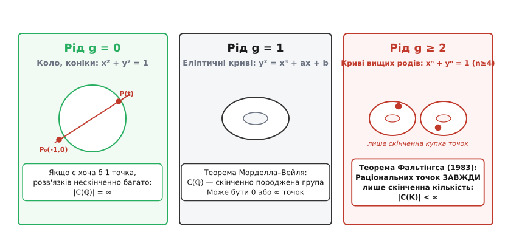
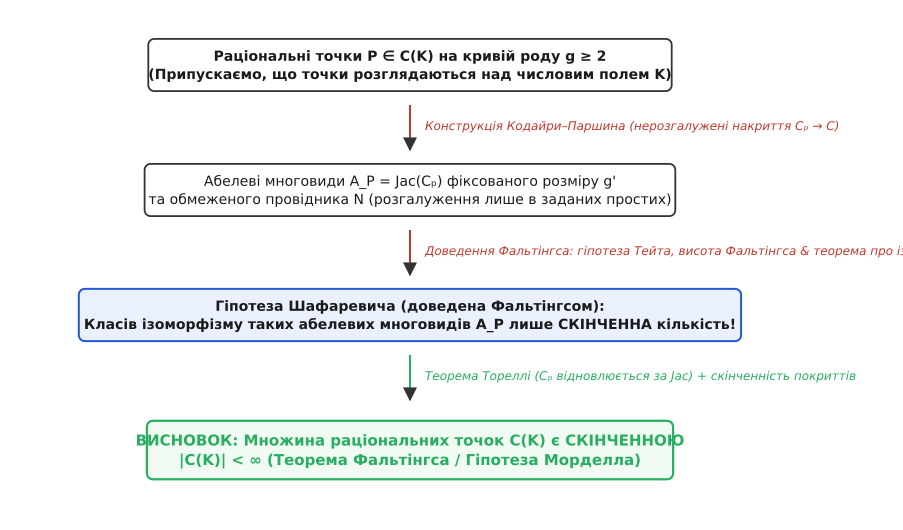
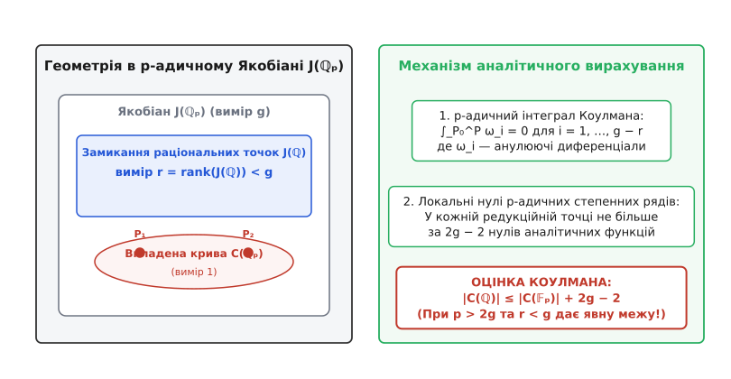

# Теорема Фальтінгса

<preknowlist>
- [Діофантові рівняння](topic:math-number-theory/diophantine-equations) — рівняння у цілих або раціональних числах.
- [Еліптичні криві](topic:math-number-theory/elliptic-curves) — криві роду 1, де раціональні точки утворюють скінченно породжену групу.
- [Метод хорди та Піфагорові трійки](topic:math-number-theory/chord-method-triples) — раціональна параметризація кривих роду 0.
- [Велика теорема Ферма](topic:math-number-theory/fermats-last-theorem) — неіснування цілих розв'язків xⁿ + yⁿ = zⁿ для n ≥ 3.
</preknowlist>

Коли ми шукаємо раціональні розв'язки алгебраїчного рівняння двох змінних `f(x, y) = 0`, геометрична форма відповідної кривої — її топологічний **рід** `g` (кількість «дірок» чи «ручок» на поверхні комплексної кривої) — повністю диктує числовий характер множини точок. На одиничному колі `x² + y² = 1`, яке має рід `g = 0`, одна-єдина раціональна точка `(-1, 0)` через проведення січних прямих породжує нескінченний океан розв'язків. На еліптичній кривій `y² = x³ + a·x + b` з родом `g = 1` точки утворюють скінченно породжену абелеву групу, яка при ранзі `r > 0` також розгортається у нескінченну решітку.

Проте варто перейти межу роду `g ≥ 2` — наприклад, для кривої Ферма четвертого степеня `x⁴ + y⁴ = 1` — і нескінченний простір розв'язків миттєво зникає. 1983 року німецький математик Ґерд Фальтінгс довів твердження, яке понад шістдесят років залишалося лише сміливою здогадкою Луї Морделла: **будь-яка неособлива алгебраїчна крива роду `g ≥ 2`, визначена над числовим полем `K`, має лише скінченну кількість `K`-раціональних точок**.

Цей результат, відомий як **Теорема Фальтінгса** (колишня **гіпотеза Морделла**), став одним із найвеличніших тріумфів математики XX століття. Він зв'язав топологічну евклідову та гіперболічну геометрію алгебраїчних поверхонь із глибокою арифметикою абелевих многовидів та теорією зображень Галуа.


*Три геометрії — три числові світи. Рід g=0 дає нескінченно багато точок через параметризацію; рід g=1 утворює скінченно породжену групу; рід g≥2 за теоремою Фальтінгса завжди має лише скінченну кількість раціональних точок.*

---

## Три триболі геометрії: трихотомія за родом `g`

Щоб збагнути, чому рід `g = 2` є непереборним бар'єром для множення точок, порівняймо три геометричні режими алгебраїчних кривих. Топологічний рід `g` проективної неособливої комплексної кривої визначається її ейлеровою характеристикою `χ = 2 − 2·g`.

```
Рід g = 0  ⇒  χ = 2 > 0   (Сферична геометрія, раціональні криві)
Рід g = 1  ⇒  χ = 0       (Плоска евклідова геометрія, еліптичні криві)
Рід g ≥ 2  ⇒  χ < 0       (Гіперболічна геометрія Лобачевського)
```

За формулою Ґаусса–Бонне, інтеграл від гауссової кривини `K` по комплексному компактному многовиду `C` дорівнює її ейлеровій характеристиці:

```
∫_C K dA = 2·π · χ(C) = 4·π · (1 − g)
```

Ця формула задає принциповий водорозділ між трьома геометричними світами:

### 1. Рід `g = 0`: Сферична геометрія та нескінченний океан точок

Гладкі криві роду 0 (конічні перерізи: кола, еліпси, параболи, гіперболи) описуються рівняннями другого степеня. Оскільки `g = 0`, ейлерова характеристика `χ = 2 > 0`, і середня кривина поверхні є додатною (`K > 0`).

Якщо на такій кривій `C` знайдено хоча б одну раціональну точку `P₀ = (x₀, y₀)`, то будь-яка пряма з раціональним нахилом `t ∈ ℚ`, проведена через `P₀`, перетинає криву точно в **одній додатковій раціональній точці** `P(t)`.

Це задає явний бієктивний ізоморфізм (раціональну параметризацію) між кривою та проективною прямою `ℙ¹(ℚ)`:

```
x(t) = P_x(t) / Q_x(t),   y(t) = P_y(t) / Q_y(t)
```

Оскільки раціональних параметрів `t` нескінченно багато, множина точок `C(ℚ)` є нескінченною. Динаміка точок тут керується алгебраїчним полем раціональних функцій `ℚ(t)`.

### 2. Рід `g = 1`: Евклідова геометрія та група Морделла–Вейля

Еліптичні криві (криві роду 1 з обраною раціональною точкою) мають ейлерову характеристику `χ = 0`. Середня кривина такої поверхні є нульовою (`K = 0`), і комплексна уніформізація задається плоским евклідовим тором `ℂ / Λ`, де `Λ ⊂ ℂ` — двовимірна решітка періодів.

Еліптичні криві не мають раціональної параметризації полем `ℚ(t)`. Проте на комплексному торі `ℂ / Λ` існує неперервна структура абелевої групи.

Геометричний метод січних і дотичних дозволяє додавати дві точки `P` та `Q`: пряма через `P` і `Q` перетинає криву в третій точці `R`, а її дзеркальне відображення відносно осі абсцис дає суму `P + Q`.

За **теоремою Морделла–Вейля**, множина раціональних точок `C(ℚ)` є скінченно породженою абелевою групою:

```
C(ℚ) ≅ T ⊕ ℤʳ
```

де `T` — скінченна група точок кручення, а `r = rank(C(ℚ))` — алгебраїчний ранг. Якщо `r = 0`, на кривій існує лише скінченний набір точок; проте якщо `r ≥ 1`, то багаторазове додавання точок нескінченного порядку `k·P` породжує нескінченну множину раціональних розв'язків.

### 3. Рід `g ≥ 2`: Гіперболічна геометрія та абсолютна скінченність

Коли рід `g ≥ 2`, ейлерова характеристика стає від'ємною: `χ = 2 − 2·g < 0`. За формулою Ґаусса–Бонне, площа такої комплексної кривої у сталій від'ємній кривині `K = −1` є точним топологічним інваріантом:

```
Area(C) = 4·π · (g − 1)
```

Комплексна уніформізація Анрі Пуанкаре та Фелікса Кляйна стверджує, що універсальним накриттям кривої `C(ℂ)` є не евклідова площина, а **верхня півплощина Лобачевського** `ℍ = {z ∈ ℂ : Im(z) > 0}` з гіперболічною метрикою Пуанкаре:

```
ds² = (dx² + dy²) / y²
```

Сама крива представлена як фактор-простір `C(ℂ) ≅ ℍ / Γ`, де `Γ ⊂ PSL₂(ℝ)` — фуксова група (дискретна підгрупа ізометрій гіперболічної площини, ізоморфна фундаментальній групі `π₁(C)`).

У гіперболічній геометрії від'ємна кривина `K = −1` чинить нищівний опір існуванню автоморфізмів та раціональних параметризацій. За лемою Шварца–Піка, будь-який голоморфний морфізм між кривими від'ємної кривини стискає гіперболічні відстані.

За теоремою Шварца, група автоморфізмів `Aut(C)` кривої роду `g ≥ 2` є строго **скінченною** (її порядок не перевищує `84·(g − 1)`).

На відміну від тора (`g = 1`), на кривій роду `g ≥ 2` немає жодної внутрішньої группової операції для додавання точок. Спроба комбінувати точки січними лініями вищих степеней повертає нас не на вихідну криву, а виводить у простори вищих розмірностей.

Саме цей геометричний факт Морделл 1922 року перевів на мову теорії чисел: від'ємна геометрія не дозволяє раціональним точкам розмножуватися.

Детальний 60-річний шлях від цієї геодезичної ідеї Морделла до остаточного доведення Фальтінгса розкрито в [окремому історичному екскурсі](topic:math-number-theory/faltings-theorem/hist-mordell-conjecture.md).

---

## Діофантові наближення: від теореми Тюе–Зігеля–Рота до Морделла

Паралельно з геометричним напрямком розвивалася класична теорія **діофантових наближень**, яка вивчала, наскільки добре алгебраїчні числа можна наблизити раціональними дробами `p/q`.

1909 року норвезький математик Аксель Тюе (Axel Thue) довів, що для будь-якого алгебраїчного числа `α` степеня `d ≥ 3` та для будь-якого `ε > 0` існує константа `C(α, ε) > 0` така, що для всіх раціональних чисел `p/q`:

```
| α − p/q | > C / q^{(d / 2) + 1 + ε}
```

Звідси Тюе зробив фундаментальний висновок: **будь-яке цілочисельне рівняння вигляду `F(x, y) = m` (де `F` — однорідна бінарна форма степеня `d ≥ 3` без кратних множників) має лише скінченну кількість цілих розв'язків `(x, y) ∈ ℤ²`**. такі рівняння отримали назву **рівнянь Тюе**.

1955 року Клаус Рот (Klaus Roth) довів остаточну, найкращу можливу теорему про діофантові наближення:

```
| α − p/q | > C / q^{2 + ε}
```

за що отримав Філдсівську премію 1958 року.

Проте теорема Тюе–Зігеля–Рота стосувалася передусім **цілих точок** (`x, y ∈ ℤ`) на афінних кривих. Перехід від цілих точок `ℤ` до **раціональних точок** (`x, y ∈ ℚ`) на кривих вищих родів вимагав абсолютно іншої арифметико-геометричної машинерії. Саме цим містком і стала гіпотеза Морделла.

---

## Фундаментальне твердження теореми Фальтінгса

Сформулюємо теорему Фальтінгса у її повній арифметико-геометричній строгості.

> **Теорема Фальтінгса (Gerd Faltings, 1983):**
> Нехай `K` — числове поле (тобто скінченне розширення поля раціональних чисел `ℚ`), і нехай `C` — неособлива проективна алгебраїчна крива роду `g ≥ 2`, визначена над `K`.
> Тоді множина `K`-раціональних точок кривої `C`:
>
> ```
> C(K) = { P = (x, y) ∈ C : x ∈ K, y ∈ K }
> ```
>
> є **скінченною множиною** (`|C(K)| < ∞`).

Зауважимо важливі грані цієї формулювання:

1. **Неважливість розширення поля:** Якщо ми розширимо поле `ℚ` до будь-якого числового поля `K` (наприклад, додамо `√2`, `i` чи корені з одиниці `ℚ(ζₙ)`), множина точок `C(K)` може поповнитися новими елементами, але її розмір **все одно залишиться скінченним**.
2. **Алгебраїчні криві вищих вимірів:** Теорема стосується саме кривих (одновимірних алгебраїчних многовидів над `K`). Для поверхонь і многовидів вищих вимірів аналогом теореми Фальтінгса є гіпотези Ленга та Бомб'єрі–Ленга, які й досі залишаються відкритими.
3. **Формулювання для цілих точок (Теорема Зігеля):** Оскільки будь-яка ціла точка є раціональною (`ℤ ⊂ ℚ`), із теореми Фальтінгса як простий наслідок випливає теорема Зігеля (Carl Ludwig Siegel, 1929): кількість цілих точок на будь-якому афінному куску кривої роду `g ≥ 1` є скінченною.

---

## Архитектура доведення: Перехід через Абелеві Многовиди

Як довести, що на абстрактній кривій роду `g ≥ 2` не може існувати нескінченного ланцюга раціональних точок? Прямий аналіз координатного рівняння `f(x, y) = 0` не працює, бо степені `n ≥ 4` створюють алгебраїчні хащі.

Ґерд Фальтінгс реалізував стратегію, закладену Олексієм Паршиним та Ігорем Шафаревичем. Її задум полягає у тому, щоб **замінити поштучний аналіз точок вивченням геометрії абелевих многовидів**.


*Логічна машинерія доведення Фальтінгса. Скінченність раціональних точок виводиться зі скінченності класів ізоморфізму абелевих многовидів через конструкцію Кодайри–Паршина та висоту Фальтінгса.*

Розберемо цю машинерію по ланках:

### 1. Перехід до Якобіана `J = Jac(C)`

Кожній кривій `C` роду `g` зіставляють її **Якобіан** `J = Jac(C)` — проективний абелів многовид розмірності `g`. Точки Якобіана відповідають дивізорам степеня 0 на кривій `C` за модулем лінійної еквівалентності:

```
J(K) = Div⁰(C) / PDiv(C)
```

За теоремою Морделла–Вейля, `J(K)` є скінченно породженою абелевою групою. Крива `C` канонічно вкладається у свій Якобіан через відображення Абеля–Якобі:

```
i: C ↪ J,   P ↦ [P − P₀]
```

де `P₀` — фіксована раціональна точка.

### 2. Конструкція Кодайри–Паршина (Parshin's Trick)

Оскільки самі точки `P ∈ C(K)` не мають групової структури, Паршин запропонував побудувати над кожною точкою `P` геометричну надбудову.

Для кожної точки `P ∈ C(K)` будується дволисте або `ℓ`-листе нерозгалужене покриття кривої `C_P → C`, яке розгалужене тільки в самій точці `P`.

Формула Рімана–Гурвіца дає точний рід покровної кривої `g' = genus(C_P) > g`. Найважливіше: значення `g'` є **однаковим для всіх точок `P`**.

Потім розглядають Якобіані цих покровних кривих:

```
A_P = Jac(C_P)
```

Це абелеві многовиди розмірності `g'`. Паршин довів, що усі ці абелеві многовиди `A_P` мають **хорошу редукцію поза фіксованою скінченною множиною простих ideals `S'`** числового поля `K`.

Детальні алгебраїчні формули обчислення роду `g'` за формулою Рімана–Гурвіца та редукційний аналіз кондуктора винесено в [окрему математичну вставку](topic:math-number-theory/faltings-theorem/math-parshin-construction.md).

### 3. Доведення Гіпотези Шафаревича та висота Фальтінгса

Тепер задача зводиться до питання: **скільки існує різних класів ізоморфізму абелевих многовидів розмірності `g'` над полем `K` з обмеженою множиною поганої редукції `S'`?**

Шафаревич 1962 року висунув гіпотезу, що їх існує лише **скінченна кількість**.

Фальтінгс довів гіпотезу Шафаревича, ввівши нове потужне поняття — **модулярну висоту Фальтінгса** `h_F(A)`. Для абелевого многовиду `A` над `K` висота `h_F(A)` міряє арифметичний степінь Аракелова пучка інваріантних диференціальних форм найвищого степеня:

```
h_F(A) = − (1 / [K : ℚ]) · deg_Arakelov( ω_{A/𝒪_K} )
```

Фальтінгс довів три фундаментальні теореми:

1. **Теорема про ізогенії:** Гомоморфізм між ендоморфізмами абелевих многовидів та ендоморфізмами їхніх `p`-адичних модулів Тейта `T_p(A)` під дією групи Галуа `G_K` є ізоморфізмами.
2. **Скінченність висоти:** Множина абелевих многовидів розмірності `g'` над `K` з обмеженою висотою Фальтінгса `h_F(A) ≤ C` є скінченною.
3. **Обмеженість висоти при ізогеніях:** При `K`-ізогеніях висота Фальтінгса змінюється у жорстко контрольованих межах.

Звідси випливає, що класів ізоморфізму абелевих многовидів `A_P` існує лише скінченна кількість. 

За **теоремою Тореллі**, крива `C_P` однозначно відновлюється за своїм поляризованим Якобіаном `Jac(C_P)`. Оскільки можливих кривих `C_P` і відображень `C_P → C` існує лише скінченна кількість, то й вихідних точок `P ∈ C(K)` може бути лише **скінченна кількість**!

```
|C(K)| < ∞
```

Ланцюг замкнувся.

---

## Наслідки для класичних діофантових рівнянь

Теорема Фальтінгса негайно розв'язала або кардинально просунула цілу низку багатовікових проблем теорії чисел.

### 1. Рівняння Ферма `xⁿ + yⁿ = zⁿ` при `n ≥ 4`

Розглянемо проективну криву Ферма степеня `n`:

```
F_n: Xⁿ + Yⁿ = Zⁿ
```

Афінне рівняння кривої після поділу на `Zⁿ` має вигляд `xⁿ + yⁿ = 1`.

Формула роду для гладкої плоскої кривої степеня `n` дає:

```
g = (n − 1) · (n − 2) / 2
```

Обчислимо рід та геометрію для перших степенів:

| Степінь `n` | Рід `g` | Топологічний режим | Скінченність розв'язків |
| :---: | :---: | :---: | :---: |
| **n = 1** | 0 | Пряма (параболічна) | Нескінченно багато |
| **n = 2** | 0 | Коло (параметризація хордами) | Нескінченно багато (Піфагорові трійки) |
| **n = 3** | 1 | Еліптична крива (Ойлер, 1770) | Лише тривіальні точки |
| **n = 4** | 3 | Гіперболічна (Фальтінгс, `g ≥ 2`) | Скінченна кількість (Ферма, `x⁴+y⁴=z⁴`) |
| **n = 5** | 6 | Гіперболічна (Фальтінгс, `g ≥ 2`) | Скінченна кількість (Діріхле/Лежандр) |
| **n = 6** | 10 | Гіперболічна (Фальтінгс, `g ≥ 2`) | Скінченна кількість |
| **n ≥ 4** | `(n-1)(n-2)/2 ≥ 3` | Гіперболічна (Фальтінгс) | **ЗАВЖДИ СКІНЧЕННА КІЛЬКІСТЬ** |

**Наслідок з теореми Фальтінгса:** Для будь-якого показника `n ≥ 4` рівняння Ферма `xⁿ + yⁿ = zⁿ` може мати лише **скінченну кількість** примітивних взаємно простих цілих розв'язків!

Це був велетенський крок вперед. До Фальтінгса математики за два з половиною століття змогли закрити лише окремі показники (`n = 3, 4, 5, 7, …`) або специфічні класи простих (регулярні прості Куммера). Теорема Фальтінгса 1983 року одним ударом накрила **всі степені `n ≥ 4` одразу**, довівши, що потенційні контрприклади не можуть утворювати нескінченні родини.

Через десять років, 1994 року, Ендрю Вайлс і Ричард Тейлор довели модулярність напівстабільних еліптичних кривих і остаточно встановили, що ця скінченна кількість розв'язків насправді дорівнює **нулю**.

### 2. Гіпереліптичні криві `y² = f(x)` степеня `deg(f) ≥ 5`

Рівняння вигляду `y² = a_d·xᵈ + … + a₀` задають гіпереліптичні криві. Рід такої кривої обчислюється за формулою:

```
g = ⌊ (d − 1) / 2 ⌋
```

Якщо степінь полінома `d ≥ 5`, рід кривої `g ≥ 2`. 

За теоремою Фальтінгса, будь-яке таке рівняння — наприклад, `y² = x⁵ − x` (`g = 2`) або `y² = x⁶ + 1` (`g = 2`) — має лише **скінченну кількість раціональних розв'язків `(x, y) ∈ ℚ²`**.

### 3. Квартика Кляйна `x³·y + y³·z + z³·x = 0`

Знаменита **квартика Кляйна** (Felix Klein, 1879) — це проективна крива роду `g = 3` степеня `d = 4`. Вона володіє максимально можливою симетрією для свого роду: її група автоморфізмів `Aut(C)` має порядок `168 = 84 · (3 − 1)` і ізоморфна простій групі `PSL₂(𝔽₇)`.

За теоремою Фальтінгса, попри таку багату симетрію, кількість раціональних точок на квартиці Кляйна є строго скінченною.

### 4. Узагальнене рівняння Каталана–Тіддемана `xᵖ − y𝑞 = 1`

Рівняння Каталана шукає послідовні степені цілих чисел. 2002 року Преда Михайлеску довів, що єдиним розв'язком у натуральних числах є `3² − 2³ = 1`.

Проте для узагальненого рівняння `xᵖ − y𝑞 = 1` при `1/p + 1/q < 1/2` відповідна алгебраїчна крива має рід `g ≥ 2`, і теорема Фальтінгса гарантує скінченність множини розв'язків для кожної пари показників.

---

## Неефективність Фальтінгса та метод Чабауті–Коулмана

Попри свою велич, класичне доведення Фальтінгса має один суттєвий практичний недолік: воно є **якісним, а не кількісним (неефективним)**.

> ⚠️ **Що означає неефективність у теорії чисел:**
> Теорема Фальтінгса доводить, що множина точок `C(ℚ)` є скінченною (`|C(ℚ)| < ∞`), але її доведення **не дає жодного способу обчислити верхню межу для чисельника і знаменника раціональних точок**, і не пропонує алгоритму, який гарантовано знайшов би всі розв'язки.

Якби теорема давала ефективну межу на висоту точок `h(P) ≤ M`, ми могли б запустити комп'ютерний перебір до межі `M` і перевірити всі можливі раціональні числа. За відсутності такої межі ми не можемо бути впевнені, що знайдені нами точки є всіма розв'язками.

### Конструктивний прорив: Метод Чабауті–Коулмана

Для подолання цієї неефективності застосовують аналітичні інструменти `p`-адичного інтегрування.

Коли ранг Якобіана є строго меншим за рід кривої:

```
r = rank(J(ℚ)) < g
```

американський математик Роберт Коулман (Robert Coleman, 1985), спираючись на ідеї Майкла Чабауті 1938 року, перетворив `p`-адичні інтеграли на **ефективний алгоритм**.

Метод Коулмана дозволяє знайти анулюючий `p`-адичний диференціал `ω_ann`, інтеграл якого дорівнює нулю на всіх раціональних точках:

```
∫_{P₀}^{P} ω_ann = 0      для всіх P ∈ C(ℚ)
```

Розкладаючи цей інтеграл у степенний ряд Тейлора в кожному локальному `p`-адичному диску `C(𝔽ₚ)`, ми отримуємо точну **верхню оцінку Коулмана** для кількості раціональних точок:

```
|C(ℚ)| ≤ |C(𝔽ₚ)| + 2·g − 2
```

При `g = 2` ця межа стає строгою: `|C(ℚ)| ≤ |C(𝔽ₚ)| + 2`.


*Метод Чабауті–Коулмана. При рангу Якобіана r < g перетин r-вимірного замикання раціональних точок із 1-вимірною кривою у p-адичному Якобіані дає явну аналітичну оцінку кількості точок.*

Повний чисельний та програмний алгоритм знаходження раціональних точок на гіпереліптичних кривих роду 2 за допомогою методів Чабауті–Коулмана розібрано з кодом у [практичній вставці](topic:math-number-theory/faltings-theorem/proj-chabauty-coleman.md).

---

## Порівняння висот: Нерон–Тате проти висоти Фальтінгса

Арифметична геометрія спирається на два різні поняття «висоти», які міряють складність об'єктів:

1. **Канонічна висота Нерона–Тате `ĥ(P)`:**
   Визначається для окремої раціональної точки `P ∈ A(K)` на абелевому многовиді (або еліптичній кривій). Вона є квадратичною формою `ĥ: A(K) → ℝ_{\ge 0}` і вимірює арифметичну розмірність чисельника і знаменника точок під дією дублювання `2·P`.
2. **Модулярна висота Фальтінгса `h_F(A)`:**
   Визначається не для точки, а для **всього абелевого многовиду `A` як єдиного цілого**. Вона задає арифметичну висоту точки `[A]` у модулярному просторі Аглунд–Шімури `ℳ_g`.

Зв'язок між ними задається нерівністю Фальтінгса–Зігеля, яка стверджує, що для кривих роду `g ≥ 2` висота Фальтінгса `h_F(Jac(C_P))` у конструкції Паршина контролює максимальну висоту Нерона–Тате раціональних точок `P ∈ C(K)`.

---

## Особливості в галузі додатної характеристики `p > 0`

Варто підкреслити, що теорема Фальтінгса у доведеному вигляді стосується **числових полів** (тобто полів характеристики 0).

У полях додатної характеристики `𝔽_q(t)` (функціональні поля над скінченними полями) аналог гіпотези Морделла має важливий виняток. Якщо крива `C` є **непостійною** (не може бути зведена до поля констант `𝔽_q`), то `C(K)` є скінченною. Проте якщо крива отримується підйомом з поля констант, дія автоморфізму Фробеніуса `x ↦ x^p` дозволяє породжувати нескінченні сімейства точок `(x^{p^k}, y^{p^k})`.

Цей виняток, доведений П'єром Самюелем (1966) та Олексієм Паршиним (1968), показує, наскільки глибоко арифметика характеристики 0 захищає числові поля від фробениусових самозванців.

---

## Сучасні горизонти та рівномірна гіпотеза Морделла

Дослідження навколо теореми Фальтінгса продовжують активно розвиватися у XXI столітті.

### 1. Зв'язок з гіпотезою abc та нерівністю Войти
Заменита **гіпотеза abc** (Joseph Oesterlé, David Masser, 1985) стверджує, що для трьох взаємно простих цілих чисел `a + b = c` радикальне значення `rad(a·b·c)` контролює максимальний модуль числа `c`.

1988 року Наокі Уено та Пол Войта показали, що гіпотеза `abc` імпликує підсилену **ефективну версію теореми Фальтінгса**: для будь-якої кривої роду `g ≥ 2` випливає явна верхня межа на арифметичну висоту точок:

```
h(P) ≤ C(C, ε)
```

Це б перетворило неефективне доведення Фальтінгса на повністю алгоритмічне!

### 2. Неабелів метод Чабауті (Кім-Чабауті)
Коли ранг Якобіана `r ≥ g`, класичний метод Чабауті–Коулмана не працює. 2000-х років корейський математик Мінхьон Кім (Minhyong Kim) запропонував революційне узагальнення — **неабелів метод Чабауті**. 

Замість абелевого Якобіана `J = Jac(C)` Кім розглядає вежу фундаментальних груп Уайтхеда–Нільсена `π₁(C)` та уніпотентні `p`-адичні зображення Галуа. Це дозволяє отримувати аналітичні `p`-адичні інтеграли вищих степеней (інтеграли ітерированого типу за Вольтеррою–Івасавою) і доводити скінченність точок навіть у випадках `r ≥ g`.

### 3. Рівномірна гіпотеза Морделла (Uniform Mordell Conjecture)
Теорема Фальтінгса стверджує, що `|C(K)| < ∞`, але межа кількості точок залежить від конкретної кривої `C`.

Математиків цікавить: **чи залежить кількість раціональних точок `|C(K)|` ЛИШЕ від роду `g` та поля `K`, але НЕ від коефіцієнтів самої кривої?**

> **Рівномірна гіпотеза Морделла:** Для будь-якого числового поля `K` та натурального `g ≥ 2` існує універсальна константа `B(K, g)` така, що для будь-якої неособливої кривої `C` роду `g` над `K`:
>
> ```
> |C(K)| ≤ B(K, g)
> ```

2019 року математики Димитріос Кукулопулос, Веселин Димитров та Зев Франкель (Veselin Dimitrov, Ziyang Gao, Philipp Habegger) зробили грандіозний прорив, довівши рівномірність межі для широких класів кривих за допомогою арифметичної геометрії Аракелова та методів тангенціальних висот.

---

## Підсумок

Теорема Фальтінгса встановила непорушну межу між світом низьких родів (`g = 0, 1`), де раціональні точки можуть розмножуватися до нескінченності, та світом вищих родів (`g ≥ 2`), де від'ємна кривина геометрії перетворює множину розв'язків на скінченну пустелю.

Вона показала, що відповідь на просте арифметичне запитання Діофанта та Ферма про існування цілих розв'язків лежить не в маніпуляціях з остачами від ділення, а в глибокій структурі абелевих многовидів, мотивових висотах Аракелова та геометрії модулярних просторів.
