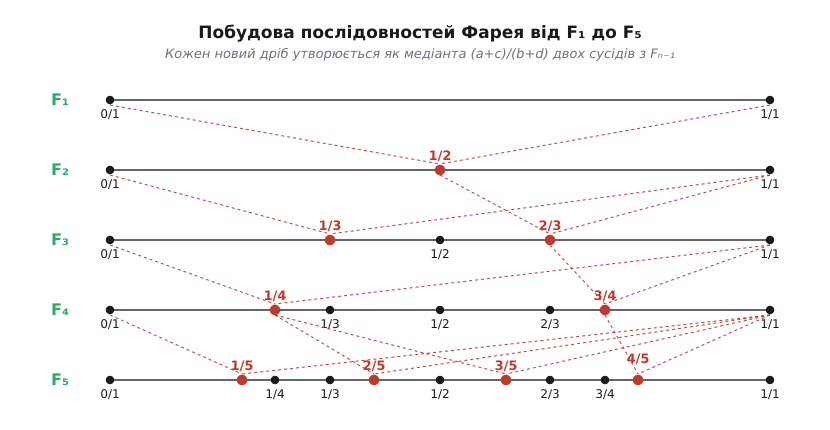
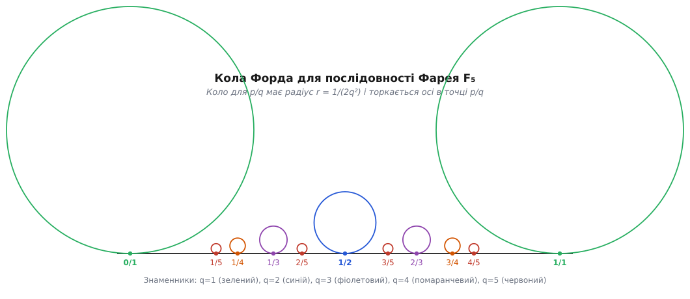
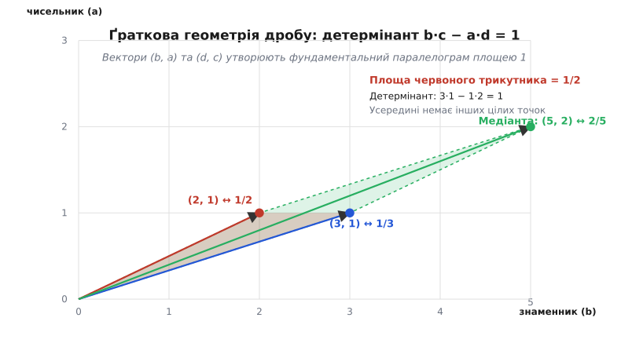

# Послідовності Фарея

<preknowlist>
- [Алгоритм Евкліда](root:math-number-theory/gcd-euclidean) — послідовне ділення з остачею, яким шукають найбільший спільний дільник та перевіряють взаємну простоту чисельника й знаменника.
- [Співвідношення Безу](root:math-number-theory/bezout-identity) — розв'язок цілочислового лінійного рівняння; саме воно задає фундаментальну тотожність для сусідніх дробів Фарея.
- [Функція Ейлера](root:math-number-theory/euler-totient) — кількість цілих чисел, взаємно простих із даним; вона визначає кількість нових дробів на кожному рівні та загальну довжину послідовності.
- [Ланцюгові дроби](root:math-number-theory/continued-fractions) — ієрархія найкращих раціональних наближень; послідовності Фарея утворюють повну ґратчасту мережу, через яку пролягають підхідні дроби.
- [Дзета-функція Рімана](root:math-analysis/riemann-zeta-function) — фундаментальна функція теорії чисел; її гіпотеза про нулі логічно еквівалентна точним оцінкам рівномірності розподілу дробів Фарея.
</preknowlist>

Кожен, хто намагався впорядкувати звичайні дроби за величиною, знає, наскільки безладним та непередбачуваним здається цей процес на перший погляд. Якщо взяти дроби зі знаменниками від 1 до 5 і просто виписати їх підряд у порядку зростання знаменників — 1/2, 1/3, 2/3, 1/4, 3/4, 1/5, 2/5, 3/5, 4/5, — вони нагадують хаотичний набір чисел, де знаменники стрибають без жодної закономірності, а відносні величини значень не мають видимої поверхневої структури. Проте якщо відкинути скоротні дроби (як-от 2/4 чи 3/6), залишити лише нескоротні на відрізку від 0 до 1 і розставити їх суворо за зростанням самого числового значення, перед нами відкривається одна з найдивовижніших та найгармонійніших структур всієї теорії чисел.

Цей впорядкований список називають **послідовністю Фарея**. На перший погляд це лише акуратний каталог раціональних чисел із обмеженим знаменником. Але варто придивитися до будь-якої пари сусідніх дробів у цьому списку, як вириваються вражаючі арифметичні тотожності: різниця між будь-якими двома сусідніми дробами завжди дорівнює одиниці, поділеній на добуток їхніх знаменників, а кожен новий дріб утворюється як простий сумарний «гібрид» своїх сусідок. Послідовності Фарея згадуються не лише в чистому аналізі: вони описують точну геометрію неперервних кіл, розв'язують задачі розрахунку зупчастостей у механічних годинниках і навіть виявляються логічно еквівалентними найвидатнішій нерозв'язаній проблемі сучасної математики — гіпотезі Рімана.

### Неперервний порядок звичайних дробів

Сформулюймо точне математичне означення. **Послідовністю Фарея порядку `n`** (позначається `Fₙ`) називається впорядкована за зростанням послідовність усіх нескоротних звичайних дробів `a/b` на відрізку `[0, 1]`, знаменники яких не перевищують `n`.

Чисельник `a` та знаменник `b` є цілими додатними числами, причому `0 ≤ a ≤ b ≤ n`, а їхній найбільший спільний дільник дорівнює одиниці: `НСД(a, b) = 1`. Послідовність завжди починається з граничного дробу `0/1` і закінчується дробом `1/1`.

Випишемо перші п'ять послідовностей Фарея, щоб наочно побачити, як вони розростаються та збагачуються з кожним новим кроком збільшення граничного знаменника:

```
F₁:  0/1,  1/1

F₂:  0/1,  1/2,  1/1

F₃:  0/1,  1/3,  1/2,  2/3,  1/1

F₄:  0/1,  1/4,  1/3,  1/2,  2/3,  3/4,  1/1

F₅:  0/1,  1/5,  1/4,  1/3,  2/5,  1/2,  3/5,  2/3,  3/4,  4/5,  1/1
```

Придивімося уважно до того, що відбувається при переході від одного порядку до наступного.
- У `F₁` є лише два крайні дроби: `0/1` та `1/1`.
- При переході від `F₁` до `F₂` посередині між `0/1` та `1/1` вискакує новий дріб `1/2`.
- При переході до `F₃` з'являються два нові дроби `1/3` (між `0/1` та `1/2`) та `2/3` (між `1/2` та `1/1`).
- При переході до `F₄` додаються `1/4` та `3/4`. Дріб `2/4` тут відсутній, оскільки він скорочується до `1/2` і вже зайняв своє місце на попередньому рівні.
- У `F₅` додаються чотири нові дроби зі знаменником 5: `1/5`, `2/5`, `3/5` та `4/5`.

Уже на цих простих прикладах виразно вимальовуються дві фундаментальні властивості.

По-перше, кожна послідовність Фарея є суворо симетричною відносно центрального значення `1/2`. Якщо у списку присутній дріб `a/b`, то симетрично праворуч від `1/2` на тій самій відстані обов'язково стоїть дріб `(b−a)/b`. Наприклад, для `1/5` симетричною парою є `(5−1)/5 = 4/5`, а для `1/3` — дріб `(3−1)/3 = 2/3`.

По-друге, нові дроби ніколи не виникають хаотично в довільних місцях. Вони завжди проростають у чітко визначених «щілинах» між наявними сусідніми членами попереднього порядку, причому знаменник нового дробу дорівнює точній сумі знаменників його лівого та правого сусідів.

### Фундаментальна тотожність сусідів: детермінант Безу

Візьмімо будь-які два **сусідні** дроби у послідовності `F₅`. Наприклад, дроби `1/3` та `2/5`. Порахуємо їхній перехресний добуток — помножимо чисельник першого на знаменник другого і віднімемо добуток знаменника першого на чисельник другого:

```
3·2 − 1·5 = 6 − 5 = 1
```

Візьмімо іншу сусідню пару з `F₅`: `2/5` та `1/2`. Порахуємо перехресне значення знову:

```
5·1 − 2·2 = 5 − 4 = 1
```

Спробуємо ще одну сусідню пару з правого крила `F₅`: `3/4` та `4/5`:

```
4·4 − 3·5 = 16 − 15 = 1
```

Це не збіг і не примха перших п'яти рівнів. Це головна фундаментальна теорема про послідовності Фарея: **якщо `a/b` та `c/d` — два послідовні дроби у послідовності `Fₙ` такі, що `a/b < c/d`, то їхній перехресний детермінант завжди дорівнює точно одиниці**:

```
b·c − a·d = 1
```

Цю рівність називають **детермінантною тотожністю Фарея**. З неї миттєво випливає низка глибоких наслідків, які визначають усю арифметику раціональних чисел на відрізку.

По-перше, якщо поділити обидві частини тотожності `b·c − a·d = 1` на добуток знаменників `b·d`, ми дістанемо точний вираз для відстані між будь-якими двома сусідніми членами у послідовності:

```
c/d − a/b = (b·c − a·d) / (b·d) = 1 / (b·d)
```

Відстань між будь-якими двома сусідніми дробами Фарея дорівнює `1/(b·d)`. Це означає, що чим більші знаменники сусідніх дробів, тим щільніше вони притиснуті один до одного. Більше того, ця відстань є **найменшою можливою** відстанню між будь-якими двома різними дробами зі знаменниками, не більшими за `b` та `d`.

По-друге, тотожність `b·c − a·d = 1` є не що інше, як [співвідношення Безу](root:math-number-theory/bezout-identity) для чисел `b` та `d`. Оскільки ціла лінійна комбінація `b·c + d·(−a) = 1` дорівнює одиниці, це автоматично гарантує, що знаменники сусідніх дробів Фарея `b` та `d` є **взаємно простими**: `НСД(b, d) = 1`. Сусідні дроби у послідовності Фарея ніколи не можуть мати спільних дільників у знаменниках.

По-третє, якщо ми шукаємо розв'язок діофантового рівняння `b·x − a·y = 1` для даного дробу `a/b`, то чисельник і знаменник його правого сусіда `c/d` у послідовності Фарея дають готовий найменший додатний розв'язок `x = c`, `y = d`. Це наочно пов'язує послідовності Фарея із теорією [ланцюгових дробів](root:math-number-theory/continued-fractions), де аналоги тотожності Безу виконуються для підхідних дробів.

### Медіанта та народження нових елементів

Як саме утворюються нові члени послідовності при переході від `Fₙ₋₁` до `Fₙ`? У шкільній арифметиці додавати дроби за правилом «чисельник плюс чисельник, знаменник плюс знаменник» вважається грубою помилкою: `1/2 + 1/3 ≠ 2/5`. Але в теорії чисел ця операція має власне ім'я і відіграє фундаментальну роль.

Число, утворене за таким правилом із двох дробів `a/b` та `c/d`, називається **медіантою** (або дробовою сумою):

```
a     c     a + c
─  ⊕  ─  =  ─────
b     d     b + d
```

Медіанта має чудову властивість: вона **завжди лежить суворо між вихідними дробами**. Якщо `a/b < c/d`, то:

```
a     a + c     c
─  <  ─────  <  ─
b     b + d     d
```

Перевірити це нескладно. Віднімемо лівий дріб від медіанти: `(a+c)/(b+d) − a/b = (b·c − a·d) / (b·(b+d)) = 1 / (b·(b+d)) > 0`. Аналогічно віднімання медіанти від правого дробу дає `c/d − (a+c)/(b+d) = 1 / (d·(b+d)) > 0`.

Тепер ми можемо повністю описати механізм побудови послідовностей Фарея: **кожен новий дріб, який з'являється у `Fₙ` при збільшенні порядку `n`, є медіантою двох сусідніх дробів із попередньої послідовності `Fₙ₋₁`**, причому сума знаменників цих сусідів дорівнює точно `n`: `b + d = n`.


*Схема побудови послідовностей Фарея від F₁ до F₅. Червоними точками виділено нові дроби, що з'являються на кожному рівні. Пунктирні стрілки показують, як кожен новий дріб утворюється як медіанта (a+c)/(b+d) двох батьківських дробів із попереднього рівня.*

Погляньмо на схему побудови. У `F₁` ми маємо лише `0/1` та `1/1`. Їхня медіанта дорівнює `(0+1)/(1+1) = 1/2`. Вона має знаменник 2 і стає єдиним новим елементом у `F₂`.

Далі у `F₂` маємо дві пари сусідів: `(0/1, 1/2)` та `(1/2, 1/1)`.
- Медіанта першої пари: `(0+1)/(1+2) = 1/3` (знаменник 3).
- Медіанта другої пари: `(1+1)/(2+1) = 2/3` (знаменник 3).
Обидва нові дроби вставляються у свої щілини, утворюючи `F₃`.

У `F₃` маємо чотири пари сусідів:
- `(0/1, 1/3)` → медіанта `1/4` (знаменник 4, входить у `F₄`).
- `(1/3, 1/2)` → медіанта `(1+1)/(3+2) = 2/5` (знаменник 5, у `F₄` не входить, бо 5 > 4; чекає на `F₅`!).
- `(1/2, 2/3)` → медіанта `3/5` (знаменник 5, чекає на `F₅`!).
- `(2/3, 1/1)` → медіанта `3/4` (знаменник 4, входить у `F₄`).

Отже, у `F₄` додаються `1/4` та `3/4`, а на наступному кроці у `F₅` проростають `2/5` та `3/5`, а також нові медіанти `1/5` (від `0/1` та `1/4`) і `4/5` (від `3/4` та `1/1`).

Цей процес вставки медіант є безперервним і фрактальним. Якщо збудувати повне дерево усіх можливих медіант, ми дістанемо знамените **дерево Стерна — Броко**, яке містить геть усі додатні раціональні числа, причому кожне з них зустрічається у дереві рівно один раз. Детальні строгі доведення всіх цих тотожностей зібрані у вставці про [математичні доведення властивостей послідовностей Фарея](root:math-number-theory/farey-sequences/math-farey-properties.md).

### Геометрія кіл Форда та ґратка цілих чисел

Арифметика послідовностей Фарея має вражаюче геометричне втілення, яке у 1938 році відкрив американський математик Лестер Форд.

Уявімо декартову систему координат. На осі абсцис `Ox` для кожного нескоротного дробу `p/q` побудуємо коло, яке дотикається до осі `Ox` у точці `(p/q, 0)` і лежить у верхній півплощині. Радіус цього кола оберемо рівним:

```
r = 1 / (2·q²)
```

Таке коло називають **колом Форда** і позначають `C(p/q)`. Для дробу `0/1` радіус дорівнює `1/2`, а центр лежить у точці `(0, 1/2)`. Для `1/1` центр у `(1, 1/2)` з радіусом `1/2`. Для `1/2` радіус дорівнює `1/(2·2²) = 1/8`, центр у `(1/2, 1/8)`. Для дробів зі знаменником 5 радіус стає зовсім крихітним: `1/(2·25) = 1/50`.


*Геометрія кіл Форда для послідовності Фарея F₅. Кожне коло торкається числової осі в точці відповідного дробу p/q. Кола сусідніх дробів Фарея дотикаються одне одного зовні, утворюючи нескінченну мережу заповнення без перетинів.*

Подивіться на побудовані кола Форда. Вони мають дивовижні геометричні властивості:

1. **Жодні два кола Форда ніколи не перетинаються з накладанням внутрішніх областей.** Вони або не мають спільних точок взагалі, або дотикаються зовні у єдиній точці.
2. **Два кола Форда `C(a/b)` та `C(c/d)` дотикаються одне одного тоді й лише тоді, коли дроби `a/b` та `c/d` є сусідніми у деякій послідовності Фарея** (тобто `b·c − a·d = 1`).
3. Точка дотику двох кіл `C(a/b)` та `C(c/d)` має координати:
   ```
   x_touch = (a·b + c·d) / (b² + d²)
   y_touch = 1 / (b² + d²)
   ```
   Вона лежить безпосередньо над їхньою медіантою `(a+c)/(b+d)`! Нове коло Форда для медіанти вклинюється точно у вигнутий трикутний зазор між двома батьківськимиколами та числовою віссю, дотикаючись до обох батьків і до осі одночасно.

Геометрія кіл Форда має глибинний зв'язок із дробово-лінійними перетвореннями Мебіуса `z ↦ (a·z + b)/(c·z + d)` модулярної групи `PSL(2, ℤ)`. Кожне коло Форда утворюється як образ фундаментального верхнього кола `y = 1` під дією відповідної матриці модулярної групи.

Існує ще один геометричний погляд на детермінант Фарея — через **ґратку цілих точок** `ℤ²`. Зобразімо кожен дріб `a/b` як вектор на площині з координатами `(b, a)` — де горизонтальна вісь відповідає знаменнику `b`, а вертикальна — чисельнику `a`.


*Ґраткова інтерпретація послідовності Фарея. Дроби 1/3 та 1/2 відповідають векторам (3, 1) та (2, 1). За теоремою Піка площа трикутника між ними дорівнює 1/2, а усередині немає жодної іншої цілочислової точки. Медіанта 2/5 є векторною сумою (5, 2).*

У цій ґратці тотожність `b·c − a·d = 1` має чистий векторний зміст. Визначник матриці, складеної з двох векторів `(b, a)` та `(d, c)`, дорівнює `b·c − a·d = 1`. За геометричним змістом визначника це означає, що паралелограм, побудований на цих векторах, має **площу, яка точно дорівнює 1**.

Розглянемо трикутник з вершинами у початку координат `(0,0)` та точках `(b,a)` і `(d,c)`. Його площа дорівнює точно `S = 1/2`. За теоремою Піка для площі многокутника на цілочисловій ґратці `S = I + B/2 − 1` (де `I` — кількість внутрішніх цілих точок, `B` — кількість цілих точок на межі). Оскільки `S = 1/2` і три вершини дають `B ≥ 3`, то єдиним розв'язком є `I = 0` та `B = 3`.

Це доводить, що усередині трикутника між двома сусідніми векторами Фарея та на його відрізках-сторонах **немає жодної іншої цілочислової точки**, крім самих трьох вершин! Вектори сусідніх дробів Фарея утворюють унімодулярний фундаментальний базис усієї цілочислової ґратки.

### Довжина послідовності та зв'язок із функцією Ейлера

Скільки всього дробів містить послідовність Фарея `Fₙ`?

На кожному кроці `k` від 1 до `n` у послідовність додаються нові дроби вигляду `h/k`, де чисельник `h` знаходиться в межах від 1 до `k` і є взаємно простим із `k`. За означенням кількість таких чисельників `h` — це значення [функції Ейлера](root:math-number-theory/euler-totient) `φ(k)`.

Додаючи початковий дріб `0/1`, отримуємо точну формулу для кількості елементів `|Fₙ|`:

```
|Fₙ| = 1 + ∑ₖ₌₁ⁿ φ(k)
```

Порахуймо довжину перших п'яти послідовностей за цією формулою:
- `|F₁| = 1 + φ(1) = 1 + 1 = 2` (дроби `0/1, 1/1`)
- `|F₂| = |F₁| + φ(2) = 2 + 1 = 3` (додався `1/2`)
- `|F₃| = |F₂| + φ(3) = 3 + 2 = 5` (додалися `1/3, 2/3`)
- `|F₄| = |F₃| + φ(4) = 5 + 2 = 7` (додалися `1/4, 3/4`)
- `|F₅| = |F₄| + φ(5) = 7 + 4 = 11` (додалися `1/5, 2/5, 3/5, 4/5`)

Для великих `n` обчислювати точну суму функції Ейлера довго, але в теорії чисел добре відома її асимптотична поведінка. За допомогою обернення Мебіуса доводиться, що середня сума функції Ейлера зростає як `(3/π²)·n²`. Отже, при `n → ∞`:

```
|Fₙ| ≈ (3 / π²) · n² + O(n · log n) ≈ 0.30396 · n²
```

Звідки тут береться число `π`? Константа `6/π²` — це знамените значення `1/ζ(2)` (де `ζ` — [Дзета-функція Рімана](root:math-analysis/riemann-zeta-function)), яке дорівнює ймовірності того, що два випадково обрані цілі числа виявляться взаємно простими. Оскільки ми обираємо лише взаємно прості пари `(a, b)`, частка таких пар серед усіх `n²` можливих комбінацій чисельників і знаменників прямує саме до `3/π²` (половина від `6/π²`, бо `a ≤ b`).

### Послідовне генерування членів без збереження списку

Завдяки тричленовій рекурентній формулі послідовність Фарея `Fₙ` можна згенерувати від початку до кінця **без збереження списку у пам'яті** і без жодного сортування.

Якщо ми знаємо два послідовні дроби `a/b` та `c/d` у `Fₙ`, то наступний дріб `e/f` обчислюється за прямим цілочисловим правилом:

```
k = ⌊ (n + b) / d ⌋
e = k·c − a
f = k·d − b
```

Тут `⌊ ⌋` означає операцію взяття цілої частини (цілочислове ділення).

Простежимо роботу цього правила на прикладі `F₅`, знаючи перші два члени `a/b = 0/1` та `c/d = 1/5`:
1. `k = ⌊ (5 + 1) / 5 ⌋ = ⌊ 6 / 5 ⌋ = 1`.
2. `e = 1·1 − 0 = 1`.
3. `f = 1·5 − 1 = 4`.
   Отримали наступний дріб `1/4`!

Тепер зсуваємо вікно: нове `a/b = 1/5`, нове `c/d = 1/4`:
1. `k = ⌊ (5 + 5) / 4 ⌋ = ⌊ 10 / 4 ⌋ = 2`.
2. `e = 2·1 − 1 = 1`.
3. `f = 2·4 − 5 = 3`.
   Отримали наступний дріб `1/3`!

І так далі, дріб за дробом, аж поки вихідний дріб не досягне `1/1`.

Цей алгоритм має складність по пам'яті `O(1)` — йому потрібно лише шість цілочислових змінних (`a, b, c, d, e, f`). Часова складність є строго лінійною від кількості елементів `O(|Fₙ|) = O(n²)`, причому на кожен дріб витрачається лише кілька базових арифметичних операцій. Повний розбір алгоритму та готова програма наведено у вставці про [генератор послідовностей Фарея та раціональне наближення на C та C++](root:math-number-theory/farey-sequences/proj-farey-generator.md).

### Рівномірний розподіл та гіпотеза Рімана

Якщо завдати питання: «Наскільки рівномірно дроби Фарея розсипані по відрізку `[0, 1]`?», ми несподівано потрапимо на найглибший рівень сучасної математики.

Уявімо ідеальну рівномірну сітку з `N` точок на відрізку `[0, 1]`, де `k`-та точка дорівнює `k / N`. Позначимо `k`-тий дріб у послідовності Фарея `Fₙ` як `rₖ`. Якщо обчислити суму відхилень реальних дробів Фарея від ідеально рівномірних точок:

```
Δₙ = ∑ₖ₌₁ᴺₙ | rₖ − k / Nₙ |
```

то виявиться, що ця сума відхилень прямує до нуля при зростанні `n`. У 1924 році французький математик Жером Франель та німецький математик Едмунд Ландау довели фундаментальну теорему: **швидкість спадання суми відхилень `Δₙ` безпосередньо пов'язана з розміщенням нулів дзета-функції Рімана**.

Зокрема, твердження про те, що для будь-якого `ε > 0` відхилення має оцінку:

```
Δₙ = O(n¹ᐟ² ⁺ 𝜀)
```

є **логічно еквівалентним [Дзета-функції Рімана](root:math-analysis/riemann-zeta-function)** (а саме її гіпотезі про критичну пряму) — найважливішій відкритій проблемі теорії чисел про те, що всі нетривіальні нулі дзета-функції лежать на критичній прямій `Re(s) = 1/2`.

Таким чином, якщо хтось доведе, що дроби Фарея відхиляються від ідеально рівномірного розподілу не швидше ніж `n¹ᐟ² ⁺ 𝜀`, це буде прямим і повним доведенням гіпотези Рімана.

> 🔧 **Навіщо це.**
> Послідовності Фарея та дерева медіант — це не лише абстрактна теорія чисел, а й потужний практичний інструмент прикладного інженера:
>
> 1. **Механіка та підбір зупчастостей:** При проектуванні годинникових механізмів, аналогових арифмометрів або коробки передач токарного верстата потрібне передавальне відношення `x` (наприклад, `π` або `√2`). Але кількість зубців на шестерні `b` обмежена фізичними габаритами (наприклад, `b ≤ 100`). Бінарний пошук по дереву Фарея миттєво знаходить дріб `a/b` з `b ≤ 100`, який дає найменшу похибку передавального числа.
> 2. **Цифровий синтез частот (DDS):** У цифрових генераторах сигналів вихідна частота формується кроком накопичувача фази, який є дробовою часткою від тактової частоти. Дроби Фарея задають сітку доступних точних частот без фазового джитера.
> 3. **Комп'ютерна графіка та розкладання ліній:** Класичний алгоритм Брезенхема для малювання відрізків на піксельній сітці використовує раціональні кроки, які дискретизують нахил лінії. Дроби Фарея описують усі можливі періодичні сходинки пікселів при похилому малюванні без протиаліасингу.
> 4. **Раціональна реконструкція:** У комп'ютерній алгебрі при обчисленнях за модулем великих простих чисел вихідний результат є цілим числом. Перетворення цього числа назад у чесний дріб `a/b` виконується саме алгоритмом Фарея / Евкліда.

Детальнішу розвідку про шлях від податкових таблиць Наполеонівської епохи до сучасних відкриттів дивіться в [історії відкриття та курйозу з іменем Фарея](root:math-number-theory/farey-sequences/hist-farey-haros.md).
