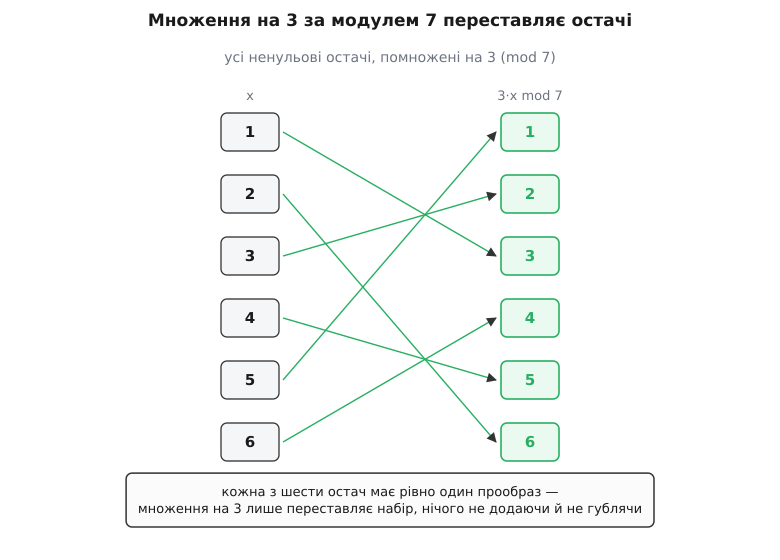
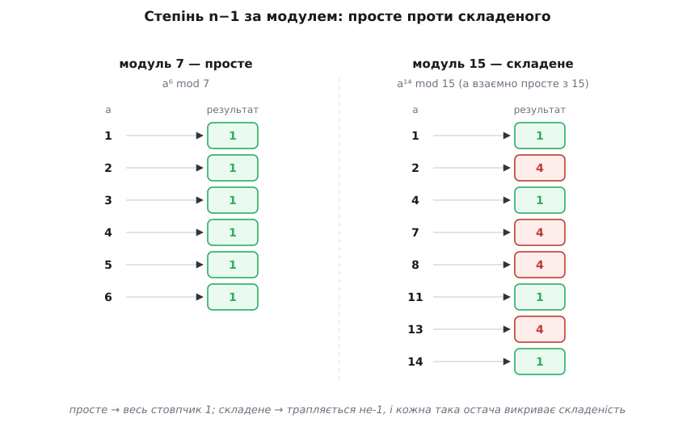
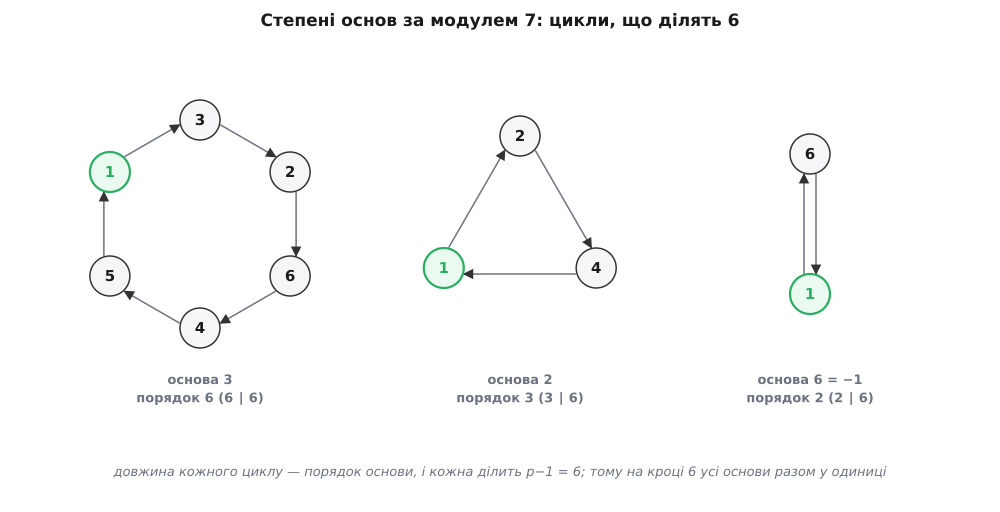

# Мала теорема Ферма

<preknowlist>
- [Модульна арифметика](root:math-number-theory/modular-arithmetic) — запис a ≡ b (mod n) («однакова остача при діленні на n») і дії з остачами: додавання, множення, піднесення до степеня можна вести прямо на остачах.
- [Прості числа](root:math-number-theory/prime-numbers) — число, що ділиться лише на 1 і на себе; вирішальна властивість: якщо просте p ділить добуток a·b, то воно ділить хоча б один із множників.
- [НСД і взаємна простота](root:math-number-theory/gcd-euclidean) — коли найбільший спільний дільник двох чисел дорівнює 1, вони не мають спільного простого множника.
</preknowlist>

**Візьмімо просте число, скажімо 7, і піднесімо до шостого степеня будь-яке число, що на 7 не ділиться.**

```
2⁶ = 64    = 7·9    + 1
3⁶ = 729   = 7·104  + 1
4⁶ = 4096  = 7·585  + 1
5⁶ = 15625 = 7·2232 + 1
```

Щоразу остача — одиниця. Числа настільки різні, як 2 і 5, піднесені до того самого шостого степеня, приходять до тієї самої одиниці. Це не примха сімки: візьміть 11, піднесіть будь-що взаємно просте з 11 до десятого степеня — знову остача 1; візьміть 13, десятий замініть на дванадцятий — знову 1. Складається правило: для простого p кожне число a, не кратне p, піднесене до степеня p−1, дає остачу 1 при діленні на p.

Дивує тут ось що: остача **забуває, з якого числа ми почали**. Різні a, спільна відповідь. Отже, у самій будові простого числа закладено щось, що зрівнює всі його ненульові остачі, тільки-но їх достатньо розкрутити степенем. Знайти це «щось» — і є мета.

## Дві подоби одного твердження

Правило записують так:

```
aᵖ⁻¹ ≡ 1 (mod p),   якщо p просте і p не ділить a
```

Умова «p не ділить a» тут необхідна: якщо a кратне p, то й будь-який його степінь кратний p, остача завжди 0, ніякої одиниці. Тому число a мусить бути взаємно простим із p — а для простого p це те саме, що «не ділиться на p».

Ту саму теорему часто пишуть в іншій, безумовній подобі:

```
aᵖ ≡ a (mod p),   для будь-якого цілого a
```

Ці два записи — одне твердження, просто помножене на a. Якщо aᵖ⁻¹ ≡ 1, то, домноживши обидві частини на a, дістанемо aᵖ ≡ a. А коли a кратне p, обидві частини останнього рядка дорівнюють 0 за модулем p, тож рівність тримається й тут — тому друга подоба обходиться геть без умов і охоплює всі цілі числа заразом. У зворотний бік: якщо aᵖ ≡ a і при цьому a взаємно просте з p, то на a можна [скоротити](root:math-number-theory/modular-inverse) (воно оборотне за модулем p), і лишається aᵖ⁻¹ ≡ 1. Отже, обидві подоби рівносильні; перша говорить про степінь p−1 і вимагає взаємної простоти, друга говорить про степінь p і не вимагає нічого. Далі доводитимемо першу — вона прозоріша.

## Чому інакше не могло бути

Уся сила доведення в одному спостереженні, яке варто побачити, перш ніж формулювати. Візьмімо всі ненульові остачі за модулем p — числа

```
1, 2, 3, …, p−1
```

і помножмо кожне з них на наше a, а результат зведімо за модулем p. Вийде новий набір: a·1, a·2, …, a·(p−1), кожне взяте за модулем p. Стверджую: цей новий набір — **ті самі числа 1, 2, …, p−1, лише переставлені в іншому порядку**. Множення на a перетасовує остачі, але не додає й не губить жодної.

Щоб у це повірити, треба переконатися у двох речах — і кожна з них тримається саме тому, що p просте.

**Жодне a·k не перетворюється на нуль.** Якби a·k ділилося на p, то, оскільки p просте, воно мусило б ділити або a, або k. Але a на p не ділиться (це наша умова), а k лежить між 1 і p−1, тож і воно на p не кратне. Простий множник нізвідки взятися не може — отже, кожне a·k за модулем p лишається серед ненульових остач 1 … p−1.

**Ніякі два з них не збігаються.** Припустимо, що a·i та a·j дають однакову остачу, тобто a·i ≡ a·j (mod p). Тоді p ділить різницю a·(i − j). Знову: p просте, a на нього не ділиться — значить, p ділить (i − j). Але i та j обидва між 1 і p−1, їхня різниця за абсолютною величиною менша за p, і єдина кратна p різниця, менша за p, — це нуль. Отже, i = j. Різні входи дають різні виходи.



*Множення на 3 за модулем 7 переводить набір {1,2,3,4,5,6} сам у себе, лише переставляючи його; стрілки — це бієкція, у якій кожна остача має рівно один прообраз.*

Отже, набір a·1, a·2, …, a·(p−1) за модулем p — це перестановка набору 1, 2, …, p−1. А перестановка не змінює добутку: перемножити ті самі числа в іншому порядку — дістати те саме. Прирівняймо два добутки:

```
(a·1)·(a·2)·…·(a·(p−1))  ≡  1·2·…·(p−1)   (mod p)
```

Ліворуч кожен множник несе по одному a; винесімо всі p−1 екземплярів a за дужку:

```
aᵖ⁻¹ · (1·2·…·(p−1))  ≡  1·2·…·(p−1)   (mod p)
```

Ліворуч і праворуч стоїть той самий спільний множник — добуток 1·2·…·(p−1). Кожне з чисел 1 … p−1 взаємно просте з p, тож і весь їхній добуток взаємно простий із p, а отже, [оборотний за модулем p](root:math-number-theory/modular-inverse) — на нього можна скоротити обидві частини. Лишається

```
aᵖ⁻¹ ≡ 1 (mod p)
```

Це й є мала теорема Ферма. Уся вона трималася на тому, що множення на взаємно просте з p число лише переставляє ненульові остачі, — а це, своєю чергою, трималося на простоті p у двох місцях: там, де ми забороняли нуль, і там, де забороняли збіг.

**Простежмо доведення на p = 7, a = 3.** Помножмо кожну остачу від 1 до 6 на 3 і зведімо за модулем 7:

```
3·1 = 3
3·2 = 6
3·3 = 9  ≡ 2
3·4 = 12 ≡ 5
3·5 = 15 ≡ 1
3·6 = 18 ≡ 4
```

Вийшло {3, 6, 2, 5, 1, 4} — та сама шістка {1, 2, 3, 4, 5, 6}, лише в іншому порядку. Перемножмо все:

```
(3·1)(3·2)(3·3)(3·4)(3·5)(3·6) ≡ 1·2·3·4·5·6   (mod 7)
3⁶ · (1·2·3·4·5·6)             ≡ 1·2·3·4·5·6   (mod 7)
3⁶                             ≡ 1             (mod 7)
```

Скоротили спільний добуток (він взаємно простий із 7) — і дістали 3⁶ ≡ 1. Пряма перевірка: 3⁶ = 729 = 7·104 + 1. Збіглося.

> 🔧 **Навіщо це.** Доведення не лише переконує — воно показує, звідки береться одиниця: вона зростає з того, що ненульові остачі простого модуля утворюють замкнену на множення систему, у якій кожен елемент оборотний. Ця система — арифметичний кістяк усього, що працює «за простим модулем»: від дискретного логарифма в криптографії до кодів, що виправляють помилки. Теорема Ферма — перше й найдешевше твердження про її будову.

Це доведення — не єдине. Ту саму рівність можна дістати комбінаторним підрахунком намистин на разку або індукцією за a через розкриття (a+1)ᵖ, і кожен шлях висвітлює теорему з іншого боку; ці [два додаткові доведення](root:math-number-theory/fermat-little-theorem/math-more-proofs.md) зібрано окремо, щоб не переривати головну нитку.

## Де саме входить простота — і що без неї

Кожен крок доведення спирався на те, що p просте. Прибираймо цю умову — і подивімось, як усе розсипається. Візьмімо складене n = 15 і число a = 2, взаємно просте з 15 (спільних дільників у них немає, умову «взаємної простоти» дотримано). Порахуймо 2¹⁴ за модулем 15:

```
2⁴ = 16 ≡ 1 (mod 15)
2¹⁴ = 2¹² · 2² = (2⁴)³ · 2² ≡ 1³ · 4 = 4 (mod 15)
```

Остача — 4, а не 1. Формула aⁿ⁻¹ ≡ 1 зламалася, дарма що a взаємно просте з n. Причина видна з доведення: коли n складене, множення на a вже не конче переставляє всі остачі. Аргумент «жодне a·k не нуль» падає, щойно n має власні дільники — добуток двох ненульових остач може стати нулем (наприклад, 3·5 ≡ 0 за модулем 15), і набір a·1, …, a·(n−1) вже не зобов'язаний накривати всі остачі. Простота — не окраса умови, а те єдине, що робить перетасовку повною.

Але спостереження за 15 підказує й ліки. Одиницю дав не чотирнадцятий степінь, а четвертий: 2⁴ ≡ 1. І це не випадковість — правильний показник для складеного модуля не n−1, а кількість остач, взаємно простих із n. Для 15 таких остач вісім (це 1, 2, 4, 7, 8, 11, 13, 14), і восьмий степінь будь-якої з них дає одиницю. Цю кількість позначають φ(n) і називають [функцією Ейлера](root:math-number-theory/euler-totient); загальне твердження — теорема Ейлера — каже, що aᶠ⁽ⁿ⁾ ≡ 1 (mod n) для будь-якого a, взаємно простого з n. Мала теорема Ферма — її окремий випадок: коли p просте, взаємно простими з ним є всі остачі від 1 до p−1, тобто φ(p) = p−1, і теорема Ейлера перетворюється рівно на aᵖ⁻¹ ≡ 1.



*Ліворуч простий модуль: усі ненульові остачі, піднесені до p−1, дають 1. Праворуч складений: навіть серед взаємно простих остач знаходяться такі, чий (n−1)-й степінь не 1 — саме на цій відмінності будують тест на простоту.*

## Порядок остачі: чому одиниця настає саме на p−1

Теорема Ферма стверджує, що aᵖ⁻¹ ≡ 1, але часто одиниця приходить раніше. Для 2 за модулем 7 маємо 2¹ = 2, 2² = 4, 2³ = 8 ≡ 1 — одиниця вже на третьому кроці, і далі все повторюється з періодом 3. Найменший додатний степінь, на якому a вперше стає одиницею, називають [мультиплікативним порядком](root:math-number-theory/multiplicative-order) числа a за модулем p. Для 2 за модулем 7 порядок дорівнює 3; для 3 за модулем 7 — аж 6 (одиниця настає щойно на шостому кроці).

Як тоді порядок 3 узгоджується з Ферма, що обіцяє одиницю на шостому степені? Дуже просто: якщо 2³ ≡ 1, то 2⁶ = (2³)² ≡ 1² = 1. Тобто щойно остача повернулася до одиниці, вона повертатиметься до неї на кожному кратному кроці. А Ферма гарантує повернення на кроці p−1. Обидва факти сумісні лише тоді, коли **порядок ділить p−1**: цикл степенів має вкластися в p−1 крок націло, без залишку, інакше шостий степінь не влучив би точно в одиницю.



*Кожна основа котиться своїм замкненим циклом остач; довжина циклу — це порядок основи, і кожна з довжин ділить p−1 = 6. Тому на кроці 6 усі основи одночасно опиняються в одиниці.*

Чому порядок неодмінно ділить p−1 — видно з тієї самої перестановки, що дала теорему, але це вже мова про будову: ненульові остачі за простим модулем утворюють [групу за множенням](root:math-algebra/group-theory), у якій рівно p−1 елемент, і теорема Ферма — окремий випадок загального закону Лагранжа, що порядок будь-якого елемента групи ділить кількість елементів у ній. З цієї висоти рівність aᵖ⁻¹ ≡ 1 читається однією фразою: піднести елемент до степеня, що дорівнює розміру групи, — те саме, що не зробити нічого.

## Навіщо теорема потрібна

Мала теорема Ферма — не курйоз про остачі, а робочий інструмент, і працює вона в трьох різних напрямках.

**Приборкати велетенський показник.** Нехай треба знайти остачу від 3¹⁰⁰⁰⁰⁰⁰ при діленні на 7. Пряме піднесення дало б число з півмільйона цифр. Але 3⁶ ≡ 1, тож степені трійки повторюються з періодом 6, і важливо лише, скільки лишається від показника при діленні на 6:

```
1000000 = 6·166666 + 4
3¹⁰⁰⁰⁰⁰⁰ = 3⁶·¹⁶⁶⁶⁶⁶ · 3⁴ = (3⁶)¹⁶⁶⁶⁶⁶ · 3⁴ ≡ 1 · 3⁴ (mod 7)
3⁴ = 81 = 7·11 + 4
```

Отже, 3¹⁰⁰⁰⁰⁰⁰ ≡ 4 (mod 7) — відповідь за три рядки замість неосяжного множення. Загальне правило: показник степеня можна брати за модулем p−1, коли основа взаємно проста з p. Разом зі [швидким піднесенням до степеня за модулем](root:math-number-theory/modular-exponentiation) це основа всіх обчислень із великими степенями.

**Знайти обернений елемент.** Ділення за модулем — це множення на [обернений елемент](root:math-number-theory/modular-inverse): щоб «поділити на a», множать на таке a⁻¹, що a·a⁻¹ ≡ 1. Теорема Ферма дає його однією формулою. Оскільки aᵖ⁻¹ ≡ 1, розщепімо один множник:

```
aᵖ⁻¹ = a · aᵖ⁻²  ≡ 1  (mod p)   ⟹   a⁻¹ ≡ aᵖ⁻² (mod p)
```

Наприклад, обернений до 3 за модулем 7:

```
3⁻¹ ≡ 3⁷⁻² = 3⁵ = 243 = 7·34 + 5 ≡ 5 (mod 7)
```

Перевірка: 3·5 = 15 ≡ 1 (mod 7). Одне піднесення до степеня p−2 замінює розв'язання рівняння.

> 🔧 **Навіщо це.** У скінченних полях, на яких стоять сучасна криптографія, коди Ріда — Соломона й хеш-функції, ділити доводиться постійно, а звичайного ділення там немає — є лише множення на обернене. Формула a⁻¹ ≡ aᵖ⁻² перетворює ділення на піднесення до степеня, яке процесор виконує за десятки множень. Це той випадок, коли теорема XVII століття лежить у гарячому циклі коду XXI-го.

**Викрити складене число, не розкладаючи його.** Оберніть теорему як заперечення: якщо для якогось a, взаємно простого з n, виявилося, що aⁿ⁻¹ ≢ 1 (mod n), то n **напевно не просте**. Ми довели складеність, ні на що n не розклавши — самим лише піднесенням до степеня. Для 15 досить основи 2: розрахунок вище дав 2¹⁴ ≡ 4 ≢ 1, і цього достатньо, щоб оголосити 15 складеним, навіть не помітивши розкладу 15 = 3·5. Ось де теорема стає [тестом на простоту Ферма](root:math-number-theory/fermat-little-theorem/proj-fermat-test.md): беремо кілька основ a, підносимо до степеня n−1 за модулем n і дивимось, чи всі дають одиницю.

Пастка в тому, що зворотне неправильне: одиниця ще не доводить простоти. Існують складені n, які прикидаються простими. Найменше з них для основи 2 — це 341 = 11·31: тут 2³⁴⁰ ≡ 1 (mod 341), і тест на основі 2 обманюється. Гірше: є числа, що обманюють **кожну** взаємно просту основу заразом, — [числа Кармайкла](root:math-number-theory/carmichael-function); найменше з них 561 = 3·11·17. Для них aⁿ⁻¹ ≡ 1 для всіх a, взаємно простих із n, попри те що n складене, — тож простий тест Ферма їх узагалі не ловить.

> 🔧 **Навіщо це.** Кожне генерування ключа RSA починається з пошуку великих простих на сотні цифр — таких, що розкласти їх ніхто б не зумів. Знайти їх дає змогу саме проба Ферма (точніше, її посилення — тест Міллера — Рабіна, що затикає діру з числами Кармайкла): за частку секунди відкидаються майже всі складені кандидати. А стійкість самого RSA спирається на теорему Ейлера — те узагальнення малої теореми Ферма на складений модуль n = p·q, з якого виростають [цифровий підпис і шифрування з відкритим ключем](root:sf-security/hash-and-digital-signature).

## Звідки вона взялася

Теорему сформулював П'єр де Ферма в листі до Френікля де Бессі від 18 жовтня 1640 року, ствердивши її для всіх простих і всіх основ — і, за своїм звичаєм, доведення не навів: «я надіслав би вам доведення, коли б не боявся, що воно надто довге». Чи мав він його насправді — невідомо; жодного запису не збереглося. Першу опубліковану доводку дав Леонард Ейлер 1736 року, хоча незалежно від нього по суті те саме доведення раніше, десь до 1683 року, записав у неопублікованому рукописі Ґотфрід Ляйбніц. Назва «мала» (нім. *kleiner Fermatscher Satz*) з'явилася в друку пізно — у «Теорії чисел» Курта Гензеля 1913 року — і потрібна лише щоб не плутати цю елементарну теорему з іншою, [великою (останньою) теоремою Ферма](root:math-number-theory/fermats-last-theorem) про рівняння xⁿ + yⁿ = zⁿ, яку доведено аж 1995 року й яка з малою не має нічого спільного, крім прізвища. [Історія народження теореми](root:math-number-theory/fermat-little-theorem/hist-fermat-1640.md) — з листуванням Ферма, доведеннями Ейлера й розвінчанням легенди про «стародавніх китайців», нібито знали цей факт за дві тисячі років, — заслуговує на окрему розповідь.

Варто спинитися на самому осерді того, що ми знайшли. Умова «a взаємно просте з p» на початку виглядала технічним застереженням. Насправді вона — двері. Тільки-но a взаємно просте з простим p, воно стає оборотним, його степені лягають на замкнене коло скінченної довжини, а сама ця довжина мусить ділити p−1. Мала теорема Ферма — і є той поріг, за яким подільність цілих чисел обертається на струнку мультиплікативну будову простого модуля.
