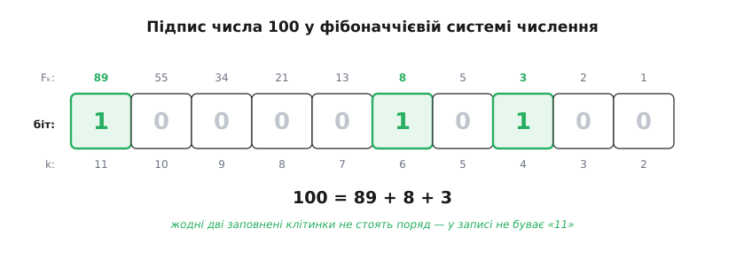

# 🧮 Теорема Цекендорфа: числа Фібоначчі як цифри

Візьміть будь-яке натуральне число — і його можна скласти з чисел Фібоначчі так, щоб жодні два доданки не стояли у вервечці поряд; ба більше, спосіб такий рівно один. Це — теорема Цекендорфа, і вона перетворює 1, 2, 3, 5, 8, 13, … на повноцінні цифри: кожне число дістає єдиний підпис у фібоначчієвій системі числення, а дивне правило «дві одиниці ніколи не торкаються» виявляється не забороною, накинутою ззовні, а неминучим наслідком того, як ці числа влаштовані. (Названа теорема за бельгійцем Едуаром Цекендорфом, чиє доведення вийшло 1972 року, хоча той самий результат надрукував раніше, ще 1952-го, нідерландець Герріт Леккеркеркер — вона носить ім'я не першого, хто її оприлюднив.)

За будівельні цеглини беремо самі числа Фібоначчі, тільки без двох зайвих. Нуль F₀ = 0 до суми нічого не додає, тож його викидаємо. Одиниця в послідовності трапляється двічі (F₁ = F₂ = 1) — лишаємо одну. Отже, цифри — це Fₖ при k ≥ 2:

```
F₂ F₃ F₄ F₅ F₆ F₇  F₈  F₉  F₁₀ F₁₁ F₁₂ …
 1  2  3  5  8 13  21  34  55  89 144 …
```

Слово «несусідні» розуміємо буквально: у сумі ніколи не стоять поряд Fₖ і Fₖ₊₁, тобто вибрані номери різняться щонайменше на два. Уся теорема стверджує, що з таких цеглин кожне натуральне число складається — і складається однозначно.

## Оцінка згори — двигун обох доведень

Одне-єдине твердження живить і існування підпису, і його єдиність:

> Будь-яка сума несусідніх чисел Фібоначчі, у якій найбільший номер не перевищує k, строго менша за Fₖ₊₁.

Тобто скільки б доданків ми не набрали — поки їхні номери не переросли k і поки жодні два не сусідять — уся сума не дотягує до наступного числа Фібоначчі. Доведімо це індукцією по k, спираючись на саме правило Фібоначчі. Для малих номерів видно напряму: несусідня сума з номерами ≤ 2 — це або нічого, або сам F₂ = 1, і 1 < F₃ = 2. Крок індукції: візьмімо будь-яку несусідню суму з номерами ≤ k. Або найбільший її доданок — це Fₖ; тоді відкладімо його вбік, а решта доданків має номери щонайбільше k − 2 (сусіда Fₖ₋₁ поряд із Fₖ ставити не можна). За припущенням індукції та решта менша за Fₖ₋₁, тож уся сума

```
<  Fₖ + Fₖ₋₁  =  Fₖ₊₁
```

— і тут спрацьовує рівно правило Fₖ + Fₖ₋₁ = Fₖ₊₁. Або ж Fₖ у суму не ввійшло — тоді номери не перевищують k − 1, і сума й поготів менша за Fₖ, а отже й за Fₖ₊₁. В обох випадках вона менша за Fₖ₊₁, що й треба було.

## Існування — жадібний спуск

Підпис можна побудувати найгрубішим прийомом: щоразу відкушуй найбільшу цеглину, що влазить. Нехай дано N ≥ 1. Візьмімо найбільше число Фібоначчі, що не перевищує N, — назвімо його Fₖ (воно є, бо числа Фібоначчі ростуть без межі). За самим вибором Fₖ ≤ N < Fₖ₊₁. Віднімемо його й погляньмо на залишок:

```
r = N − Fₖ  <  Fₖ₊₁ − Fₖ  =  Fₖ₋₁
```

Залишок вийшов меншим за Fₖ₋₁ — а це саме те, що забезпечує несусідність. Найбільша цеглина, яка тепер влазить у r, не більша за Fₖ₋₂ (бо Fₖ₋₁ уже завелике), тож наступний доданок має номер щонайбільше k − 2: між ним і Fₖ лишається просвіт. Далі повторюємо те саме із залишком, потім із його залишком, і так доти, доки не дійдемо нуля — а дійдемо конче, бо N щокроку строго меншає. Зібрані доданки несусідні за побудовою; підпис існує для кожного N.

**Розкласти 100 жадібним спуском.**

```
найбільше Fₖ ≤ 100 :  89 = F₁₁    залишок  100 − 89 = 11
найбільше Fₖ ≤ 11  :   8 = F₆     залишок   11 −  8 =  3
найбільше Fₖ ≤ 3   :   3 = F₄     залишок    3 −  3 =  0
```

Спуск завершено: 100 = 89 + 8 + 3 = F₁₁ + F₆ + F₄. Номери 11, 6, 4 розділені просвітами, тож жодні два доданки не сусідять. Цей підпис ми й носитимемо далі як зразковий.

## Єдиність — старший доданок не має вибору

Існування ще не забороняє скласти те саме число інакше. Ось де оцінка згори б'є в ціль. Візьмімо який завгодно припустимий (несусідній) розклад числа N і подивімося на його найбільший доданок Fₖ. Знизу сума не менша за сам Fₖ; згори, за нашою лемою, вона менша за Fₖ₊₁. Разом:

```
Fₖ  ≤  N  <  Fₖ₊₁
```

Але число Фібоначчі, затиснуте цією подвійною нерівністю, — рівно одне: цеглини 1, 2, 3, 5, 8, … строго зростають, і кожне N лягає в один-єдиний проміжок [Fₖ, Fₖ₊₁). Отже, найбільший доданок **вимушений** — його визначає саме N, а не наш вибір. Зафіксувавши його, лишаємо менший залишок N − Fₖ, до якого те саме міркування прикладається знову: це [індукція](topic:math-logic/mathematical-induction) — довівши потрібне для меншого числа, дістаємо його й для N. Спуск веде аж до нуля, і на кожному щаблі старший доданок вимушений. Двох різних підписів у числа бути не може.

> 🔧 **Навіщо це.** Єдиність — не прикраса, а те, без чого система числення взагалі неможлива. Якби число мало кілька несусідніх розкладів, «код» був би неоднозначним, і за записом не вдавалося б відновити число. Саме вимушеність кожного доданка робить підпис Цекендорфа канонічним — однозначним і туди, і назад, — а отже придатним і за нумерацію, і за формат передавання.

## Фібоначчієва система числення

Єдиність підпису означає, що ми отримали справжню [позиційну систему числення](topic:math-number-theory/positional-systems) — тільки замість розрядів 1, 10, 100, … (степенів десятки) чи 1, 2, 4, 8, … (степенів двійки) тут стоять числа Фібоначчі. Запишімо підпис так, як звикли писати числа: від старшого розряду до молодшого ставимо 1, якщо відповідне Fₖ увійшло в суму, і 0 — якщо ні. Для сотні:

```
розряд  F₁₁ F₁₀ F₉ F₈ F₇ F₆ F₅ F₄ F₃ F₂
         89  55 34 21 13  8  5  3  2  1
код       1   0  0  0  0  1  0  1  0  0
```

Код числа 100 — 1000010100. Уся сіль у тому, що в ньому **немає двох одиниць поряд**: несусідність доданків обертається забороною підрядка «11». Цей рядок бітів і є підпис Цекендорфа.


*Кожна клітинка — розряд, підписаний своїм числом Фібоначчі; заповнені одиниці позначають доданки суми 100 = 89 + 8 + 3. Заповнені клітинки ніколи не торкаються — тому «11» у записі не виникає.*

Заборона «11» ще й лічить сама себе. Скільки є двійкових рядків довжини n, у яких немає двох одиниць поряд? Кожен такий рядок або кінчається нулем — і тоді перед нулем стоїть будь-який припустимий рядок довжини n − 1, — або кінчається на «01», і перед цією парою стоїть будь-який припустимий рядок довжини n − 2. Кількості складаються за тим самим правилом «сума двох попередніх», тож рядків без «11» рівно Fₙ₊₂. Числа Фібоначчі перелічують власні підписи.

## Спорідненість із золотою основою

Чому саме числа Фібоначчі складаються в систему без «11»? Бо за ними стоїть [золоте число φ](topic:math-number-theory/golden-ratio) — корінь рівняння φ² = φ + 1, до якого відношення сусідніх Фібоначчі прямує, а самі вони ростуть як φᵏ. Ще 1957 року дванадцятирічний Джордж Берґман показав, що φ можна взяти за основу числення напряму: писати числа цифрами 0 і 1 при розрядах …, φ², φ¹, φ⁰, φ⁻¹, φ⁻², … Рівність φ² = φ + 1 — це правило переносу такої системи: підрядок «100» завжди дорівнює «011» (адже φ² = φ¹ + φ⁰), тож будь-яке «11» можна згорнути й прибрати. Причесаний, кінцевий запис у золотій основі — знову без двох одиниць поряд.

Ось де коло замикається. І в основі φ, і в системі Фібоначчі те саме рівняння x² = x + 1 забороняє «11»: там — бо φ² = φ + 1 дозволяє згорнути перенос, тут — бо Fₖ₊₁ = Fₖ + Fₖ₋₁ дозволяє злити два сусідні доданки в один старший. Розряди Фібоначчі — це, по суті, округлені до цілого степені φ: замкнена формула Fₖ = (φᵏ − ψᵏ)/√5 з мізерним другим доданком (ψ ≈ −0.618) саме це й каже. Різниця тільки в тім, що золота основа для звичайного цілого зазвичай потребує ще й цифр після коми — приміром, 3 = 100.01 у ній, бо φ² + φ⁻² = 3, — тоді як Цекендорф записує 3 = F₄ одним цілим розрядом і завжди обривається. Дві системи — рідні сестри від одного рівняння, лиш Фібоначчі не виходить за межі цілих.

## Чому такий запис стійкий до збоїв

Заборона «11» дарує підпису Цекендорфа несподівано практичну рису — живучість при передаванні даних. Щоб зробити з підписів суцільний потік бітів, який приймач сам зуміє розрізати на окремі числа, роблять простий трюк: біти виписують від найменшого розряду до найбільшого й **дописують у кінець одиницю-роздільник**. У самому підписі двох одиниць поряд не буває, а найстарший використаний розряд завжди дає одиницю — тож дописана одиниця утворює єдине в усьому слові «11». Саме воно стає комою, що відділяє одне число від наступного.

Візьмімо 11 = 8 + 3 = F₆ + F₄. Біти від молодшого розряду до старшого — 0 0 1 0 1, а за ними роздільник:

```
розряд  F₂ F₃ F₄ F₅ F₆    роздільник
         1  2  3  5  8
код      0  0  1  0  1        1     →   001011
```

Тепер уявімо, що в довгому потоці таких слів один біт перекрутився при передаванні. У звичайному двійковому записі збій у старшому розряді помножив би число вдвічі й зсунув усе, що йде далі, — помилка розповзається по всьому потоку. Тут же зіпсована чи зайва одиниця щонайбільше розколе або склеїть два сусідні слова, а на найближчому справжньому «11» приймач знову намацує межу й читає далі правильно. Помилка **замикається локально** — кожне слово саме позначає, де воно кінчається, і тому дрібний збій не проходить далі за найближчу кому.
