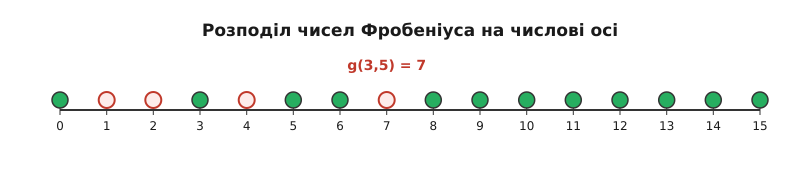

<preknowlist>
  - [Лінійні діофантові рівняння](/math/number-theory/linear-diophantine-equations/)
  - [Найбільший спільний дільник (НСД)](/math/number-theory/gcd/)
  - [Модульна арифметика](/math/number-theory/modular-arithmetic/)
  - [Взаємно прості числа](/math/number-theory/coprime/)
</preknowlist>

# Число Фробеніуса (Лінійна діофантова задача)

Лінійна діофантова задача Фробеніуса, також відома в популярній літературі як "Лінійна діофантова задача", є однією з класичних проблем адитивної теорії чисел. Її формальне формулювання полягає у знаходженні найбільшого цілого числа, яке неможливо виразити як невід'ємну лінійну комбінацію заданої множини натуральних чисел.

> 🔧 **Навіщо це.** Аналіз числа Фробеніуса є критично важливим в адитивній комбінаториці, теорії числових напівгруп, та криптографії (зокрема, в алгоритмах, що базуються на задачах рюкзака). Розуміння цієї задачі забезпечує фундаментальну інтуїцію щодо меж розв'язності лінійних діофантових рівнянь з обмеженнями на знак змінних, а також застосовується в теорії кодування для аналізу відстаней та покриттів. В алгебраїчній геометрії число Фробеніуса пов'язане з інваріантами одновимірних локальних кілець.

## Формальне визначення

Нехай задано скінченну множину натуральних чисел A = {a₁, a₂, ..., aₙ}, таких що їх найбільший спільний дільник дорівнює одиниці: gcd(a₁, a₂, ..., aₙ) = 1. Розглянемо множину S всіх можливих невід'ємних лінійних комбінацій цих чисел:
S = { c₁·a₁ + c₂·a₂ + ... + cₙ·aₙ ∣ cᵢ ∈ ℤ, cᵢ ≥ 0 }

Множина S утворює числову напівгрупу (числову моноїдну структуру, оскільки вона замкнена відносно додавання і містить нуль). Завдяки умові gcd(a₁, ..., aₙ) = 1, доведено, що доповнення ℕ \ S є скінченною множиною. Тобто, існує лише скінченна кількість натуральних чисел, які не можуть бути виражені як невід'ємна лінійна комбінація елементів множини A.

**Числом Фробеніуса** g(a₁, ..., aₙ) називається найбільше ціле число, яке не належить до множини S.
Інакше кажучи, будь-яке ціле число N > g(a₁, ..., aₙ) гарантовано може бути виражене у вигляді:
N = c₁·a₁ + c₂·a₂ + ... + cₙ·aₙ, де всі коефіцієнти cᵢ є невід'ємними цілими числами.

### Чому вимога взаємної простоти є абсолютно необхідною?

Припустимо, що gcd(a₁, ..., aₙ) = d > 1. За теоремою Безу, будь-яка лінійна комбінація (навіть із від'ємними коефіцієнтами) цих чисел повинна бути кратною числу d. Відповідно, жодне число, яке не ділиться на d без остачі, не може належати множині S. Оскільки існує нескінченно багато цілих чисел, не кратних d, множина ℕ \ S буде нескінченною, і, як наслідок, максимального невираженого числа просто не існуватиме. 

Наприклад, якщо A = {4, 6}, то d = 2. Множина S складатиметься виключно з парних чисел. Усі непарні числа (1, 3, 5, 7, 9, ...) неможливо виразити комбінацією 4 та 6. Непарних чисел нескінченно багато, тому g(4, 6) не визначене (або дорівнює нескінченності). Саме тому умова gcd(a₁, ..., aₙ) = 1 є фундаментальною для самого існування числа Фробеніуса.

## Точний розв'язок для випадку n = 2 ([Формула Сильвестра](root:math-number-theory/sylvester-frobenius-formula))

Найглибше дослідженим є випадок, коли задано лише два числа a та b, де gcd(a, b) = 1. Джеймс Джозеф Сильвестр у 1884 році довів, що для цього випадку число Фробеніуса обчислюється за замкненою аналітичною формулою:
g(a, b) = a·b − a − b

Це надзвичайно потужний та витончений результат. Він стверджує, що для будь-яких двох взаємно простих чисел, максимальна невід'ємна лінійна комбінація, яку неможливо сформувати, дорівнює їхньому добутку мінус їхня сума. 

### Доведення факту, що a·b − a − b не належить до S

Спочатку доведемо, що число N = a·b − a − b неможливо виразити як x·a + y·b для невід'ємних x та y.
Припустимо супротивне: нехай існують цілі x ≥ 0 та y ≥ 0 такі, що:
a·b − a − b = x·a + y·b
Перенесемо всі доданки з a в один бік, а з b — в інший:
a·b − a − x·a = y·b + b
a·(b − 1 − x) = b·(y + 1)

Звідси випливає, що права частина b·(y + 1) повинна ділитися на a. Оскільки gcd(a, b) = 1, з [Лема Евкліда](root:math-number-theory/euclidean-lemma) випливає, що (y + 1) має ділитися на a. Оскільки y ≥ 0, найменше можливе значення для y + 1, яке ділиться на a, — це саме число a. Тобто, (y + 1) ≥ a, що означає y ≥ a − 1.

Підставимо цю нерівність у початкове рівняння:
x·a + y·b ≥ x·a + (a − 1)·b = x·a + a·b − b
Оскільки x ≥ 0, то x·a ≥ 0, тому:
x·a + (a − 1)·b ≥ a·b − b

Але ми припустили, що x·a + y·b дорівнює a·b − a − b. Отримуємо:
a·b − a − b ≥ a·b − b
−a ≥ 0
Оскільки a — натуральне число (a > 0), ми отримали очевидну суперечність. Отже, a·b − a − b справді неможливо виразити у вигляді x·a + y·b.

Крім того, Сильвестр довів, що загальна кількість цілих додатних чисел, які не можуть бути виражені у вигляді x·a + y·b (так звані "прогалини" або "gaps" напівгрупи), визначається формулою:
N(a, b) = (a − 1)·(b − 1) ÷ 2

Це означає, що рівно половина всіх цілих чисел в інтервалі від 1 до (a − 1)·(b − 1) не належить до множини S, а інша половина — належить. Ця симетрія числових напівгруп з двома генераторами є визначальною рисою, яка робить їх симетричними напівгрупами.

## Аналіз для трьох базових елементівів (n = 3)

Перехід від двох до трьох змінних радикально змінює характер задачі. Не існує замкненої поліноміальної формули для g(a, b, c), яка б залежала виключно від a, b, c. 

Проте існують алгоритми з поліноміальним часом для обчислення g(a, b, c) та напіваналітичні методи. Найбільш відомим є алгоритм Денхема (Denham's algorithm), який спирається на розширений алгоритм Евкліда та властивості неперервних дробів. 

Властивості для n=3 інтенсивно досліджувалися Девісоном. Ідея алгоритмів для n=3 зазвичай базується на знаходженні мінімальних співвідношень між генераторами. Розглянемо найменше натуральне m таке, що m·a можна виразити через b та c. Аналогічно для b та c. Ці лінійні співвідношення утворюють так званий сизигійний модуль (syzygy module), і для n=3 цей модуль має дуже обмежену та фіксовану структуру, що дозволяє швидко знаходити число Фробеніуса через детермінанти відповідних матриць.

## Загальний випадок та алгоритмічна складність (n ≥ 3)

Для довільного фіксованого n ≥ 3 Ф. Рамірес-Альфонсін довів, що задача знаходження числа Фробеніуса є NP-складною. Більше того, це NP-складна задача в сильному сенсі. Це означає, що не існує алгоритму, здатного обчислити g(a₁, ..., aₙ) за час, поліноміальний від довжини вхідних даних (кількості бітів, потрібних для запису чисел aᵢ), якщо тільки P = NP.

Тим не менш, якщо число n є фіксованим, Каннан (Kannan, 1992) довів, що задачу можна розв'язати за поліноміальний час. Метод Каннана базується на геометрії чисел та зводиться до пошуку найкоротшого вектора в спеціально сконструйованій решітці (Shortest Vector Problem, SVP) з використанням алгоритму LLL (Lenstra-Lenstra-Lovász). Хоча алгоритм поліноміальний для фіксованого n, степінь полінома та константи дуже швидко зростають зі збільшенням n.

### Верхні та нижні оцінки

У зв'язку з відсутністю точних формул для великих n, математики розробили численні асимптотичні оцінки. 
Очевидною нижньою оцінкою, що випливає з результатів для n=2, є:
g(a₁, a₂, ..., aₙ) ≥ a₁·a₂ − a₁ − a₂, якщо вибрати два найменших елементи, які є взаємно простими.

Найвідоміша верхня оцінка була дана Ердешем і Гремом:
g(a₁, ..., aₙ) ≤ 2·aₙ·(a₁ ÷ n) − a₁
Ця оцінка показує, що число Фробеніуса зростає не швидше, ніж квадратично відносно значень генераторів. Існують також точніші ймовірнісні оцінки, розроблені Арнольдом, які вказують на те, що для "типового" набору чисел a₁, ..., aₙ число Фробеніуса зростає пропорційно до:
aⁿ ÷ ((n−1)!)

## Метод графа залишків

Найбільш практичним алгоритмом для обчислення числа Фробеніуса для порівняно малих значень генераторів (зокрема, коли найменший елемент a₁ ≤ 10⁵) є метод, що базується на обчисленні найкоротших шляхів у так званомуграфі залишків.

Нехай a₁ — найменший елемент у множині A. Будь-яке ціле число можна записати у вигляді a₁·q + r, де r ∈ {0, 1, ..., a₁−1} — це остача від ділення на a₁.
Для кожної можливої остачі r визначимо M[r] як найменше число, що належить до множини S і має остачу r при діленні на a₁. 

Якщо ми знаємо масив M[r], ми повністю контролюємо структуру напівгрупи. Якщо деяке число N має остачу r (тобто N ≡ r (mod a₁)) і N ≥ M[r], то N обов'язково належить S, оскільки різниця N − M[r] є невід'ємною і кратною a₁, а отже ми можемо просто додати a₁ необхідну кількість разів.
Відповідно, найбільше недосяжне число з остачею r дорівнює:
M[r] − a₁

Тоді глобальне найбільше недосяжне число (число Фробеніуса) є просто максимумом серед усіх цих локальних максимумів:
g(a₁, ..., aₙ) = max(M[r]) − a₁ (де r пробігає від 1 до a₁−1)

Як знайти M[r]? Ми будуємо орієнтований граф, у якому:
- Вершини відповідають класам залишків {0, 1, ..., a₁−1}.
- Від вершини u є орієнтоване ребро до вершини v = (u + aᵢ) mod a₁ з вагою aᵢ, для кожного i ∈ {2, ..., n}.

Тоді M[r] є просто довжиною найкоротшого шляху від вершини 0 до вершини r у цьому графі. Оскільки всі ваги aᵢ є строго додатними, ми можемо використати класичний алгоритм Дейкстри. Складність цього підходу становить O(a₁·n·log(a₁)), що робить його надзвичайно ефективним на практиці, незважаючи на загальну NP-складність задачі. Множина {M[0], M[1], ..., M[a₁−1]} також називається множиною Апері (Apéry set) числової напівгрупи відносно елемента a₁.

## Гіпотеза Вілфа

Одним з найвідоміших відкритих питань у цій галузі є Гіпотеза Вілфа (Wilf's conjecture), запропонована Гербертом Вілфом у 1978 році. 
Нехай e — мінімальна кількість генераторів числової напівгрупи (тобто розмір найменшої підмножини A, яка генерує ту саму напівгрупу S). 
Нехай c — "провідник" (conductor) напівгрупи, тобто найменше число, починаючи з якого всі наступні цілі числа належать до S. Очевидно, що c = g(a₁, ..., aₙ) + 1.
Нехай p — кількість прогалин (gaps), тобто кількість натуральних чисел, які не належать до S (для n=2 це число N(a, b)).

Вілф висунув гіпотезу, що завжди виконується нерівність:
e ≥ c ÷ (c − p)

Гіпотеза Вілфа доведена для багатьох спеціальних випадків (наприклад, для n ≤ 3), але в загальному вигляді вона залишається нерозв'язаною проблемою алгебраїчної комбінаторики, привертаючи увагу десятків математиків. Ця гіпотеза пов'язує густину напівгрупи з її мінімальним числом генераторів.

## Метод твірних функцій

Інший потужний підхід до аналізу числа Фробеніуса полягає у використанні формальних степеневих рядів та твірних функцій. 
Розглянемо функцію F(x), яка є сумою xⁿ для всіх n, що належать до множини S:
F(x) = Σ xⁿ (для n ∈ S)

Можна показати, що ця нескінченна сума тісно пов'язана з раціональною функцією:
P(x) = (1 − x^a₁) · (1 − x^a₂) · ... · (1 − x^aₙ)

Зокрема, для n = 2 існують точні вирази, які пов'язують поліноми циклотомії з функцією F(x), що дозволяє не лише знайти число Фробеніуса, але й отримати формулу Сильвестра аналітичним шляхом через аналіз полюсів раціональної функції на комплексній площині. Для більших n цей метод дозволяє обчислювати кількість способів виразити число (що називається функцією розбиття з обмеженими частками) та аналізувати асимптотичну поведінку, використовуючи лему Серра та методи комплексного аналізу.

## Підсумок

Лінійна діофантова задача Фробеніуса є чудовим прикладом проблеми, яка елементарно формулюється, але веде до глибоких структурних результатів у математиці. Вона демонструє різкий перехід складності: від простої універсальної формули для двох генераторів до NP-складної алгоритмічної проблеми для загального випадку. Її зв'язок з графами залишків, твірними функціями, ґратками та числовими напівгрупами робить її важливим інструментом сучасної дискретної математики та теоретичної інформатики, який знаходить застосування далеко за межами простого підрахунку неможливих комбінацій.
