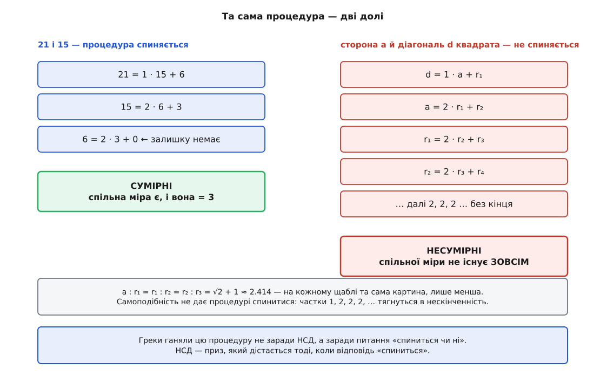
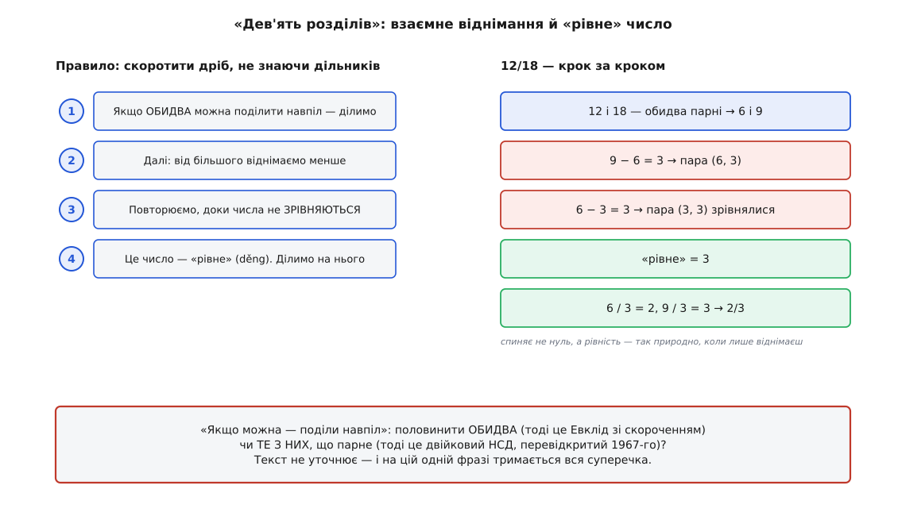
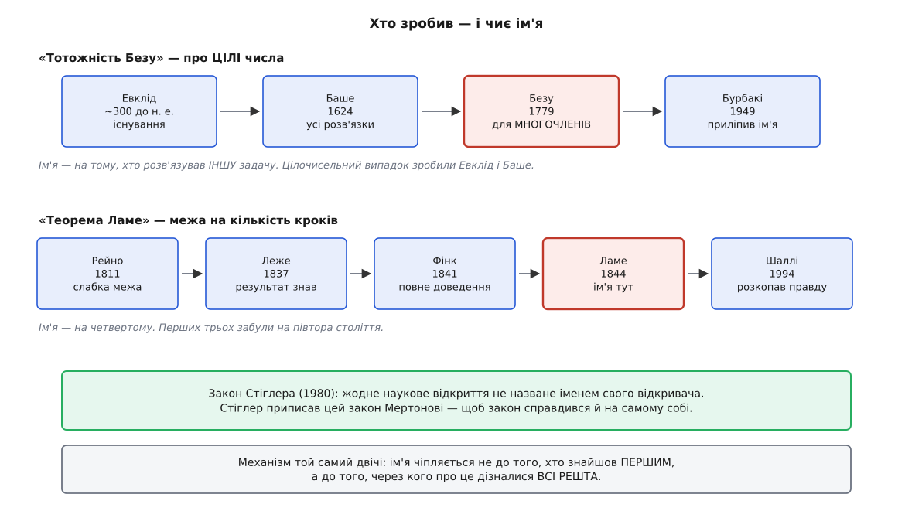

# 📜 Народження алгоритму: Евклід, Безу, Ламе

Три імені в заголовку — і жодне не стоїть тут по праву. Евклід алгоритму не винаходив. Безу не доводив тотожності, яку звуть його іменем, — він працював над іншими об'єктами. Ламе не був першим, хто довів теорему Ламе, і навіть не третім.

Це не прискіпливість і не полювання на кумирів. Ця процедура — рідкісний випадок, коли можна простежити всю дорогу ідеї: від того, навіщо її придумали (а придумали зовсім не для того, для чого вона зараз потрібна), через два незалежні винаходи на різних кінцях Євразії, до того, як на неї начіпляли чужі імена — і чому вони прилипли. Історія тут пояснює не лише алгоритм, а й те, як узагалі влаштована математична пам'ять: що вона зберігає, що губить, і чому.

Почнімо з найдивнішого: спочатку ця процедура шукала не спільний дільник.

---

## Процедура, що шукала не міру, а її відсутність

Піфагорійська картина світу трималася на одному переконанні: **усе є число**. Не метафора — цілком технічне твердження. Будь-які дві величини (два відрізки, дві ваги, дві натягнуті струни) можна виміряти однією мірою: знайдеться мірка, що вкладається ціло і в одну, і в другу. Тоді їхнє відношення — це відношення двох цілих чисел, і світ, зрештою, лічильний. Такі величини звуть **сумірними** — тобто такими, що мають спільну міру.

Переконання такого розмаху потребує перевірки. Перевіркою й була ἀνθυφαίρεσις (*anthyphairesis*, з ἀντί + ὑπό + αἵρεσις — «взаємне відбирання»): від більшої величини відбираємо меншу стільки разів, скільки вона влазить; лишок міняємо місцями з меншою; повторюємо.

І тут ховається те, заради чого все й затівалося. У процедури є **рівно дві долі**, третьої немає. Або лишок колись стає точно нульовим — і тоді остання ненульова величина вкладається ціло в обидві початкові, тобто спільна міра знайдена. Або нуля не буде **ніколи**.

Друга доля — і є відповідь, по яку йшли. Погляньмо, що вона означає. Припустімо, спільна міра *d* усе-таки існує: обидві початкові величини складаються з цілого числа мірок *d*, скажімо a = d·k і b = d·m. Тоді й перший лишок складається з цілих мірок, бо

```
a − q·b = d·k − q·d·m = d·(k − q·m)
```

— а це знову ціле число мірок *d*. Те саме міркування дослівно повторюється на кожному кроці, тож *d* вкладається ціло в **кожен** лишок без винятку. А ненульове ціле число мірок не буває меншим за одну мірку — отже жоден ненульовий лишок не може бути меншим за саму *d*. Але лишки строго меншають на кожному кроці й, якщо нуля немає, сповзають нижче за будь-яку наперед задану величину — зокрема нижче за *d*. Суперечність. Отже спільної міри не існує **зовсім** — величини **несумірні**.

Ось у чому річ: це той самий інваріант, на якому тримається пошук НСД («спільний дільник переживає крок»), лише прочитаний у зворотний бік. Спільна міра, якби вона була, пережила б усі кроки й підперла б лишки знизу. Лишки, що падають без упину, доводять, що підпирати не було чому. **Один факт — два вжитки.** І з двох саме другий був той, заради якого процедуру ганяли.

Так НСД виявляється не метою, а **втішним призом**: тим, що дістається, коли детектор нескінченності повернув «ні».

### Квадрат, який усе зламав

Найвідоміша здобич цього детектора — сторона квадрата і його діагональ. Візьмімо сторону a = 1, тоді діагональ d = √2. Проженімо взаємне відбирання:

```
d = 1 · a  + r₁        1.4142135624 = 1 · 1 + 0.4142135624
a = 2 · r₁ + r₂        1 = 2 · 0.4142135624 + 0.1715728752
r₁ = 2 · r₂ + r₃       0.4142135624 = 2 · 0.1715728752 + 0.0710678119
r₂ = 2 · r₃ + r₄       0.1715728752 = 2 · 0.0710678119 + 0.0294372515

відношення на кожному щаблі:
   a : r₁ = 2.414213562373
  r₁ : r₂ = 2.414213562373
  r₂ : r₃ = 2.414213562373        усі однакові  =  √2 + 1
```

Тут не треба вірити на слово — це видно з арифметики. Після першого кроку r₁ = d − a, і відношення a : r₁ дорівнює 1/(√2 − 1) = √2 + 1. Наступний лишок r₂ = a − 2r₁ = 3a − 2d, а відношення r₁ : r₂ = (√2 − 1)/(3 − 2√2). Але 3 − 2√2 — це рівно (√2 − 1)², тож дріб згортається до 1/(√2 − 1) = √2 + 1. **Те саме відношення.**

А коли відношення повторилося, повторилася й уся дальша доля процедури: наступна пара — точна копія попередньої, лише менша. Частки тягнуться 1, 2, 2, 2, 2, … і кінця їм немає за побудовою. Самоподібність не дає процедурі спинитися — а отже, у сторони й діагоналі квадрата спільної міри **не існує**.

Послідовність часток, яку видає взаємне відбирання, — це і є розклад числа в [ланцюговий дріб](root:math-number-theory/continued-fractions): відношення записують як частку, плюс лишок, який знову перевертають і ділять. Скінченний ланцюговий дріб ⟺ раціональне число; нескінченний ⟺ ірраціональне. У наших позначеннях √2 = [1; 2, 2, 2, …] — і періодичність тут не збіг, а саме та самоподібність, яку ми щойно бачили.


*Одна процедура, дві долі. Ліворуч вона спиняється — величини сумірні, і остання ненульова величина є їхньою спільною мірою. Праворуч вона не спиниться ніколи — і це не невдача обчислення, а доведення: спільної міри не існує зовсім. Греки запускали цю процедуру заради правої колонки. Ліва — те, що лишається, коли катастрофи не сталося.*

Для піфагорійського «усе є число» це був не технічний нюанс, а пробоїна нижче ватерлінії. Величина, яку не можна виміряти жодною спільною міркою, існує — і не десь в екзотиці, а в діагоналі найпростішої фігури, яку тільки можна накреслити.

---

## Евклід, про якого не відомо майже нічого

У «Началах» процедура стоїть **двічі**. Книга VII, твердження 1 і 2 — для чисел: якщо лишок ніколи не виміряє попереднього, доки не лишиться одиниця, то числа взаємно прості (твердження 1); а якщо виміряє — маємо найбільшу спільну міру (твердження 2). Книга X, твердження 2 і 3 — те саме для величин: нескінченне відбирання означає несумірність (X.2), скінченне дає найбільшу спільну міру (X.3).

Ця подвоєність — не недогляд і не редакторська недбалість. Це **скам'янілість**. Числа й величини були для греків різними світами: перші лічать, другі міряють, і змішувати їх не годилося. Процедура, що однаково працює в обох світах, мусила бути виписана в кожному окремо — і сам факт, що її довелося записувати двічі, свідчить, що вона старша за той поділ і прийшла до «Начал» уже готовою.

Свідчення старшинства є й пряме, документальне. Аристотель у «Топіці» (158b) — а це середина IV століття до н. е., за покоління до «Начал» — уживає слово ἀνταναίρεσις (*antanairesis*, той самий термін у варіантній формі) як **уже відомий технічний засіб**, та ще й у несподіваній ролі: як означення того, що два відношення однакові. Два відношення тотожні тоді, коли тотожні їхні послідовності часток. Тобто для когось до Евкліда взаємне відбирання було не способом щось порахувати, а **основою теорії відношень**. Історики математики зводять цю теорію до Теетета (*Θεαίτητος*, бл. 417–369 до н. е.); згодом її витіснило потужніше й загальніше означення Евдокса Кнідського, що стоїть у V книзі «Начал» (означення 5).

Розрізнімо тут доказовий статус чесно. Пасаж Аристотеля — **документ**: він є, його можна прочитати, і він доводить, що процедура старша за Евкліда. Приписування теорії Теететові — **наукова реконструкція**: широко прийнята, добре аргументована, але реконструкція, а не запис. Хто зробив це вперше — не відомо й, найпевніше, не буде відомо ніколи.

А про самого Евкліда відомо ще менше, ніж прийнято думати. Сучасних йому згадок немає **жодної**; звична дата «близько 300 р. до н. е.» тримається на пізніх свідченнях і фахівцями ставиться під сумнів. Життєпис, який переказують століттями, склали середньовічні арабські автори — через півтори тисячі років після подій. Візантійські й ранньоренесансні книжники на додачу плутали його з Евклідом Мегарським, філософом, що жив на століття раніше. Дехто з істориків узагалі припускає, що «Евклід» — радше назва традиції чи гурту, ніж одна людина.

Так і виходить, що найзнаменитіший алгоритм в історії названий на честь того, хто його не вигадав, — і про кого ми навіть не певні, чи він існував як окрема людина.

---

## Ханьський Китай: те саме — але заради податків

За кілька тисяч кілометрів і кількасот років ту саму думку записали вдруге. І майже все в цьому другому записі — інше.

九章算術 (*Jiǔzhāng suànshù*, «Дев'ять розділів про мистецтво лічби») — 246 задач, укладених поколіннями авторів; той вигляд, у якому ми його маємо, склався десь у ханьські часи, і оцінки датування розходяться від ~200 р. до н. е. до I ст. н. е. (повну назву бачимо на бронзових мірах, датованих 179 р. н. е.). Найвідоміший коментар — Лю Хуея (劉徽), 263 р. н. е.; згодом текст доповнив Лі Чуньфен, близько 640-го.

Це не філософія. Це **службовий довідник**: як міряти поля, рахувати роботи, вести торгівлю й стягувати податок. Жодних піфагорійців, жодної несумірності, жодної кризи світогляду. Урядовцеві треба скоротити дріб.

Перший розділ — 方田 (*fāngtián*, «прямокутні поля»), 38 задач про площі, а до них правила дій із дробами. Серед правил — 約分術 (*yuēfēn shù*, «правило скорочення дробу»), а всередині нього те, заради чого ми сюди прийшли: 更相減損術 (*gēng xiāng jiǎn sǔn shù*, «правило взаємного віднімання й зменшування»):

> 可半者半之，不可半者，副置分母、子之數，以少減多，更相減損，求其等也。以等數約之。
>
> «Якщо можна поділити навпіл — поділи. Якщо не можна — виклади окремо числа знаменника й чисельника, від більшого відніми менше, взаємно віднімай і зменшуй, і **шукай їхнє рівне**. На рівне число й скороти.»

Зупинімося на слові. Найбільший спільний дільник тут зветься 等 (*děng*) — «рівне», або 等數 (*děngshù*) — «рівне число». Порівняймо з грецьким μέγιστον κοινὸν μέτρον, «найбільша спільна міра». Обидві назви — точні описи, але **різних половин** однієї процедури. Грек назвав відповідь за тим, що вона **робить**: міряє обидві величини. Китаєць назвав її за тим, чим вона **стає**: числом, до якого пара злипається, якщо забирати досить довго.

І це не мовна прикраса, а різні умови зупинки, кожна природна у своїй системі. Хто ділить із лишком — спиняється на **нулі**. Хто тільки віднімає — спиняється на **рівності**: коли обидва числа зрівнялися, віднімати вже нема чого. Це той самий момент, побачений із двох боків.

**Скоротити 12/18 за правилом «Дев'яти розділів».**
```
12 і 18 — обидва можна поділити навпіл  →  6 і 9
9 — непарне, далі не половинимо. Виклали 6 і 9 окремо:

  9 − 6 = 3   →  пара (6, 3)
  6 − 3 = 3   →  пара (3, 3)   ← зрівнялися

рівне (等) = 3
6 / 3 = 2,   9 / 3 = 3   →   12/18 = 2/3
```


*Те саме, що в «Началах», але записане в іншій системі координат. Спиняє не нуль, а рівність — так природно, коли ділення з лишком у тебе не окрема дія, а те, що ти робиш паличками на лічильній дошці. І зверніть увагу на перший крок: половинення тут стоїть попереду всього.*

### Чому половинення — і чому воно раптом знову на часі

Ось той перший крок і є те, задля чого цей трактат згадують у розмові про сучасний код. Половинення дешеве — навіть на лічильних паличках. Забрати двійку легше, ніж будь-що інше.

1967 року в *Journal of Computational Physics* (том 1, с. 397–405) вийшла стаття Йозефа Штайна (Josef Stein) про обчислювальні задачі алгебри Рака — робота фізика, не теоретика чисел. У ній між іншим був спосіб рахувати НСД **без жодного ділення**: знімати двійки зсувами, а далі віднімати. Кнут датує саме́ відкриття 1961 роком і подає його в другому томі «Мистецтва програмування» (§4.5.2) як Алгоритм B — зауваживши при цьому, що ця сама думка, **можливо**, була відома в Китаї в I столітті.

Причина, чому це «знову в моді», суто залізна. Ділення — найдорожча ціла операція процесора: десятки тактів, кепсько конвеєризується. Зсув, порівняння й віднімання — приблизно такт кожне, а «порахувати нулі в хвості» (`ctz`) взагалі одна інструкція. Обмін вигідний: кроків більше, але всі дешеві. Криптографічні бібліотеки саме так НСД і рахують.

Тепер — чесно про доказовість, бо це той випадок, де легко захопитися. Уся суперечка тримається на трьох ієрогліфах: 可半者半之, «якщо можна — поділи навпіл». Читань два. Половинити, **коли обидва парні** — тоді це просто Евклід зі скороченням. Половинити **те з них, що парне** — тоді це справді двійковий НСД. Текст не уточнює.

І контекст, як на мене, тягне до слабшого читання: правило все-таки про **скорочення дробу**, а в дробі половинити щось одне не можна — дріб змінить значення. Половинити обидва — це просто вже почати скорочувати. Шаохуа Чжан у препринті 2009 року доводить протилежне й прямо пише, що Кнут помилявся; аргумент цікавий, але це препринт з іншими сильними твердженнями, і консенсусом він не став. Сам Кнут, зверніть увагу, обережний: «можливо, була відома».

Отже статус розкладімо так. Процедура в «Дев'яти розділах» — **встановлений факт**: текст є, слова відомі. «Китайці мали двійковий НСД» — **спірне тлумачення** однієї двозначної фрази. Різниця між цими двома реченнями якраз і є та межа, за яку історія науки заходити не повинна.

---

## Баше: перевинайшов Евкліда, не читавши Евкліда

Далі — Франція XVII століття, і тут історія робить крутий поворот, бо наступний, хто знайшов алгоритм, знайшов його **сам**.

Клод Ґаспар Баше де Мезіріак (*Claude Gaspard Bachet de Méziriac*, 1581–1638) народився в Бур-ан-Бресі — на той час це було не Франція, а **Савойське герцогство**. Бресс відійшов Франції за Ліонським договором 17 січня 1601 року; Баше було дев'ятнадцять. Тобто він народився савойським підданим і помер французом, нікуди не переїжджаючи. 1635 року його обрали до Французької академії — одним із перших її членів, хоч і не засновником.

Із Баше пов'язана найзнаменитіша примітка в історії математики, і він про це так і не дізнався. 1621 року він видав латиною «Арифметику» Діофанта. Це **та сама** книжка, на берегах якої П'єр де Ферма (*Pierre de Fermat*) написав, що для степенів вище другого розв'язків немає, а поле надто вузьке, щоб умістити його чудовий доказ. Триста п'ятдесят років полювання за доведенням Великої теореми Ферма почалися на полях книжки Баше.

Але нас цікавить інша його книжка — і вона ще неочікуваніша. 1612 року Баше видав «Problèmes plaisants et délectables qui se font par les nombres» («Приємні й утішні задачі, що робляться числами») — по суті першу справжню книжку математичних розваг. Переправи через річку, вгадування задуманого числа, гирі 1, 3, 9, 27, якими можна зважити будь-що до сорока.

І ось у другому виданні 1624 року, серед цих салонних забавок, стоїть **твердження XVIII**:

> «Deux nombres premiers entre eux estant donnez, treuver le moindre multiple de chascun d'iceux, surpassant de l'unité un multiple de l'autre».
>
> «Дано два взаємно прості числа — знайти найменше кратне кожного з них таке, що воно перевищує кратне другого на одиницю.»

Це, у сучасному записі, рівняння a·x − b·y = 1. Тобто розширений алгоритм Евкліда — той самий, яким сьогодні добувають обернене за модулем при генерації ключів RSA, — увійшов у новочасну математику через збірку салонних головоломок.

Ендрю Ґренвіл (*Andrew Granville*) у розвідці 2024 року пише, що Баше «трудомістко відкриває для себе грубу версію алгоритму Евкліда» — вочевидь, не звірившись з Евклідом. Іронія тут подвійна: людина, що фахово видавала грецькі математичні рукописи, перевинайшла процедуру, яка стояла в найвідомішому грецькому математичному рукописі. І при цьому здобуток Баше цілком реальний: він знайшов не один розв'язок, а **всі**.

Хоча, як на мене, головне тут не іронія, а **свідчення**. Якщо людина, взявшись усерйоз за a·x − b·y = 1 і не маючи ані підказки, ані першоджерела, самотужки виходить на ту саму процедуру, — значить, процедура не потребує генія. Вона просто **лежить у задачі**. Це найкраще пояснення, чому в неї немає автора: її знаходить кожен, хто чесно копає.

---

## Ім'я, що приліпилося не до того

А тепер про людину, чиє ім'я на всьому цьому опинилося.

Етьєн Безу (*Étienne Bézout*, 1730–1783) народився в Немурі, у родині суддів — батько й дід були магістратами, і родинну лінію він урвав, начитавшись Ейлера. 1758 року став ад'юнктом з механіки в Академії наук і королівським цензором; 1763-го — екзаменатором гвардії флоту, 1768-го — екзаменатором артилерійського корпусу.

За життя він був знаменитий як **автор підручників**. «Cours de mathématiques à l'usage des Gardes du Pavillon et de la Marine» (4 томи, 1764–67), «Cours complet de mathématiques à l'usage de la marine et de l'artillerie» (6 томів, 1770–82). Їх узяли на озброєння аж у Гарварді й переклали англійською. Безу свідомо ставив геометрію перед алгеброю, бо початківець, за його спостереженням, ще не звик до алгебричного міркування. До викладання він ставився так серйозно, що на власні дослідження часу вже майже не лишалося.

Дослідження все ж були. 1779 року вийшла «Théorie générale des équations algébriques» — праця про виключення невідомих і системи рівнянь. Там і стоїть теорема Безу: степінь остаточного рівняння, отриманого з кількох повних рівнянь із такою самою кількістю невідомих, дорівнює **добуткові їхніх степенів**.

Зверніть увагу, про що це. Про **многочлени**. І те, що Безу зробив стосовно «тотожності», — це теж про многочлени: він довів, що алгоритм Евкліда працює й для них, бо степінь на кожному кроці спадає. Цілочисельного твердження він не заявляв ніколи. Побачивши своє ім'я на ньому, він, найпевніше, здивувався б.

Звідки ж воно взялося? Ґренвіл у праці з промовистою назвою «It is not "Bézout's identity"» (2024) простежує ім'я до **Бурбакі**: в «Алгебрі», розділ 7 (1949), стоїть «Théorème 1 (*"identité de Bezout"*)». Присуд Ґренвіла прямий: у цьому результаті немає жодної частини, яку зробив би Безу.

Далі — робота в архівах, і вона майже детективна. У першому чернетковому варіанті Дьєдонне (с. 62) стоїть «(Bezout's identities)». У версії Вейля від грудня 1949-го приписування зникає. В остаточному рукописі воно повертається — найпевніше, рукою Дьєдонне, судячи з написання «Bezout» без наголосу. Є навіть здогад, що це був внутрішній жарт Вейля — кпин із тих, хто приписував тотожність Безу; лапки в оригіналі до такого читання схиляють. Але це саме здогад, і Ґренвіл каже про нього просто: правди ми вже не дізнаємося.

Тут не втриматися від зауваги: **Бурбакі — теж не людина**. Це колективний псевдонім гурту французьких математиків. Вигадане ім'я приписало справжнє ім'я не тому, кому слід.

Складімо рахунок:

```
Евклід    ~300 до н. е.  —  існування:  a·x + b·y = НСД(a, b) розв'язне
Баше       1624          —  ВСІ розв'язки в цілих числах
Безу       1779          —  те саме твердження для МНОГОЧЛЕНІВ
Бурбакі    1949          —  назвало це «тотожністю Безу»
```

Ім'я лягло на третій рядок. А сталося це тому, що XX століття познайомилося з твердженням **через Бурбакі** — і взяло ярлик, який там стояв. Запам'ятаймо цей механізм, бо за хвилину він спрацює вдруге.

---

## Ламе — і троє, кого забули

Кажуть, що першим строгим аналізом швидкодії алгоритму була робота Ламе 1844 року. «Кажуть» тут несе завелике навантаження.

Габріель Ламе (*Gabriel Lamé*, 1795–1870) народився в Турі, вчився в Політехнічній школі (1813–17), потім у Гірничій, яку закінчив 1820-го. І одразу після випуску його з Емілем Клапейроном (*Émile Clapeyron*) відрядили — на прохання французького уряду — до Російської імперії. Дванадцять років, до 1832-го, він працював у Петербурзі професором та інженером Інституту корпусу інженерів шляхів сполучення: читав аналіз, фізику, механіку, хімію та інженерні предмети, проєктував мости й дороги, зацікавився залізницями, друкувався в російських, французьких і німецьких часописах. Наголошу на точності: це французький інженер на службі за контрактом за кордоном — зроблене належить йому, а не державі, що його найняла.

1832 року він повернувся до Франції: кафедра фізики в Політехнічній школі, з 1836-го — головний інженер копалень, 1843-го — Академія наук, 1844-го — Сорбонна, математична фізика та ймовірність.

Репутація в нього роздвоїлася характерно. Ґаусс вважав його провідним французьким математиком свого часу — а вдома його мали за «надто практичного для математика й водночас надто теоретичного для інженера». Сам Ламе найважливішим своїм здобутком уважав **криволінійні координати**, якими розв'язував задачі пружності, теплопровідності й диференціальної геометрії. Коефіцієнти Ламе в теорії пружності досі звуть його ім'ям — оце він заробив чесно.

А 1844 року він подав до «Comptes rendus» (том 19, с. 867–870) нотатку на чотири сторінки: «Note sur la limite du nombre des divisions dans la recherche du plus grand commun diviseur entre deux nombres entiers». Кількість ділень менша за п'ять разів по кількості десяткових цифр меншого числа, а найгірший вхід — сусідні [числа Фібоначчі](root:math-number-theory/fibonacci-numbers), у яких кожне дорівнює сумі двох попередніх: саме на них усі частки дорівнюють одиниці, тобто кожен крок зрізає мінімум із можливого.

Іронія, звісно, нищівна. Людина поклала життя на криволінійні координати — а програміст знає її прізвище через чотири сторінки, які вона написала мимохідь.

Але це ще не та іронія. Джеффрі Шаллі (*Jeffrey Shallit*) у розвідці «Origins of the analysis of the Euclidean algorithm» («Historia Mathematica», 1994, том 21, вип. 4, с. 401–419) розкопав ось що:

- **Антуан-Андре-Луї Рейно** (*Antoine-André-Louis Reynaud*), 1811 — слабка межа. За тридцять три роки до Ламе.
- **Еміль Леже** (*Émile Léger*), 1837 — той самий результат Ламе, з найгіршим випадком на числах Фібоначчі. За сім років до Ламе.
- **П'єр-Жозеф-Етьєн Фінк** (*Pierre-Joseph-Étienne Finck*), 1841 — повне, коректне доведення, до того ж іншим шляхом. За три роки до Ламе.
- **Ламе**, 1844 — ім'я.

Наступного року Петер Шрайбер (*Peter Schreiber*) додав до розвідки Шаллі доповнення — там-таки, в «Historia Mathematica».

Чому ж прилипло саме «Ламе»? Механізм той самий, що з Бурбакі, і він не має нічого спільного з першістю. Ламе друкувався в «Comptes rendus» — найшвидшому й найчитанішому науковому віснику Європи, який за кілька тижнів опинявся на столах від Берліна до Единбурга. Рейно, Леже й Фінк писали підручники та нотатки, що розходилися вузьким колом. Спільнота зустріла результат **через Ламе** — і назвала його ім'ям того, від кого почула.


*Двічі в одній історії — і той самий механізм. Червоним позначено того, чиє ім'я лишилося; сірими стрілками — ті, хто зробив роботу. В обох випадках знадобився історик наприкінці XX століття, щоб просто перечитати, хто що насправді написав.*

І наостанок про Ламе — деталь, що показує, наскільки все це буденно. Він довів Велику теорему Ферма для n = 7, а якийсь час вважав, що довів її цілком. Доведення завалилося на тому, що він припустив однозначність розкладу на множники в кільцях комплексних чисел, де її немає. Тобто людину, яка обмежила зверху алгоритм Евкліда, підвела саме однозначність розкладу — та сама властивість, на якій тримається «очевидний» спосіб шукати НСД і від якої алгоритм Евкліда так вдало не залежить.

---

## Чому імена липнуть не туди

У побаченого двічі є назва. **Закон Стіглера**: жодне наукове відкриття не назване іменем свого відкривача. Стівен Стіглер (*Stephen Stigler*) сформулював його 1980 року — у збірнику на пошану соціолога Роберта Мертона (*Robert K. Merton*), чия праця 1957 року про першість у науці й дала суть. І тут-таки Стіглер приписав закон **Мертонові**, щоб закон справдився на самому собі.

Механізм ми бачили в роботі двічі й обидва рази той самий. Ім'я чіпляється не до того, хто знайшов **першим**, а до того, через кого про знахідку дізналися **всі решта**. Перший знахідник рідко буває найгучнішим каналом — і чим тихіший канал, тим надійніше ім'я загубиться. Рейно, Леже й Фінк не зробили нічого гіршого за Ламе; вони просто друкувалися не там.

Але з цією конкретною процедурою є ще одна річ, важливіша за всі епоніми разом. Вона **пережила кожне ім'я, яке на неї чіпляли**. ἀνθυφαίρεσις, 更相減損術, algorithme d'Euclide, алгоритм Штайна, `std::gcd` — під усіма цими вивісками ті самі кілька рядків. Їй байдуже, як її звати, бо вона не спирається на жодного зі своїх знахідників: це не теорія, яку треба переказати з чиїхось слів, а **дія**, яку кожен може перевідкрити з нуля.

Власне, звідси й уся безіменність. Причина, чому в алгоритму немає автора, — та сама, чому він працює: він **лежить у задачі**. Урядовець династії Хань дійшов до нього, скорочуючи дроби для податку. Баше дійшов до нього, складаючи салонні головоломки й не заглянувши в «Начала». Евклід застав його вже готовим і чесно записав двічі — окремо для чисел, окремо для величин.

Порахуймо ще раз, чим ця процедура була. Народилася детектором нескінченності, який мав ловити не спільну міру, а її відсутність. У ханьському Китаї підрізала дроби для податкових розрахунків. Перевідкрилася в книжці забавок. Дістала ім'я від автора підручників, який працював над іншими об'єктами, — та ще й з рук вигаданого математика. Швидкодію їй обмежив інженер, який волів би, щоб його пам'ятали за криволінійні координати. Двійковий варіант їй приписали фізикові, що писав про алгебру Рака, — а може, і ханьському урядовцеві, тут уже як прочитати три ієрогліфи.

Дві з половиною тисячі років, шестеро імен, жодне не своє, і за весь цей час у самій процедурі не змінився жоден рядок.
