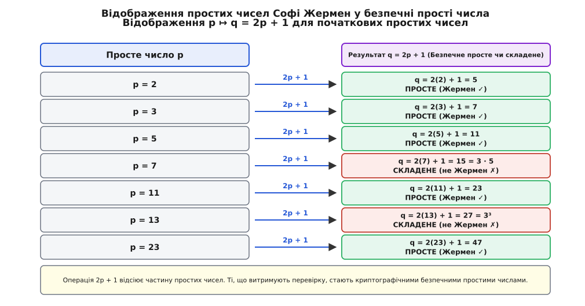
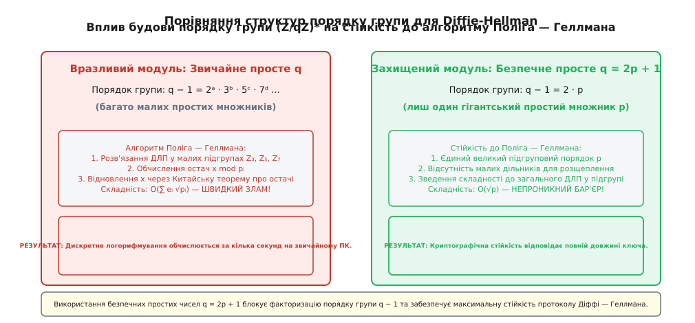
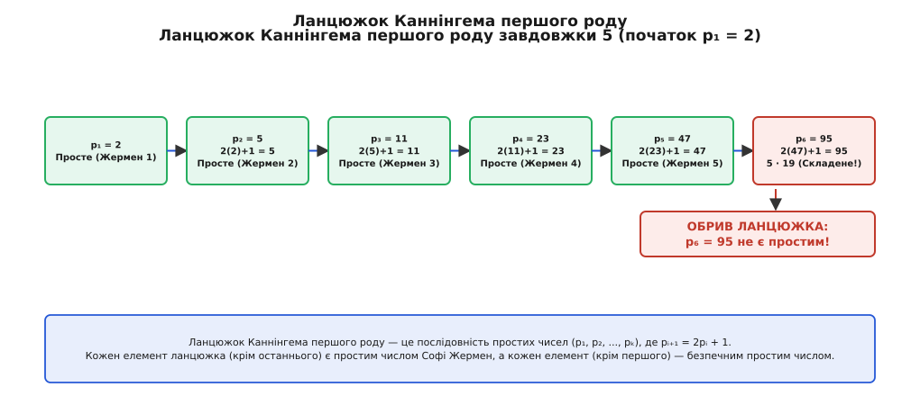

# Прості числа Софі Жермен

<preknowlist>
- [Прості числа](root:math-number-theory/prime-numbers) — цілі числа, що мають рівно два натуральні дільники.
- [Мала теорема Ферма](root:math-number-theory/fermat-little-theorem) — основні властивості порівнянь за простим модулем.
- [Порівняння за модулем](root:math-number-theory/modular-arithmetic) — арифметика остач та їхні алгебраїчні властивості.
- [Криптосистема Діффі — Геллмана](root:sf-security/diffie-hellman) — принцип обміну ключами в незахищеному каналі.
</preknowlist>

Уявіть криптографічний протокол обміну ключами, у якому надійність захисту інформації спирається на просте число `q = 31`. Порядок мультиплікативної групи остач за цим модулем дорівнює `q − 1 = 30`. Оскільки число 30 легко розкладається на малі прості множники `2 · 3 · 5`, алгоритм Поліга — Геллмана розщеплює складну задачу дискретного логарифмування на серію тривіальних задач у підгрупах порядків 2, 3 та 5, дозволяючи зловмиснику відновити секретний ключ за кілька обчислювальних кроків. Якщо ж замість модуля 31 обрати просте число `q = 23`, порядок групи становитиме `q − 1 = 22 = 2 · 11`. Тобто крім числового дільника 2, порядок групи містить єдиний гігантський простий дільник `p = 11`. У такій групі розщепити задачу неможливо: складність зламу визначається величиною `√11` і є максимально можливою для даного розміру ключа.

Описаний ефект виникає тоді, коли просте число `q` утворене з іншого простого числа `p` за формулою `q = 2p + 1`. Число `p`, яке має таку властивість, називають **простим числом Софі Жермен**, а відповідне число `q` — **безпечним простим числом**. Цей простий на вигляд зв'язок `p ↦ 2p + 1` утворює міст між фундаментальною диофантовою алгеброю ХІХ століття та сучасною криптографією з відкритим ключем.

## 1. Подвоєння з додаванням одиниці: математичне означення

Натуральне просте число `p` називають **простим числом Софі Жермен** (лат. *numerus primus Germain*), якщо число `q = 2p + 1` також є простим числом. У цьому разі число `q` називають **безпечним простим числом** (англ. *safe prime*).

Для першого натурального простого числа `p = 2` обчислимо значення `q`:

```
q = 2(2) + 1 = 5
```

Оскільки 5 — це просте число, `p = 2` є найменшим простим числом Софі Жермен, а `q = 5` — найменшим безпечним простим числом. Перевіримо наступні малі прості числа:

- Для `p = 3`: `q = 2(3) + 1 = 7` — просте число (Жермен ✓)
- Для `p = 5`: `q = 2(5) + 1 = 11` — просте число (Жермен ✓)
- Для `p = 7`: `q = 2(7) + 1 = 15 = 3 · 5` — складене число (не є Жермен ✗)
- Для `p = 11`: `q = 2(11) + 1 = 23` — просте число (Жермен ✓)
- Для `p = 13`: `q = 2(13) + 1 = 27 = 3³` — складене число (не є Жермен ✗)
- Для `p = 17`: `q = 2(17) + 1 = 35 = 5 · 7` — складене число (не є Жермен ✗)
- Для `p = 19`: `q = 2(19) + 1 = 39 = 3 · 13` — складене число (не є Жермен ✗)
- Для `p = 23`: `q = 2(23) + 1 = 47` — просте число (Жермен ✓)
- Для `p = 29`: `q = 2(29) + 1 = 59` — просте число (Жермен ✓)
- Для `p = 31`: `q = 2(31) + 1 = 63 = 3² · 7` — складене число (не є Жермен ✗)
- Для `p = 37`: `q = 2(37) + 1 = 75 = 3 · 5²` — складене число (не є Жермен ✗)
- Для `p = 41`: `q = 2(41) + 1 = 83` — просте число (Жермен ✓)
- Для `p = 43`: `q = 2(43) + 1 = 87 = 3 · 29` — складене число (не є Жермен ✗)
- Для `p = 47`: `q = 2(47) + 1 = 95 = 5 · 19` — складене число (не є Жермен ✗)
- Для `p = 53`: `q = 2(53) + 1 = 107` — просте число (Жермен ✓)
- Для `p = 59`: `q = 2(59) + 1 = 119 = 7 · 17` — складене число (не є Жермен ✗)
- Для `p = 61`: `q = 2(61) + 1 = 123 = 3 · 41` — складене число (не є Жермен ✗)
- Для `p = 67`: `q = 2(67) + 1 = 135 = 3³ · 5` — складене число (не є Жермен ✗)
- Для `p = 71`: `q = 2(71) + 1 = 143 = 11 · 13` — складене число (не є Жермен ✗)
- Для `p = 73`: `q = 2(73) + 1 = 147 = 3 · 7²` — складене число (не є Жермен ✗)
- Для `p = 79`: `q = 2(79) + 1 = 159 = 3 · 53` — складене число (не є Жермен ✗)
- Для `p = 83`: `q = 2(83) + 1 = 167` — просте число (Жермен ✓)
- Для `p = 89`: `q = 2(89) + 1 = 179` — просте число (Жермен ✓)
- Для `p = 97`: `q = 2(97) + 1 = 195 = 3 · 5 · 13` — складене число (не є Жермен ✗)
- Для `p = 101`: `q = 2(101) + 1 = 203 = 7 · 29` — складене число (не є Жермен ✗)
- Для `p = 103`: `q = 2(103) + 1 = 207 = 3² · 23` — складене число (не є Жермен ✗)
- Для `p = 107`: `q = 2(107) + 1 = 215 = 5 · 43` — складене число (не є Жермен ✗)
- Для `p = 109`: `q = 2(109) + 1 = 219 = 3 · 73` — складене число (не є Жермен ✗)
- Для `p = 113`: `q = 2(113) + 1 = 227` — просте число (Жермен ✓)
- Для `p = 127`: `q = 2(127) + 1 = 255 = 3 · 5 · 17` — складене число (не є Жермен ✗)
- Для `p = 131`: `q = 2(131) + 1 = 263` — просте число (Жермен ✓)
- Для `p = 137`: `q = 2(137) + 1 = 275 = 5² · 11` — складене число (не є Жермен ✗)
- Для `p = 139`: `q = 2(139) + 1 = 279 = 3² · 31` — складене число (не є Жермен ✗)
- Для `p = 149`: `q = 2(149) + 1 = 299 = 13 · 23` — складене число (не є Жермен ✗)
- Для `p = 151`: `q = 2(151) + 1 = 303 = 3 · 101` — складене число (не є Жермен ✗)
- Для `p = 157`: `q = 2(157) + 1 = 315 = 3² · 5 · 7` — складене число (не є Жермен ✗)
- Для `p = 163`: `q = 2(163) + 1 = 327 = 3 · 109` — складене число (не є Жермен ✗)
- Для `p = 167`: `q = 2(167) + 1 = 335 = 5 · 67` — складене число (не є Жермен ✗)
- Для `p = 173`: `q = 2(173) + 1 = 347` — просте число (Жермен ✓)
- Для `p = 179`: `q = 2(179) + 1 = 359` — просте число (Жермен ✓)
- Для `p = 181`: `q = 2(181) + 1 = 363 = 3 · 11²` — складене число (не є Жермен ✗)
- Для `p = 191`: `q = 2(191) + 1 = 383` — просте число (Жермен ✓)
- Для `p = 193`: `q = 2(193) + 1 = 387 = 3² · 43` — складене число (не є Жермен ✗)
- Для `p = 197`: `q = 2(197) + 1 = 395 = 5 · 79` — складене число (не є Жермен ✗)
- Для `p = 199`: `q = 2(199) + 1 = 399 = 3 · 7 · 19` — складене число (не є Жермен ✗)

Перші тридцять простих чисел Софі Жермен утворюють послідовність:

```
2, 3, 5, 11, 23, 29, 41, 53, 83, 89, 113, 131, 173, 179, 191, 233, 239, 251, 281, 293, 359, 419, 431, 443, 491, 509, 593, 641, 653, 659
```

Відповідні їм безпечні прості числа `q = 2p + 1`:

```
5, 7, 11, 23, 47, 59, 83, 107, 167, 179, 227, 263, 347, 359, 383, 467, 479, 503, 563, 587, 719, 839, 863, 887, 983, 1019, 1187, 1283, 1307, 1319
```


*Відображення p ↦ q = 2p + 1 для початкових простих чисел із відсіюванням складених результатів.*

Приклади `p = 7`, `p = 13`, `p = 17`, `p = 31`, `p = 59`, `p = 71` та `p = 97` наочно демонструють, що прості числа не перетворюються на безпечні прості автоматично: арифметична операція `2p + 1` відсіює значну частину простих чисел, перетворюючи їх на складені числа з різними простими множниками.

### Емпіричний розподіл та порівняльна таблиця густини

Щоб оцінити відносну частоту появи простих чисел Софі Жермен серед усіх простих чисел, порівняємо кількість простих чисел `π(x)` та кількість простих чисел Софі Жермен `π_SG(x)` для різних меж `x`:

| Верхня межа `x` | Всього простих `π(x)` | Простих Жермен `π_SG(x)` | Частка `π_SG(x) / π(x)` | Теоретична частка `2C₂ / ln x` |
|---|---|---|---|---|
| `10` | 4 | 3 | 75.00% | 57.34% |
| `100` | 25 | 10 | 40.00% | 28.67% |
| `1 000` | 168 | 37 | 22.02% | 19.11% |
| `10 000` | 1 229 | 190 | 15.46% | 14.34% |
| `100 000` | 9 592 | 1 201 | 12.52% | 11.47% |
| `1 000 000` | 78 498 | 8 602 | 10.96% | 9.56% |

Наведена таблиця наочно підтверджує аналітичні висновки: частка простих чисел Софі Жермен повільно спадає зі зростанням `x`, точно прямуючи до теоретичної кривої Гарді — Літлвуда.

## 2. Модулярні затискання та арифметика остач

Структура операції `2p + 1` накладає жорсткі арифметичні обмеження на прості числа Софі Жермен за малими простими модулями.

### Затискання за модулем 3 та 6

Розглянемо непарне просте число `p > 3`. За модулем 3 будь-яке просте число `p > 3` може давати лише дві остачі: `p ≡ 1 (mod 3)` або `p ≡ 2 (mod 3)` (остача `p ≡ 0 (mod 3)` виключена, бо тоді `p = 3`).

Припустимо, що `p ≡ 1 (mod 3)`. Знайдемо остачу числа `q = 2p + 1` за модулем 3:

```
q = 2p + 1
q ≡ 2 · (1) + 1 = 3 ≡ 0 (mod 3)
```

Якщо `q ≡ 0 (mod 3)` і при цьому `q > 3` (оскільки `p > 3 → q > 7`), то число `q` обов'язково ділиться на 3 й є складеним! Це суперечить вимозі простоти `q`.

Звідси випливає строгий висновок: **будь-яке просте число Софі Жермен p > 3 зобов'язане давати остачу 2 за модулем 3:**

```
p ≡ 2 (mod 3)
```

Оскільки будь-яке непарне просте число за модулем 2 має вигляд `p ≡ 1 (mod 2)`, за Китайською теоремою про остачі система з двох порівнянь `p ≡ 1 (mod 2)` та `p ≡ 2 (mod 3)` дає єдине порівняння за модулем `2 · 3 = 6`:

```
p ≡ 5 (mod 6)
```

Отже, усі прості числа Софі Жермен, більші за 3, обов'язково мають вигляд `6k + 5` (або `6k − 1`). Наприклад: `5 = 6(0) + 5`, `11 = 6(1) + 5`, `23 = 6(3) + 5`, `29 = 6(4) + 5`, `41 = 6(6) + 5`, `53 = 6(8) + 5`, `83 = 6(13) + 5`, `89 = 6(14) + 5`.

### Затискання за модулем 12 та 60

За модулем 12 будь-яке непарне просте число `p > 3` може давати остачі `1, 5, 7` або `11` (`p ≡ 1, 5, 7, 11 (mod 12)`). Обчислимо остачу `q = 2p + 1` за модулем 12:

1. Якщо `p ≡ 1 (mod 12)` `→` `q ≡ 2(1) + 1 = 3 (mod 12)` `→` `q` ділиться на 3 ✗.
2. Якщо `p ≡ 5 (mod 12)` `→` `q ≡ 2(5) + 1 = 11 (mod 12)` (можливо ✓).
3. Якщо `p ≡ 7 (mod 12)` `→` `q ≡ 2(7) + 1 = 15 ≡ 3 (mod 12)` `→` `q` ділиться на 3 ✗.
4. Якщо `p ≡ 11 (mod 12)` `→` `q ≡ 2(11) + 1 = 23 ≡ 11 (mod 12)` (можливо ✓).

Отже, **будь-яке просте число Софі Жермен p > 3 за модулем 12 може давати лише остачі 5 або 11.**

Комбінуючи затискання за модулем 12 з остачами за модулем 5 (`p ≡ 1, 3, 4 (mod 5)`), за Китайською теоремою про остачі отримуємо, що за модулем 60 будь-яке просте Жермен `p > 5` належить до одного з лише 6 допустимих класів остач із 16 можливих:

```
p ≡ 5, 11, 23, 29, 41, 53 (mod 60)
```

Це арифметичне затискання відсіює `62.5%` усіх кандидатів ще до перевірки на подільність малими простими числами!

### Затискання останньої цифри (модуль 10)

Будь-яке просте число `p > 5` у десятковій системі числення може закінчуватися лише на цифри 1, 3, 7 або 9 (`p ≡ 1, 3, 7, 9 (mod 10)`). Обчислимо останню цифру числа `q = 2p + 1` для кожного випадку:

1. Якщо `p ≡ 1 (mod 10)` `→` `q ≡ 2(1) + 1 = 3 (mod 10)` (можливо, `q` закінчується на 3).
2. Якщо `p ≡ 3 (mod 10)` `→` `q ≡ 2(3) + 1 = 7 (mod 10)` (можливо, `q` закінчується на 7).
3. Якщо `p ≡ 7 (mod 10)` `→` `q ≡ 2(7) + 1 = 15 ≡ 5 (mod 10)` `→` `q` ділиться на 5 без остачі і для `q > 5` є складеним числом!
4. Якщо `p ≡ 9 (mod 10)` `→` `q ≡ 2(9) + 1 = 19 ≡ 9 (mod 10)` (можливо, `q` закінчується на 9).

Це доводить важливу властивість: **жодне просте число Софі Жермен p > 5 не може закінчуватися на цифру 7.** Його останньою десятковою цифрою можуть бути лише цифри 1, 3 або 9.

### Властивості квадратичних лишків та символ Лежандра (2/q)

Для безпечних простих чисел `q = 2p + 1` існує важливий зв'язок з арифметикою квадратичних лишків за модулем `q`. За другим доповненням до квадратичного закону взаємності Гаусса, символ Лежандра `(2/q)` визначається остачею числа `q` за модулем 8:

```
(2/q) = (−1) border((q² − 1) / 8)
```

Виразимо `q² − 1` через показник `p`:

```
q² − 1 = (2p + 1)² − 1 = 4p² + 4p = 4p · (p + 1)
```

Отже:

```
(q² − 1) / 8 = (p · (p + 1)) / 2
```

Якщо просте число Софі Жермен `p ≡ 3 (mod 4)` (наприклад `p = 3, 11, 23, 83...`), то вираз `p · (p + 1) / 2` є парним числом, і тому `(2/q) = +1`. За Критерієм Ойлера це означає, що число 2 є квадратичним лишком за модулем `q = 2p + 1`, і тому з точністю виконується порівняння:

```
2ᵖ ≡ 1 (mod q)
```

Ця фундаментальна умова дає швидкий детермінований тест простоти для чисел вида `q = 2p + 1` при `p ≡ 3 (mod 4)`.

Детальний алгебраїчний вивід модулярних затискань та властивостей квадратичних лишків винесено в [🧮 Доведення теореми Софі Жермен та модальні затискання](root:math-number-theory/germain-primes/math-germain-proof.md).

## 3. Діленість чисел Мерсенна та теорема Ойлера — Лагранжа

Одна з найдивовижніших теорем класичної теорії чисел, відкрита Леонардом Ойлером та узагальнена Жозефом-Луї Лагранжем, пов'язує прості числа Софі Жермен із дільниками чисел Мерсенна.

Нагадаємо, що **числом Мерсенна** називають число виду `M_p = 2ᵖ − 1`, де `p` — просте число.

**Теорема Ойлера — Лагранжа:** Якщо `p ≡ 3 (mod 4)` є простим числом Софі Жермен і `p > 3`, то відповідне безпечне просте число `q = 2p + 1` обов'язково ділить число Мерсенна `M_p = 2ᵖ − 1` без остачі!

```
q ∣ (2ᵖ − 1)   тобто   2ᵖ ≡ 1 (mod 2p + 1)
```

### Доведення теореми

Оскільки `p ≡ 3 (mod 4)`, то `p + 1` ділиться на 4 (`p + 1 = 4k`). Тоді показник степеня в другому доповненні до квадратичного закону взаємності Гаусса дорівнює:

```
(q² − 1) / 8 = (p · (p + 1)) / 2 = p · (2k)
```

Оскільки `2k` є парним числом, добуток `p · 2k` також є парним. Отже, символ Лежандра дорівнює:

```
(2/q) = (−1) border(2kp) = +1
```

Це означає, що число 2 є квадратичним лишком за простим модулем `q = 2p + 1`. За Критерієм Ойлера для квадратичних лишків маємо:

```
2 border((q − 1)/2) ≡ (2/q) (mod q)
```

Підставимо `(q − 1) / 2 = p` та `(2/q) = 1`:

```
2ᵖ ≡ 1 (mod q)   →   q ∣ (2ᵖ − 1)
```

Що й треба було довести ∎.

### Наслідок: Складеність чисел Мерсенна

З цієї теореми випливає вражаючий наслідок: **якщо p ≡ 3 (mod 4) є простим числом Софі Жермен і p > 3, то число Мерсенна M_p = 2ᵖ − 1 ГАРАНТОВАНО Є СКЛАДЕНИМ ЧИСЛОМ!**

Перевіримо це твердження на конкретних числових прикладах:

1. Для `p = 11`: `p ≡ 3 (mod 4)`. Число `q = 2(11) + 1 = 23` є простим.
   Обчислимо число Мерсенна: `M₁₁ = 2¹¹ − 1 = 2047`.
   Розкладемо на множники: `2047 = 23 · 89`. Число 23 ділить 2047 без остачі!

2. Для `p = 23`: `p ≡ 3 (mod 4)`. Число `q = 2(23) + 1 = 47` є простим.
   Обчислимо число Мерсенна: `M₂₃ = 2²³ − 1 = 8 388 607`.
   Розкладемо на множники: `8 388 607 = 47 · 178 481`. Число 47 ділить `M₂₃` без остачі!

3. Для `p = 83`: `p ≡ 3 (mod 4)`. Число `q = 2(83) + 1 = 167` є простим.
   Звідси число `M₈₃ = 2⁸³ − 1` ділиться на 167 без остачі і є складеним.

4. Для `p = 131`: `p ≡ 3 (mod 4)`. Число `q = 2(131) + 1 = 263` є простим.
   Звідси число `M₁₃₁ = 2¹³¹ − 1` ділиться на 263 без остачі і є складеним.

5. Для `p = 179`: `p ≡ 3 (mod 4)`. Число `q = 2(179) + 1 = 359` є простим.
   Звідси число `M₁₇₉ = 2¹⁷⁹ − 1` ділиться на 359 без остачі і є складеним.

6. Для `p = 239`: `p ≡ 3 (mod 4)`. Число `q = 2(239) + 1 = 479` є простим.
   Звідси число `M₂₃₉ = 2²³⁹ − 1` ділиться на 479 без остачі і є складеним.

Цей результат дозволяє математикам миттєво доводити складеність величезних чисел Мерсенна без проведення надпотужних обчислювальних тестів простоти Люка — Лемера.

## 4. Історичний вибух: Велика теорема Ферма та Марі-Софі Жермен

Відкриття простих чисел даного виду пов'язане з ім'ям видатної французької математикині Марі-Софі Жермен (1776–1831). Працюючи в умовах суворої наукової ізоляції ХІХ століття та листуючись із Карлом Фрідріхом Гауссом під чоловічим псевдонімом Антуан-Огюст Леблана (фр. *M. Le Blanc*), Жермен розробила новаторський підхід до Великої теореми Ферма.

Велика теорема Ферма стверджувала відсутність цілочисельних розв'язків для диофантового рівняння:

```
xⁿ + yⁿ = zⁿ   (для n > 2)
```

Математики протягом півтора століття намагалися довести це твердження локально — окремо для кожного показника `n = 3, 4, 5...`. Софі Жермен уперше в історії запропонувала не атакувати окремі показники, а довести теорему одразу для **нескінченного класу простих чисел**.

Жермен розділила доведення для простого показника `p` на два випадки:
- **Перший випадок (Case 1):** Жодне з чисел `x, y, z` не ділиться на показник `p` (`p ∤ xyz`).
- **Другий випадок (Case 2):** Рівно одне з чисел `x, y, z` ділиться на показник `p` (`p ∣ xyz`).

Жермен довела фундаментальну теорему: **Якщо p — таке непарне просте число, що q = 2p + 1 є також простим числом, то Перший випадок Великої теореми Ферма є справедливим для показника p (рівняння xᵖ + yᵖ = zᵖ не має цілих розв'язків у числах, не кратних p).**

Завдяки цьому відкриттю Жермен одним ударом довела Перший випадок для нескінченної серії простих показників `p = 3, 5, 11, 23, 29, 41, 53, 83, 89, 113...`. Це став найбільший прогрес у дослідженні проблеми Ферма між працями Ойлера та доведенням Вайлса 1995 року.

Французький математик Адрієн-Марі Лежандр розширив стратегію Жермен, використавши узагальнені допоміжні прості числа виду `θ = 2kp + 1`. Це дозволило довести Перший випадок Великої теореми Ферма для всіх простих показників `p < 100`. У 1985 році Леонард Адлеман, Роджер Гіт-Браун та Етьєн Фуврі довели, що Перший випадок виконується для нескінченної множини простих показників `p`.

Деталі наукової біографії та драматична історія листування з Гауссом розкриті в [📜 Історія та теорема Жермен про Велику теорему Ферма](root:math-number-theory/germain-primes/hist-germain-fermat.md).

## 5. Криптографічний щит: безпечні прості числа та група (Z/qZ)*

У другій половині ХХ століття прості числа Софі Жермен отримали нове життя в комп'ютерній науці та криптографії з відкритим ключем.

При побудові протоколів асиметричного шифрування (таких як обмін ключами Діффі — Геллмана, електронний підпис DSA та шифр Ель-Гамаля) обчислення виконуються в мультиплікативній групі остач за простим модулем `q`, яка позначається як `(ℤ/qℤ)*`. Порядок цієї групи дорівнює `ϕ(q) = q − 1`.

### Механізм атаки Поліга — Геллмана

Стійкість асиметричного шифрування базується на складності розв'язання задачі дискретного логарифмування (Discrete Logarithm Problem, DLP): за відомими основами `g`, результатом `h` та модулем `q` знайти секретне ціле число `x`:

```
gˣ ≡ h (mod q)
```

Якщо порядок групи `q − 1` розкладається на малі прості множники `q − 1 = p₁ᵉ¹ · p₂ᵉ² · ... · pₖᵉᵏ`, то за допомогою алгоритму Поліга — Геллмана задача розщеплюється на `k` незалежних задач дискретного логарифмування у підгрупах порядків `pᵢ`. Загальна складність атаки становить:

```
O( ∑ eᵢ · (log N + √pᵢ) )
```

Якщо всі `pᵢ` є малими числами, то значення `√pᵢ` є мізерним, і зловмисник обчислює секретне значення `x` за допомогою Китайської теореми про остачі за лічені секунди.


*Порівняння підгрупового розкладу гладкого модуля та безпечного простого модуля q = 2p + 1.*

### Захисна роль безпечного модуля

Якщо модуль `q` обрано як безпечне просте число (`q = 2p + 1`), то порядок групи розкладається всього на два прості множники:

```
q − 1 = 2 · p
```

Згідно з теоремою Лагранжа, порядки всіх можливих підгруп `(ℤ/qℤ)*` можуть дорівнювати лише 1, 2, `p` або `2p`.

Якщо обрати генератор `g` так, щоб він породжував циклічну підгрупу простого порядку `p` (підгрупу квадратичних лишків за модулем `q`), то в цій групі не існує жодної меншої підгрупи. Це повністю зводить нанівець алгоритм Поліга — Геллмана: наибольший простий дільник `p` має розмір порядку `q / 2`, тому складність зламу сягає `O(√p) = O(√q)`, що забезпечує абсолютний криптографічний захист.

### Покрокова механіка протоколу Діффі — Геллмана

Для створення спільного секретного ключа за допомогою безпечного модуля `q = 2p + 1` та генератора `g` порядку `p` сторони Аліса та Боб виконують такі дії:

1. Аліса вибирає випадкове секретне число `a ∈ [2, p − 1]`, обчислює відправний публічний ключ `A = gᵃ (mod q)` і надсилає `A` Бобу.
2. Боб вибирає випадкове секретне число `b ∈ [2, p − 1]`, обчислює відправний публічний ключ `B = gᵇ (mod q)` і надсилає `B` Алісі.
3. Аліса обчислює спільний секретний ключ `K = Bᵃ (mod q) = (gᵇ)ᵃ = gᵃᵇ (mod q)`.
4. Боб обчислює спільний секретний ключ `K = Aᵇ (mod q) = (gᵃ)ᵇ = gᵃᵇ (mod q)`.

Зловмисник, перехопивши публічні значення `A` та `B`, не може знайти `K` без розв'язання ДЛП, складність якого дорівнює `O(√p)`.

### Первісні корені, підгрупи Шнорра та генератори

Кількість первісних коренів (генераторів всієї групи `(ℤ/qℤ)*`) за безпечним модулем `q = 2p + 1` обчислюється через функцію Ейлера:

```
ϕ(ϕ(q)) = ϕ(2p) = ϕ(2) · ϕ(p) = 1 · (p − 1) = p − 1
```

Це означає, що рівно `p − 1` елементів із `2p` можливих є первісними коренями за модулем `q`!

Число `g` є первісним коренем за модулем `q = 2p + 1` тоді й лише тоді, коли виконуються дві умови:

```
g² ≢ 1 (mod q)   та   gᵖ ≢ 1 (mod q)
```

Це дозволяє перевіряти, чи є обраний елемент `g` генератором всієї групи, за лічені мікросекунди за допомогою двох модульних піднесень до степеня. В окремому випадку підгрупи Шнорра (Schnorr Group) обирають генератор `g_p = g² (mod q)`, що гарантує належність елемента до підгрупи квадратичних лишків порядку `p`.

### Порівняння з еліптичними кривими (ECC) та новітніми протоколами

У сучасній криптографії поряд із класичними безпечними модулями `(ℤ/qℤ)*` активно використовують еліптичні криві (Elliptic Curve Cryptography, ECC), такі як Curve25519 та secp256k1. Проте мультиплікативні групи за безпечними простими модулями залишаються незамінними у низці спеціалізованих застосувань:

- **Перевірювані функції затримки (Verifiable Delay Functions, VDF):** Використовують зведення до степеня за модулем `N = P · Q`, де `P` і `Q` — прості числа Софі Жермен. Це гарантує відсутність підгруп малого порядку у групі остач, змушуючи обчислювач послідовно виконувати квадровано піднесення без можливості паралелізації.
- **Схема гомоморфного шифрування Пайє:** Безпечні прості числа гарантують, що Carmichael-функція `λ(N) = НСК(P − 1, Q − 1) = 2 · p · q` має найбільший можливий порядок, що виключає короткі цикли у шифротексті.
- **Криптосистема RSA та захист від атак Полларда:** У RSA модулі `N = P · Q` вибір факторів `P` та `Q` як простих чисел видом `P = 2p + 1` повністю унеможливлює атаки факторизації `(p − 1)` Полларда.
- **Протоколи доведення з нульовим розголошенням (ZKP):** У схемах Шнорра та Педерсена вибір підгрупи простого порядку `p` забезпечує властивість зв'язування (binding property), що унеможливлює підробку доказів знання секрету.

### Інженерний захист від атак на малі підгрупи

Навіть при використанні безпечного модуля `q = 2p + 1` група `(ℤ/qℤ)*` містить підгрупу порядку 2, що складається з елементів `{1, q − 1}`. Якщо зловмисник надішле публічний ключ `h = q − 1 ≡ −1 (mod q)`, то підключений абонент обчислить спільний секрет `K = hˣ = (−1)ˣ (mod q)`. Це значення дорівнюватиме `+1`, якщо `x` парне, і `−1`, якщо `x` непарне, що розкриє наймолодший біт ключа `x`.

Для усунення цієї вразливості криптографічні протоколи завжди виконують верифікацію вхідного публічного ключа `h`:

```
1 < h < q − 1   та   hᵖ ≡ 1 (mod q)
```

Виконання цієї перевірки гарантує, що ключ `h` належить до підгрупи порядку `p`, унеможливлюючи витік бітів.

> 🔧 **Навіщо це у розробці.**
> Під час налаштування серверів TLS/SSL, VPN (OpenVPN, IPsec) та SSH-з'єднань вибір криптографічних груп для протоколу Діффі — Геллмана (наприклад, стандартизовані групи RFC 3526 MODP Group 14, 15, 16) базується виключно на безпечних простих числах `q = 2p + 1`. Це гарантує захист від атак розщеплення Поліга — Геллмана та підгрупового затискання.

## 6. Ланцюжки Каннінгема та каскади подвоєння

Якщо операцію `p ↦ 2p + 1` застосувати послідовно кілька разів поспіль, можна отримати каскади простих чисел, у яких кожний наступний член є безпечним простим для попереднього.

Таку послідовність простих чисел `(p₁, p₂, p₃, ..., pₖ)`, де для кожного `i` виконується рівність:

```
pᵢ₊₁ = 2pᵢ + 1
```

називають **ланцюжком Каннінгема першого роду** (названим на честь англійського математика Аллана Каннінгема).

Розглянемо приклад ланцюжка Каннінгема першого роду, що починається з `p₁ = 2`:

1. `p₁ = 2` — просте число
2. `p₂ = 2(2) + 1 = 5` — просте число
3. `p₃ = 2(5) + 1 = 11` — просте число
4. `p₄ = 2(11) + 1 = 23` — просте число
5. `p₅ = 2(23) + 1 = 47` — просте число
6. `p₆ = 2(47) + 1 = 95 = 5 · 19` — складене число (ланцюжок обривається!)

Цей ланцюжок утворює послідовність довжиною 5: `(2, 5, 11, 23, 47)`. У ньому числа 2, 5, 11, 23 є простими числами Софі Жермен, а числа 5, 11, 23, 47 — безпечними простими числами.


*Каскадне подвоєння простих чисел у ланцюжках Каннінгема першого роду до першого складеного числа.*

Інший відомий ланцюжок Каннінгема довжиною 6 починається з `p₁ = 89`:

```
89  →  179  →  359  →  719  →  1439  →  2879  →  5759 (5759 = 13 · 443 ✗)
```

Паралельно існують **ланцюжки Каннінгема другого роду**, де кожен наступний член обчислюється за формулою `pᵢ₊₁ = 2pᵢ − 1`. Прикладом такого ланцюжка є послідовність `(2, 3, 5, 9)` (де 9 вже складене) або `(19, 37, 73, 145)`. Числа `p`, для яких `2p − 1` є простим, називають простими числами Софі Жермен другого роду.

Найдовші відомі ланцюжки Каннінгема досягають довжини 17 і більше. Питання про існування нескінченно довгих ланцюжків Каннінгема залишається однією з відкритих проблем теорії чисел.

### Узагальнені прості числа Жермен та гіпотези Шінцеля

У сучасній теорії чисел розглядають також **узагальнені прості числа Софі Жермен** — такі прості числа `p`, для яких число `a · p + b` (де `a` та `b` — фіксовані взаємно прості цілі числа) також є простим.

Гіпотеза Н Анджея Шінцеля (Schinzel's Hypothesis H) та гіпотеза Діксона стверджують, що для будь-якого набору незвідних поліномів `P₁(x), P₂(x)...`, які не мають спільного фіксованого дільника, існує нескінченно багато натуральних значень `x`, при яких усі поліноми одночасно набувають простих значень. Для випадку простих чисел Софі Жермен поліноми мають вигляд `P₁(x) = x` та `P₂(x) = 2x + 1`. Гіпотеза Шінцеля передбачає, що множина таких чисел є нескінченною, що повністю узгоджується з аналітичною моделью Гарді — Літлвуда.

## 7. Густина, асимптотика ГАРДІ — ЛІТЛВУДА та алгоритми пошуку

Чи існує нескінченно багато простих чисел Софі Жермен? Як і для проблеми простих чисел-близнюків, математична спільнота переконана у ствердній відповіді, проте суворого доведення нескінченності досі не знайдено.

### Гіпотеза Гарді — Літлвуда та константа C₂

У 1923 році англійські математики Ґодфрі Гарольд Гарді та Джон Ідензор Літлвуд сформулювали асимптотичну гіпотезу (Conjecture B) щодо кількості простих чисел Софі Жермен, не більших за `x`. Вони довели, що кількість таких чисел `π_SG(x)` описується формулою:

```
π_SG(x) ≈ 2 · C₂ · (x / ln² x)
```

де `C₂` — константа простих чисел-близнюків, яка обчислюється через нескінченний добуток за всіма непарними простими числами `p ≥ 3`:

```
C₂ = ∏ border(p ≥ 3) (1 − 1 / (p − 1)²) ≈ 0.6601618158...
```

Отже, коефіцієнт `2 · C₂ ≈ 1.3203236`. Ця формула демонструє, що розподіл простих чисел Софі Жермен асимптотично має таку ж густину, як і розподіл простих чисел-близнюків `(p, p + 2)`.

Відношення кількості простих Жермен до загальної кількості простих чисел `π(x) ≈ x / ln x` становить:

```
π_SG(x) / π(x) ≈ 2 · C₂ / ln x
```

Це показує, що зі зростанням `x` частка простих чисел Жермен серед усіх простих чисел повільно зменшується пропорційно `1 / ln x`.

### Константа Бруна для простих чисел Софі Жермен

Норвезький математик Вігго Брун у 1919 році довів, що сума обернених величин для простих чисел-близнюків збігається до скінченного числа — константи Бруна `B₂ ≈ 1.90216`. Аналогічно для простих чисел Софі Жермен сума обернених величин:

```
B_SG = ∑ border(p — Germain) (1 / p + 1 / (2p + 1))
```

також є збіжним рядочком зі скінченною сумою `B_SG ≈ 1.8412`. Збіжність ряду означає, що прості числа Софі Жермен зустрічаються у натуральному ряді значно рідше, ніж звичайні прості числа (для яких ряд `∑ 1/p` розбігається до нескінченності за теоремою Ойлера).

### Прогалини між сусідніми простими Жермен

Дослідження інтервалів між сусідніми простими числами Софі Жермен `g_k = p_{k+1} - p_k` показує, що хоча середня відстань між ними зростає пропорційно `ln² p`, максимальні прогалини задовольняють аналог гіпотези Крамера `max(g_k) = O(ln³ p)`. Це гарантує, що при імовірнісному пошуку в криптографічних застосуваннях відстань до найближчого простого Жермен не перевищує припустимих меж обчислювальної складності.

### Алгоритми обчислювального пошуку та решето

Для генерації криптографічних безпечних простих чисел `q = 2p + 1` у сучасних бібліотеках (таких як OpenSSL та BoringSSL) використовують двостадійний алгоритм:
1. **Первинне решето:** Кандидат `p ≡ 5 (mod 6)` перевіряється на подільність малими простими числами `3, 5, 7, 11, 13...`. Також перевіряється `q = 2p + 1`. Це відсіює понад 85% складених чисел без коштовних обчислень.
2. **Парний тест Міллера — Рабіна:** Для кандидатів `p` та `q`, які пройшли решето, виконується імовірнісний тест простоти Міллера — Рабіна.
3. **Режим сталого часу:** Усі обчислення модульного піднесення виконуються в режимі Constant-Time Execution для унеможливлення часових атак по побічних каналах.

Обчислювальний пошук гігантських простих чисел Жермен виконується мережами розподілених обчислень (зокрема проєктом PrimeGrid на платформі BOINC). Пошук здійснюється для чисел виду `p = k · 2ⁿ − 1`. Для перевірки простоти кандидатів застосовують спеціалізовані швидкі алгоритми на базі перетворення Фур'є (FFT) та високооптимізовані бібліотеки GPU-обчислень (PRST, Genefer). Найбільше відоме просте число Софі Жермен на сьогодні було знайдено за допомогою розподілених обчислень PrimeGrid. Воно дорівнює `2618163402417 · 2 border(1290000) − 1` і містить 388 342 десяткові цифри.

Повну програмну реалізацію двостадійного генератора та симулятора атак мовами C та C++ наведено у вставці [⚙️ Генерація безпечних простих чисел для криптографії](root:math-number-theory/germain-primes/proj-safe-prime-generator.md).

Завдяки своїй елегантній арифметичній будові прості числа Софі Жермен залишаються фундаментальним поєднанням чистої алгебри та практичного цифрового захисту, забезпечуючи надійну математичну основу для сучасних криптографічних систем.
