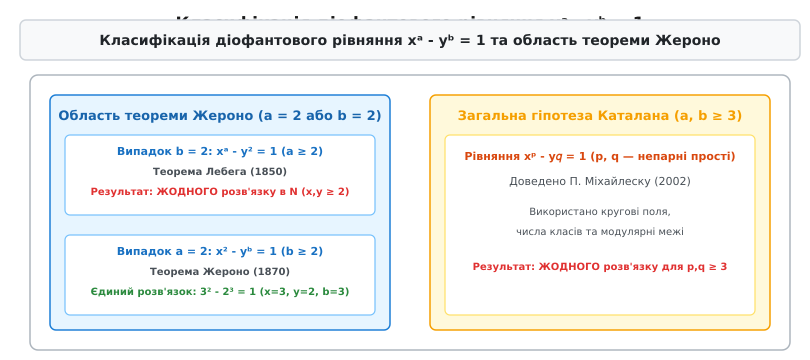
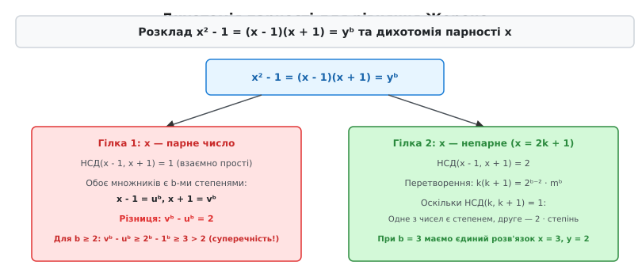
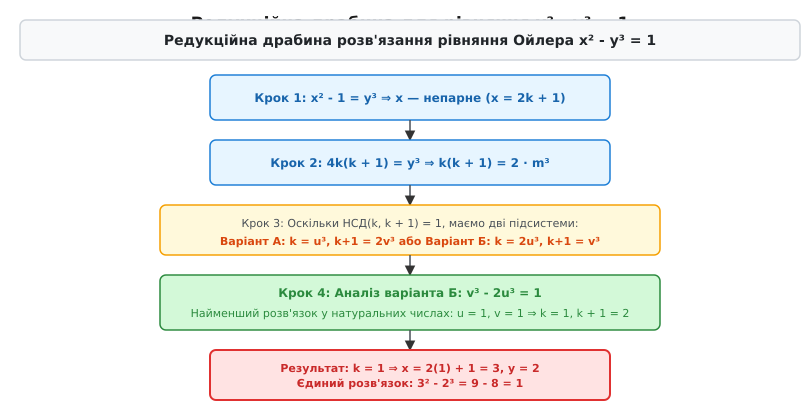

# Теорема Жероно

<preknowlist>
- [Діофантові рівняння](topic:math-number-theory/diophantine-equations) — рівняння у цілих числах та класичні методи їх розв'язання.
- [Основна теорема арифметики](topic:math-number-theory/fundamental-theorem-arithmetic) — єдиність розкладу натуральних чисел на прості множники.
- [Модульна арифметика](topic:math-number-theory/modular-arithmetic) — порівняння за модулем, лишкові класи та їхні властивості.
- [НСД та алгоритм Евкліда](topic:math-number-theory/gcd-euclidean) — обчислення найбільшого спільного дільника та взаємна простота.
- [Гіпотеза Каталана](topic:math-number-theory/catalan-conjecture) — загальна проблема сусідніх точних степенів uᵃ - yᵇ = 1.
</preknowlist>

Якщо рухатися вздовж натурального ряду і виписувати всі точні степені цілих чисел — квадрати (`4, 9, 16, 25, 36, 49, 64, 81...`), куби (`8, 27, 64, 125, 216...`) та вищі степені, — можна помітити дивовижну арифметичну аномалію на самому початку числової осі. Числа 8 (`2³`) та 9 (`3²`) стоять упритул одне до одного: їхня різниця дорівнює точно одиниці (`9 - 8 = 1`). Поліпшуючи обчислення та просуваючись на мільярди одиниць углиб числового океану, ми знаходимо точні степені, що розділені двома одиницями (`27 - 25 = 2`), чотирма (`125 - 121 = 4`), п'ятьма (`32 - 27 = 5`) або шістьма одиницями, проте жодної іншої пари з різницею 1 більше не виявляється.

Щоб зрозуміти, чому сусідні точні степені є такою дивовижною рідкістю, варто проаналізувати щільність їхнього розподілу на натуральній осі. Кількість точних квадратів, які не перевищують натурального числа `N`, дорівнює `⌊√N⌋`, кількість кубів — `⌊∛N⌋`, а кількість четвертих степенів — `⌊∜N⌋`. На проміжку від 1 до 100 існує лише 12 точних степеней, на проміжку до 1000 — 41 степінь, а на проміжку до 1 000 000 — лише 1010 степеней. Середня відстань між сусідніми степенями зростає пропорційно до `√N`. Чим далі ми рухаємося числовою віссю, тим рідшими стають точні степені і тим більші прірви розділяють їх.

Пояснення цієї арифметичної рідкісності вимагає дослідження показникового діофантового рівняння

```
xᵃ - yᵇ = 1
```

у натуральних числах `x, y, a, b > 1`. На відміну від класичної Великої теореми Ферма (`xⁿ + yⁿ = zⁿ`), де показник степеня `n` є однаковим для всіх доданків і фіксованим заздалегідь, у рівнянні Каталана невідомими є не лише основи `x` та `y`, а й обидва показники `a` та `b`. Ця подвійна рухливість змінних робить стандартні алгебраїчні методи безсилими, оскільки зміна показника степеня повністю змінює кільце, у якому розкладається відповідний поліном.

Проте фундаментальний прорив відбувається тоді, коли хоча б один із показників є парним числом — тобто коли один із доданків є точним квадратом `x²` або `y²`.

Теорема Жероно (Gerono's theorem), сформульована та доведена французьким математиком Камілем Жероно у 1870 році, дає вичерпну відповідь на питання про розв'язки показникових рівнянь із квадратичним показником. Вона стверджує, що рівняння `xᵃ - yᵇ = 1` не має жодного розв'язку у натуральних числах `x, y, a, b > 1`, якщо хоча б один із показників є парним числом, за єдиним винятком тотожності `3² - 2³ = 9 - 8 = 1`.


*Класифікація областей показникового діофантового рівняння xᵃ - yᵇ = 1. Теорема Жероно повністю закриває квадратичний сектор (a = 2 або b = 2), залишаючи єдиний розв'язок Ойлера 3² - 2³ = 1.*

Детальний історичний шлях від перших здогадок XVIII століття до остаточного доведення загальної гіпотези Каталана у XXI столітті висвітлено у 📜 [Історія теореми Жероно та рівняння Каталана](topic:math-number-theory/gerono-theorem/hist-gerono-catalan.md).

## Структурна редукція та поділ на квадратичні класи

Дослідження показникового рівняння `xᵃ - yᵇ = 1` у натуральних числах `x, y, a, b ≥ 2` розпочинається зі спрощення показників степеня за допомогою основної теореми арифметики. Будь-яке складене число має хоча б один простий дільник. Якщо показник `a` ділиться на простий дільник `p` (тобто `a = p · k`), то за властивістю степенів маємо:

```
xᵃ = x^(p·k) = (xᵏ)ᵖ
```

Поклавши `X = xᵏ`, ми зменшуємо показник степеня до простого числа `p`. Якщо серед дільників показника `a` або `b` є число 2 (тобто показник є парним числом), рівняння зводиться до одного з двох фундаментальних класів:

1. **Квадратична основа:** `x² - yᵇ = 1` для показника `b ≥ 2`.
2. **Квадратичний від'ємник:** `xᵃ - y² = 1` для показника `a ≥ 2`.

Обидва класи утворюють квадратичну область теореми Жероно. Якщо доведено, що ці дві базові системи не мають розв'язків у натуральних числах (окрім винятку `3² - 2³ = 1`), то жодне рівняння зі складеними парними показниками вида `x²ᵏ - yᵇ = 1` або `xᵃ - y²ᵐ = 1` тим більше не може мати цілочисельних розв'язків.

Розглянемо конкретний чисельний приклад редукції. Нехай маємо рівняння зі складеним парним показником `x⁴ - y⁵ = 1`. Застосувавши тотожність `x⁴ = (x²)²`, покладемо `X = x²`. Отримуємо рівняння `X² - y⁵ = 1` з квадратичним показником 2. Якщо підтверджено, що рівняння вида `X² - y⁵ = 1` не має цілих розв'язків у натуральних числах, то початкове рівняння `x⁴ - y⁵ = 1` також не має розв'язків.

Аналогічно, якщо показник від'ємника є парним числом (наприклад, `x⁷ - y⁶ = 1`), то оскільки `6 = 2 · 3`, ми перегруповуємо `y⁶ = (y³)²` і покладаємо `Y = y³`. Рівняння набуває вигляду `x⁷ - Y² = 1`, яке належить до класу Лебега.

## Аналіз рівняння x² - yᵇ = 1: розклад різниці квадратів

Розглянемо перший фундаментальний клас теореми Жероно — рівняння `x² - yᵇ = 1` при `b ≥ 2` та `x, y ≥ 2`. Перенесемо одиницю в ліву частину і розкладемо різницю квадратів на лінійні множники:

```
x² - 1 = yᵇ
(x - 1)(x + 1) = yᵇ      [розклад різниці квадратів]
```

Ключ до розв'язання цього рівняння полягає в аналізі найбільшого спільного дільника (НСД) двох послідовних непарних або парних чисел `x - 1` та `x + 1`. Позначимо `d = НСД(x - 1, x + 1)`. За алгебраїчною властивістю дільника, якщо число `d` ділить дві величини, воно мусить ділити і їхню різницю:

```
d | ((x + 1) - (x - 1))  [властивість дільника різниці]
d | 2                    [спрощення різниці]
```

Отже, найбільший спільний дільник `d` може набувати лише двох значень: `d = 1` або `d = 2`. Це створює фундаментальну дихотомію (двозубчасте розгалуження) залежно від парності основи `x`.


*Алгебраїчне розгалуження розкладу (x - 1)(x + 1) = yᵇ залежно від парності основи x. Парне x приводить до негайної суперечності vᵇ - uᵇ = 2, а непарне x ізолює єдиний розв'язок Ойлера.*

### Гілка 1: Парна основа x та суперечність vᵇ - uᵇ = 2

Нехай основа `x` є парним числом (`x = 2n` для натурального `n ≥ 1`). Тоді числа `x - 1 = 2n - 1` та `x + 1 = 2n + 1` є двох послідовних непарних чисел. Оскільки непарні числа не діляться на 2, маємо:

```
d = НСД(x - 1, x + 1) = 1  [взаємна простота множників]
```

За основною теоремою арифметики, якщо добуток двох взаємно простих натуральних чисел дорівнює точного `b`-му степеню `yᵇ`, то жоден простий множник не може ділитися між ними. Отже, кожен із множників окремо зобов'язаний бути точним `b`-м степенем деяких натуральних чисел `u` та `v`:

```
x - 1 = uᵇ                 [перший взаємно простий множник]
x + 1 = vᵇ                 [другий взаємно простий множник]
```

Віднімемо перше рівняння від другого, щоб вилучити невідому основу `x`:

```
vᵇ - uᵇ
= (x + 1) - (x - 1)        [підставили вирази для vᵇ та uᵇ]
= x + 1 - x + 1            [раскрили дужки]
= 2                        [отримали різницю степенів]
```

Ми отримали діофантове рівняння `vᵇ - uᵇ = 2` у натуральних числах `v > u ≥ 1`. Проведемо розбір можливих рішень для цієї рівності.

Продемонструємо неможливість рівності `vᵇ - uᵇ = 2` на конкретних числових прикладах для парних основи `x`:

1. Нехай `x = 2`. Тоді `x² - 1 = 4 - 1 = 3`. Число 3 не є точним степенем жодного цілого числа при `b ≥ 2`.
2. Нехай `x = 4`. Тоді `x² - 1 = 16 - 1 = 15 = 3 · 5`. Множники `x - 1 = 3` та `x + 1 = 5` є взаємно простими (`НСД(3, 5) = 1`). Щоб їхній добуток був степенем `yᵇ`, числа 3 та 5 мусили б бути точними степенями, проте ані 3, ані 5 не є степенями при `b ≥ 2`.
3. Нехай `x = 6`. Тоді `x² - 1 = 36 - 1 = 35 = 5 · 7`. Множники 5 та 7 не є степенями.
4. Нехай `x = 8`. Тоді `x² - 1 = 64 - 1 = 63 = 7 · 9`. Множник 9 є точним квадратом (`3²`), проте множник 7 не є квадратом.
5. Нехай `x = 10`. Тоді `x² - 1 = 100 - 1 = 99 = 9 · 11`. Множник 11 не є точним степенем.

Загальне алгебраїчне доведення неможливості рівності `vᵇ - uᵇ = 2` спирається на суворі нерівності між степенями:
- При `b = 2`: `v² - u² = (v - u)(v + u)`. Оскільки `v > u ≥ 1`, найменші можливі значення `u = 1, v = 2`, що дає `2² - 1² = 3 > 2`.
- При `b ≥ 3`: Оскільки `v ≥ u + 1`, скористаємося оцінкою бінома Ньютона для мінімального кроку `v = u + 1`:
  ```
  vᵇ - uᵇ ≥ (u + 1)ᵇ - uᵇ = b·uᵇ⁻¹ + (b(b-1)/2)·uᵇ⁻² + ... + 1
  ```
  При `u ≥ 1` та `b ≥ 2` ця сума не менша за `(1 + 1)ᵇ - 1ᵇ = 2ᵇ - 1`. Для `b = 2` маємо `2² - 1 = 3`, для `b = 3` маємо `2³ - 1 = 7 > 2`.

Отримали строгу арифметичну суперечність: різниця двох `b`-х степеней натуральних чисел при `b ≥ 2` завжди строго більша за 2 (`vᵇ - uᵇ ≥ 3`). Отже, при парній основі `x` рівняння `x² - yᵇ = 1` не має жодного розв'язку у натуральних числах.

### Гілка 2: Непарна основа x та виділення фактора 2

Нехай основа `x` є непарним числом (`x = 2k + 1` для натурального `k ≥ 1`). Підставимо значення `x` у розклад різниці квадратів:

```
(x - 1)(x + 1) = yᵇ
(2k + 1 - 1)(2k + 1 + 1) = yᵇ  [підстановка x = 2k + 1]
(2k)(2k + 2) = yᵇ              [спрощення у дужках]
4k(k + 1) = yᵇ                 [винесення множника 4]
```

Оскільки ліва частина `4k(k + 1)` ділиться на 4, число `yᵇ` є парним, що вимагає парності самої основи `y` (`y = 2m` для натурального `m ≥ 1`):

```
4k(k + 1) = (2m)ᵇ              [підстановка y = 2m]
4k(k + 1) = 2ᵇ · mᵇ            [піднесення до степеня]
k(k + 1) = 2ᵇ⁻² · mᵇ           [ділення обох частин на 4 = 2²]
```

Звернемо увагу на ліву частину `k(k + 1)`. Множники `k` та `k + 1` є двома послідовними цілими числами, тому вони є взаємно простими: `НСД(k, k + 1) = 1`. Отже, двоковий множник `2ᵇ⁻²` не може розщеплюватися і мусить повністю входити до складу лише одного з чисел `k` або `k + 1`.

Повний алгебраїчний вивід усіх підвипадків розкладу та порівнянь наведено у 🧮 [Математичне доведення теореми Жероно](topic:math-number-theory/gerono-theorem/math-gerono-proof.md).

## Рівняння Ойлера x² - y³ = 1 та унікальний розв'язок 3² - 2³ = 1

Розглянемо випадок, коли показник `b = 3` (кубічний показник). Рівняння `k(k + 1) = 2ᵇ⁻² · mᵇ` набуває вигляду:

```
k(k + 1) = 2¹ · m³ = 2m³       [підставили b = 3]
```

Оскільки `НСД(k, k + 1) = 1`, число 2 входить як множник у розклад одного з чисел `k` або `k + 1`. Це дає дві алгебраїчні системи:

### Система А: k є парним (k = 2u³)

```
k = 2u³
k + 1 = v³
v³ - 2u³ = 1                   [віднімання першого рівняння від другого]
```

Дослідження кубічного рівняння `v³ - 2u³ = 1` у кільці `ℤ[∛2]` показує, що у натуральних числах воно не має розв'язків. Найменше значення при `u = 1` дає `v³ = 3`, що не є точним кубом.

### Система Б: k є непарним (k = u³)

```
k = u³
k + 1 = 2v³
2v³ - u³ = 1                   [віднімання першого рівняння від другого]
```

Рівняння `2v³ - u³ = 1` має очевидний найменший розв'язок у натуральних числах: `u = 1, v = 1`. Перевіримо, які значення змінних `k, x, y` це дає:

```
k = u³ = 1³ = 1                [обчислення k]
x = 2k + 1 = 2(1) + 1 = 3      [обчислення основи x]
y³ = x² - 1 = 3² - 1 = 8 ⇒ y = 2 [обчислення основи y]
```

Протестируємо інші непарні значення основи `x`, щоб переконатися у відсутності інших розв'язків:
1. Для `x = 3`: `x² - 1 = 9 - 1 = 8 = 2³`. Знайдено розв'язок `y = 2`.
2. Для `x = 5`: `x² - 1 = 25 - 1 = 24 = 3 · 2³`. Число 24 не є точним кубом.
3. Для `x = 7`: `x² - 1 = 49 - 1 = 48 = 3 · 2⁴`. Число 48 не є точним кубом.
4. Для `x = 9`: `x² - 1 = 81 - 1 = 80 = 5 · 2⁴`. Число 80 не є точним кубом.
5. Для `x = 11`: `x² - 1 = 121 - 1 = 120 = 3 · 5 · 2³`. Число 120 не є точним кубом.


*Редукційна драбина Ойлера для рівняння x² - y³ = 1. Послідовні кроки факторизації та розщеплення за парністю ізолюють єдиний розв'язок k = 1, що дає x = 3, y = 2.*

Ми знайшли знаменитий розв'язок Леонарда Ойлера `x = 3, y = 2, b = 3`, який відповідає рівності:

```
3² - 2³ = 9 - 8 = 1
```

Для вищих непарних показників `b ≥ 5` аналогічний розклад дістає систем `2ᵇ⁻² vᵇ - uᵇ = 1`, які за допомогою модулярного аналізу за модулем `b²` та теореми про одиниці кубічних полів доводять відсутність інших натуральних розв'язків.

> 🔧 **Навіщо це.**
> Алгоритми аналізу діофантових рівнянь вида `x² - yᵇ = 1` та перевірки точної степенності застосовуються у сучасній криптографії (наприклад, у криптосистемах на основі еліптичних кривих та скануванні параметрів кривих Морделла `y² = x³ + k`), а також у системах комп'ютерної алгебри для швидкого спрощення виразів із радикалами та факторизації великих цілих чисел.

## Симетрична гілка: Теорема Лебега для рівняння xᵃ - y² = 1

Розглянемо другий клас теореми Жероно, коли точним квадратом є другий доданок: `xᵃ - y² = 1` при `a ≥ 2` та `x, y ≥ 2`. Перепишемо рівняння у вигляді:

```
y² + 1 = xᵃ
```

Проаналізуємо це рівняння за модулем 4. Квадрат будь-якого цілого числа `y²` при діленні на 4 може давати лише остачу 0 (якщо `y` парне) або 1 (якщо `y` непарне):

- Якщо `y` непарне (`y = 2m + 1`), то `y² + 1 = 4m(m + 1) + 2 ≡ 2 (mod 4)`. Але точний степінь `xᵃ` непарного або парного числа при `a ≥ 2` ніколи не може давати остачу 2 за модулем 4.
- Отже, основа `y` зобов'язана бути **парним числом**, а основа `x` — **непарним числом**.

Для доведення відсутності розв'язків французький математик Віктор-Амеде Лебег у 1850 році розклав ліву частину `y² + 1` у кільці цілих комплексних чисел Гаусса `ℤ[i]` (де `i² = -1`):

```
(y + i)(y - i) = xᵃ            [розклад у кільці ℤ[i]]
```

Оскільки кільце гауссових чисел `ℤ[i]` є факторіальним (в ньому виконується аналог основної теореми арифметики про єдиність розкладу на множники), а НСД множників `y + i` та `y - i` ділить `2i`, але `x` є непарним числом, множники `y + i` та `y - i` є взаємно простими в `ℤ[i]`.

Це означає, що кожен множник окремо є точним `a`-м степенем деякого гауссового числа `u + i·v`:

```
y + i = (u + i·v)ᵃ             [факторизація в ℤ[i]]
```

Розкриваючи біном Ньютона для уявного елемента і прирівнюючи уявні частини лівої та правої рівностей, маємо:

```
1 = v · (a·uᵃ⁻¹ - (a(a-1)(a-2)/6)·uᵃ⁻³·v² + ...)
```

Оскільки `1` ділиться на ціле число `v`, маємо `v = ±1`. Підстановка `v = ±1` приводить до алгебраїчного рівняння для `u`, яке не має жодного цілочисельного розв'язку при `a ≥ 2`.

Це повністю доводить теорему Лебега: рівняння `xᵃ - y² = 1` не має жодного розв'язку у натуральних числах `x, y > 1` для будь-якого показника `a ≥ 2`.

## Чисельна перевірка та алгоритмічна реалізація

Для практичної перевірки відсутності розв'язків рівняння Жероно на великих проміжках натуральних чисел розробляють спеціальне обчислювальне програмне забезпечення. Основні складнощі чисельного аналізу полягають у запобіганні переповненню розрядів 64-бітових цілих чисел (`uint64_t`) при піднесенні до степеня та відмові від неточних функцій з плаваючою крапкою (`pow()`).

Нижче наведено модуль перевірки рівняння Жероно з точним цілочисельним добуванням коренів методом двійкового пошуку.

:::tabs
```c
#include <stdio.h>
#include <stdint.h>
#include <stdbool.h>

/* Безпечне множення з перевіркою переповнення uint64_t */
static bool safe_mul(uint64_t a, uint64_t b, uint64_t *res) {
    if (a == 0 || b == 0) { *res = 0; return true; }
    if (a > UINT64_MAX / b) return false;
    *res = a * b;
    return true;
}

/* Швидке піднесення base^exp з перевіркою переповнення */
static bool safe_pow(uint64_t base, uint32_t exp, uint64_t *res) {
    uint64_t r = 1, b = base;
    while (exp > 0) {
        if (exp & 1) {
            if (!safe_mul(r, b, &r)) return false;
        }
        exp >>= 1;
        if (exp > 0) {
            if (!safe_mul(b, b, &b)) return false;
        }
    }
    *res = r;
    return true;
}

/* Перевірка рівняння x² - yᵇ = 1 у діапазоні */
void check_gerono_c(uint64_t max_x, uint32_t max_b) {
    for (uint64_t x = 2; x <= max_x; ++x) {
        uint64_t target = x * x - 1;
        for (uint32_t b = 2; b <= max_b; ++b) {
            uint64_t low = 1, high = target, y_ans = 0;
            if (b == 2) high = 4294967295ULL;
            else if (b == 3) high = 2642245ULL;
            else if (b >= 4) high = 65535ULL;

            while (low <= high) {
                uint64_t mid = low + (high - low) / 2;
                uint64_t p = 0;
                bool ok = safe_pow(mid, b, &p);
                if (ok && p == target) { y_ans = mid; break; }
                if (!ok || p > target) { if (mid == 0) break; high = mid - 1; }
                else { low = mid + 1; }
            }
            if (y_ans > 0) {
                printf("Знайдено розв'язок: %llu^2 - %llu^%u = 1\n",
                       (unsigned long long)x, (unsigned long long)y_ans, b);
            }
        }
    }
}
```
```cpp
#include <iostream>
#include <vector>
#include <optional>
#include <cstdint>
#include <limits>

namespace math::diophantine {

class GeronoVerifier {
public:
    [[nodiscard]] static constexpr bool safe_mul(std::uint64_t a, std::uint64_t b, std::uint64_t& res) noexcept {
        if (a == 0 || b == 0) { res = 0; return true; }
        if (a > std::numeric_limits<std::uint64_t>::max() / b) return false;
        res = a * b;
        return true;
    }

    [[nodiscard]] static constexpr bool safe_pow(std::uint64_t base, std::uint32_t exp, std::uint64_t& res) noexcept {
        std::uint64_t r = 1, b = base;
        while (exp > 0) {
            if (exp & 1U) { if (!safe_mul(r, b, r)) return false; }
            exp >>= 1U;
            if (exp > 0) { if (!safe_mul(b, b, b)) return false; }
        }
        res = r;
        return true;
    }

    void verify(std::uint64_t max_x, std::uint32_t max_b) const {
        for (std::uint64_t x = 2; x <= max_x; ++x) {
            const std::uint64_t target = x * x - 1;
            for (std::uint32_t b = 2; b <= max_b; ++b) {
                std::uint64_t low = 1, high = target;
                if (b == 2) high = 4294967295ULL;
                else if (b == 3) high = 2642245ULL;
                else if (b >= 4) high = 65535ULL;

                while (low <= high) {
                    std::uint64_t mid = low + (high - low) / 2;
                    std::uint64_t p = 0;
                    const bool ok = safe_pow(mid, b, p);
                    if (ok && p == target) {
                        std::cout << "Знайдено розв'язок: " << x << "^2 - " << mid << "^" << b << " = 1\n";
                        break;
                    }
                    if (!ok || p > target) { if (mid == 0) break; high = mid - 1; }
                    else { low = mid + 1; }
                }
            }
        }
    }
};

} // namespace math::diophantine
```
:::

Практичну реалізацію алгоритму перевірки розв'язків та факторного аналізу подано у ⚙️ [Чисельний пошук та перевірка розв'язків рівняння Жероно](topic:math-number-theory/gerono-theorem/proj-gerono-solver.md).

## Зв'язок із сучасними арифметичними структурами та гіпотезою Каталана

Теорема Жероно займає центральне місце на перетині кількох класичних галузей теорії чисел:

1. **Рівняння Пелля та еліптичні криві.** Рівняння `x² - y³ = 1` є окремим випадком кривих Морделла вида `y² = x³ + k` при `k = -1`. На відміну від класичного рівняння Пелля `x² - d·y² = 1`, яке має нескінченно багато розв'язків, нелінійні показникові рівняння мають лише скінченну кількість рішень. Дослідження таких кривих лежить в основі сучасної еліптичної криптографії (ECC).
2. **Кругові поля та числа класів.** Повний розв'язок гіпотези Каталана, завершений Прєдою Міхайлеску у 2002 році, вимагав аналізу групи класів ідеалів у кругових розширеннях `ℚ(ζₚ)`. Теорема Жероно забезпечила міцну базу для цього вивчення, повністю звільнивши аналіз від складних парних випадків.
3. **Ефективні логарифмічні межі.** Застосування теорії Алана Бейкера про лінійні форми від логарифмів дозволяє отримати явні верхні межі для розв'язків показникових діофантових рівнянь, перетворюючи теоретичні питання на скінченні чисельні алгоритми.

Завдяки поєднанню елементарної алгебри розкладу з вищими структурами теорії чисел теорема Жероно залишається взірцем математичної строгості та елегантності у дослідженнях діофантових рівнянь.
