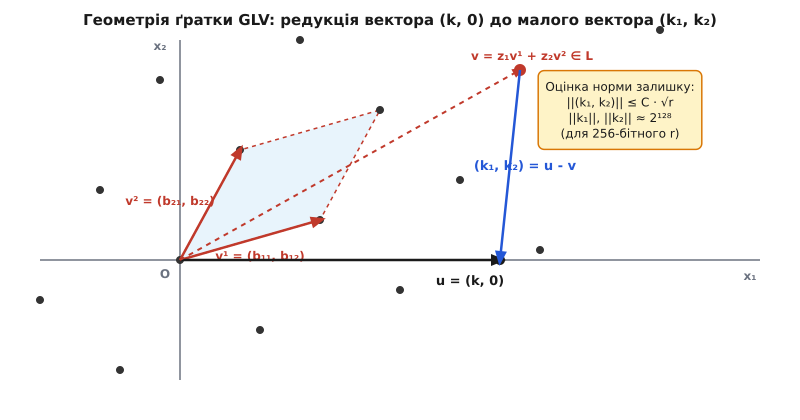
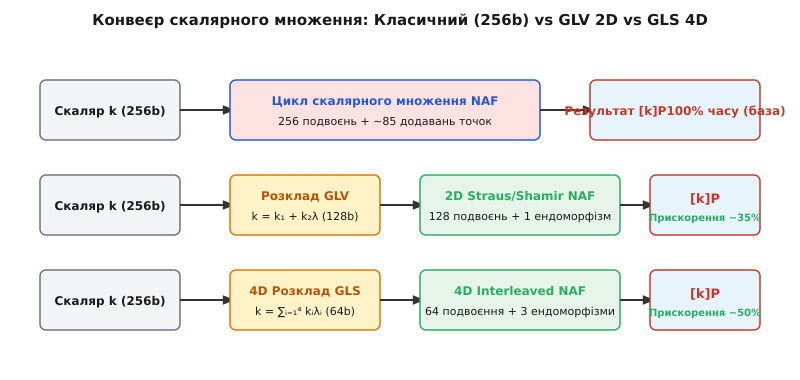
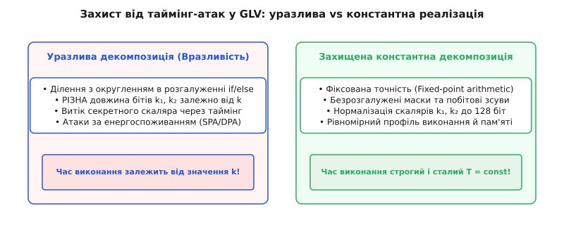

# Ендоморфізм GLV/GLS

<preknowlist>
- [Скінченні поля (поля Галуа)](root:math-algebra/finite-field-arithmetic) — алгебра та арифметика полів `F_p` та `F_{p²}`, квадратичні розширення, група автоморфізмів.
- [Спарювання еліптичних кривих](root:math-number-theory/elliptic-curve-pairings) — геометрія групового закону `E(F_p)`, проективні координати Якобі, форма Вейєрштрасса та подвоєння точок.
- [Проблема дискретного логарифма](root:sf-security/discrete-log-problem) — математична стійкість криптосистем ECDSA/Schnorr, криптографічні підгрупи та порядок `r`.
- [Криптографія на ґратках](root:sf-security/lattice-cryptography) — поняття базису ґратки `L`, визначник, редукція LLL та задача шукання найближчого вектора (CVP).
</preknowlist>

У високонавантажених криптографічних вузлах мереж Bitcoin та Ethereum обробка тисяч цифрових підписів за секунду впирається в єдине обчислювальне вузьке місце — скалярне множення точок еліптичної кривої `Q = [k]P`. При стандартній довжині скаляра `k` у 256 бітів класичні алгоритми (двійковий перебір `Double-and-Add` або віконний метод `wNAF`) вимагають виконання послідовності з приблизно 256 операцій подвоєння точок та 80 операцій додавань. Оскільки кожне подвоєння точки в проективних координатах вимагає від 7 до 12 множень у скінченному полі `F_p`, обчислення скалярного множення споживає понад 80% усього процесорного часу криптографічних протоколів. Спроби прискорити цей процес шляхом збільшення розміру вікна NAF швидко стикаються з обмеженням оперативної пам'яті для кешування попередньо обчислених точок.

Фундаментальне розв'язання цієї проблеми запропонували криптографи Роберт Ґаллант, Роберт Ламберт та Скотт Ванстоун у 2001 році (метод GLV), аго згодом у 2009 році узагальнили Стівен Ґалбрейт, Сібін Лінь та Майкл Скотт (метод GLS). Ідея полягає у використанні ефективно обчислюваного алгебраїчного ендоморфізму (грец. *endon* — усередині, *morphe* — форма) еліптичної кривої `phi: E -> E`. Якщо на кривій існує ендоморфізм, який діє на точки підгрупи праймового порядку `r` як множення на відомий скаляр `lambda` (тобто `phi(P) = [lambda]P`), то великий 256-бітний скаляр `k` можна розкласти на два скаляри `k_1` та `k_2`, довжина яких не перевищує 128 бітів: `k = k_1 + k_2 · lambda \pmod r`. Завдяки цьому обчислення `[k]P` зводиться до суми двох скалярних множень половиною довжини: `[k_1]P + [k_2]phi(P)`. Застосовуючи алгоритм одночасного сумісного множення (метод Штрауса або сумісний NAF), кількість послідовних подвоєнь точок скорочується вдвічі — зі 256 до 128 кроків, а обчислення самого ендоморфізму `phi(P)` вимагає лише одного множення у полі `F_p`.

## 1. Алгебраїчна структура кільця ендоморфізмів та CM-криві

Ендоморфізм еліптичної кривої `E` над скінченним полем `K` — це алгебраїчний гомоморфізм `phi: E(K̄) -> E(K̄)`, що задається раціональними функціями від координат точки `(x, y)` та відображає точку нескінченності `O` в `O`. Множина всіх таких відображень утворює кільце `End(E)` стосовно операцій точкового додавання `(phi + psi)(P) = phi(P) + psi(P)` та композиції `(phi ∘ psi)(P) = phi(psi(P))`.

Теорія комплексного множення є однією з найглибших галузей алгебраїчної теорії чисел та арифметичної геометрії. Історично вона виникла із досліджень Леопольда Кронекера щодо абелевих розширень уявних квадратичних полів (відома проблема *Kronecker's Jugendtraum*). Дійсна алгебра `End(E) ⊗ Q` для еліптичних кривих над скінченними полями може приймати одну з двох структур:
1. Квадратичне уявне поле `Q(sqrt(-D))` — у цьому випадку крива має комплексне множення (англ. *Complex Multiplication*, CM-крива).
2. Кватерніонна алгебра над `Q`, розгалужена в `p` та `∞` — у цьому випадку крива є суперсингулярною.

Для ординарних еліптичних кривих (які використовуються в асиметричній криптографії завдяки захисту від атак Менезеса-Окамото-Ванстоуна) кільце `End(E)` є ізоморфним порядку `O_D` в уявному квадратичному полі `Q(sqrt(-D))`. Абсолютне значення дискримінанта `D` визначає ступінь алгебраїчного розширення. Класове число кільця `h(D)` визначає кількість класів ізоморфізму таких кривих над полем алгебраїчного замикання. Модулярний j-інваріант CM-кривої є коренем многочлена класів Гільберта `H_D(X) ∈ Z[X]`.

Якщо дискримінант `D` є дуже малим (наприклад, `D = 3` або `D = 1`), многочлен Гільберта має степінь 1 (`H_3(X) = X`, `H_1(X) = X - 1728`), і еліптична крива володіє "автоморфізмами" — ендоморфізмами-ізоморфізмами дуже малого степеня.

Для кривих із дискримінантом `D = 3` група автоморфізмів `Aut(E)` є циклічною групою порядку 6 (`Z_6`), що є максимально можливим порядком автоморфізмів для еліптичних кривих у характеристиці, відмінній від 2 та 3. Для кривих із `D = 1` група автоморфізмів дорівнює `Z_4`. Саме наявність багатьох додаткових автоморфізмів дозволяє виразити дію ендоморфізму через простий алгебраїчний масштаб координат.

### Випадок D = 3 (j-інваріант 0)

Розглянемо криві у формі Короткого Вейєрштрасса з `a = 0`:

```
E: y² = x³ + b  (над полем F_p)
```

Класичним представником цього класу є крива `secp256k1`, яка є стандартом де-факто у системі Bitcoin. Вона задається параметром `b = 7`, а модуль поля становить:

```
p = 2²⁵⁶ - 2³² - 977
  = 115792089237316195423570985008687907853269984665640564039457584007908834671663
```

Порядок підгрупи точок кривої дорівнює простому числу `r`:

```
r = 115792089237316195423570985008687907852837564279074904382605163141518161494337
```

Оскільки `p ≡ 1 (mod 3)`, мультиплікативна група поля `F_p*` містить підгрупу порядку 3. Отже, у полі `F_p` існує нетривіальний кубічний корінь з одиниці `beta ∈ F_p`, який задовольняє рівняння:

```
beta³ ≡ 1 (mod p),   beta ≠ 1
beta² + beta + 1 ≡ 0 (mod p)
```

Для кривої `secp256k1` значення `beta` в шістнадцятковому форматі дорівнює:

```
beta = 0x7ae96a2b657c07106e64479eac3434e99cf0497512f58995c1396c28719501ee
```

Визначимо відображення `phi: E -> E` на декартових координатах точки `P = (x, y)`:

```
phi(O) = O
phi(x, y) = (beta · x, y)
```

Перевіримо алгебраїчну належність точки `phi(P)` кривій `E(F_p)` шляхом прямої підстановки у рівняння:

```
y²
= (beta · x)³ + b    [підставили координату x' = beta · x]
= beta³ · x³ + b    [за властивістю степеня добутку]
= 1 · x³ + b        [оскільки beta³ ≡ 1 (mod p)]
= x³ + b            [отримали початкове рівняння кривої]
```

### Алгебраїчний доказ гомоморфності ендоморфізму phi

Доведемо строго, що відображення `phi` є гомоморфізмом групового закону додавання точок: `phi(P₁ + P₂) = phi(P₁) + phi(P₂)`.

Нехай `P₁ = (x₁, y₁)` та `P₂ = (x₂, y₂)` — дві довільні точки кривої. За формулами січних та дотичних геометричного закону Вейєрштрасса, координати суми `P₃ = P₁ + P₂ = (x₃, y₃)` визначаються нахилом прямої `lambda_s`:

```
lambda_s = (y₂ - y₁) / (x₂ - x₁)      [якщо P₁ ≠ P₂]
x₃ = lambda_s² - x₁ - x₂
y₃ = lambda_s · (x₁ - x₃) - y₁
```

Застосуємо відображення `phi` до оперуваних точок `P₁' = phi(P₁) = (beta · x₁, y₁)` та `P₂' = phi(P₂) = (beta · x₂, y₂)`. Обчислимо кутовий коефіцієнт січної прямої `lambda_s'`:

```
lambda_s'
= (y₂ - y₁) / (beta · x₂ - beta · x₁)                      [підставили видозмінені x-координати]
= (1 / beta) · [ (y₂ - y₁) / (x₂ - x₁) ]                    [винесли beta за дужки у знаменнику]
= (1 / beta) · lambda_s                                    [підставили визначення lambda_s]
```

Тепер обчислимо координату `x₃'` точки суми `P₃' = P₁' + P₂'`:

```
x₃'
= (lambda_s')² - (beta · x₁) - (beta · x₂)                  [підставили розширені координати]
= (1 / beta²) · lambda_s² - beta · (x₁ + x₂)               [розкрили квадрат степеня]
= beta · lambda_s² - beta · (x₁ + x₂)                      [бо 1 / beta² ≡ beta³ / beta² ≡ beta (mod p)]
= beta · (lambda_s² - x₁ - x₂)                             [винесли beta за дужки]
= beta · x₃                                                [за визначенням x₃]
```

Координата `y₃'` суми визначається аналогічно:

```
y₃'
= lambda_s' · (beta · x₁ - x₃') - y₁                       [підставили координати x1' та x3']
= ((1 / beta) · lambda_s) · (beta · x₁ - beta · x₃) - y₁   [заставили x₃' = beta · x₃ та lambda_s']
= lambda_s · (x₁ - x₃) - y₁                                [скоротили beta та 1 / beta]
= y₃                                                       [за визначенням y₃]
```

Отже, точка суми дорівнює `(beta · x₃, y₃) = phi(P₃) = phi(P₁ + P₂)`. Доказ для випадку `P₁ = P₂` (подвоєння точки) проводиться аналогічно з використанням кутового коефіцієнта дотичної `lambda_s = 3 · x₁² / (2 · y₁)`.

Оскільки група точок `E(F_p)[r]` є циклічною групою простого порядку `r`, будь-який ендоморфізм цієї групи еквівалентний скалярному множенню на деяке ціле число `lambda ∈ Z_r`. Щоб знайти `lambda`, піднесемо вираз `phi(P)` до другого степеня в сенсі композиції відображень:

```
phi(phi(P)) = phi(beta · x, y) = (beta² · x, y)
```

Додаючи відображення відповідно до алгебраїчної суми `phi²(P) + phi(P) + P`, отримуємо:

```
(beta² · x, y) + (beta · x, y) + (x, y) = O
```

Отже, характеристичний многочлен ендоморфізму `phi` на підгрупі `E[r]` має вигляд `lambda² + lambda + 1 ≡ 0 (mod r)`. Корінь цього рівняння у полі `Z_r` для `secp256k1` дорівнює:

```
lambda = 0x5363ad4cc05c30e0a5261c028812645a122e22ea20816678df02967c1b23bd72
```

### Переваги у проективних координатах Якобі

Під час практичних обчислень точки кривої представляють у проективних координатах Якобі `(X:Y:Z)`, де декартові координати відновлюються як `x = X / Z²` та `y = Y / Z³`.

Підставимо відображення `phi` у координати Якобі:

```
x' = beta · x = beta · (X / Z²) = (beta · X) / Z²
y' = y = Y / Z³
```

Звідси випливає, що в координатах Якобі ендоморфізм перетворює потрійне значення координат наступним чином:

```
phi(X : Y : Z) = (beta · X : Y : Z)
```

Це дивовижний результат: координати `Y` та `Z` залишаються повністю незмінними, а для обчислення `phi(P)` потрібно виконати лише одне множення у полі `F_p` (`X' = beta · X mod p`). Операція не вимагає жодних квадратів, додавань чи обчислень обернених елементів!

У порівнянні з іншими проективними системами координат (наприклад, модифікованими координатами Якобі `(X:Y:Z:aZ⁴)` або скрученими Едвардсовими координатами `(X:Y:Z:T)`), проективна форма Якобі є найбільш гармонійною для GLV-ендоморфізму. Вона дозволяє підтримувати координати `Y` та `Z` незмінними без потреби оновлювати допоміжні параметри `aZ⁴` або додаткову координату `T = X · Y / Z`.

### Випадок D = 1 (j-інваріант 1728)

Для кривих виду `E: y² = x³ + a·x` над полем `F_p` з `p ≡ 1 (mod 4)` існує корінь `i ∈ F_p`, такий що `i² ≡ -1 (mod p)`. Ендоморфізм задається формулою `phi(x, y) = (-x, i · y)`. В цьому випадку характеристичне рівняння має вигляд `lambda² + 1 ≡ 0 (mod r)`, а обчислення `phi(P)` вимагає одного множення координати `y` на `i` та зміни знака координати `x`.

Детальний історичний огляд відкриття та патентних суперечок навколо методів GLV і GLS висвітлено у вставці [Історія створення та патентування методу GLV](root:math-number-theory/glv-endomorphism/hist-glv-method.md).

## 2. Геометрія ґраток та алгоритм декомпозиції скаляра (GLV 2D)

За наявності ефективного ендоморфізму `phi(P) = [lambda]P`, задача обчислення `Q = [k]P` для довільного скаляра `k ∈ [1, r - 1]` зводиться до пошуку двох малих скалярів `k₁, k₂ ∈ Z`, які задовольняють співвідношення:

```
k ≡ k₁ + k₂ · lambda (mod r)
```

причому норми скалярів обмежені значенням порядку `√r`:

```
|k₁|, |k₂| ≤ C · √r ≈ 2¹²⁸
```

де `C` — обчислювана константа, що залежить від геометрії ґратки.

### Алгебраїчне формулювання через 2D-ґратку

Розглянемо множину векторів `L ⊂ Z²`, визначену як:

```
L = { (v₁, v₂) ∈ Z²  :  v₁ + v₂ · lambda ≡ 0 (mod r) }
```

Легко перевірити, що множина `L` утворює двовимірну цілочисельну ґратку у просторі `R²`. Ґратка `L` є дискретною підгрупою, генеруємою двома лінійно незалежними вектором-базисами `v¹ = (b₁₁, b₁₂)` та `v² = (b₂₁, b₂₂)`. Визначник цієї ґратки (площа фундаментального паралелограма) дорівнює порядку кривої: `det(L) = |b₁₁ · b₂₂ - b₁₂ · b₂₁| = r`.

За теоремами Мінковського про опуклі тіла, будь-яка двовимірна ґратка визначника `r` містить ненульовий вектор `v`, норма якого обмежується фундаментальною константою `||v||₂ ≤ sqrt(2 / sqrt(3)) · sqrt(r) ≈ 1.074 · sqrt(r)`.

Розглянемо цільовий вектор `u = (k, 0) ∈ Z²`. Ми прагнемо знайти вектор ґратки `v = (v₁, v₂) ∈ L`, який розташований найближче до вектора `u`. Якщо такий вектор `v` знайдено, вектор залишку `(k₁, k₂) = u - v = (k - v₁, -v₂)` задовольняє шукану тотожність:

```
k₁ + k₂ · lambda
= (k - v₁) + (-v₂) · lambda         [за визначенням вектора залишку]
= k - (v₁ + v₂ · lambda)           [згрупували компоненти вектора v]
≡ k - 0 (mod r)                    [оскільки v = (v₁, v₂) ∈ L]
≡ k (mod r)                        [отримали початковий скаляр]
```

Оскільки вектор `v` є найближчим точковим вузлом ґратки до `u`, вектор залишку `(k₁, k₂)` лежить усередині фундаментального паралелограма ґратки `L`, а отже його компоненти за модулем не перевищують величину `O(√r)`.


*Геометрія ґратки GLV: вектор (k, 0) аппроксимується вектором ґратки v = z₁v¹ + z₂v², відносно якого залишок (k₁, k₂) має норму порядка √r.*

### Пошук короткого базису ґратки (Розширений алгоритм Евкліда)

Щоб отримати короткий базис `v¹` та `v²`, застосовують розширений алгоритм Евкліда (EGCD) до пар чисел `r` та `lambda`. На кожному кроці алгоритму обчислюються послідовності залишків `rᵢ` та коефіцієнтів `tᵢ`:

```
r₀ = r,        t₀ = 0
r₁ = lambda,   t₁ = 1
rᵢ₊₁ = rᵢ₋₁ - qᵢ · rᵢ,   tᵢ₊₁ = tᵢ₋₁ - qᵢ · tᵢ
```

Алгоритм зупиняють на кроці `m`, коли залишок вперше стає меншим за `√r`: `rⴉ < √r`. Базисні вектори обирають наступним чином:

```
v¹ = (b₁₁, b₁₂) = (rⴉ, -tⴉ)
v² = (b₂₁, b₂₂) = (rⴉ₊₁, -tⴉ₊₁)
```

За побудовою виконується `rᵢ + tᵢ · lambda ≡ 0 (mod r)`, тому `v¹` та `v²` гарантовано належать ґратці `L`.

Для кривої `secp256k1` знаходження базису дає наступні константи:

```
b₁₁ = +0x3086d221a7d46bcdeeb6c77684023ad2
b₁₂ = -0xe4437ed6010e88286f547fa90abfe4c3
b₂₁ = +0x114ca50f7a8e2f3f657c1108d9d44cfd8
b₂₂ = +0x3086d221a7d46bcdeeb6c77684023ad2
```

Усі чотири числа мають бітову довжину не більше 128 бітів.

### Алгоритм округлення Бабаї (Babai Rounding)

Для знаходження вектора ґратки `v`, найближчого до `u = (k, 0)`, використовується алгоритм Бабаї. Вектор `u` розкладається за базисом `B = [v¹; v²]`:

```
u = beta₁ · v¹ + beta₂ · v²
```

Помноживши обидві частини на обернену матрицю `B⁻¹`, отримуємо дійсні коефіцієнти:

```
beta₁ = (b₂₂ · k) / r
beta₂ = (-b₂₁ · k) / r
```

Округлюючи дійсні значення `beta₁` та `beta₂` до найближчих цілих чисел `z₁ = ⌊beta₁⌉` та `z₂ = ⌊beta₂⌉`, отримуємо вузол ґратки `v = z₁ · v¹ + z₂ · v²`.

Компоненти підсумкового розкладу обчислюються як:

```
k₁ = k - (z₁ · b₁₁ + z₂ · b₂₁)
k₂ = - (z₁ · b₁₂ + z₂ · b₂₂)
```

Властивість гарантує, що `|k₁| ≤ (|b₁₁| + |b₂₁|) / 2` та `|k₂| ≤ (|b₁₂| + |b₂₂|) / 2`, тобто обидва скаляри `k₁` та `k₂` строго не перевищують 128 бітів!

Строгий математичний доказ меж розкладу та покроковий приклад для secp256k1 подано у вставці [Математичний апарат розкладу Бабаї для GLV та GLS](root:math-number-theory/glv-endomorphism/math-babai-reduction.md).

## 3. Мультискалярне множення та метод Штрауса (Straus / Shamir Trick)

Отримавши розклад `k ≡ k₁ + k₂ · lambda (mod r)`, обчислення початкового скалярного добутку `Q = [k]P` зводиться до двовимірного мультискалярного множення:

```
Q = [k₁]P + [k₂]phi(P)
```

Позначивши `P₁ = P` та `P₂ = phi(P)`, ми маємо задачу обчислення суми `[k₁]P₁ + [k₂]P₂`.

Якщо виконувати скалярні множення окремо, ми обчислимо `[k₁]P₁` (128 подвоєнь), потім `[k₂]P₂` (128 подвоєнь), і додамо результати. Сумарно це дасть 256 подвоєнь — тобто жодного прискорення!

Ключ до оптимізації — метод Штрауса (також відомий як алгоритм Шаміра), який об'єднує подвоєння обох доданків у єдиному циклі.

### Сумісна несуттєво-знакова форма (JSF)

Скаляри `k₁` та `k₂` переводяться у сумісну несуттєво-знакову форму (англ. *Joint Sparse Form*, JSF), розроблену Джеромом Солінасом. Запис JSF виражає пару скалярів у вигляді матриці 2 × m з елементами `{ -1, 0, 1 }`:

```
k₁ = ∑ᵢ₌₀ᵐ⁻¹ aᵢ · 2ⁱ,   aᵢ ∈ {-1, 0, 1}
k₂ = ∑ᵢ₌₀ᵐ⁻¹ bᵢ · 2ⁱ,   bᵢ ∈ {-1, 0, 1}
```

Головні властивості JSF:
1. Максимальна бітова довжина `m ≤ max(len(k₁), len(k₂)) + 1` (для 128-бітних `k₁, k₂` маємо `m ≤ 129`).
2. Немає двох послідовних ненульових елементів у кожному рядку.
3. Середня щільність ненульових стовпчиків `(aᵢ, bᵢ) ≠ (0, 0)` становить всього **3/8** (37.5%), у той час як для звичайного двійкового запису вона дорівнює 3/4 (75%).

### Алгоритм створення сумісного NAF-представлення

Наведемо точний алгоритм обчислення матриці JSF для пари скалярів `(k₁, k₂)`:

```
вхід: цілі числа k₁, k₂
вихід: матриця значень aᵢ, bᵢ ∈ {-1, 0, 1}

l₁ = k₁,   l₂ = k₂
d₁ = 0,    d₂ = 0
i = 0

поки (l₁ + d₁ > 0) або (l₂ + d₂ > 0):
    n₁ = l₁ + d₁,   n₂ = l₂ + d₂
    u₁ = 0,         u₂ = 0
    
    якщо n₁ є непарним:
        u₁ = 2 - (n₁ mod 4)
        якщо (n₁ mod 8 == 3 або n₁ mod 8 == 5) та (n₂ mod 4 == 2):
            u₁ = -u₁
            
    якщо n₂ є непарним:
        u₂ = 2 - (n₂ mod 4)
        якщо (n₂ mod 8 == 3 або n₂ mod 8 == 5) та (n₁ mod 4 == 2):
            u₂ = -u₂
            
    a[i] = u₁,  b[i] = u₂
    
    d₁ = (d₁ + l₁ - u₁) / 2
    d₂ = (d₂ + l₂ - u₂) / 2
    l₁ = l₁ / 2,   l₂ = l₂ / 2
    i = i + 1
```

### Таблиця попередніх обчислень та обчислювальний цикл

Перед початком циклу будується таблиця попередньо обчислених точок для всіх можливих ненульових комбінацій значень `(aᵢ, bᵢ)`:

```
T[1, 0]  = P₁ = P
T[0, 1]  = P₂ = phi(P)
T[1, 1]  = P₁ + P₂ = P + phi(P)
T[1, -1] = P₁ - P₂ = P - phi(P)
```

Зауважте: для від'ємних комбінацій `T[-a, -b] = -T[a, b]`, що реалізується банальною зміною знака координати `Y` у скінченному полі!

Алгоритм Штрауса виконує наступну послідовність кроків:

1. Ініціалізація акумулятора: `R = O`.
2. Цикл від старшого біта `i = m - 1` спадаючи до `0`:
   - `R = [2]R` (одне подвоєння точки у проективних координатах).
   - Считується пара бітів `(aᵢ, bᵢ)`.
   - Якщо `(aᵢ, bᵢ) ≠ (0, 0)`, додається відповідна точка з таблиці: `R = R + sign(aᵢ) · T[|aᵢ|, bᵢ · sign(aᵢ)]`.


*Порівняння конвеєрів: стандартний алгоритм (256 подвоєнь) vs GLV 2D (128 подвоєнь) vs GLS 4D (64 подвоєння).*

### Оптимізація змішаного додавання точок (Mixed Addition)

Варто підкреслити фундаментальну перевагу використання ендоморфізму `phi(P) = (beta · x, y)` при розрахунку таблиці `T`: точка `P₂ = phi(P)` подається в афінній формі, оскільки `beta · x` обчислюється одним множенням без зміни координати `Z = 1`.

У проективних координатах Якобі додавання точки в афінній формі (`Z₂ = 1`, змішане додавання `Jacobian + Affine`) вимагає лише **8 множень та 3 квадратів** у полі `F_p` (`8M + 3S`), тоді як повне додавання двох точок у координатах Якобі (`Jacobian + Jacobian`) вимагає **12 множень та 4 квадратів** (`12M + 4S`). Це дає додаткову економію до 25% на кожній операції точкового додавання!

### Порівняльна обчислювальна складність

Порівняємо кількість операцій над точками кривої для 256-бітного скаляра:

| Метод | Довжина циклу (подвоєння) | Кількість додавань (середня) | Прекомп'ютація |
| :--- | :--- | :--- | :--- |
| **Класичний NAF (256b)** | 256 | ~85 | 0 (або 2–4 точки) |
| **GLV 2D + JSF (128b)** | 128 | ~48 (`128 · 3/8`) | 1 додавання (`P + phi(P)`) |
| **wGLV 2D (вікно w=4)** | 128 | ~32 (`128 / 4`) | 8 точок |
| **GLS 4D + Interleaving (64b)** | 64 | ~30 | 7 додавань |

Зменшення кількості подвоєнь зі 256 до 128 дає пряму економію близько 45% загального часу обчислення `[k]P` з урахуванням малих накладних витрат на обчислення `phi(P)` та алгоритм Бабаї.

## 4. Ендоморфізм GLS (Galbraith-Lin-Scott) та 4D розклад

Головним обмеженням класичного методу GLV є його прив'язка до дуже вузького класу кривих над основними полями `F_p`, які мають комплексне множення з малим дискримінантом `D` (таких як `secp256k1` з `D = 3` або криві з `j = 1728`, де `D = 1`). Для довільно обраної кривої над `F_p` нетривіального ефективного ендоморфізму GLV не існує.

У 2009 році Стівен Ґалбрейт, Сібін Лінь та Майкл Скотт розробили метод GLS, який дозволяє конструювати ефективні ендоморфізми для кривих, визначених над розширеними полями `F_{p^2}` (або вищих ступенів), без потреби у комплексному множенні над початковим полем.

### Конструкція на квадратичних розширеннях та твістах

Розглянемо еліптичну криву `E: y² = x³ + a·x + b`, визначену над основним полем `F_p`. Розширимо поле до квадратичного розширення `F_{p^2} = F_p[u] / (u² - gamma)`, де `gamma ∈ F_p` є квадратичним нелишком.

Розглянемо квадратичний твіст кривої `E': y² = x³ + (a / d²) · x + (b / d³)`, де `d ∈ F_{p^2}` — квадратичний нелишниковий елемент у `F_{p^2}`. Між точками кривої `E'` та `E` існує ізоморфізм твісту `psi_d: E' -> E`:

```
psi_d(x, y) = (d · x, d^(3/2) · y)
```

Ключова ідея GLS полягає у використанні ендоморфізму Фробеніуса (лат. *Frobenius*) `pi: F_{p^2} -> F_{p^2}`, який підносить елементи поля до степеня `p`: `pi(alpha) = alpha^p`.

Для будь-якого елемента розширення `alpha = x₀ + x₁ · u ∈ F_{p^2}` його піднесення до степеня `p` дорівнює:

```
alpha^p = (x₀ + x₁ · u)^p = x₀^p + x₁^p · u^p = x₀ - x₁ · u
```

оскільки `x₀, x₁ ∈ F_p`, то `x₀^p = x₀`, а `u^p = u · (u²)^((p-1)/2) = u · gamma^((p-1)/2) = -u`.

Отже, ендоморфізм Фробеніуса у полі `F_{p^2}` є алгебраїчним спряженням і обчислюється банальною зміною знака уявної частини `x₁ -> -x₁` без жодного множення!

Поєднуючи ізоморфізм твісту та ендоморфізм Фробеніуса, будується GLS-ендоморфізм `psi: E' -> E'`:

```
psi = psi_d⁻¹ ∘ pi ∘ psi_d
```

На координатах точки `P = (x, y) ∈ E'(F_{p^2})` дію ендоморфізму `psi` можна виразити явними раціональними формулами:

```
psi(x, y) = (mu_x · x^p, mu_y · y^p)
```

де `mu_x, mu_y ∈ F_{p^2}` — наперед обчислені константи поля. На підгрупі порядку `r` ендоморфізм `psi` діє як множення на скаляр `lambda ≡ p (mod r)`.

### Комбінований 4D GLV/GLS розклад

Найпотужніший результат досягається при комбінуванні методів GLV та GLS на кривих над `F_{p^2}`, які одночасно мають CM-структуру. У цьому випадку на кривій існують два незалежних ендоморфізми: GLV-ендоморфізм `phi` та GLS-ендоморфізм `psi`. Вони генерують 4-вимірну декомпозицію скаляра `k`:

```
k ≡ k₁ + k₂ · lambda₁ + k₃ · lambda₂ + k₄ · lambda₃ (mod r)
```

де `lambda₁` — власне значення GLV, `lambda₂ = p`, a `lambda₃ = lambda₁ · p mod r`.

Обмеження на норми скалярів у 4D розкладі становить:

```
|kᵢ| ≤ C · r^(1/4) ≈ 2⁶⁴  (для 256-бітного порядку r)
```

Застосовуючи 4-вимірний алгоритм Штрауса, обчислення `[k]P` зводиться до сумарної операції:

```
[k]P = [k₁]P + [k₂]phi(P) + [k₃]psi(P) + [k₄]phi(psi(P))
```

Кількість подвоєнь точок у циклі скорочується у 4 рази — зі 256 до всього лише 64 кроків! Це забезпечує рекордну швидкість скалярного множення, яка використовується у сучасних системах з нульовим розголошенням (zk-SNARKs) та парних криптосистемах на базі кривих BLS12-381 та BN-254.

## 5. Застосування у парно-сумісних кривих та векторних прискорювачах (MSM)

У сучасній прикладної криптографії, зокрема у доказах з нульовим розголошенням (zk-SNARKs, Groth16, Plonk, F连续), основне обчислювальне навантаження падає на обчислення великих мультискалярних множень (MSM):

```
Q = ∑ᵢ₌₁ᴺ [kᵢ] Pᵢ
```

де `N` може сягати від `2¹⁶` до `2²⁶` точок.

Застосування декомпозиції GLV/GLS для кожної з `N` точок дозволяє удвічі збільшити ефективний розмір масиву точок `2N`, але зменшити бітову довжину скалярів `kᵢ` удвічі (со 256 бітів до 128 бітів).

В поєднанні з алгоритмом Піппенджера (Pippenger's MSM Algorithm) це дає наступні переваги:
1. Кількість віконних рівнів скорочується вдвічі (зі `256 / w` до `128 / w`), що зменшує загальну кількість подвоєнь точок у фінальному накопичувачі на 50%.
2. Оскільки обчислення `phi(Pᵢ)` вимагає лише одного множення у полі, векторний процесор (GPU або SIMD AVX-512) може миттєво згенерувати розширений масив точок `(Pᵢ, phi(Pᵢ))` за час, що становить менше 1% від часу групових додавань.

Паралельна архітектура прискорювачів на базі графічних процесорів (NVIDIA CUDA) або FPGA-матриць використовує властивість ендоморфізму для вирівнювання обчислювального навантаження між потоками. Замість обробки 256-бітних скалярів із високою затримкою переносу бітів, 128-бітні коефіцієнти обробляються у вузьких SIMD-регістрах з подвоєною пропускною здатністю.

Векторні прискорювачі на базі інструкцій AVX-512 IFMA (Integer Fused Multiply-Add) дозволяють виконувати до вісімдесяти паралельних множень у полі `F_p` за один процесорний такт. Використання GLV-декомпозиції зменшує розрядність проміжних акумуляторів з п'яти 52-бітних слів до трьох, що дозволяє розмістити два скаляри у єдиному регістрі `ZMM` без вимивання даних у L1-кеш.

### Порівняльний аналіз кривих із підтримкою GLV/GLS

| Назва кривої | Формулювання | Поле `K` | Ендоморфізм | Ефективна довжина скаляра |
| :--- | :--- | :--- | :--- | :--- |
| **secp256k1** | `y² = x³ + 7` | `F_p` | GLV (2D) | 128 бітів |
| **BN-254** | `y² = x³ + 2` | `F_p` | GLV (2D) / GLS (4D) | 128 / 64 біти |
| **BLS12-381** | `y² = x³ + 4` | `F_p` | GLV (2D) / GLS (4D) | 128 / 64 біти |
| **Bandersnatch** | `a·x² + y² = 1 + d·x²y²` | `F_p` | GLV (2D) | 128 бітів |

## 6. Безпека, побічні канали (Side-Channel Attacks) та константний час

Застосування алгоритмів декомпозиції скаляра у криптографічних системах створює суттєві ризики витоку секретних ключів через побічні канали (англ. *Side-Channel Attacks*, SCA), якщо реалізація містить уразливості таймінгу (англ. *Timing Attacks*) або нерівномірне енергоспоживання (англ. *Simple/Differential Power Analysis*, SPA/DPA).


*Захист від атак по побічних каналах: уразлива розгалужена декомпозиція проти константної математичної декомпозиції з фіксованою точністю.*

Джерелами витоку інформації у базі класичного GLV-розкладу є:

1. **Непостійний час цілочисельного ділення та округлення**: Стандартна операція `z₁ = ⌊(b₂₂ · k) / r⌉` з використанням оператора ділення процесора `div` виконується за різну кількість тактів залежно від значень значущих бітів скаляра `k`.
2. **Розгалуження за знаком та довжиною скалярів**: Оскільки коефіцієнти `k₁` та `k₂` можуть бути як додатними, так і від'ємними, а їхня бітова довжина коливається від 120 до 129 бітів, уразлива програма містить умовні оператори `if (k1 < 0)`, що призводить до скидання конвеєра інструкцій процесора (англ. *branch misprediction*).
3. **Змінна довжина циклу NAF**: Якщо цикл NAF завершується передчасно через нульові старші біти `k₁` або `k₂`, спостерігач за допомогою вимірювання часу виконання підпису може повністю відновити значення приватного ключа.

Для забезпечення суворого постійного часу виконання (англ. *constant-time execution*) у сучасних бібліотеках (таких як `libsecp256k1`) застосовують наступні інженерні рішення:

### Заміна ділення арифметикою з фіксованою точністю (Fixed-Point Math)

Ділення на порядок `r` замінюють множенням на попередньо розраховану константу `gᵢ = ⌊ 2ᵐ · bᵢ / r ⌉` з наступним побітовим зсувом на `m` бітів праворуч:

```
z₁ = (k · g₁ + 2ᵐ⁻¹) >> m
z₂ = (k · g₂ + 2ᵐ⁻¹) >> m
```

Усі операції множення та зсуву виконуються за сталу кількість процесних тактів без жодного ділення та умовних переходів.

### Маскування знаку та нормалізація бітової довжини

Замість умовного виклику операції заперечення точки `-[kᵢ]P = [kᵢ](-P)`, від'ємні значення `k₁` та `k₂` зсуваються у додатну область шляхом додавання кратних порядків `r`:

```
k₁' = k₁ + (mask & r)
```

де `mask` створюється безрозгалуженим побітовим чином на основі знакового біта. Більше того, бітова довжина обох скалярів нормалізується до фіксованого значення (наприклад, строго 128 бітів) шляхом додавання парних кратних значень `lambda`, що гарантує однакову кількість ітерацій циклу Штрауса для будь-якого секретного ключа.

### Константна вибірка з таблиці попередніх обчислень

Для запобігання атакам через кеш процесора (Flush+Reload, Prime+Probe) вибірка елементів з прекомп'ютованої таблиці `T[index]` виконується без розгалужень шляхом суцільного проходу по всіх елементах із застосуванням безрозгалужених побітових масок (або спеціальних процесорних інструкцій SIMD `VPBLENDVB` / `cmov`):

```
Point result = O;
for int i = 0 to TABLE_SIZE - 1:
    uint32_t mask = constant_time_eq(index, i);
    result = select_point(mask, T[i], result);
```

### Формальна верифікація та інструменти перевірки

Формальна перевірка захищеності криптографічного коду GLV вимагає застосування автоматизованих інструментів динамічного аналізу:
- **`dudect`**: Тестування константності часу на основі Welch's t-test за допомогою збору статистичних вибірок часу виконання для випадкових та фіксованих скалярів.
- **`Valgrind (ct-grind)`**: Відстеження використання непроініціалізованої або секретної пам'яті (poisoned memory) у розгалуженнях `if/else` та адресації кешу.

> 🔧 **Навіщо це.**
>
> Оптимізація GLV є критичним компонентом сучасного криптографічного стека:
> - **Bitcoin Core (`libsecp256k1`)**: Використання GLV-ендоморфізму на кривій `secp256k1` прискорює верифікацію підписів ECDSA та Schnorr у вузлах блокчейну майже на 40%, дозволяючи валідаторам обробляти десятки тисяч транзакцій за секунду на стандартному серверному обладнанні.
> - **Proof-of-Stake та ZK-Rollups (Ethereum L2)**: У протоколах з нульовим розголошенням (Plonk, Groth16, Halo2) прувер обчислює мультискалярні множення розміром у мільйони точок. Застосування 4D GLV/GLS на кривих BLS12-381 та BN-254 скорочує час генерації криптографічних доказів з годин до декількох хвилин.

Повний константний код розкладу та скалярного множення мовами C та C++20 наведено у вставці [Реалізація GLV-скалярного множення та декомпозиційного алгоритму](root:math-number-theory/glv-endomorphism/proj-glv-scalar-mul.md).

Специфікацію програмного інтерфейсу та структур даних декомпозитора описано у вставці [Інтерфейс декомпозитора та конфігуратор кривих GLV/GLS](root:math-number-theory/glv-endomorphism/api-glv-decomposer.md).
