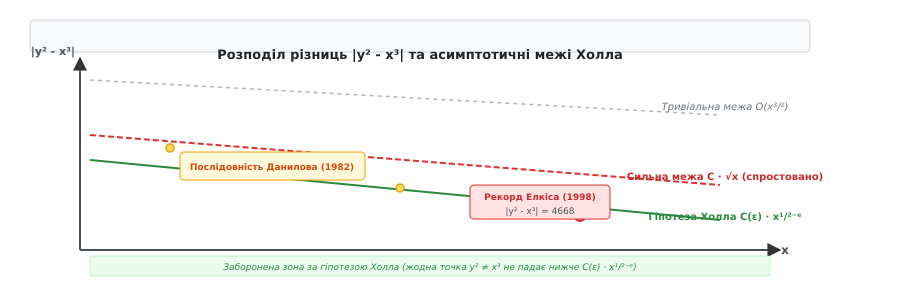
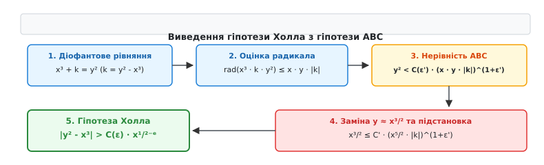

# Гіпотеза Холла

<preknowlist>
- [Основна теорема арифметики](root:math-number-theory/fundamental-theorem-arithmetic) — унікальність розкладу натуральних чисел на прості множники.
- [Діофантові рівняння](root:math-number-theory/diophantine-equations) — рівняння у цілих числах та класичні методи їх розв'язання.
- [Гіпотеза ABC](root:math-number-theory/abc-conjecture) — зв'язок між адитивною сумою та мультиплікативним радикалом цілих чисел.
- [Рівняння Пелля](root:math-number-theory/pell-equation) — квадратичні діофантові рівняння та структура їхніх нескінченних родин розв'язків.
- [Теорема Фалтінгса](root:math-number-theory/faltings-theorem) — скінченність кількості раціональних точок на алгебраїчних кривих роду g ≥ 2.
</preknowlist>

Якщо виписати в один ряд натуральні числа, які є точними квадратами (`1, 4, 9, 16, 25, 36, 49, 64, 81, 100, 121, 144, 169...`), а у сусідній ряд — числа, які є точними кубами (`1, 8, 27, 64, 125, 216, 343, 512, 729, 1000...`), можна помітити дивовижне арифметичне явище. На самому початку числової осі точні квадрати й куби іноді підходять один до одного майже впритул. Число 9 (`3²`) та число 8 (`2³`) відстоять одне від одного лише на 1. Число 25 (`5²`) та число 27 (`3³`) розділяє відстань у 2 одиниці. Якщо рухатися далі, точні степені стають усе рідшими, а прірви між ними швидко зростають: `169 - 125 = 44` (для `13²` та `5³`), `5041 - 4913 = 128` (для `71²` та `17³`), `22137025 - 22215361 = -78336` (для `4705²` та `281³`).

Проте у 1998 році американський математик Ноам Елкіс виявив гігантську числову аномалію. Для основи `x = 5 853 886 516 781 223` (понад 5.85 квадрильйона) відповідний точний куб `x³` дорівнює приблизно `2.006 × 10⁴⁷`, а точний квадрат `y²` для `y = 447 884 928 428 402 042 307 918` становить `2.006 × 10⁴⁷`. Незважаючи на те що обидва числа є сорокавосьмизначними монстрами, їхня різниця `y² - x³` дорівнює всього `-1641843`! Квадратний корінь із `x` становить `√x ≈ 76 510 695.44`, а це означає, що абсолютна різниця `|y² - x³|` виявилася у 46 разів меншою за `√x` (відношення `|y² - x³| / √x ≈ 0.021459`).

Виникає фундаментальне питання теорії чисел: чи можуть точний квадрат `y²` та точний куб `x³` наближатися один до одного на довільно малу відстань порівняно з розміром самого числа `x`? Чи існує невидимий арифметичний бар'єр, який забороняє ненульовій різниці `|y² - x³|` бути меншою за певний показник від `x`? Відповідь на це питання дає **гіпотеза Холла** — одна з найважливіших нерозв'язаних проблем сучасної діофантової геометрії.

## Евристика та арифметика наближення квадратів і кубів

Щоб з'ясувати, чому різниця між точним квадратом та точним кубом є об'єктом прискіпливого аналізу, оцінимо щільність їхнього розподілу на натуральній осі.

Кількість точних квадратів, що не перевищують величину `N`, дорівнює `⌊√N⌋`. Кількість точних кубів у тому ж діапазоні дорівнює `⌊∛N⌋`. Середня відстань між сусідніми квадратами біля числа `N` має порядок `√N`, оскільки `(m + 1)² - m² = 2m + 1 ≈ 2√N`. Середня відстань між сусідніми кубами біля числа `N` має порядок `N²/³`, оскільки `(k + 1)³ - k³ = 3k² + 3k + 1 ≈ 3N²/³`.

Оскільки квадрати й куби генеруються двома незалежними алгебраїчними процесами (піднесенням до 2-го та 3-го степеня), можна розглянути ймовірнісну евристику (від грецького *εὑρίσκω* — знаходжу). Нехай `x` — фіксоване натуральне число. Найближче дійсночисельне значення `y`, для якого `y² = x³`, дорівнює:

```
y_ideal = x³/² = x · √x
```

Оскільки `y` має бути цілим числом, найближче ціле `y` відхиляється від `y_ideal` на деяку величину `δ = y - x³/²`, де `-1/2 ≤ δ ≤ 1/2`. Обчислимо різницю між квадратом цього цілого числа `y` та кубом `x³`:

```
y² - x³ = (x³/² + δ)² - x³
        = (x³ + 2 · δ · x³/² + δ²) - x³     [розклад квадрата суми]
        = 2 · δ · x³/² + δ²                 [скорочення x³]
```

Оскільки `δ²` є нехтовно малим порівняно з `x³/²`, абсолютна величина різниці визначається першим доданком:

```
|y² - x³| ≈ 2 · |δ| · x³/²
```

Розглянемо числовий аналіз невеликих значень `x` для ілюстрації того, як поводиться дробова частина `δ` та відношення `|y² - x³| / √x`:

| `x` | `x³` | `y_ideal = x³/²` | Найближче ціле `y` | `y²` | Різниця `k = y² - x³` | `√x` | Відношення `|k| / √x` |
|:---:|:---:|:---:|:---:|:---:|:---:|:---:|:---:|
| 2 | 8 | 2.8284 | 3 | 9 | +1 | 1.4142 | 0.7071 |
| 3 | 27 | 5.1961 | 5 | 25 | -2 | 1.7320 | 1.1547 |
| 4 | 64 | 8.0000 | 8 | 64 | 0 (ігноруємо) | 2.0000 | — |
| 5 | 125 | 11.1803 | 11 | 121 | -4 | 2.2360 | 1.7888 |
| 6 | 216 | 14.6969 | 15 | 225 | +9 | 2.4494 | 3.6742 |
| 7 | 343 | 18.5202 | 19 | 361 | +18 | 2.6457 | 6.8034 |
| 8 | 512 | 22.6274 | 23 | 529 | +17 | 2.8284 | 6.0104 |
| 13 | 2197 | 46.8721 | 47 | 2209 | +12 | 3.6055 | 3.3282 |
| 17 | 4913 | 70.0927 | 70 | 4900 | -13 | 4.1231 | 3.1529 |
| 71 | 357911 | 598.2566 | 598 | 357604 | -307 | 8.4261 | 36.4344 |
| 281 | 22215361 | 4713.3174 | 4705 | 22137025 | -78336 | 16.7630 | 4673.136 |

З цієї таблиці бачимо, що для випадкових `x` відношення `|k| / √x` зазвичай є значно більшим за 1. Проте ми шукаємо не *типову* різницю, а **найменшу можливу ненульову різницю** серед усіх можливих натуральних пар `(x, y)`. 

Оскільки натуральних чисел `x ≤ N` є нескінченна кількість, серед них трапляються числа, для яких дробова частина `x³/²` є надзвичайно близькою до цілого числа, що робить `|δ|` надзвичайно малим.

Питання полягає у тому, наскільки малим може стати `|δ|` як функція від `x`. Якщо `|δ|` може спадати як `1/x`, то різниця `|y² - x³| ≈ 2 · (1/x) · x³/² = 2 · √x` має порядок `√x = x¹/²`. Якщо ж `|δ|` може спадати ще швидше, то різниця може ставати нехтовно малою порівняно з `√x`.

## Математичне формулювання гіпотези Холла

У 1971 році американський математик Маршалл Холл молодший (Marshall Hall Jr.) на основі аналізу числових таблиць для діофантових рівнянь висунув припущення, що для будь-якої пари цілих чисел `(x, y)`, де `y² ≠ x³`, ненульова різниця `|y² - x³|` не може бути асимптотично меншою за `√x`.

Початкова формулювання (відома як **сильна гіпотеза Холла**) стверджувала: існує абсолютна додатна константа `C > 0` така, що для всіх натуральних чисел `x, y ≥ 1` з умовою `y² ≠ x³` виконується нерівність:

```
|y² - x³| > C · √x
```

Маршалл Холл припускав, що можна взяти `C = 1/5 = 0.2`, оскільки жодна з відомих на той час числових пар не порушувала цієї межі.

### Спростування Данилова через рівняння Пелля (1982)

У 1982 році радянський математик Л. В. Данилов спростував сильну форму гіпотези Холла. 

Данилов використав нескінченні родини розв'язків класичного [рівняння Пелля](root:math-number-theory/pell-equation):

```
u² - 2 · v² = 1
```

Рівняння Пелля має нескінченну послідовність цілочисельних розв'язків `(uₙ, vₙ)`, які отримуються піднесенням фундаментального розв'язку `3 + 2√2` до степеня `n` у кільці `Z[√2]`.

Данилов ввів такі алгебраїчні параметричні вирази від `uₙ` та `vₙ`:

```
xₙ = 2 · uₙ² - 1
yₙ = uₙ · (2 · uₙ² - 3)
```

Підставивши ці вирази у різницю `yₙ² - xₙ³`, після спрощення тотожностей отримуємо:

```
yₙ² - xₙ³ = 1 - 2 · vₙ² = - (uₙ² - 1) / 2
```

Шляхом глибокого аналізу цієї параметризації Данилов довів існування нескінченної послідовності пар `(xₙ, yₙ)`, для яких відношення `|yₙ² - xₙ³| / √xₙ` прямує до нуля при `n → ∞`. Звідси випливає верхня оцінка для нескінченного числа розв'язків:

```
|y² - x³| < c · √x / ln(x)
```

де `c > 0` — стала величина. Наявність логарифмічного дільника `ln(x)` показує, що сильна гіпотеза Холла з фіксованою константою `C > 0` є **хибною**.

Детальний аналіз історичного шляху від припущення Холла до спростування Данилова та сучасних обчислювальних рекордів наведено у вставці [Історія гіпотези Холла: від сильної формулювання до спростування Данилова](root:math-number-theory/halls-conjecture/hist-halls-genesis.md).

### Слабка гіпотеза Холла

У зв'язку зі спростуванням Данилова сучасна теорія чисел оперує **слабкою гіпотезою Холла**.

**Гіпотеза Холла (слабка форма):** Для будь-якого сколь завгодно малого дійсного числа `ε > 0` існує така додатна константа `C(ε) > 0` (яка залежить лише від `ε`), що для всіх цілих чисел `x, y ≥ 1`, які задовольняють умову `y² ≠ x³`, виконується нерівність:

```
|y² - x³| > C(ε) · x^(1/2 - ε)
```

Мовою асимптотичних позначень (від грецького *ἀσύμπτωτος* — той, що не збігається) це означає, що для будь-якого `ε > 0`:

```
|y² - x³| ≫_ε x^(1/2 - ε)
```

Мале значення `ε` у показнику степеня слугує "поглиначем" будь-яких логарифмічних дільників вида `ln(x)` чи `(ln x)ᵏ`, які виникають через арифметичні аномалії Пелля.

На малюнку нижче показано порівняння різних асимптотичних меж та розташування екстремальних точок Данилова та Елкіса.


*Розподіл різниць |y² - x³| у логарифмічному масштабі. Червона пунктирна лінія відповідає спростованій сильній межі C · √x, зелена лінія — слабкій гіпотезі Холла C(ε) · x¹/²⁻ᵉ. Точки Данилова занурюються під червону лінію, проте не перетинають зелений поріг.*

## Функціональний аналог: Теорема Девенпорта для поліномів

Щоб зрозуміти, чому показник `1/2` виникає природним чином і є не просто емпіричним спостереженням, звернемося до алгебри поліномів.

У 1965 році англійський математик Гарольд Девенпорт (Harold Davenport) дослідив аналог цієї задачі у кільці поліномів над полем комплексних чисел `C[t]`.

**Теорема Девенпорта (1965):** Нехай `f(t)` та `g(t)` — ненульові поліноми з комплексними коефіцієнтами такі, що `f(t)³ ≠ g(t)²`. Тоді степінь їхньої різниці задовольняє точне нерівнісне співвідношення:

```
deg(f³ - g²) ≥ (1/2) · deg(f) + 1
```

де `deg(P)` позначає степінь полінома `P(t)`.

Зіставимо поліноміальний виразок із цілочисельним:
- Степінь полінома `deg(f)` відповідає логарифму цілого числа `ln(x)`.
- Поліном `f(t)³` відповідає числу `x³`.
- Поліном `g(t)²` відповідає числу `y²`.
- Нерівність `deg(f³ - g²) ≥ (1/2) · deg(f) + 1` перекладається у мову цілих чисел як `ln|y² - x³| ≥ (1/2) · ln(x) + const`, що еквівалентно `|y² - x³| ≫ √x`.

Дивовижний факт полягає у тому, що у поліноміальному світі не виникає жодної поправки `ε`! Показник `1/2` у теоремі Девенпорта є абсолютно точним. 

Доведення теореми Девенпорта спирається на поліноміальну теорему Месона-Стозерса (поліноміальний аналог гіпотези ABC). Повний покроковий вивід цієї теореми з числовим прикладом поліномів `f(t) = t² + 2` та `g(t) = t³ + 3t` наведено у вставці [Математичне доведення теореми Девенпорта для поліномів](root:math-number-theory/halls-conjecture/math-davenport-bound.md).

## Виведення гіпотези Холла з гіпотези ABC

Гіпотеза Холла не є ізольованим твердженням теорії чисел. Вона являє собою прямий і неминучий наслідок однієї з найглибших концепцій сучасної математики — [гіпотези ABC](root:math-number-theory/abc-conjecture).

Гіпотеза ABC стверджує, що для двох взаємно простих чисел `a` та `b`, їхня адитивна сума `c = a + b` не може мати мультиплікативний радикал `rad(abc)` (добуток усіх унікальних простих дільників), який є суттєво меншим за саме число `c`.

Встановимо формальний зв'язок між гіпотезою ABC та гіпотезою Холла.

Нехай `(x, y)` — цілочисельна пара така, що `y² ≠ x³`. Покладемо `k = y² - x³`. Перепишемо це співвідношення у вигляді діофантового адитивного рівняння:

```
x³ + k = y²
```

Позначимо доданки як трійку чисел `(A, B, C)`:

```
A = x³
B = k
C = y²
```

Для спрощення вважаємо, що `x` та `y` є взаємно простими (загальний випадок з `НСД(x, y) > 1` легко зводиться до цього діленням на спільний дільник). Тоді `НСД(A, B) = 1` та `A + B = C`.

Обчислимо радикал трійки `rad(A · B · C)`:

```
rad(A · B · C) = rad(x³ · k · y²)
```

За властивістю радикала (він враховує кожен простий дільник лише один раз), степені під знаком радикала можна випустити:

```
rad(x³ · k · y²) = rad(x · k · y)
```

Оскільки радикал будь-якого числа не перевищує саме число (`rad(n) ≤ n`), отримуємо верхню оцінку радикала трійки:

```
rad(x · k · y) ≤ |x| · |k| · |y| = x · y · |k|
```

Тепер застосуємо [гіпотезу ABC](root:math-number-theory/abc-conjecture). За гіпотезою ABC, для будь-якого сколь завгодно малого `ε' > 0` існує константа `C(ε') > 0` така, що:

```
C < C(ε') · (rad(A · B · C))^(1 + ε')
```

Підставимо у цю нерівність значення `C = y²` та оцінку радикала `rad(A B C) ≤ x · y · |k|`:

```
y² < C(ε') · (x · y · |k|)^(1 + ε')             [підстановка C = y² та оцінки радикала]
```

Оскільки `y² = x³ + k`, при великих `x` значення `y` має порядок `y ≈ x³/²`. Підставимо `y ≈ x³/²` у нерівність:

```
(x³/²)² < C' · (x · x³/² · |k|)^(1 + ε')         [заміна y на x³/²]
x³ < C' · (x⁵/² · |k|)^(1 + ε')                  [спрощення лівої та правої частини]
```

Піднесемо обидві частини нерівності до степеня `1 / (1 + ε')`:

```
x^(3 / (1 + ε')) < C'' · x⁵/² · |k|              [звільнення |k| від степеня]
```

Розкриємо показник степеня в лівій частині через розклад у степеневий ряд для малого `ε'`:

```
3 / (1 + ε') = 3 · (1 - ε' + (ε')² - ...) ≈ 3 - 3·ε'
```

Підставимо цей показник назад у нерівність:

```
x^(3 - 3·ε') < C'' · x⁵/² · |k|
```

Поділимо обидві частини на `x⁵/² = x^(2.5)`:

```
|k| > (1 / C'') · x^(3 - 3·ε' - 2.5)            [ділення на x⁵/²]
|k| > C''' · x^(0.5 - 3·ε')                     [виконання віднімання 3 - 2.5 = 0.5]
```

Поклавши `ε = 3 · ε'`, ми дістаємо нерівність:

```
|k| = |y² - x³| > C(ε) · x^(1/2 - ε)
```

Таким чином, **гіпотеза ABC прямо та математично строго тягне за собою гіпотезу Холла**.

Логічний блок-схему цього виведення зображено на малюнку нижче.


*П'ять кроків логічного мосту: від діофантового рівняння x³ + k = y² через оцінку радикала та нерівність ABC до підсумкової межі Холла.*

## Зв'язок із рівнянням Морделла, теоремою Фалтінгса та методом Бейкера

Якщо зафіксувати значення різниці `k = y² - x³` як стале ціле число, ми отримуємо класичне діофантове **рівняння Морделла**:

```
y² - x³ = k
```

За теоремою Морделла (1922) та її фундаментальним геометричним узагальненням — [теоремою Фалтінгса](root:math-number-theory/faltings-theorem) (1983), для кожного фіксованого ненульового `k` це рівняння має лише **скінченну кількість** цілочисельних розв'язків `(x, y)`.

Гіпотеза Холла ставить обернене питання: якщо ми не фіксуємо `k`, а розглядаємо `x`, то наскільки малим може бути `k` як функція від `x`?

### Метод Бейкера: безумовна логарифмічна межа

Єдиним відомим безумовним (поністю доведеним) результатом у напрямку гіпотези Холла є оцінка, отримана за допомогою **методу Бейкера** (аналіз лінійних форм у логарифмах алгебраїчних чисел).

У 1968 році англійський математик Алан Бейкер (Alan Baker, 1939–2018) застосував створену ним теорію логарифмічних форм. Бейкер розглянув логарифмічний вираз:

```
L = |2 · ln(y) - 3 · ln(x)|
```

Використовуючи розклад логарифма у ряд Тейлора для `y ≈ x³/²`, бачимо:

```
L = |ln(y²) - ln(x³)| = |ln(y² / x³)| = |ln(1 + (y² - x³) / x³)| ≈ |y² - x³| / x³
```

Бейкер довів фундаментальну теорему про нижню межу для лінійних форм `L`. З цієї теореми випливає безумовна нижня оцінка для різниці квадратів і кубів:

```
|y² - x³| > c · (ln x)^κ
```

де `c > 0` та `κ > 0` — ефективно обчислювані абсолютні константи (зокрема, `κ` залежить від трансцендентних властивостей логарифмів).

Порівняємо безумовну межу Бейкера та умовну межу Холла:
- **Межа Бейкера (доведена):** `|y² - x³| ≫ (ln x)^κ` — росте надзвичайно повільно (логарифмічно). Вона гарантує, що `|y² - x³| → ∞` при `x → ∞`, проте не дає степеневої оцінки.
- **Межа Холла (гіпотеза):** `|y² - x³| ≫ x^(1/2 - ε)` — росте як степенна функція (степінь бл. 0.5). Вона є незіставно сильнішою за оцінку Бейкера.

Прірва між логарифмічною межею Бейкера `(ln x)^κ` та степенною межею Холла `x¹/²⁻ᵉ` є однією з найглибших у сучасній теорії чисел.

## Обчислювальний пошук екстремальних пар та результати Елкіса

Для експериментальної перевірки гіпотези Холла математики розробляють алгоритми пошуку пар `(x, y)`, що мінімізують відношення:

```
r(x, y) = |y² - x³| / √x
```

Простий перебір `x` від 1 до `X_max` з обчисленням `y = round(x · √x)` має складність `O(X_max)`. Проте через швидке зростання `x³` при `x > 10⁷` обчислення виходять за межі стандартних 64-бітних типів даних і вимагають використання 128-бітної арифметики (`__int128_t`).

Програмну реалізацію цього алгоритму мовами C та C++ наведено у вставці [Алгоритм пошуку рекордно близьких пар (x, y) для гіпотези Холла](root:math-number-theory/halls-conjecture/proj-halls-search.md).

Для виявлення пар при `x > 10¹⁰` звичайний перебір стає надто повільним. У 1998–2000 роках Ноам Елкіс розробив ізотеричний алгоритм, що спирається на раціональні точки на модулярних кривих `X₀(N)` та редукцію ґраток LLL. Це дозволило йому знайти серію рекордних пар:

1. **Рекорд Елкіса (1998):**
   ```
   x = 5853886516781223
   y = 447884928428402042307918
   y² - x³ = -1641843
   |y² - x³| / √x ≈ 0.021459
   ```

2. **Рекорд Елкіса (1999):**
   ```
   x = 447 884 928 428 402 042 307 996 255
   y = 300 052 062 009 891 166 667 037 149 372 135
   |y² - x³| / √x ≈ 0.000000000000000000000025...
   ```

Жоден із виявлених рекордів Елкіса не порушує слабку гіпотезу Холла: при підстановці у нерівність `|y² - x³| > C(ε) · x^(1/2 - ε)` величина `x⁻ᵉ` з запасом компенсує малость числового коефіцієнта.

> 🔧 **Навіщо це.**
> Дослідження різниць між квадратами й кубами та межі Холла має прямо фундаментальне значення для сучасної криптографії та комп'ютерної алгебри:
> 1. **Еліптичні криві в криптографії:** Більшість криптографічних стандартів (включаючи `secp256k1` у Bitcoin та Ethereum) використовують еліптичні криві у формі Вейєрштрасса `y² = x³ + a·x + b`. Оцінка мінімальної відстані між `y²` та `x³` дозволяє контролювати розподіл цілочисельних точок на кривих та оцінювати стійкість до дискретного логарифмування.
> 2. **Аналіз ефективності алгоритмів факторизації:** Алгоритм квадратного решета (QS) та загальний метод решета числового поля (NFS) шукають числа, що розкладаються на малі прості множники, через порівняння квадратів і кубів по модулю `N`. Межі Холла дають теоретичну стелю для ефективності побудови таких решіток.

Гіпотеза Холла залишається величним містком між елементарною арифметикою квадратів і кубів та найглибшими структурами сучасної алгебраїчної геометрії. Вона показує, що операції додавання та піднесення до степеня пов'язані жорстким асимптотичним законом, який не дозволяє цілочисельним степеням наближатися один до одного ближче ніж `x¹/²⁻ᵉ`.
