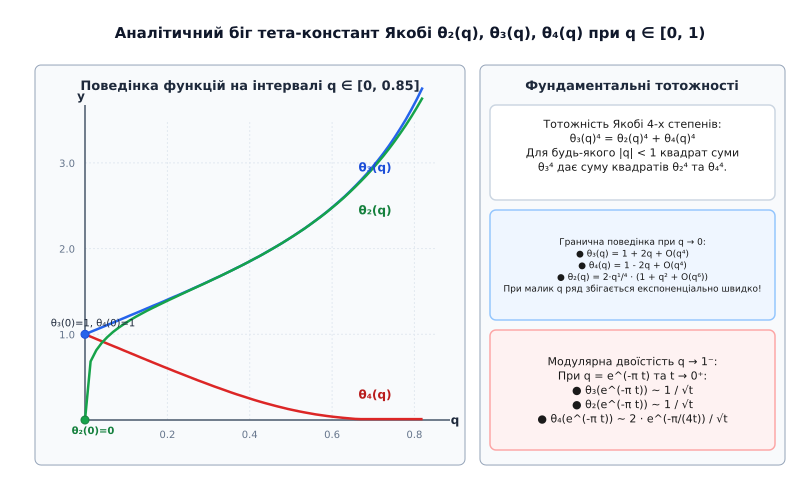
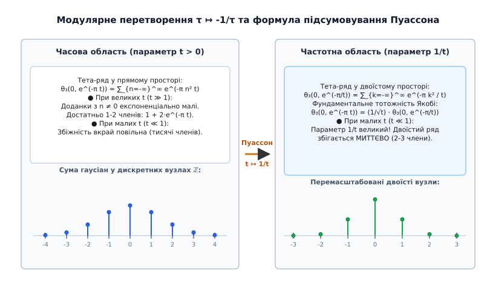
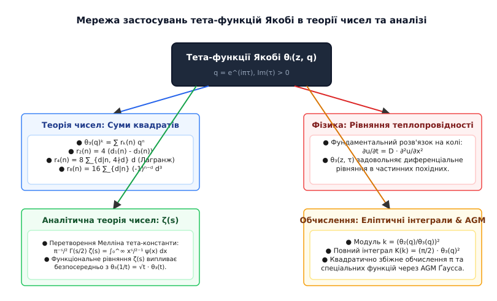

# Тета-функції Якобі

<preknowlist>
- [Твірні функції](root:math-combinatorics/generating-functions) — використання нескінченних степеневих рядів для кодування послідовностей та комбінаторних тотожностей.
- [Ряди Ейзенштейна](root:math-number-theory/eisenstein-series) — модулярні форми для групи SL(2, Z) та модулярні перетворення.
- [Діофантові рівняння](root:math-number-theory/diophantine-equations) — подання чисел у вигляді сум квадратів та арифметичні структури.
</preknowlist>

Дослідження кількості способів подати натуральне число у вигляді суми квадратів цілих чисел наталкивається на комбінаторний вибух: для числа `n = 1000` прямий перебір потребує перевірки мільйонів комбінацій, а точна тотожність здається недосяжною. Однак якщо записати формальний степеневий ряд, коефіцієнтами якого є показники квадратів цілих чисел `q^(n²)`, то звичайне алгебраїчне піднесення до степеня перетворюється на аналітичний міст між діофантовими рівняннями та математичною фізикою. Цей нескінченний ряд є тета-функцією Якобі. Вона одночасно виступає фундаментальним розв'язком рівняння теплопровідності на колі, формує основу квазіперіодичних функцій у комплексному аналізі та надає строгий арифметичний інструментарій для розв'язання давніх задач теорії чисел.

## Проблема сум квадратів та виникнення квазіперіодичності

Розглянемо фундаментальну задачу комбінаторної теорії чисел: для заданого натурального числа `n` та виміру `k ≥ 1` обчислити кількість цілочисельних векторів `(x₁, x₂, ..., x_k) ∈ ℤ^k`, що задовольняють диференціальне діофантове рівняння:

```
x₁² + x₂² + ... + x_k² = n
```

Позначимо кількість таких розв'язків через `r_k(n)`. Якщо ми піднесемо до `k`-го степеня формальний ряд `f(q) = ∑_{n=-∞}^∞ q^(n²)`, то за правилом множення многочленів (згорткою) коефіцієнт при `qⁿ` у розкладі `(f(q))^k` буде дорівнювати саме кількості способів `r_k(n)` подання числа `n` у вигляді суми `k` квадратів:

```
(∑_{n=-∞}^∞ q^(n²))^k = ∑_{n=0}^∞ r_k(n) · qⁿ
```

Цей ряд є окремим випадком тета-константи. Щоб перетворити формальний ряд на потужний аналітичний інструмент, вводиться комплексна змінна `z ∈ ℂ` (фаза) та модулярний параметр `τ` у верхній комплексній півплощині (`Im(τ) > 0`). Змінна `q = e^(i π τ)` називається **номом** (nôme, від грецького *νόμος* — закон або норма). Оскільки `Im(τ) > 0`, модуль нома строго менший за одиницю (`|q| < 1`), що забезпечує абсолютну та рівномірну збіжність ряду на будь-якій компактній області.

Несподіванка полягає в тому, що цей же самий ряд із квадратичним зростанням показників `n²` з'являється у математичній фізиці Жозефа Фур'є при розв'язанні рівняння теплопровідності `∂u / ∂t = D · ∂²u / ∂x²` на замкненому кільці. Множник `e^(-n² t)` описує експоненціальне загасання вищих гармонік температури з часом `t`.

З аналітичної точки зору, класичні тригонометричні функції `sin(z)` та `cos(z)` мають один період `2π`. Однозначні голоморфні функції на комплексній площині не можуть мати двох незалежних періодів (за теоремою Ліувілля така функція була б обмеженою і отже константою). Німецький математик Карл Ґустав Якоб Якобі зрозумів, що замість двох суворих періодів слід розглядати функції, які при зміщенні на один період множаться на експоненціальний фактор. Такі функції називаються **квазіперіодичними** (квазі, від латинського *quasi* — ніби / майже), і саме вони утворюють чотири класичні тета-функції Якобі.

## Чотири класичні тета-функції Якобі та їхні аналітичні властивості

Якобі ввів у математику чотири фундаментальні тета-функції, які позначаються через `θ₁(z, q)`, `θ₂(z, q)`, `θ₃(z, q)` та `θ₄(z, q)` (або `θ_i(z | τ)`). Вони задаються наступними рядами Фур'є за комплексною змінною `z`:

### 1. Третя тета-функція Якобі θ₃(z, q)

Функція `θ₃(z, q)` є найпростішою та основною тета-функцією, побудованою як симетричний двосторонній ряд:

```
θ₃(z, q) = ∑_{n=-∞}^∞ q^(n²) · e^(2i n z) = 1 + 2 · ∑_{n=1}^∞ q^(n²) · cos(2n z)
```

Вона є парною відносно `z` (`θ₃(-z, q) = θ₃(z, q)`), строго періодичною з періодом `π` (`θ₃(z + π, q) = θ₃(z, q)`), а при зміщенні на період `π τ` проявляє квазіперіодичність:

```
θ₃(z + π τ, q) = q⁻¹ · e^(-2i z) · θ₃(z, q)
```

Нулі функції `θ₃(z, q)` утворюють дискретну решітку на комплексній площині:

```
z = (m + 1/2) · π + (n + 1/2) · π τ ,   m, n ∈ ℤ
```

### 2. Четверта тета-функція Якобі θ₄(z, q)

Функція `θ₄(z, q)` отримана з `θ₃(z, q)` зміщенням фази `z` на півперіоду `π / 2`:

```
θ₄(z, q) = θ₃(z + π/2, q) = ∑_{n=-∞}^∞ (-1)ⁿ · q^(n²) · e^(2i n z) = 1 + 2 · ∑_{n=1}^∞ (-1)ⁿ · q^(n²) · cos(2n z)
```

Вона також є парною функцією від `z` і має нулі у точках `z = m · π + (n + 1/2) · π τ`. При зміщенні на крок `π τ` вона виконує трансформацію:

```
θ₄(z + π τ, q) = -q⁻¹ · e^(-2i z) · θ₄(z, q)
```

### 3. Друга тета-функція Якобі θ₂(z, q)

Функція `θ₂(z, q)` будується за зсунутими наполовину індексами `n + 1/2`:

```
θ₂(z, q) = ∑_{n=-∞}^∞ q^((n + 1/2)²) · e^(i (2n+1) z) = 2 · q^(1/4) · ∑_{n=0}^∞ q^(n(n+1)) · cos((2n+1) z)
```

Вона є парною функцією від `z` і містить дробовий степенний множник `q^(1/4)`. Її нулі знаходяться у точках `z = (m + 1/2) · π + n · π τ`. При квазіперіодичному зсуві маємо:

```
θ₂(z + π τ, q) = q⁻¹ · e^(-2i z) · θ₂(z, q)
```

### 4. Перша тета-функція Якобі θ₁(z, q)

Функція `θ₁(z, q)` є єдиною непарною функцією серед чотирьох тета-функцій (`θ₁(-z, q) = -θ₁(z, q)`):

```
θ₁(z, q) = -i · ∑_{n=-∞}^∞ (-1)ⁿ · q^((n + 1/2)²) · e^(i (2n+1) z) = 2 · q^(1/4) · ∑_{n=0}^∞ (-1)ⁿ · q^(n(n+1)) · sin((2n+1) z)
```

Оскільки `sin(0) = 0`, перша тета-функція тотожно дорівнює нулю при `z = 0`: `θ₁(0, q) = 0`. Всі нулі `θ₁(z, q)` лежать у вузлах решітки `z = m · π + n · π τ` для цілих `m, n ∈ ℤ`.

Узагальнена таблиця симетрій та зсувів за півперіодами наведена нижче:

| Тета-функція | Зсув на `z + π/2` | Зсув на `z + π τ / 2` | Значення нулів у ґратці `m π + n π τ` |
| :--- | :--- | :--- | :--- |
| `θ₁(z, q)` | `θ₂(z, q)` | `i q⁻¹/⁴ e⁻ⁱᶻ θ₄(z, q)` | `m π + n π τ` |
| `θ₂(z, q)` | `-θ₁(z, q)` | `q⁻¹/⁴ e⁻ⁱᶻ θ₃(z, q)` | `(m + 1/2) π + n π τ` |
| `θ₃(z, q)` | `θ₄(z, q)` | `q⁻¹/⁴ e⁻ⁱᶻ θ₂(z, q)` | `(m + 1/2) π + (n + 1/2) π τ` |
| `θ₄(z, q)` | `θ₃(z, q)` | `i q⁻¹/⁴ e⁻ⁱᶻ θ₁(z, q)` | `m π + (n + 1/2) π τ` |

### Тета-константи

Значення тета-функцій при нульовому фазовому аргументі `z = 0` називаються **тета-константами** і позначаються коротким записом `θ₂(q)`, `θ₃(q)` та `θ₄(q)`:

```
θ₃(q) = θ₃(0, q) = 1 + 2 q + 2 q⁴ + 2 q⁹ + 2 q¹⁶ + ...
θ₄(q) = θ₄(0, q) = 1 - 2 q + 2 q⁴ - 2 q⁹ + 2 q¹⁶ - ...
θ₂(q) = θ₂(0, q) = 2 q^(1/4) (1 + q² + q⁶ + q¹² + ...)
```


*Аналітична поведінка тета-констант Якобі на інтервалі q ∈ [0, 1). При q → 0 тета-константа θ₃ прагне до 1, θ₄ прагне до 1, а θ₂ згасає як 2 q^(1/4).*

Поведінка тета-констант продемонстрована на рисунку вище: при наближенні `q` до `0` доданки вищих степенів експоненціально згасають, що забезпечує миттєву збіжність рядів у чисельних розрахунках.

## Тотожність потрійного добутку Якобі та нескінченні добутки

Одним із найвеличніших відкриттів Якобі стало доведення того, що двосторонній ряд Фур'є для тета-функцій розкладається у нескінченний добуток трьох множників. Це співвідношення називається **тотожністю потрійного добутку Якобі** (Jacobi Triple Product Identity):

```
∑_{n=-∞}^∞ q^(n²) · zⁿ = ∏_{m=1}^∞ (1 - q^(2m)) · (1 + q^(2m-1) · z) · (1 + q^(2m-1) · z⁻¹)
```

За допомогою цього потрійного добутку всі чотири тета-функції Якобі можна подати у вигляді нескінченних добутків:

```
θ₃(z, q) = ∏_{m=1}^∞ (1 - q^(2m)) · (1 + 2 q^(2m-1) cos(2z) + q^(4m-2))
θ₄(z, q) = ∏_{m=1}^∞ (1 - q^(2m)) · (1 - 2 q^(2m-1) cos(2z) + q^(4m-2))
θ₂(z, q) = 2 q^(1/4) cos(z) · ∏_{m=1}^∞ (1 - q^(2m)) · (1 + 2 q^(2m) cos(2z) + q^(4m))
θ₁(z, q) = 2 q^(1/4) sin(z) · ∏_{m=1}^∞ (1 - q^(2m)) · (1 - 2 q^(2m) cos(2z) + q^(4m))
```

Тотожність потрійного добутку Якобі об'єднує комбінаторну теорію розбиттів чисел із комплексною аналітикою. Зокрема, якщо в потрійному добутку виконати спеціальну заміну `q ↦ q^(3/2)` та `z ↦ -q^(-1/2)`, ми негайно отримуємо знамениту **пентагональну теорему Ейлера**:

```
∏_{k=1}^∞ (1 - q^k) = ∑_{n=-∞}^∞ (-1)ⁿ · q^((3n² - n) / 2) = 1 - q - q² + q⁵ + q⁷ - q¹² - q¹⁵ + ...
```

Зв'язок із **ета-функцією Дедекінда** `η(τ)` виражається через тета-константи:

```
η(τ) = q^(1/12) · ∏_{n=1}^∞ (1 - q^(2n)) = (1/2) · θ₂(q)^(1/3) · θ₃(q)^(1/3) · θ₄(q)^(1/3)
```

Повне покрокове алгебраїчне доведення тотожності потрійного добутку Якобі через `q`-біноміальні вирази та його спеціалізацію до тотожностей Ейлера винесено у вставку [🧮 Доведення тотожності потрійного добутку Якобі та пентагональної теореми Ейлера](root:math-number-theory/jacobi-theta-functions/math-jacobi-triple-product.md).

## Модулярне перетворення Якобі та підсумовування Пуассона

Глибинна симетрія тета-функцій проявляється при дії модулярних перетворень на параметр `τ`. Розглянемо трансформацію `S: τ ↦ -1 / τ` модулярної групи `SL(2, ℤ)`. У термінах дійсної змінної часу `t > 0` у рівнянні теплопровідності (де `q = e^(-π t)` та `τ = i t`), ця заміна відповідає інверсії часу `t ↦ 1 / t`.

Застосовуючи **формулу підсумовування Пуассона** для гаусової функції `f(x) = e^(-π x² t)` та її перетворення Фур'є `f_hat(k) = (1 / √t) · e^(-π k² / t)`, отримуємо фундаментальну модулярну тотожність Якобі:

```
∑_{n=-∞}^∞ e^(-π n² t) = (1 / √t) · ∑_{k=-∞}^∞ e^(-π k² / t)
```

У термінах тета-константи `θ₃(0, q)` це співвідношення записується у вигляді короткої двоїстості:

```
θ₃(0, e^(-π t)) = (1 / √t) · θ₃(0, e^(-π / t))
```


*Модулярне перетворення Якобі між часовою та частотною областями. При малих t прямий ряд збігається повільно, але в двоїстому просторі 1/t збіжність стає миттєвою.*

Розглянемо також дію другого генератора модулярної групи `T: τ ↦ τ + 1`. Під дією `T` параметр нома перетворюється як `q ↦ -q`. При цьому тета-константи змінюються за правилами:

```
θ₃(-q) = θ₄(q)
θ₄(-q) = θ₃(q)
θ₂(-q) = e^(i π / 4) · θ₂(q)
```

Ця модулярна двоїстість має величезне практичне значення:
1. **Обчислювальний інверсіон:** Якщо параметр `t` є дуже малим (`t ≪ 1`), прямий ряд `∑ e^(-π n² t)` збігається вкрай повільно, вимагаючи обчислення тисяч доданків. Проте завдяки модулярній тотожності ми можемо перейти до параметру `1 / t`, який є великим (`1 / t ≫ 1`), де двоїстий ряд `∑ e^(-π k² / t)` збігається миттєво (достатньо взяти 1–2 члени ряду!).
2. **Аналітичне продовження дзета-функції Рімана:** У 1859 році Бернгард Ріман використав саме це модулярне співвідношення тета-константи `θ₃(0, e^(-π t))` разом із перетворенням Мелліна, щоб довести функціональне рівняння для дзета-функції `ζ(s)`:
   ```
   π^(-s/2) · Γ(s/2) · ζ(s) = π^(-(1-s)/2) · Γ((1-s)/2) · ζ(1-s)
   ```

Детальний розбір історії відкриття цих залежностей від робіт Ейлера та Фур'є до фундаментальної монографії Якобі 1829 року та праць Рімана наведено у вставці [📜 Історія відкриття тета-функцій: від теплопровідності до еліптичних кривих](root:math-number-theory/jacobi-theta-functions/hist-jacobi-theta-genesis.md).

## Арифметика квадратів: теореми про 2, 4 та 8 квадратів

За допомогою тета-констант Якобі повністю розв'язав задачу про кількість подань натурального числа у вигляді суми квадратів.

### 1. Тотожність Якобі для четвертих степенів

Між трьома тета-константами `θ₂(q)`, `θ₃(q)` та `θ₄(q)` існує фундаментальне алгебраїчне співвідношення, яке називається **тотожністю Якобі чотирьох степенів**:

```
(θ₃(q))⁴ = (θ₂(q))⁴ + (θ₄(q))⁴
```

Ця тотожність є аналогом теореми Піфагора для модулярних форм і виражає алгебраїчну замкненість тета-констант.

### 2. Теорема про два квадрати (Ферма — Ґаусс)

Кількість способів подати число `n` у вигляді суми двох квадратів `r₂(n)` задається формулою:

```
(θ₃(q))² = ∑_{n=0}^∞ r₂(n) · qⁿ = 1 + 4 · ∑_{n=1}^∞ (d₁(n) - d₃(n)) · qⁿ
```

де `d₁(n)` — кількість дільників числа `n` виду `4k + 1`, а `d₃(n)` — кількість дільників виду `4k + 3`. Звідси випливає знаменита теорема Ферма: число `n` подається у вигляді суми двох квадратів тоді і тільки тоді, коли у його розкладі на прості множники всі прості дільники виду `4k + 3` входять у парних степенях.

Розглянемо числовий приклад для `n = 5`:
Дільниками числа 5 є `{1, 5}`.
- Дільник `1 ≡ 1 (mod 4)`, дільник `5 ≡ 1 (mod 4)`. Отже `d₁(5) = 2`.
- Дільників виду `4k + 3` немає, тому `d₃(5) = 0`.
- Формула дає `r₂(5) = 4 · (2 - 0) = 8`.
Дійсно, існує рівно 8 впорядкованих пар цілих чисел `(x, y)`: `(±1, ±2)` та `(±2, ±1)`.

Розглянемо числовий приклад для `n = 10`:
Дільниками числа 10 є `{1, 2, 5, 10}`.
- Дільники виду `4k + 1`: `{1, 5}` (`d₁(10) = 2`).
- Дільники виду `4k + 3`: відсутні (`d₃(10) = 0`).
- Дільники `2` та `10` пропукаються, оскільки вони парні (`2 ≡ 2 mod 4`).
- Формула дає `r₂(10) = 4 · (2 - 0) = 8` пар: `(±1, ±3)` та `(±3, ±1)`.

### 3. Теорема Якобі про чотири квадрати (теорема Лагранжа)

Підносячи тета-константу до четвертого степеня, Якобі вивів формулу для кількості способів подання числа `n` у вигляді суми чотирьох квадратів `r₄(n)`:

```
(θ₃(q))⁴ = ∑_{n=0}^∞ r₄(n) · qⁿ = 1 + 8 · ∑_{n=1}^∞ σ₁*(n) · qⁿ
```

де `σ₁*(n)` дорівнює сумі тих дільників числа `n`, які не діляться на `4`:

```
r₄(n) = 8 · ∑_{d | n, 4 ∤ d} d
```

Розглянемо детальний приклад обчислення для перших десяти натуральних чисел у наведеній нижче таблиці:

| Натуральне число `n` | Дільники `d | n`, що не діляться на 4 | Сума дільників `σ₁*(n)` | Кількість подань `r₄(n) = 8 σ₁*(n)` | Приклади розкладу `x₁² + x₂² + x₃² + x₄² = n` |
| :--- | :--- | :--- | :--- | :--- |
| `n = 1` | `{1}` | `1` | `8` | `(±1, 0, 0, 0)` та перестановки (8 способів) |
| `n = 2` | `{1, 2}` | `1 + 2 = 3` | `24` | `(±1, ±1, 0, 0)` та перестановки (24 способи) |
| `n = 3` | `{1, 3}` | `1 + 3 = 4` | `32` | `(±1, ±1, ±1, 0)` та перестановки (32 способи) |
| `n = 4` | `{1, 2}` (дільник 4 відкинуто) | `1 + 2 = 3` | `24` | `(±2, 0, 0, 0)` (8) та `(±1, ±1, ±1, ±1)` (16) |
| `n = 5` | `{1, 5}` | `1 + 5 = 6` | `48` | `(±2, ±1, 0, 0)` та перестановки (48 способів) |
| `n = 6` | `{1, 2, 3, 6}` | `1 + 2 + 3 + 6 = 12` | `96` | `(±2, ±1, ±1, 0)` та перестановки (96 способів) |
| `n = 7` | `{1, 7}` | `1 + 7 = 8` | `64` | `(±2, ±1, ±1, ±1)` та перестановки (64 способи) |
| `n = 8` | `{1, 2}` (4 та 8 відкинуто) | `1 + 2 = 3` | `24` | `(±2, ±2, 0, 0)` та перестановки (24 способи) |
| `n = 9` | `{1, 3, 9}` | `1 + 3 + 9 = 13` | `104` | `(±3, 0, 0, 0)` (8) та `(±2, ±2, ±1, 0)` (96) |
| `n = 10` | `{1, 2, 5, 10}` | `1 + 2 + 5 + 10 = 18` | `144` | `(±3, ±1, 0, 0)` (48) та `(±2, ±2, ±1, ±1)` (96) |

Оскільки для будь-якого натурального числа `n ≥ 1` дільник `d = 1` завжди є непарним дільником `n` (і отже не ділиться на 4), сума `∑_{d|n, 4∤d} d` завжди строго більша за нуль (`≥ 1`). Це надає строге аналітичне доведення **теореми Лагранжа**: **будь-яке натуральне число можна подати у вигляді суми чотирьох квадратів цілих чисел**.

### 4. Теорема про вісім квадратів

Для суми восьми квадратів Якобі отримав вираз через куби дільників із чергуванням знаків:

```
(θ₃(q))⁸ = ∑_{n=0}^∞ r₈(n) · qⁿ = 1 + 16 · ∑_{n=1}^∞ (-1)ⁿ · (∑_{d | n} (-1)ᵈ · d³) · qⁿ
```

Формули для `r_k(n)` показують, як нескінченні аналітичні рядки тета-функцій трансформують складні комбінаторні задачі в точні тотожності арифметичних функцій.

## Побудова еліптичних функцій Вейєрштрасса через тета-функції

Тета-функції Якобі є цілими аналітичними функціями на всій комплексній площині ℂ, але вони є квазіперіодичними. Якщо ж утворити логарифмічне диференціювання від тета-функції, експоненціальний квазіперіодичний множник перетворюється на лінійний доданок, а друга логарифмічна похідна повністю знищує квазіперіодичність, даючи мероморфну двоперіодичну функцію!

У 1860-х роках Карл Вейєрштрасс (нім. *Karl Weierstrass*) вивів фундаментальний зв'язок між **еліптичною функцією Вейєрштрасса** `℘(z)` та першою тета-функцією Якобі `θ₁(z, q)`:

```
℘(z) = - d² / dz² (ln θ₁(z, q)) + C
```

де константа `C` виражається через ряди Ейзенштейна `E₂(q)`.

Таким чином, чотири тета-функції Якобі виступають канонічними «будівельними блоками» для всіх еліптичних функцій (включно з функціями Якобі `sn(u, k)`, `cn(u, k)`, `dn(u, k)` та функцією Вейєрштрасса `℘(z)`). Будь-яка еліптична функція може бути подана у вигляді частки двох тета-функцій однакового порядку.

## Модулярні функції та j-інваріант Клейна

Тета-константи Якобі формують фундаментальний інваріант еліптичних кривих — **модулярну lambda-функцію** `λ(τ)`:

```
λ(τ) = (θ₂(q) / θ₃(q))⁴
```

Модулярна функція `λ(τ)` є інваріантною відносно головної конгруенц-підгрупи `Γ(2) ⊂ SL(2, ℤ)`. Вона приймає значення у проколотій комплексній сфері `ℂ \ {0, 1}` і здійснює конформне відображення фундаментальної області підгрупи `Γ(2)` на верхню півплощину.

Через тета-константи виражається також абсолютний модулярний **j-інваріант Клейна** `j(τ)`, який повністю класифікує еліптичні криві з точністю до ізоморфізму над полем комплексних чисел:

```
j(τ) = 256 · (1 - λ(τ) + λ(τ)²)³ / (λ(τ)² · (1 - λ(τ))²)
```

Підставляючи розклади тета-констант, отримуємо знаменитий ряд Фур'є для `j(τ)` із цілочисельними коефіцієнтами:

```
j(τ) = 1/q + 744 + 196884 q + 21493760 q² + ...
```

Коефіцієнт `196884 = 196883 + 1` став першим кроком до відкриття розкутого місячного сяйва (Monstrous Moonshine) — дивовижного зв'язку між модулярними формами та найбільшою спорадичною простою групою Монстр (Monster Group).

## Застосування у теорії решіток та сферних пакувань

У геометрії чисел та теорії евклідових решіток `Λ ⊂ ℝ^n` фундаментальну роль відіграє **тета-ряд решітки** `Θ_Λ(q)`. Для довільного нома `q = e^(i π τ)` тета-ряд решітки задається як сума по всіх векторах решітки `x ∈ Λ`:

```
Θ_Λ(q) = ∑_{x ∈ Λ} q^(|x|²)
```

Якщо решітка `Λ` є самодвоїстою та парною (парною означає, що квадрат довжини кожного вектора `|x|²` є парним цілим числом), то вимір простору `n` обов'язково ділиться на 8, а її тета-ряд `Θ_Λ(τ)` є модулярною формою ваги `n / 2` відносно всієї модулярної групи `SL(2, ℤ)`.

1. **Решітка цілих чисел ℤⁿ:**
   Для стандартної кубічної решітки `ℤⁿ` тета-ряд є просто `n`-ю степенем третьої тета-константи Якобі: `Θ_{ℤⁿ}(q) = (θ₃(q))ⁿ`.

2. **Еталонна 8-вимірна решітка E₈:**
   У 8-вимірному просторі існує унікальна парна самодвоїста решітка `E₈`. Її тета-ряд `Θ_{E₈}(q)` дорівнює ряду Ейзенштейна `E₄(q)` ваги 4:
   ```
   Θ_{E₈}(q) = (θ₃(q))⁸ + (θ₄(q))⁸ + (θ₂(q))⁸ = 1 + 240 · ∑_{n=1}^∞ σ₃(n) · qⁿ
   ```
   Число `240` перед сумою означає, що в решітці `E₈` існує рівно 240 найкоротших векторів норми `|x|² = 2` (так званий контактний векторний спектр).

3. **24-вимірна решітка Ліча (Leech lattice):**
   У 24-вимірному просторі існує єдина безквадратна парна самодвоїста решітка Ліча `Λ₂₄`, яка не містить жодного вектора з квадратом довжини `|x|² = 2`. Її тета-ряд задається співвідношенням:
   ```
   Θ_{Λ₂₄}(q) = E₄(q)³ - 720 · Δ(q) = 1 + 196560 · q² + 16773120 · q³ + ...
   ```
   де `Δ(q)` — модулярний дискримінант Рамануджана ваги 12. Число `196560` описує кількість контактних сфер у 24-вимірному просторі.

У 2016 році українська математикиня Марина В'язовська доказом строгої оптимальності сферного пакування у 8 вимірах застосувала спеціальні модулярні форми та нескінченні тета-розклади Якобі, за що у 2022 році була нагороджена найвищою математичною нагородою — медаллю Філдса.

## Диференціальні рівняння, еліптичні інтеграли та AGM

Тета-функції Якобі тісно пов'язані з теорією диференціальних рівнянь та обчисленням еліптичних інтегралів.

### 1. Рівняння теплопровідності

Прямим диференціюванням ряду для `θ₃(z, τ)` можна переконатися, що тета-функція задовольняє диференціальне рівняння у частинних похідних першого порядку за `τ` та другого порядку за `z`:

```
∂ θ₃(z, τ) / ∂ τ = (i / 4π) · ∂² θ₃(z, τ) / ∂ z²
```

Це співвідношення показує, що тета-функція виступає фундаментальним канонічним розв'язком рівняння дифузії та теплопровідності в комплексному просторі.

### 2. Зв'язок із повними еліптичними інтегралами

Повний еліптичний інтеграл першого роду `K(k)` виражає довжину дуги еліпса та період маятника:

```
K(k) = ∫₀^(π/2) dφ / √(1 - k² sin²(φ))
```

Якобі довів, що модуль `k` та доповняльний модуль `k' = √(1 - k²)` виражаються через частку тета-констант:

```
k = (θ₂(q) / θ₃(q))² ,   k' = (θ₄(q) / θ₃(q))²
```

При цьому сам повний еліптичний інтеграл `K(k)` виражається безпосередньо через квадрат третьої тета-константи:

```
K(k) = (π / 2) · (θ₃(q))²
```

### 3. Алгоритм арифмето-геометричного середнього (AGM)

Завдяки зв'язку з тета-функціями, повні еліптичні інтеграли та самі тета-константи можна обчислювати з надвисокою точністю за допомогою алгоритму **арифмето-геометричного середнього (AGM)** Ґаусса — Якобі. Ітераційний процес усереднення `a_{n+1} = (a_n + b_n) / 2` та `b_{n+1} = √(a_n · b_n)` має квадричну швидкість збіжності: кількість точних значущих цифр подвоюється на кожній ітерації.

> 🔧 **Навіщо це.**
> Тета-функції Якобі виступають базовим математичним рушієм у сучасних бібліотеках високоточних обчислень (MPFR, PARI/GP, FLINT, SymPy). Завдяки поєднанню квадрично-збіжного алгоритму AGM та модулярного перетворення Якобі `q ↦ q'`, тета-функції дозволяють обчислювати значення еліптичних кривих, трансцендентних функцій, константи `π` та криптографічних параметрів на еліптичних кривих з точністю до мільйонів десяткових знаків за частки секунди.


*Концептуальна карта застосувань тета-функцій Якобі. Тета-функції об'єднують арифметику сум квадратів, диференціальні рівняння теплопровідності, аналітичне продовження дзета-функції Рімана та високоточні обчислення через AGM.*

Практичну реалізацію високоточного алгоритму обчислення тета-функцій мовами C та C++ з використанням модулярного перетворення Якобі детально розібрано у вставці [⚙️ Високоточний алгоритм обчислення тета-функцій Якобі та AGM-редукція](root:math-number-theory/jacobi-theta-functions/proj-jacobi-theta-calc.md).
