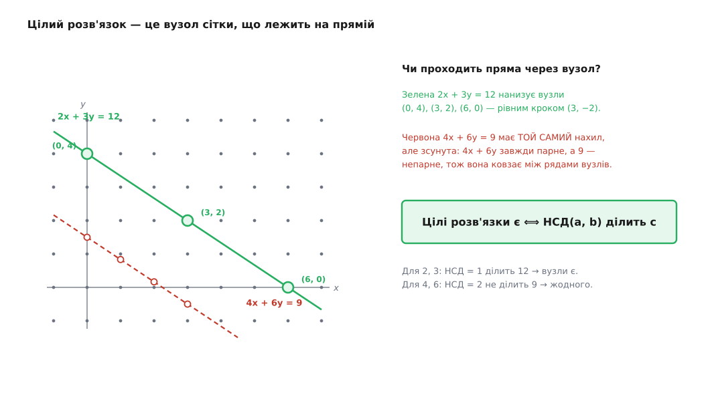
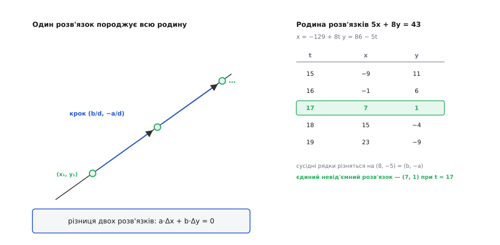
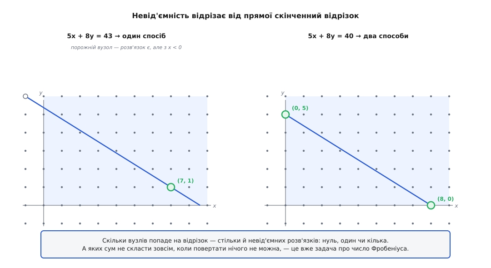

# Лінійні діофантові рівняння

<preknowlist>
- [НСД і алгоритм Евкліда](topic:math-number-theory/gcd-euclidean) — що таке найбільший спільний дільник двох чисел, як його за кілька ділень знаходить алгоритм Евкліда і що НСД(a, b) завжди подається як a·x + b·y із цілими x, y (тотожність Безу).
- [Модульна арифметика](topic:math-number-theory/modular-arithmetic) — подільність і кратність («a ділить b», «c кратне d»), ділення із залишком a = q·b + r та запис a ≡ b (mod m).
</preknowlist>

Ви винні товаришеві рівно одну гривню. Дрібних грошей у вас на двох не лишилося — тільки монети по 2 і по 5 гривень. Чи можна погасити борг точно, копійка в копійку, якщо кожен вільний передавати монети іншому, тобто давати решту?

Спробуймо. Ви даєте товаришеві п'ятірку, він повертає вам дві двійки — з рук у руки перейшло 5 − 4 = 1 гривня. Борг закрито без жодної копійки решти. Мовою арифметики це запис

```
5·1 + 2·(−2) = 1
```

де мінус означає «монета йде у зворотний бік». А тепер та сама задача, але монети по 4 і по 6 гривень. Скільки їх не перекладай, у кожній передачі сумарно рухається число, кратне двом, — з парних монет непарної гривні не набрати ніяк. Борг в одну гривню такими монетами закрити **неможливо в принципі**.

Дві майже однакові задачі, а долі протилежні. Різницю робить одне число — [найбільший спільний дільник](topic:math-number-theory/gcd-euclidean) номіналів: для 2 і 5 він дорівнює 1, для 4 і 6 — двом. І це не примха конкретних чисел, а закон, що покриває цілий клас задач: скласти задану величину з двох (чи кількох) заданих кроків, ходячи ними в обидва боки. Такі задачі й звуться **лінійними діофантовими рівняннями** — і зараз ми розберемо їх до дна: коли розв'язок існує, як його знайти й скільки їх усього.

### Ціле — а не будь-яке

Запишімо задачу в загальному вигляді. Дано три цілі числа — a, b і c; шукаємо такі x і y, щоб

```
a·x + b·y = c
```

Назва розкладається на дві частини, і кожна щось каже. **Лінійне** (лат. linea — «лінія, нитка») означає, що невідомі входять лише в першому степені — ні квадратів, ні добутків x·y; графік такого рівняння — пряма. **Діофантове** — за іменем Діофанта Александрійського, елліністичного математика, чия «Арифметика» шукала розв'язки в цілих і дробових числах, а не в будь-яких. Оце останнє слово й несе всю сіль.

Бо якби x і y дозволялося брати які завгодно — дійсні, — задача була б порожня. Пряма a·x + b·y = c має нескінченно багато точок; візьміть будь-який x, обчисліть y = (c − a·x)/b, і ось розв'язок. Ніякої математики тут немає. Уся складність — і вся краса — з'являється рівно тоді, коли ми вимагаємо, щоб **x і y були цілими**.

Геометрично це видно одразу. Позначмо на площині всі точки з цілими координатами — вони утворюють рівномірну сітку вузлів, ніби перехрестя нескінченного паперу в клітинку. Рівняння a·x + b·y = c — це пряма, проведена по цій сітці. Цілий розв'язок — це точка, де пряма **проходить точно через вузол**. І тут уже зовсім не однаково, яка пряма: одна нанизує вузли, як намистини, а інша може прослизнути між усіма, не зачепивши жодного.


*Дві прямі з однаковим нахилом над цілою сіткою. Верхня, 2·x + 3·y = 12, простромлює вузли (0, 4), (3, 2), (6, 0) — і так через один, рівним кроком (3, −2). Нижня, 4·x + 6·y = 9, має той самий нахил, але зсунута так, що ковзає точно між рядами вузлів і не попадає в жоден: її ліва частина 4·x + 6·y завжди парна, а 9 непарне. Питання про цілі розв'язки — це питання, чи нанизує пряма вузли, чи прослизає повз них.*

Отже задачу переформульовано: **чи попадає пряма a·x + b·y = c бодай в один вузол цілої сітки, і якщо так — у які саме?**

### Коли розв'язок існує

Почнімо з простішого — коли розв'язок є взагалі. Тут усю роботу вже зроблено за нас; досить придивитися до лівої частини.

Хоч які цілі x і y підставмо, вираз a·x + b·y ділиться на НСД(a, b). Причина проста: якщо число d ділить і a, і b, то воно ділить кожен доданок a·x та b·y, а отже й їхню суму. Позначмо d = НСД(a, b). Виходить, ліва частина **завжди кратна d** — які завгодно x, y дадуть тільки числа з ряду …, −2d, −d, 0, d, 2d, … Якщо c у цей ряд не попадає, тобто d не ділить c, рівність a·x + b·y = c не справдиться ніколи. Це вже половина відповіді, і половина строга: **умова d | c необхідна**.

Виявляється, вона ж і достатня — а ось це вже не самоочевидно. Треба знати, що серед усіх значень a·x + b·y дійсно **досягається сам d**, а не лише його кратні згори. Саме це стверджує [тотожність Безу](topic:math-number-theory/gcd-euclidean/math-bezout.md): знайдуться такі цілі x, y, що a·x + b·y = d, і сам НСД тут — найменше додатне число, яке взагалі можна зібрати з a і b. Множина всіх сум a·x + b·y — це **точно** множина кратних d, без дірок усередині й без чужого ззовні. А коли так, будь-яке кратне d досяжне: маючи d = a·x₀ + b·y₀, помножмо всю рівність на c/d…

— але щоб множити на c/d, це число саме має бути цілим, тобто d має ділити c. Коло замкнулося, і замкнулося воно у відповідь:

```
a·x + b·y = c має цілі розв'язки   ⟺   НСД(a, b) ділить c
```

Одне ділення — і вирок готовий. НСД(4, 6) = 2 не ділить 1, тому боргу в одну гривню четвірками й шістками не закрити; НСД(2, 5) = 1 ділить геть усе, тому двійками й п'ятірками складається будь-яка сума. Цілий клас питань замкнувся на одне число, яке [алгоритм Евкліда](topic:math-number-theory/gcd-euclidean) видає за кілька кроків, ні разу не згадавши про дільники.

> 🔧 **Навіщо це.** Той самий критерій керує розв'язністю **лінійних конгруенцій** — рівнянь виду a·x ≡ c (mod m), що раз у раз виринають у теорії чисел і криптографії. Записати a·x ≡ c (mod m) означає сказати, що a·x і c різняться на кратне m, тобто a·x − c = m·(−y) для якогось цілого y, — а це той самий діофантів запис a·x + m·y = c. Тому конгруенція розв'язна за тим самим правилом: тоді й лише тоді, коли НСД(a, m) ділить c. Найважливіший окремий випадок — c = 1: рівняння a·x ≡ 1 (mod m) шукає [обернене до a за модулем m](topic:math-number-theory/modular-arithmetic), яке існує рівно тоді, коли НСД(a, m) = 1. На цьому тримається й обчислення секретного ключа RSA, і склеювання залишків у [китайській теоремі про залишки](topic:math-number-theory/chinese-remainder-theorem).

### Один розв'язок — і зразу всі

Критерій каже, що розв'язок є. Тепер знайдімо його — і не один, а всі до єдиного.

Перший крок уже готовий у тотожності Безу. [Розширений алгоритм Евкліда](topic:math-number-theory/gcd-euclidean/math-bezout.md) не просто підтверджує, що коефіцієнти існують, а **видає** їх дорогою вниз: пару цілих x₀, y₀, для якої a·x₀ + b·y₀ = d. Лишається дотягнути d до потрібного c. Оскільки c = d·(c/d), помножмо рівність Безу на ціле c/d:

```
a·(x₀·c/d) + b·(y₀·c/d) = d·(c/d) = c
```

Ось і перший розв'язок, готовий формулою: беремо коефіцієнти Безу й розтягуємо їх у c/d разів. Назвімо цю пару (x₁, y₁).

**Скласти 43 копійки марками по 5 і по 8 копійок.**
```
НСД(5, 8) = 1,   а 1 ділить 43   →   розв'язок існує

Безу (розширений Евклід):   5·(−3) + 8·2 = 1
множимо на 43:              5·(−129) + 8·86 = 43
                            x₁ = −129,   y₁ = 86
```

Формально все правильно: 5·(−129) + 8·86 = −645 + 688 = 43. Але «мінус сто двадцять дев'ять марок» — відповідь, з якої користі мало. І тут ми впритул підходимо до головного: **знайдений розв'язок не єдиний**, а серед його родичів напевно є пристойніші.

Звідки беруться інші розв'язки, видно з короткого міркування. Нехай (x₁, y₁) і (x₂, y₂) — будь-які два розв'язки того самого рівняння. Віднімімо одну рівність від другої:

```
  a·x₁ + b·y₁ = c
  a·x₂ + b·y₂ = c
──────────────────────────
  a·(x₁ − x₂) + b·(y₁ − y₂) = 0
```

Різниця будь-яких двох розв'язків задовольняє те саме рівняння, тільки з нулем праворуч. Отже, щоб перебрати всі розв'язки, досить узяти один і додавати до нього всі способи отримати нуль — усі пари (Δx, Δy), для яких a·Δx + b·Δy = 0. А цей «нульовий рух» знайти легко.

Рівність a·Δx = −b·Δy скоротімо на d. Позначмо a′ = a/d і b′ = b/d — після ділення на спільний дільник ці двоє вже **взаємно прості**, спільних множників у них не лишилося. Маємо a′·Δx = −b′·Δy. Число b′ ділить праву частину, а з множником a′ ліворуч спільного не має нічого — отже b′ мусить ділити сам Δx. Значить, Δx = b′·t для якогось цілого t, і тоді Δy = −a′·t. Найдрібніший ненульовий крок уздовж прямої — рівно вектор (b′, −a′) = (b/d, −a/d); усі інші нульові рухи є його цілими кратними.

Складаємо перший розв'язок з усіма нульовими рухами й дістаємо повну відповідь:

```
x = x₁ + (b/d)·t
y = y₁ − (a/d)·t        t — будь-яке ціле число
```

Це і є **всі** розв'язки, до одного. Не «деякі», не «нескінченно багато якихось» — рівно ця однопараметрична родина, занумерована цілим t. Геометрично картина проста: пряма проходить крізь вузли сітки рівномірно, з кроком (b/d, −a/d), а формула лише нумерує ці вузли підряд.


*Один розв'язок задає всю родину. Ліворуч — «нульовий рух»: вектор (b/d, −a/d) веде з одного розв'язку в сусідній, бо a·(b/d) + b·(−a/d) = 0 не міняє суми. Він найкоротший з можливих цілих кроків уздовж прямої саме тому, що a/d і b/d уже взаємно прості — коротшого цілого вектора в цьому напрямку немає. Праворуч — родина розв'язків рівняння 5·x + 8·y = 43: сусідні відрізняються на (8, −5), тож із громіздкого (−129, 86) кількома кроками t доходимо до охайного (7, 1).*

Тепер видно й ціну громіздкого першого розв'язку: вона не має значення. Хоч який x₁ видала формула масштабування, вільний параметр t зсуває його з кроком b/d, доки він не опиниться там, де треба. Для нашого прикладу x = −129 + 8·t; при t = 17 маємо x = 7, а y = 86 − 5·17 = 1:

```
5·7 + 8·1 = 35 + 8 = 43   ✓
```

Сім п'ятикопійчаних марок і одна восьмикопійчана. Ту саму родину можна було відрахувати й від маленького розв'язку (7, 1) — результат той самий, бо родина одна. Уся ця механіка — перевірка критерію, масштабування коефіцієнтів Безу й зсув параметром — лягає в короткий розв'язувач; його код разом із переліком невід'ємних розв'язків зібрано у вставці [Діофантове рівняння в коді](topic:math-number-theory/linear-diophantine/proj-diophantine-solver.md).

### Коли рахуємо предмети: невід'ємні розв'язки

Досі ми дозволяли x і y бути хоч від'ємними — і мали на те право, бо в задачі про борг від'ємна монета означала «передати у зворотний бік». Та безліч задач такої вольності не терпить. Марок не буває мінус три; коробок, рейсів, робітників — так само. Щойно предмети не можна «повертати», до рівняння додається жорстка умова:

```
x ≥ 0   і   y ≥ 0
```

І характер задачі змінюється. Цілих розв'язків або немає зовсім, або нескінченно багато — рівномірна низка вузлів уздовж усієї прямої. Вимога невід'ємності відрізає від цієї нескінченної прямої лише **скінченний відрізок** — той шматок, що лежить у першому квадранті, де обидві координати додатні. Скільки вузлів упало в цей відрізок, стільки й розв'язків: може бути жодного, може бути один, може бути кілька.


*Вимога x ≥ 0, y ≥ 0 лишає від нескінченної низки розв'язків тільки відрізок прямої в першому квадранті. Ліворуч 5·x + 8·y = 43 кладе в цей відрізок рівно один вузол — (7, 1), тож спосіб один. Праворуч 5·x + 8·y = 40 ловить два: (0, 5) і (8, 0). Скільки саме вузлів попаде у відрізок — від нуля до кількох — залежить від того, наскільки далеко пряма відходить від початку координат.*

Знайти їх — річ механічна. Ми вже маємо всю родину x = x₁ + (b/d)·t, y = y₁ − (a/d)·t; лишається вимагати, щоб обидві були невід'ємні, і подивитися, які t це витримують. Кожна нерівність відтинає промінь значень t, а разом вони лишають відрізок — можливо, порожній, можливо, з кількома цілими всередині. Для марок 5 і 8 на 43 копійки цей відрізок стягується в одну точку t = 17, тому спосіб рівно один: (7, 1). Повний підрахунок — коли розв'язків нуль, коли один, а коли багато, і як їх полічити без перебору — розібрано у вставці [Скільки є невід'ємних розв'язків](topic:math-number-theory/linear-diophantine/math-nonnegative-solutions.md).

А от питання, яких сум **не скласти зовсім**, якщо повертати нічого не можна, виявляється незрівнянно глибшим. Монетами по 3 і по 5 не набрати 1, 2, 4, 7 — зате 8 і будь-що більше набирається завжди. Найбільша сума, що не піддається (тут — 7), зветься **числом Фробеніуса**, і на відміну від усього дотеперішнього загальної формули для трьох і більше номіналів для неї не знають досі. Це вже окрема задача — [число Фробеніуса, або задача про монети](topic:math-number-theory/frobenius-number).

> 🔧 **Навіщо це.** Невід'ємні діофантові розв'язки — щоденний хліб задач розкрою й пакування. Скільки труб по 6 і по 4 метри відрізати з бухт, щоб покрити замовлення точно, без обрізків? Як розкласти партію на палети двох місткостей, не лишивши недовантаженого місця? Скільки монет кожного номіналу видати решти? Усе це — a·x + b·y = c з умовою x, y ≥ 0, і від того, чи є в потрібному відрізку цілий вузол, залежить, здійсненне замовлення чи ні. Тому в бібліотеках оптимізації ціле лінійне програмування й починається саме звідси — з розв'язності однієї лінійної рівності в невід'ємних цілих.

### Більше невідомих

Задачі рідко зупиняються на двох номіналах. Класична головоломка — «сто птахів за сто монет» із китайського трактату Чжан Цюцзяня (V ст.): півень коштує 5 монет, курка 3, а курчата йдуть по троє за монету; купити треба рівно сто птахів рівно за сто монет. Тут три невідомі й два рівняння. Та щойно систему зведеш, лишається одне рівняння з трьома невідомими виду

```
a·x + b·y + e·z = c
```

Розв'язується воно тим самим ключем. Уся сума a·x + b·y + e·z ділиться на НСД усіх трьох коефіцієнтів, тож і тут **розв'язок є тоді й лише тоді, коли НСД(a, b, e) ділить c**. А сам НСД трьох чисел зводиться до парного: НСД(a, b, e) = НСД(НСД(a, b), e). Знайшовши цілий розв'язок, невідомі виражають уже через **два** вільні параметри замість одного — цілих розв'язків стає ще більше, вони заповнюють не низку точок на прямій, а сітку на площині. Загальне правило не залежить від кількості невідомих:

```
a₁·x₁ + a₂·x₂ + … + aₙ·xₙ = c   розв'язне в цілих
        ⟺   НСД(a₁, a₂, …, aₙ) ділить c
```

Один і той самий найбільший спільний дільник вирішує долю рівняння з двома невідомими і з двомастами — змінюється тільки, скільки вільних параметрів лишиться наприкінці.

### Звідки взялася назва

Ім'я Діофанта на цих рівняннях — данина радше символічна, ніж точна, і варто сказати це прямо. Діофант Александрійський (гр. Διόφαντος, приблизно III ст. н. е.) у «Арифметиці» справді шукав розв'язки в цілих і раціональних числах і ввів для невідомого першу відому нам символіку — але він розбирав окремі хитромудрі приклади, а не той загальний метод, який ми щойно склали. Систематичний спосіб розв'язувати a·x + b·y = c у цілих народився деінде й пізніше: його дали індійські математики — Аріабгата близько 499 року й Брахмагупта в 628-му — під назвою «кут-така» (санскр. kuṭṭaka — «подрібнювач»), і будувався він рівно на тому взаємному діленні, що й алгоритм Евкліда. У Європу цілочисельний метод повернувся аж у XVII столітті через Баше де Мезіріака. Хто що зробив насправді — Діофант, індійська школа, П'єр Ферма, Баше — і чому ім'я дісталося не тому, хто знайшов метод, розказано у вставці [Діофант, «Арифметика» й індійський «подрібнювач»](topic:math-number-theory/linear-diophantine/hist-diophantus.md).

За всім цим стоїть одна думка, і вона того варта. Пряма на площині несе нескінченно багато точок, але цілих серед них — або жодної, або рівний, передбачуваний ряд; і те, який із двох випадків настав, вирішується єдиним діленням. Питання, що виглядає як нескінченний перебір — «чи знайдуться такі цілі x і y?» — насправді впирається в найбільший спільний дільник, тобто в кілька кроків процедури, старшої за дві тисячі років. Ціле число впускає до себе далеко не кожну пряму; але тим, кого впускає, воно відчиняє двері рівно й до кінця.
