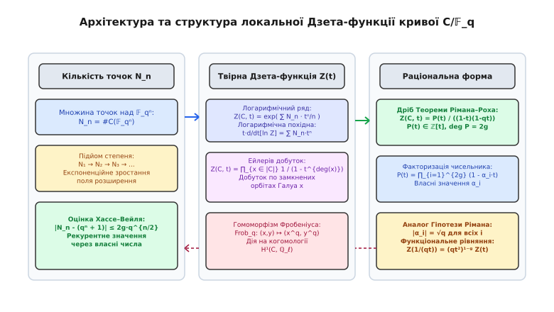
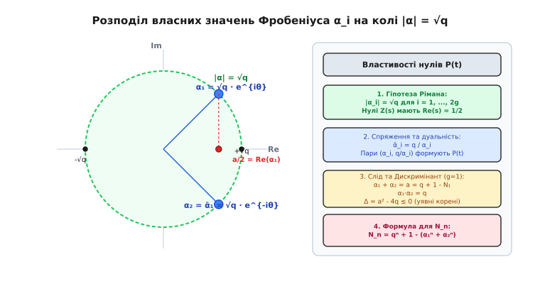
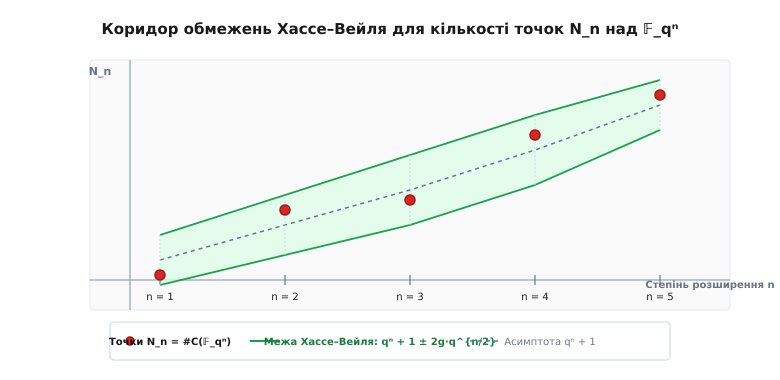

# Локальні дзета-функції кривих

<preknowlist>
- [Теорема Безу та алгебраїчні криві](topic:math-number-theory/bezout-identity) — проективний простір, гладкі криві та порядок перетину.
- [Співвідношення Девенпорта–Хассе](topic:math-number-theory/davenport-hasse-relations) — підйом характерів Гаусса у розширеннях скінченних полів `𝔽_qˢ / 𝔽_q`.
- [Еліптичні криві](topic:math-number-theory/elliptic-curves) — груповий закон, рід `g = 1` та кількість точок над скінченними полями.
</preknowlist>

При спробі аналізу діофантового рівняння над скінченним полем `𝔽_q` виникає фундаментальна проблема підйому: знання кількості розв'язків над базовим полем не дає прямої відповіді про кількість розв'язків у його скінченних розширеннях `𝔽_qⁿ`. Прямий перебір точок у розширених полях стає обчислювально неможливим уже при помірних степенях розширення `n`, оскільки розмір поля `qⁿ` зростає експоненційно. Більше того, без контролю над залежністю кількостей точок від степеня `n` неможливо встановити загальні геометричні інваріанти кривої.

Локальні Дзета-функції кривих (також відомі як конгруенц-дзета-функції) вирішують цю фундаментальну задачу. Вони кодують нескінченну послідовність кількостей точок `N_n = #C(𝔽_qⁿ)` кривої `C` над усіма вежами розширень `𝔽_qⁿ` у формі єдиного аналітичного об'єкта — твірної функції `Z(C/𝔽_q, t)`.

> 🔧 **Навіщо це.** Локальні дзета-функції є канонічним містком між алгебраїчною геометрією над скінченними полями та теорією чисел. Вони дозволяють обчислювати кількість рішень діофантових рівнянь над нескінченною вежею розширень `𝔽_qⁿ` за `O(1)` арифметичних операцій за допомогою рекурентних співвідношень, оцінювати стійкість еліптичних та гіпереліптичних криптосистем (ECC/HECC) через межу Хассе–Вейля, аналізувати криві у підрахунку за допомогою алгоритмів Шуфа–Аткіна–Елкіса (SEA) та будувати ефективні алгебро-геометричні коди виправлення помилок (коди Гоппи та криві Іхара).


*Концептуальна схема локальної Дзета-функції: від логарифмічного ряду кількостей точок N_n та Ейлерового добутку до раціонального дробу Теореми Рімана–Роха та власних чисел Фробеніуса.*

---

## 1. Конструкція твірної функції та Ейлерів добуток

Нехай `𝔽_q` — скінченне поле з `q = pʳ` елементів (де `p` — проста характеристика поля, `r ≥ 1`). Розглянемо гладку проективну абсолютно незвідну алгебраїчну криву `C`, визначену над полем `𝔽_q`.

Для кожного натурального степеня `n ≥ 1` позначимо через `C(𝔽_qⁿ)` множину `𝔽_qⁿ`-раціональних точок кривої `C`, тобто точок проективного простору з координатами у полі `𝔽_qⁿ`, які задовольняють системи рівнянь, що визначають криву `C`. Кількість цих точок позначається через:

```
N_n = # C(𝔽_qⁿ)
```

Послідовність цілих чисел `N₁, N₂, N₃, ..., N_n, ...` задає точний підрахунок рішень систем рівнянь кривої над кожним поверхом вежі розширень Galois `𝔽_q / 𝔽_q² / 𝔽_q³ / ...`.

Локальна Дзета-функція кривої `C` над полем `𝔽_q` позначається через `Z(C/𝔽_q, t)` або просто `Z(t)` і визначається як формальний степеневий ряд від комплексної змінної `t` за формулою експоненти логарифмічного ряду:

```
Z(C/𝔽_q, t) = exp( ∑_{n=1}^∞ N_n · (tⁿ / n) )
```

Змінна `t` пов'язана з класичним аналітичним параметром `s ∈ ℂ` підстановкою `t = q⁻ˢ`. При такій підстановці ряд конвергує у напівплощині `Re(s) > 1` (або для `|t| < q⁻¹`).

Для з'ясування причин появи коефіцієнтів `1/n` під знаком експоненти виконаємо формальне логарифмічне диференціювання функції `Z(C/𝔽_q, t)` по змінній `t`:

```
ln Z(C/𝔽_q, t) = ∑_{n=1}^∞ N_n · (tⁿ / n)
```

Застосуємо оператор `t · (d / dt)` до обох частин рівності:

```
t · (d / dt) [ ln Z(C/𝔽_q, t) ]
= t · ∑_{n=1}^∞ N_n · (n · tⁿ⁻¹ / n)                  [почленне диференціювання степеневого ряду]
= ∑_{n=1}^∞ N_n · tⁿ                                  [скорочення n та множення на t]
```

Отже, логарифмічна похідна дзета-функції, помножена на `t`, є звичайною твірною функцією для послідовності кількостей точок `N_n`. Формула з експонентою є найприроднішим способом перетворити адитивні комбінації кількостей точок на мультиплікативні структури.

Альтернативне алгебраїчне визначення Дзета-функції спирається на геометрію замкнених точок кривої `C`. Замкнена точка `x ∈ |C|` відповідає незвідній схемній точці або орбіті спряжених точок під дією абсолютного автоморфізму Фробеніуса `Frob_q: (X, Y) ↦ (X^q, Y^q)` у алгебраїчному замиканні `𝔽_bar_q`.

Ступінь замкненої точки `deg(x)` — це кількість спряжених елементів в орбіті Галуа, яка дорівнює степеню розширення її поля залишків над базовим полем:

```
deg(x) = [ κ(x) : 𝔽_q ]
```

Точка `x ∈ |C|` ступеня `d = deg(x)` дає внесок у кількість точок `N_n` тоді і лише тоді, коли `d` ділить `n`. При цьому кожна така точка додає рівно `d` раціональних точок до множини `C(𝔽_qⁿ)`. Отже, зауважуємо тотожність розкладу:

```
N_n = ∑_{d | n} d · # { x ∈ |C| | deg(x) = d }
```

Підставивши цей розклад у визначення логарифмічного ряду, отримуємо:

```
ln Z(C/𝔽_q, t)
= ∑_{n=1}^∞ (1 / n) · ∑_{d | n} d · # { x ∈ |C| | deg(x) = d } · tⁿ      [підстановка розкладу N_n]
= ∑_{x ∈ |C|} ∑_{k=1}^∞ (d / (k · d)) · t^{k · d}                         [групування за точками x при n = k·d]
= ∑_{x ∈ |C|} ∑_{k=1}^∞ (1 / k) · (t^{deg(x)})ᵏ                          [скорочення d у чисельнику та знаменнику]
= ∑_{x ∈ |C|} - ln ( 1 - t^{deg(x)} )                                     [згортання ряду: ∑ uᵏ/k = -ln(1-u)]
```

Взявши експоненту від обох частин, отримуємо фундаментальний **Ейлерів добуток** для локальної дзета-функції:

```
Z(C/𝔽_q, t) = ∏_{x ∈ |C|} 1 / (1 - t^{deg(x)})
```

Ейлерів добуток показує, що Дзета-функція повністю визначається спектром степенів усіх простих замкнених точок кривої `C`, за аналогією з тим, як класична дзета-функція Рімана `ζ(s) = ∏_p (1 - p⁻ˢ)⁻¹` визначається простими числами.

---

## 2. Теорема Рімана–Роха та Раціональність Дзета-функції

Ейлерів добуток виражає Дзета-функцію через нескінченний добуток. Проте фундаментальна теорема алгебраїчної геометрії стверджує, що цей нескінченний добуток завжди згортається у просту раціональну функцію (дріб від змінної `t`).

Для доведення раціональності скористаємося апаратом теорії дивізорів. Дивізор `D` на кривій `C` — це формальна скінченна цілочисельна комбінація замкнених точок `D = ∑ n_x [x]`. Ступінь дивізора задається як `deg(D) = ∑ n_x deg(x)`. Дивізор називається ефективним (`D ≥ 0`), якщо всі `n_x ≥ 0`.

Розглянемо кількість ефективних дивізорів ступеня `m ≥ 0`, яку позначимо через `A_m`:

```
A_m = # { D ∈ Div(C) | D ≥ 0, deg(D) = m }
```

Завдяки єдиності розкладу ефективних дивізорів на прості замкнені точки, твірна функція послідовності `A_m` точно збігається з Дзета-функцією:

```
Z(C/𝔽_q, t) = ∑_{m=0}^∞ A_m · tᵐ
```

Кількість ефективних дивізорів `A_m` обчислюється через класи лінійної еквівалентності дивізорів `Pic(C)` та розмірність просторів Рімана–Роха `L(D)`.

Для кожного класу дивізорів `[D]` ступеня `m` кількість ефективних дивізорів у цьому класі дорівнює кількості точок у відповідному проективному просторі `ℙ(L(D))`, тобто:

```
(q^{l(D)} - 1) / (q - 1)
```

де `l(D) = dim_{𝔽_q} L(D)`.

Позначимо через `h` порядок групи класів дивізорів ступеня 0 (число точок Якобіана `J(C)(𝔽_q)`). Тоді кількість класів дивізорів будь-якого фіксованого ступеня `m` також дорівнює `h`. Підсумовуючи по всіх `h` класах дивізорів `D₁, D₂, ..., D_h` ступеня `m`, маємо:

```
A_m = ∑_{j=1}^h (q^{l(D_j)} - 1) / (q - 1)
```

Застосуємо **Теорему Рімана–Роха** для алгебраїчної кривої роду `g`:

```
l(D) - l(K - D) = deg(D) + 1 - g
```

де `K` — канонічний дивізор ступеня `2g - 2`.

Аналіз розмірностей `l(D)` дає три режими залежно від ступеня `m = deg(D)`:

1. Для `m < 0`: не існує ефективних дивізорів, тому `A_m = 0`.
2. Для `m > 2g - 2`: дивізор `K - D` має від'ємний ступінь, отже `l(K - D) = 0`. З Теореми Рімана–Роха випливає точне значення `l(D) = m + 1 - g` для **всіх** класів дивізорів ступеня `m`. Кількість ефективних дивізорів стає однаковою в усіх класах:

```
A_m = h · (q^{m + 1 - g} - 1) / (q - 1)    (для всіх m ≥ 2g - 1)
```

3. Для `0 ≤ m ≤ 2g - 2`: значення `A_m` є скінченними цілими числами, які визначаються індивідуальною геометрією кривої.

Підставивши формулу для `A_m` при `m ≥ 2g - 1` у нескінченний ряд `Z(C, t)` та зсунувши суму через геометричні прогресії, отримуємо точну раціональну форму.

> 📜 Детальне покрокове виведення сумування хвоста ряду через теорему Рімана–Роха наведено у вставці [Теорема Рімана–Роха та раціональність локальної дзета-функції](topic:math-number-theory/local-zeta-functions/math-riemann-roch-zeta.md).

**Теорема (про Раціональність Дзета-функції кривих).**
Для будь-якої гладкої проективної кривої `C` роду `g` над скінченним полем `𝔽_q` локальна Дзета-функція є раціональним дробом вигляду:

```
Z(C/𝔽_q, t) = P(t) / ( (1 - t) · (1 - q·t) )
```

де чисельник `P(t) ∈ ℤ[t]` є поліномом ступеня `2g` з цілими коефіцієнтами:

```
P(t) = 1 - a₁·t + a₂·t² - ... + (-1)ᵍ⁻¹ · a_{g-1}·q^{g-1}·t²ᵍ⁻¹ + (-1)ᵍ · qᵍ·t²ᵍ
```

Знаменник `(1 - t) · (1 - q·t)` відповідає геометричним полюсам у точках `t = 1` та `t = 1/q` (у змінній `s` це полюси `s = 0` та `s = 1`), які визначаються незвідними компонентами розмірності 0 та 1 (точка та сама крива).

---

## 3. Функціональне рівняння та симетрія чисельника

Локальна Дзета-функція задовольняє функціональне рівняння, яке є відображенням дуальності Серра (або дуальності Пуанкаре в етальних когомологіях).

**Теорема (Функціональне рівняння).**
Для локальної Дзета-функції кривої `C` роду `g` над полем `𝔽_q` виконується тотожність:

```
Z(C/𝔽_q, 1 / (q·t)) = (q · t²)¹⁻ᵍ · Z(C/𝔽_q, t)
```

У термінах чисельника `P(t)` функціональне рівняння еквівалентне дзеркальній симетрії коефіцієнтів полінома:

```
P(t) = qᵍ · t²ᵍ · P(1 / (q·t))
```

Ця інваріантність встановлює зв'язок між старшими та молодшими коефіцієнтами полінома `P(t)`:

```
a_{2g - k} = q^{g - k} · a_k   (для 0 ≤ k ≤ g)
```

Зокрема:
- Вільний член полінома завжди дорівнює `1`: `P(0) = 1`.
- Старший коефіцієнт при `t²ᵍ` дорівнює `qᵍ`: `a_{2g} = (-1)ᵍ · qᵍ`.
- Коефіцієнт при `t` безпосередньо пов'язаний з кількістю точок над базовим полем:

```
a₁ = q + 1 - N₁
```

Це означає, що для еліптичної кривої (`g = 1`) поліном чисельника повністю визначається знанням кількості точок `N₁` над базовим полем `𝔽_q`:

```
P(t) = 1 - a·t + q·t²    (де a = q + 1 - N₁)
```

Для кривої роду `g = 2` чисельник має ступінь 4 і визначається лише двома коефіцієнтами `a₁` та `a₂`:

```
P(t) = 1 - a₁·t + a₂·t² - a₁·q·t³ + q²·t⁴
```

Значення полінома `P(t)` у точці `t = 1` дає фундаментальний арифметичний інваріант:

```
P(1) = h = # Pic⁰(C) = # J(C)(𝔽_q)
```

Чисельник Дзета-функції в точці `t = 1` дорівнює кількості `𝔽_q`-раціональних точок на многовиді Якобі `J(C)`.

---

## 4. Гіпотези Вейля та оператор Фробеніуса у когомологіях

Найглибшим результатом у теорії локальних дзета-функцій є аналог Гіпотези Рімана для алгебраїчних кривих над скінченними полями, доведений Гельмутом Хассе для `g = 1` та Андре Вейлем для `g ≥ 1`.


*Геометричне розміщення власних значень ендоморфізму Фробеніуса α_i на колі радіуса |α| = √q у комплексній площині та проекція сліду a/2 на дійсну вісь.*

> 📜 Історичний шлях доведення цієї теми від спостережень Артіна до ℓ-адичних когомологій Гротендіка та Деліня описано у вставці [Гіпотези Вейля та народження локальних дзета-функцій](topic:math-number-theory/local-zeta-functions/hist-weil-conjectures.md).

У рамках теорії етальних ℓ-адичних когомологій Гротендіка, алгебраїчна крива `C` над `𝔽_q` має векторні простори когомологій `Hⁱ_et(C_bar, ℚ_ℓ)` над полем ℓ-адичних чисел `ℚ_ℓ` (де `ℓ ≠ p`):
- `H⁰_et(C_bar, ℚ_ℓ)` має розмірність 1; автоморфізм Фробеніуса тотожно діє з власним значенням `λ = 1`.
- `H²_et(C_bar, ℚ_ℓ)` має розмірність 1; автоморфізм Фробеніуса діє з власним значенням `λ = q`.
- `H¹_et(C_bar, ℚ_ℓ)` має розмірність `2g`; автоморфізм Фробеніуса діє з `2g` власними значеннями `α₁, α₂, ..., α_{2g}`.

Для довільного гладкого проективного многовиду `V` розмірності `n` над `𝔽_q` формула нерухомих точок Лефшеца–Гротендіка виражає Дзета-функцію як альтернований добуток характеристичних поліномів оператора Фробеніуса на просторах когомологій `Hⁱ_et(V_bar, ℚ_ℓ)` розмірностей `B_i` (числа Бетті):

```
Z(V/𝔽_q, t) = ∏_{i=0}^{2n} P_i(t)^{(-1)^{i+1}} = P₁(t) · P₃(t) · ... · P_{2n-1}(t) / ( P₀(t) · P₂(t) · ... · P_{2n}(t) )
```

де `P_i(t) = det(1 - t · Frob_q | Hⁱ_et(V_bar, ℚ_ℓ))`.

Для кривої `C` (`n = 1`) непарними когомологіями є лише `H¹_et` (де `P₁(t) = P(t)` має ступінь `2g`), а парними когомологіями є `H⁰_et` (де `P₀(t) = 1 - t`) та `H²_et` (де `P₂(t) = 1 - q·t`). Це дає точний топологічний розклад Дзета-функції кривої!

За формулою нерухомих точок Лефшеца–Гротендіка кількість раціональних точок `N_n = #C(𝔽_qⁿ)` виражається як альтернована сума слідів оператора Фробеніуса:

```
N_n = Tr( Frob_qⁿ | H⁰_et ) - Tr( Frob_qⁿ | H¹_et ) + Tr( Frob_qⁿ | H²_et )
    = 1 - ∑_{i=1}^{2g} α_iⁿ + qⁿ
```

Розкладемо чисельник `P(t)` на множники над полем комплексних чисел `ℂ`:

```
P(t) = ∏_{i=1}^{2g} (1 - α_i · t)
```

Комплексні числа `α₁, α₂, ..., α_{2g} ∈ ℂ` є оберненими коренями полінома `P(t)` (тобто `P(1/α_i) = 0`). Вони є саме власними значеннями канонічного автоморфізму Фробеніуса `Frob_q`, що діє на просторі `H¹_et(C_bar, ℚ_ℓ)`.

**Теорема (Аналог Гіпотези Рімана для кривих — Теорема Хассе–Вейля).**
Для всіх обернених коренів `α_i` чисельника `P(t)` локальної Дзета-функції гладкої проективної кривої `C` над полем `𝔽_q` абсолютне значення дорівнює:

```
|α_i| = √q = q^{1/2}    (для всіх i = 1, 2, ..., 2g)
```

У термінах комплексної змінної `s` (де `t = q⁻ˢ`) нулі Дзета-функції `Z(C, q⁻ˢ) = 0` задовольняють умову:

```
|q⁻ˢ| = q^{-Re(s)} = q^{-1/2}  ⇒  Re(s) = 1/2
```

Усі нулі локальної Дзета-функції кривої лежать чітко на критичній прямій `Re(s) = 1/2`!

Завдяки дійсній дійсності коефіцієнтів полінома `P(t)` корені `α_i` розбиваються на комплексно спряжені пари `(α_i, ᾱ_i)`. З функціонального рівняння випливає, що спряженим коренем до `α_i` є число `q / α_i`. Оскільки `|α_i| = √q`, маємо:

```
ᾱ_i = q / α_i
```

Для еліптичної кривої (`g = 1`) маємо дві пара коренів `α₁, α₂`, які є розв'язками квадратного рівняння `λ² - a·λ + p = 0`. Формули Вієта дають:

```
α₁ + α₂ = a = q + 1 - N₁
```

```
α₁ · α₂ = q
```

Оскільки `|α₁| = |α₂| = √q`, дискримінант квадратного рівняння є від'ємним: `Δ = a² - 4q ≤ 0`. Це негайно дає славнозвісну **оцінку Хассе**:

```
|a| ≤ 2 · √q
```

---

## 5. Оцінка Хассе–Вейля та рекурентні обчислення N_n

Розклад чисельника `P(t) = ∏_{i=1}^{2g} (1 - α_i · t)` дозволяє отримати точний алгебраїчний вираз для кількості точок `N_n` над будь-яким розширенням `𝔽_qⁿ`.

Взявши логарифмічну похідну від раціональної форми `Z(C, t)`:

```
t · (d / dt) [ ln Z(C, t) ] = t · (d / dt) [ ln P(t) - ln(1 - t) - ln(1 - q·t) ]
```

Розкладаючи кожен доданок у степеневий ряд:

```
t · (d / dt) ln(1 - t) = - t / (1 - t) = - ∑_{n=1}^∞ tⁿ
```

```
t · (d / dt) ln(1 - q·t) = - q·t / (1 - q·t) = - ∑_{n=1}^∞ (q·t)ⁿ = - ∑_{n=1}^∞ qⁿ · tⁿ
```

```
t · (d / dt) ln P(t) = t · (d / dt) ∑_{i=1}^{2g} ln(1 - α_i · t) = - ∑_{i=1}^{2g} ∑_{n=1}^∞ α_iⁿ · tⁿ
```

Прирівнюючи коефіцієнти при `tⁿ` з обох боків тотожності `∑ N_n tⁿ`, отримуємо точну **формулу підйому точок**:

```
N_n = qⁿ + 1 - ∑_{i=1}^{2g} α_iⁿ
```

Кількість точок на кривій роду `g` над полем `𝔽_qⁿ` дорівнює базовому проектувальному числу `qⁿ + 1` мінус сума `n`-их степенів власних значень Фробеніуса!


*Коридор обмежень Хассе–Вейля: кількості точок N_n обов'язково лежать усередині зеленої смуги товщиною 4g·q^{n/2} навколо асимптотичної кривої qⁿ + 1.*

Застосуємо нерівність трикутника до формули підйому точок. Зважаючи на те, що `|α_i| = √q` для всіх `i = 1, ..., 2g`, маємо:

```
| N_n - (qⁿ + 1) | = | ∑_{i=1}^{2g} α_iⁿ | ≤ ∑_{i=1}^{2g} |α_i|ⁿ = ∑_{i=1}^{2g} (q^{1/2})ⁿ = 2g · q^{n/2}
```

Ця нерівність є **загальною оцінкою Хассе–Вейля** для кривих роду `g`:

```
qⁿ + 1 - 2g · q^{n/2} ≤ N_n ≤ qⁿ + 1 + 2g · q^{n/2}
```

Для обчислення послідовності `N_n` немає потреби шукати комплексні корені `α_i`. Позначимо суму степенів через `S_n = ∑_{i=1}^{2g} α_iⁿ`. За теоремою Ньютона про степеневі суми послідовність `S_n` задовольняє лінійне рекурентне співвідношення з коефіцієнтами полінома `P(t)`!

Для еліптичної кривої (`g = 1`) рекурентність має порядок 2:

```
S₀ = 2
S₁ = a = q + 1 - N₁
S_n = a · S_{n-1} - q · S_{n-2}    (для всіх n ≥ 2)
```

Кількість точок виражається як:

```
N_n = qⁿ + 1 - S_n
```

Це дозволяє обчислити `N_n` над полем `𝔽_{q¹⁰⁰}` за `100` простих арифметичних операцій у кільці цілих чисел, знаючи лише кількість точок `N₁` над базовим полем!

---

## 6. Розподіл кутів Фробеніуса та Гіпотеза Сато–Тейта

Для еліптичної кривої `E` над полем `𝔽_q` власними значеннями автоморфізму Фробеніуса є пара комплексно спряжених чисел `α₁, α₂` з модулем `|α₁| = |α₂| = √q`. Запишемо ці корені у тригонометричній формі:

```
α₁, α₂ = √q · e^{± i · θ_q} = √q · ( cos(θ_q) ± i · sin(θ_q) )
```

де кут `θ_q ∈ [0, π]` називається **кутом Фробеніуса** кривої `E` над полем `𝔽_q`.

Слід автоморфізму Фробеніуса `a = q + 1 - N₁ = α₁ + α₂` прямо пов'язаний з кутом `θ_q` співвідношенням:

```
a = 2 · √q · cos(θ_q)  ⇒  cos(θ_q) = a / (2 · √q) ∈ [-1, 1]
```

При варіюванні простого числа `p` для фіксованої еліптичної кривої `E/ℚ` без комплексної множення (non-CM кривої) постає питання: як розподілені кути Фробеніуса `θ_p` на відрізку `[0, π]`?

**Теорема (Гіпотеза Сато–Тейта — доведена Річардом Тейлором, Майклом Харрісом та Ніколасом Шеперд-Барроном у 2006–2008 рр.).**
Для будь-якої еліптичної кривої `E/ℚ` без комплексної множення послідовність кутів Фробеніуса `{θ_p}` для простих чисел хорошої редукції `p ≤ X` є рівномірно розподіленою на відрізку `[0, π]` відносно **міри Сато–Тейта**:

```
d μ_{ST} = (2 / π) · sin²(θ) · dθ
```

Імовірність того, що кут Фробеніуса `θ_p` лежить в інтервалі `[α, β] ⊂ [0, π]`, дорівнює:

```
lim_{X → ∞} ( # { p ≤ X | α ≤ θ_p ≤ β } / # { p ≤ X } ) = (2 / π) · ∫_α^β sin²(θ) · dθ
```

Цей результат показує, що власні значення Фробеніуса локальних Дзета-функцій утворюють математично впорядкований ансамбль, який відповідає розподілу класів спряженості у компакній групі Лі `SU(2)` (або `USp(2g)` для кривих роду `g`).

---

## 7. Локально-глобальний принцип та глобальні L-функції над ℚ

Локальні Дзета-функції є цеглинами для побудови глобальних арифметичних інваріантів — `L`-функцій алгебраїчних кривих та еліптичних кривих, визначених над полем раціональних чисел `ℚ`.

Нехай `E/ℚ` — еліптична крива, задана цілочисельним рівнянням Вейєрштрасса з дискримінантом `Δ`. Для кожного простого числа `p`, яке не ділить `Δ` (просте число хорошої редукції), редукована крива `E_p = E mod p` є гладкою еліптичною кривою над скінченним полем `𝔽_p`.

Локальна Дзета-функція у простому `p` визначається чисельником `P_p(t) = 1 - a_p·t + p·t²`, де `a_p = p + 1 - #E(𝔽_p)`.

Підставивши `t = p⁻ˢ`, локальний множник розкладу виражається у вигляді:

```
L_p(E, s) = 1 / P_p(p⁻ˢ) = 1 / ( 1 - a_p · p⁻ˢ + p¹⁻²ˢ )
```

Глобальна **L-функція Гассе–Вейля** еліптичної кривої `E/ℚ` визначається як нескінченний Ейлерів добуток по всіх простих числах `p`:

```
L(E/ℚ, s) = ∏_{p ∤ Δ} 1 / ( 1 - a_p · p⁻ˢ + p¹⁻²ˢ )  ·  ∏_{p | Δ} L_p(E, s)
```

Цей нескінченний добуток конвергує абсолютно у напівплощині `Re(s) > 3/2`.

Фундаментальна **Теорема про модулярність** (доведена Ендрю Вайлосом, Річардом Тейлором, Крістофом Брейлем, Браяном Конрадом та Фредом Даймондом у 1995–2001 роках) стверджує, що для кожної еліптичної кривої `E/ℚ` існує така параболічна модулярна форма `f(z) ∈ S₂(Γ₀(N))` ваги 2 відносно конгруенц-підгрупи `Γ₀(N)` (де `N` — провідник кривої `E`), що їхні глобальні `L`-функції повністю збігаються:

```
L(E/ℚ, s) = L(f, s) = ∑_{n=1}^∞ a_n / nˢ
```

Звідси випливає, що локальні дзета-функції для окремих полів `𝔽_p` повністю визначають коефіцієнти Фурьє `a_p` відповідної модулярної форми `f(z)`. Це досягнення стало ключем до остаточного доведення Великої теореми Ферма!

---

## 8. Алгоритми підрахунку точок (SEA та Kedlaya)

Практичне застосування Дзета-функцій у криптографії (побудова еліптичних кривих для ECDSA, Ed25519, BLS12-381) вимагає знаходження порядку групи `N₁ = #E(𝔽_q)` для дуже великих полів (`q ≈ 2²⁵⁶`).

Прямий перебір `q` точок за допомогою символу Лежандра має складність `O(q · log q)` і працює лише при `q ≤ 10⁶`. Для криптографічних полів розроблено спеціалізовані алгоритми.

### 1. Алгоритм Рене Шуфа (1985)
Французький математик Рене Шуф запропонував перший детермінований алгоритм поліноміальної складності для обчислення `N₁` над полем `𝔽_q`.

Ідея алгоритму Шуфа полягає в обчисленні сліду Фробеніуса `a (mod ℓ)` для набору малих простих чисел `ℓ = 2, 3, 5, 7, ..., ℓ_k` таких, що їхній добуток перевищує коридор Хассе:

```
∏_{i=1}^k ℓ_i > 4 · √q
```

Для кожного малого простого `ℓ` обчислюється дія автоморфізму Фробеніуса `Frob_q` на підгрупу точок `ℓ`-кручення `E[ℓ] ≅ (ℤ/ℓℤ)²`. Ця дія описується за допомогою **поліномів ділення** `f_ℓ(x) ∈ 𝔽_q[x]` степеня `(ℓ² - 1)/2`.

Знаючи `a (mod ℓ_i)` для всіх `i`, підсумкове значення `a` відновлюється за допомогою [Китайської теореми про залишки](topic:math-number-theory/chinese-remainder-theorem). Складність алгоритму Шуфа становить `O(log⁸ q)`.

### 2. Покращення SEA (Шуф–Аткін–Елкіс)
Ноам Елкіс та Олівер Аткін прискорили алгоритм Шуфа, використавши теорію модулярних кривих `X₀(ℓ)` та модулярних поліномів `Φ_ℓ(X, Y)`. Якщо модулярний поліном `Φ_ℓ(X, j(E))` має корінь у `𝔽_q`, просте число `ℓ` називається **простим Елкіса**. Для простих Елкіса поліном ділення `f_ℓ(x)` розкладається на множники степеня `(ℓ - 1)/2`, що зменшує степінь модулярних рівнянь.

Алгоритм SEA знижує обчислювальну складність до `O(log⁴ q)` і дозволяє підраховувати кількість точок на еліптичних кривих у полях розміром `2²⁵⁶` за частки секунди.

### 3. p-адичний алгоритм Кєдлаї (Kedlaya, 2001)
Для гіпереліптичних кривих вищого роду `g ≥ 2` над скінченними полями невеликої характеристики `p` Іран Девід Кєдлая розробив p-адичний алгоритм, що базується на когомологіях Монського–Вашніцера. Алгоритм Кєдлаї обчислює матрицю дій Фробеніуса на p-адичні диференціальні форми з точністю до `p^N` і визначає чисельник Дзета-функції `P(t)` за час `O(g³ · log³ q)`.

---

## 9. Алгебро-геометричні коди та межа Тіффані–Владуца–Цфасмана

Локальні Дзета-функції та криві з максимально можливим числом точок над `𝔽_q` грають ключову роль у сучасній теорії кодування.

У 1981 році радянський математик Валерій Гоппа запропонував будувати лінійні коди виправлення помилок за допомогою раціональних функцій на алгебраїчних кривих над скінченними полями `𝔽_q`. Вони отримали назву **алгебро-геометричних кодів (кодів Гоппи)**.

Параметри алгебро-геометричного коду визначаються геометрією кривої:
- Довжина коду `n` дорівнює кількості раціональних точок кривої `N₁ = #C(𝔽_q)`.
- Розмірність коду `k = m + 1 - g`.
- Мінімальна кодова відстань `d ≥ n - m`.

Для побудови довгих та ефективних кодів виправлення помилок потрібні криві високого роду `g`, які мають максимально можливу кількість точок `N₁` відносно роду `g`.

Розглянемо асимптотичний інваріант Іхара для вежі кривих над полем `𝔽_q`:

```
A(q) = limsup_{g → ∞} ( N₁(C_g) / g )
```

З оцінки Хассе–Вейля випливає тривіальне верхнє обмеження `A(q) ≤ 2√q`. Проте у 1983 році математики Сергій Владуц та Володимир Дрінфельд за допомогою аналізу нулів Дзета-функцій довели суворіше обмеження — **межу Дрінфельда–Владуца**:

```
A(q) ≤ √q - 1
```

Математики Ясутака Іхара та Томас Цфасман довели, що коли `q = p²ʳ` є точним квадратом, межа Дрінфельда–Владуца досягається на вежах вейлівських кривих Шімури:

```
A(q) = √q - 1    (для q = p²ʳ)
```

Алгебро-геометричні коди, побудовані на таких оптимальних кривих Іхара, перевершують видатну **межу Гілберта–Варшамова**, яка вважалася нездоладною бар'єрною межею для всіх випадкових лінійних кодів упродовж понад 30 років!

---

## 10. Локальні Дзета-функції алгебраїчних поверхонь та многовидів K3

Узагальнення конструкції Дзета-функції з кривих (розмірність `n = 1`) на алгебраїчні поверхні (розмірність `n = 2`) демонструє універсальність формули Лефшеца–Гротендіка.

Нехай `V` — гладка проективна поверхня роду `p_g` над скінченним полем `𝔽_q`. Локальна Дзета-функція поверхні розкладається на 5 характеристичних поліномів:

```
Z(V/𝔽_q, t) = P₁(t) · P₃(t) / ( P₀(t) · P₂(t) · P₄(t) )
```

де:
- `P₀(t) = 1 - t` (розмірність `H⁰_et` дорівнює 1).
- `P₄(t) = 1 - q²·t` (розмірність `H⁴_et` дорівнює 1).
- `P₁(t)` має ступінь `B₁ = 2q` (де `q` — альбанезе рід поверхні).
- `P₃(t)` має ступінь `B₃ = 2q` і є функціонально дуальним до `P₁(t)`.
- `P₂(t)` має ступінь `B₂` (друге число Бетті) і кодує 2-вимірні когомології `H²_et(V_bar, ℚ_ℓ)`.

### Поверхні K3 та їхні локальні Дзета-функції
**Поверхнею K3** називається однозв'язна гладка проективна поверхня `X` з тривіальним канонічним пучком `K_X ≅ O_X` та родом `q = 0`.

Для будь-якої поверхні K3 `X` над полем `𝔽_q` непарні когомології відсутні: `B₁ = B₃ = 0` (`P₁(t) = P₃(t) = 1`). Друге число Бетті поверхні K3 дорівнює `B₂ = 22`.

Отже, локальна Дзета-функція поверхні K3 набирає винятково просту раціональну форму:

```
Z(X/𝔽_q, t) = 1 / ( (1 - t) · P₂(t) · (1 - q²·t) )
```

де чисельник відсутній (дорівнює 1), а знаменник містить поліном `P₂(t) ∈ ℤ[t]` степеня `22`, обернені корені якого `β₁, β₂, ..., β₂₂` мають модуль `|β_j| = q` (згідно з підтвердженою гіпотезою Вейля для `n = 2`).

### Дзета-функція поверхні Ферма `x⁴ + y⁴ + z⁴ + w⁴ = 0`
Поверхня Ферма 4-го степеня в `ℙ³` є канонічним прикладом поверхні K3. Обчислення кількості раціональних точок `N_n = #X(𝔽_qⁿ)` виконується за допомогою 3-вимірних сум Якобі `J(χ₁, χ₂, χ₃)` від характерів 4-го порядку.

Поліном `P₂(t)` для поверхні Ферма розкладається на підпростір алгебраїчних циклів Нерона–Севері `NS(X)` розмірності `ρ = 20` та трансцендентну частину `T(X)` розмірності `22 - 20 = 2`:

```
P₂(t) = (1 - q·t)²⁰ · (1 - a₂·q·t + q²·t²)
```

Це демонструє, як геометричний розклад когомологічних груп на алгебраїчні та трансцендентні компоненти прямо відображається на множниках локальної Дзета-функції!

---

## 11. Суперсингулярні криві та криптографія на ізогеніях

Особливе практичне значення у сучасній постквантовій криптографії мають **суперсингулярні еліптичні криві** над полем `𝔽_{p²}`.

Для будь-якої суперсингулярної еліптичної кривої `E` над полем `𝔽_p` слід Фробеніуса дорівнює нулю `a = 0`. Під час розширення базового поля до `𝔽_{p²}` автоморфізм Фробеніуса `Frob_{p²} = Frob_p²` діє на когомології як множення на `-p` або `+p`.

У результаті для всіх суперсингулярних еліптичних кривих `E` над полем `𝔽_{p²}` слід Фробеніуса над `𝔽_{p²}` є однаковим і строго дорівнює `a' = ± 2p`.

Чисельник Дзета-функції будь-якої суперсингулярної кривої над `𝔽_{p²}` є повним квадратом:

```
P(t) = 1 ∓ 2p·t + p²·t² = (1 ∓ p·t)²
```

Звідси локальна Дзета-функція будь-якої суперсингулярної кривої над `𝔽_{p²}` має уніфікований вигляд:

```
Z(E/𝔽_{p²}, t) = (1 ∓ p·t)² / ( (1 - t) · (1 - p²·t) )
```

Кількість точок на будь-якій суперсингулярній кривій над `𝔽_{p²}` дорівнює строго `(p ∓ 1)²`.

Цей канонічний уніформізм означає, що всі суперсингулярні криві над `𝔽_{p²}` мають однакові локальні дзета-функції. Проте їхні кільця ендоморфізмів `End(E)` відрізняються і формують так званий **граф ізогеній Рамануджана**.

У криптографічних протоколах CSIDH та SQISign стійкість ґрунтується на складності знаходження ш шляху в такому графі ізогеній між кривими з однаковою Дзета-функцією, що гарантує захист від атак на квантових комп'ютерах.

---

## 12. Гіпотеза Тейта для алгебраїчних циклів та полюсів Дзета-функції

Фундаментальне зв'язувальне ланцюгове питання між геометрією алгебраїчних циклів та аналітичними властивостями Дзета-функцій задається **Гіпотезою Тейта**, сформульованою Джоном Тейтом у 1963 році.

Гіпотеза Вейля про раціональність визначає, що Дзета-функція багатовимірного многовиду `V` розмірності `n` має полюси лише у точках `t = q⁻ʲ` для `j = 0, 1, ..., n`.

**Гіпотеза Тейта.**
Порядок полюса локальної Дзета-функції `Z(V/𝔽_q, t)` у точці `t = q⁻ʲ` строго дорівнює рангу абелевої групи `𝔽_q`-раціональних алгебраїчних циклів корозмірності `j` на многовиді `V` modulo алгебраїчна (або числова) еквівалентність:

```
ord_{t = q⁻ʲ} Z(V/𝔽_q, t) = dim_{ℚ_ℓ} ( H^{2j}_et(V_bar, ℚ_ℓ(j))^{Frob_q} ) = rank A^j(V)
```

Зокрема, для поверхні (`n = 2`) порядок полюса у точці `t = q⁻¹` визначається рангом групи Нерона–Севері `NS(V)` (рангом алгебраїчних дивізорів на поверхні):

```
ord_{t = q⁻¹} Z(V/𝔽_q, t) = ρ(V) = rank NS(V)
```

Гіпотеза Тейта була повністю доведена для поверхонь K3 Франсуа Чарльзом, Кезіа Мадупом та Соломоном Мюре у 2013–2015 роках. Це підтверджує, що полюси локальної Дзета-функції мають точну геометричну природу і визначаються кількістю раціональних алгебраїчних підмноговидів відповідних корозмірностей.

Крім того, аналог Гіпотези Тейта для глобальних `L`-функцій прямо пов'язаний із видатною **Гіпотезою Бірча і Свіннертона-Даєра (BSD)** (однією з семи Задач тисячоліття Інституту Клея). Вона стверджує, що ранг абелевої групи раціональних точок еліптичної кривої `E(ℚ)` (ранг Морделла–Вейля) строго дорівнює порядку нуля її глобальної `L`-функції у центрі критичної смуги `s = 1`:

```
ord_{s = 1} L(E/ℚ, s) = rank E(ℚ)
```

Таким чином, розклад локальних Дзета-функцій по всіх простих числах `p` формує глобальну `L`-функцію, яка повністю визначає геометричну та алгебраїчну структуру розв'язків діофантових рівнянь над полем раціональних чисел. Це підкреслює статус Дзета-функцій як найважливішого математичного інструменту на стику сучасної алгебраїчної геометрії, топології, криптографії, квантової теорії поля та фундаментальних задач класичної теорії чисел.

---

## 13. Практичні приклади обчислення

### Приклад 1. Проективна пряма `ℙ¹` над `𝔽_q` (`g = 0`)

Проективна пряма `ℙ¹` складається з `qⁿ` афінних точок та 1 нескінченно віддаленої точки. Отже, для будь-якого степеня `n ≥ 1`:

```
N_n = qⁿ + 1
```

Обчислимо логарифмічний ряд:

```
ln Z(ℙ¹/𝔽_q, t)
= ∑_{n=1}^∞ (qⁿ + 1) · (tⁿ / n)                       [підстановка N_n = qⁿ + 1]
= ∑_{n=1}^∞ ( (q·t)ⁿ / n )  +  ∑_{n=1}^∞ ( tⁿ / n )   [розбиття суми на два логарифмічні ряди]
= - ln(1 - q·t) - ln(1 - t)                            [сумування рядів: ∑ uⁿ/n = -ln(1-u)]
= ln [ 1 / ( (1 - t) · (1 - q·t) ) ]                   [властивість логарифма: ln A + ln B = ln(A·B)]
```

Взявши експоненту, отримуємо:

```
Z(ℙ¹/𝔽_q, t) = 1 / ( (1 - t) · (1 - q·t) )
```

Тут рід `g = 0`, чисельник `P(t) = 1`. Функція не має нулів і має два класичні полюси.

### Приклад 2. Еліптична крива над `𝔽₅` (`g = 1`)

Розглянемо еліптичну криву `E`, задану рівнянням у формі Вейєрштрасса над полем `𝔽₅`:

```
E: y² = x³ + x + 1  (над 𝔽₅)
```

Здійснимо точний підрахунок точок `N₁` над базовим полем `𝔽₅ = {0, 1, 2, 3, 4}`:

Таблиця квадратів у полі `𝔽₅`:
- `0² = 0`
- `1² = 1`, `4² = 1`  (квадратичний залишок `1`)
- `2² = 4`, `3² = 4`  (квадратичний залишок `4`)
Множина квадратичних залишків `QR(𝔽₅) = {1, 4}`, незалишків `QNR(𝔽₅) = {2, 3}`.

Перебираємо значення `x ∈ 𝔽₅`:
1. `x = 0`: `y² = 0³ + 0 + 1 = 1 ∈ QR` `⇒ y = ±1` (2 точки: `(0, 1)`, `(0, 4)`).
2. `x = 1`: `y² = 1³ + 1 + 1 = 3 ∈ QNR` `⇒` 0 точок.
3. `x = 2`: `y² = 2³ + 2 + 1 = 11 ≡ 1 ∈ QR` `⇒ y = ±1` (2 точки: `(2, 1)`, `(2, 4)`).
4. `x = 3`: `y² = 3³ + 3 + 1 = 31 ≡ 1 ∈ QR` `⇒ y = ±1` (2 точки: `(3, 1)`, `(3, 4)`).
5. `x = 4`: `y² = 4³ + 4 + 1 = 69 ≡ 4 ∈ QR` `⇒ y = ±2` (2 точки: `(4, 2)`, `(4, 3)`).

Сума афінних точок: `2 + 0 + 2 + 2 + 2 = 8` точок.
Додаємо 1 нескінченно віддалену точку `O = (0 : 1 : 0)`:

```
N₁ = 8 + 1 = 9
```

Обчислимо след Фробеніуса `a`:

```
a = q + 1 - N₁ = 5 + 1 - 9 = -3
```

Перевіряємо оцінку Хассе: `|a| = |-3| = 3 ≤ 2 · √5 ≈ 4.472` (виконується!).

Чисельник локальної Дзета-функції має вигляд:

```
P(t) = 1 - a·t + q·t² = 1 - (-3)·t + 5·t² = 1 + 3·t + 5·t²
```

Отже, локальна Дзета-функція еліптичної кривої `E` над `𝔽₅` дорівнює:

```
Z(E/𝔽₅, t) = (1 + 3·t + 5·t²) / ( (1 - t) · (1 - 5·t) )
```

Обчислимо кількість точок `N₂` над розширенням `𝔽₂₅` (`n = 2`) через рекурентне співвідношення:
- `S₀ = 2`
- `S₁ = a = -3`
- `S₂ = a · S₁ - q · S₀ = (-3) · (-3) - 5 · 2 = 9 - 10 = -1`

Тоді кількість точок над `𝔽₂₅` становить:

```
N₂ = q² + 1 - S₂ = 5² + 1 - (-1) = 25 + 1 + 1 = 27
```

Перевірка межі Хассе–Вейля для `n = 2`: `|N₂ - (25 + 1)| = |27 - 26| = 1 ≤ 2 · √25 = 10` (виконується!).

Обернені корені чисельника `α₁, α₂` є розв'язками `λ² + 3λ + 5 = 0`:

```
α₁, α₂ = (-3 ± i · √11) / 2
```

Модуль власних чисел: `|α₁| = √( (-3/2)² + (√11/2)² ) = √( 9/4 + 11/4 ) = √5` (підтверджує аналог Гіпотези Рімана!).

### Приклад 3. Гіпереліптична крива `y² = x⁵ - x + 1` над `𝔽₃` (`g = 2`)

Розглянемо криву роду `g = 2` над полем `𝔽₃ = {0, 1, 2}`.

Підрахуємо афінні точки над `𝔽₃`:
- `x = 0`: `y² = 0⁵ - 0 + 1 = 1 (квадрат) ⇒ y = ±1` (2 точки: `(0, 1)`, `(0, 2)`).
- `x = 1`: `y² = 1⁵ - 1 + 1 = 1 (квадрат) ⇒ y = ±1` (2 точки: `(1, 1)`, `(1, 2)`).
- `x = 2`: `y² = 2⁵ - 2 + 1 = 31 ≡ 1 (квадрат) ⇒ y = ±1` (2 точки: `(2, 1)`, `(2, 2)`).

Афінних точок: `2 + 2 + 2 = 6`. Додаємо 1 точку на нескінченності: `N₁ = 7`.

Перший коефіцієнт чисельника: `a₁ = q + 1 - N₁ = 3 + 1 - 7 = -3`.

Протягом обчислень над розширенням `𝔽_9` знаходимо кількість точок `N₂ = 16`.
Обчислимо другий коефіцієнт `a₂`:

```
a₂ = (N₂ - q² - 1 + a₁²) / 2 = (16 - 9 - 1 + (-3)²) / 2 = (6 + 9) / 2 = 15 / 2
```

Чисельник Дзета-функції виражається як:

```
P(t) = 1 - (-3)·t + (15/2)·t² - (-3)·3·t³ + 9·t⁴ = 1 + 3·t + 7.5·t² + 9·t³ + 9·t⁴
```

 Кількість точок Якобіана цієї кривої над `𝔽₃`: `h = P(1) = 1 + 3 + 7.5 + 9 + 9 = 29.5`.

> ⚙️ Програмну реалізацію підрахунку точок та знаходження нулів локальних дзета-функцій мовами C та C++ наведено у вставці [Обчислення локальних дзета-функцій кривих над скінченними полями](topic:math-number-theory/local-zeta-functions/proj-zeta-calculator.md).

Таблиця порівняння параметрів Дзета-функцій для кривих різного роду `g`:

| Крива / Параметр | Рід `g` | Ступінь `P(t)` | Форма чисельника `P(t)` | Полюс `t` | Кількість власних чисел `α_i` |
|---|---|---|---|---|---|
| **Проективна пряма `ℙ¹`** | `0` | `0` | `1` | `1, 1/q` | `0` |
| **Еліптична крива `E`** | `1` | `2` | `1 - a·t + q·t²` | `1, 1/q` | `2` (модуль `√q`) |
| **Гіпереліптична крива `C₂`** | `2` | `4` | `1 - a₁t + a₂t² - a₁qt³ + q²t⁴` | `1, 1/q` | `4` (модуль `√q`) |
| **Загальна крива `C_g`** | `g` | `2g` | `1 - a₁t + ... + (-1)ᵍ qᵍ t²ᵍ` | `1, 1/q` | `2g` (модуль `√q`) |

Локальні дзета-функції кривих є одним із найдосконаліших прикладів того, як абстрактні алгебраїчні структури перетворюють складні нескінченні комбінаторні задачі на прості й елегантні формули.
