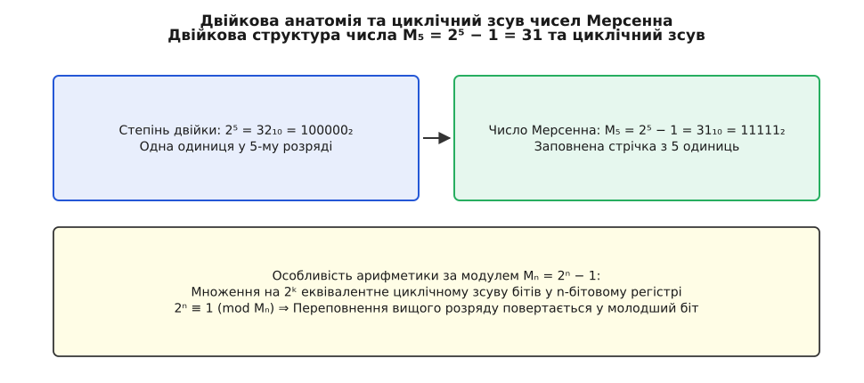
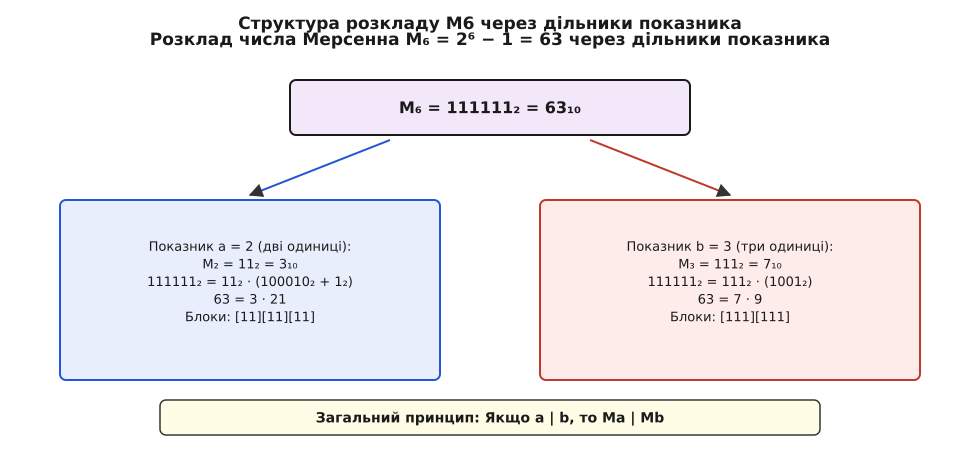
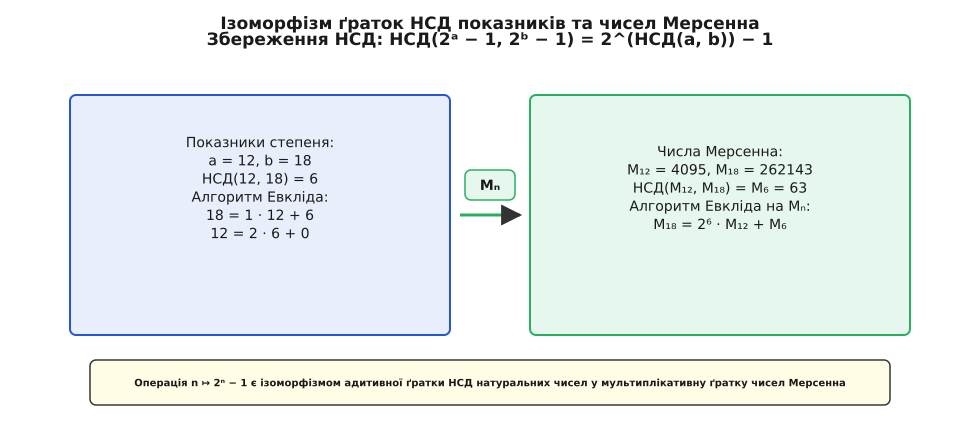
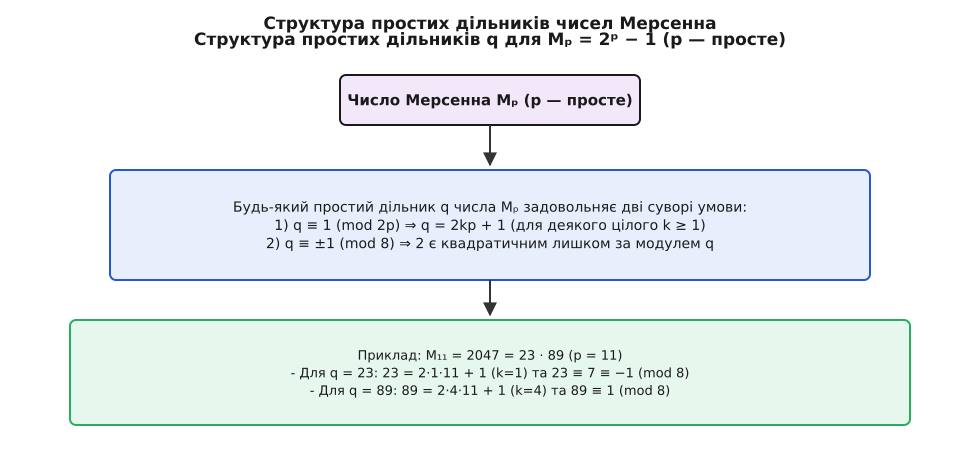

# Числа Мерсенна

<preknowlist>
- [Прості числа](topic:math-number-theory/prime-numbers) — цілі числа, що мають рівно два різних натуральних дільники.
- [Конгруенції за модулем](topic:math-number-theory/modular-arithmetic) — поняття порівняння a ≡ b (mod m) та операції в кільці лишків.
- [Позиційні системи](topic:math-number-theory/positional-systems) — двійковий запис числа як сума степенів двійки.
- [НСД та алгоритм Евкліда](topic:math-number-theory/gcd-euclidean) — найбільший спільний дільник двох чисел і його знаходження діленням з остачею.
- [Основна теорема арифметики](topic:math-number-theory/fundamental-theorem-arithmetic) — єдиність розкладу натурального числа на прості множники.
</preknowlist>

Якщо піднести двійку до довільного цілого степеня `n` і відняти одиницю, отримаємо число `M♞ = 2ⁿ − 1`. На перший погляд, це найпростіша арифметична маніпуляція — звичайне зсунення єдиного одиничного біта в порожнечу нижчих розрядів. Проте це зсунення створює суцільну маску з `n` двійкових одиниць, яка перетворює алгебру числа `2ⁿ − 1` на унікальне дзеркало для всієї теорії чисел.

Числа вигляду `2ⁿ − 1` називаються **числами Мерсенна** на честь французького математика XVII століття Марена Мерсенна. Їхня будова поєднує в собі геометричну простоту позиційного двійкового кодування з глибокими алгебраїчними законами подільності. Подільність показників степеня прямо переноситься на подільність самих чисел, найбільший спільний дільник показників ізоморфно віддзеркалюється в НСД чисел Мерсенна, а приведення за модулем `2ⁿ − 1` у сучасних комп'ютерах замінює дороге цілочисельне ділення на швидкий циклічний зсув бітів.

## Двійкова анатомія, репунітна структура та кільцева арифметика

Математичне означення числа Мерсенна описується тотожністю:

```
M♞ = 2ⁿ − 1
```

Послідовність цих чисел для перших кількох натуральних показників `n = 1, 2, 3, 4, 5, 6, 7, 8, 9, 10, 11, 12` утворює ланцюг:

```
M₁  = 2¹ − 1 = 1
M₂  = 2² − 1 = 3
M₃  = 2³ − 1 = 7
M₄  = 2⁴ − 1 = 15
M₅  = 2⁵ − 1 = 31
M₆  = 2⁶ − 1 = 63
M₇  = 2⁷ − 1 = 127
M₈  = 2⁸ − 1 = 255
M₉  = 2⁹ − 1 = 511
M₁₀ = 2¹⁰ − 1 = 1023
M₁₁ = 2¹¹ − 1 = 2047
M₁₂ = 2¹² − 1 = 4095
```

Найголовніша властивість чисел Мерсенна розкривається при їхньому запису в двійковій системі числення. Степінь двійки `2ⁿ` у позиційній двійковій системі з основою 2 записується як одиниця, за якою слідують `n` нулів. Наприклад, `2⁴ = 16₁₀ = 10000₂`, `2⁸ = 256₁₀ = 100000000₂`, `2¹² = 4096₁₀ = 1000000000000₂`.

Віднімання одиниці від числа `2ⁿ` викликає ланцюговий перенос (позичення) крізь усі `n` позиційних розрядів. Оскільки `2ⁿ = 100…0₂`, після віднімання одиниці єдиний старший одиничний біт обнуляється, а всі `n` молодших розрядів перетворюються на суцільну маску з `n` одиниць без жодного нуля:

```
2⁴ = 10000₂
2⁴ − 1 = 1111₂ = 15₁₀

2⁸ = 100000000₂
2⁸ − 1 = 11111111₂ = 255₁₀

2¹² = 1000000000000₂
2¹² − 1 = 111111111111₂ = 4095₁₀
```

У теорії чисел об'єкти, позиційний запис яких складається виключно з однаково повторюваної цифри (в даному випадку з одиниці), називаються **репунітами** (від англійського *repeated unit*). Числа Мерсенна `M♞` є двійковими репунітами. З точки зору алгебри суми скінченної геометричної прогресії зі знаменником `q = 2` та першим членом `b₁ = 1`, ця маска виражається тотожністю:

```
2ⁿ − 1 = 1 · 2ⁿ⁻¹ + 1 · 2ⁿ⁻² + … + 1 · 2¹ + 1 · 2⁰ = ∑ₖ₌₀ⁿ⁻¹ 2ᵏ
```

Ця двійкова суцільність створює особливу алгебраїчну структуру в кільці лишків за модулем `M♞`. Оскільки `2ⁿ = M♞ + 1`, у конгруенціях за модулем `M♞` виконується фундаментальне порівняння:

```
2ⁿ ≡ 1 (mod M♞)
```

Це означає, що піднесення двійки до `n`-го степеня є тотожно рівносильним множенню на 1 за модулем `M♞`. У комп'ютерній регістровій пам'яті множення довільного числа на `2ᵏ` за модулем `2ⁿ − 1` перетворюється на звичайний циклічний зсув `n`-бітового слова ліворуч, де старші біти, які виходять за межі `n`-го розряду, закольцовуються і повертаються в наймолодші розряди числа.

Для кращого огляду зведемо перші 12 чисел Мерсенна, їхній двійковий запис, просту чи складену природу та повний розклад на прості множники в єдину таблицю:

| `n` | `M♞ = 2ⁿ − 1` | Двійковий запис | Статус | Розклад на прості множники |
| :--- | :--- | :--- | :--- | :--- |
| **1** | `1` | `1₂` | Ні просте, ні складене | — |
| **2** | `3` | `11₂` | **Просте** | `3` |
| **3** | `7` | `111₂` | **Просте** | `7` |
| **4** | `15` | `1111₂` | Складене | `3 · 5` |
| **5** | `31` | `11111₂` | **Просте** | `31` |
| **6** | `63` | `111111₂` | Складене | `3² · 7 = 9 · 7` |
| **7** | `127` | `1111111₂` | **Просте** | `127` |
| **8** | `255` | `11111111₂` | Складене | `3 · 5 · 17 = 15 · 17` |
| **9** | `511` | `111111111₂` | Складене | `7 · 73` |
| **10** | `1023` | `1111111111₂` | Складене | `3 · 11 · 31 = 33 · 31` |
| **11** | `2047` | `11111111111₂` | Складене | `23 · 89` |
| **12** | `4095` | `111111111111₂` | Складене | `3² · 5 · 7 · 13 = 63 · 65` |


*Двійкова анатомія та циклічний зсув чисел Мерсенна при модульному зведенні за M_n.*

Історичний процес систематичного дослідження цих чисел — від перших евристичних здогадів античності до праць паризького чернця Марена Мерсенна 1644 року та сучасного обчислювального пошуку на суперкомп'ютерах — детально висвітлено у вставці [📜 Марен Мерсенн та історія списку 1644 року](topic:math-number-theory/mersenne-numbers/hist-mersenne-monk.md).

## Подільність показників та поліноміальний розклад

Центральною теоретико-числовою властивістю послідовності чисел Мерсенна є точна відповідність між алгебраїчною подільністю показників степеня та подільністю самих чисел.

### Теорема про подільність показників

Якщо натуральне число `a` ділить натуральне число `b` без остачі (`a | b`), то число Мерсенна `M␁ = 2ᵃ − 1` ділить число Мерсенна `M_b = 2ᵇ − 1` без остачі (`M␁ | M_b`).

### Алгебраїчне доведення

Нехай `b = a · k` для деякого цілого коефіцієнта `k ≥ 1`. Скористаємося класичною алгебраїчною тотожністю розкладу різниці `k`-их степеней `x𐞥 − 1` на множники:

```
x𐞥 − 1 = (x − 1) · (x𐞥⁻¹ + x𐞥⁻² + … + x + 1)
```

Підставимо у цю тотожність змінну `x = 2ᵃ`. Оскільки `x𐞥 = (2ᵃ)𐞥 = 2ᵃᵏ = 2ᵇ` та `x − 1 = 2ᵃ − 1`, ми отримуємо точний розклад числа Мерсенна `2ᵇ − 1`:

```
2ᵇ − 1
= (2ᵃ − 1) · ((2ᵃ)𐞥⁻¹ + (2ᵃ)𐞥⁻² + … + 2ᵃ + 1)   [підстановка x = 2ᵃ у розклад різниці степеней]
= (2ᵃ − 1) · (2ᵃ⁽ᵏ⁻¹⁾ + 2ᵃ⁽ᵏ⁻²⁾ + … + 2ᵃ + 1)    [спрощення показників степеня]
```

Проаналізуємо другий множник у цій формулі. Він являє собою суму цілих степеней двійки:

```
S = 2ᵃ⁽ᵏ⁻¹⁾ + 2ᵃ⁽ᵏ⁻²⁾ + … + 2ᵃ + 1
```

Оскільки `a ≥ 1` та `k ≥ 1`, кожна додама величина є цілим натуральним числом, а отже й сума `S` є цілим натуральним числом. Отже, число `2ᵇ − 1` розкладається у добуток цілого числа `2ᵃ − 1` на ціле число `S`. Це доводить, що `2ᵃ − 1` є дільником `2ᵇ − 1` без остачі.

### Розклад через кругові поліноми (Cyclotomic Polynomials)

Глибший погляд на структуру дільників числа Мерсенна дає розклад за допомогою кругових поліномів Ейлера `Φ_d(x)`. У загальній алгебрі для будь-якого натурального `n` виконується тотожність:

```
xⁿ − 1 = ∏_d|n Φ_d(x)
```

де добуток береться за всіма дільниками `d` числа `n`. Підставивши `x = 2`, отримуємо канонічний алгебраїчний розклад числа Мерсенна `M♞`:

```
2ⁿ − 1 = ∏_d|n Φ_d(2)
```

Кожен множник `Φ_d(2)` несе у собі алгебраїчний внесок дільника `d`. Наприклад:
- `Φ₁(2) = 2 − 1 = 1`
- `Φ₂(2) = 2 + 1 = 3`
- `Φ₃(2) = 2² + 2 + 1 = 7`
- `Φ₄(2) = 2² + 1 = 5`
- `Φ₆(2) = 2² − 2 + 1 = 3`
- `Φ₈(2) = 2⁴ + 1 = 17`
- `Φ₁₂(2) = 2⁴ − 2² + 1 = 13`

Тоді для `n = 12` розклад за круговими поліномами приймає вигляд:

```
M₁₂ = 2¹² − 1 = Φ₁(2) · Φ₂(2) · Φ₃(2) · Φ₄(2) · Φ₆(2) · Φ₁₂(2)
4095 = 1 · 3 · 7 · 5 · 3 · 13 = 3² · 5 · 7 · 13
```

### Двійкова геометрія блочного розкладу

Наочно цей алгебраїчний розклад виражається у двійковій формі запису. Якщо показник `b` складається з `k` однакових блоків довжиною `a` бітів (`b = a · k`), то двійкова стрічка з `b` одиниць розбивається на `k` однакових повторюваних періодів, кожен з яких утворений числом `2ᵃ − 1`.

Проілюструємо цей механізм на кількох конкретних обчислювальних прикладах.

#### Приклад 1: Показник b = 6

Число `b = 6` має натуральні дільники `a = 2` та `a = 3`. Порахуємо відповідні числа Мерсенна:

```
M₂ = 2² − 1 = 3
M₃ = 2³ − 1 = 7
M₆ = 2⁶ − 1 = 63
```

Застосуємо формулу розкладу для `a = 2` (`k = 3`):

```
63 = 2⁶ − 1
= (2² − 1) · (2²·² + 2²·¹ + 1)                  [розклад за тотожністю для a = 2, k = 3]
= 3 · (2⁴ + 2² + 1)                              [обчислення 2² − 1 = 3 та показників 4, 2]
= 3 · (16 + 4 + 1)                               [піднесення двійки до степенів]
= 3 · 21                                         [додавання доданків у дужках]
```

У двійковій системі числення цей розклад відповідає розбиттю шести одиниць на три блоки по дві одиниці:

```
63₁₀ = 111111₂ = 11₂ · 100010₂ + 11₂ = 11₂ · 10101₂ = 3₁₀ · 21₁₀
```

Тепер застосуємо формулу для дільника `a = 3` (`k = 2`):

```
63 = 2⁶ − 1
= (2³ − 1) · (2³·¹ + 1)                          [розклад за тотожністю для a = 3, k = 2]
= 7 · (8 + 1)                                    [обчислення 2³ − 1 = 7 та 2³ = 8]
= 7 · 9                                          [додавання в дужках]
```

У двійковій системі це відповідає розбиттю шести одиниць на два блоки по три одиниці:

```
63₁₀ = 111111₂ = 111₂ · 1000₂ + 111₂ = 111₂ · 1001₂ = 7₁₀ · 9₁₀
```


*Структурний розклад M6 на двійкові блоки по дві та три одиниці.*

#### Приклад 2: Показник b = 8

Число `b = 8` має дільники `a = 2` та `a = 4`. Обчислимо значення:

```
M₂ = 3
M₄ = 15
M₈ = 255
```

Застосуємо розклад для `a = 4` (`k = 2`):

```
255 = 2⁸ − 1 = (2⁴ − 1) · (2⁴ + 1) = 15 · 17
```

Двійковий запис демонструє розбиття восьми одиниць на два блоки по чотири одиниці: `11111111₂ = 1111₂ · 10001₂ = 15 · 17`.

#### Приклад 3: Показник b = 10

Для `b = 10` дільниками є `a = 2` та `a = 5`. Обчислимо значення:

```
M₂ = 3
M₅ = 31
M₁₀ = 1023
```

Розклад для `a = 5` (`k = 2`) дає:

```
1023 = 2¹⁰ − 1 = (2⁵ − 1) · (2⁵ + 1) = 31 · 33
```

У двійковому записі це розбиття десяти одиниць на два блоки по п'ять одиниць: `1111111111₂ = 11111₂ · 100001₂ = 31 · 33`.

З усіх цих прикладів випливає фундаментальний арифметичний висновок: **будь-яка складеність показника `n` неодмінно породжує складене число Мерсенна `M♞`**.

> 🔧 **Навіщо це.**
> Властивість подільності `M␁ | M_b` є основою для побудови алгоритмів швидкої факторизації велетенських чисел та створення контрольних сум. Вона дозволяє без виконання ділення наперед назвати повний список алгебраїчних дільників числа Мерсенна.

## Алгоритм Евкліда на показниках та ізоморфізм ґраток НСД

Властивість подільності показників поглиблюється до фундаментальної теореми про збереження найбільшого спільного дільника під час переходу від показників до чисел Мерсенна.

### Теорема про НСД чисел Мерсенна

Для будь-яких двох натуральних чисел `a` та `b` найбільший спільний дільник відповідних чисел Мерсенна дорівнює числу Мерсенна, показник якого є найбільшим спільним дільником `a` та `b`:

```
НСД(2ᵃ − 1, 2ᵇ − 1) = 2^(НСД(a, b)) − 1
```

### Механізм доведення через крок алгоритму Евкліда

Доведення цієї теореми спирається на паралелізм ділення з остачею. Нехай при діленні показника `a` на `b` з остачею маємо `a = q · b + r`, де `0 ≤ r < b`.

Розкладемо вираз `2ᵃ − 1` через цю остачу:

```
2ᵃ − 1 = 2^(q·b + r) − 1 = 2ʳ · (2^(q·b) − 1) + (2ʳ − 1)
```

Оскільки `2^(q·b) − 1` ділиться на `2ᵇ − 1` без остачі (як ми довели в попередньому розділі), доданок `2ʳ · (2^(q·b) − 1)` є кратним числу `2ᵇ − 1`. Отже, точна остача від ділення числа `2ᵃ − 1` на `2ᵇ − 1` дорівнює саме `2ʳ − 1`.

За класичною властивістю алгоритму Евкліда:

```
НСД(2ᵃ − 1, 2ᵇ − 1) = НСД(2ᵇ − 1, 2ʳ − 1)
```

Це означає, що кожен крок алгоритму Евкліда для обчислення `НСД(a, b)` точнісінько віддзеркалюється в ланцюгу кроків алгоритму Евкліда для обчислення `НСД(2ᵃ − 1, 2ᵇ − 1)`. Коли на останньому кроці остача показників стає `rₖ = НСД(a, b)`, остача чисел Мерсенна стає `2^(rₖ) − 1 = 2^(НСД(a, b)) − 1`.

Проілюструємо цей паралелізм на кількох детальних обчислювальних прикладах.

#### Практичний приклад 1: a = 12, b = 18

Виконаємо алгоритм Евкліда для показників `12` та `18`:

```
18 = 1 · 12 + 6
12 = 2 · 6 + 0   ⇒   НСД(12, 18) = 6
```

Тепер обчислимо числа Мерсенна:

```
M₁₂ = 2¹² − 1 = 4095
M₁₈ = 2¹⁸ − 1 = 262143
M₆ = 2⁶ − 1 = 63
```

Застосуємо алгоритм Евкліда до чисел Мерсенна:

```
262143 = 64 · 4095 + 63
4095 = 65 · 63 + 0   ⇒   НСД(4095, 262143) = 63 = M₆
```

#### Практичний приклад 2: a = 15, b = 25

Виконаємо алгоритм Евкліда для показників `15` та `25`:

```
25 = 1 · 15 + 10
15 = 1 · 10 + 5
10 = 2 · 5 + 0   ⇒   НСД(15, 25) = 5
```

Обчислимо числа Мерсенна:

```
M₁₅ = 2¹⁵ − 1 = 32767
M₂₅ = 2²⁵ − 1 = 33554431
M₅ = 2⁵ − 1 = 31
```

Виконаємо ділення з остачею:

```
33554431 = 1024 · 32767 + 31
32767 = 1057 · 31 + 0   ⇒   НСД(32767, 33554431) = 31 = M₅
```

#### Практичний приклад 3: a = 14, b = 21

Виконаємо алгоритм Евкліда для показників `14` та `21`:

```
21 = 1 · 14 + 7
14 = 2 · 7 + 0   ⇒   НСД(14, 21) = 7
```

Обчислимо відповідні числа Мерсенна:

```
M₁₄ = 2¹⁴ − 1 = 16383
M₂₁ = 2²¹ − 1 = 2097151
M₇ = 2⁷ − 1 = 127
```

Виконаємо ділення з остачею:

```
2097151 = 128 · 16383 + 127
16383 = 129 · 127 + 0   ⇒   НСД(16383, 2097151) = 127 = M₇
```


*Ізоморфізм адитивної ґратки показників та мультиплікативної ґратки чисел Мерсенна.*

Повне строге алгебраїчне виведення цієї теореми, а також аналіз первинних простих дільників за теоремою Зігмонді (Zsigmondy's Theorem) наведено у вставці [🧮 Алгебраїчні властивості дільників та теореми про НСД чисел Мерсенна](topic:math-number-theory/mersenne-numbers/math-gcd-mersenne.md).

### Критерій взаємної простоти

З теореми про НСД випливає важливий наслідок:

```
НСД(2ᵃ − 1, 2ᵇ − 1) = 1   ⇔   НСД(a, b) = 1
```

Числа Мерсенна `M␁` та `M_b` є взаємно простими тоді й лише тоді, коли їхні показники `a` та `b` є взаємно простими натуральними числами.

## Прості дільники та структура їхньої форми q = 2kp + 1

Зв'язок між показником та дільниками дозволяє сформулювати умови простоти чисел Мерсенна та визначити жорстку арифметичну форму їхніх простих дільників.

### Необхідна умова простоти

Якщо число Мерсенна `M♞ = 2ⁿ − 1` є **простим**, то його показник `n` обов'язково є **простим числом**.

Це випливає з контрапозиції доведеної раніше теореми подільності: якби показник `n` був складеним (`n = a · b` із `a, b > 1`), то `M␁ = 2ᵃ − 1` було б власним дільником `M♞` (бо `1 < 2ᵃ − 1 < 2ⁿ − 1`), і число `M♞` було б складеним.

### Недостатність умови

Обернене твердження **не справджується**: якщо показник `p` є простим, число Мерсенна `Mₚ = 2ᵖ − 1` **не обов'язково** є простим.

Перші контрприклади показують, що серед простих показників `p` складені числа Мерсенна трапляються регулярно:

```
M₁₁ = 2¹¹ − 1 = 2047 = 23 · 89
M₂₃ = 2²³ − 1 = 8388607 = 47 · 178481
M₂₉ = 2²⁹ − 1 = 536870911 = 233 · 1104421
M₆₇ = 2⁶⁷ − 1 = 147573952589676412927 = 193707721 · 761838257287
```

### Теорема про арифметичну форму простих дільників

Якщо `p` — просте число, то будь-який простий дільник `q` числа `Mₚ = 2ᵖ − 1` обов'язково задовольняє дві суворі системи конгруенцій:

```
1) q ≡ 1 (mod 2p)   ⇒   q = 2k·p + 1   (для деякого цілого k ≥ 1)
2) q ≡ ±1 (mod 8)   ⇒   q ≡ 1 або q ≡ 7 (mod 8)
```

### Обґрунтування умов

1. **Перша умова (`q = 2kp + 1`):** Оскільки `q | (2ᵖ − 1)`, маємо `2ᵖ ≡ 1 (mod q)`. Мультиплікативний порядок числа 2 за модулем `q` дорівнює `p` (бо `p` просте). За Малою теоремою Ферма `2^(q−1) ≡ 1 (mod q)`, звідки порядок `p` ділить `q − 1`. Оскільки `q` непарне, `q − 1` ділиться на `2p`, тобто `q = 2kp + 1`.
2. **Друга умова (`q ≡ ±1 mod 8`):** З рівняння `2ᵖ ≡ 1 (mod q)` випливає, що `2^((q−1)/2) = 2^(kp) = (2ᵖ)ᵏ ≡ 1ᵏ ≡ 1 (mod q)`. За критерієм Ейлера це означає, що 2 є квадратичним лишком за модулем `q`. За квадратичним законом взаємності Гаусса 2 є квадратичним лишком за модулем `q` тоді й лише тоді, коли `q ≡ ±1 (mod 8)`.


*Затискання дільників чисел Мерсенна в арифметичну сітку q = 2kp + 1.*

Проілюструємо застосування цієї теореми на прикладах факторизації кількох чисел Мерсенна.

#### Аналіз M₁₁ = 2047 (p = 11)

Шукаємо дільники вигляду `q = 22k + 1`:
- `k = 1`: `q = 23`. Перевіряємо за модулем 8: `23 ≡ 7 ≡ −1 (mod 8)` — умова виконується! Перевіряємо ділення: `2047 / 23 = 89`. Число 89 також є простим!
- Перевіряємо `89`: `89 = 22 · 4 + 1` (`k = 4`) та `89 ≡ 1 (mod 8)` — обоє дільників `23` та `89` ідеально лягають у сітку теореми.

#### Аналіз M₂₃ = 8388607 (p = 23)

Шукаємо дільники вигляду `q = 46k + 1`:
- `k = 1`: `q = 47`. Перевіряємо за модулем 8: `47 ≡ 7 ≡ −1 (mod 8)` — умова виконується! Перевіряємо ділення: `8388607 / 47 = 178481`.
- Число `178481` також є простим: `178481 = 46 · 3880 + 1` (`k = 3880`) та `178481 ≡ 1 (mod 8)`.

#### Чому M₁₃ = 8191 є простим (p = 13)

Шукаємо дільники вигляду `q = 26k + 1` із `q ≡ ±1 (mod 8)` та `q ≤ √8191 ≈ 90.5`:
- `k = 1`: `q = 27` (не просте).
- `k = 2`: `q = 53`. Перевіряємо `mod 8`: `53 ≡ 5 (mod 8)` — відкинуто другим фільтром!
- `k = 3`: `q = 79`. Перевіряємо `mod 8`: `79 ≡ 7 (mod 8)`. Перевіряємо ділення: `8191 / 79 = 103.68…` (не ділиться без остачі).

Жоден кандидат у діапазоні до `√8191` не підійшов. Отже, число `M₁₃ = 8191` є **простим числом Мерсенна**!

Ці дві умови радикально скорочують перебір при перевірці чисел Мерсенна на наявність дільників. Замість перевірки всіх простих чисел перевіряються лише ті, що лежать на перетині прогресії `2kp + 1` та класів `1, 7 mod 8`.

## Модульна арифметика Мерсенна в процесорній архітектурі

Особливості чисел Мерсенна роблять їх фундаментальним інструментом у прикладній комп'ютерній алгебрі та розробці програмного забезпечення.

### Безділильне приведення за модулем Мерсенна

Стандартна операція знаходження остачі від ділення `%` на процесорах потребує інструкції ділення, яка виконується десятки тактів. Проте для модуля `M♞ = 2ⁿ − 1` приведення виконується через побітові операції.

Нехай `x` — 64-бітне ціле число, яке потрібно звести за модулем `M♞ = 2ⁿ − 1`. Розділимо біти числа `x` на два блоки: старші біти `A` (зсунуті на `n` позицій) та молодші `n` бітів `B`:

```
x = A · 2ⁿ + B
```

Оскільки `2ⁿ ≡ 1 (mod 2ⁿ − 1)`, маємо:

```
x ≡ A · 1 + B = A + B (mod 2ⁿ − 1)
```

Алгоритм обчислення на C/C++ зводиться до двох побітових маніпуляцій:

```
uint64_t high = x >> n;
uint64_t low = x & ((1ULL << n) - 1);
uint64_t result = high + low;
```

Якщо сума `high + low` все ще перевищує або дорівнює `2ⁿ − 1`, від неї віднімають `2ⁿ − 1` або повторюють згортання. Жодної інструкції ділення не використовується — лише зсув `>>`, побітове «І» `&` та додавання `+`.

### Застосування у генераторах та криптографії

1. **Генератори псевдовипадкових чисел:** Найвідоміший генератор Вихор Мерсенна (Mersenne Twister, MT19937) використовує як період число Мерсенна `M₁₉₉₃₇ = 2¹⁹⁹³⁷ − 1`. Це гарантує колосальну довжину періоду та високу якість статистичного розподілу.
2. **Перетворення у скінченних полях:** Дискретне перетворення Фур'є (FFT) у кільцях за модулем чисел Мерсенна дозволяє виконувати точне множення надвеликих чисел без втрати точності з плаваючою крапкою.

Практичні реалізації цих алгоритмів мовами C та C++ з використанням сучасних паттернів приведення типів та шаблонів детально розібрано у вставці [⚙️ Швидкі алгоритми арифметики за модулем Мерсенна та пробного ділення](topic:math-number-theory/mersenne-numbers/proj-mersenne-arithmetic.md).

## Теорема Ейлера-Евкліда та парні досконалі числа

Найвідомішим зв'язком чисел Мерсенна з класичною теорією чисел є зв'язок із досконалими числами — числами, які дорівнюють сумі своїх власних дільників (`σ(n) = 2n`).

### Формулювання теореми Ейлера-Евкліда

Парне натуральне число `E` є досконалим тоді й лише тоді, коли воно подається у вигляді:

```
E = 2ᵖ⁻¹ · (2ᵖ − 1) = 2ᵖ⁻¹ · Mₚ
```

де `Mₚ = 2ᵖ − 1` є **простим числом Мерсенна**.

### Двостороння структура зв'язку

- **Пряма частина (Евклід, IV ст. до н.е.):** Якщо `Mₚ = 2ᵖ − 1` є простим числом, то `E = 2ᵖ⁻¹ · Mₚ` є парним досконалим числом.
  *Доведення Евкліда:* Функція суми дільників `σ(n)` є мультиплікативною. Оскільки `2ᵖ⁻¹` та `Mₚ` взаємно прості, маємо:
  `σ(E) = σ(2ᵖ⁻¹) · σ(Mₚ) = (2ᵖ − 1) · (Mₚ + 1) = (2ᵖ − 1) · 2ᵖ = 2 · (2ᵖ⁻¹ · Mₚ) = 2E`.
  Отже, число `E` дійсно є досконалим!
- **Обернена частина (Ейлер, XVIII ст.):** Будь-яке **парне** досконале число неминуче має вигляд `2ᵖ⁻¹ · Mₚ`, де `Mₚ` — просте число Мерсенна.

Цей зв'язок є взаємно однозначним відповідництвом: кожному простому числу Мерсенна відповідає рівно одне парне досконале число, і навпаки. Питання про нескінченність кількості парних досконалих чисел еквівалентне питанню про нескінченність кількості простих чисел Мерсенна.

Детальніше концепцію рівноваги дільників та доведення теореми Ейлера-Евкліда висвітлено у статтях [Досконалі числа](topic:math-number-theory/perfect-numbers) та [Теорема Евкліда-Ейлера](topic:math-number-theory/perfect-numbers).

## Алгебраїчний та обчислювальний синтез

Числа Мерсенна `M♞ = 2ⁿ − 1` утворюють міст між позиційним двійковим кодуванням, абстрактною алгебраїчною теорією дільників та прикладною мікропроцесорною арифметикою. Їхній двійковий запис у вигляді суцільного масиву одиниць робить їх природними об'єктами для побітових регістрових зсувів, а структура розкладу показників `a | b ⇒ M␁ | M_b` показує, як лінійне ділення в показниках перетворюється на мультиплікативне ділення в самих числах.
