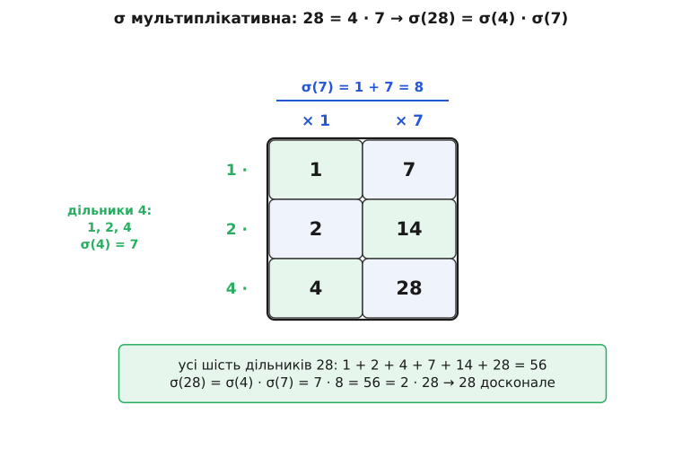
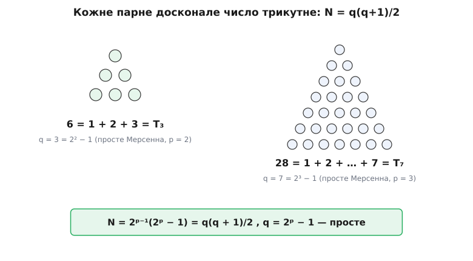

# 🧮 Теорема Евкліда–Ейлера: чому парні досконалі числа — це точно прості Мерсенна

Тут доведено — строго й в обидва боки — що парні досконалі числа не просто *бувають* вигляду `2ᵖ⁻¹·(2ᵖ − 1)` з простим `2ᵖ − 1`, а вичерпуються ним: кожне таке число досконале, і жодного іншого парного досконалого не існує. Обидві половини тримаються на одній властивості функції суми дільників σ — на тому, що вона розпадається на множники. Спершу здобудьмо цю властивість, а тоді вона сама віддасть нам теорему.

## Знаряддя: функція суми дільників

Позначмо `σ(n)` суму **всіх** натуральних дільників числа `n`, разом із `1` і самим `n`:

```
σ(6)  = 1 + 2 + 3 + 6           = 12
σ(7)  = 1 + 7                   = 8      (7 просте — лише два дільники)
σ(28) = 1 + 2 + 4 + 7 + 14 + 28 = 56
```

Мова досконалості перекладається цією функцією миттєво. [Досконале число](root:math-number-theory/perfect-numbers) дорівнює сумі своїх *власних* дільників — усіх, крім себе. Додаймо до обох боків рівності саме число: власні дільники разом із ним — це вже сума **всіх** дільників, тобто `σ`. Виходить коротко:

```
N досконале  ⇔  (сума власних дільників) = N  ⇔  σ(N) = 2N
```

Отже, вся теорема — це розв'язання одного рівняння `σ(N) = 2N`. Щоб його розв'язувати, треба вміти рахувати `σ`. Двох цеглинок стане на все подальше.

**Сума дільників степеня двійки** згортається в те саме число Мерсенна. Це геометрична сума, і перевіряється телескопом:

```
(2 − 1)·(1 + 2 + 4 + … + 2ᵃ) = (2 + 4 + … + 2ᵃ⁺¹) − (1 + 2 + … + 2ᵃ) = 2ᵃ⁺¹ − 1
```

Ліворуч множник `(2 − 1) = 1` нічого не змінює, тож сама сума дорівнює `2ᵃ⁺¹ − 1`:

```
σ(2ᵃ) = 1 + 2 + 4 + … + 2ᵃ = 2ᵃ⁺¹ − 1
```

(так само для будь-якого простого `p`: `σ(pᵃ) = (pᵃ⁺¹ − 1)/(p − 1)`).

**Сума дільників простого числа `q`:** у простого лише два дільники, тому `σ(q) = 1 + q`.

## Ключова лема: σ розпадається на взаємно прості множники

Ось стрижень усього. Стверджуємо:

> Якщо `a` і `b` взаємно прості (не мають спільного простого дільника), то `σ(a·b) = σ(a)·σ(b)`.

Чому так — видно з того, як улаштовані дільники добутку. За [однозначним розкладом на прості](root:math-number-theory/fundamental-theorem-arithmetic) числа `a` і `b` складені зі своїх простих; коли `a` і `b` взаємно прості, ці набори простих **не перетинаються**. Тому будь-який дільник `d` числа `ab` однозначно розпадається на дві частини: те, що зібране з простих числа `a` (позначмо `d₁`, воно ділить `a`), і те, що з простих числа `b` (`d₂`, ділить `b`). І навпаки: кожен добуток `d₁·d₂`, де `d₁` ділить `a`, а `d₂` ділить `b`, є дільником `ab`. Тобто маємо **взаємно однозначну відповідність** між дільниками `ab` і парами (дільник `a`, дільник `b`).

Тепер просто складемо всі дільники `ab`, згрупувавши їх у цю сітку пар:

```
σ(ab) = сума всіх d, що ділять ab
      = сума d₁·d₂ по всіх парах (d₁ ділить a, d₂ ділить b)
      = (сума всіх d₁) · (сума всіх d₂)
      = σ(a) · σ(b)
```

Передостанній крок — звичайне розкриття дужок: сума всіх попарних добутків `d₁·d₂` дорівнює добуткові «сума `d₁`» на «сума `d₂`». Точно як `(1 + 2 + 4)·(1 + 7)` розкривається в `1 + 7 + 2 + 14 + 4 + 28` — усі шість добутків.

Найкраще це видно на таблиці. Візьмімо `28 = 4·7`; множники взаємно прості (`4` — степінь двійки, `7` непарне):



*Дільники 28 — це рівно попарні добутки дільників 4 і дільників 7; тому їхня сума розкладається в σ(4)·σ(7). Рівність 56 = 2·28 і робить 28 досконалим.*

**Перевірка мультиплікативності на `28 = 4·7`:**

```
σ(4) = 1 + 2 + 4 = 7
σ(7) = 1 + 7     = 8
σ(4)·σ(7) = 56
σ(28) = 1 + 2 + 4 + 7 + 14 + 28 = 56       ✓ збігається
```

Одне застереження, без якого лема хибна: множники **мусять** бути взаємно прості. `σ(2·2) = σ(4) = 7`, а `σ(2)·σ(2) = 3·3 = 9` — не збігається, бо `2` і `2` мають спільний дільник. Саме тому в теоремі скрізь відокремлюють степінь двійки від непарної частини: вони взаємно прості за побудовою.

> 🔧 **Навіщо це.** Мультиплікативність перетворює `σ` з переліку на обчислення. Щоб знайти суму дільників великого `N`, не треба знаходити всі його дільники (їх можуть бути тисячі) — досить розкласти `N` на прості й перемножити `σ` кожного степеня. Уся теорема Евкліда–Ейлера — це двічі застосована ця одна лема: раз уперед, раз назад.

## Пряма половина (Евклід): просте Мерсенна дає досконале число

Нехай `q = 2ᵖ − 1` **просте**. Складімо число `N = 2ᵖ⁻¹·q` і покажімо, що воно досконале.

`q` непарне (на одиницю менше за парне `2ᵖ`), тож `2ᵖ⁻¹` і `q` взаємно прості — лема працює:

```
σ(N) = σ(2ᵖ⁻¹) · σ(q)
σ(2ᵖ⁻¹) = 2ᵖ − 1 = q          (сума дільників степеня двійки)
σ(q)     = 1 + q = 2ᵖ          (q просте)
σ(N) = q · 2ᵖ = (2ᵖ − 1)·2ᵖ = 2 · 2ᵖ⁻¹·(2ᵖ − 1) = 2N
```

`σ(N) = 2N` — число досконале. Це і є твердження Евкліда («Начала», книга IX, твердження 36, близько 300 р. до н. е.): він довів цю половину за дві тисячі років до того, як узагалі з'явилося поняття `σ`.

**Приклад `p = 5`:**

```
q = 2⁵ − 1 = 31   (просте)
N = 2⁴·31 = 496
σ(496) = σ(16)·σ(31) = 31·32 = 992 = 2·496      → досконале
```

І справді, `496 = 1 + 2 + 4 + 8 + 16 + 31 + 62 + 124 + 248` — сума власних дільників, як і належить.

## Обернена половина (Ейлер): іншого вигляду немає

Пряма половина каже «звідси — туди». Найважче й найкрасивіше — обернене: **будь-яке** парне досконале число мусить мати саме цей вигляд, третього не дано. Довів це Леонард Ейлер; його доведення побачило світ аж 1849 року, посмертно (Ейлер помер 1783-го).

Нехай `N` — парне досконале число. «Парне» означає, що на нього ділиться двійка; виберімо з нього **весь** степінь двійки, який там є:

```
N = 2ᵏ · m,     k ≥ 1,   m непарне
```

(`m` — те, що лишилося після винесення всіх двійок, тому воно непарне). Двійка й `m` взаємно прості, тож знову лема:

```
σ(N) = σ(2ᵏ)·σ(m) = (2ᵏ⁺¹ − 1)·σ(m)
```

А досконалість дає **друге** вираження того самого `σ(N)`:

```
σ(N) = 2N = 2·2ᵏ·m = 2ᵏ⁺¹·m
```

Прирівняймо їх. Позначмо `s = 2ᵏ⁺¹ − 1` (це число непарне, і `s ≥ 3`, бо `k ≥ 1`); тоді `2ᵏ⁺¹ = s + 1`, і рівність набуває вигляду:

```
s · σ(m) = (s + 1) · m
```

Тут — ключовий крок. `s` непарне, а `s + 1 = 2ᵏ⁺¹` — степінь двійки; спільного дільника в них нема. У рівності `s·σ(m) = 2ᵏ⁺¹·m` ліва частина ділиться на `s`, отже й права; але `2ᵏ⁺¹` на `s` не ділиться — тож ділитися на `s` мусить `m`. Запишімо `m = s·c` і підставмо:

```
s · σ(m) = 2ᵏ⁺¹ · s · c    ⟹    σ(m) = 2ᵏ⁺¹·c = (s + 1)·c = s·c + c = m + c
```

Дістали разюче тісне рівняння:

```
σ(m) = m + c,      де  c = m / s
```

Прочитаймо його повільно. `c = m/s` — це дільник числа `m`. Саме `m` — теж дільник `m`. А `s ≥ 3`, тому `c = m/s < m` — отже, `c` і `m` — це **два різні** дільники. Але `σ(m)` — сума **всіх** дільників `m`. Рівність `σ(m) = m + c` каже: сума всіх дільників дорівнює сумі лише оцих двох. Значить, інших дільників `m` не має зовсім — рівно два, `c` і `m`.

Одиниця ж ділить будь-яке число. Тож `1` — один із цих двох. А `m > 1` (адже `m = s·c ≥ 3`), тому `m ≠ 1`, і лишається:

```
c = 1     ⟹     m = s = 2ᵏ⁺¹ − 1,   а дільники m — тільки 1 та m
```

«Тільки `1` та `m`» означає, що `m` **просте**. Ми прийшли туди, куди хотіли: `m = 2ᵏ⁺¹ − 1` просте, а саме число

```
N = 2ᵏ · m = 2ᵏ·(2ᵏ⁺¹ − 1)
```

при `p = k + 1` набуває вигляду `N = 2ᵖ⁻¹·(2ᵖ − 1)` з простим `2ᵖ − 1`. Це і є форма Евкліда — іншої бути не може.

Помітьмо дрібницю, що замикає коло: щойно `2ᵖ − 1` просте, показник `p` теж змушений бути простим (складений показник неодмінно дав би складене `2ᵖ − 1`). Тобто `2ᵖ − 1` тут — справжнє **просте Мерсенна** з простим показником, а не абищо.

**Той самий доказ, прокручений на `496`:**

```
496 = 2⁴·31        →  k = 4,  m = 31,  s = 2⁵ − 1 = 31
рівняння:  σ(m) = m + m/s = 31 + 31/31 = 31 + 1 = 32
і справді  σ(31) = 32   →   c = 1,  31 просте   →   форма Евкліда з p = 5
```

Механізм не лишає `m` вибору: тільки-но `N` парне й досконале, `m` затиснуте в просте число вигляду `2ᵏ⁺¹ − 1`, а `N` — у форму Евкліда.

## Відповідність один-до-одного

Дві половини разом кажуть більше, ніж кожна окремо. Пряма будує з кожного простого Мерсенна `q = 2ᵖ − 1` досконале число `N = 2ᵖ⁻¹·q`. Обернена гарантує, що інших парних досконалих нема, і показує, як із `N` дістати назад показник: степінь двійки, що входить у `N`, — це `2ᵖ⁻¹`, звідси `p`, звідси `q = 2ᵖ − 1`. Ці дві дії взаємно обернені, тож між простими Мерсенна й парними досконалими числами — точна **бієкція**: скільки одних, стільки й других, і кожному відповідає рівно один партнер.

У цієї відповідності є ще й геометричне обличчя. Підставмо `2ᵖ = q + 1` у форму Евкліда:

```
N = 2ᵖ⁻¹·(2ᵖ − 1) = (q + 1)/2 · q = q(q + 1)/2
```

А `q(q + 1)/2` — це `q`-те **трикутне число**, сума `1 + 2 + … + q`. Отже, кожне парне досконале число трикутне: складається трикутником зі стороною, що дорівнює його простому Мерсенна.



*6 і 28 як трикутники зі сторонами 3 і 7 — своїми простими Мерсенна. Форма Евкліда 2ᵖ⁻¹(2ᵖ−1) — це те саме, що q(q+1)/2.*

Перші чотири партнери й перший «промах» показника:

```
p    2ᵖ − 1        просте?   N = 2ᵖ⁻¹(2ᵖ−1)     трикутне
2    3             так       6                  T₃
3    7             так       28                 T₇
5    31            так       496                T₃₁
7    127           так       8128               T₁₂₇
11   2047 = 23·89   ні        —                  —
```

Показник `11` простий, а `2ᵖ − 1` уже складене — і партнера-досконалого нема. Саме тому парних досконалих чисел так само мало, як простих Мерсенна: вони — одне й те саме, переодягнене. Знайти нове одне = знайти нове друге. А двохтисячолітня загадка про **непарні** досконалі числа — чи існує бодай одне — лишається за межами цієї теореми рівно тому, що Ейлерів доказ спирався на «парне» від першого кроку: на винесенні `2ᵏ`.
