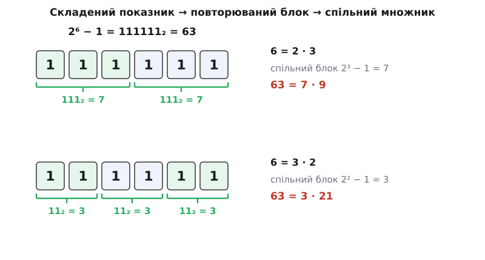
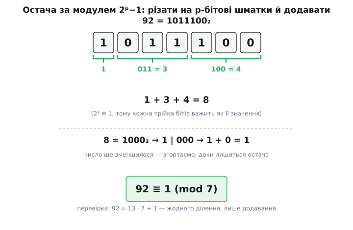
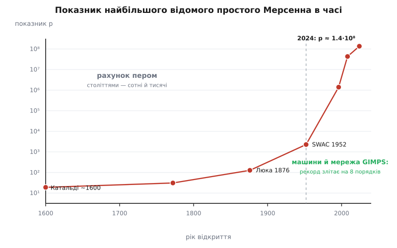

# Числа Мерсенна і прості Мерсенна

<preknowlist>
- [Прості числа](topic:math-number-theory/prime-numbers) — число, що ділиться лише на 1 і на себе; що таке розклад на прості множники.
- [Конгруенції за модулем](topic:math-number-theory/modular-arithmetic) — запис a ≡ b (mod m), ділення з остачею, дії із залишками.
- [Основна теорема арифметики](topic:math-number-theory/fundamental-theorem-arithmetic) — однозначний розклад на прості; звідси беруться дільники й їхня сума.
- [Позиційні системи](topic:math-number-theory/positional-systems) — двійковий запис числа як сума степенів двійки.
</preknowlist>

Якщо спитати, яке найбільше просте число люди знають на цю мить, відповідь щоразу має той самий дивний вигляд: одиниця, відібрана від степеня двійки. Найбільше відоме просте — це `2¹³⁶²⁷⁹⁸⁴¹ − 1`, число завдовжки понад сорок один мільйон десяткових цифр. Попереднє було таким самим на вигляд, і те, що перед ним, і майже кожен рекордсмен за останні півтора століття. Це не збіг і не мода. Число вигляду `2ᵖ − 1` несе в собі особливу внутрішню будову, і саме ця будова робить його водночас **рідкісно простим** і **дешевим для перевірки** — двома якостями, потрібними, щоб виграти перегони за найбільше просте. Розберімо цю будову до дна: звідки береться форма, чому показник мусить бути простим, як таке число пов'язане з ідеальними числами античності й чому саме його вміє перевірити комп'ютер там, де будь-яке інше число тієї ж величини безнадійне.

## Що це за число

**Числом Мерсенна** називають число вигляду

```
Mₙ = 2ⁿ − 1
```

(за іменем французького ченця-мінима Марена Мерсенна, 1588–1648, який у 1644 році склав список таких чисел, що претендують на простоту). Перші кілька:

```
M₁ = 1     M₂ = 3     M₃ = 7     M₄ = 15
M₅ = 31    M₆ = 63    M₇ = 127   M₈ = 255
```

Найпростіше побачити суть цих чисел у двійковому запису. Степінь двійки `2ⁿ` — це одиниця з `n` нулями: `2⁴ = 10000`. Відняти одиницю — і всі розряди «перекидаються» на одиниці:

```
2⁴ = 10000₂
2⁴ − 1 = 1111₂ = 15
```

Тобто `Mₙ` у двійковій системі — це суцільна стрічка з `n` одиниць. Це не декоративна деталь, а ключ: уся арифметика чисел Мерсенна — це арифметика такої стрічки одиниць, і саме з неї випливають і їхня рідкісна простота, і легкість перевірки.

Серед `Mₙ` нас цікавлять **прості числа Мерсенна** — ті `Mₙ`, що самі є простими: 3, 7, 31, 127… А `M₄ = 15 = 3·5` чи `M₆ = 63 = 7·9` — складені, вони випадають. Питання «коли `2ⁿ − 1` просте» і є серцевиною теми.

## Показник мусить бути простим

Перше, що впадає в око у списку: прості `Mₙ` трапляються тільки на простих `n`. `M₂, M₃, M₅, M₇` — прості; `M₄, M₆, M₈, M₉` — ні. Це не спостереження, а необхідність, і вона доводиться однією тотожністю.

Згадаймо шкільне розкладання `xᵇ − 1`. Різниця степенів завжди ділиться на різницю основ:

```
xᵇ − 1 = (x − 1)·(xᵇ⁻¹ + xᵇ⁻² + … + x + 1)
```

Це не магія — просто помножте дужку на `(x − 1)` й побачите, як усе всередині скорочується телескопом, лишаючи `xᵇ − 1`. Тепер підставмо `x = 2ᵃ`. Тоді `xᵇ = 2ᵃᵇ`, і тотожність каже:

```
2ᵃᵇ − 1 = (2ᵃ − 1)·(2ᵃ⁽ᵇ⁻¹⁾ + … + 2ᵃ + 1)
```

Прочитаймо це вголос. Якщо показник `n` **складений**, `n = a·b` з `a, b > 1`, то `2ⁿ − 1` розпадається на два множники, кожен більший за одиницю: перший — це `2ᵃ − 1`, другий — довга сума. Отже, складений показник неминуче дає складене число Мерсенна.

Обернімо це (логічно рівносильне твердження): **якщо `2ⁿ − 1` просте, то `n` просте**. Інакше `n` розклався б, і число розклалося б услід за ним.

У двійковому запису ця сама думка ще наочніша. Стрічка з `n = a·b` одиниць розбивається на `b` блоків по `a` одиниць, і кожен блок — це один і той самий множник `2ᵃ − 1`, зсунутий по розрядах:



*Складений показник розбиває двійкову стрічку одиниць на однакові блоки; кожен блок — спільний множник, тому число не може бути простим.*

**Розклад `2⁶ − 1` двома способами:**

```
6 = 2·3:
  63 = (2³ − 1)·(2³ + 1)       = 7 · 9
  63 = (2² − 1)·(2⁴ + 2² + 1)  = 3 · 21
```

Обидва розбиття показують `63` складеним — рівно тому, що `6` розкладається двома способами.

Спокуса тепер сказати: «отже, беремо просте `p` — і `2ᵖ − 1` просте». Ось тут криється головна пастка теми. **Обернене не діє.** Простий показник — умова необхідна, але не достатня. Найменший контрприклад:

```
2¹¹ − 1 = 2047 = 23 · 89
```

Показник `11` простий, а `2047` — ні. Тобто прості числа Мерсенна ховаються **лише** серед `2ᵖ − 1` з простим `p`, але навіть там вони рідкісні: більшість простих `p` дають складене `Mₚ`. Уся подальша робота — навчитися відрізняти ті `p`, що дають просте, від тих, що ні. Відтепер, кажучи про число Мерсенна як кандидата, ми завжди маємо на увазі `Mₚ = 2ᵖ − 1` із простим `p`.

## Міст до досконалих чисел

Перш ніж шукати знаряддя перевірки, варто зрозуміти, **навіщо** ці числа взагалі вивчали дві тисячі років — задовго до комп'ютерів і криптографії. Причина — [досконалі числа](topic:math-number-theory/perfect-numbers), число, що дорівнює сумі своїх власних дільників (усіх, крім себе): `6 = 1 + 2 + 3`, `28 = 1 + 2 + 4 + 7 + 14`. Греки бачили в них взірець гармонії й хотіли знати, звідки вони беруться.

Евклід у «Началах» (близько 300 р. до н. е.) помітив зв'язок: **якщо `2ᵖ − 1` просте, то число `2ᵖ⁻¹·(2ᵖ − 1)` — досконале.** Перевірмо на найближчому прикладі.

**Досконале число з `M₃`:**

```
p = 3:   M₃ = 2³ − 1 = 7   (просте)
N = 2²·7 = 28
власні дільники N: 1, 2, 4, 7, 14
сума               1 + 2 + 4 + 7 + 14 = 28 = N   → досконале
```

Чому це працює, видно з одного факту про суму всіх дільників. Позначмо `σ(N)` суму **всіх** дільників `N` (разом із самим `N`); тоді досконалість означає `σ(N) = 2N` (власні дільники дають `N`, плюс сам `N` — разом `2N`). Для `N = 2ᵖ⁻¹·q`, де `q = 2ᵖ − 1` просте:

```
σ(2ᵖ⁻¹) = 1 + 2 + 4 + … + 2ᵖ⁻¹ = 2ᵖ − 1 = q
σ(q)     = 1 + q = 2ᵖ                (бо q просте: лише 1 і q)
σ(N)     = σ(2ᵖ⁻¹)·σ(q) = q · 2ᵖ = (2ᵖ − 1)·2ᵖ = 2·N
```

(Множення сум дільників окремих множників дає суму дільників добутку, коли множники взаємно прості — це властивість однозначного розкладу.) Остання рівність `σ(N) = 2N` і є досконалість.

Через дві тисячі років Леонард Ейлер довів **обернене**: кожне парне досконале число має саме цей вигляд `2ᵖ⁻¹·(2ᵖ − 1)` з простим `2ᵖ − 1`. Разом ці дві половини — теорема Евкліда–Ейлера — встановлюють точну **відповідність один-до-одного**: парні досконалі числа — це рівно прості Мерсенна, переодягнені. Знайти нове просте Мерсенна = знайти нове парне досконале число. Повне доведення обох напрямків, з акуратним поводженням із `σ`, винесено окремо — [як саме прості Мерсенна вичерпують усі парні досконалі числа](topic:math-number-theory/mersenne-primes/math-euclid-euler.md).

Тут-таки причаїлася найстаріша нерозв'язана задача математики. Про **непарні** досконалі числа Ейлерова теорема не каже нічого: невідомо, чи існує бодай одне. Пошук триває понад дві тисячі років — жодного не знайдено, але й неможливості не доведено.

## Як розпізнати простоту: сита в самій структурі

Найгрубіший спосіб перевірити `Mₚ` на простоту — ділити на всі прості поспіль. Для великих `p` це безнадійно: у `M₈₉` двадцять сім цифр, кандидатів у дільники астрономічно багато. Але число Мерсенна не дає ділити себе абияк — його дільники зобов'язані мати особливу форму, і це різко звужує пошук.

Твердження таке: **якщо просте `q` ділить `Mₚ = 2ᵖ − 1` (з непарним простим `p`), то одразу**

```
q ≡ 1  (mod 2p)        і        q ≡ ±1  (mod 8)
```

Звідки береться перша умова, видно швидко. `q` ділить `2ᵖ − 1`, тобто `2ᵖ ≡ 1 (mod q)`. Найменший показник, при якому двійка дає одиницю за модулем `q` — її [мультиплікативний порядок](topic:math-number-theory/multiplicative-order), найменше `d > 0` з `2ᵈ ≡ 1 (mod q)` — мусить ділити `p`. А `p` просте, тож порядок дорівнює або `1`, або `p`. Порядок `1` означав би `2 ≡ 1 (mod q)`, тобто `q` ділить `1` — неможливо. Отже, порядок дорівнює `p`. За [малою теоремою Ферма](topic:math-number-theory/fermat-little-theorem) порядок ділить `q − 1`, тому `p` ділить `q − 1`; а `q − 1` парне — отже, ділиться і на `2p`. Друга умова, `q ≡ ±1 (mod 8)`, — це вже властивість двійки як [квадратичного лишку](topic:math-number-theory/quadratic-residues) і доводиться окремо. Обидві разом, з розбором квадратичного характеру двійки, — у [структурі дільників чисел Мерсенна](topic:math-number-theory/mersenne-primes/math-divisor-form.md).

Перевірмо форму на знайомому прикладі.

**Дільники `2¹¹ − 1 = 2047`:**

```
2047 = 23 · 89,   p = 11,   2p = 22
23 = 1·22 + 1   →  23 ≡ 1 (mod 22)   ✓      23 ≡ 7 (mod 8) = −1   ✓
89 = 4·22 + 1   →  89 ≡ 1 (mod 22)   ✓      89 ≡ 1 (mod 8)        ✓
```

Обидва множники сидять точно у формі `2p·k + 1`. Тепер сила методу. Щоб перевірити `Mₚ` пробним діленням, не треба перебирати всі прості — досить тих, що дають остачу `1` за модулем `2p` і `±1` за модулем `8`. Таких — крихітна частка. Саме так Ейлер у 1772 році **вручну** довів простоту `M₃₁ = 2 147 483 647`: обидві умови залишали настільки мало кандидатів, що всіх їх можна було відкинути пером.

> 🔧 **Навіщо це.** Форма дільника — це апаратне сито. Коли GIMPS (розподілений пошук простих Мерсенна) береться за новий показник, він спершу відсіює його дешевим пробним діленням саме по цих кандидатах `2p·k + 1` — і лише число, що пережило сито, віддає на дорогий остаточний тест. Одна тотожність про порядок двійки економить місяці машинного часу.

## Тест Люка–Лемера

Пробне ділення відповідає на питання «просте?» повільно й лише спростуванням: знайшов дільник — склад, не знайшов за розумний час — не знаєш. Для чисел Мерсенна існує щось незрівнянно сильніше — **детермінований** тест, що дає остаточну відповідь «так/ні», взагалі не шукаючи дільників. Це тест Люка–Лемера (Едуар Люка заклав його ідею 1876 року, довівши вручну простоту `M₁₂₇`; Деррик Лемер надав тесту сучасну строгу форму в 1930-х).

Тест будує одну послідовність за простим правилом «піднеси до квадрата й відніми два»:

```
S₀ = 4
Sₖ = Sₖ₋₁² − 2      (k ≥ 1)
```

Твердження: для непарного простого `p` число `Mₚ = 2ᵖ − 1` **просте тоді й лише тоді, коли** `Sₚ₋₂` ділиться на `Mₚ`. Причому всі обчислення ведуться **за модулем `Mₚ`** — інакше числа `Sₖ` вибухнули б у розмірі.

**Перевірка `M₅ = 31`:**

```
S₀ = 4
S₁ = 4² − 2   = 14
S₂ = 14² − 2  = 194 ≡ 8   (mod 31)     бо 194 = 6·31 + 8
S₃ = 8² − 2   = 62  ≡ 0   (mod 31)     бо 62 = 2·31
```

Треба дійти до `Sₚ₋₂ = S₃`, і він дорівнює нулю за модулем `31`. Отже, `M₅ = 31` — просте. Якби на кроці `p − 2` вийшло не нуль, число було б складеним — і тест сказав би це напевно, не пред'явивши жодного дільника. У цьому диво: тест **вирішує** простоту через просту рекурсію, тимчасом як загалом довести складеність, не знайшовши множника, неможливо.

Чому саме `S₀ = 4`, звідки `−2` і чому крок `p − 2` — це не випадкові числа: рекурсія приховано рахує степені в особливій алгебраїчній структурі (кільці, побудованому над `√3`), і рівність нулю точно відповідає тому, що ця структура «замикається» лише коли `Mₚ` просте. Повне доведення цієї відповідності виходить за межі нашої нитки; ми беремо тест як доведений результат — а його робочу реалізацію з великими числами й швидкою арифметикою розібрано в [тесті Люка–Лемера в коді](topic:math-number-theory/mersenne-primes/proj-lucas-lehmer.md).

## Чому саме числа Мерсенна тримають рекорд

Тест Люка–Лемера сам собою ще не пояснює, чому найбільші відомі прості — завжди мерсеннівські. Адже на кожному кроці треба піднести до квадрата число завбільшки з `Mₚ` — а для рекордного `p` це десятки мільйонів двійкових розрядів. Мільйони таких множень здавалися б безнадійними. Рятує друга особливість форми `2ᵖ − 1`, і вона знову випливає зі стрічки одиниць.

Взяти остачу за модулем звичайного числа — це ділення, дорога операція. Але за модулем `Mₚ = 2ᵖ − 1` ділення не потрібне зовсім. Річ у тім, що `2ᵖ ≡ 1 (mod Mₚ)` — прямо з означення. Отже, кожен розряд ваги `2ᵖ⁺ʲ` за модулем `Mₚ` важить стільки ж, скільки розряд ваги `2ʲ`. А це означає: щоб узяти велике число за модулем `Mₚ`, досить **порізати його двійковий запис на шматки по `p` бітів і додати їх**. Довжина одразу падає; повторити двічі-тричі — і лишається остача. Множення й додавання без жодного ділення.



*За модулем 2ᵖ−1 остача береться складанням p-бітових шматків: оскільки 2ᵖ важить як 1, згортання стрічки замінює ділення.*

**Згортання за модулем `7 = 2³ − 1`:**

```
92 = 1011100₂
різати на трійки бітів справа:   1 | 011 | 100
                                  1 +  3  +  4  = 8
8 = 1000₂ → знову:  1 | 000  →  1 + 0 = 1
92 ≡ 1  (mod 7)      перевірка: 92 = 13·7 + 1
```

Ось справжня причина монополії. Модульна арифметика — найдорожча частина будь-якого тесту простоти, а форма `2ᵖ − 1` робить її майже безкоштовною: замість ділення — зсуви й додавання. Помножити самі десятки-мільйонорозрядні числа теж уміють швидко — через перетворення, споріднене з Фур'є (те саме, що стоїть за швидким множенням великих чисел). Разом «швидке множення + майже безкоштовна остача» дають те, чого не має жодне інше число такого розміру: реальну можливість перевірити його простоту за осяжний час.

> 🔧 **Навіщо це.** Той самий трюк живе в криптографії. Поля для еліптичних кривих будують над простими, близькими до степеня двійки, — «псевдо-мерсеннівськими», бо остача за ними згортається так само дешево. Крива NIST P-521 працює прямо над справжнім простим Мерсенна `2⁵²¹ − 1`; Curve25519 — над `2²⁵⁵ − 19`. Швидкість підпису й обміну ключами тримається на тій самій рівності `2ᵖ ≡ 1`, що й пошук рекордних простих.

Скільки їх знайдено? На середину 2020-х відомо **52** прості Мерсенна. Знаходять їх нерівномірно, стрибками, і величина рекордсмена зростає майже вертикально відтоді, як за справу взялися машини:



*Показник найбільшого відомого простого Мерсенна в часі (шкала логарифмічна): епоха пера трималася на сотнях, перші комп'ютери й розподілена мережа підняли планку на вісім порядків.*

Кожен стрибок — це зміна знаряддя. Століттями показник рахували пером: Пʼєтро Катальді близько 1600 року підтвердив `M₁₇` і `M₁₉`, Ейлер у 1772-му — `M₃₁`, Люка 1876-го — `M₁₂₇` (цей рекорд простояв сімдесят п'ять років — найдовше з усіх, і донині це найбільше просте, доведене вручну). Протягом 1952 року машина SWAC знайшла одразу п'ять нових, від `M₅₂₁` до `M₂₂₈₁`, — перші два тієї ж ночі 30 січня, за пару годин один по одному, — і ера пера скінчилася. З 1996 року працює GIMPS: тисячі звичайних комп'ютерів, а віднедавна й хмарні відеокарти, ділять роботу через інтернет. Останнє, 52-ге, просте `2¹³⁶²⁷⁹⁸⁴¹ − 1` знайшла в жовтні 2024-го саме GPU-мережа. Уся ця історія — від грецьких досконалих чисел до хмарного суперкомп'ютера — розказана окремо: [полювання на прості Мерсенна](topic:math-number-theory/mersenne-primes/hist-mersenne-hunt.md).

Одне застереження про самі номери. Порядок «52-ге» частково умовний: строго підтверджено, що **перші 50** простих Мерсенна йдуть поспіль без пропусків (усі менші показники перевірено подвійним рахунком, приблизно до 81 мільйона). Два найбільші знайдені лежать вище цієї межі, тож між 50-м і ними теоретично може ховатися ще не розвіданий кандидат — доти їхні порядкові номери лишаються попередніми.

Скільки цифр у рекордсмені, легко оцінити. Число `Mₚ` має

```
цифр = ⌊p · log₁₀2⌋ + 1 ≈ 0.30103 · p
p = 136 279 841  →  ≈ 41 024 320 цифр
```

Понад сорок один мільйон десяткових знаків — якби друкувати по 3000 цифр на сторінку, вийшов би стос у понад тринадцять тисяч сторінок.

## Що лишається відкритим

Найпростіше на вигляд питання — **чи скінченна їх кількість** — досі без відповіді. Ніхто не знає, чи існує нескінченно багато простих Мерсенна, хоча евристичні міркування про щільність простих серед `2ᵖ − 1` підказують, що так, і навіть передбачають приблизний темп їхньої появи. Але передбачення — не доведення.

Через теорему Евкліда–Ейлера це питання зчеплене з іншим: нескінченно багато простих Мерсенна означало б нескінченно багато парних досконалих чисел. А поруч стоїть та сама двохтисячолітня загадка про **непарне** досконале число, якого ніхто не бачив і нікому не вдалося заборонити.

Так одна форма — одиниця, відібрана від степеня двійки — зшиває докупи античну гармонію досконалих чисел, ручні подвиги Ейлера й Люка, хмарні відеокарти сьогодення й невирішені питання про нескінченність. Стрічка одиниць у двійковому запису виявилася не курйозом, а найзручнішим у всій математиці місцем, де просте число завбільшки з невеликий роман можна не лише записати, а й довести.
