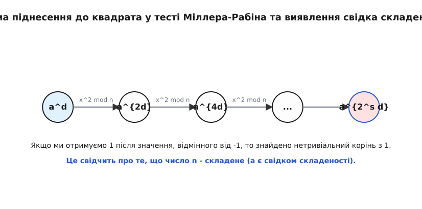

# Тест Міллера-Рабіна

<preknowlist>
- [Мала теорема Ферма](topic:math-number-theory/fermat-little-theorem) — основа ймовірнісних тестів простоти.
- [Модулярна арифметика](topic:math-number-theory/modular-arithmetic) — обчислення за модулем (mod n), остачі від ділення.
- [Швидке піднесення до степеня](topic:math-number-theory/modular-exponentiation) — як комп'ютер миттєво обчислює aᵈ mod n для величезних чисел.
</preknowlist>

> 🔧 **Навіщо це.**
> Пошук великих простих чисел є основою сучасної криптографії, зокрема алгоритму RSA та криптографії на еліптичних кривих. Щоб згенерувати безпечний ключ, нам потрібно щоразу знаходити випадкові прості числа завдовжки в сотні й тисячі десяткових цифр за лічені мілісекунди. Звичайний перебір дільників займе мільярди років навіть для найшвидших суперкомп'ютерів. Тому нам потрібен швидкий імовірнісний алгоритм, який здатний відрізнити просте число від складеного з гарантією, що наближається до абсолютних 100%. Тест Міллера-Рабіна — це індустріальний стандарт такого пошуку, який працює щоразу, коли ви відкриваєте безпечну вебсторінку в браузері.

## Проблема: як знайти голку в безмежному стозі сіна

Уявіть, що перед вами лежить число n завдовжки 300 десяткових цифр. Ваше завдання — дізнатися, просте воно чи складене. Просте число — це таке число, яке ділиться без остачі лише на 1 та на себе самого. Складене число утворюється множенням двох або більше менших натуральних чисел.

Найпростіший спосіб перевірити число на простоту — метод пробного ділення. Ми беремо наше число n і послідовно ділимо його на 2, 3, 5, 7 і так далі, аж до квадратного кореня з n. Якщо хоча б одне ділення відбувається без остачі — число складене. Якщо жодне не підійшло — просте. 

У чому проблема цього підходу? У масштабах. Квадратний корінь із 300-значного числа — це 150-значне число. Кількість операцій ділення, які нам доведеться виконати, настільки гігантська, що якби кожен атом у Всесвіті був суперкомп'ютером, що працює від Великого Вибуху і до сьогодні, вони б не встигли перевірити навіть одне таке число. Проте ваш смартфон генерує 300-значні прості числа за десяті частки секунди. Як це можливо?

Відповідь полягає у докорінній зміні парадигми. Замість того, щоб шукати дільники (що є надзвичайно важкою та повільною задачею), ми маємо знайти певну математичну властивість, яка притаманна всім простим числам, але якої не мають складені числа. Якщо ми перевіримо число на цю властивість, і воно її не матиме — ми точно знатимемо, що число складене, навіть не знаючи жодного його конкретного дільника.

## Ілюзія Малої теореми Ферма

Першою такою властивістю, яку люди спробували використати на практиці, була Мала теорема Ферма. П'єр де Ферма ще в 17 столітті довів надзвичайний факт: якщо p — просте число, а a — будь-яке ціле число, що не ділиться на p (тобто 1 ≤ a < p), то виконується рівність:

```text
aᵖ⁻¹ ≡ 1 (mod p)
```

Це означає, що якщо ми візьмемо будь-яке число a, піднесемо його до степеня p-1 і поділимо на p, остача від ділення гарантовано дорівнюватиме 1.

Це відкрило шлях до першого імовірнісного тесту на простоту (тесту Ферма). Нехай ми хочемо перевірити величезне число n. Ми беремо випадкове число a (наприклад, 2). Обчислюємо `2ⁿ⁻¹ (mod n)`. Завдяки алгоритму швидкого піднесення до степеня, комп'ютер робить це миттєво навіть для багатозначних чисел. 
- Якщо результат НЕ дорівнює 1, ми стовідсотково знаємо, що n — складене. Число a виступило як «свідок складеності».
- Якщо результат дорівнює 1, ми обережно кажемо: «Схоже, що n — просте». Адже всі прості числа дають 1, і лише дуже рідкісні складені числа випадково дають 1 для певної основи a.

Але тест Ферма має фатальну ваду. Існують так звані числа Кармайкла. Це складені числа, які вміло прикидаються простими. Для числа Кармайкла n рівність `aⁿ⁻¹ ≡ 1 (mod n)` виконується для ВСІХ основ a, які взаємно прості з n. 

Числа Кармайкла — це абсолютні математичні брехуни. Жодна кількість перевірок різними основами a в тесті Ферма не виведе їх на чисту воду, вони завжди повертатимуть 1 і обманюватимуть алгоритм. Щоб алгоритм був надійним для криптографії, нам потрібен інструмент, який зірве маску навіть із чисел Кармайкла. Цим інструментом і став тест Міллера-Рабіна, розроблений Гарі Міллером у 1976 році та перетворений на швидкий імовірнісний тест Міхаелем Рабіном у 1980 році.

## Квадратні корені з одиниці: пастка для брехунів

Гарі Міллер звернув увагу на ще одну фундаментальну властивість простих чисел. Давайте подивимося на квадратні корені з одиниці за модулем.

У звичайній арифметиці дійсних чисел рівняння x² = 1 має рівно два розв'язки: x = 1 та x = -1.
В арифметиці за модулем простого числа p рівняння `x² ≡ 1 (mod p)` також має рівно два розв'язки:
1. x ≡ 1 (mod p)
2. x ≡ -1 (mod p), що еквівалентно x ≡ p-1 (mod p)

Чому це так? Перенесемо одиницю вліво: 
```text
x² - 1 ≡ 0 (mod p)
```
Розкладемо на множники за формулою різниці квадратів: 
```text
(x - 1)(x + 1) ≡ 0 (mod p)
```
Оскільки p — просте число, то добуток двох чисел ділиться на p тоді й лише тоді, коли хоча б одне з них ділиться на p. Отже, або (x - 1) ділиться на p (тоді x ≡ 1), або (x + 1) ділиться на p (тоді x ≡ -1).

Але що відбувається, якщо модуль n — складене число? Наприклад, n = 15. Рівняння `x² ≡ 1 (mod 15)` має вже чотири розв'язки!
- 1² = 1 ≡ 1 (mod 15)
- (-1)² = 14² = 196 = 13 × 15 + 1 ≡ 1 (mod 15)
- 4² = 16 ≡ 1 (mod 15)
- 11² = 121 ≡ 1 (mod 15)

Тут 4 та 11 — це так звані нетривіальні квадратні корені з одиниці. Вони існують лише тому, що 15 складається з двох різних простих множників (3 і 5). Якщо під час обчислень за модулем n ми натрапимо на число x, яке не дорівнює 1 і не дорівнює n-1, але при цьому його квадрат x² ≡ 1 (mod n), ми отримуємо неспростовний доказ того, що n — складене. Таке x є залізобетонним «свідком складеності».

Саме цей факт — відсутність нетривіальних квадратних коренів з одиниці за простим модулем — дозволив Міллеру та Рабіну вдосконалити тест Ферма та остаточно перемогти числа Кармайкла.

## Анатомія показника степеня: виділяємо двійки

Як нам поєднати Малу теорему Ферма та перевірку на нетривіальні квадратні корені? Давайте уважно подивимося на показник степеня в теоремі Ферма: n-1. 

Оскільки ми тестуємо великі числа на простоту, число n гарантовано непарне (бо всі парні числа більші за 2 беззаперечно є складеними). Якщо n непарне, то n-1 — обов'язково парне число. А будь-яке парне число можна поділити на 2 хоча б один раз. Якщо результат знову парний, ми ділимо його на 2 ще раз, і так далі, поки нарешті не отримаємо непарне число.

Математично це записується так: ми подаємо n-1 у вигляді добутку `2ˢ · d`, де d — непарне число, а s — кількість двійок, які ми змогли виділити (тобто скільки разів ми поділили на 2).

Приклад: нехай n = 61. Тоді n-1 = 60.
- 60 = 2 × 30
- 30 = 2 × 15
- 15 — непарне.
Отже, 60 = 2² · 15. Тут s = 2, а d = 15.

Навіщо ми це робимо? Тому що вираз `aⁿ⁻¹` тепер можна записати як `a^(2ˢ · d)`. Це число можна отримати з `aᵈ` шляхом послідовного піднесення до квадрата s разів:

```text
Крок 0: aᵈ
Крок 1: (aᵈ)² = a²ᵈ
Крок 2: (a²ᵈ)² = a⁴ᵈ
...
Крок s: (a^(2ˢ⁻¹ · d))² = a^(2ˢ · d) = aⁿ⁻¹
```

Ми отримали цілу послідовність чисел:
`aᵈ, a²ᵈ, a⁴ᵈ, ..., aⁿ⁻¹` (усі обчислення виконуються за модулем n).

Згідно з Малою теоремою Ферма, якщо n просте, то останнє число в цій послідовності обов'язково має бути 1. Але алгоритм Міллера-Рабіна йде далі: давайте дивитися не лише на останнє число. Давайте подивимося на всю послідовність від самого початку.

## Механізм тесту Міллера-Рабіна

Припустимо, n справді є простим числом. Що ми маємо побачити в нашій послідовності квадратів?
Останнє число, `aⁿ⁻¹`, гарантовано дорівнює 1. Оскільки кожне наступне число в послідовності є квадратом попереднього, то передостаннє число — це квадратний корінь з 1. 

Ми вже з'ясували, що за простим модулем існують лише два можливі квадратні корені з одиниці: це 1 та -1 (в модулярній арифметиці -1 еквівалентне n-1).
Отже, передостаннє число мусить бути або 1, або n-1. 
- Якщо воно 1, то число перед ним теж мусить бути квадратним коренем з 1, тобто знову 1 або n-1.
- Якщо ми будемо йти з кінця послідовності до початку, ми будемо бачити самі одиниці, аж поки не натрапимо на перше число, яке не є одиницею. Оскільки його квадрат дав 1, це число зобов'язане бути n-1.

Звідси випливає фундаментальне правило тесту Міллера-Рабіна. Якщо n просте, то послідовність `aᵈ, a²ᵈ, ..., aⁿ⁻¹` може мати лише два допустимі вигляди:
- **Варіант 1**: Послідовність починається з 1 (`aᵈ ≡ 1`). Тоді й усі наступні квадрати будуть одиницями.
- **Варіант 2**: Десь у послідовності з'являється n-1 (тобто -1). Після цього всі наступні числа будуть одиницями, адже (-1)² = 1.

Якщо ж ми бачимо щось інше — число n беззаперечно складене.



Сформулюємо це як покроковий алгоритм для одного раунду з випадковою базою a:
1. Записуємо n-1 як `2ˢ · d`, де d непарне.
2. Обираємо випадкову базу a в діапазоні від 2 до n-2.
3. Обчислюємо x = aᵈ (mod n).
4. Якщо x ≡ 1 або x ≡ n-1, тест для цієї бази пройдено успішно. Число n може бути простим. Ми негайно зупиняємо цей раунд.
5. Якщо ні, ми починаємо послідовно підносити x до квадрата (виконуємо це s-1 разів):
   - `x ← x² (mod n)`
   - Якщо x ≡ n-1, ми побачили -1. Тест пройдено успішно, число може бути простим. Зупиняємо раунд.
   - Якщо x ≡ 1, ми знайшли нетривіальний корінь з одиниці! Адже попереднє значення x не було ані 1, ані n-1, а його квадрат несподівано дав 1. Це абсолютно неможливо для простих чисел. Число n — складене. Ми знайшли свідка складеності і можемо зупинити весь тест.
6. Якщо ми піднесли до квадрата s-1 разів і так і не побачили n-1, це означає, що передостаннє число не дорівнює -1. А отже, останнє число `aⁿ⁻¹` точно не дорівнюватиме 1 (бо ми не побачили ні 1 на початку, ні -1 в процесі). Мала теорема Ферма не виконалась. Число n — складене.

Якщо число n провалює цей тест, воно 100% складене, а число a називається «свідком складеності». 
Якщо число n проходить тест, ми обережно називаємо його «сильним псевдопростим за основою a», а саму базу a — «сильним свідком простоти» (strong witness). Чому «сильним псевдопростим»? Тому що число все ще може виявитися складеним брехуном, просто ця конкретна база a не змогла його викрити.

## Ймовірність помилки: сила багаторазових перевірок

Отже, один раунд тесту Міллера-Рабіна не дає абсолютної гарантії простоти. Складене число може випадково пройти перевірку для якоїсь конкретної бази a. Як нам отримати практичну впевненість? Завдяки статистиці та багатократному повторенню.

Міхаель Рабін довів вражаючу математичну теорему: для БУДЬ-ЯКОГО складеного непарного числа n (включно з підступними числами Кармайкла), щонайменше 75% усіх можливих баз a від 2 до n-2 є свідками складеності. Тобто, якщо n складене, і ми навмання обираємо базу a, імовірність того, що n зможе нас обдурити в одному раунді, становить щонайбільше 1/4 (або 25%). Насправді для переважної більшості складених чисел ця ймовірність набагато, набагато менша; 1/4 — це найгірший теоретичний випадок, виведена межа.

Що ми робимо далі? Ми повторюємо тест k разів, щоразу обираючи нову випадкову базу a. 
Оскільки кожна нова перевірка повністю незалежна від попередніх, ймовірність того, що складене число зможе обманювати нас k разів поспіль, дорівнює `(1/4)ᵏ`.

Давайте подивимося на ці цифри в реальності. 
- Якщо ми виконаємо 1 раунд (k=1), ймовірність помилки — не більше 25%.
- Якщо k=10, ймовірність помилки — `(1/4)¹⁰` ≈ 0.00000095 (приблизно одна на мільйон).
- Якщо k=40, ймовірність помилки — `(1/4)⁴⁰` ≈ 8.27 × 10⁻²⁵.

Щоб усвідомити масштаб числа 10⁻²⁵: імовірність того, що у вас влучить блискавка в той самий момент, коли на вас впаде метеорит, і ви одночасно виграєте в лотерею джекпот, незрівнянно вища, ніж імовірність того, що складене число випадково пройде 40 незалежних раундів тесту Міллера-Рабіна. В індустріальній криптографії зазвичай використовують від 40 до 64 раундів перевірки. Якщо число успішно пройшло стільки раундів, ми з абсолютною, непохитною інженерною впевненістю оголошуємо його простим. Так, математично абстрактна крихітна невизначеність залишається, але у фізичному світі ми скоріше зіткнемося зі збоєм процесора від космічної радіації, ніж з помилкою тесту Міллера-Рабіна після 40 раундів.

## Чому впали числа Кармайкла?

Тепер повернемося до нашого головного ворога — чисел Кармайкла. Чому звичайний тест Ферма пасував перед ними, а Міллер-Рабін їх легко та гарантовано розколює?

Числа Кармайкла — це специфічні складені числа (наприклад, 561, яке дорівнює 3 × 11 × 17), для яких умова `aⁿ⁻¹ ≡ 1 (mod n)` виконується для всіх баз a, взаємно простих із n. Вони обманювали тест Ферма, бо завжди покірно давали 1 у кінці обчислень.

Але давайте згадаємо, що тест Міллера-Рабіна дивиться не лише на кінцевий результат, а й на всю послідовність квадратів, починаючи з `aᵈ`. Оскільки числа Кармайкла є складеними і гарантовано містять принаймлі три різні прості множники, за модулем цих чисел існує безліч нетривіальних квадратних коренів з одиниці (чисел, які не дорівнюють ані 1, ані n-1, але в квадраті дають 1). 

Під час послідовного піднесення до квадрата в тесті Міллера-Рабіна, послідовність для числа Кармайкла неминуче натрапляє на один із цих численних нетривіальних квадратних коренів перш ніж дійти до фінальної одиниці. І як тільки алгоритм бачить нетривіальний корінь — він негайно б'є на сполох і розпізнає складене число. Властивість квадратних коренів стала тим рентгенівським променем, який просвічує числа Кармайкла наскрізь і руйнує їхнє маскування.

## Резюме: тріумф імовірності

Тест Міллера-Рабіна — це вершина ймовірнісних алгоритмів. Він базується на двох міцних математичних стовпах:
1. Мала теорема Ферма (`aⁿ⁻¹ ≡ 1 (mod n)` для простих чисел).
2. Відсутність нетривіальних квадратних коренів з одиниці за простим модулем.

Завдяки розкладанню показника степеня n-1 на добуток `2ˢ · d`, ми геніально розгортаємо процес модулярного піднесення до степеня у ланцюжок послідовних піднесень до квадрата. Уважний аналіз цього ланцюжка на наявність нетривіальних коренів або передчасної одиниці дозволяє безпомилково відрізнити справжні прості числа від найпідступніших складених брехунів. Завдяки високій імовірності відсіву в кожному окремому раунді (мінімум 75%), повторення тесту декілька десятків разів гарантує абсолютну, індустріальну надійність результату. Цей алгоритм є красивим доказом того, як поєднання глибокої теорії чисел із простою статистикою створює наріжний камінь безпеки всього сучасного цифрового світу.
