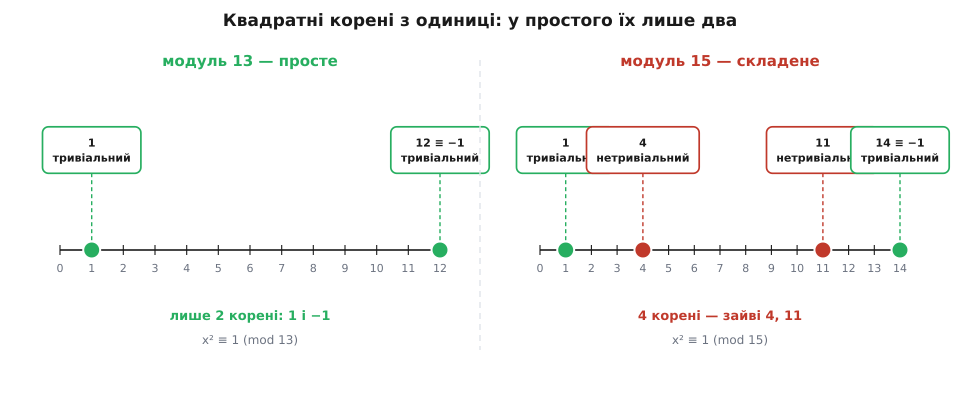
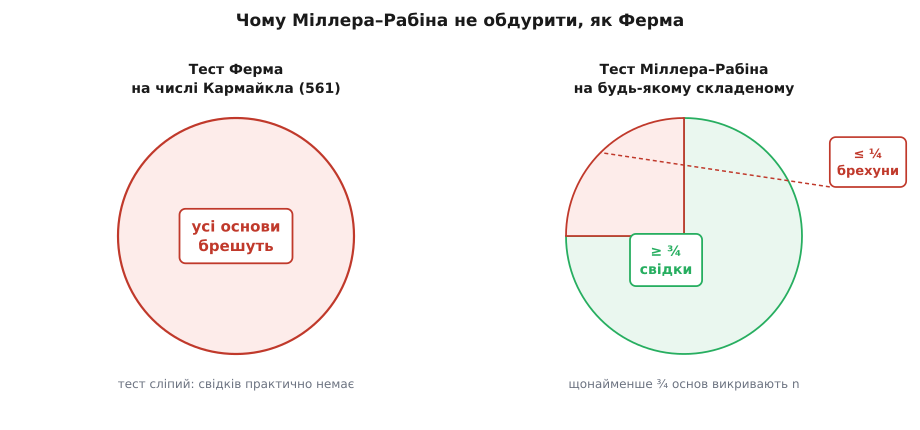

# Тест простоти Міллера–Рабіна

<preknowlist>
- [Модульна арифметика](root:math-number-theory/modular-arithmetic) — дії й рівності за модулем n, запис a ≡ b (mod n) та що він означає.
- [Мала теорема Ферма](root:math-number-theory/fermat-little-theorem) — для простого p і a, не кратного p: a^(p−1) ≡ 1 (mod p).
- [Піднесення до степеня за модулем](root:math-number-theory/modular-exponentiation) — швидке обчислення a^k mod n через послідовне піднесення до квадрату (близько log₂k множень замість k).
- [Прості числа](root:math-number-theory/prime-numbers) — що таке просте й складене число, розклад на прості множники.
</preknowlist>

Уся криптографія з відкритим ключем стоїть на великих простих числах. Щоб згенерувати ключ [RSA](root:sf-security/rsa), треба взяти два випадкові прості числа десь по 1024 біти кожне — це числа з понад трьомастами десятковими цифрами. І тут постає питання, яке на перший погляд здається безнадійним: як переконатися, що конкретне число на триста цифр — просте?

Найпряміший спосіб — ділити. Перебрати всі можливі дільники від 2 до √n і глянути, чи хоч один поділить n націло. Для маленьких чисел це працює. Але для числа завдовжки 2048 біт корінь має близько 1024 біти, тобто перебрати треба приблизно 2¹⁰²⁴ кандидатів. Це більше, ніж атомів у видимому Всесвіті; жоден комп'ютер не закінчить такий перебір за час існування зірок. Пробне ділення тут не просто повільне — воно неможливе в принципі.

А тим часом усередині кожного рукостискання TLS, кожної генерації ключа в OpenSSL чи GnuPG хтось за частку секунди відповідає на це саме питання — і відповідає надійно. Робить це тест Міллера–Рабіна. Його ідея в тому, щоб **жодного разу не ділити**: замість шукати дільники, він ставить числу таке запитання, на яке складене число майже завжди прохопиться й видасть себе, а просте — ніколи.

## Насіннєва ідея: свідок замість дільника

Відправна точка — [мала теорема Ферма](root:math-number-theory/fermat-little-theorem). Вона каже: якщо p просте, то для будь-якого a, не кратного p,

```
a^(p−1) ≡ 1  (mod p)
```

Прочитаймо це від протилежного. Якщо ми взяли якесь число n, підставили якесь a і виявили, що

```
a^(n−1) ≢ 1  (mod n),
```

то n **точно не просте** — бо для простого рівність зобов'язана виконуватися. І зверніть увагу, що ми довели складеність n, **не знайшовши жодного його дільника**. Ми не знаємо, на що n ділиться; ми лише знаємо, що ділиться на щось. Таке a, що викриває складеність, назвемо **свідком** (англ. *witness*).

Це вже майже готовий тест, і головне — він швидкий. Піднести a до степеня n−1 за модулем не означає перемножити a на себе n−1 разів. [Швидке піднесення до степеня](root:math-number-theory/modular-exponentiation) робить це приблизно за log₂(n−1) множень: підносимо до квадрата й принагідно домножуємо. Для 300-цифрового n це якась тисяча множень — мілісекунди. Одна така операція здатна довести складеність числа, перед яким пробне ділення безсиле.

Проблема в іншому боці. Що робити, коли a^(n−1) ≡ 1? Спокуса сказати «отже, n просте», але це неправда: рівність — необхідна умова простоти, а не достатня. Бувають складені n, для яких a^(n−1) ≡ 1. Тоді a нічого не викрило; таке a назвемо **обманним свідком**, або **брехуном** (англ. *liar*). Одне a, що промовчало, — ще не вирок: спробуймо інше.

## Чому самої теореми Ферма не досить

Природний план такий: перевірити не одне a, а кілька. Якщо серед них трапиться свідок — n складене; якщо всі промовчали — сподіваємося, що n просте. Це і є [тест простоти Ферма](root:math-number-theory/miller-rabin): проста ймовірнісна перевірка, побудована прямо на малій теоремі Ферма. І він майже завжди працює — але саме «майже» його й убиває.

Річ у тім, що існують складені числа, для яких брехуном виявляється **майже кожна** основа. Найгірші з них — [числа Кармайкла](root:math-number-theory/carmichael-numbers): це складені n, для яких a^(n−1) ≡ 1 (mod n) виконується для **всіх** a, взаємно простих із n. Для такого n тест Ферма сліпий: хоч яку основу візьми, вона промовчить — окрім тих рідкісних основ, що мають з n спільний дільник, а на них випадково натрапити практично неможливо (якби ми вміли їх знаходити, ми б уже мали дільник і задача була б розв'язана).

Найменше число Кармайкла — **561 = 3 · 11 · 17**. Воно складене, це видно неозброєним оком, але 2⁵⁶⁰ ≡ 1 (mod 561), і те саме для будь-якої іншої основи, взаємно простої з 561. Тест Ферма на ньому впевнено бреше «схоже, просте». І це не поодинокий виняток: чисел Кармайкла **нескінченно багато** — це довели 1994 року троє математиків, Алфорд, Ґренвілл і Померанс. Отже, тест Ферма можна обманювати як завгодно часто; як гарантія простоти він непридатний.

Корінь біди варто назвати чітко, бо саме його й полагодить наступний крок. Тест Ферма дивиться лише на **кінцеву точку** довгого обчислення — на значення a^(n−1) — і питає, чи дорівнює вона одиниці. А до цієї кінцевої точки веде дорога, і на цій дорозі просте число лишає куди більше слідів, ніж бачить тест Ферма. Треба навчитися їх читати.

## Тонша структура: корені з одиниці

Ось спостереження, на якому все тримається. Розгляньмо рівняння x² ≡ 1 (mod m) — «квадратні корені з одиниці за модулем m». Скільки в нього розв'язків?

Якщо модуль — **просте** число p, то рівно два: x ≡ 1 і x ≡ −1. Ось чому. Рівність x² ≡ 1 означає, що p ділить x² − 1 = (x − 1)(x + 1). Але просте число, коли ділить добуток, зобов'язане поділити хоч один зі множників — це визначальна властивість простого. Отже, p ділить x − 1 (тоді x ≡ 1) або p ділить x + 1 (тоді x ≡ −1). Інших коренів немає. За простим модулем одиниця має лише два «тривіальні» квадратні корені — саму одиницю й мінус одиницю.

За **складеним** модулем ця тіснота зникає. Візьмімо m = 15. Перевіримо:

```
1²  = 1   ≡ 1  (mod 15)
4²  = 16  ≡ 1  (mod 15)
11² = 121 ≡ 1  (mod 15)
14² = 196 ≡ 1  (mod 15)
```

Аж чотири корені з одиниці: 1, 4, 11, 14. Двійка «тривіальних» (1 і 14 ≡ −1) на місці, але з'явилися ще два — **4 і 11**. Це **нетривіальні квадратні корені з одиниці**, і саме їхнє існування кричить, що модуль складений: за простим модулем їх бути не могло.



*Ліворуч — за простим модулем 13 одиниця має рівно два квадратні корені, 1 і 12 ≡ −1. Праворуч — за складеним модулем 15 їх чотири; зайві 4 і 11 і є слідом складеності.*

> 🔧 **Навіщо це.** Нетривіальний корінь із одиниці не просто сигналить про складеність — він **розкладає число на множники**. Якщо x² ≡ 1, але x ≢ ±1, то n ділить (x−1)(x+1), не ділячи жодного зі множників окремо; отже, [найбільший спільний дільник](root:math-number-theory/gcd-euclidean) gcd(x − 1, n) — це нетривіальний дільник n. Для m = 15 і x = 4 маємо gcd(3, 15) = 3. Та сама тріщина, крізь яку факторизація атакує RSA, тут працює на нас: коли тест ловить складене число, він фактично тримає в руках його розклад.

## Як із цього зробити тест

Тепер поєднаймо дві властивості простого n: по-перше, a^(n−1) ≡ 1 (мала теорема Ферма); по-друге, єдині корені з одиниці — це ±1. Ідея — не дивитися лише на кінцеву точку a^(n−1), а **пройти до неї дорогою й простежити, як народжується та одиниця**.

Число n просте, а отже непарне (крім двійки, яку відсіюємо окремо), тож n − 1 парне. Виділимо з нього всі двійки:

```
n − 1 = 2ˢ · d,   де d непарне.
```

Це завжди можливо: ділимо n − 1 на 2, доки воно ділиться, полічивши кількість поділів s і лишивши непарний «хвіст» d. Тепер вибудуймо ланцюжок, у якому кожен наступний член — квадрат попереднього:

```
a^d,  a^(2d),  a^(4d),  …,  a^(2ˢ·d) = a^(n−1).
```

Останній член — це a^(n−1), і для простого n він дорівнює 1. Кожен член — квадрат попереднього. Тепер придивімося до того члена, **на якому одиниця з'являється вперше**. Його квадрат дорівнює 1, отже, сам він — квадратний корінь із одиниці. А для простого n корінь із одиниці буває лише ±1. Одиницею він бути не може (інакше вона з'явилася б раніше, а ми взяли перше входження). Значить, він дорівнює −1.

Звідси — сувора прикмета простого числа. Для простого n **обов'язково** справджується хоча б одне з двох:

```
a^d ≡ 1        (mod n),   або
a^(2ʳ·d) ≡ −1  (mod n)    для якогось r від 0 до s−1.
```

Просте число не може уникнути обох умов одразу: або ланцюжок уже стартує з одиниці, або десь по дорозі неодмінно проходить через −1, перш ніж лягти в одиницю. Це і є те, чого не бачив тест Ферма, — він дивився тільки на кінець ланцюжка, а тут ми стежимо за кожним його кроком.


*Драбина квадратів: у простого числа шлях до одиниці обов'язково лягає через −1; у складеного одиниця може «вистрибнути» з нетривіального кореня — і саме цей стрибок ловить тест.*

**Сам тест** — це заперечення цієї прикмети. Дано непарне n > 2 і основа a. Обчислюємо x = a^d mod n. Якщо x дорівнює 1 або n − 1 (тобто −1), основа промовчала: n пройшло цю перевірку. Інакше почергово підносимо x до квадрата, щонайбільше s − 1 разів; якщо на якомусь кроці x стане n − 1, основа теж промовчала. А якщо ми вичерпали всі піднесення до квадрата й **жодного разу не побачили −1**, — то не справдилася жодна з двох умов простоти, і n **точно складене**, а a — його свідок.

Число, що пройшло перевірку для основи a, називають **сильно ймовірно простим** до основи a; складене, що промовчало, — **сильним псевдопростим**, а таку основу — **сильним брехуном**. Слово «сильний» тут відрізняє цю перевірку від слабшого тесту Ферма: пройти її складеному числу значно важче.

Ось серце тесту в коді — перевірка однієї основи. Функція повертає `true`, якщо a свідчить про складеність n:

:::tabs
```py
def is_witness(a, d, s, n):
    x = pow(a, d, n)             # a^d mod n — швидке піднесення до степеня
    if x == 1 or x == n - 1:
        return False             # основа мовчить: n пройшло цю перевірку
    for _ in range(s - 1):
        x = x * x % n            # черговий квадрат у драбині
        if x == n - 1:
            return False         # дійшли до −1 — основа мовчить
    return True                  # −1 так і не трапилось — свідок складеності
```
```cpp
using u64  = uint64_t;
using u128 = __uint128_t;

u64 mulmod(u64 a, u64 b, u64 m) { return (u128)a * b % m; }   // без переповнення

u64 powmod(u64 a, u64 e, u64 m) {
    u64 r = 1 % m;  a %= m;
    while (e) { if (e & 1) r = mulmod(r, a, m); a = mulmod(a, a, m); e >>= 1; }
    return r;
}

// чи є a свідком складеності n, де n − 1 = 2^s · d, d непарне
bool is_witness(u64 a, u64 d, int s, u64 n) {
    u64 x = powmod(a, d, n);
    if (x == 1 || x == n - 1) return false;      // основа мовчить
    for (int r = 1; r < s; ++r) {
        x = mulmod(x, x, n);
        if (x == n - 1) return false;            // дійшли до −1 — мовчить
    }
    return true;                                  // −1 так і не з'явилось — свідок
}
```
:::

Повний тест обгортає цю перевірку: спершу відсіює очевидне (парність, ділення на кілька маленьких простих), потім розкладає n − 1 = 2ˢ · d, а далі проганяє `is_witness` на кількох основах — знайшовся свідок, значить складене; усі промовчали, значить майже напевно просте. Готовий до запуску код обох варіантів — детермінованого й імовірнісного — разом із безпечним для великих чисел множенням і оцінкою складності винесено в [окремий розбір із робочою програмою](root:math-number-theory/miller-rabin/proj-miller-rabin.md).

## Приклад: як 561 обманює Ферма, але не Міллера–Рабіна

Візьмімо горезвісне число Кармайкла 561 і основу a = 2. Спершу розкладаємо:

```
n − 1 = 560 = 2⁴ · 35,   отже  s = 4,  d = 35.
```

Обчислюємо a^d = 2³⁵ mod 561 (швидким піднесенням до степеня) і далі йдемо драбиною квадратів:

```
2³⁵            ≡ 263   (mod 561)   ← a^d,  це не 1 і не 560
263² = 69169   ≡ 166   (mod 561)   ← не 560, підносимо далі
166² = 27556   ≡  67   (mod 561)   ← не 560, підносимо далі
 67² =  4489   ≡   1   (mod 561)   ← з'явилася одиниця!
```

І ось воно. Одиниця вискочила з числа **67**, а 67 — це не 1 і не 560 (тобто не −1). Ми натрапили на нетривіальний квадратний корінь із одиниці: 67² ≡ 1, хоча 67 ≢ ±1. За тонкою прикметою простого числа такого бути не може — отже, 561 складене, а основа 2 є його свідком.

Порівняймо з тестом Ферма. Йому важлива лише кінцева точка драбини. Остання її сходинка вже дала 2²⁸⁰ ≡ 1 (це той самий рядок 67² ≡ 1), а 2⁵⁶⁰ — просто її квадрат:

```
2⁵⁶⁰ = (2²⁸⁰)² ≡ 1² ≡ 1   (mod 561)   ← Ферма каже: «схоже, просте»
```

Тест Ферма бачить одиницю на кінці драбини й задоволено мовчить. Тест Міллера–Рабіна дивиться на **передостанній щабель** — і ловить брехню. Ба більше, той самий нетривіальний корінь одразу дає розклад: gcd(67 − 1, 561) = gcd(66, 561) = 33, а 561 = 33 · 17.

Для контрасту прожену тест на справжньому простому — на n = 41 з основою a = 3:

```
n − 1 = 40 = 2³ · 5,   отже  s = 3,  d = 5.

3⁵ = 243   ≡ 38   (mod 41)   ← не 1 і не 40
38² = 1444 ≡  9   (mod 41)   ← не 40, підносимо далі
 9² =  81  ≡ 40   (mod 41)   ← це 40 = −1 !
```

Ланцюжок чесно проходить через −1 на другому щаблі — рівно так, як зобов'язане просте число. Основа 3 промовчала, і 41 пройшло перевірку.

## Чому це не можна обдурити, як Ферма

Фатальна вада тесту Ферма — числа Кармайкла, складені-хамелеони, для яких брехуном стає кожна основа. Ключова властивість тесту Міллера–Рабіна в тому, що **таких хамелеонів для нього не існує**. Умова про корені з одиниці настільки строга, що жодне складене число не здатне промовчати для всіх основ — і навіть для більшості.

Це формалізує теорема Моньє–Рабіна: для **будь-якого непарного складеного** n > 9 сильними брехунами є **щонайбільше чверть** основ у діапазоні від 1 до n − 1. Інакше кажучи, **щонайменше три чверті** основ — свідки. Немає аналога числа Кармайкла: будь-яке складене число викриває принаймні кожна друга-третя навмання взята основа. Строге доведення цієї межі — через розклад за китайською теоремою про остачі й підрахунок брехунів серед [взаємно простих із n](root:math-number-theory/euler-totient) основ — винесено в [окремий математичний розбір](root:math-number-theory/miller-rabin/math-liar-bound.md).



*Головна відмінність: складене-хамелеон Кармайкла обманює тест Ферма на кожній основі, тоді як тест Міллера–Рабіна будь-яке складене викриває щонайменше три чверті основ.*

З цієї чвертки й народжується практична надійність. Візьмімо k незалежних випадкових основ. Якщо n складене, то ймовірність, що **всі** k основ виявляться брехунами, не перевищує (¼)ᵏ = 4⁻ᵏ. Порахуймо, що це означає:

```
k = 10   →   4⁻¹⁰ ≈ 1 / 10⁶      (один шанс на мільйон)
k = 20   →   4⁻²⁰ ≈ 1 / 10¹²     (один на трильйон)
k = 40   →   4⁻⁴⁰ ≈ 1 / 10²⁴
```

Похибка при k = 40 менша, ніж імовірність того, що космічний промінь саме зараз переверне біт у вашій пам'яті й зіпсує відповідь надійніше за будь-яку математику. Причому 4⁻ᵏ — це песимістична оцінка найгіршого випадку; на реальних числах справжня похибка на багато порядків менша. Ось чому тест називають **імовірнісним**: він **ніколи не відкидає справжнє просте** (для простого свідків не буває взагалі), а помилитися може лише в один бік — визнати складене простим — і то з мізерною, керованою ймовірністю.

## Імовірнісний і детермінований варіанти

Тест використовують двома способами, і різниця між ними — це фактично різниця між внесками двох людей, чиї імена він носить (докладніше про народження методу — в [історичному нарисі](root:math-number-theory/miller-rabin/hist-miller-rabin.md)).

**Імовірнісний** (за Майклом Рабіном): беремо k випадкових основ, дістаємо похибку 4⁻ᵏ, і це працює для **будь-якого** n. Джерелом випадкових основ має бути [криптографічно надійний генератор](root:sf-security/csprng) — інакше передбачувані основи відкривають лазівку. Саме так бібліотеки перевіряють числа криптографічного розміру: 40 раундів, і кандидат вважається простим.

**Детермінований для обмежених n**: якщо n не перевищує певної відомої межі, то фіксований невеликий набір основ **гарантовано** дає точну відповідь без жодної похибки. Ці набори обчислені й перевірені:

```
n < 2 047                    →  досить основи {2}
n < 1 373 653                →  {2, 3}
n < 3 215 031 751            →  {2, 3, 5, 7}
n < 3.3 · 10²⁴               →  перші 13 простих {2, 3, …, 41}
будь-яке 64-бітове n         →  перші 12 простих {2, 3, …, 37}
```

Останній рядок особливо корисний: для будь-якого числа, що вміщається в 64-бітне слово, тест Міллера–Рабіна з дванадцятьма фіксованими основами — це **точний детермінований** тест простоти, без «імовірно». Нижня межа тут не випадкова: 2047 = 23 · 89 — це найменше складене число, що обманює основу 2, тому для менших чисел самої двійки й вистачає.

Є й суто теоретичний, найамбітніший варіант — **детермінований за Ґері Міллером**. Він показав 1976 року, що коли перебрати всі основи приблизно до 2·(ln n)², відповідь буде точною для **всіх** n, — а це вже поліноміальний час. Заковика в тому, що доведення спирається на узагальнену гіпотезу Рімана, яку досі не доведено; тому на практиці й користуються випадковими основами. (Безумовний детермінований поліноміальний тест з'явився пізніше — це алгоритм AKS 2002 року, — але він набагато повільніший, тож робочим конем криптографії лишається саме Міллер–Рабін.)

## Де це працює насправді

Кожен ключ RSA, DSA чи Діффі–Геллмана починається з пошуку великого простого числа, і виглядає цей пошук так. Беруть випадкове непарне число потрібної довжини з криптографічного генератора; швидко відкидають ті, що діляться на маленькі прості (дешеве решето прибирає більшість кандидатів за копійки); а вцілілих проганяють крізь Міллера–Рабіна з кількома десятками раундів. Перший кандидат, що вистояв, і йде в ключ — простий із запасом надійності, який годі перевершити.

Перехід від Ферма до Міллера–Рабіна — це перехід від одного запитання до тоншого. Тест Ферма питав лише: «чи дорівнює кінець драбини одиниці?» — і ціла родина складених чисел навчилася відповідати «так», брешучи. Тест Міллера–Рабіна питає гостріше: «а чи не пройшла ця драбина по дорозі через заборонений корінь із одиниці?» — і від цього запитання жодне складене число не сховається більше ніж від чверті основ. Ця зміна погляду — з єдиної рівності на структуру квадратних коренів — і перетворює непридатну евристику на тест, що стереже майже всю криптографію з відкритим ключем.
