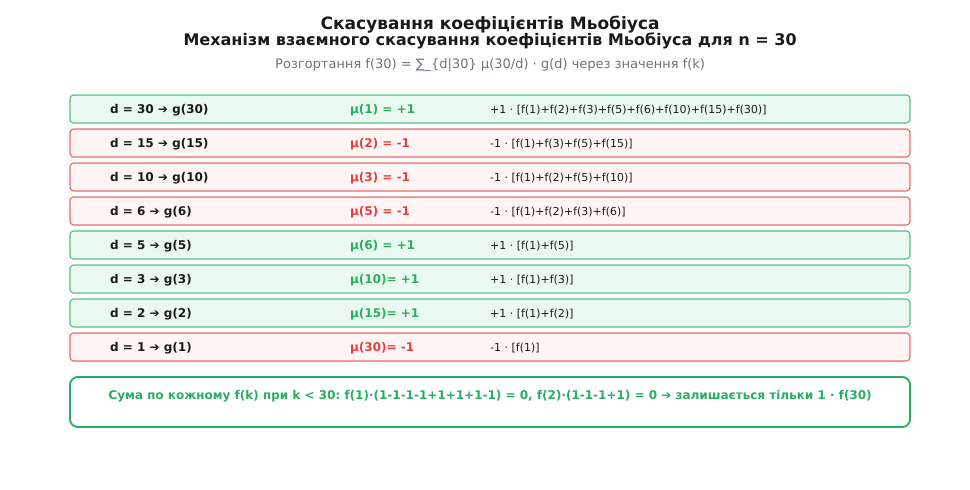
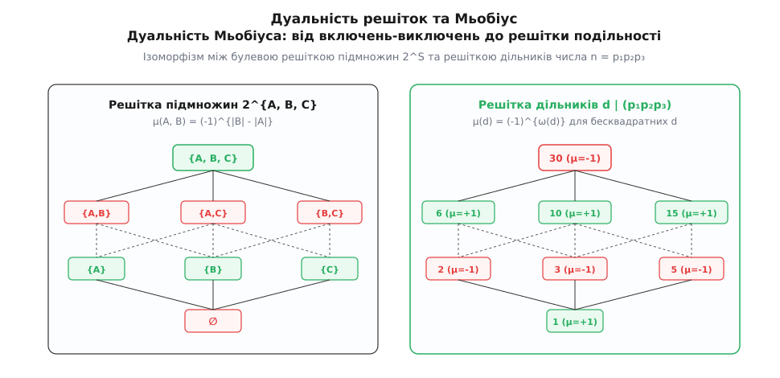
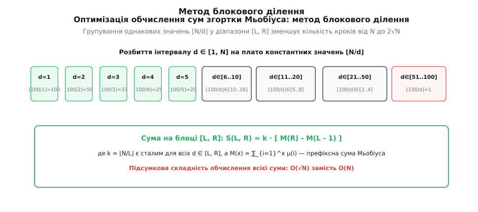

# Обернення Мьобіуса

<preknowlist>
- [Арифметичні функції](root:math-number-theory/arithmetic-functions) — мультиплікативність, згортка Діріхле та алгебра числових функцій.
- [Основна теорема арифметики](root:math-number-theory/fundamental-theorem-arithmetic) — канонічний розклад цілого числа на прості множники.
- [Функція Ейлера](root:math-number-theory/euler-totient) — кількість взаємно простих чисел та тотожність для суми по дільниках.
</preknowlist>

Якщо обчислити значення [функції Ейлера](root:math-number-theory/euler-totient) `φ(d)` для всіх шістьох дільників числа `12` та просумувати їх, виходить `φ(1) + φ(2) + φ(3) + φ(4) + φ(6) + φ(12) = 1 + 1 + 2 + 2 + 2 + 4 = 12`. Якщо взяти довільну мультиплікативну або адитивну числову функцію `f(n)` і побудувати нову функцію `g(n)` шляхом підсумовування значень `f(d)` по всіх дільниках `d`, що ділять `n`, ми отримуємо акумульовану суму `g(n) = ∑_{d|n} f(d)`. Проте в реальних математичних та обчислювальних задачах часто спостерігається зворотна ситуація: нам легше виміряти або обчислити сумарну функцію `g(n)`, тоді як вихідні значення `f(n)` лишаються захованими всередині цієї суми. Виникає фундаментальна алгебраїчна задача: якщо відомі значення акумульованої суми `g(n)` для кожного натурального числа, як розплутати цей вузол подільності й точно відновити значення початкової функції `f(n)`?

Розглянемо цю задачу на прикладі аналізу числових послідовностей у комбінаториці та теорії автоматизованих систем. Припустимо, що `g(n)` означає загальну кількість елементів певної складної системи, які володіють хоча б однією з інваріантних властивостей, пов'язаних із дільником `n`. У той же час функція `f(n)` вимірює кількість фундаментальних «примітивних» елементів, для яких `n` є точним та нерозкладним періодом. Оскільки кожен об'єкт із періодом `d` автоматично є об'єктом для будь-якого кратного періоду `n` (де `d` ділить `n`), підсумкова кількість об'єктів `g(n)` утворюється шляхом прямого додавання `f(d)` по всіх дільниках `d | n`.

Пряма спроба виразити `f(n)` через `g(n)` для перших кількох натуральних чисел розкриває чітку алгоритмічну структуру. Для `n = 1` сума містить лише один доданок `g(1) = f(1)`, тому `f(1) = g(1)`. Для `n = 2` дільниками є `1` та `2`, отже `g(2) = f(1) + f(2) = g(1) + f(2)`, звідки `f(2) = g(2) - g(1)`. Для `n = 3` аналогічно отримуємо `f(3) = g(3) - g(1)`. Для `n = 4` дільниками є `1, 2, 4`, тому `g(4) = f(1) + f(2) + f(4) = g(1) + (g(2) - g(1)) + f(4) = g(2) + f(4)`, що виражається як `f(4) = g(4) - g(2)`. Для `n = 5` просте число дає `f(5) = g(5) - g(1)`. Для `n = 6` дільниками є `1, 2, 3, 6`, а розгортання дає `g(6) = f(1) + f(2) + f(3) + f(6) = g(1) + (g(2) - g(1)) + (g(3) - g(1)) + f(6) = g(2) + g(3) - g(1) + f(6)`, звідки `f(6) = g(6) - g(3) - g(2) + g(1)`.

Продовжуючи цей аналіз далі для числа `n = 8` (де дільниками є `1, 2, 4, 8`), отримуємо `g(8) = f(1) + f(2) + f(4) + f(8) = g(4) + f(8)`, звідки `f(8) = g(8) - g(4)`. Зверніть увагу, що значення `g(2)` та `g(1)` взагалі не беруть участі у виразі для `f(8)`, їхні коефіцієнти дорівнюють нулю! Для числа `n = 10` (де дільниками є `1, 2, 5, 10`), отримуємо `f(10) = g(10) - g(5) - g(2) + g(1)`. Для числа `n = 12` (де дільниками є `1, 2, 3, 4, 6, 12`), отримуємо `f(12) = g(12) - g(6) - g(4) + g(2)`.

Аналізуючи ці перші вирази, можна помітити несподіваний алгебраїчний закон. Значення `f(n)` завжди виражається у вигляді лінійної комбінації значень `g(n/d)` по дільниках `d`, причому коефіцієнти перед значеннями `g(n/d)` набувають лише трьох можливих значень: `+1`, `-1` або `0`. Для `n = 6` коефіцієнти при `g(6), g(3), g(2), g(1)` дорівнюють відповідно `+1, -1, -1, +1`. Для `n = 4` коефіцієнти при `g(4), g(2), g(1)` дорівнюють `+1, -1, 0`.

У кожному випадку початкове значення `f(n)` відновлюється як лінійна комбінація значень `g(n/d)` з цілочисельними коефіцієнтами `+1`, `-1` або `0`. Видатний німецький математик Август Фердинанд Мьобіус довів у 1832 році, що ці коефіцієнти підпорядковуються універсальному закону, який не залежить від вибору конкретної функції `f`. Детальніше про історичний контекст цього відкриття, працю Мьобіуса та її роль у становленні аналітичної теорії чисел можна дізнатися у матеріалі [історичний екскурс](root:math-number-theory/mobius-inversion/hist-mobius-inversion.md).

## Функція Мьобіуса: вагові коефіцієнти знешкодження

Ключем до розплутування сум по дільниках є спеціальна arithmetic **функція Мьобіуса** `μ(n)`. Вона зіставляє кожному натуральному числу `n ∈ {1, 2, 3, ...}` одне з трьох значень `{-1, 0, 1}` залежно від його структури факторизації.

Нехай `n > 1` розкладається на прості множники згідно з [основною теоремою арифметики](root:math-number-theory/fundamental-theorem-arithmetic):

```
n = p₁^{k₁} · p₂^{k₂} · … · p_r^{k_r}
```

Тоді значення функції Мьобіуса `μ(n)` визначається за правилом:

```
          {  1,   якщо n = 1
μ(n) =    {  (-1)^r, якщо k₁ = k₂ = ... = k_r = 1  (n — бесквадратне число)
          {  0,   якщо існує k_i ≥ 2  (n ділиться на квадрат простого p²)
```

Аналіз цього означення показує, що всі натуральні числа розбиваються функцією Мьобіуса на три категорії:
1. **Число `n = 1`:** одиниця за означенням має значення `μ(1) = 1`.
2. **Бесквадратні числа (square-free integers):** числа, у розкладі яких жодне просте не повторюється двічі або більше разів (тобто всі показники `k_i = 1`). Якщо таке число містить парну кількість простих множників `r`, то `μ(n) = (-1)^r = 1` (наприклад, `μ(6) = μ(2 · 3) = 1`, `μ(15) = μ(3 · 5) = 1`). Якщо кількість простих множників непарна, то `μ(n) = -1` (наприклад, для простих чисел `μ(p) = -1`, а для `μ(30) = μ(2 · 3 · 5) = -1`).
3. **Числа з повторюваними простими множниками:** якщо число ділиться на квадрат будь-якого простого числа `p²`, значення функції дорівнює нулю: `μ(4) = μ(2²) = 0`, `μ(12) = μ(2² · 3) = 0`, `μ(18) = μ(2 · 3²) = 0`.

Значення `μ(n)` обнуляються для будь-яких чисел, що містять кратні прості множники, оскільки такі числа не створюють нових комбінаторних граней у решітці дільників. Вони повторюють інформацію, яка вже була врахована на бесквадратних дільниках нижчого порядку.

Функція Мьобіуса `μ(n)` є **мультиплікативною**: якщо `gcd(a, b) = 1`, то `μ(a · b) = μ(a) · μ(b)`. Це означає, що значення функції на будь-якому великому бесквадратному числі можна обчислити як добуток значень на його простих множниках: `μ(p₁ p₂ ... p_r) = μ(p₁) μ(p₂) ... μ(p_r) = (-1) · (-1) ... (-1) = (-1)^r`. Якщо ж хоча б один із множників виявиться у ступені два або більше, весь добуток негайно перетворюється на нуль.

Для систематизованого огляду її чисельних значень, асимптотичних оцінок та зв'язків із дзета-функцією Рімана створено окремий [довідник властивостей](root:math-number-theory/mobius-inversion/api-mobius-properties.md).

Головна алгебраїчна таємниця функції Мьобіуса полягає у її фундаментальній тотожності підсумовування по дільниках. Якщо взяти довільне натуральне число `n` та просумувати значення `μ(d)` по всіх його дільниках `d`, результати виявляються виключно красивими:

```
∑_{d|n} μ(d) = [n == 1] = { 1,  якщо n = 1
                          { 0,  якщо n > 1
```

Щоб зрозуміти, чому ця сума завжди перетворюється на нуль для будь-якого `n > 1`, розкладемо `n` на прості множники: `n = p₁^{k₁} · p₂^{k₂} · ... · p_r^{k_r}`. Оскільки для всіх дільників `d`, які діляться на квадрат `p²`, значення `μ(d) = 0`, ненульовий внесок у суму дають лише ті дільники `d`, які складені з різних простих множників із множини `{p₁, p₂, ..., p_r}` у першому степені:

- Дільник `d = 1` (нуль простих множників): додається `C_r⁰ = 1` термін зі значенням `+1`.
- Дільники з одного простого `d = p_i`: додається `C_r¹` термінів зі значенням `-1`.
- Дільники з двох простих `d = p_i · p_j`: додається `C_r²` термінів зі значенням `+1`.
- Дільники з `k` простих: додається `C_r^k` термінів зі значенням `(-1)^k`.

Загальна сума дорівнює знакозмінній розкладці бінома Ньютона:

```
∑_{d|n} μ(d)
= C_r⁰ - C_r¹ + C_r² - C_r³ + … + (-1)^r · C_r^r   [групування за кількістю простих множників]
= (1 - 1)^r                                         [біном Ньютона для (1 + x)^r при x = -1]
= 0                                                 [піднесення нуля до додатного степеня]
```

Цей результат показує, що сума коефіцієнтів Мьобіуса по решітці дільників будь-якого числа `n > 1` утворює ідеально збалансовану систему взаємного знищення.

## Теорема обернення Мьобіуса

На основі тотожності сумування коефіцієнтів формулюється фундаментальна теорема обернення.

**Теорема (класичне обернення Мьобіуса).** Нехай `f: ℤ⁺ → ℂ` — довільна arithmetic функція, а `g: ℤ⁺ → ℂ` визначається як сума значень `f` по дільниках:

```
g(n) = ∑_{d|n} f(d)
```

Тоді значення вихідної функції `f(n)` для кожного натурального числа `n` відновлюється за формулою:

```
f(n) = ∑_{d|n} μ(d) · g(n/d) = ∑_{d|n} μ(n/d) · g(d)
```

Для строгой перевірки цієї тотожності підставимо вирази для `g(n/d)` у праву частину формули та змінимо порядок підсумовування:

```
∑_{d|n} μ(d) · g(n/d)
= ∑_{d|n} μ(d) · [ ∑_{m | (n/d)} f(m) ]        [підстановка означення g(n/d)]
= ∑_{m|n} f(m) · [ ∑_{d | (n/m)} μ(d) ]        [зміна порядку підсумовування]
```

Оскільки внутрішня сума `∑_{d | (n/m)} μ(d)` дорівнює нулю для всіх `m < n` (коли `n/m > 1`) і дорівнює `1` тільки при `n/m = 1` (тобто `m = n`), уся подвійна сума згортається у єдиний доданок `f(n) · 1 = f(n)`.


*Взаємне скасування коефіцієнтів Мьобіуса в решітці дільників числа 30: усі суми g(d) зі знаками μ(30/d) зводяться до 1 · f(30).*

Проілюструємо дію цього механізму на конкретному числовому прикладі для `n = 30 = 2 · 3 · 5`. Дільниками числа `30` є `1, 2, 3, 5, 6, 10, 15, 30`. За формулою обернення виражаємо `f(30)` через значення `g`:

```
f(30) = μ(1)g(30) + μ(2)g(15) + μ(3)g(10) + μ(5)g(6) + μ(6)g(5) + μ(10)g(3) + μ(15)g(2) + μ(30)g(1)
= g(30) - g(15) - g(10) - g(6) + g(5) + g(3) + g(2) - g(1)
```

Якщо розписати кожне `g(d)` через початкові доданки `f(k)`, ми побачимо, як внесок кожного `f(k)` для `k < 30` обнуляється:
- `f(1)` входить у всі вісім значень `g(d)`, його коефіцієнт дорівнює `1 - 1 - 1 - 1 + 1 + 1 + 1 - 1 = 0`.
- `f(2)` входить у `g(30), g(10), g(6), g(2)`, його коефіцієнт дорівнює `1 - 1 - 1 + 1 = 0`.
- `f(5)` входить у `g(30), g(15), g(10), g(5)`, його коефіцієнт дорівнює `1 - 1 - 1 + 1 = 0`.
- `f(15)` входить у `g(30), g(15)`, його коефіцієнт дорівнює `1 - 1 = 0`.
- І лише `f(30)` входить виключно у `g(30)` із коефіцієнтом `+1`.

Усі проміжні значення `f(k)` взаємно знешкоджуються, залишаючи в результаті чистові значення `f(30)`.

Аналогічно розглянемо випадок числа з квадратом простого множника, наприклад `n = 12 = 2² · 3`. Його дільниками є `1, 2, 3, 4, 6, 12`.
Формула обернення дає:
```
f(12)
= μ(1)g(12) + μ(2)g(6) + μ(3)g(4) + μ(4)g(3) + μ(6)g(2) + μ(12)g(1)   [підстановка дільників 12 та коефіцієнтів Мьобіуса]
= g(12) - g(6) - g(4) + 0 · g(3) + g(2) + 0 · g(1)                   [обчислення значень μ: μ(1)=1, μ(2)=-1, μ(3)=-1, μ(4)=0, μ(6)=1, μ(12)=0]
= g(12) - g(6) - g(4) + g(2)                                         [спрощення та вилучення нульових доданків]
```
Оскільки `μ(4) = 0` та `μ(12) = 0`, значення `g(3)` та `g(1)` не входять у суму взагалі, що відображає наявність повторюваного простого множника `2²`.

Проаналізуємо також випадок числа `n = 60 = 2² · 3 · 5`. Дільниками числа `60` є дванадцять чисел: `1, 2, 3, 4, 5, 6, 10, 12, 15, 20, 30, 60`. За формулою обернення маємо:
```
f(60) = ∑_{d|60} μ(d) · g(60/d)
```
Ненульові коефіцієнти Мьобіуса мають лише бесквадратні дільники `d ∈ {1, 2, 3, 5, 6, 10, 15, 30}`. Дільники `4, 12, 20, 60` діляться на `2² = 4`, тому їхні коефіцієнти `μ(d) = 0`. Отримуємо вираз:
```
f(60) = g(60) - g(30) - g(20) - g(12) + g(10) + g(6) + g(4) - g(2)
```
Усі доданки `f(k)` для `k < 60` ідеально скорочуються до нуля, лишаючи виключно `f(60)`.

## Згортка Діріхле: ділення у кільці функцій

Найбільш глибоке алгебраїчне розуміння обернення Мьобіуса дає теорія [арифметичних функцій](root:math-number-theory/arithmetic-functions) та операція **згортки Діріхле**.

Нехай `f` та `g` — дві arithmetic функції. Їхньою згорткою Діріхле називається функція `(f * g)`, визначена як:

```
(f * g)(n) = ∑_{d|n} f(d) · g(n/d) = ∑_{a · b = n} f(a) · g(b)
```

Операція згортки є комутативною (`f * g = g * f`) та асоціативною (`(f * g) * h = f * (g * h)`). Нейтральним елементом (одиницею відносно згортки) є функція `e(n) = [n == 1]`, для якої `(f * e)(n) = f(n)`. Позначимо через `u(n) = 1` постійну одиничну функцію.

У цих термінах пряма сума по дільниках `g(n) = ∑_{d|n} f(d)` є просто згорткою функції `f` з постійною функцією `u`:

```
g = f * u
```

Фундаментальна тотожність для функції Мьобіуса `∑_{d|n} μ(d) = [n == 1]` означає, що згортка `μ` та `u` дає нейтральний елемент `e`:

```
μ * u = e
```

Це означає, що функція Мьобіуса `μ` є **оберненим елементом (інверсом)** до постійної функції `u` у кільці арифметичних функцій: `u⁻¹ = μ`.

Тепер формула обернення Мьобіуса виводиться в один алгебраїчний рядок за допомогою закону асоціативності:

```
g * μ = (f * u) * μ
= f * (u * μ)                                   [асоціативність згортки Діріхле]
= f * e                                         [підстановка u * μ = e]
= f                                             [властивість нейтрального елемента e]
```

Обернення Мьобіуса — це не просто комбінаторне тотожне перетворення, а еквівалент звичайного алгебраїчного ділення на `u` у кільці функцій. Повне формальне доведення цієї структури та її матричний ізоморфізм викладено у статті [алгебраїчне виведення](root:math-number-theory/mobius-inversion/math-mobius-algebra.md).

## Варіації та мультиплікативна форма

Класична сума по дільниках є не єдиною формою обернення Мьобіуса. У математиці та її застосуваннях виділяють дві інші важливі варіації.

### 1. Мультиплікативна (добуточна) форма
Якщо заміна додавання на множення перетворює суму по дільниках на добуток:

```
G(n) = ∏_{d|n} F(d)
```

то застосування логарифмування перетворює добуток на суму, а зворотне піднесення до степеня дає мультиплікативне обернення Мьобіуса:

```
F(n) = ∏_{d|n} G(n/d)^{μ(d)} = ∏_{d|n} G(d)^{μ(n/d)}
```

Класичним застосуванням цієї форми є розклад кругових многочленів (кругових поліномів Чеботарьова / кругових многочленів Ейлера) `Φ_n(x)`. Відомо, що многочлен `x^n - 1` розкладається на добуток кругових многочленів по всіх дільниках `d | n`:

```
x^n - 1 = ∏_{d|n} Φ_d(x)
```

Застосовуючи мультиплікативну форму обернення Мьобіуса, отримуємо явну формулу для обчислення `n`-го кругового многочлена:

```
Φ_n(x) = ∏_{d|n} (x^{n/d} - 1)^{μ(d)}
```

Наприклад, для `n = 6` дільниками є `1, 2, 3, 6` зі значеннями `μ(6)=1`, `μ(3)=-1`, `μ(2)=-1`, `μ(1)=1`. Формула дає:

```
Φ_6(x)
= (x⁶ - 1)¹ · (x³ - 1)⁻¹ · (x² - 1)⁻¹ · (x¹ - 1)¹   [підстановка d ∈ {1, 2, 3, 6} та μ(6/d)]
= ( (x⁶ - 1)(x - 1) ) / ( (x³ - 1)(x² - 1) )       [перенесення від'ємних степенів у знаменник]
= x² - x + 1                                        [ділення многочленів та скорочення]
```

### 2. Безперервна (асимптотична) сумарна форма
Нехай `f(x)` та `g(x)` — дві функції дійсної змінної `x ≥ 1`. Справджується еквівалентність співвідношень:

```
g(x) = ∑_{n ≤ x} f(x / n)   ⇔   f(x) = ∑_{n ≤ x} μ(n) · g(x / n)
```

Ця форма є опорною в аналітичній теорії чисел для оцінки асимптотичної щільності числових послідовностей та доведення теореми про розподіл простих чисел.

## Застосування: функція Ейлера та підрахунок взаємно простих пар

Формула обернення Мьобіуса є потужним обчислювальним інструментом, що дозволяє отримувати точні закриті вирази для багатьох комбінаторних та чисельних задач.

### 1. Явний вираз для функції Ейлера
Класична тотожність Ґаусса стверджує, що сума значень [функції Ейлера](root:math-number-theory/euler-totient) `φ(d)` по всіх дільниках `n` дорівнює самому числу `n`:

```
n = ∑_{d|n} φ(d)
```

Застосуємо обернення Мьобіуса до цієї тотожності, де `g(n) = n`, а `f(n) = φ(n)`:

```
φ(n) = ∑_{d|n} μ(d) · (n/d) = n · ∑_{d|n} (μ(d) / d)
```

Якщо розкласти `n` на прості множники `n = p₁^{k₁} · ... · p_r^{k_r}`, то сума `∑_{d|n} (μ(d) / d)` розгортається у добуток по унікальних простих дільниках:

```
φ(n) = n · (1 - 1/p₁) · (1 - 1/p₂) · … · (1 - 1/p_r)
```

Це дає знамениту формулу Ейлера, виведену через обернення Мьобіуса у два кроки.

### 2. Кількість взаємно простих пар від 1 до N
Розглянемо задачу підрахунку кількості пар цілих чисел `(i, j)`, таких що `1 ≤ i, j ≤ N` та `gcd(i, j) = 1`.

Скориставшись тотожністю `∑_{d | gcd(i,j)} μ(d) = [gcd(i,j) == 1]`, перепишемо шукану кількість `K(N)`:

```
K(N) = ∑_{i=1}^N ∑_{j=1}^N [gcd(i, j) == 1]
= ∑_{i=1}^N ∑_{j=1}^N [ ∑_{d | gcd(i,j)} μ(d) ]     [підстановка індикаторної суми μ]
= ∑_{d=1}^N μ(d) · [ ∑_{1 ≤ i ≤ N, d|i} 1 ] · [ ∑_{1 ≤ j ≤ N, d|j} 1 ] [зміна порядку підсумовування]
```

Оскільки кількість чисел від `1` до `N`, які діляться на `d`, дорівнює `⌊N / d⌋`, внутрішні суми згортаються у добуток `⌊N / d⌋ · ⌊N / d⌋`:

```
K(N) = ∑_{d=1}^N μ(d) · ⌊N / d⌋²
```

Ця формула дозволяє обчислити кількість взаємно простих пар за час `O(√N)` за допомогою методів блокового ділення, детально описаних у матеріалі [практична реалізація](root:math-number-theory/mobius-inversion/proj-mobius-inversion.md).

## Узагальнення: частково впорядковані множини

Найвищою точкою розвитку концепції Мьобіуса у XX столітті стало її узагальнення на **частково впорядковані множини (посети)**, здійснене Джан-Карло Рота у 1964 році.

Розглянемо скінченну частково впорядковану множину `(P, ≤)`. Дзета-функцією посету `ζ(x, y)` називається індикатор порядку: `ζ(x, y) = 1`, якщо `x ≤ y`, та `0` інакше.

Функція Мьобіуса посету `μ(x, y)` визначається як обернена матриця до `ζ(x, y)` відносно алгебраїчної згортки на посеті:

```
∑_{x ≤ z ≤ y} μ(x, z) · ζ(z, y) = δ_{x,y}
```


*Ізоморфізм між решіткою підмножин (принцип включень-виключень) та решіткою бесквадратних дільників у дуальності Мьобіуса.*

Якщо розглянути решітку підмножин скінченної множини `S` відносно включення `(2^S, ⊆)`, то значення `x ≤ y` відповідає включенню підмножин `A ⊆ B`. Функція Мьобіуса на цій решітці дорівнює `μ(A, B) = (-1)^{|B| - |A|}`.

Узагальнена формула обернення Рота на решітці підмножин дає класичний **Принцип включень-виключень (PIE)**:

```
g(B) = ∑_{A ⊆ B} f(A)   ⇔   f(B) = ∑_{A ⊆ B} (-1)^{|B| - |A|} · g(A)
```

Класична формула Мьобіуса для теорії чисел виникає як окремий випадок узагальнення Рота на решітці дільників `(D_n, |)`, де бесквадратні дільники ізоморфні булевій решітці підмножин своїх простих множників.

> 🔧 **Навіщо це.**
> Обернення Мьобіуса перетворює важкі комбінаторні задачі з багатьма взаємозалежними обмеженнями на суму незалежних задач по дільниках. У сучасній криптографії (криптосистеми RSA, обчислення дискретного логарифма), аналізі алгоритмів та обчислювальній теорії графів обернення Мьобіуса у зв'язці з лінійним решетом дає змогу скоротити час виконання алгоритмів від експоненційного `O(2^N)` або лінійного `O(N)` до сублінійного `O(√N)` або `O(N^{2/3})`.

## Обчислювальний вимір: від лінійного решета до O(√N)

На практиці для ефективного обчислення сум за участю функції Мьобіуса застосовується поєднання двох алгоритмічних технік:

1. **Лінійне решето Ератосфена-Ейлера:** дозволяє обчислити масив усіх значень `μ(1), μ(2), ..., μ(N)` за лінійний час `O(N)` та пам'ять `O(N)`. При побудові решета використовується мультиплікативна властивість: якщо `i % p == 0`, то `p · i` ділиться на `p²`, тому `μ(p · i) = 0`; якщо ж `i % p != 0`, то `μ(p · i) = -μ(i)`.

2. **Метод блокового ділення (корнева оптимізація):** при обчисленні сум вигляду `∑_{d=1}^N μ(d) · f(⌊N / d⌋)` вираз `k = ⌊N / d⌋` набуває лише `2 · √N` різних значень. Для поточного `L` максимальне `R`, на якому частка `⌊N / d⌋` залишається сталою, дорівнює `R = ⌊N / ⌊N / L⌋⌋`. Сума `μ(d)` на відрізку `[L, R]` обчислюється за `O(1)` як різниця префіксних сум `M(R) - M(L - 1)`.


*Покрокова апроксимація виразу ⌊N/d⌋ для прискорення обчислення сум згортки Мьобіуса за час O(√N).*

Повні вихідні коди алгоритмів побудови лінійного решета та блокового підсумовування мовами Python, C та C++ з детальним розбором оптимізацій наведено у матеріалі [практична реалізація](root:math-number-theory/mobius-inversion/proj-mobius-inversion.md).
