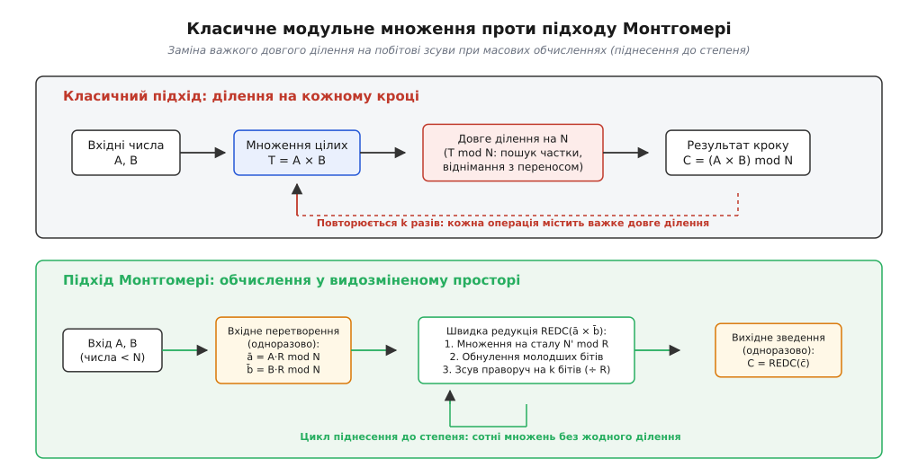
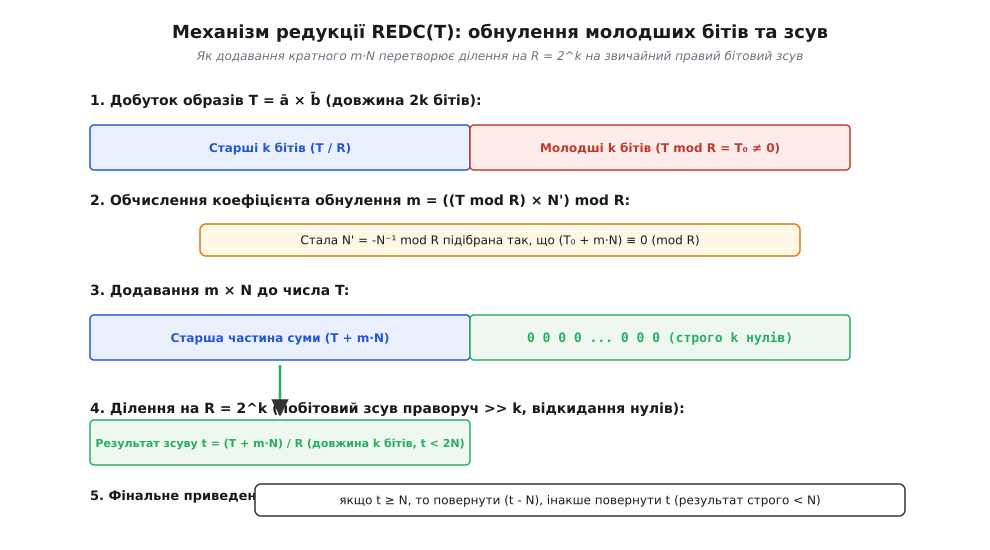
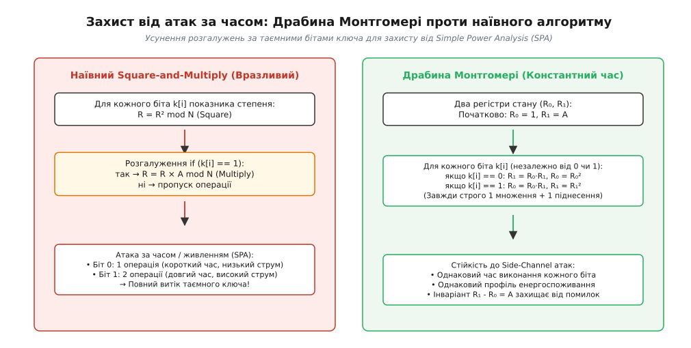

# Арифметика та перетворення Монтгомері

<preknowlist>
- [Модульна арифметика](root:math-number-theory/modular-arithmetic) — остачі від ділення, операція взяття модуля, конгруентність та кільце лишків ℤ/Nℤ.
- [Алгоритм Евкліда](root:math-number-theory/gcd-euclidean) — найбільший спільний дільник та розширений алгоритм для знаходження оберненого елемента за модулем.
- [Криптосистема RSA](root:sf-security/rsa-cryptosystem) — асиметричне шифрування та цифровий підпис, що спираються на масове модульне піднесення до степеня.
- [Кільця та поля лишків](root:math-algebra/rings) — алгебраїчні властивості оборотних елементів та структура скінченних кілець ℤ/Nℤ.
</preknowlist>

Кожного разу, коли веббраузер відкриває захищене з'єднання HTTPS через протокол TLS 1.3, мобільний застосунок надсилає зашифроване повідомлення у месенджері Signal або криптографічний гаманець підписує транзакцію у блокчейні, центральний процесор виконує десятки тисяч операцій модульного множення над гігантськими цілими числами довжиною від 256 до 4096 бітів. 

У класичних асиметричних криптосистемах (RSA, протокол обміну ключами Діффі–Геллмана, алгоритми цифрового підпису ECDSA та Ed25519) головним обчислювальним навантаженням є **модульне піднесення до степеня** `Aᵉ mod N` або скалярне множення точок на еліптичних кривих `k · P`. Щоб обчислити одне піднесення 2048-бітового числа до степеня, процесор має виконати близько трьох тисяч послідовних модульних множень: `(A · B) mod N`.

Якщо виконувати кожне таке множення наївним шкільним способом, обчислювальний конвеєр негайно впирається у фундаментальне апаратне обмеження мікропроцесорів: **довге ділення з остачею є надзвичайно повільною операцією**. Для обчислення `(A · B) mod N` процесор спочатку перемножує два 2048-бітові числа, отримуючи 4096-бітовий проміжний добуток `T`, а потім ділить число `T` на непарний модуль `N`, щоб знайти остачу.

На рівні кремнієвих транзисторів операція ділення вимагає послідовного сканування розрядів зліва направо (від найстарших бітів до молодших), постійного вгадування цифр неповної частки, пробного множення та частих корекцій у разі помилки. У той час як апаратне множення цілих слів на сучасних процесорах виконується за 3–4 такти з повною конвеєризацією, інструкція апаратного ділення блокує конвеєр на 25–80 тактів. Для багаторозрядних чисел ділення виконується за складними квадратичними алгоритмами, забираючи до 80% усього часу криптографічного перетворення.

У 1985 році американський математик Петер Монтгомері запропонував проривний метод, який дозволив повністю усунути важке ділення з циклів модульних обчислень. Його підхід замінює ділення на довільне непарне число `N` на **побітові двійкові зсуви праворуч**, переносячи обчислення у видозмінений числовий простір.

---

### Вузьке горло криптографії: ціна класичного ділення

Щоб у деталях зрозуміти масштаби проблеми, поглянемо на анатомію виконання операцій над великими числами в сучасних процесорних архітектурах x86-64 та ARM64.

Числа довжиною 2048 бітів не вміщуються в жоден стандартний регістр загального призначення. Тому в пам'яті комп'ютера велике число представляють як масив машинних слів (англ. *limbs*). Для 64-бітової архітектури 2048-бітовий модуль `N` розбивається на 32 окремі 64-бітові слова: `s = 2048 / 64 = 32`.

Коли ми перемножуємо два таких числа `A` та `B`, кожне з яких складається з 32 слів, класичний алгоритм множення «у стовпчик» (алгоритм шкільного множення) вимагає `s² = 32 × 32 = 1024` операцій попарного множення 64-бітових слів. На сучасних процесорах інструкції множення слів (`MULX` або `MUL`) виконуються на конвеєрі надзвичайно швидко — за 3–4 процесорні такти з пропускною здатністю одна інструкція за такт.

Проте результат множення `T = A · B` має подвійну довжину — `2s = 64` машинних слова (4096 бітів). Щоб звести це число за модулем `N`, необхідно виконати операцію взяття остачі: `T mod N`.

Класичний алгоритм довгого ділення (відомий як алгоритм D Дональда Кнута) виконує цю операцію вкрай важким шляхом:

1. **Нормалізація:** дільник `N` та ділене `T` зсуваються ліворуч так, щоб найстарший біт старшого слова `N` став одиничним.
2. **Послівне оцінювання частки:** алгоритм рухається строго зліва направо — від старших розрядів до молодших (MSB, *Most Significant Bit*). На кожному кроці за двома старшими словами діленого та старшим словом дільника обчислюється наближена цифра частки `q̂`.
3. **Пробне множення та віднімання:** обчислюється добуток `q̂ · N` і віднімається від поточного вікна діленого з послідовним розповсюдженням бітів запозичення (*borrow propagation*).
4. **Корекція помилок:** якщо оцінка `q̂` виявилася завеликою (виникло зайве запозичення), частка `q̂` зменшується на одиницю, а дільник `N` додається назад до діленого (*відкат корекції*).

Цей процес вимагає приблизно `s² = 1024` операцій множення, стільки ж операцій віднімання та численні умовні перевірки. Проте найгірше те, що **поширення переносів та запозичень відбувається по всій довжині 2048-бітового числа на кожному кроці оцінки частки**. Це створює довгі послідовні ланцюги залежностей, які неможливо розпаралелити або конвеєризувати. У кремнії такий дільник вимагає гігантської площі кристала та споживає критично багато енергії.

---

### Ідея Монтгомері: чому степінь двійки змінює все

Петер Монтгомері підійшов до проблеми під зовсім іншим алгебраїчним кутом. Він помітив фундаментальну асиметрію двійкових числових систем:

- Ділення на довільне непарне число `N` — надзвичайно складна, нерегулярна операція з довгими ланцюгами залежностей по перенесенню зліва направо.
- Ділення на степінь двійки `R = 2ᵏ` — тривіальна операція. У машинному коді це звичайний побітовий зсув праворуч на `k` позицій (`>> k`), або просте відкидання цілих слів у багаторозрядній пам'яті. Взяття залишку `mod R` є простим маскуванням молодших `k` бітів через порозрядне логічне «І» (`AND (R - 1)`).

Монтгомері поставив парадоксальне запитання: чи можна побудувати модульну арифметику за непарним модулем `N` так, щоб замість ділення на `N` процесор завжди ділив виключно на допоміжну основу `R = 2ᵏ`?

Його проривна ідея полягала в тому, щоб розгортати обчислення **справа наліво** — від молодших бітів (LSB, *Least Significant Bit*) до старших.

Замість того, щоб намагатися відняти кратне `N` від старших розрядів для зменшення проміжного добутку, Монтгомері запропонував додавати точно підібране кратне `m · N` до молодших розрядів так, щоб останні `k` бітів суми стали строго нульовими. Як тільки молодші `k` бітів обнулено, ділення на `R = 2ᵏ` стає точним зсувом без жодної втрати остачі.

Аби цей прийом працював узгоджено для цілого ланцюжка послідовних операцій, числа попередньо масштабують, переносячи їх у спеціальне алгебраїчне представлення — **простір Монтгомері** (або домен Монтгомері).

Еволюцію цієї ідеї та історичний контекст її виникнення докладно висвітлено в нарисі: [детальний історичний нарис про відкриття методу Монтгомері](root:math-number-theory/montgomery-reduction/hist-peter-montgomery.md).

---

### Простір Монтгомері та його алгебраїчні властивості

Нехай задано непарне додатне число `N` (модуль обчислень, англ. *modulus*). Оберемо допоміжну основу Монтгомері `R` (англ. *radix*) як найменший степінь двійки `R = 2ᵏ`, що строго перевищує модуль:

```
R > N
```

Оскільки число `N` непарне за умовою, а основа `R = 2ᵏ` є степенем двійки, вони не мають спільних дільників, крім одиниці. Отже, їхній найбільший спільний дільник строго дорівнює одиниці:

```
gcd(R, N) = 1
```

**Означення.** Образом Монтгомері (або формою Монтгомері, англ. *Montgomery representation*) цілого числа `a ∈ [0, N - 1]` називається залишок `ā`, отриманий домноженням числа `a` на основу `R` за модулем `N`:

```
ā = (a · R) mod N
```

Відображення `φ(a) = (a · R) mod N` є бієктивним кільцевим ізоморфізмом між стандартним кільцем лишків `ℤ/Nℤ` та простором Монтгомері. Кожному класичному числу `a` відповідає єдиний образ `ā`, і навпаки.


*Порівняння класичного підходу з довгим діленням на кожному кроці та обчислень у просторі Монтгомері, де ділення замінено швидкими побітовими зсувами.*

Розглянемо, як виконуються базові арифметичні дії у просторі Монтгомері.

#### Додавання та віднімання
Додавання образів Монтгомері є замкненою та прямою операцією. Додамо два образи `ā` та `b̄`:

```
ā + b̄
= (a · R) + (b · R)                   [за визначенням образів Монтгомері]
= (a + b) · R                         [винесення спільного множника R]
≡ (a + b)̄ (mod N)                     [за визначенням образу суми]
```

Сума образів автоматично дає правильний образ суми. Для приведення результату до діапазону `[0, N - 1]` достатньо виконати одне звичайне віднімання `N`, якщо сума `ā + b̄ ≥ N`. Аналогічно працює й віднімання: `ā - b̄ ≡ (a - b)̄ (mod N)`.

#### Множення та проблема зайвого множника
Справжня відмінність простору Монтгомері проявляється при множенні. Знайдемо прямий добуток двох образів `ā` та `b̄`:

```
T = ā · b̄ = (a · R) · (b · R) = (a · b) · R²
```

Зверніть увагу: добуток `T` містить допоміжну основу `R` у **другому степені** (`R²`). Проте канонічний образ Монтгомері для добутку вихідних чисел `a · b` зобов'язаний містити основу `R` у **першому степені**:

```
(a · b)̄ = (a · b · R) mod N
```

Якщо ми перемножимо два образи у просторі Монтгомері, ми отримаємо зайвий множник `R`. Щоб повернути результат до правильної форми образу, отриманий добуток `T` необхідно домножити на модульний обернений елемент `R⁻¹ mod N`:

```
c̄ = (T · R⁻¹) mod N = ((a · b · R²) · R⁻¹) mod N = (a · b · R) mod N
```

Спеціальний математичний алгоритм, який приймає на вхід подвійне число `T` і обчислює величину `(T · R⁻¹) mod N` без використання довгого ділення на `N`, називається **редукцією Монтгомері** (англ. *Montgomery Reduction*, або скорочено **REDC**).

---

### Алгоритм редукції REDC: крок за кроком

Алгоритм `REDC` є серцем усієї арифметики Монтгомері. Його задача — обчислити значення `(T · R⁻¹) mod N` для будь-якого вхідного числа `T` у діапазоні `0 ≤ T < R · N`.

Для роботи алгоритму попередньо обчислюється одна числова константа — **коефіцієнт Монтгомері** `N'`.

Оскільки `gcd(R, N) = 1`, за розширеною теоремою Безу існують такі цілі числа `R⁻¹` та `N'`, що виконується лінійна тотожність:

```
R · R⁻¹ - N · N' = 1
```

Розглянемо цю рівність за модулем основи `R`:

```
R · R⁻¹ - N · N' ≡ 1 (mod R)
0 - N · N' ≡ 1 (mod R)                [оскільки R · R⁻¹ ділиться на R націло]
N · N' ≡ -1 (mod R)                   [множення обох частин на -1]
N' ≡ -N⁻¹ (mod R)                     [визначення константи N']
```

Константа `N'` — це від'ємне модульне обернене до числа `N` за основою `R`. Її розраховують лише **один раз** при ініціалізації криптографічного контексту за допомогою розширеного алгоритму Евкліда або швидкого методу піднесення Гензеля.


*Покроковий процес обнулення молодших k бітів числа шляхом додавання кратного m·N та подальшого точного зсуву праворуч на k позицій.*

Повний алгоритм `REDC(T)` складається з п'яти послідовних кроків:

#### Крок 1. Виділення молодших бітів
Отримуємо молодшу частину числа `T` довжиною `k` бітів:

```
T₀ = T mod R = T & (R - 1)
```

Це виконується миттєво через побітову маску.

#### Крок 2. Обчислення коефіцієнта обнулення
Знаходимо ціле число `m ∈ [0, R - 1]`:

```
m = (T₀ · N') mod R = (T₀ · N') & (R - 1)
```

Множник `m` підібраний так, що сума `T + m · N` гарантовано ділиться на `R` націло.

#### Крок 3. Додавання кратного модуля
Обчислюємо розширену суму:

```
S = T + m · N
```

Перевіримо залишок суми `S` за основою `R`:

```
S mod R
= (T + m · N) mod R                   [підстановка визначення суми S]
≡ T₀ + (T₀ · N') · N (mod R)          [підстановка визначення m]
= T₀ + T₀ · (N' · N)                  [асоціативність множення]
≡ T₀ + T₀ · (-1) (mod R)              [оскільки за тотожністю Безу N' · N ≡ -1 mod R]
= T₀ - T₀                             [множення на -1]
≡ 0 (mod R)                           [віднімання однакових величин]
```

Молодші `k` бітів числа `S` строго дорівнюють нулю.

#### Крок 4. Ділення на основу через бітовий зсув
Оскільки молодші `k` бітів суми `S` нульові, ділення на `R = 2ᵏ` є точним цілочисельним правим зсувом:

```
t = S / R = (T + m · N) >> k
```

Жодна остача при цьому зсуві не втрачається.

#### Крок 5. Фінальне приведення
Оцінимо максимальне можливе значення величини `t`. Оскільки за умовою `T < R · N`, а коефіцієнт `m < R`:

```
t = (T + m · N) / R < (R · N + R · N) / R = 2N
```

Отже, проміжне число `t` гарантовано лежить у діапазоні:

```
0 ≤ t < 2N
```

Оскільки `t < 2N`, для отримання канонічного залишку `< N` потрібно **не більше одного віднімання**:

```
якщо t ≥ N, то повернути (t - N), інакше повернути t
```

Повне математичне доведення теореми про границю `t < 2N` та властивості алгоритму дивіться у вставці: [строге алгебраїчне доведення коректності алгоритму REDC](root:math-number-theory/montgomery-reduction/math-redc-proof.md).

---

### Повний числовий приклад від початку до кінця

Розберемо роботу алгоритму на конкретному числовому прикладі з невеликими числами, щоб простежити кожен крок обчислень.

Нехай модуль обчислень дорівнює непарному простому числу:

```
N = 17
```

Оберемо допоміжну основу Монтгомері як найближчий степінь двійки, більший за 17:

```
R = 32 = 2⁵       [k = 5 бітів, R > N]
```

Перевіримо взаємну простоту: `gcd(32, 17) = 1`.

#### 1. Розрахунок констант Монтгомері
Застосуємо розширений алгоритм Евкліда до чисел `R = 32` та `N = 17`:

```
32 = 1 · 17 + 15
17 = 1 · 15 + 2
15 = 7 · 2 + 1
1 = 15 - 7 · 2 = 15 - 7 · (17 - 15) = 8 · 15 - 7 · 17
1 = 8 · (32 - 17) - 7 · 17 = 8 · 32 - 15 · 17
```

Маємо тотожність Безу:

```
32 · 8 - 17 · 15 = 1
```

Звідси знаходимо константи:
- Обернене до основи за модулем `N`: `R⁻¹ = 8 mod 17` (перевірка: `(32 · 8) mod 17 = 256 mod 17 = 1`).
- Константа Монтгомері: `N' = 15 mod 32` (перевірка: `(17 · 15) mod 32 = 255 mod 32 = 31 ≡ -1 mod 32`).

Також розрахуємо допоміжну константу для входу в простір Монтгомері `R² mod N`:

```
R² mod N = 32² mod 17 = 1024 mod 17 = 4      [оскільки 1024 = 60 · 17 + 4]
```

#### 2. Вхідні числа та класичний результат
Візьмемо два числа:

```
a = 7
b = 11
```

Пряме множення за модулем 17 дає:

```
(a · b) mod N = (7 · 11) mod 17 = 77 mod 17 = 9      [оскільки 77 = 4 · 17 + 9]
```

Шукана правильна відповідь дорівнює **9**.

#### 3. Переведення чисел у простір Монтгомері
Обчислимо образи чисел `a` та `b`:

```
ā = (a · R) mod N = (7 · 32) mod 17 = 224 mod 17 = 3      [224 = 13 · 17 + 3]
b̄ = (b · R) mod N = (11 · 32) mod 17 = 352 mod 17 = 12    [352 = 20 · 17 + 12]
```

Образи чисел у просторі Монтгомері: `ā = 3`, `b̄ = 12`.

#### 4. Множення образів та виклик REDC
Перемножимо образи:

```
T = ā · b̄ = 3 · 12 = 36
```

Застосуємо алгоритм `REDC(36)`:

1. Молодші біти за основою `R = 32`:
   `T₀ = 36 mod 32 = 4`.
2. Коефіцієнт обнулення:
   `m = (T₀ · N') mod R = (4 · 15) mod 32 = 60 mod 32 = 28`.
3. Додавання кратного модуля:
   `S = T + m · N = 36 + 28 · 17 = 36 + 476 = 512`.
   *Погляньте на число 512 у двійковому записі:* `512 = 1000000000₂`. Молодші 5 бітів — строго нулі (`00000₂`)!
4. Ділення на основу `R = 32` через зсув:
   `t = 512 / 32 = 16`.
5. Фінальне приведення:
   Оскільки `t = 16 < N = 17`, віднімання не потрібне.

Результат редукції добутку у просторі Монтгомері:

```
c̄ = 16
```

Перевіримо, чи є число 16 образом правильної відповіді 9:

```
(9 · R) mod 17 = (9 · 32) mod 17 = 288 mod 17 = 16      [288 = 16 · 17 + 16]
```

Образ `c̄ = 16` ідеально збігся з теоретичним значенням.

#### 5. Повернення результату з простору Монтгомері
Щоб перетворити образ `c̄ = 16` назад у класичне число, виконаємо операцію `REDC(c̄)`:

```
T = 16
T₀ = 16 mod 32 = 16
m = (16 · 15) mod 32 = 240 mod 32 = 16
S = T + m · N = 16 + 16 · 17 = 16 + 272 = 288
t = S / R = 288 / 32 = 9
```

Оскільки `9 < 17`, остаточний результат дорівнює **9**. Ми отримали точну відповідь без жодного довгого ділення.

---

### Багаторозрядна редукція (Multi-limb REDC) у реальних бібліотеках

У сучасній криптографії оперують числами, розрядність яких значно перевищує 64 біти (256 бітів для еліптичних кривих, 2048–4096 бітів для RSA). Такі числа зберігаються у пам'яті як масиви машинних слів:

```
N = (Nₛ₋₁ ... N₁ N₀)₂ʷ
```

де `w = 64` біти — розрядність одного машинного слова, а `s` — кількість слів (наприклад, `s = 4` для 256-бітових чисел або `s = 32` для 2048-бітових чисел). Загальна основа Монтгомері становить `R = 2ˢʷ`.

Якщо реалізувати алгоритм Монтгомері за наївною схемою, спочатку перемножуються два багаторозрядні числа, утворюючи буфер подвійної довжини `2s` слів, після чого виконується редукція. Цей метод називається **роздільним скануванням операндів** (SOS — *Separated Operand Scanning*). Його головний мінус — високі вимоги до оперативної пам'яті та постійне переміщення проміжних даних між кешем процесора та регістрами.

У промислових криптографічних бібліотеках (OpenSSL, BoringSSL, GMP, WolfSSL) застосовується алгоритм **сумісного сканування операндів** — **CIOS** (*Coarsely Integrated Operand Scanning*).

```
Алгоритм CIOS (багаторозрядне множення Монтгомері):
Вхід:  вектори a, b, n довжиною s слів; константа n₀' = -n[0]⁻¹ mod 2⁶⁴
Вихід: результат c = (a · b · R⁻¹) mod n у буфері довжиною s слів

1. Ініціалізувати акумулятор t = [0, 0, ..., 0] довжиною s + 2 слів.
2. Для кожного слова i від 0 до s - 1:
     а) Додати добуток a[i] · b до акумулятора t (множення слова на вектор).
     б) Обчислити однослівний коефіцієнт обнулення:
        m = (t[0] · n₀') mod 2⁶⁴
     в) Додати зсунутий добуток m · n до акумулятора t.
     г) Зсунути весь акумулятор t праворуч на одне 64-бітове слово (t = t / 2⁶⁴).
3. Якщо старша частина t ≥ n, виконати багаторозрядне віднімання t - n.
4. Повернути молодші s слів акумулятора t.
```

Ключова математична перевага алгоритму CIOS полягає в тому, що для обчислення багаторозрядної редукції потрібна лише **однослівна константа** `n₀' = -N₀⁻¹ mod 2⁶⁴`, яка залежить виключно від наймолодшого 64-бітового слова модуля `N₀`.

#### Апаратні систолічні масиви та FPGA-прискорювачі
У кремнієвих крипточипах та матрицях FPGA алгоритм Монтгомері розгортають у систолічні масиви (*Systolic Arrays*) на базі суматорів зі збереженням переносів (CSA, *Carry-Save Adders*). 

Замість того, щоб чекати повного поширення переносів через усі 2048 бітів, кожен обчислювальний вузол передає біти переносу лише сусідньому вузлу на наступному такті тактового генератора. Це дозволяє підняти робочу частоту апаратного модуля безпеки (HSM) до гігагерцових значень без виникнення критичних шляхів затримки в логічних схемах.

#### Надлишкова форма Монтгомері (Redundant Representation)
У 1999 році Колін Волтер (*Colin Walter*) опублікував важливу теорему про оптимізацію редукції: якщо основу Монтгомері обрати дещо більшою за модуль (`R > 4N`), то під час багаторазових проміжних множень у циклі піднесення до степеня **фінальне умовне віднімання `t - N` можна взагалі не виконувати**.

Проміжні результати зберігаються в надлишковому діапазоні `[0, 2N - 1]`. Оскільки на кожній ітерації вхідні дані задовольняють `T < (2N) · (2N) = 4N² < R · N`, редукція `REDC` природно стискає результат назад до `(4N² + R · N) / R < 2N`. Віднімання модуля `N` виконується лише один раз у самому кінці для фінального вихідного значення. Це повністю усуває інструкції порівняння та захищає від витоків на рівні мікрокоманд.

Повний вихідний код багаторозрядної редукції CIOS мовами C та C++ з детальним аналізом оптимізації дивіться у вставці: [повна практична реалізація мовами C та C++](root:math-number-theory/montgomery-reduction/proj-montgomery-multiplication.md).

---

### Арифметика Монтгомері над поліномами та полями GF(2ᵐ)

Принцип Монтгомері настільки фундаментальний, що виходить далеко за межі звичайних цілих чисел. Він застосовується в поліноміальних кільцях `GF(2)[x] / f(x)` — скінченних полях Галуа характеристики 2, на яких базуються сучасні симетричні режими автентифікованого шифрування (зокрема AES-GCM) та криптографія на бінарних еліптичних кривих.

У полі `GF(2ᵐ)` елементи представляються двійковими поліномами степеня менше `m`, де коефіцієнти належать множині `{0, 1}`:
- Додавання поліномів збігається з відніманням і виконується як побітова операція `XOR` (без поширення переносів між розрядами!).
- Модулем слугує незвідний поліном `f(x)` степеня `m`.

Допоміжною основою обирається монополіном `R(x) = xᵐ`.
Образ Монтгомері для полінома `a(x)` визначається як:

```
ā(x) = (a(x) · xᵐ) mod f(x)
```

Редукція полінома `T(x) = ā(x) · b̄(x)` степеня `2m - 2` виконується повністю аналогічно до числового алгоритму:
1. Знаходиться поліном `m(x) = (T(x) · f'(x)) mod xᵐ`, де `f'(x) ≡ f(x)⁻¹ mod xᵐ`.
2. Обчислюється сума `S(x) = T(x) ⊕ (m(x) · f(x))`.
3. Оскільки молодші `m` коефіцієнтів полінома `S(x)` стають нулями, ділення на `xᵐ` є простим зсувом полінома праворуч на `m` розрядів.

Завдяки відсутності ланцюгів перенесення поліноміальний алгоритм Монтгомері реалізується в апаратному забезпеченні на базі простих вентилів `AND`/`XOR` з рекордною пропускною здатністю в десятки гігабітів на секунду (інструкція `CLMUL` / `PCLMULQDQ` в процесорах x86).

---

### Захист від атак за сторонніми каналами: Драбина Монтгомері

У 1996 році криптограф Пол Кочер опублікував фундаментальну працю про **атаки за часом виконання** (*Timing Attacks*). Він показав, що якщо алгоритм піднесення до степеня витрачає різний час на обробку нульових та одиничних бітів секретного ключа, зловмисник може повністю відновити закритий ключ RSA або ECDSA, вимірюючи мікросекундні затримки відповідей сервера через мережу.

Розглянемо класичний наївний алгоритм піднесення до степеня за методом піднесення до квадрата й домноження (*Square-and-Multiply*):

```
R = 1
Для кожного біта k[i] показника степеня від старшого до молодшого:
    R = (R · R) mod N           [Square — виконується завжди]
    якщо k[i] == 1:
        R = (R · base) mod N    [Multiply — виконується ТІЛЬКИ для біта 1]
```

Якщо черговий біт таємного ключа дорівнює `0`, процесор виконує лише одну операцію множення (квадрат). Якщо біт дорівнює `1`, виконуються дві операції (квадрат і множення).

Ця асиметрія створює подвійну вразливість:
1. **Timing Attack:** час виконання прямо пропорційний кількості одиничних бітів у таємному ключі (вазі Хеммінга).
2. **Simple Power Analysis (SPA):** на осцилограмі споживання струму чипа смарткартки піднесення до квадрата та звичайне множення мають різний візуальний малюнок сплесків напруги, що дозволяє прочитати біти ключа безпосередньо з графіка живлення.
3. **Differential Power Analysis (DPA):** статистичний аналіз тисяч вимірювань споживання енергії виявляє кореляцію між перемиканням транзисторів та бітами секретного ключа.


*Порівняння вразливого наївного алгоритму піднесення до степеня з розгалуженнями та регулярної драбини Монтгомері зі сталим часом виконання.*

Для усунення цієї вразливості Петер Монтгомері створив алгоритм **Драбини Монтгомері** (*Montgomery Ladder*).

Драбина Монтгомері підтримує два регістри стану `(R₀, R₁)`. Початковий стан: `R₀ = 1`, `R₁ = base`.

Для кожного біта показника степеня виконується строго симетричний крок:

```
Якщо k[i] == 0:
    R₁ = REDC(R₀ · R₁)
    R₀ = REDC(R₀ · R₀)
Якщо k[i] == 1:
    R₀ = REDC(R₀ · R₁)
    R₁ = REDC(R₁ · R₁)
```

Незалежно від того, чому дорівнює поточний біт ключа (0 чи 1), процесор **завжди виконує рівно одне множення та рівно одне піднесення до квадрата**.

Алгебраїчний інваріант драбини полягає в тому, що на кожному кроці різниця між значеннями в регістрах строго дорівнює основі:

```
R₁ - R₀ = base      [у мультиплікативній групі: R₁ · R₀⁻¹ ≡ base mod N]
```

#### Стійкість до апаратних атак впровадження помилок (Fault Attacks)
Драбина Монтгомері забезпечує захист не лише від пасивного спостереження, а й від активних атак впровадження збоїв (*Fault Injection Attacks* або *Safe-Error Attacks*). Якщо нападник опромінює чип лазером або створює стрибок напруги на тактовій лінії, щоб спотворити результат операції:
- У наївних алгоритмах із фіктивними операціями (*dummy operations*) спотворення фіктивного множення не впливає на фінальний результат, що дозволяє зловмиснику з'ясувати значення біта ключа.
- У драбині Монтгомері **жодна операція не є фіктивною**. Обидва регістри `R₀` та `R₁` беруть обов'язкову участь у формуванні наступних станів. Будь-який впроваджений збій руйнує алгебраїчний інваріант `R₁ · R₀⁻¹ = base` і спотворює кінцевий результат, що миттєво фіксується криптографічною перевіркою підпису.

Завдяки цьому Драбина Монтгомері:
- Має абсолютно сталий час виконання (*Constant-Time*), захищаючи від атак Кочера.
- Генерує повністю ідентичний профіль енергоспоживання для кожного такту процесора, нівелюючи атаки SPA та DPA.
- Дозволяє додавати точки на еліптичних кривих Монтгомері (зокрема в протоколі Curve25519) взагалі без обчислення координати `y`, що забезпечує безпрецедентну швидкість та компактність коду.

---

### Масштабування для RSA-4096: гібрид Карацуби–Монтгомері

При збільшенні розміру модуля до 4096 бітів (наприклад, у кореневих сертифікатах центрів сертифікації Root CA) квадратична складність шкільного множення `s² = 64 × 64 = 4096` операцій стає помітним навантаженням для високонавантажених серверів.

Для прискорення множення застосовують **гібридний підхід Карацуби–Монтгомері**. Велике 4096-бітове число розбивається на дві половини по 2048 бітів: `A = A₁ · 2²⁰⁴⁸ + A₀`, `B = B₁ · 2²⁰⁴⁸ + B₀`.

Алгоритм Анатолія Карацуби обчислює добуток за 3 множення половинної довжини замість 4:

```
P₀ = A₀ · B₀
P₁ = A₁ · B₁
P₂ = (A₀ + A₁) · (B₀ + B₁)
T = P₁ · 2⁴⁰⁹⁶ + (P₂ - P₀ - P₁) · 2²⁰⁴⁸ + P₀
```

Після обчислення добутку `T` до нього застосовується швидка багаторозрядна редукція Монтгомері. Це зменшує асимптотичну складність з `O(s²)` до `O(s^{1.585})`, що дає додаткове прискорення на 25–35% для ключів довжиною 4096 бітів.

---

### Порівняння з іншими методами модульної редукції

Щоб чітко бачити межі застосування арифметики Монтгомері, порівняємо її з двома іншими домінантними підходами в обчислювальній алгебрі: редукцією Барретта та редукцією за спеціальними модулями Мерсенна.

#### 1. Редукція Барретта (Barrett Reduction)
Пол Барретт у 1986 році запропонував інший шлях оптимізації ділення: попередньо розрахувати дробову константу `μ = ⌊2²ᵏ / N⌋`. Тоді неповну частку ділення `T / N` можна оцінити як `q̂ = ⌊(⌊T / 2ᵏ⁻¹⌋ · μ) / 2ᵏ⁺¹⌋`.

- **Перевага Барретта:** числа не потребують попереднього масштабування; алгоритм працює безпосередньо у стандартному представленні чисел. Це вигідно, коли виконується лише одне або два модульні множення з однаковим модулем.
- **Недолік Барретта:** алгоритм сканує числа зліва направо (MSB), вимагає зберігання та множення на велику константу `μ` довжиною `k + 1` бітів, породжує похибку оцінки частки (до `2`), що вимагає до двох умовних віднімань модуля, та значно гірше піддається апаратній оптимізації на систолічних масивах.

#### 2. Псевдопрості модулі Мерсенна (Crindall / NIST Primes)
Для криптографічних стандартів еліптичних кривих часто обирають спеціальні прості числа вигляду `p = 2²⁵⁶ - 2²²⁴ + 2¹⁹² + 2⁹⁶ - 1` (крива NIST P-256) або `p = 2²⁵⁵ - 19` (крива Curve25519).

Для таких модулів редукція зводиться до кількох простих операцій зсуву слів та блочного додавання безпосередньо у вихідному полі, що працює швидше за універсальну редукцію Монтгомері. Проте цей метод є суворо прив'язаним до одного конкретного числа `p` і принципово непридатний для криптосистеми RSA, де модуль `N = p · q` є добутком двох випадкових секретних простих чисел і не має спеціальної двійкової структури.

---

### Практична економіка та межі застосування

> 🔧 **Навіщо це в реальній розробці.** Арифметика Монтгомері є класичним прикладом амортизаційного алгоритму: ми сплачуємо невелику ціну на вході та виході заради колосального прискорення всередині довгого обчислювального циклу.

Порівняємо накладні витрати та вигоду алгоритму:

| Етап обчислення | Класичний підхід (Knuth Division) | Редукція Барретта | Підхід Монтгомері (REDC) |
| :--- | :--- | :--- | :--- |
| **Попередні розрахунки** | 0 операцій | Обчислення `μ = ⌊2²ᵏ / N⌋` (ділення `2k` на `k` бітів) | Обчислення `n₀' = -N₀⁻¹ mod 2⁶⁴` (6 множень Гензеля) |
| **Вхідне перетворення** | 0 операцій | 0 операцій | 1 множення `ā = a · (R² mod N)` |
| **Одне модульне множення** | 1 довге множення + 1 важке ділення на `N` (~40–80 тактів) | 2 множення + зсуви + корекції (~15–20 тактів) | 1 множення слів + зсуви та додавання `REDC` (~8–10 тактів) |
| **Піднесення до 2048-біт степеня** | ~3000 довгих ділень на `N` | ~3000 редукцій Барретта | 2 вхідні перетворення + ~3000 швидких `REDC` + 1 вихід |
| **Стійкість до таймінг-атак** | Вкрай важко забезпечити константний час | Потребує складного маскування | Природно константний час без умовних переходів |

#### Коли Монтгомері незамінний
- **Модульне піднесення до степеня (RSA, Diffie-Hellman):** виконуються тисячі множень за одним і тим самим фіксованим модулем `N`. Витрати на переведення в простір Монтгомері становлять менше 0.05% загального часу, а загальне прискорення сягає 2.5–4 разів.
- **Еліптична криптографія (ECC, X25519, secp256k1):** операції скалярного множення точки `k · P` вимагають сотень додавань і подвоєнь точок у скінченному полі `GF(p)`.
- **Апаратні крипточипи та смарткартки:** реалізація блоку `REDC` на кремнії вимагає в 5–8 разів менше логічних вентилів, ніж повноцінний апаратний дільник, і дозволяє будувати регулярні систолічні конвеєри.

#### Коли застосовувати інші методи
- **Одне ізольоване множення:** якщо потрібно помножити лише два числа один раз за випадковим модулем, витрати на розрахунок `N'` та переведення в простір Монтгомері перевищать вигоду від швидкої редукції.
- **Модулі спеціального вигляду (псевдопрості числа Мерсенна):** для спеціальних криптографічних модулів виду `p = 2²⁵⁵ - 19` (Curve25519) або `p = 2²⁵⁶ - 2²²⁴ + 2¹⁹² + 2⁹⁶ - 1` (NIST P-256) редукція виконується ще швидше через прямі бітові зсуви та додавання безпосередньо у вихідному полі без використання простору Монтгомері.
- **Швидке перетворення числового поля (NTT) у постквантовій криптографії:** для невеликих модулів (наприклад, у схемах Kyber та Dilithium) поряд із редукцією Монтгомері активно застосовують редукцію Барретта, яка не вимагає масштабування коефіцієнтів многочленів.

Арифметика та перетворення Монтгомері залишаються вершиною елегантності в комп'ютерній алгебрі: проста зміна бази числення перетворила найважчу операцію арифметики процесорів на швидкі й безпечні побітові зсуви, на яких тримається безпека сучасного цифрового світу.
