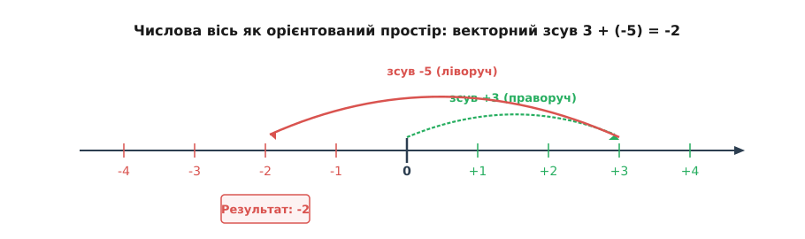
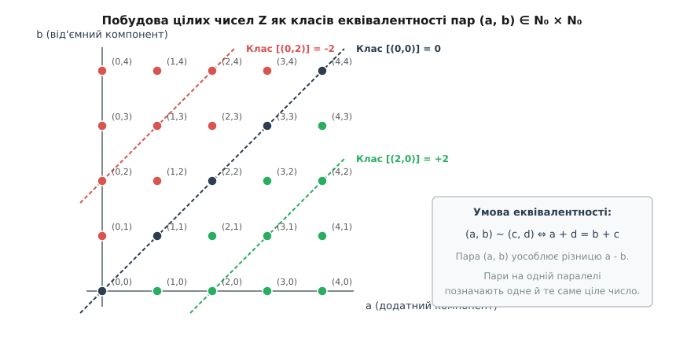
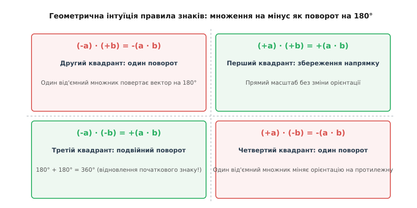
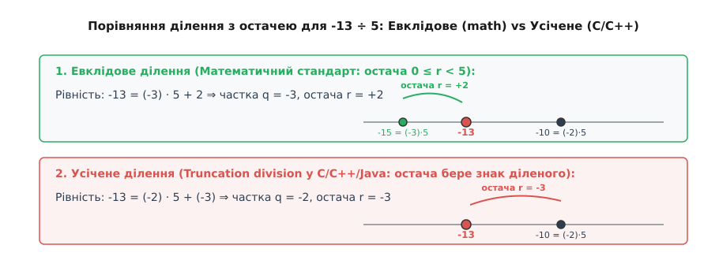

# Від'ємні числа

<preknowlist>
- [Натуральні числа](root:math-logic/natural-numbers) — скінченні лічильні кількості та їхня арифметика в `N₀`.
- [Групи](root:math-algebra/group-theory) — алгебраїчні структури з нейтральним та оберненим елементами.
- [Додатковий код](root:math-number-theory/twos-complement-algebra) — кодування знаку та числа в обчислювальних машинах.
</preknowlist>

> 🔧 **Навіщо це.**
> Натуральні числа дозволяють лічити фізичні об'єкти, але не здатні описувати ситуації, де операція віднімання виходить за межі наявного обсягу: рівняння `x + 5 = 2` не має розв'язку в `N₀`. Введення від'ємних чисел розширює множину натуральних чисел до кільця цілих чисел `Z`, гарантуючи існування адитивно оберненого елемента для кожного числа. Це перетворює віднімання на завжди виконувану операцію, створює орієнтовану числову вісь, задає основу для векторних просторів, модульної арифметики та апаратної додаткової арифметики (two's complement) у сучасних процесорах.

## 1. Дефіцит замкненості та виникнення від'ємних величин

У множині натуральних чисел `N = {1, 2, 3, ...}` та її розширенні `N₀ = N ∪ {0}` операція додавання є повністю замкненою: сума будь-яких двох натуральних чисел завжди належить до цієї ж множини. Однак обернена операція — віднімання — володіє лише частковою замкненістю. Вираз `a - b` визначений у `N₀` виключно за умови, коли зменшуване не менше за від'ємник (`a ≥ b`). Якщо людина має 3 одиниці товару й зобов'язана віддати 5 одиниць, звичайна арифметика натуральних чисел зупиняється з помилкою недостатності ресурсів.

Фізична, економічна та інженерна реальність вимагає описувати ситуації дефіциту: боргові зобов'язання, зниження температури нижче нульової позначки термометра, рух у бік, протилежний до обраного напрямку, або від'ємний електричний заряд. У кожному з цих випадків величина характеризується не лише числовим значенням (модулем), але й **орієнтацією (напрямком)** у просторі або у формі майнового стану.

Щоб зробити операцію віднімання завжди виконуваною без жодних обмежень на співвідношення між числами, для кожного натурального числа `a` вводиться новий математичний об'єкт, який називається **протилежним** (або адитивно оберненим) елементом і позначається як `-a`. За означенням, протилежне число — це такий елемент, додавання якого до початкового числа `a` дає нейтральний елемент додавання (нуль):

```
a + (-a) = 0     [означення протилежного елемента]
```

Числа, протилежні до додатних натуральних чисел, називаються **від'ємними числами** (латинське *numeri negativi*, від *negare* — заперечувати). Множина, що складається з додатних натуральних чисел, нуля та від'ємних цілих чисел, утворює множину **цілих чисел**, яку позначають символом `Z` (від німецького *Zahlen* — числа):

```
Z = {..., -3, -2, -1, 0, 1, 2, 3, ...}
```

Геометрично перехід від `N₀` до `Z` означає розширення одностороннього числового променя до нескінченної в обидва боки **числової осі**. Нуль слугує початком відліку. Додатні числа розташовуються праворуч від нуля, а від'ємні — ліворуч, дзеркально відбиваючи додатні числа відносно початку координат.


*Числова вісь із від'ємними та додатними променями та векторним додаванням `3 + (-5) = -2`.*

З векторної точки зору від'ємне число `-5` є скалярним зсувом на `5` одиниць у від'ємному напрямку (ліворуч). Додавання `3 + (-5)` інтерпретується як послідовне виконання двох зсувів: спочатку на `3` одиниці праворуч від нуля, а потім на `5` одиниць ліворуч. Кінцева точка опиняється на позначці `-2`.

Розглянемо практичний приклад балансу рахунку. Нехай клієнт банку має на рахунку `150` гривень, а потім здійснює транзакцію на `400` гривень. У рамках натуральних чисел ця операція неможлива. У кільці цілих чисел вона записується як додавання від'ємного числа або віднімання більшого натурального:

```
150 + (-400) = 150 - 400 = -250     [результат: овердрафт 250 гривень]
```

Число `-250` показує, що банківський баланс становить дефіцит у `250` гривень, який підлягає погашенню.

Усвідомлення від'ємних величин як повноправних чисел вимагало понад двох тисячоліть розвитку математичної думки. Детальний шлях від китайських лічильних паличок і боргів у Брахмагупти до суворого аксіоматичного визнання висвітлено вставкою [Історія виникнення від'ємних чисел](root:math-number-theory/negative-numbers/hist-negative-numbers-genesis.md).

## 2. Алгебраїчна конструкція пар Гротендіка

У сучасному аксіоматичному побудуванні математики не можна просто «придумати» від'ємні числа та довільно приписати їм потрібні властивості — їх необхідно строго сконструювати з вже наявних об'єктів (натуральних чисел `N₀`). Найбільш елегантним та канонічним способом побудови цілих чисел є **конструкція пар Гротендіка** (Grothendieck group construction).

Ідея полягає в тому, щоб уявити кожне ціле число як формальну різницю двох натуральних чисел. Оскільки різницю `a - b` ми ще не маємо права писати, розглянемо впорядковану пару натуральних чисел `(a, b) ∈ N₀ × N₀`, де `a` відіграє роль «додатного компонента», а `b` — «від'ємного компонента».

Різні пари можуть позначати одну й ту саму різницю: наприклад, пари `(3, 0)`, `(4, 1)` та `(5, 2)` уособлюють одне й те саме число `+3`. Щоб ототожнити такі пари, задамо на `N₀ × N₀` відношення еквівалентності `~`:

```
(a, b) ~ (c, d)  ⇔  a + d = b + c     [умова еквівалентності пар]
```

Це відношення використовує виключно операцію додавання у `N₀` і не виходить за межі натуральних чисел. Перевірка показує, що відношення `~` є рефлексивним, симетричним та транзитивним, а отже, розбиває множину пар `N₀ × N₀` на класи еквівалентності.


*Діагональні паралелі пар `(a, b)` у `N₀ × N₀`, що утворюють цілі числа `Z`.*

Кожен клас еквівалентності `[(a, b)]` є **цілим числом**:
- Якщо `a > b`, пара `(a, b)` належить до класу, що відповідає додатному цілому числу `a - b`.
- Якщо `a = b`, пара належить до класу `[(0, 0)]`, який визначає нуль `0`.
- Якщо `a < b`, пара належить до класу від'ємного цілого числа `-(b - a)`.

Арифметичні операції на класах еквівалентності задаються такими формулами:

```
[(a, b)] + [(c, d)] = [(a + c, b + d)]                     [додавання цілих чисел]
[(a, b)] · [(c, d)] = [(a·c + b·d, a·d + b·c)]             [множення цілих чисел]
```

Розглянемо обчислення добутку двох від'ємних чисел `-[ (0, 3) ]` та `-[ (0, 2) ]`:
- Число `-3` представляється класом `[(0, 3)]`.
- Число `-2` представляється класом `[(0, 2)]`.

Помножимо ці два класи за формальною формулою:

```
[(0, 3)] · [(0, 2)] = [(0·0 + 3·2, 0·2 + 3·0)] = [(6, 0)]
```

Клас `[(6, 0)]` відповідає натуральному числу `+6`. Прямий алгебраїчний розрахунок за формулою пар Гротендіка беззаперечно дає додатний результат.

Повний строгий доказ того, що ці операції є коректно визначеними (не залежать від вибору конкретної пари в класі) і перетворюють множину `Z` на комутативне кільце з одиницею, наведено у вставці [Формальна конструкція Гротендіка для кільця Z](root:math-number-theory/negative-numbers/math-formal-construction.md).

## 3. Арифметика знаків та правило «мінус на мінус дає плюс»

Операції над від'ємними числами підпорядковуються чітким алгебраїчним законам. Додавання від'ємного числа еквівалентне відніманню протилежного додатного числа, а віднімання від'ємного числа еквівалентне додаванню протилежного додатного числа:

```
a + (-b) = a - b     [додавання від'ємного числа]
a - (-b) = a + b     [віднімання від'ємного числа]
```

Найбільше запитань традиційно викликає правило множення від'ємних чисел: **чому добуток двох від'ємних чисел є додатним числом?**

Це правило не є довільною домовленістю чи умовним ритуалом. Воно є **єдиним можливим математичним наслідком**, якщо ми бажаємо зберегти фундаментальний дистрибутивний закон множення відносно додавання `x · (y + z) = x · y + x · z` у розширеній множині чисел `Z`.

Доведемо цей факт алгебраїчно крок за кроком.

Спочатку доведемо, що для будь-якого цілого числа `a` виконується `a · 0 = 0`:

```
a · 0 = a · (0 + 0)         [властивість нуля: 0 + 0 = 0]
a · 0 = a · 0 + a · 0       [дистрибутивність: a·(x+y) = a·x + a·y]
a · 0 - a · 0 = a · 0       [віднімання a·0 від обох частин]
0 = a · 0                   [отримали тотожність a · 0 = 0]
```

Тепер доведемо, що добуток від'ємного числа на додатне є від'ємним числом: `(-a) · b = -(a · b)`.

```
0 = (-a) · 0                [властивість нуля: x · 0 = 0]
0 = (-a) · (b + (-b))       [означення оберненого: b + (-b) = 0]
0 = (-a) · b + (-a) · (-b)  [дистрибутивність]
```

Звідси випливає, що `(-a) · (-b)` є адитивно оберненим елементом до `(-a) · b`. А оскільки `(-a) · b = -(a · b)`, адитивно оберненим до `-(a · b)` є саме додатне число `a · b`. Отже:

```
(-a) · (-b) = a · b         [правило знаків: мінус на мінус дає плюс]
```


*Множення на від'ємне число як поворот вектора на 180° на числовій прямій.*

Геометричний зміст цього правила розкривається через операцію **повороту (центральної симетрії)**. Множення числового вектора на додатне число `+k` розтягує або стискає вектор, зберігаючи його напрямок. Множення на `-1` повертає вектор на 180° відносно нуля, розвертаючи його у протилежний бік. Послідовне множення на два від'ємні числа означає виконання **двох поворотів поспіль**:

```
180° + 180° = 360°          [подвійний розворот повертає вектор у початковий бік]
```

Два послідовні розвороти на 180° повертають вектор у початковий додатний напрямок, що геометрично підтверджує рівність `(-1) · (-1) = +1`.

## 4. Впорядковане кільце, модуль та зміни знака в нерівностях

Множина цілих чисел `Z` утворює **впорядковане кільце**. Це означає, що крім арифметичних операцій, на `Z` задано строгий лінійний порядок `<` (менше), який узгоджений з додаванням і множенням.

Для будь-якого цілого числа `x` виконується одна й тільки одна з трьох можливостей (аксіома трихотомії):
1. `x > 0` (`x` є додатним);
2. `x = 0` (`x` є нулем);
3. `x < 0` (`x` є від'ємним).

Властивості порядку щодо арифметичних операцій задаються двома правилами:

1. **Монотонність додавання**: якщо `a < b`, то для будь-якого `c ∈ Z` виконується:
   ```
   a + c < b + c     [збереження знака нерівності при додаванні]
   ```

2. **Монотонність множення**:
   - Якщо `a < b` та `c > 0`, то `a · c < b · c` (знак нерівності зберігається).
   - Якщо `a < b` та **`c < 0`**, то **`a · c > b · c`** (знак нерівності **міняється на протилежний!**).

Зміна знака нерівності при множенні на від'ємне число є частим джерелом помилок. Проілюструємо це на числовому прикладі.

Возьмемо очевидну нерівність `2 < 5`. Помножимо обидві частини на `-3`:

```
2 · (-3) = -6
5 · (-3) = -15
```

На числовій осі число `-6` розташоване праворуч від `-15` (ближче до нуля), а отже `-6 > -15`. Знак нерівності розвернувся з `<` на `>`.

Для кількісної оцінки відстані від числа до нуля використовують функцію **модуля (абсолютної величини)**, яка позначається як `|x|`:

```
|x| = x,   якщо x ≥ 0
|x| = -x,  якщо x < 0
```

Модуль від'ємного числа завжди є додатним числом (наприклад, `|-7| = -(-7) = 7`). Основні властивості модуля:
- `|x| ≥ 0`, причому `|x| = 0 ⇔ x = 0`.
- `|-x| = |x|`.
- `|x · y| = |x| · |y|`.
- `|x + y| ≤ |x| + |y|` (**нерівність трикутника**).

Розглянемо перевірку нерівності трикутника для чисел `a = 7` та `b = -12`:

```
|a + b| = |7 + (-12)| = |-5| = 5
|a| + |b| = |7| + |-12| = 7 + 12 = 19
```

Оскільки `5 ≤ 19`, нерівність трикутника виконується зі строгим знаком нерівності. Рівність `|a + b| = |a| + |b|` досягається тоді й тільки тоді, коли числа `a` та `b` мають однаковий знак (або хоча б одне з них дорівнює нулю).

## 5. Ділення з остачею для від'ємних чисел: математика проти C/C++

У теорії чисел ділення з остачею (теорема про ділення з остачею у `Z`) стверджує: для будь-якого цілого діленого `a` та цілого дільника `b ≠ 0` існують **єдині** цілі числа `q` (частка) та `r` (остача) такі, що виконується співвідношення:

```
a = q · b + r    при умові    0 ≤ r < |b|     [канонічне Евклідове ділення]
```

Ключовою вимовою канонічного математичного ділення є **невід'ємність остачі**: `r` зобов'язана строго лежати в діапазоні від `0` до `|b| - 1`.

Однак у більшості сучасних мов програмування (C99, C++, Java, C#) реалізовано так зване **усічене ділення** (truncated division). При цьому підході частка `q` округлюється в бік нуля (*truncate towards zero*), а остача `r` обчислюється як `r = a - q · b` і **успадковує знак діленого `a`**.

Зіставимо обидва підходи на конкретному прикладі ділення від'ємного числа `a = -13` на додатний дільник `b = 5`.


*Відмінність між невід'ємною остачею у математиці та від'ємною остачею в C/C++.*

1. **Математичне (Евклідове) ділення**:
   Найближчим меншим кратним до `-13`, яке не перевищує `-13`, є число `-15 = (-3) · 5`.
   ```
   -13 = (-3) · 5 + 2     ⇒     частка q = -3, остача r = +2
   ```
   Умова `0 ≤ 2 < 5` повністю виконана.

2. **Програмне (усічене) ділення у C/C++ (оператори `/` та `%`)**:
   Результат точного ділення `-13 / 5 = -2.6` округлюється до нуля, даючи частку `q = -2`.
   ```
   r = -13 - (-2) · 5 = -13 + 10 = -3
   -13 = (-2) · 5 + (-3)  ⇒     частка q = -2, остача r = -3
   ```
   Остача виявилася від'ємною (`-3`), що порушує канонічні властивості лишків у теорії чисел.

Розглянемо ще один важливий випадок — від'ємний дільник: `a = 13`, `b = -5`.
- За математичним Евклідовим діленням: `13 = (-2) · (-5) + 3`, де частка `q = -2`, остача `r = 3` (оскільки `0 ≤ 3 < |-5| = 5`).
- За C/C++ діленням: `13 / -5 = -2`, `13 % -5 = +3`.

Звести від'ємну остачу у C/C++ до математично коректної невід'ємної остачі можна простою умовною корекцією: `if (r < 0) r += |b|`. Мови Python та Ruby за замовчуванням реалізують ділення з округленням вниз (*floor division*), яке для додатних дільників збігається з Евклідовим і завжди дає невід'ємну остачу.

## 6. Апаратне представлення: додатковий код (Two's Complement) та прапорці CPU

У цифрових обчислювальних машинах від'ємні числа зберігаються у вигляді бітових послідовностей скінченної довжини (`8`, `16`, `32` або `64` біти). Серед кількох можливих способів кодування знаку (прямий код, зворотний код, додатковий код) абсолютним стандартом сучасної архітектури став **додатковий код** (two's complement).

У `N`-бітному додатковому коді старший (найлівіший) біт позначає знак (`0` для додатних чисел і нуля, `1` для від'ємних) і має від'ємну вагу `-2ⁿ⁻¹`. Решта `N-1` бітів мають звичайні додатні ваги.

Для 8-бітного числа значення обчислюється за формулою:

```
Value = -b₇·2⁷ + b₆·2⁶ + b₅·2⁵ + b₄·2⁴ + b₃·2³ + b₂·2² + b₁·2¹ + b₀·2⁰
```

Обчислимо 8-бітове значення для байта `1111 0011₂`:

```
Value = -1·128 + 1·64 + 1·32 + 1·16 + 0·8 + 0·4 + 1·2 + 1·1   [підстановка вагових коефіцієнтів додаткового коду]
      = -128 + 64 + 32 + 16 + 2 + 1                          [множення бітів на ваги розрядів]
      = -128 + 115                                            [сумування додатних вагових компонентів]
      = -13                                                   [кінцева сума зі знаком]
```

Головною перевагою додаткового коду є те, що **операція віднімання `a - b` реалізується тим самим апаратним суматором, що й додавання `a + (-b)`**. Апаратне взяття протилежного числа `-x` виконується за два бітові кроки: порозрядне інвертування (NOT) та додавання одиниці.

```
+13₁₀  =  0000 1101₂
NOT    =  1111 0010₂      [інверсія всіх бітів]
+ 1    =  1111 0011₂      [результат: -13₁₀ у додатковому коді]
```

Арифметико-логічний пристрій (АЛУ) процесора при виконанні операцій над знаковими числами встановлює метадані у регістрі прапорців (Flags Register):
- **N (Negative)**: встановлюється в `1`, якщо старший біт результату дорівнює `1` (результат від'ємний).
- **Z (Zero)**: встановлюється в `1`, якщо всі біти результату дорівнюють `0`.
- **V (Overflow)**: встановлюється в `1`, якщо відбулося знакове переповнення (результат вийшов за межі розрядної сітки знакових чисел).
- **C (Carry)**: прапорець переносу для беззнакових операцій.

Програмну реалізацію безпечних знакових операцій, перевірку переповнення та алгоритм евклідового ділення мовами C та C++ розібрано у вставці [Обробка знака та евклідового ділення в C та C++](root:math-number-theory/negative-numbers/proj-twos-complement-ops.md).

## 7. Підсумок і поняття групового завершення

Розширення `N₀ → Z` є першим і найпростішим прикладом фундаментального математичного принципу — **алгебраїчного замикання (групового завершення)**. Коли наявна система об'єктів виявляється нездатною розв'язувати певний клас рівнянь через відсутність обернених операцій, математика будує мінімальне розширення цієї системи, у якому операція стає завжди виконуваною.

Аналогічні етапи розширення відбуваються на наступних щаблях числової ієрархії:
- `N₀ → Z`: додавання адитивно обернених елементів (від'ємні числа), що утворює абелеву групу за додаванням та кільце `Z`.
- `Z → Q`: додавання мультиплікативно обернених елементів (звичайні дроби), що перетворює кільце цілих чисел на поле раціональних чисел.
- `R → C`: додавання уявної одиниці `i = √(-1)` (розв'язок рівняння `x² + 1 = 0`), що перетворює дійсні числа на алгебраїчно замкнене поле комплексних чисел.

Введення від'ємних чисел перетворило арифметику з предметного лічби на повноцінну алгебраїчну структуру, де операції мають геометрію, напрямок та симетрію.
