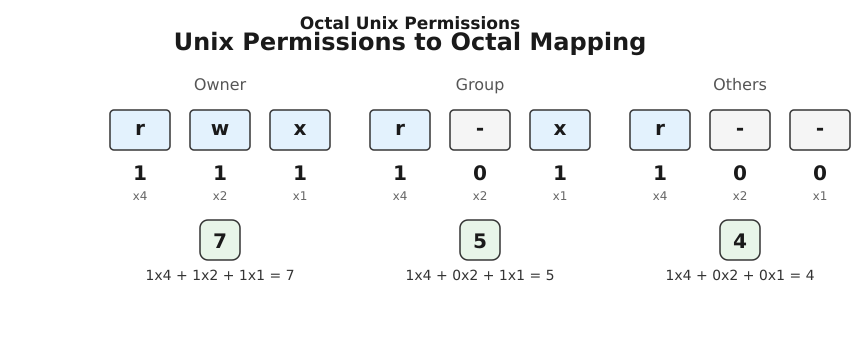

<preknowlist>
- [Двійкова система](topic:math-number-theory/why-binary)
- [Позиційні системи числення](topic:math-number-theory/positional-systems)
</preknowlist>

# Вісімкова система числення

Уявіть, що ви працюєте інженером на зорі комп'ютерної ери. Ваш комп'ютер оперує виключно нулями та одиницями — двійковою системою числення. Це чудово для транзисторів, бо вони мають лише два стани (увімкнено та вимкнено), але для людини це справжній жах. Навіть відносно невелике число, як-от десяткове 2000, у двійковому записі перетворюється на довжелезну гірлянду: 11111010000₂. Читати, записувати чи передавати такі числа колегам усно — це неминуче припускатися помилок, гублячи нулі та одиниці.

Потрібна була система, яка була б компактнішою, зручнішою для людини, але при цьому ідеально, без жодних залишків чи складних математичних перетворень, лягала б на двійкову природу машини. Десяткова система (база 10) для цього не підходить. Перетворення з двійкової у десяткову і навпаки вимагає постійного ділення або множення. Вони розмовляють «різними мовами», адже 10 не є степенем двійки. 

Тут на допомогу приходить математика. Якщо ми візьмемо число, яке є степенем двійки, наприклад 8 (це 2³), ми отримаємо магічну властивість: кожна цифра у системі з базою 8 завжди ідеально відповідатиме рівно трьом двійковим розрядам. Ця ідея і породила вісімкову систему числення (octal).

> 🔧 **Навіщо це.** Вісімкова система створює місток між громіздким машинним двійковим кодом та компактним представленням для людини. Замість того, щоб запам'ятовувати 11111010000₂, ми можемо розбити це число на групи по три біти (триади) і записати його як 3720₈. Це набагато коротше. Сьогодні вісімкова система поступилася популярністю шістнадцятковій (яка групує по 4 біти), але вона все ще живе і є абсолютно незамінною в одному критично важливому місці: системі прав доступу в операційних системах сімейства Unix (Linux, macOS), де дозволи на читання, запис та виконання ідеально лягають на групи з трьох бітів.

## Анатомія вісімкової системи

Будь-яка позиційна система числення характеризується своєю базою (основою). База визначає, скільки унікальних цифр у нас є для запису чисел, і як швидко зростає «вага» кожної наступної позиції.

У вісімковій системі база дорівнює 8. Це означає дві речі:
1. Ми використовуємо рівно 8 унікальних цифр: **0, 1, 2, 3, 4, 5, 6, 7**.
2. Цифри **8** та **9** тут не існують в принципі. 

Як ми рахуємо, коли цифри закінчуються? Точно так само, як і в десятковій. Коли ми доходимо до 9 у десятковій, ми скидаємо поточний розряд у нуль і додаємо одиницю до наступного розряду зліва, отримуючи 10. У вісімковій системі ми робимо те саме, але вже після 7.

Давайте порахуємо у вісімковій від нуля:
0₈
1₈
2₈
3₈
4₈
5₈
6₈
7₈
...цифри закінчилися! Час переходити на новий розряд:
10₈ (це десяткове 8)
11₈ (це десяткове 9)
12₈
...
17₈
20₈ (це десяткове 16)
...і так далі.

Як бачимо, після 7 іде 10, після 17 іде 20, після 77 іде 100. Число 10₈ не читається як «десять», воно читається як «один нуль у вісімковій», щоб не плутати з десятковою десяткою.

## Тріади: Магія числа 2³

Головна властивість вісімкової системи випливає з того, що 8 дорівнює 2³. Оскільки база 8 є третьою степеню бази 2, це створює пряме геометричне відображення: рівно одна цифра вісімкової системи кодує рівно три розряди двійкової системи. Група з трьох бітів називається **тріадою**.

Три біти можуть приймати 2³ = 8 різних комбінацій. Зіставимо їх із вісімковими цифрами:

000₂ = 0₈
001₂ = 1₈
010₂ = 2₈
011₂ = 3₈
100₂ = 4₈
101₂ = 5₈
110₂ = 6₈
111₂ = 7₈

Це відображення є фундаментом, який робить вісімкову систему корисною. Воно дозволяє перекладати числа між двійковою та вісімковою системами миттєво, буквально на льоту, розглядаючи число не як єдине ціле математичне значення, а як рядок символів, що групуються по три.

### Конвертація з двійкової у вісімкову (2 ↔ 8)

Щоб перетворити двійкове число у вісімкове, ми не виконуємо жодного складного множення. Ми просто нарізаємо число на триади, починаючи справа наліво (від найменшого розряду до найбільшого), і замінюємо кожну триаду на відповідну вісімкову цифру.

Нехай маємо число: 11010110₂.

Крок 1. Нарізаємо на триади справа наліво. Якщо крайній лівій групі не вистачає бітів, ми просто дописуємо уявні нулі зліва (це не змінює значення числа).

```text
  11010110₂
  11 010 110
011 010 110
```

Крок 2. Перекладаємо кожну групу:
```text
011₂ = 3₈
010₂ = 2₈
110₂ = 6₈
```

Результат: 326₈. 

Це все. Перетворення відбувається суто візуально. 

Щоб виконати зворотне перетворення з вісімкової у двійкову (8 → 2), процес є дзеркальним. Кожну вісімкову цифру ми просто «розгортаємо» у рівно три біти. 

Нехай маємо число: 507₈.

Крок 1. Беремо кожну цифру окремо.
```text
5₈ = 101₂
0₈ = 000₂  (важливо: ми пишемо саме три нулі, а не один, бо кожна цифра — це строго триада)
7₈ = 111₂
```

Крок 2. Зшиваємо все разом.
```text
101 000 111 = 101000111₂
```

## Конвертація між вісімковою та десятковою (8 ↔ 10)

Оскільки 10 не є степенем ані двійки, ані вісімки, тут візуального розбиття на групи не вийде. Доведеться згадати, як працює позиційна система в принципі, і застосувати математику.

У позиційній системі кожне число — це сума його цифр, помножених на базу системи у степені, що відповідає позиції цієї цифри (рахуючи з нуля справа наліво). У десятковій системі вагомість позицій це одиниці, десятки, сотні (10⁰, 10¹, 10²). У вісімковій — це одиниці, вісімки, шістдесят четвірки (8⁰, 8¹, 8²).

Розберемо число 326₈. Перетворимо його у десяткову систему (8 → 10).

Позиції:
Позиція 2: цифра 3
Позиція 1: цифра 2
Позиція 0: цифра 6

Записуємо поліном (суму ваг розрядів):
```text
326₈ = 3 × 8² + 2 × 8¹ + 6 × 8⁰
326₈ = 3 × 64 + 2 × 8  + 6 × 1
326₈ = 192    + 16     + 6
326₈ = 214₁₀
```

Отже, 326₈ — це 214 у звичній нам десятковій системі. 

Щоб зробити навпаки, перетворити десяткове число у вісімкове (10 → 8), ми застосовуємо стандартний алгоритм ділення на базу (тобто на 8). Ми ділимо число на 8, записуємо остачу, а отриману цілу частину знову ділимо на 8, поки ціла частина не стане нулем. Остачі, записані у зворотному порядку, утворять вісімкове число.

Перетворимо 214₁₀ у вісімкову.

```text
214 ÷ 8 = 26, остача 6
 26 ÷ 8 =  3, остача 2
  3 ÷ 8 =  0, остача 3
```

Збираємо остачі знизу вгору (від останньої до першої): 3, 2, 6.
Результат: 326₈. Усе зійшлося.

## Практичне застосування: Права доступу в Unix

Якщо ми поглянемо на сучасну інформатику, ми побачимо, що вісімкова система майже зникла з масового вжитку. Шістнадцяткова система (база 16) повністю витіснила її. Чому? Бо базова одиниця пам'яті сьогодні — це байт (8 бітів). Шістнадцяткова цифра кодує 4 біти (тетраду), тому один байт ідеально записується рівно двома шістнадцятковими цифрами (наприклад, `FF`, `A5`). Вісімкова система з її триадами не ділить 8-бітний байт націло (8 не ділиться на 3), тому вона виявилася незручною для відображення байтів.

Але є одне місце, де вісімкова система пережила всіх і стала абсолютним галузевим стандартом, який вивчає кожен айтішник. Це система дозволів (permissions) у файлових системах Unix та Linux. Секрет її виживання в тому, що творці Unix спроєктували права доступу так, щоб вони природно групувалися по три біти.



Кожен файл чи директорія у Linux має три види базових дозволів:
- `r` (read) — право читати файл.
- `w` (write) — право змінювати файл.
- `x` (execute) — право виконувати файл (або входити в директорію).

Ці три дозволи можна увімкнути або вимкнути незалежно один від одного. Це ідеально лягає на три біти (одну триаду):
- Старший біт відповідає за `r`.
- Середній біт відповідає за `w`.
- Молодший біт відповідає за `x`.

Ось так виглядає комбінаторика однієї триади дозволів:
```text
000₂ = --- = 0₈  (немає жодних прав)
001₂ = --x = 1₈  (тільки виконання)
010₂ = -w- = 2₈  (тільки запис)
011₂ = -wx = 3₈  (запис і виконання)
100₂ = r-- = 4₈  (тільки читання)
101₂ = r-x = 5₈  (читання і виконання)
110₂ = rw- = 6₈  (читання і запис)
111₂ = rwx = 7₈  (повний доступ)
```

Замість того, щоб щоразу писати літери `rwx`, адміністратор може сказати однією цифрою «7», і це однозначно означатиме `rwx`. Цифра «5» миттєво зчитується як «4 (читання) + 1 (виконання) = `r-x`». Це магія вісімкової системи в дії.

Але це лише один блок. В Unix права доступу застосовуються до трьох різних категорій користувачів:
1. **User** (Власник файлу)
2. **Group** (Група користувачів)
3. **Others** (Усі інші користувачі системи)

Оскільки кожна категорія потребує своїх трьох бітів (`rwx`), загальний базовий масив дозволів складається з 3 × 3 = 9 бітів.

Наприклад, власник має повний доступ (`rwx` = 7), група має право читати й виконувати (`r-x` = 5), і всі інші теж мають право читати й виконувати (`r-x` = 5).
У літерному вигляді це записується як `rwxr-xr-x`.
У двійковому: 111 101 101₂.
А у вісімковому: 755₈.

Замість того, щоб оперувати масивом з 9 нулів та одиниць, ми використовуємо команду `chmod 755 filename`. Три вісімкові цифри — це все, що потрібно для точного і безпомилкового конфігурування 9-бітної матриці доступу.

### Четверта триада: SUID, SGID та Sticky bit

Але 9 бітів — це не повна картина. У сучасних Unix-системах є ще три спеціальні біти, які додають системі гнучкості та безпеки. Вони стоять перед основними дозволами, формуючи четверту триаду, а отже, повна матриця дозволів складається з 12 бітів, що ідеально кодується чотирма вісімковими цифрами.

Ці спеціальні біти наступні:
- **SUID** (Set User ID, вага 4). Якщо цей біт встановлено на виконуваному файлі, то під час його запуску програма отримує права не того користувача, який її запустив, а того, хто є власником файлу. Наприклад, команда `passwd` дозволяє звичайному користувачу змінити свій пароль. Вона повинна записати новий хеш пароля у системний файл `/etc/shadow`, доступний лише для `root`. Завдяки SUID-біту, `passwd` тимчасово виконується з правами `root`.
- **SGID** (Set Group ID, вага 2). Схоже на SUID, але програма працює з правами групи-власника файлу. Якщо застосувати до директорії, всі нові файли, створені всередині, автоматично успадкують групу цієї директорії. Це незамінно для спільних робочих папок команди.
- **Sticky bit** (вага 1). Раніше він вказував системі тримати програму в оперативній пам'яті після завершення. Сьогодні його роль змінилася: його ставлять на директорії (як-от `/tmp`), щоб дозволити користувачам створювати файли всередині, але заборонити їм видаляти чи перейменовувати файли інших користувачів, незважаючи на загальні дозволи директорії `rwx`.

Отже, спеціальні дозволи формують ще одну вісімкову цифру перед базовими правами. Якщо ми кажемо `chmod 0755`, нуль спереду означає, що жодних спеціальних прапорців не встановлено. Але ми можемо увімкнути їх.

Наприклад, `chmod 4755` означає:
- 4 = увімкнуто SUID (тільки біт 4 з триади).
- 7 = `rwx` для власника.
- 5 = `r-x` для групи.
- 5 = `r-x` для інших.

Двійкове подання цього 12-бітного стану буде таким:
```text
100 111 101 101₂
```

Якби ми використовували десяткову систему, нам довелося б обчислювати 12-бітне число `100111101101₂ = 2541₁₀`. Команда виглядала б як `chmod 2541`. Людина, дивлячись на 2541, ніколи б не змогла інтуїтивно розбити його на категорії прав. А от 4755₈ миттєво дає зрозуміти: «Спеціальний біт 4, власник 7, група 5, інші 5». 

## Висновки

Вісімкова система — це блискучий інженерний компроміс свого часу. Вона народилася з простого факту: `2³ = 8`. Це дозволило людям пакувати двійкові числа у зручні блоки по 3 біти, не вдаючись до складної математики перетворення баз. Хоча епоха 8-бітного байту зробила групування по 3 біти незручним для загальних обчислень (поступившись шістнадцятковій системі), вісімкова система назавжди закарбувалася в архітектурі Unix. Там, де дані за своєю природою розбиті на трійки (як `read`, `write`, `execute`), база 8 залишається найелегантнішим та найпростішим інструментом для людини.
