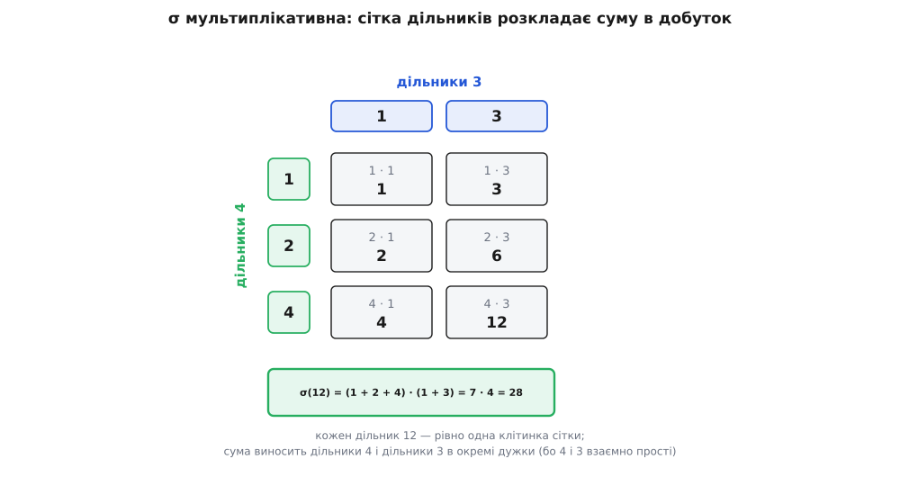
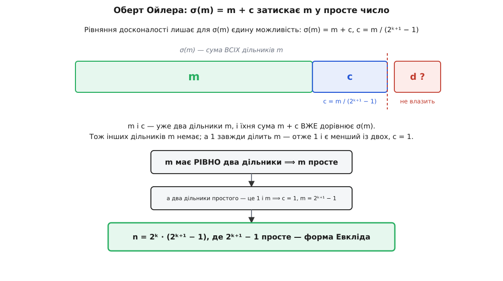

# 🧮 Оберт Ойлера рядок за рядком: кожне парне досконале — Евклідове

Правило Евкліда виготовляє досконале число з кожного простого виду 2ᵖ − 1; оберт до нього — твердження Леонарда Ойлера, що жодного **іншого** парного досконалого числа не буває, — часто згортають у слова «після короткого аналізу». Тут ми проходимо цей аналіз рядок за рядком і доводимо оберт до кінця. А заразом виводимо те, чим і сам оберт, і будь-який підрахунок суми дільників мовчки користуються: **мультиплікативність** функції σ — рівність σ(a·b) = σ(a)·σ(b), коли a і b взаємно прості.

## Спершу — мультиплікативність σ

Усе доведення тримається на одному кроці: розкласти суму дільників числа 2ᵏ·m у добуток σ(2ᵏ)·σ(m). Такий розклад дозволений не завжди — лише коли множники не мають спільних простих дільників. Тому першим ділом доведімо саме це.

Візьмімо два взаємно простих числа a і b (спільний дільник — тільки 1) і подивімось, як улаштовані дільники їхнього добутку. За [основною теоремою арифметики](root:math-number-theory/fundamental-theorem-arithmetic) кожне число однозначно розкладається на прості; а що a і b взаємно прості, то множина простих, з яких зіткане a, і множина простих b **не перетинаються**. Будь-який дільник d добутку ab складено з тих самих простих, тож його прості природно діляться на дві купки: ті, що прийшли від a, і ті, що від b. Перша купка дає число d₁, яке ділить a; друга — число d₂, що ділить b. Виходить розклад d = d₁·d₂, і він єдиний, бо купки не змішуються.

У зворотний бік так само чисто: візьміть будь-який дільник d₁ числа a і будь-який дільник d₂ числа b — їхній добуток d₁·d₂ ділить ab, а різні пари дають різні добутки (знову бо прості не перетинаються). Отже, між дільниками ab і парами «дільник a × дільник b» — точна взаємно однозначна відповідність. Дільники ab — це прямокутна сітка, а не безлад.

Тепер сума дільників сама розпадається на добуток. Пробіжімо всі дільники ab, замінивши кожен на його пару:

```
σ(ab) =  Σ       d
        d | ab

      =  Σ     Σ    d₁·d₂        (кожен дільник ab — рівно одна пара)
        d₁|a  d₂|b

      = ( Σ  d₁ ) · ( Σ  d₂ )  =  σ(a) · σ(b)
        d₁|a          d₂|b
```

Внутрішня сума пробігає d₂ при закріпленому d₁, тож d₁ виноситься за дужку, а всередині лишається σ(b). Далі σ(b) — стала для зовнішньої суми, і виноситься теж. Лишається σ(a)·σ(b). Ось і вся мультиплікативність: сітка дільників розкладає подвійну суму на добуток двох окремих.

Найменший приклад видно наскрізь. Число 12 = 4·3, а 4 і 3 взаємно прості. Дільники 4 — це {1, 2, 4}, дільники 3 — це {1, 3}; їхні шість добутків і є всі шість дільників дванадцятки:

```
σ(12) = (1 + 2 + 4) · (1 + 3) = 7 · 4 = 28
```



*Дільники добутку взаємно простих чисел лягають прямокутником; тому їхня сума виноситься в добуток двох окремих сум.*

> 🔧 **Навіщо це.** Мультиплікативність перетворює глобальне питання — суму по **всіх** дільниках числа — на набір незалежних локальних, по одному на кожен степінь простого. Щойно σ розпадається на множники, обчислення σ(n) для будь-якого n зводиться до добутку кількох геометричних сум, а рівняння досконалості σ(n) = 2n — до звичайної алгебри. Без цього кроку не порахувати навіть σ(28) інакше, ніж випишеш усі дільники стовпчиком.

Лишилося порахувати σ на самому степені простого — там дільники видно одразу. У числа pᵏ єдиний простий дільник — p, тож усі його дільники це 1, p, p², …, pᵏ і нічого поза цим. Сума — геометрична прогресія:

```
σ(pᵏ) = 1 + p + p² + … + pᵏ = (p^(k+1) − 1) / (p − 1)
```

Для двійки формула ще простіша, і її дає давній фокус із подвоєнням. Позначмо суму S = 1 + 2 + 4 + … + 2ᵏ; тоді 2S = 2 + 4 + … + 2^(k+1), і різниця 2S − S лишає самі кінці:

```
σ(2ᵏ) = 1 + 2 + 4 + … + 2ᵏ = 2^(k+1) − 1
```

Два інструменти готові: σ розкладається на взаємно простих множниках, а на степені двійки дорівнює 2^(k+1) − 1. Цього досить.

## Парне досконале: винести двійку

Тепер сам оберт. Нехай n — **парне** досконале число, і більше про нього нам нічого не відомо: ні його розмір, ні устрій. Єдине, що ми маємо право зробити з парним числом, — витягти з нього всю двійку, скільки її там сидить:

```
n = 2ᵏ · m,     m непарне,     k ≥ 1
```

Тут m — це те, що лишилось після вилучення кожного множника 2, тому воно вже непарне; а k ≥ 1, бо n парне (хоч одна двійка є). Множники 2ᵏ і m взаємно прості (m непарне), тож мультиплікативність вмикається одразу:

```
σ(n) = σ(2ᵏ) · σ(m) = (2^(k+1) − 1) · σ(m)
```

З іншого боку, n досконале, а це означає рівно одне рівняння — σ(n) = 2n. Праву частину теж розпишемо через k і m:

```
2n = 2 · 2ᵏ · m = 2^(k+1) · m
```

Дві формули для однієї величини σ(n) = 2n мусять збігтися. Прирівнюємо — і це серце всього доведення:

```
(2^(k+1) − 1) · σ(m) = 2^(k+1) · m            (★)
```

Щоб не тягти громіздкий степінь, назвімо його одним символом: M = 2^(k+1) − 1. Тоді M + 1 = 2^(k+1), число M непарне, і, оскільки k ≥ 1, воно щонайменше 2² − 1 = 3. Рівняння (★) стає коротким:

```
M · σ(m) = (M + 1) · m
```

## Затиск: чому m мусить бути простим

Із цього рівняння форма Евкліда випливає невідворотно — треба лише правильно на нього подивитися. Виразимо σ(m):

```
σ(m) = (M + 1)·m / M = m + m/M
```

Ліворуч стоїть ціле число (сума дільників завжди ціла), m теж ціле, отже й m/M мусить бути цілим. Тобто **M ділить m**. (Те саме видно й формально: M ділить (M+1)·m, а з M і M+1 спільного дільника немає — сусідні числа завжди взаємно прості, — тож увесь M ховається в m.) Назвімо частку c:

```
c = m / M     (ціле, c ≥ 1),     тобто     m = M · c
```

Підставмо назад — і рівняння перетворюється на разюче просте твердження про дільники m:

```
σ(m) = m + c
```

Ось де затискаються лещата. Придивімось до чисел c і m. Обидва **ділять** m: число m ділить само себе, а c ділить m, бо m = M·c. Обидва різні: якби c = m, то M = 1, а ми знаємо M ≥ 3. Отже, у m є принаймні два різних дільники — c і m, — і вже їхня сума дорівнює c + m. Але сума **всіх** дільників, σ(m), теж дорівнює рівно m + c. Сума всіх не може бути меншою за суму двох із них; тут вона їм точно дорівнює — значить, більше дільників немає жодного. У числа m рівно два дільники.

А число, у якого рівно два дільники, — це [просте число](root:math-number-theory/prime-numbers), і ці два дільники завжди 1 та саме число. Оскільки m > 1, менший із двох, тобто c, зобов'язаний бути одиницею:

```
c = 1    ⟹    m = M = 2^(k+1) − 1,    і m просте
```



*Рівняння лишає для σ(m) єдину можливість m + c; ці двоє вже вичерпують усю суму, тож на третій дільник місця нема — і m змушене бути простим.*

Лишилось скласти висновок докупи. m = 2^(k+1) − 1 просте, а тоді:

```
n = 2ᵏ · m = 2ᵏ · (2^(k+1) − 1),    де 2^(k+1) − 1 просте
```

Замінивши k + 1 на p, отримуємо рівно 2^(p−1)·(2ᵖ − 1) з простим 2ᵖ − 1 — форму Евкліда, ні на йоту не ширшу. Просте виду 2ᵖ − 1 — це [просте Мерсенна](root:math-number-theory/mersenne-primes), тож кожному парному досконалому числу відповідає рівно одне таке просте, і навпаки. Оберт доведено: інших парних досконалих чисел не існує.

## Дрібна перевірка: чому не степінь двійки

Доведення непомітно спиралося на те, що m ≠ 1 — інакше «менший дільник» c і m злилися б, і затиск не спрацював. А що коли в числа взагалі немає непарної частини, тобто n = 2ᵏ? Тоді за нашою ж формулою σ(2ᵏ) = 2^(k+1) − 1 = 2n − 1 — рівно на одиницю менше за 2n. Степені двійки завжди недобирають до досконалості одну одиницю; вони недостатні, і серед них досконалого нема. Рівняння (★) відкидає цей випадок само: при m = 1 воно вимагало б M·σ(1) = M + 1, тобто M = M + 1 — неможливо. Отже, непарна частина парного досконалого числа справді є, і весь хід міркування чинний.

## Той самий доказ на 496

**Проженемо 496 крізь кожен рядок доведення.**

```
496 = 2⁴ · 31            →   k = 4,   m = 31  (непарне)
M = 2^(k+1) − 1 = 2⁵ − 1 = 31

σ(m) = σ(31) = 1 + 31 = 32

перевірка (★):   M · σ(m)   = 31 · 32 = 992
                 (M + 1) · m = 32 · 31 = 992      ✓

σ(m) = m + m/M = 31 + 31/31 = 31 + 1 = 32          ✓
c = m/M = 31/31 = 1   →   m = M = 31,   а 31 просте

форма Евкліда:   496 = 2⁴ · (2⁵ − 1),   p = 5
```

Кожен рядок ліг точно там, де його передбачає доведення: M вийшло рівне непарній частині m, частка c звузилась до одиниці, а m виявилось простим Мерсенна 31. Те саме повторюється для 6 (k = 1, m = 3 = 2² − 1), для 8128 (k = 6, m = 127 = 2⁷ − 1) і для будь-якого парного досконалого числа, скільки б їх не знайшли. Парний бік задачі закрито алгеброю двох рядків: мультиплікативністю σ і одним рівнянням σ(m) = m + c, яке лишає числу m єдину долю — бути простим виду 2^(k+1) − 1.
