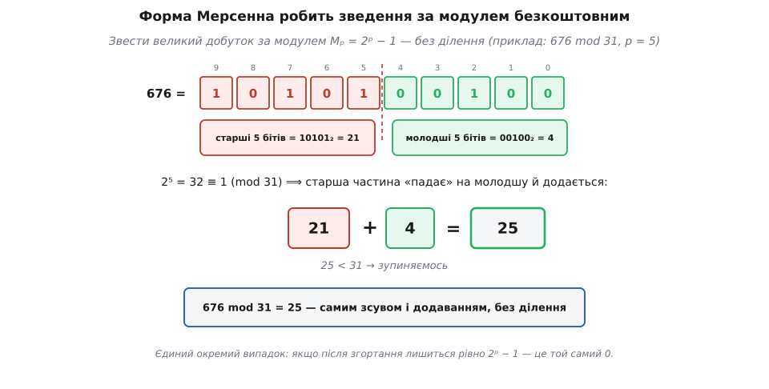

# ⚙️ Як сьогодні знаходять досконале число: тест Люка–Лемера й проєкт GIMPS

Кожне парне досконале число має вигляд 2^(p−1)·(2ᵖ − 1), де другий множник — просте число. Тож знайти нове досконале число означає рівно одне: знайти нове просте число виду 2ᵖ − 1. І от парадокс — найбільше відоме таке число має понад сорок мільйонів цифр, а перевірити його на простоту звичним способом, перебором дільників, не встигне жоден комп'ютер до кінця віку Всесвіту. Уся сучасна гонитва тримається на одному напрочуд короткому тесті, а з 2024 року — ще й на відеокартах. Розберімо, як це насправді працює, і напишімо код, що сам знаходить досконалі числа.

## Спершу — чи справді ці числа досконалі

Формула Евкліда виготовляє число, а теорема Ойлера обіцяє, що інших парних досконалих не буває. Але досконалість означена не формулою, а сумою дільників: доки цю суму ніхто не склав, ми віримо алгебрі, а не рахунку. На малих числах рахунок іще доступний, і пройти його варто бодай раз — окремо від теореми, яку він перевіряє.

Перевірка ділиться надвоє. Спершу будуємо N = 2^(p−1)·(2ᵖ − 1) за формулою. Тоді, забувши, звідки взялося N, складаємо **всі** його дільники прямим перебором і дивимося, чи вийде 2N. Другий крок навмисне тупий: він не знає ні про мультиплікативність σ, ні про форму числа — саме тому його згода з формулою щось важить.

Мова тут не байдужа. Перебір іде до √N, і для найбільшого числа, що вміщається в 64 біти, це близько півтора мільярда ділень; Python молов би такий цикл годинами, тож беремо C++.

```cpp
#include <cstdint>
#include <iomanip>
#include <iostream>

using u64 = std::uint64_t;

// сума ВСІХ дільників n — прямим перебором, без жодного знання про будову n
u64 sigma(u64 n) {
    u64 sum = 0;
    for (u64 d = 1; d * d <= n; ++d) {          // дільники ходять парами d · (n/d)
        if (n % d != 0) continue;
        sum += d;
        if (u64 pair = n / d; pair != d)        // квадратний корінь не подвоюємо
            sum += pair;
    }
    return sum;
}

bool is_prime(u64 n) {
    if (n < 2) return false;
    for (u64 d = 2; d * d <= n; ++d)
        if (n % d == 0) return false;
    return true;
}

int main() {
    for (unsigned p = 2; p <= 31; ++p) {
        if (!is_prime(p)) continue;                     // складене p — 2^p − 1 теж складене
        const u64 mersenne = (u64{1} << p) - 1;         // 2^p − 1
        if (!is_prime(mersenne)) continue;              // не просте — досконалого числа немає
        const u64 n = (u64{1} << (p - 1)) * mersenne;   // 2^(p−1)·(2^p − 1)

        const u64 s = sigma(n);                         // рахунок, незалежний від формули
        std::cout << "p=" << std::setw(2) << p
                  << "  N=" << std::setw(19) << n
                  << "  σ(N)=" << std::setw(19) << s
                  << (s == 2 * n ? "  ✓\n" : "  ✗\n");
    }
}
```

Уся вага в тому, що `sigma` й `main` нічого одне про одного не знають: одна функція будує число за теоремою, друга перелічує його дільники так, як їх означено, — по одному. Ходять вони парами, бо кожному дільнику d менше за √n відповідає рівно один n/d більший; тому цикл і зупиняється на корені, а рівний корінь додається один раз.

```
p= 2  N=                  6  σ(N)=                 12  ✓
p= 3  N=                 28  σ(N)=                 56  ✓
p= 5  N=                496  σ(N)=                992  ✓
p= 7  N=               8128  σ(N)=              16256  ✓
p=13  N=           33550336  σ(N)=           67100672  ✓
p=17  N=         8589869056  σ(N)=        17179738112  ✓
p=19  N=       137438691328  σ(N)=       274877382656  ✓
p=31  N=2305843008139952128  σ(N)=4611686016279904256  ✓
```

Вісім рядків, вісім галочок: у кожному сума дільників рівно вдвічі більша за саме число. Це всі досконалі числа, що вміщаються у 64 біти, і водночас усе, що взагалі можна перевірити прямим підрахунком. Останній рядок уже дається найдорожче — для p = 31 маємо N ≈ 2.3·10¹⁸, тобто близько півтора мільярда ділень і кілька секунд роботи. А наступне парне досконале число дає p = 61: воно й у 64 біти не влазить, а перебір його дільників коштував би близько 1.6·10¹⁸ ділень — при мільярді ділень щосекунди це понад пів століття на одне-єдине число.

Отже, теорема Евкліда–Ойлера — не зручність, а єдиний прохід далі: дев'яте досконале число й усі наступні ніхто не перевіряв на досконалість прямим підрахунком і не перевірить. Замість неперевірної суми дільників лишається одне-єдине питання — чи просте 2ᵖ − 1.

## Задача: перевірити простоту, не перебираючи дільники

Число виду 2ᵖ − 1 називають [числом Мерсенна](root:math-number-theory/mersenne-primes); коли воно просте, це просте Мерсенна, і кожному такому відповідає рівно одне парне досконале число. Отже, полювання на досконалі числа — це насправді полювання на прості Мерсенна.

Проблема в масштабі. Найбільше відоме просте Мерсенна, 2^136279841 − 1, має 41 024 320 десяткових цифр. Найпростіший тест простоти — ділити число N на всі числа до √N — тут безнадійний: √N саме має близько двадцяти мільйонів цифр, тобто перебір вимагав би порядку 10²⁰⁰⁰⁰⁰⁰⁰ ділень. Для порівняння, атомів у видимому Всесвіті лише близько 10⁸⁰. Різниця не в тисячі разів і не в мільярди — вона поза будь-якою уявою.

Потрібен тест, чия вартість залежить не від самого числа N (у нього мільйони цифр), а лише від показника p (у нього лише вісім–дев'ять цифр). Саме такий тест існує — і він працює тільки завдяки особливій формі 2ᵖ − 1.

## Ідея: одна послідовність виносить вирок

Візьмімо просте число Мерсенна Mₚ = 2ᵖ − 1 і побудуймо послідовність: почати з четвірки, а далі щоразу підносити попереднє до квадрата, віднімати два й брати остачу за модулем Mₚ.

```
Mₚ = 2ᵖ − 1                (p — непарне просте)
s₀ = 4
sₖ = sₖ₋₁² − 2   (mod Mₚ)
Mₚ просте   ⟺   s₍ₚ₋₂₎ ≡ 0   (mod Mₚ)
```

Це **тест Люка–Лемера**. У ньому все дивовижне одразу. Він детермінований — не «ймовірно просте», а точний вирок: так або ні, без частки сумніву. Він короткий — рівно p − 2 кроки, і кожен крок це «піднеси до квадрата, відніми два, зведи за модулем». Він не розкладає число на множники й нічого не вгадує. І він виносить вирок за єдиною ознакою: остання величина в ланцюжку дорівнює нулю тоді й лише тоді, коли Mₚ просте.

Тут працює [модульна арифметика](root:math-number-theory/modular-arithmetic) — рахунок з остачами, де запис a ≡ b (mod m) означає, що різниця a − b ділиться на m. Завдяки їй числа в ланцюжку ніколи не розбухають: після кожного кроку ми зводимо результат до остачі, меншої за Mₚ.

Перевірмо руками на p = 5, де Mₚ = 31:

```
s₀ = 4
s₁ = 4² − 2  = 14
s₂ = 14² − 2 = 194 ≡ 194 − 6·31 = 8   (mod 31)
s₃ = 8²  − 2 = 62  ≡ 62 − 2·31  = 0   (mod 31)     ← крок p−2 = 3
s₃ = 0   →   M₅ = 31 просте ✓
```

Три кроки — і 31 доведено простим, а отже, 2⁴·31 = 496 досконале. А тепер найважливіше: тест уміє й **відмовляти**. Візьмімо p = 11, Mₚ = 2047. Ланцюжок із дев'яти кроків не влучає в нуль — s₉ = 1736 ≠ 0, і вирок однозначний: 2047 складене (справді, 2047 = 23·89). Тому p = 11 не дає жодного досконалого числа, хоч 11 і просте. Саме ця здатність швидко відсіювати й робить тест придатним для полювання.

Історія тесту гідна згадки. Француз Едуар Люка ще 1876 року довів простоту M₁₂₇ = 2¹²⁷ − 1 — 39-цифрового числа — вручну, розробивши ядро цього методу; американець Деррік Генрі Лемер 1930 року довів критерій до сучасного вигляду для всіх непарних простих показників (форма з початковим s₀ = 4 — саме його). Тест носить обидва імені, хоч Люка й Лемер ніколи не зустрічалися.

## Робочий код: сам алгоритм

Спершу — алгоритм у найчистішому вигляді. Python тут доречний тим, що має вбудовані довгі числа: жодної ручної арифметики, видно лише сам тест. Цей код справді працює й друкує досконалі числа одне за одним.

```python
def is_prime(n):                       # показник теж мусить бути простим
    if n < 2:
        return False
    i = 2
    while i * i <= n:
        if n % i == 0:
            return False
        i += 1
    return True

def lucas_lehmer(p):                    # p — непарне просте
    M = (1 << p) - 1                    # Mₚ = 2ᵖ − 1
    s = 4
    for _ in range(p - 2):
        s = (s * s - 2) % M            # серце тесту
    return s == 0

for p in range(3, 2300):
    if is_prime(p) and lucas_lehmer(p):
        perfect = (1 << (p - 1)) * ((1 << p) - 1)
        print(p, "→ досконале =", perfect)
```

Запустивши це, побачимо 28, 496, 8128, 33550336 і далі — рівно відомі досконалі числа. (Найменше, 6, відповідає p = 2; тест Люка–Лемера означений для непарних простих p, тож шістку беруть за тривіальний засновок окремо.)

Але цей чепурний код водночас і **бреше про складність**. Уся справжня робота захована в одному рядку `s = (s*s - 2) % M`. Для навчального p = 31 Python порахує його миттєво. Для рекордного p = 136279841 у M мільйони цифр, цикл крутиться сто тридцять шість мільйонів разів, і кожен його оберт — це піднесення до квадрата числа з сорока мільйонів цифр та зведення за таким самим велетенським модулем. Оператори `*` і `%` в один символ приховують дві окремі важкі задачі. Саме їх і доводиться розв'язувати по-справжньому.

## Чому зведення за модулем безкоштовне

Почнімо з `% M` — і тут форма Мерсенна дарує диво. Оскільки Mₚ = 2ᵖ − 1, то 2ᵖ ≡ 1 (mod Mₚ). А множення на 2ᵖ — це зсув на p бітів уліво. Виходить, що будь-який біт, який «переїхав» за позицію p, при зведенні за модулем просто повертається на p позицій назад і додається до молодшої частини.

Розріжмо число x на молодші p бітів (назвімо їх lo) і все, що вище (hi): x = hi·2ᵖ + lo. Тоді

```
x = hi·2ᵖ + lo ≡ hi·1 + lo = hi + lo   (mod 2ᵖ − 1)
```

Тобто щоб звести x за модулем Mₚ, досить взяти старші біти, додати їх до молодших — і повторювати, поки не лишиться менше за 2ᵖ. Жодного ділення: самі зсуви й додавання.



*676 = 1010100100₂: старша половина «падає» на молодшу й додається — 21 + 4 = 25, і це рівно 676 mod 31.*

> 🔧 **Навіщо це.** Саме через цю властивість шукають прості серед чисел Мерсенна, а не серед якихось інших. Зведення за модулем — операція, що в тесті повторюється сто мільйонів разів; якби вона коштувала повноцінного ділення чисел на мільйони цифр, тест був би неможливий. Форма 2ᵖ − 1 перетворює найчастішу операцію на пару зсувів і додавань — і лише тому мільйоноцифрова простота взагалі перевірна.

Ось це згортання мовою C. Тут доречна саме системна мова: видно біти, зсуви й межі типів без жодної завіси. Тип `unsigned __int128` дає нам 128-бітні цілі, тож код справді компілюється й працює для помірних p (де 2ᵖ вміщається в 64 біти, а квадрат — у 128):

```c
#include <stdio.h>
#include <stdint.h>

typedef unsigned __int128 u128;

// x mod (2^p − 1) — самими зсувами й додаваннями, без ділення
static u128 mod_mersenne(u128 x, unsigned p) {
    u128 mask = ((u128)1 << p) - 1;        // молодші p бітів
    while (x >> p)                          // поки лишилися старші за p біти
        x = (x >> p) + (x & mask);          // hi + lo   (бо 2^p ≡ 1)
    if (x == mask)                          // єдиний окремий випадок:
        x = 0;                              // рівно 2^p − 1 — це той самий 0
    return x;
}

// тест Люка–Лемера для 2^p − 1  (помірне p: 2^p вміщається в 64 біти)
int lucas_lehmer(unsigned p) {
    u128 M = ((u128)1 << p) - 1;
    u128 s = 4;
    for (unsigned k = 0; k < p - 2; k++) {
        u128 sq = mod_mersenne(s * s, p);   // піднести до квадрата й звести
        s = sq >= 2 ? sq - 2 : sq + M - 2;  // відняти 2 без переповнення
    }
    return s == 0;
}

int main(void) {
    unsigned ps[] = {3, 5, 7, 11, 13, 17, 19, 31};
    for (int i = 0; i < 8; i++) {
        unsigned p = ps[i];
        printf("p=%2u  M=%llu  %s\n", p,
               (unsigned long long)(((u128)1 << p) - 1),
               lucas_lehmer(p) ? "просте ✓" : "складене");
    }
    return 0;
}
```

Уся суть — у рядку `x = (x >> p) + (x & mask)`: старші біти (`x >> p`) додаються до молодших (`x & mask`). Це і є згортання Мерсенна. Код надрукує, що 3, 5, 7, 13, 17, 19, 31 дають прості Mₚ, а 11 — складене. У справжньому GIMPS число не вміщається у 128 бітів — його тримають масивом 64-бітних «цифр»-лімбів, але згортання лишається тим самим: старші лімби додаються до молодших.

## Чому піднесення до квадрата вимагає ШПФ

Лишилася друга важка задача — сам квадрат `s * s`. Помножити два числа по n цифр «стовпчиком» коштує n² множень окремих цифр. Для n = 41 мільйон це близько 10¹⁵ множень — на **кожному** з ста мільйонів кроків. Стовпчик тут так само безнадійний, як і перебір дільників.

Порятунок у тому, що множення довгих чисел — це насправді **згортка** їхніх послідовностей цифр, а згортку блискавично рахує [швидке перетворення Фур'є](root:com-signal/fft). ШПФ обчислює згортку двох послідовностей довжини n за час порядку n·log n замість n², і саме воно перетворює множення мільйоноцифрових чисел із неможливого на буденне. Алгоритм Крендолла–Фейгіна йде ще далі: його зважене перетворення (IBDWT) вмонтовує зведення за модулем 2ᵖ − 1 **просто в саме ШПФ** — циклічна згортка вже виходить зведеною. Так «безкоштовне згортання» і «швидкий квадрат» зливаються в одну операцію. Це і є внутрішній цикл усіх сучасних програм пошуку.

## Чому з 2024 року виграють відеокарти

Тепер видно, чому полювання переїхало на графічні карти. Увесь тест — це одне велике ШПФ-піднесення до квадрата, повторене мільйони разів. А ШПФ на кожному своєму кроці — це тисячі й мільйони **незалежних** дрібних операцій-«метеликів», які можна робити одночасно. Саме таку роботу відеокарта з її тисячами ядер жене в рази швидше за процесор із десятком.

І це не теорія. У жовтні 2024 року Люк Дюрант, колишній інженер NVIDIA, знайшов 2^136279841 − 1 — 52-ге відоме просте Мерсенна на 41 024 320 цифр — не на звичайному ПК, а на «хмарному суперкомп'ютері» з тисяч серверних відеокарт у 24 дата-центрах 17 країн. 11 жовтня карта NVIDIA A100 в Дубліні позначила число як імовірно просте, а 12 жовтня карта H100 у Сан-Антоніо підтвердила простоту тестом Люка–Лемера. Це перший за 28 років рекорд найбільшого простого, здобутий не на процесорі. Відповідне досконале число, 2^136279840·(2^136279841 − 1), має понад 82 мільйони цифр.


*Справжнє полювання — це конвеєр: дешеві сита спереду, дороге ШПФ на GPU всередині й обов'язкове незалежне підтвердження в кінці.*

## Складність і пастки

**Вартість.** Тест — це p − 2 ≈ p піднесень до квадрата, кожне ціною близько p·log p через ШПФ. Разом виходить порядку p²·log p операцій. Для p ≈ 1.4·10⁸ це кількатижнева робота потужного заліза заради **одного** кандидата. Тому пошук розподілений: проєкт [GIMPS](root:math-number-theory/mersenne-primes) (Great Internet Mersenne Prime Search, заснований Джорджем Волтманом 1996 року) об'єднує машини тисяч добровольців по всьому світі.

**Показник p мусить бути простим.** Якщо p = a·b складене, то 2ᵖ − 1 автоматично складене (його ділить 2ᵃ − 1) — такі показники навіть не перевіряють. Але й простий p не гарантує нічого: більшість Mₚ складені (уже M₁₁ провалюється). Тому перед дорогим тестом дешеве **пробне ділення** відсіює показники, у яких 2ᵖ − 1 має малий множник, — і цей етап теж жене відеокарта.

**Тихі збої заліза.** За кілька тижнів і квадрильйони операцій один-єдиний перекинутий біт спотворить результат — а машина про це навіть не повідомить. Тому працюють два запобіжники. **Перевірка Гербіца** рахується дешево просто під час обчислення й ловить зіпсований прогін іще на льоту; від 2018 року GIMPS у першому проході використовує тест Ферма на ймовірну простоту з саме цією перевіркою, майже витіснивши голий тест Люка–Лемера з першої лінії. І **обов'язкова незалежна перевірка**: перш ніж число оголосять простим, його мусить підтвердити інша машина на іншому залізі й іншій програмі. «Імовірно просте» ніколи не стає відкриттям, поки другий, незалежний рахунок не скаже те саме, — тому й рекорд 2024 року позначили на одній карті, а підтвердили на іншій.

Отже, уся гонитва за досконалими числами вміщається в один рядок — `s = s² − 2 (mod Mₚ)`, — обкладений рівно тією інженерією, якої треба, щоб прогнати його сто тридцять шість мільйонів разів на числі з сорока мільйонів цифр, а тоді, задля певності, ще раз — на іншому континенті.
