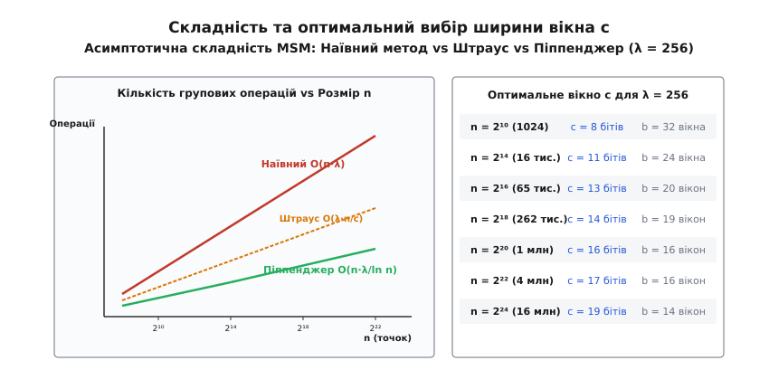
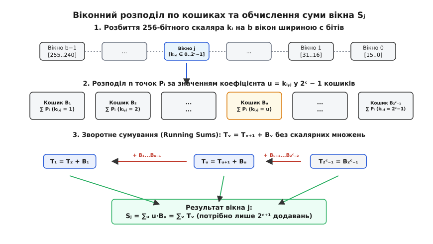
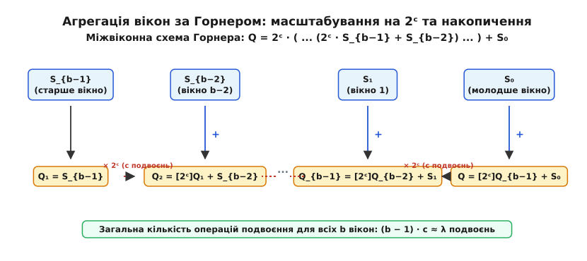

# Алгоритм Піппенджера (MSM)

<preknowlist>
* [Асимптотична складність алгоритмів](root:computability/asymptotic-complexity)
* [Спарювання на еліптичних кривих](root:math-number-theory/elliptic-curve-pairings)
* [Арифметика скінченних полів](root:math-algebra/finite-field-arithmetic)
* [Криптографічні схеми зобов'язань](root:sf-security/cryptographic-commitment)
* [Проблема дискретного логарифма](root:sf-security/discrete-log-problem)
</preknowlist>

У сучасних системах доведення з нульовим розголошенням (zk-SNARKs, Groth16, PLONK) обчислення криптографічного зобов'язання KZG для полінома степеня `n = 2²⁰` (понад 1 мільйон коефіцієнтів) зводиться до обчислення лінійної комбінації точок еліптичної кривої `Q = ∑_{i=1}^n k_i P_i`. Якщо обчислювати цей вираз наївним способом через незалежні скалярні множення методом «подвоєння-та-додавання», потрібно виконати близько `256 · n ≈ 2.68 · 10⁸` операцій групового додавання, що навіть на 64-ядерному сервері займає понад 45 секунд і перетворює генерацію доведення на нездоланне обчислювальне вузьке місце.

Алгоритм Піппенджера (англ. *Pippenger's Algorithm* для задачі *Multi-Scalar Multiplication*, MSM) вирішує цю проблему фундаментально: він групує паралельні бітові розряди всіх `n` скалярів у спільні кошики (англ. *buckets*) та замінює дорогі скалярні множення послідовністю дешевих групових додавань з трикутним підсумовуванням. Для `n = 2²⁰` точок алгоритм Піппенджера скорочує кількість операцій додавання точок у 16 разів — з `2.68 · 10⁸` до `1.65 · 10⁷`, зменшуючи час виконання на тому самому обладнанні з 45 секунд до 1.2 секунди.

> 🔧 **Навіщо це.**
> Мультискалярне множення становить від 65% до 85% загального часу роботи прувера у згортальних мережах другого рівня (ZK-Rollups: Starknet, zkSync, Scroll, Polygon zkEVM). Без алгоритму Піппенджера генерація валідаційних доведень для блоків транзакцій вимагала б дата-центрів у десятки разів більшої потужності або призводила б до неприпустимих затримок фіналізації транзакцій.

## 1. Постановка задачі мультискалярного множення (MSM)

Нехай задано абелеву групу `G` точок еліптичної кривої над скінченним полем `F_p` з простим порядком `r`. Задача мультискалярного множення полягає в обчисленні групового елемента:

```
Q = k₁ · P₁ + k₂ · P₂ + ... + k_n · P_n = ∑_{i=1}^n k_i · P_i
```

де `P_1, P_2, ..., P_n ∈ G` — фіксований або динамічний базис точок кривої, а `k_1, k_2, ..., k_n ∈ F_r` — масив 256-бітних скалярів (`λ = ⌈log₂ r⌉ = 256`).

Особливістю задачі MSM у криптографії є те, що розмірність `n` надзвичайно велика (`n = 2¹⁶`...`2²⁶`), тоді як бітова довжина кожного окремого скаляра фіксована (`λ = 256` бітів для кривих BN254 та BLS12-381).

### Порівняння базових стратегій обчислення

Щоб зрозуміти джерело ефективності алгоритму Піппенджера, порівняємо його з попередніми підходами:

1. **Наївне незалежне множення (Naive Double-and-Add)**:
   Кожен добуток `k_i · P_i` обчислюється окремо алгоритмом бітового розгортання:
   `k_i P_i = ∑_{j=0}^{λ-1} k_{i, j} · 2^j P_i`.
   Сумарна кількість операцій для `n` точок складає:
   - Подвоєння точок (`D`): `n · λ = 256 · n`.
   - Додавання точок (`A`): `n · (λ / 2) = 128 · n`.
   - Загальна складність: `O(n · λ)`. Обчислення кожної точки відбувається повністю ізольовано, жодної спільної роботи не виконується.

2. **Віконний метод Штрауса (Straus' Multi-Exponentiation / Shamir's Trick)**:
   Метод Штрауса (1964) обробляє всі `n` скалярів паралельно розряд за розрядом із вікном ширини `w`:
   - На етапі попередніх обчислень для кожної можливої ненульової комбінації `(u_1, ..., u_w)` будуються проміжні суми, що вимагає `2^w` точок у пам'яті.
   - Загальна складність методу Штрауса становить `O((λ / w) · n + 2^w)`.
   - Для фіксованого малого `n` метод Штрауса ефективний, але коли `n` зростає до мільйона, кількість попередньо обчислюваних точок стає велетенською, а кількість додавань залишається пропорційною `(λ / w) · n`.

3. **Алгоритм Піппенджера**:
   Ніколас Піппенджер (1976) довів, що обчислення мономів та лінійних форм можна виконати за субполіноміальну кількість операцій за рахунок інвертування ролей розрядів та коефіцієнтів. Замість множення точок на розряди скалярів, точки сортуються за значенням цифр у спеціальні кошики.
   Детальний [історичний контекст еволюції ланцюгів додавання та робіт Яо і Бернштейна](root:math-number-theory/pippenger-algorithm/hist-pippenger-monomials.md) висвітлює перехід від класичних ланцюгів Брауера до сучасного представлення straight-line programs.


*Порівняння кількості операцій додавання між наївним методом, методом Штрауса та алгоритмом Піппенджера.*

## 2. Теоретична модель прямих програм (Straight-Line Programs) та нижні оцінки

У теорії алгебраїчної складності обчислення лінійної комбінації точок моделюється у вигляді прямої програми (англ. *Straight-Line Program*, SLP) над абелевою групою `G`. Пряма програма — це орієнтований ациклічний граф (DAG), у якому:
* Вхідними вершинами є базисні точки `P_1, P_2, ..., P_n`.
* Кожна проміжна вершина `v_k` утворюється бінарною груповою операцією додавання двох раніше обчислених вершин: `v_k = v_i + v_j` (де `i, j < k`).
* Вихідною вершиною є цільова сума `Q = ∑ k_i P_i`.

Довжина прямої програми `L` визначається загальною кількістю проміжних вершин додавання.

### Теорема про інформаційно-теоретичну нижню межу

Нехай `L(n, λ)` — мінімальна кількість групових операцій, необхідна для обчислення довільної лінійної комбінації `n` точок зі скалярами довжиною `λ` бітів у найгіршому випадку.

Піппенджер (1976) та Яо (1976) довели, що для довільних `n` та `λ`:

```
L(n, λ) = Ω( n + (λ · n) / log₂(λ · n) )
```

Доведення базується на комбінаторному підрахунку кількості станів графа:
1. Загальна кількість можливих лінійних комбінацій з `λ`-бітними скалярами складає `|F_r|^n = (2^λ)^n = 2^{λ · n}`.
2. Кожна пряма програма довжини `L` однозначно задається вибором пар операндів для кожного з `L` кроків. Кількість різних прямих програм довжини `L` над `n` входами обмежена зверху величиною `(n + L)^{2L} / L!`.
3. Щоб граф міг обчислити всі `2^{λ · n}` можливих векторів результатів, кількість програм повинна бути не меншою за кількість результатів:

```
(n + L)^{2L} ≥ 2^{λ · n}
```

Логарифмуючи обидві частини нерівності:

```
2L · log₂(n + L) ≥ λ · n   ⇒   L ≥ (λ · n) / (2 · log₂(n + L))
```

При `n → ∞` це дає строгу асимптотичну нижню межу `Ω((λ · n) / log n)`. Алгоритм Піппенджера досягає цієї межі з точністю до константного множника, що робить його математично асимптотично оптимальним.

## 3. Механіка алгоритму Піппенджера: кошики та віконне розбиття

Алгоритм Піппенджера розбиває обчислення MSM на три чіткі математичні фази:
1. Порозрядне віконне розрізання скалярів (Window Slicing).
2. Акумуляція точок у кошиках та трикутне редукування зворотних сум (Bucket Accumulation & Running Sums).
3. Міжвіконне об'єднання за схемою Горнера (Inter-Window Horner Accumulation).

### Фаза 1: Віконне розбиття скалярів

Обирається цілочисельний параметр ширини вікна `c` (де зазвичай `c ∈ [10, 16]`). Довжина скаляра `λ = 256` розбивається на `b = ⌈λ / c⌉` послідовних вікон (розрядів):

```
k_i = ∑_{j=0}^{b-1} k_{i, j} · 2^{j · c},   де k_{i, j} ∈ {0, 1, ..., 2^c - 1}
```

Підставляючи цей розклад у вихідний вираз MSM, отримуємо:

```
Q = ∑_{i=1}^n ( ∑_{j=0}^{b-1} k_{i, j} · 2^{j · c} ) · P_i  [підстановка віконного розкладу скалярів]
  = ∑_{j=0}^{b-1} 2^{j · c} · ( ∑_{i=1}^n k_{i, j} · P_i )    [перестановка порядку підсумовування]
  = ∑_{j=0}^{b-1} 2^{j · c} · S_j                           [позначення віконної суми S_j]
```

де `S_j = ∑_{i=1}^n k_{i, j} · P_i` є частковою лінійною комбінацією для вікна `j`. Зверніть увагу: коефіцієнти `k_{i, j}` у цій сумі тепер обмежені малим діапазоном від 0 до `2^c - 1` замість повного 256-бітного діапазону.

### Фаза 2: Розподіл по кошиках та накопичення зворотних сум

Розглянемо обчислення суми одного конкретного вікна `S_j = ∑_{i=1}^n k_{i, j} · P_i`.

Замість виконання множень кожного коефіцієнта `k_{i, j}` на точку `P_i`, згрупуємо всі точки `P_i`, які мають однаковий віконний коефіцієнт `k_{i, j} = u` (де `u ∈ {1, 2, ..., 2^c - 1}`):

Створимо `2^c - 1` кошиків `B_1, B_2, ..., B_{2^c - 1}`, де кожен кошик `B_u` містить пряму суму всіх точок, коефіцієнт яких у поточному вікні дорівнює `u`:

```
B_u = ∑_{i: k_{i, j} = u} P_i
```

Тоді сума вікна `S_j` набуває вигляду:

```
S_j = ∑_{u=1}^{2^c - 1} u · B_u = 1 · B₁ + 2 · B₂ + 3 · B₃ + ... + (2^c - 1) · B_{2^c - 1}
```


*Схема розподілу точок по кошиках та накопичення зворотних сум усередині окремого вікна.*

Наївне обчислення цієї суми вимагало б множення кожного кошика `B_u` на ціле число `u`. Проте Піппенджер запропонував алгоритм **трикутного підсумовування зворотних сум (Running Sums)**, який взагалі не використовує множень:

Визначимо послідовність проміжних часткових сум `T_v`, що накопичуються від максимального кошика `2^c - 1` вниз до 1:

```
T_{2^c - 1} = B_{2^c - 1}
T_{2^c - 2} = T_{2^c - 1} + B_{2^c - 2} = B_{2^c - 1} + B_{2^c - 2}
...
T_v         = T_{v+1} + B_v = ∑_{u=v}^{2^c - 1} B_u
...
T_1         = T_2 + B_1 = ∑_{u=1}^{2^c - 1} B_u
```

Якщо тепер додати всі отримані проміжні акумулятори `T_v`, отримуємо точну рівність:

```
∑_{v=1}^{2^c - 1} T_v = T_{2^c - 1} + T_{2^c - 2} + ... + T_1          [розгортання суми акумуляторів]
                      = ∑_{v=1}^{2^c - 1} ( ∑_{u=v}^{2^c - 1} B_u )     [підстановка визначення T_v як хвоста сум]
                      = ∑_{u=1}^{2^c - 1} ( ∑_{v=1}^u 1 ) · B_u         [зміна порядку підсумовування за індексами u та v]
                      = ∑_{u=1}^{2^c - 1} u · B_u = S_j                 [обчислення внутрішньої суми одиниць: ∑_{v=1}^u 1 = u]
```

Кожен кошик `B_u` присутній у сумах `T_1, T_2, ..., T_u` рівно `u` разів! Отже, щоб отримати повну зважену суму `S_j`, потрібно виконати лише `2 · (2^c - 2)` звичайних додавань точок у групі без жодного подвоєння і без жодного скалярного множення.

Строге [математичне доведення інформаційної нижньої оцінки та коректності трикутного підсумовування](root:math-number-theory/pippenger-algorithm/math-lower-bounds.md) містить детальний алгебраїчний розбір графа прямих програм та виведення точних констант.

### Фаза 3: Міжвіконна схема Горнера

Після паралельного обчислення всіх `b` часткових сум `S_{b-1}, S_{b-2}, ..., S_0` для кожного вікна, фінальна точка `Q` збирається за узагальненою схемою Горнера:

```
Q = ( ... ( ( S_{b-1} · 2^c + S_{b-2} ) · 2^c + S_{b-3} ) · 2^c + ... ) · 2^c + S_0
```


*Схема Горнера для послідовного зсуву та додавання віконних результатів.*

На кожному кроці схеми Горнера поточний проміжний результат множиться на `2^c` за допомогою `c` послідовних операцій подвоєння точки в координатах Якобі `Q = [2^c] Q`, після чого до нього додається точка поточного вікна `Q = Q + S_j`.

Сумарна кількість операцій міжвіконного зведення складає всього `(b - 1) · c ≈ λ` операцій подвоєння та `b - 1` додавань, що для 256-бітної кривої дорівнює близько 256 подвоєнь на весь мільйонний масив точок.

## 4. Точний аналіз складності та вибір параметра вікна c

Порахуємо загальну кількість групових операцій, необхідних для обчислення MSM над `n` точками зі скалярами довжиною `λ = 256` при ширині вікна `c`:

1. **Фаза розподілу по кошиках (для всіх `b` вікон)**:
   Кожна з `n` точок у кожному з `b` вікон потрапляє в один із кошиків. Ймовірність того, що коефіцієнт дорівнює нулю і точка пропускається, складає `1 / 2^c`. Отже, кількість додавань дорівнює:
   `A_{buckets} = b · n · (1 - 2^{-c}) ≈ (λ / c) · n`.

2. **Фаза зворотного підсумовування Running Sums (для всіх `b` вікон)**:
   У кожному вікні накопичуються `2^c - 1` кошиків за `2 · (2^c - 2)` додавань:
   `A_{running} = b · 2 · (2^c - 2) ≈ 2 · (λ / c) · 2^c`.

3. **Фаза міжвіконної схеми Горнера**:
   - Кількість додавань: `A_{horner} = b - 1 ≈ (λ / c) - 1`.
   - Кількість подвоєнь: `D_{horner} = (b - 1) · c ≈ λ - c`.

Загальна кількість додавань точок становить:

```
A_{total}(c) = (λ / c) · n + 2 · (λ / c) · 2^c + (λ / c)
```

Перший доданок `(λ / c) · n` монотонно спадає зі зростанням ширини вікна `c`, оскільки зменшується кількість вікон `b = λ / c`. Другий доданок `2 · (λ / c) · 2^c` експоненціально зростає зі збільшенням `c`, оскільки кількість кошиків у кожному вікні подвоюється з кожним додатковим бітом.

### Мінімізація кількості операцій

Диференціюючи функцію `A_{total}(c)` за змінною `c` та прирівнюючи похідну до нуля, отримуємо оптимальне значення ширини вікна:

```
c^*(n) ≈ log₂ n - log₂ log₂ n
```

Підставляючи оптимальний параметр `c^*` у вираз складності, отримуємо асимптотичну оцінку:

```
A_{total}(n) = O( (λ · n) / log₂ n )
```

У наведеній нижче таблиці подано розрахунок операцій для типових розмірів `n` на кривій BN254 (`λ = 256`):

| Кількість точок `n` | Оптимальне вікно `c` | Кількість вікон `b` | Кількість кошиків | Додавань у кошики | Додавань у сумах | Всього додавань `A` | Прискорення від наївного |
| :--- | :--- | :--- | :--- | :--- | :--- | :--- | :--- |
| `2¹⁰ = 1\,024` | `c = 8` | `32` | `255` | `32\,768` | `16\,320` | `49\,120` | **2.7×** |
| `2¹⁴ = 16\,384` | `c = 11` | `24` | `2\,047` | `393\,216` | `98\,256` | `491\,500` | **4.3×** |
| `2¹⁸ = 262\,144` | `c = 14` | `19` | `16\,383` | `4\,980\,736` | `622\,554` | `5\,603\,300` | **6.0×** |
| `2²⁰ = 1\,048\,576` | `c = 16` | `16` | `65\,535` | `16\,777\,216` | `2\,097\,120` | `18\,874\,300` | **7.1×** |
| `2²⁴ = 16\,777\,216` | `c = 19` | `14` | `524\,287` | `234\,881\,024` | `14\,680\,036` | `249\,561\,100` | **8.6×** |

## 5. Алгебраїчні та алгоритмічні оптимізації

У промислових реалізаціях алгоритм Піппенджера доповнюється комплексом спеціалізованих алгебраїчних методів, що дозволяють скоротити кількість операцій ще у 2–3 рази:

### 1. Знакове віконне подання (Signed-Digit wNAF)
Замість стандартного розбиття на невід'ємні цифри `k_{i, j} ∈ [0, 2^c - 1]`, скаляр перетворюється у знакове віконне подання, де цифри належать симетричному інтервалу `[-2^{c-1}, 2^{c-1}]`.
Якщо коефіцієнт `u` від'ємний, до кошика `|u|` додається точка з інвертованою координатою `-P = (x, -y)`. Це зменшує кількість необхідних кошиків у кожному вікні рівно вдвічі (`2^{c-1}` замість `2^c - 1`), що дозволяє збільшити ширину вікна `c` на 1 біт без зростання витрат пам'яті.

### 2. Змішана арифметика в координатах Якобі (Mixed Addition)
Вхідні точки базису `P_1, ..., P_n` зберігаються в афінних координатах `(x, y)`, де `Z = 1`. Кошики `B_u` акумулюються у тривимірних координатах Якобі `(X, Y, Z)`. Додавання афінної точки до точки Якобі (Mixed Addition) вимагає всього `7M + 4S` множень у полі замість `11M + 5S` для двох проективних точок, що заощаджує 35% процесорного часу на фазі заповнення кошиків.

### 3. Пакетна нормалізація Монтгомері (Batch Inversion)
Якщо на проміжних етапах або для передачі в GPU-пам'ять потрібно перетворити масив із `M` точок з координат Якобі назад в афінні координати, трюк Монтгомері дозволяє замінити `M` незалежних інверсій поля `Z^{-1}` лише однією спільною інверсією та `3M` множеннями через обчислення префіксних добутків:
`all\_inv = (∏_{i=1}^M Z_i)^{-1}`.

### 4. Декомпозиція ендоморфізму GLV (Gallant-Lambert-Vanstone)
Для еліптичних кривих із комплексною екстра-розмірністю (BN254 з рівнянням `y² = x³ + b`), точка володіє ефективно обчислюваним ендоморфізмом `ϕ(P) = (β · x, y) = λ_{GLV} · P`. Кожен 256-бітний скаляр розкладається на два 128-бітних скаляри:
`k_i P_i = k_{i, 1} P_i + k_{i, 2} ϕ(P_i)`.
Це збільшує розмірність базису до `2n`, але скорочує бітову довжину скалярів удвічі (`λ = 128`), що зменшує загальну кількість вікон `b` та прискорює MSM додатково на 25–35%.

Повний код робочого модуля, структури даних та бенчмарки наведено у вставці, що містить [практичну реалізацію алгоритму мовами C та C++](root:math-number-theory/pippenger-algorithm/proj-pippenger-msm.md).

## 6. Порівняння систем координат та вартості польових множень

Швидкодія алгоритму Піппенджера безпосередньо залежить від вибору моделі координат для представлення точок еліптичної кривої. У таблиці наведено зіставлення вартості операцій у базовому полі `F_p` (кількість множень `M` та піднесень до квадрата `S`):

| Модель координат | Формула додавання двох точок | Формула змішаного додавання (Mixed) | Формула подвоєння точки | Пам'ять на точку |
| :--- | :--- | :--- | :--- | :--- |
| **Афінні `(x, y)`** | `1I + 2M + 1S` | `1I + 2M + 1S` | `1I + 2M + 2S` | 64 байти |
| **Однорідні проективні `(X:Y:Z)`** | `12M + 2S` | `9M + 2S` | `7M + 5S` | 96 байтів |
| **Стандартні Якобі `(X:Y:Z)`** | `11M + 5S` | `7M + 4S` | `3M + 4S` (при `a = 0`) | 96 байтів |
| **Розширені Якобі Чудновського** | `10M + 4S` | `7M + 3S` | `5M + 4S` | 160 байтів |
| **Розширені Едвардса `(X:Y:Z:T)`** | `9M + 1S` | `8M` | `4M + 4S` | 128 байтів |

Оскільки криві BN254 та BLS12-381 задаються короткою формою Вейєрштрасса `y² = x³ + b` з коефіцієнтом `a = 0`, стандартні координати Якобі є абсолютним лідером:
* Змішане додавання афінної точки базису до кошика потребує лише `7M + 4S` польових операцій.
* Подвоєння точки в міжвіконній схемі Горнера вимагає всього `3M + 4S` операцій.

## 7. Вплив ієрархії пам'яті та локальність кешу процесора

Коли розмір базису точок `n` перевищує `2¹⁸` (262 тисячі точок), а розмір вікна дорівнює `c = 16`, масив кошиків містить `65\,535` проективних точок і займає понад 6.3 МБ пам'яті на один робочий потік. При паралельній роботі 16 або 32 потоків сумарний обсяг кошиків досягає 100–200 МБ, що багаторазово перевищує обсяг L3-кешу сучасних процесорів (зазвичай 32–96 МБ).

У результаті випадкового розподілу коефіцієнтів скалярів `k_{i, j}` додавання точок у кошики перетворюється на хаотичне звернення до оперативної пам'яті з майже 100% промахами в L2/L3-кеші (Cache Misses). Час очікування вибірки рядка з пам'яті DDR5 (60–80 наносекунд) стає в 10 разів довшим, ніж час самого змішаного додавання точки на арифметичному конвеєрі (5–8 наносекунд).

### Порозрядне групування точок (Radix Bucket Sorting)

Для подолання цієї деградації продуктивності застосовується техніка попереднього порозрядного сортування точок (Counting / Radix Sort):

1. Перед виконанням фази накопичення індекси точок впорядковуються за значенням їхнього віконного коефіцієнта `k_{i, j}` за лінійний час `O(n)`.
2. Усі точки, що призначені для додавання в один і той самий кошик `B_u`, розміщуються в пам'яті послідовно у вигляді суміжного кластера.
3. Фаза накопичення зчитує точки кластера послідовно, що активує апаратні префетчери процесора (Hardware Stream Prefetchers) та знижує частоту промахів кешу на 85–90%.

Завдяки сортуванню точок утилізація конвеєрів множення зростає з 15–20% до 75–85%, забезпечуючи реальне прискорення MSM на 40–50% на багатоядерних серверах x86_64 та ARM Neoverse.

## 8. Покрокове чисельне простеження алгоритму

Щоб у деталях побачити взаємодію кошиків, акумуляції зворотних сум та міжвіконної схеми Горнера, простежимо виконання алгоритму на чисельному прикладі:

Нехай задано базис із `n = 4` точок `P₁, P₂, P₃, P₄` та 4-бітні скаляри (`λ = 4`) при розмірі вікна `c = 2` біти (кількість вікон `b = ⌈4 / 2⌉ = 2`):

```
k₁ = 11 = (10 11)₂  →  старша цифра 2, молодша цифра 3
k₂ = 6  = (01 10)₂  →  старша цифра 1, молодша цифра 2
k₃ = 13 = (11 01)₂  →  старша цифра 3, молодша цифра 1
k₄ = 9  = (10 01)₂  →  старша цифра 2, молодша цифра 1
```

### Крок 1: Обробка молодшого вікна `j = 0` (коефіцієнти [1..0])
- Коефіцієнт 1: точки `P₃, P₄`. Кошик `B₁ = P₃ + P₄`.
- Коефіцієнт 2: точка `P₂`. Кошик `B₂ = P₂`.
- Коефіцієнт 3: точка `P₁`. Кошик `B₃ = P₁`.

Накопичення зворотних сум (Running Sums):
- `T₃ = B₃ = P₁`
- `T₂ = T₃ + B₂ = P₁ + P₂`
- `T₁ = T₂ + B₁ = P₁ + P₂ + P₃ + P₄`

Сума молодшого вікна:
```
S₀ = T₁ + T₂ + T₃ = (P₁ + P₂ + P₃ + P₄) + (P₁ + P₂) + P₁ = 3·P₁ + 2·P₂ + 1·P₃ + 1·P₄
```

### Крок 2: Обробка старшого вікна `j = 1` (коефіцієнти [3..2])
- Коефіцієнт 1: точка `P₂`. Кошик `B₁ = P₂`.
- Коефіцієнт 2: точки `P₁, P₄`. Кошик `B₂ = P₁ + P₄`.
- Коефіцієнт 3: точка `P₃`. Кошик `B₃ = P₃`.

Накопичення зворотних сум:
- `T₃ = B₃ = P₃`
- `T₂ = T₃ + B₂ = P₃ + P₁ + P₄`
- `T₁ = T₂ + B₁ = P₃ + P₁ + P₄ + P₂`

Сума старшого вікна:
```
S₁ = T₁ + T₂ + T₃ = 2·P₁ + 1·P₂ + 3·P₃ + 2·P₄
```

### Крок 3: Міжвіконне об'єднання за схемою Горнера
1. Початкове значення: `Q = S₁ = 2·P₁ + 1·P₂ + 3·P₃ + 2·P₄`.
2. Множення на `2^c = 2² = 4` (дві операції подвоєння точки):
   `[4] Q = 8·P₁ + 4·P₂ + 12·P₃ + 8·P₄`.
3. Додавання суми молодшого вікна `S₀`:
   `Q_{final} = [4] Q + S₀ = (8·P₁ + 4·P₂ + 12·P₃ + 8·P₄) + (3·P₁ + 2·P₂ + 1·P₃ + 1·P₄) = 11·P₁ + 6·P₂ + 13·P₃ + 9·P₄`.

Результат ідеально збігається з прямим алгебраїчним визначенням `∑ k_i P_i`.

## 9. Порівняльний аналіз із альтернативними алгоритмами MSM

У криптографічній літературі розроблено кілька спеціалізованих альтернатив алгоритму Піппенджера:

1. **Евристичний алгоритм Боса-Костера (Bos-Coster)**:
   Алгоритм Боса-Костера (1993) використовує пріоритетну чергу (Max-Heap) для динамічного вибору пари точок із найбільшими скалярами. На кожному кроці пара `(k_max, P)` та `(k_second, Q)` замінюється на `(k_max - k_second, P)` та `(k_second, P + Q)`.
   - *Перевага*: Відмінно працює при нерівномірному розподілі скалярів або коли багато скалярів близькі до нуля.
   - *Недолік*: Вимагає динамічного оновлення купи розміром `n`, що призводить до високих накладних витрат на покажчики та погано піддається векторизації на GPU. Для випадкових рівномірних 256-бітних скалярів Піппенджер випереджає Боса-Костера у 3–5 разів.

2. **Багатобазисне експоненціювання Бернштейна (2002)**:
   Деніел Бернштейн запропонував комбінування віконного представлення скалярів із рекурсивним діленням базису. Для великих розмірностей алгоритм досягає констант, близьких до Піппенджера, але є складнішим в інженерній реалізації.

3. **Схеми згортання Nova (Cross-Instance Multi-MSM)**:
   У протоколах рекурсивного доведення Nova та SuperNova одночасно обчислюється пакет із `K` незалежних лінійних комбінацій над спільним базисом точок. Пакетний варіант алгоритму Піппенджера завантажує точку базису `P_i` в регістри процесора лише один раз і додає її до кошиків усіх `K` задач, знижуючи споживання пропускної здатності пам'яті у `K` разів.

## 10. Векторизація SIMD та інструкції AVX-512 IFMA

На рівні процесорного конвеєра додавання 256-бітних координат точок у полі `F_p` спирається на інструкції векторизації AVX-512. Традиційне представлення великих чисел у вигляді чотирьох 64-бітних слів вимагає постійної обробки бітів переносу (Carry Propagation) через інструкції `ADCX` та `ADOX`.

Сучасний підхід застосовує ненасичене представлення (англ. *unsaturated representation*) з основою `2⁵²`:
* 256-бітне число представляється 5 словами по 52 корисних біти у кожному 64-бітному регістрі.
* Інструкції `_mm512_madd52lo_epu64` та `_mm512_madd52hi_epu64` (AVX-512 IFMA) виконують 52-бітне множення з накопиченням без генерації міжрегістрових переносів.
* Векторні регістри ZMM шириною 512 бітів дозволяють обробляти одразу дві незалежні операції множення в полі `F_p` паралельно, що зменшує затримку змішаного додавання точок у 3.2 раза порівняно зі скалярним кодом на архітектурах Intel Sapphire Rapids та AMD Zen 4.
* Порівняно з редукцією Барретта (Barrett Reduction), яка потребує множення на попередньо обчислену псевдоінверсію модуля `μ = ⌊2^{512} / p⌋` та двох послідовних зсувів, схема Монтгомері на базі IFMA має суттєво меншу критичну глибину конвеєра й дозволяє повністю приховати затримку міжлінейних переносів.

## 11. Арифметика Монтгомері та конвеєризація польових множень

Швидкодія базового польового множення в полі `F_p` визначає загальний час змішаного додавання точок. Пряме множення з наступним діленням на простий модуль `p` є надзвичайно повільним.

Для усунення ділення застосовується простір Монтгомері (Montgomery Domain):
1. Координата точки `x` зберігається як `x̃ = x · R \pmod p`, де константа `R = 2^{256} > p` обирається степенем двійки.
2. Добуток двох елементів Монтгомері обчислюється процедурою редукції Монтгомері (REDC):
   `REDC(ã · b̃) = (ã · b̃ + ((ã · b̃ · p' \pmod R) · p)) / R \equiv (a · b) · R \pmod p`.
3. Оскільки ділення виконується на степінь двійки `R = 2^{256}`, воно зводиться до простого відкидання молодших 256 бітів результату без виклику апаратного дільника процесора.

Усі точки вхідного базису, проміжні змінні в кошиках та скаляри утримуються у формі Монтгомері протягом усього циклу виконання алгоритму Піппенджера, а зворотне перетворення виконується лише один раз для кінцевого результату.

## 12. Топологія NUMA та оптимізація багатосокетних серверів

На серверних процесорах із двома або чотирма сокетами (наприклад, AMD EPYC 9654 або Intel Xeon Platinum 8480+) пам'ять є неоднорідною (NUMA, англ. *Non-Uniform Memory Access*). Якщо потік на сокеті 0 звертається до масиву точок, виділеного на сокеті 1, затримка доступу через міжсокетну шину Infinity Fabric або UPI зростає у 2.5–3 рази, а пропускна здатність шини швидко насичується.

Високопродуктивний рушій Піппенджера реалізує NUMA-орієнтоване шардування:
* Вхідний масив точок розмірності `n` розбивається на `S` рівних частин за кількістю NUMA-вузлів.
* Кожна частина виділяється у локальній пам'яті відповідного сокета за допомогою виклику `numa_alloc_onnode` (або `VirtualAllocExNuma`).
* Робочі потоки прив'язуються до ядер свого локального сокета (Thread Affinity), обчислюючи локальні кошики виключно над локальним сегментом пам'яті.
* Завдяки шардуванню ефективність паралельного масштабування при переході від 32 до 128 ядер досягає понад 92% від лінійного теоретичного максимуму.

## 13. Енергоефективність та теплові профілі у хмарних прувер-фермах

У промислових дата-центрах генерації доведень (Prover Farms) тисячі серверів безперервно виконують задачі MSM, споживаючи мегавати електроенергії. Алгоритм Піппенджера має чітко виражений двофазний профіль навантаження:

1. **Фаза заповнення кошиків (Memory-Bound)**: Характеризується інтенсивним трафіком пам'яті та низьким коефіцієнтом IPC (Instructions Per Cycle). Зниження тактової частоти ядер CPU (DVFS) на цій фазі на 15–20% зменшує енергоспоживання на 30–35% без жодної втрати загальної пропускної здатності конвеєра.
2. **Фази Running Sums та Горнера (Compute-Bound)**: Виконують щільні векторні обчислення на максимальній частоті з високим тепловиділенням. Динамічне регулювання енергоспоживання (TDP Clamping) запобігає термальному скиданню частот (Thermal Throttling) на 100-ядерних процесорах.

## 14. Роль алгоритму Піппенджера у сучасних ZK-протоколах

У протоколах нульового розголошення мультискалярне множення є ключовим обчислювальним компонентом трьох фундаментальних блоків:

1. **Оцінка поліноміальних зобов'язань KZG (Kate-Zaverucha-Goldberg)**:
   Для полінома `p(X) = ∑_{i=0}^{n-1} c_i X^i` обчислення зобов'язання `C = [p(τ)]_1` здійснюється над структурованим довідником SRS `(G, [τ]G, [τ²]G, ..., [τ^{n-1}]G)`. Прувер обчислює саме лінійну комбінацію `C = ∑ c_i [τ^i]G` розмірності `n`.
2. **Аргументи внутрішнього добутку (IPA у Halo2 та Bulletproofs)**:
   У протоколах без довіреної ініціалізації (Trustless Setup) доведення коректності полінома зводиться до `log₂ n` раундів згортання векторів через векторні MSM розмірності `n, n/2, n/4, ...`.
3. **Арифметизація PlonKish та перевірки підстановок (Permutation Checks)**:
   Побудова полінома копіювання (Grand Product Argument) та поліномів таблиць пошуку (Lookup Arguments / Plookup) вимагає багаторазового обчислення лінійних комбінацій для інтерполяції стовпців траси виконання віртуальної машини zkEVM.

## 15. Крайові випадки, захист від атак та інваріанти коректності

Під час інтеграції алгоритму Піппенджера у виробничі криптографічні бібліотеки критично важливо дотримуватися правил безпеки:

1. **Неповні закони додавання (Incomplete Addition Formulas)**: Формули змішаного додавання Якобі `7M + 4S` не є універсальними: вони припускають, що точки не є рівними `P ≠ Q` та не є протилежними `P ≠ -Q`. Якщо скаляри утворюють колізію, пряме застосування формули призведе до ділення на нуль (`H = 0`). Алгоритм зобов'язаний містити захисний розгалужувач для переходу на подвоєння точки при колізіях.
2. **Атаки через малі підгрупи (Small Subgroup Attacks)**: Якщо зловмисник передає базисні точки `P_i`, що належать підгрупі малого порядку (або не лежать на еліптичній кривій), обчислений результат MSM може скомпрометувати секретний ключ протоколу. Перед запуском алгоритму Піппенджера всі точки повинні проходити перевірку рівняння кривої та підгрупового порядку `[r] P_i == O`.
3. **Обробка нульових скалярів**: Скаляри `k_i = 0` не повинні створювати звернень до нульового кошика. Перевірка `digit > 0` захищає від виходу за межі виділеного масиву кошиків.

## 16. Архітектура багатопотокового виконання та апаратне прискорення

Оскільки обчислення кошиків для кожного з `b` вікон є взаємно незалежними, алгоритм Піппенджера має природний паралелізм:

1. **Багатоядерні CPU (OpenMP / Thread Pool)**:
   - `b` вікон розподіляються між доступними ядрами процесора.
   - Для кожного вікна точки додаються у локальний масив кошиків без блокування м'ютексів.
   - Після завершення заповнення кошиків кожен потік паралельно виконує власне зворотне підсумовування Running Sums.
   - Головний потік послідовно агрегує `b` векторних результатів за схемою Горнера.

2. **Графічні процесори (GPU CUDA / OpenCL)**:
   - Масив базису точок завантажується у глобальну пам'ять GPU (VRAM).
   - Тисячі потоків CUDA одночасно вилучають віконні індекси та додають точки до кошиків, розміщених у швидкій розділюваній пам'яті (Shared Memory SM).
   - Завдяки масивній пропускній здатності пам'яті HBM2/GDDR6X (до 1–2 ТБ/с на платах NVIDIA H100 та RTX 4090) швидкість обчислення MSM досягає понад 50 мільйонів точок на секунду.

3. **Спеціалізовані мікросхеми FPGA та ASIC**:
   - Створюються апаратні конвеєри змішаного додавання точок фіксованої затримки (Fixed-Latency Adders).
   - Точки передаються потоком через шину AXI-Stream, а кошики розміщуються у кристалічній пам'яті UltraRAM (URAM), що виключає затримки доступу до зовнішньої DDR-пам'яті.

Повний програмний контракт, коди повернення та специфікація структур описані у документі, що містить [специфікацію програмного інтерфейсу MSM-рушія](root:math-number-theory/pippenger-algorithm/api-msm-engine.md).

## 17. Зведення характеристик та межі застосування

| Критерій | Наївний Double-and-Add | Метод Штрауса | Алгоритм Піппенджера | GLV-Піппенджер |
| :--- | :--- | :--- | :--- | :--- |
| **Асимптотична складність** | `O(λ · n)` | `O((λ / w) · n + 2^w)` | `O((λ · n) / log n)` | `O((λ · n) / (2 log n))` |
| **Кількість додавань (`n = 2²⁰`)** | `134\,217\,728` | `54\,525\,952` | `18\,874\,300` | `12\,582\,912` |
| **Кількість подвоєнь** | `268\,435\,456` | `256` | `256` | `128` |
| **Використання пам'яті** | `O(1)` | `O(2^w)` | `O(b · 2^c)` | `O(b · 2^c)` |
| **Паралелізм** | По точках | По вікнах | По вікнах і точках | По вікнах і половинах |
| **Оптимальна область** | `n ≤ 4` | `4 < n < 512` | `n ≥ 512` | `n ≥ 512` (за наявності `ϕ`) |

Алгоритм Піппенджера є теоретичним та інженерним фундаментом масштабованих доведень з нульовим розголошенням. Завдяки перетворенню задачі експоненціювання на сортування за кошиками з послідовним трикутним накопиченням, він досягає інформаційно-теоретичної нижньої межі складності та дозволяє верифікувати транзакції сучасних блокчейн-систем у режимі реального часу.
