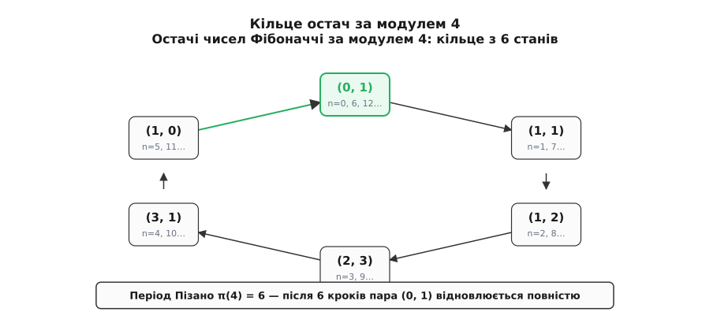
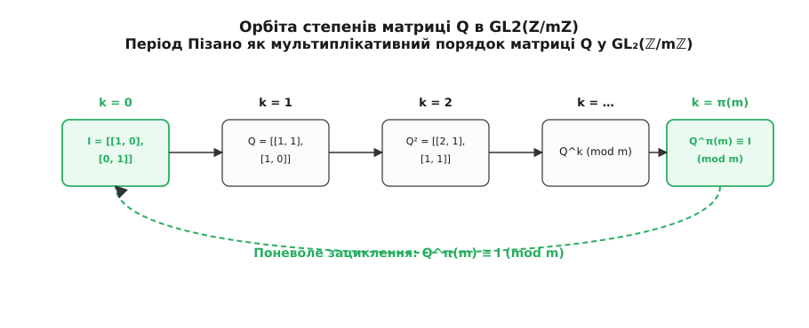
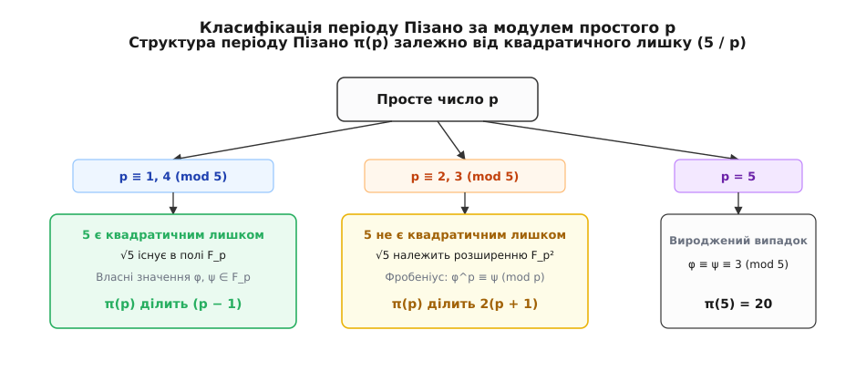

# Період Пізано π(m)

<preknowlist>
- [Числа Фібоначчі](root:math-number-theory/fibonacci-numbers) — послідовність F[n+1] = F[n] + F[n-1] із початковими умовами 0 і 1.
- [Модульна арифметика](root:math-number-theory/modular-arithmetic) — класи лишків, порівняння a ≡ b (mod m) та операції за модулем.
- [Принцип Діріхле](root:math-logic/pigeonhole-principle) — якщо N предметів розмістити в K комірках (N > K), то бодай одна комірка містить щонайменше два предмети.
- [НСД і алгоритм Евкліда](root:math-number-theory/gcd-euclidean) — найменше спільне кратне (НСК) та взаємна простота чисел.
- [Функція і теорема Ейлера](root:math-number-theory/euler-totient) — показник a^φ(m) ≡ 1 (mod m) та мультиплікативний порядок.
- [Закон взаємності квадратних лишків](root:math-number-theory/quadratic-reciprocity) — символ Лежандра (a / p) та існування квадратного кореня у скінченному полі.
</preknowlist>

Якщо виписати нескінченну послідовність чисел Фібоначчі й замінити кожне число його остачею від ділення на 4, перед очима постає дивовижно впорядкована вервечка остач:

```
n :    0  1  2  3  4  5 |  6  7  8  9 10 11 | 12 13 …
F[n]:  0  1  1  2  3  5 |  8 13 21 34 55 89 | 144 …
mod 4: 0  1  1  2  3  1 |  0  1  1  2  3  1 |  0  1 …
```

Остачі не розбігаються навмання і не перетворюються на хаотичний шум. Рівно після 6 кроків, на індексі `n = 6`, знову випадає стартова пара остач `(0, 1)`. Оскільки кожен наступний член рекурентного співвідношення `F[n+1] ≡ F[n] + F[n-1] (mod m)` повністю визначається двома попередніми остачами, повторення початкової пари неминуче змушує всю подальшу послідовність рухатися абсолютно однаковими колами.

Цю довжину найменшого повторюваного блоку остач називають **періодом Пізано** і позначають через `π(m)` — на честь італійського математика Леонардо Пізанського (Фібоначчі).

Для перших натуральних модулів періоди утворюють таку послідовність значень:
- Для модуля 2: остачі `0, 1, 1 | 0, 1, 1…` мають період `π(2) = 3`.
- Для модуля 3: остачі `0, 1, 1, 2, 0, 2, 2, 1 | 0, 1…` мають період `π(3) = 8`.
- Для модуля 4: остачі `0, 1, 1, 2, 3, 1 | 0, 1…` мають період `π(4) = 6`.
- Для модуля 5: остачі `0, 1, 1, 2, 3, 0, 3, 3, 1, 4, 0, 4, 4, 3, 2, 0, 2, 2, 4, 1 | 0, 1…` мають період `π(5) = 20`.
- Для модуля 6: за мультиплікативністю `π(6) = НСК(π(2), π(3)) = НСК(3, 8) = 24`.
- Для модуля 7: остачі за зациклюються через 16 кроків, отже `π(7) = 16`.
- Для модуля 8: зациклення відбувається через 12 кроків, тобто `π(8) = 12`.
- Для модуля 9: період дорівнює `π(9) = 24`.
- Для модуля 10: знаменитий період останніх десяткових цифр `π(10) = 60`.

Період Пізано не є просто курйозною числовою забавою. Це фундаментальна числово-теоретична характеристика, яка поєднує лінійну алгебру, арифметику скінченних піль Galois та класичну теорію квадратних лишків.

---

## Чому зациклення неминуче і не має передперіодного «хвоста»

Двома фундаментальними питаннями до будь-якої модулярної послідовності є такі: чому вона обов'язково зациклюється і чому вона зациклюється від самого початку `(0, 1)`, без передперіодного «хвоста» (як це буває, наприклад, у десяткових дробах `1/6 = 0.1666…`)?

Відповідь на перше питання дає [принцип Діріхле](root:math-logic/pigeonhole-principle). Розглянемо послідовність впорядкованих пар сусідніх остач `(F[n] mod m, F[n+1] mod m)`. Оскільки за модулем `m` існує лише `m` можливих остач (від `0` до `m - 1`), загальна кількість різних пар остач не перевищує `m²` (а насправді навіть `m² - 1`, бо пара `(0, 0)` ніколи не з'являється у послідовності Фібоначчі, адже з неї виростали б лише нулі).

Зробивши `m² + 1` кроків, ми розглянемо `m² + 1` пар. За принципом Діріхле, бодай одна пара остач зобов'язана повторитися:

```
(F[i], F[i+1]) ≡ (F[j], F[j+1]) (mod m)   для деяких i < j
```

Відповідь на друге питання ховається в **оборотності рекурентного правила назад**. Послідовність Фібоначчі можна розгортати не лише вперед (`F[n+1] = F[n] + F[n-1]`), але й назад:

```
F[n-1] = F[n+1] − F[n]
```

За модулем `m` віднімання визначене завжди й однозначно у кільці остач `ℤ/mℤ`. Якщо дві пари збіглися на кроках `i` та `j`, то за модулем `m` збігаються й попередні остачі:

```
F[i-1] ≡ F[i+1] − F[i] ≡ F[j+1] − F[j] ≡ F[j-1] (mod m)
```

Крокуючи назад крок за кроком від рівних пар `(F[i], F[i+1])` та `(F[j], F[j+1])`, ми зменшуємо індекси на 1 на кожному кроці, поки менший індекс `i` не досягне нуля `0`. На цьому кроці пара `(F[j-i], F[j-i+1])` мусить дорівнювати стартовій парі `(F[0], F[1]) ≡ (0, 1) (mod m)`.

Це означає, що першою парою, яка повториться у послідовності, буде саме стартова пара `(F[0], F[1]) ≡ (0, 1) (mod m)`.

Послідовність остач Фібоначчі є **чисто періодичною**: вона замкнена у суцільне кільце без жодних вхідних відрізків чи передперіодів.


*Остачі за модулем 4 утворюють замкнений цикл із 6 станів. Після появи стартової пари (0, 1) увесь візерунок повністю відновлюється.*

---

## Період Пізано як порядок матриці в групі GL₂(ℤ/mℤ)

Щоб піднятися від простого перелічування остач до глибокої алгебраїчної структури, переведемо рекурентне правило мовою лінійної алгебри.

Зв'язок двох сусідніх членів Фібоначчі записується через множення на вектор-стовпчик за допомогою фундаментальної матриці кроку `Q`:

```
┌          ┐   ┌      ┐ ┌        ┐
│ F[n+1]   │ = │ 1  1 │ │ F[n]   │
│ F[n]     │   │ 1  0 │ │ F[n-1] │
└          ┘   └      ┘ └        ┘
```

Почавши зі стартового вектора `(F[1], F[0])ᵀ = (1, 0)ᵀ` і застосувавши матрицю `Q` послідовно `n` разів, отримуємо степенне представлення:

```
┌          ┐       n   ┌   ┐
│ F[n+1]   │ =  Q   ·  │ 1 │
│ F[n]     │           │ 0 │
└          ┘           └   ┘
```

Явний вигляд `n`-го степеня матриці `Q` виражається прямо через числа Фібоначчі:

```
       ┌              ┐
 Qⁿ =  │ F[n+1]  F[n] │
       │ F[n]   F[n-1]│
       └              ┘
```

Тепер подивімося на це порівняння за модулем `m`. Умова відновлення початкового стану `(F[k], F[k+1]) ≡ (0, 1) (mod m)` означає, що матриця `Q^k` перетворюється на одиничну матрицю `I` за модулем `m`:

```
        ┌              ┐   ┌      ┐
Q^k ≡   │ F[k+1]  F[k] │ ≡ │ 1  0 │   (mod m)
        │ F[k]   F[k-1]│   │ 0  1 │
        └              ┘   └      ┘
```

Це дає фундаментальне тотожне означення: **період Пізано `π(m)` — це мультиплікативний порядок матриці `Q` у загальній лінійній групі матриць другого порядку над кільцем остач `GL₂(ℤ/mℤ)`**.


*Піднесення матриці Q до степеня за модулем m описує орбіту, яка повертається до одиничної матриці I точно на кроці k = π(m).*

Оскільки визначник матриці `Q` дорівнює `det(Q) = 1·0 − 1·1 = −1`, визначник `k`-го степеня дорівнює `det(Q^k) = (-1)^k`. Для одиничної матриці `I` визначник дорівнює `1`. Звідси випливає важливий алгебраїчний наслідок для тотожності Кассіні за модулем `m`:

```
F[k+1]·F[k-1] − F[k]² = (-1)^k ≡ 1 (mod m)
```

Якщо `π(m)` є непарним числом, то `(-1)^(π(m)) = -1 ≡ 1 (mod m)`, що можливо лише при `m = 2` (бо `−1 ≡ 1 (mod 2)`). Для всіх модулів `m > 2` період Пізано **завжди є парним числом**.

---

## Мультиплікативність і розклад за Китайською теоремою про остачі

Як обчислити `π(m)` для великого складеного числа `m`, не виконуючи мільйони ітерацій? Відповідь дає властивість мультиплікативності періоду за взаємно простими модулями.

Якщо число `m` розкладається на добуток двох взаємно простих множників `m = a · b` з `НСД(a, b) = 1`, то за [Китайською теоремою про остачі](root:math-number-theory/chinese-remainder-theorem) система порівнянь `Q^k ≡ I (mod a·b)` рівносильна одночасному виконанню двох незалежних порівнянь:

```
Q^k ≡ I (mod a)    і    Q^k ≡ I (mod b)
```

Матриця `Q^k` дорівнює одиничній за модулем `a` тоді й лише тоді, коли показник `k` ділиться на період `π(a)`. Вона дорівнює одиничній за модулем `b` тоді й лише тоді, коли `k` ділиться на `π(b)`.

Щоб обидві умови виконувалися одночасно, показник `k` мусить бути спільним кратним для `π(a)` та `π(b)`. Найменшим додатним таким числом є [найменше спільне кратне](root:math-number-theory/gcd-euclidean):

```
π(a · b) = НСК( π(a), π(b) )    при НСД(a, b) = 1
```

Для канонічного розкладу числа на прості множники `m = p₁^(k₁) · p₂^(k₂) · … · p_r^(k_r)` обчислення періоду зводиться до НСК періодів кожного простого степеня:

```
π(m) = НСК( π(p₁^(k₁)), π(p₂^(k₂)), …, π(p_r^(k_r)) )
```

### Покроковий приклад обчислення для складеного модуля m = 360

Розглянемо обчислення періоду Пізано для модуля `m = 360`.

1. Факторизуємо число 360 на канонічні прості степені:
   ```
   360 = 2³ · 3² · 5 = 8 · 9 · 5
   ```
2. Знаходимо період для кожного з трьох взаємно простих блоків:
   - Для `8 = 2³`: `π(8) = 12`.
   - Для `9 = 3²`: `π(9) = 24`.
   - Для `5`: `π(5) = 20`.
3. Об'єднуємо обчислені значення через найменше спільне кратне:
   ```
   π(360) = НСК( π(8), π(9), π(5) ) = НСК(12, 24, 20)
   ```
   - Спочатку обчислюємо `НСК(12, 24) = 24`.
   - Потім знаходимо `НСК(24, 20) = (24 · 20) / НСД(24, 20) = 480 / 4 = 120`.

Отже, період Пізано для 360 дорівнює `π(360) = 120`.

Строге математичне виведення цієї властивості подано у вставці [🧮 Строгі доведення властивостей періоду Пізано](root:math-number-theory/pisano-period/math-pisano-properties.md).

---

## Період за простим модулем p: квадратичні лишки та поля Galois

Головним вузлом усієї теорії є обчислення `π(p)` для простого числа `p`. По поведінці остач числа Фібоначчі розпадаються на три зовсім різні класи залежно від того, як поводиться число 5 за модулем `p`.

Нагадаємо формулу Біне для `n`-го числа Фібоначчі:

```
F[n] = (φⁿ − ψⁿ) / √5
```

де `φ = (1 + √5) / 2` та `ψ = (1 − √5) / 2` — корені рівняння `x² − x − 1 = 0`. Число 5 під коренем є дискримінантом цього рівняння. Поведінка степенів `φ` за модулем `p` залежить від того, чи існує значення `√5` у скінченному полі `𝔽[p] = ℤ/pℤ`.


*Залежно від квадратичного лишку (5 / p), корінь √5 або існує в самому полі 𝔽[p], або вимагає розширення 𝔽[p²], що визначає межу періоду π(p).*

### Клас 1. p ≡ 1 або 4 (mod 5) — Квадратичний лишок

За [законом взаємності квадратних лишків](root:math-number-theory/quadratic-reciprocity), символ Лежандра `(5 / p)` дорівнює `+1` тоді й лише тоді, коли `p ≡ ±1 (mod 5)` (тобто `p = 11, 19, 29, 31, 41, 59, 61, 71, 79, 89, 101…`).

У цьому випадку значення `√5` існує прямо в самому полі остач `𝔽[p]`. Наприклад, для `p = 11` маємо `4² = 16 ≡ 5 (mod 11)`, тому `√5 ≡ 4 (mod 11)`.

Оскільки `√5 ∈ 𝔽[p]`, числа `φ` та `ψ` є звичайними ненульовими елементами поля `𝔽[p]`. Мультиплікативна група цього поля `𝔽[p]*` має порядок `p - 1`. За [малою теоремою Ферма](root:math-number-theory/fermat-little-theorem):

```
φ^(p-1) ≡ 1 (mod p)    і    ψ^(p-1) ≡ 1 (mod p)
```

Звідси підстановка в формулу Біне дає `F[p-1] ≡ 0 (mod p)` та `F[p] ≡ 1 (mod p)`.

**Висновок:** Якщо `p ≡ ±1 (mod 5)`, період Пізано `π(p)` обов'язково **ділить `p - 1`**:

```
π(p) | (p - 1)    при p ≡ 1, 4 (mod 5)
```

*Приклад:* Для `p = 11` маємо `11 ≡ 1 (mod 5)`. Показник `p - 1 = 10`. Справді, `π(11) = 10`, і воно ділить 10. Для `p = 19` маємо `19 ≡ 4 (mod 5)`, `p - 1 = 18`, а період `π(19) = 18`. Для `p = 29` маємо `29 ≡ 4 (mod 5)`, `p - 1 = 28`, а період `π(29) = 14`, що є подільником 28.

### Клас 2. p ≡ 2 або 3 (mod 5) — Квадратичний нелишок

Якщо `p ≡ ±2 (mod 5)` (тобто `p = 3, 7, 13, 17, 23, 37, 43, 47…`), символ Лежандра `(5 / p) = -1`. Число 5 не має квадратного кореня серед звичайних остач за модулем `p`.

Щоб працювати з `√5`, математики будують розширення поля `𝔽[p²] = 𝔽[p][√5]` (комплексні числа над остачами). У цьому розширенні автоморфізм Фробеніуса `σ(x) = x^p` переводить `√5` у `-√5`, звідки маємо `φ^p ≡ ψ (mod p)`.

Піднесення `φ` до степеня `p + 1` дає:

```
φ^(p+1) = φ^p · φ ≡ ψ · φ = -1 (mod p)
```

Підносячи до квадрата, отримуємо `φ^(2(p+1)) ≡ 1 (mod p)`.

**Висновок:** Якщо `p ≡ ±2 (mod 5)`, період Пізано `π(p)` обов'язково **ділить `2(p + 1)`**:

```
π(p) | 2(p + 1)    при p ≡ 2, 3 (mod 5)
```

*Приклад:* Для `p = 7` маємо `7 ≡ 2 (mod 5)`. Показник `2(p + 1) = 16`. Період `π(7) = 16`, і воно ділить 16. Для `p = 3` маємо `2(3+1) = 8`, і `π(3) = 8`. Для `p = 13` маємо `13 ≡ 3 (mod 5)`, `2(13+1) = 28`, а період `π(13) = 28`.

### Клас 3. Вироджений випадок p = 5

Для `p = 5` дискримінант `D = 5 ≡ 0 (mod 5)`. Корені характеристичного рівняння збігаються: `φ ≡ ψ ≡ 3 (mod 5)`.

Пряме обчислення за модулем 5 дає період `π(5) = 20`.

Детальні алгебраїчні доведення для всіх трьох випадків наведено у вставці [🧮 Строгі доведення властивостей періоду Пізано](root:math-number-theory/pisano-period/math-pisano-properties.md).

---

## Степені простих чисел і гіпотеза Волла-Суна-Суна

Як поводиться період для степенів простих чисел `π(p^k)`?

Для більшості простих чисел перехід від `p` до `p²` додає множник `p` до довжини періоду:

```
π(p²) = p · π(p)
```

За індукцією для довільного степеня `k ≥ 1` виконується закон:

```
π(p^k) = p^(k-1) · π(p)
```

Наприклад, для `p = 3`: `π(3) = 8`, `π(9) = 3 · 8 = 24`, `π(27) = 9 · 8 = 72`. Для `p = 5`: `π(5) = 20`, `π(25) = 5 · 20 = 100`, `π(125) = 25 · 20 = 500`.

Проте математично цей закон тримається на одній умові: `π(p²) ≠ π(p)`.

Чи може існувати таке просте число `p`, для якого період за модулем `p²` взагалі не збільшується і залишається рівним `π(p)`? Таке число називають **простим числом Волла-Суна-Суна** (Wall-Sun-Sun prime).

У 1960 році Дональд Волл сформулював гіпотезу, що таких чисел не існує. У 1992 році брати Сун довели, що якби існував контрприклад до Великої теореми Ферма, відповідне просте число мусило б бути саме числом Волла-Суна-Суна.

Сучасні комп'ютерні обчислення перевірили всі прості числа `p < 3 · 10¹⁷`. Досі **жодного простого числа Волла-Суна-Суна не знайдено**. Для всіх практичних застосувань рівність `π(p^k) = p^(k-1) · π(p)` вважається абсолютно надійною.

Про історію відкриття та пошуку цих чисел можна прочитати у вставці [📜 Історія відкриття періодів Пізано](root:math-number-theory/pisano-period/hist-pisano-period.md).

---

## Точка входження α(m) та підструктура періоду

Період Пізано має тонку внутрішню структуру, пов'язану з першою появою нульової остачі.

**Точка входження (або ранг появи) `α(m)`** — це найменший додатний індекс `k > 0`, для якого `F[k] ≡ 0 (mod m)`.

Наприклад, за модулем `m = 4` першим числом Фібоначчі, що ділиться на 4, є `F[6] = 8`. Тому `α(4) = 6 / 2 = 3`, адже `F[3] = 2 ≢ 0 (mod 4)`, а `F[6] = 8 ≡ 0 (mod 4)`.

Оскільки `F[π(m)] ≡ 0 (mod m)`, період `π(m)` обов'язково ділиться на точку входження `α(m)`:

```
π(m) = k · α(m)
```

Множник `k` може набувати лише трьох можливих значень: **`k ∈ {1, 2, 4}`**.

Чому саме так? На індексі `n = α(m)` ми маємо `F[α] ≡ 0 (mod m)`. Позначимо `s = F[α+1] (mod m)`. Тоді матриця степеня `Q^α` набирає діагонального вигляду:

```
        ┌              ┐   ┌        ┐
Q^α ≡   │ F[α+1]  F[α] │ ≡ │ s    0 │   (mod m)
        │ F[α]   F[α-1]│   │ 0  s⁻¹ │
        └              ┘   └        ┘
```

Оскільки `det(Q^α) = (-1)^α`, маємо `s² ≡ (-1)^α (mod m)`.

1. Якщо `s ≡ 1 (mod m)`, то `Q^α ≡ I (mod m)`, і тоді **`π(m) = α(m)`** (`k = 1`).
2. Якщо `s ≡ -1 (mod m)`, то `Q^α ≡ -I (mod m)`. Тоді `Q^(2α) ≡ I (mod m)`, і **`π(m) = 2α(m)`** (`k = 2`).
3. Якщо `s² ≡ -1 (mod m)` (можливо лише при непарному `α`), то `s⁴ ≡ 1 (mod m)`, і тоді **`π(m) = 4α(m)`** (`k = 4`).

Ця трихотомія дозволяє дуже швидко знаходити повний період `π(m)`, вирахувавши лише перший нуль послідовності `α(m)`.

---

## Десяткові цифри та періоди для степенів десятки π(10^k)

Найвідомішим практичним прикладом періоду Пізано є спостереження за останніми десятковими цифрами чисел Фібоначчі.

Остання цифра числа `F[n]` — це остача за модулем 10. Обчислимо період `π(10)` через мультиплікативність:

```
π(10) = НСК( π(2), π(5) ) = НСК(3, 20) = 60
```

Це означає, що **остання цифра чисел Фібоначчі повторюється з періодом 60**. Скільки б мільйонів членів ми не виписали, ланцюжок останніх цифр є нескінченним повторенням 60 зациклених чисел.

Для двох останніх цифр (модуль 100):

```
π(100) = НСК( π(4), π(25) ) = НСК(6, 100) = 300
```

Дві останні цифри повторюються з періодом 300.

Загальна формула для `k ≥ 3` останніх десяткових цифр має вигляд:

```
π(10^k) = 1.5 · 10^k    при k ≥ 3
```

Наприклад, для 3 останніх цифр (`m = 1000`) період дорівнює `π(1000) = 1500`.

---

## Алгоритми обчислення та застосування

Коли в криптографічних алгоритмах, обчислювальній фізиці або теоретико-числових тестах виникає потреба знайти `F[n] mod m` для астрономічно великих значень `n` (наприклад, `n = 10¹⁸`), прямолінійне додавання `n` разів стає неможливим.

Період Пізано дозволяє миттєво скоротити експоненційний індекс `n` до невеличкого остачного значення:

```
n' = n mod π(m)
F[n] ≡ F[n'] (mod m)
```

Після зменшення індексу саме обчислення `F[n'] mod m` виконується за `O(log n')` кроків за допомогою матричного бінарного піднесення до степеня.

> 🔧 **Навіщо це.** Період Пізано є фундаментальним інструментом у аналізі генераторів псевдовипадкових чисел (Linear Congruential & Lagged Fibonacci Generators). Якщо генератор базується на рекурентності Фібоначчі, знання `π(m)` визначає точну довжину циклу псевдовипадкової послідовності та гарантує відсутність коротих вироджених орбіт у просторі станів.

Повний алгоритм обчислення періоду `π(m)` та швидкого матричного зведення у степінь мовами C та C++ з детальною оцінкою складності подано у вставці [⚙️ Алгоритм обчислення періоду Пізано та Fₙ mod m](root:math-number-theory/pisano-period/proj-pisano-calculator.md).

---

## Підсумок: Скінченне дзеркало нескінченного росту

Період Пізано `π(m)` демонструє дивовижну двоїстість математичної природи рекурентних послідовностей.

У світі дійсних чисел степені матриці `Q` розлітаються до нескінченності зі швидкістю золотого перетину `φ ≈ 1.618033…`. Але варто занурити той самий лінійний оператор у скінченний світ остач за модулем `m`, як експоненційне розширення миттєво згортається у замкнене кільце.

Кожен прихований факт про період `π(m)` — від теорії піль Galois `𝔽[p²]` до закону взаємності квадратних лишків — є лише відображенням того самого характеристичного рівняння `x² − x − 1 = 0` у скінченній арифметиці. Одне лінійне правило єднає нескінченний ріст і скінченну періодичність, перетворюючи звичайну вправу з остачами на глибокий міст між алгеброю та теорією чисел.
