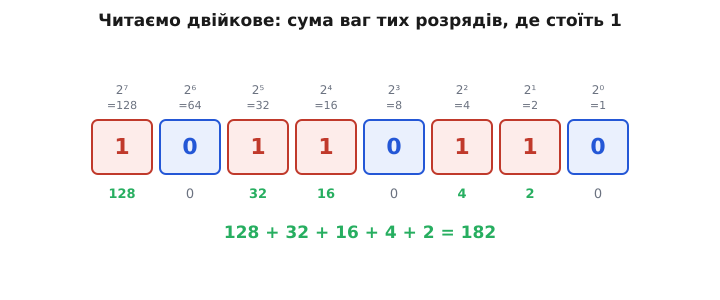
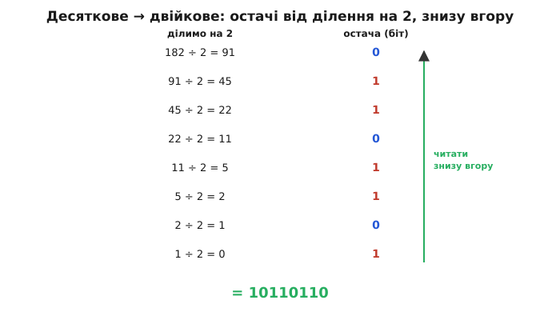
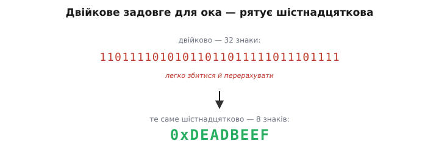
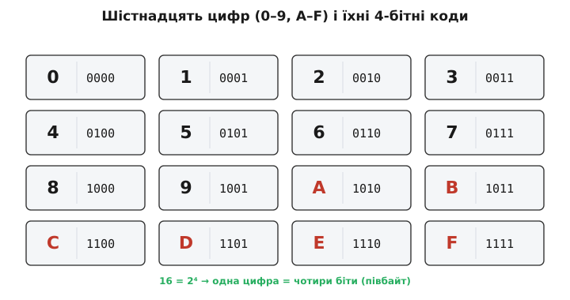
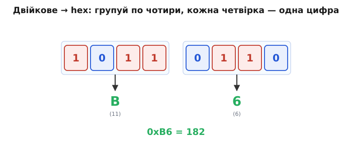

# Позиційні системи: двійкова й шістнадцяткова

Запишіть число 235. Двійка тут не «двісті», а двісті — бо стоїть на місці сотень. Та сама двійка на місці одиниць важила б рівно два. Цифра одна, а внесок різний, і вирішує його **місце**. У цьому весь винахід позиційної системи (від латинського *positio* — «розташування»): значення цифри — це сама цифра, помножена на **вагу її місця**, а вага кожного місця — степінь **основи** (*basis*, грецьке — «підставка, опора»). У звичних нам десяткових числах основа десять, тож місця важать 1, 10, 100, 1000 — степені десятки.

Машина рахує не десятками, а двома станами — є струм або нема, [двійкою](root:math-number-theory/why-binary). Тому її основа — два, і та сама логіка позиційності працює слово в слово, лише степені беруть від двійки. Навчитися читати такий запис, переводити числа туди й назад і — найкорисніше щодня — стискати довгі двійкові числа в шістнадцятковий запис варто кожному, хто бере в руки даташит або пише прошивку.

### Читаємо двійкове: степені двійки

Двійкове число (*binarius*, латинське — «той, що з двох») читають точнісінько як десяткове, лише вага кожного розряду — це степінь двійки, а не десятки. Найправіший розряд важить 2⁰ = 1, наступний ліворуч 2¹ = 2, далі 2² = 4, 2³ = 8, 2⁴ = 16 і так далі — кожен крок ліворуч подвоює вагу. Цифра в розряді буває лише 0 або 1, тож усе зводиться до простого: знайти розряди, де стоїть одиниця, і додати їхні ваги.


*Для 10110110 одиниці стоять на місцях ваги 128, 32, 16, 4 і 2; їхня сума і є число 182. Розряди з нулем нічого не додають, тож усе читання — це знайти одиниці й скласти їхні степені двійки.*

Перші степені двійки — 1, 2, 4, 8, 16, 32, 64, 128, 256, 512, 1024 — варто знати напам'ять: вони трапляються всюди в цифровій техніці, від розмірів пам'яті до меж, за які не може вийти ціла змінна. Маючи їх у голові, ви читаєте байт майже без рахунку.

### Десяткове → двійкове: ділення на два

У зворотний бік — з десяткового в двійкове — працює такий самий механічний прийом, тільки тепер ми не додаємо ваги, а **ділимо на два** й записуємо остачу. Остача від ділення на два — це завжди 0 або 1, і це рівно молодший біт числа: парне дає 0, непарне 1. Саме ділення навпіл відкидає цей біт і зсуває все число на розряд правіше. Повторюємо, доки не дійдемо до нуля, а тоді читаємо стовпчик остач **знизу вгору** — це й буде двійковий запис.


*Ділимо 182 навпіл, щоразу занотовуючи остачу: 182 дає 0, 91 дає 1, 45 дає 1 і так до одиниці. Остачі знизу вгору утворюють 10110110. Працює це тому, що остача від ділення на два — молодший біт, а ділення зсуває число на розряд.*

**Переведімо 182 у двійкове й перевіримо себе зворотним читанням.**

```
182 ÷ 2 = 91, ост. 0   ← молодший біт
 91 ÷ 2 = 45, ост. 1
 45 ÷ 2 = 22, ост. 1
 22 ÷ 2 = 11, ост. 0
 11 ÷ 2 =  5, ост. 1
  5 ÷ 2 =  2, ост. 1
  2 ÷ 2 =  1, ост. 0
  1 ÷ 2 =  0, ост. 1   ← старший біт
остачі знизу вгору      = 1011 0110
перевірка: 128 + 32 + 16 + 4 + 2 = 182   ✓
```

Хто вже тримає степені двійки в голові, переведе ще швидше: відняти найбільший степінь, що вміщається, поставити там одиницю й повторити з рештою. Від 182 віднімаємо 128 (ставимо біт 128), лишається 54; від 54 віднімаємо 32 (біт 32), лишається 22; далі 16, потім 4, потім 2 — і знову виходить 10110110. Обидва шляхи дають один результат, бо обидва просто розкладають число на степені двійки.

### Двійкове задовге для ока

У двійкового запису є одна нестерпна для людини вада — він **довгий**. Восьмибітне число вже вісім символів, а тридцятидвобітне — стіна з тридцяти двох нулів та одиниць поспіль. Прочитати такий рядок, не загубивши розряд і не сплутавши сусідні нулі, майже неможливо; одна пропущена цифра — і число вже інше.


*Те саме значення у двійковому — тридцять два знаки, у яких легко збитися, а шістнадцятково — лише вісім: 0xDEADBEEF (давня «налагоджувальна» позначка, якою заповнювали ще не використану пам'ять, щоб одразу впізнати її в дампі). Число одне, та читати незрівнянно легше.*

Рятунок — записувати двійкові числа в **шістнадцятковій** системі. І в ній схована елегантність, через яку шістнадцяткова — не просто «ще одна основа», а ідеальний **скоропис** саме для двійкового.

### Шістнадцяткова: шістнадцять цифр, кожна — це чотири біти

Шістнадцяткова система має шістнадцять цифр. Перші десять звичні — 0–9, а для значень від десяти до п'ятнадцяти беруть літери: A = 10, B = 11, C = 12, D = 13, E = 14, F = 15. Сама назва видає мішане походження: *hexa* грецьке — «шість», а *decem* латинське — «десять» (історично пробували й суто латинське *sexadecimal*, але прижилася саме ця гібридна форма). Чому основа саме шістнадцять, а не, скажімо, дванадцять? Бо **16 = 2⁴** — і ця рівність робить усе.


*Кожній цифрі відповідає рівно чотири біти: 0 = 0000, 9 = 1001, A = 1010, F = 1111. Оскільки основа є 2⁴, одна шістнадцяткова цифра вкладає в себе точно чотири біти — таку четвірку звуть півбайтом (англійське *nibble* — «кусник», бо це половина байта, що співзвучний з *bite*, «укус»).*

Тут і прихована вся вигода: шістнадцяткова — не довільна основа на кшталт десяткової, що з двійкою «не дружить», а та єдина зручна, яка **точно лягає** на групи по чотири біти. Завдяки цьому переведення між двійковим і шістнадцятковим стає геть тривіальним — без жодного ділення.

### Двійкове ↔ hex: групуємо по чотири

Щоб перевести двійкове число в шістнадцяткове, не треба нічого рахувати — досить **згрупувати** біти по чотири, починаючи справа, і кожну четвірку замінити її шістнадцятковою цифрою. У зворотний бік так само: кожну цифру розписуємо в чотири біти.


*Перша четвірка 1011 — це 8 + 2 + 1 = 11, тобто цифра B; друга 0110 — це 4 + 2 = 6. Разом 0xB6, те саме число 182. Один байт — це завжди рівно дві шістнадцяткові цифри.*

**Переведімо той самий байт 10110110 у hex і перевіримо обидва боки.**

```
1011 0110            ← ділимо байт на дві четвірки
1011 = 8+2+1 = 11 = B
0110 =   4+2 =  6 = 6
                     → 0xB6
перевірка: B·16 + 6 = 11·16 + 6 = 176 + 6 = 182   ✓
```

Записують шістнадцяткове число з префіксом `0x` (як `0xB6`) або з нижнім індексом ₁₆. У прошивці це найчастіше саме `0x`:

```c
uint8_t status = 0xB6;        // = 182 = 0b1011 0110
uint8_t high_nibble = status >> 4;     // 0xB → старший півбайт
uint8_t low_nibble  = status & 0x0F;   // 0x6 → молодший півбайт
```

Така простота — причина, чому шістнадцятковий запис усюди в роботі інженера й програміста. **Адреси пам'яті**, **значення регістрів** мікроконтролера, **байти** в даташитах, **кольори** на вебсторінці (запис `#RRGGBB` — по дві шістнадцяткові цифри на червоний, зелений і синій) пишуть саме так, бо це і компактно, і миттєво зводиться до бітів. Колись із тих самих міркувань уживали ще **вісімкову** систему (*octo* латинське — «вісім», по три біти на цифру), та для восьмибітного байта вона незручна — вісім не ділиться на три без остачі, — і шістнадцяткова її витіснила.

Перемога шістнадцяткової не була випадковою: її закріпив восьмибітний байт системи IBM System/360 (1964), що лягав рівно у дві шістнадцяткові цифри, а форму літер A–F та саму назву остаточно усталили аж під кінець 1960-х. Звідки взялися саме ці цифри й чому вісімкова відступила — [коротка історія запису](root:math-number-theory/positional-systems/hist-hex-notation.md).

> 🔧 **Навіщо це.** Ці навички ви застосовуватимете щодня, тільки-но візьметеся за мікроконтролер. Читати двійкове (додати ваги одиниць) і переводити в нього (ділити на два) — базова грамотність; степені двійки до 1024 тримайте напам'ять. Найпрактичніше ж — **шістнадцятковий запис як ваш робочий запис чисел**: регістр периферії, адресу, бітову маску, колір ви бачитимете й писатимете в `0x…`, і вміння миттєво розкласти цифру в чотири біти (F = 1111, A = 1010, 0 = 0000) рятує, коли треба виставити чи перевірити один окремий біт у регістрі. Тримайте в голові трійцю **один байт = дві шістнадцяткові цифри = вісім бітів** — і дані в даташитах та налагоджувачі читатимуться без зусиль. Шістнадцятковий запис — не «складніша математика», а навпаки, милиця для ока, що береже вас від помилок на довгих двійкових рядках.

Усе це — числа **додатні**. Машині ж потрібні й **від'ємні**, а окремого знака мінус серед самих лише нулів та одиниць немає. Як записати «−5» одними бітами — і так, щоб звичайне додавання саме давало правильний результат, — розв'язує напрочуд хитрий [доповняльний код](root:math-number-theory/twos-complement-algebra).
