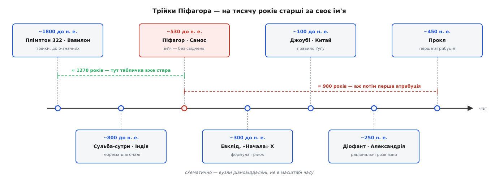

# 📜 Хто знав трійки до Піфагора

Ім'я на теоремі каже «Піфагор», а найстарший відомий список трійок Піфагора старший за нього на добру тисячу років: його видряпали клинописом на глиняній табличці ще тоді, коли до грецького філософа лишалося дванадцять поколінь. Тут ідеться про те, хто насправді володів трійками — Вавилон, Індія, Китай, можливо Єгипет — і як попри все ім'я закріпилося за людиною, яка, судячи з наявних свідчень, їх не відкрила й навіть не перша довела. Це історія, у якій імена й заслуги розходяться, — і видно, чому саме так сталося.


*Ім'я «піфагорові» стоїть не на початку історії трійок, а посередині: за тисячу років до нього трійки вже виписували у Вавилоні, і майже стільки ж минуло від Піфагора до першої згадки, що теорема — його.*

### Глиняна табличка з Ларси

Найдавніший слід — табличка завбільшки з долоню, відома під музейним номером **Плімптон 322** (за іменем колекціонера Джорджа Артура Плімптона, який купив її 1922 року в торговця старожитностями Едґара Бенкса; нині вона в Колумбійському університеті). Походить вона з Сенкере — руїн стародавньої **Ларси** на півдні теперішнього Іраку, а вік її оцінюють приблизно в **1800 років до н. е.**: це старовавилонська доба, і, за оцінкою ассиріологині Елеанор Робсон, табличку зробили десь за шість десятиліть до того, як Ларса впала під Хаммурапі (~1762 до н. е.). Датування й походження — тверді, добре засвідчені факти.

На табличці — чотири стовпці й п'ятнадцять рядків чисел у шістдесятковому (сексагесимальному) записі. Кожен рядок відповідає прямокутному трикутнику з цілими сторонами, тобто [трійці, де a² + b² = c²](root:math-geometry/pythagorean-theorem). І от що вражає: серед них є зовсім не «дитячі». Один рядок дає трійку

```
12709² + 13500² = 18541²
161518681 + 182250000 = 343768681   ✓
```

— числа п'ятизначні (сама табличка виписує два з трьох: коротшу сторону 12709 і гіпотенузу 18541). Таку трійку не намацаєш перебором: якби писар просто пробував трикутник за трикутником, він у житті не наткнувся б на 12709 і 18541. Отже за табличкою стоїть **систематичний спосіб** будувати трійки, а не колекція випадкових знахідок. Це вже не напис-факт, а висновок із даних — але висновок міцний: числа надто великі, щоб пояснити їх щастям.

### Три способи прочитати ту саму табличку

Спосіб був — але який саме? Тут згода закінчується й починаються реконструкції, бо ліву частину таблички відбито, а разом з нею зникло найголовніше — стовпці, з яких писар стартував.

Перша впливова відповідь — Отто Нойгебауера й Абрагама Закса (1945): за кожним рядком стоїть **породжувальна пара** двох чисел, з якої трійка виходить множенням і відніманням — по суті та сама механіка, що згодом проступить у Евкліда. Це реконструкція, і в неї є слабина, на яку вказала Робсон: вона не пояснює, ЧОМУ обрано саме ці пари й саме в такому порядку.

Друге прочитання — Елеанор Робсон (2001–2002), і до нього сьогодні схиляється чимало істориків. Числа таблички — це **пари взаємно обернених** шістдесяткових чисел (x і 1/x), звичайнісінький інструмент вавилонського писаря; а сама табличка радше **навчальна** — заготовка задач, які вчитель роздавав учням. За цю працю Математична асоціація Америки відзначила Робсон нагородою Форда. Ключ тут культурний: трійки народжуються не з абстрактної теорії чисел, а з рутинної арифметики оберненого — того, чим писарі й так рахували щодня. Це теж реконструкція, але вкорінена в реальну писарську практику, а не в наші пізніші звички.

Третє прочитання — найгучніше й найспірніше. Деніел Менсфілд і Норман Вілдберґер (2017) заявили, що Плімптон 322 — це **тригонометрична таблиця**, точніша за будь-яку пізнішу, і що вавилоняни знали тригонометрію за півтори тисячі років до греків. Заголовки рознесла преса, але фахівці зустріли тезу холодно. Робсон називає такі тлумачення анахронічними: у горах інших вавилонських табличок немає й сліду тригонометрії, тож приписати її одній — це вчитати в давній текст пізніший спосіб думки. Тезу варто тримати за **спірну**. Обережність тут не зайва саме тому, що ефектне «вони знали це першими» надто вже гладко лягає в сучасне вухо.

> 🔧 **Навіщо це.** Різниця між «фактом» і «реконструкцією» — не занудство, а межа знання. Що табличка стара й на ній трійки — це факт, який ще можна помацати. Що писар користався тим чи тим методом — це вже наша розповідь про мовчазні числа, і різні розповіді сперечаються за одні й ті самі значки на глині. Плутати одне з одним — значить видавати власний здогад за свідчення давнини.

### Та сама істина в Індії та Китаї

Вавилон не був самотній. За тисячі кілометрів і кількасот років трійки й сама теорема сходили незалежно.

В **Індії** — у ритуальних настановах про побудову вівтарів, **«Сульба-сутрах»** (санскр. *śulba* — мотузка, шнур). Найдавнішу, приписувану Баудгаяні, датують приблизно **800–600 роками до н. е.** У ній прямо сформульовано те, що ми звемо теоремою Піфагора: площа квадрата на діагоналі прямокутника дорівнює сумі площ квадратів на його сторонах. Там-таки — конкретні трійки (3-4-5, 5-12-13, 8-15-17, 12-35-37) і побудова прямого кута натягнутим шнуром. Це формулювання-правило, а не грецький дедуктивний доказ, — але сама істина записана чорним по білому за двісті-триста років до Піфагора. Факт текстовий, не спірний.

У **Китаї** — у трактаті **«Джоубі суань цзін»** (周髀算經, приблизно «класика ґномона Джоу»), що склався остаточно на межі ер (~I ст. до н. е. — I ст. н. е.), хоча ядро його давніше. Там викладено **правило ґуґу** (勾股): у прямокутному трикутнику коротший катет звуть *ґоу* (勾), довший — *ґу* (股), гіпотенузу — *сянь* (弦, «тятива»). У діалозі радника Шан Ґао згадано співвідношення сторін 3-4-5, а математик **Джао Шуан** (III ст. н. е.) у коментарі дав уже справжній наочний доказ — знамениту «діаграму гіпотенузи», де квадрати переставляють доти, доки рівність не стає очевидною. Тобто Китай прийшов не лише до правила, а й до доведення — власного, ні в кого не позиченого.

### Єгипетська мотузка, якої ніхто не бачив

А тепер історія, яку переказують найчастіше — і яка тримається найгірше. Кажуть, ніби єгипетські землеміри натягували шнур із дванадцятьма рівними вузлами, складали його трикутником 3-4-5 і так діставали точний прямий кут для межі поля чи основи храму. Гарно, наочно, і в кожному підручнику.

Розберімо, де тут факт, а де домисел. Землеміри справді були: греки звали їх **гарпедонаптами** (гр. *harpedonáptai* — «натягувачі мотузки», від *harpedón* — шнур і *háptō* — в'язати, натягувати). Про них прямо каже Демокріт (~V ст. до н. е.), хвалячись, що в побудові ліній з доказами його не перевершить ніхто, «навіть так звані натягувачі мотузки в єгиптян». Отже фах, що розмічав прямі кути натягнутим шнуром, — засвідчений.

А от **сама трійка 3-4-5 у їхніх руках — це реконструкція, і то пізня**. У жодному єгипетському папірусі — ні в Рінда, ні деінде — немає ні цієї трійки, ні теореми Піфагора взагалі. Здогад, що вузли лягали саме 3-4-5, пустив в обіг історик математики Моріц Кантор аж наприкінці XIX ст., і відтоді він мандрує з книжки в книжку як «факт». Отож: мотузка, якою тягнули прямі кути, — правда; конкретно 3-4-5 на ній — **правдоподібна легенда без прямих доказів**. Це саме той випадок, коли гарний образ переживає відсутність джерела.

### Чому на теоремі стоїть грецьке ім'я

Отже трійки знали в Месопотамії, Індії, Китаї, а прямий кут мотузкою — вочевидь і в Єгипті. Де ж тут Піфагор Самоський (~570–495 до н. е.)?

Чесна відповідь: у самих трійках — ніде певно. Жодне свідчення його часу не пов'язує його з теоремою; ні Платон, ні Арістотель про такий зв'язок не знають. Найраніша атрибуція — аж у **Прокла**, неоплатоніка **V ст. н. е.**, тобто майже за тисячу років ПІСЛЯ Піфагора. Та й Прокл обачний: пише, що «ті, хто любить дошукуватися давнини», відносять теорему до Піфагора, — а не стверджує цього від себе. До того ж тягнеться легенда, ніби Піфагор на радощах від відкриття приніс у жертву бика (а то й гекатомбу — сотню волів). Вона спирається на два віршовані рядки, приписані такому собі Аполлодорові-обчислювачу, а вже Ціцерон переповідає її здрібнілою — не гекатомба, а один-однісінький бик. Красива оповідка — але саме оповідка.

Що ж тоді справді грецьке? **Доказ і формула як загальний закон.** Греки перші стали вимагати не «оце працює», а «оце НЕ МОЖЕ бути інакше, і ось чому». Саму формулу трійок — a = m² − n², b = 2mn, c = m² + n² — записав **Евклід** у «Началах» (близько 300 до н. е.), у книзі X, як лему, ймовірно старшу за решту книги. А **Діофант Александрійський** (~III ст. н. е.) в «Арифметиці» навчився параметризувати раціональні розв'язки — той самий підхід, що через півтори тисячі років приведе до погляду на трійки як на раціональні точки кола. Ім'я «піфагорові» дісталося трійкам не тому, що Піфагор їх знайшов, а тому, що грецька традиція — школа, яку він заснував, і пізніші коментатори — зробила його символом усього напряму. Заслуга греків реальна: перетворити спостереження на доведену теорему. Але вона не зовсім там, куди показує ім'я.

Так ярлик традиції заступив запис авторства. Трійки Піфагора не належать ні одній людині, ні одному народові: їх незалежно намацали писарі Ларси, укладачі «Сульба-сутр», автори «Джоубі»; грецьке ж ім'я стоїть на них тому, що саме грецька гілка навчила питати «чому» — і саме її голос дійшов до нас найгучніше. У давній математиці так буває часто: ім'я зберігає не першовідкривача, а того, чиїми руками знання перейшло далі.
