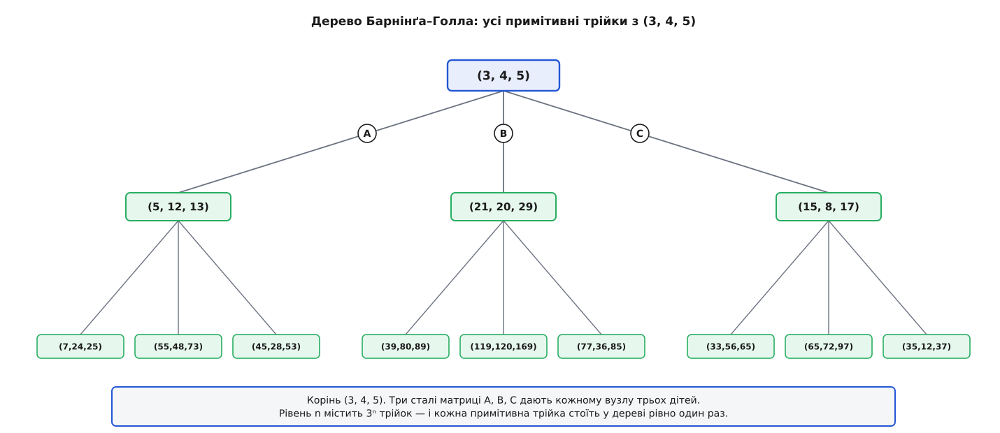

# ⚙️ Перелічити всі трійки Піфагора: перебір Евкліда і дерево матриць

Формула a = m² − n², b = 2mn, c = m² + n² каже, **з чого** трійка складається; та коли треба виписати трійки **всі до заданої межі, кожну рівно раз**, постає окрема, суто програмістська задача — з власними пастками, на яких спотикаються навіть ті, хто формулу знає напам'ять. Ось два способи це зробити, з робочим кодом до кожного: прямий перебір за Евклідом і обхід дерева цілочислових матриць, де кожна примітивна трійка з'являється точно один раз.

## Що саме перелічуємо

Спершу домовмося про межу — від неї залежить увесь код. Найчастіше обмежують **гіпотенузу**: видати всі (a, b, c) з a² + b² = c² і c ≤ N. Це природний вибір, бо гіпотенуза — найбільша сторона, тож, приборкавши її, приборкуємо трикутник цілком. (Іноді межу кладуть на периметр a + b + c або на більший катет — тоді міняється лише умова відсіву, а кістяк алгоритму той самий.)

Друга розвилка — потрібні **всі** трійки чи лише **примітивні**. Різниця істотна: (6, 8, 10) — це подвоєна (3, 4, 5), та сама форма в іншому масштабі, а примітивна трійка — та, чиї сторони [не мають спільного дільника, більшого за 1](topic:math-number-theory/gcd-euclidean). Кожна трійка єдиним способом розкладається як «примітивна × k», тому стратегія завжди однакова: **згенерувати примітивні, а тоді, за потреби, домножити кожну на k = 1, 2, 3…**, доки не перетнемо межу. Обидва способи нижче віддають саме примітивні; масштабування — спільна надбудова над ними.

## Спосіб перший: прямий перебір за Евклідом

Ідея лежить на поверхні. Кожна примітивна трійка приходить рівно з однієї пари (m, n), де m > n > 0, числа взаємно прості й різної парності. Отже досить пробігти всі такі пари й для кожної скласти трійку. Питання одне: доки бігти?

Гіпотенуза дорівнює c = m² + n². Для фіксованого m вона найменша при n = 1 і становить m² + 1. Щойно m² + 1 перевищить N, жодне більше n уже не врятує — усі трійки з таким m завеликі. Звідси стеля для m: m ≤ ⌊√N⌋. А всередині, за фіксованого m, цикл по n можна обірвати, тільки-но m² + n² перескочить N, бо далі n лише зростає.

:::tabs
```python
from math import gcd, isqrt

def primitive_triples(limit):
    """Усі примітивні трійки з гіпотенузою c ≤ limit."""
    for m in range(2, isqrt(limit) + 1):
        for n in range(1, m):
            c = m * m + n * n
            if c > limit:
                break                       # більші n лише збільшать c
            if (m - n) % 2 == 1 and gcd(m, n) == 1:   # різна парність + взаємна простота
                a, b = m * m - n * n, 2 * m * n
                yield (min(a, b), max(a, b), c)
```
```cpp
#include <cstdint>
#include <numeric>   // std::gcd
#include <utility>   // std::swap
#include <vector>

using u64 = uint64_t;
struct Triple { u64 a, b, c; };

// Усі примітивні трійки з гіпотенузою c ≤ limit.
std::vector<Triple> primitive_triples(u64 limit) {
    std::vector<Triple> out;
    for (u64 m = 2; m * m + 1 <= limit; ++m) {
        for (u64 n = 1; n < m; ++n) {
            u64 c = m * m + n * n;
            if (c > limit) break;                          // більші n лише збільшать c
            if (((m - n) & 1u) && std::gcd(m, n) == 1) {   // різна парність + взаємна простота
                u64 a = m * m - n * n, b = 2 * m * n;
                if (a > b) std::swap(a, b);
                out.push_back({a, b, c});
            }
        }
    }
    return out;
}
```
:::

Щоб дістати з примітивних **усі** трійки до межі, кожну домножуємо на k, доки гіпотенуза влазить, — надбудова однакова будь-якою мовою:

```python
def all_triples(limit):
    """Усі трійки (примітивні та кратні) з c ≤ limit, кожна рівно раз."""
    for a, b, c in primitive_triples(limit):     # або primitive_tree(limit) з другого способу
        k = 1
        while k * c <= limit:
            yield (k * a, k * b, k * c)
            k += 1
```

Тепер пастки — кожна відкушує по шматку правильності, якщо її проґавити.

**Впорядкування катетів.** a = m² − n² не завжди менше за b = 2mn. Пара (2, 1) дає a = 3, b = 4 — катет a менший; а пара (5, 2) дає a = 21, b = 20 — уже a більший! Якщо код десь порівнює трійки або складає їх у множину, щоб відсіяти повтори, він визнає (20, 21, 29) і (21, 20, 29) різними — і та сама трійка потрапить двічі. Ліки прості: перед видачею впорядкувати катети, min(a, b) поперед max(a, b) — саме це роблять min/max у коді.

**Куди прикладати межу.** Обмежуємо ми гіпотенузу c = m² + n², і саме звідси випливає стеля циклу m ≤ √N. Спокуса написати `for m in range(2, N)` дає правильний результат, але жене цикл у корінь-із-N разів довше, ніж треба. Гірша ж помилка — обмежити не ту величину: якщо накласти межу на катет m² − n², дістанете зовсім інший набір, а не «всі трійки з гіпотенузою до N». Спершу вирішіть, що саме обмежуєте, і аж тоді виводьте стелю циклу з цього.

**Чому самого gcd мало.** Якщо перевіряти лише gcd(m, n) = 1, а про різну парність забути, крізь фільтр пройдуть і пари з двох непарних (скажімо, m = 3, n = 1 — взаємно прості). Але тоді a = m² − n² парне, b = 2mn парне, c = m² + n² парне — уся трійка парна, тобто це подвоєна менша примітивна. Вона не примітивна й, що гірше, ви **однаково** дістанете її, масштабуючи іншу трійку, — отже порахуєте двічі. Умова «різна парність» тут не оздоба, а запобіжник від дублів: разом із gcd(m, n) = 1 вона дає точну відповідність «пара ↔ примітивна трійка».

Скільки це коштує? Пар (m, n) з m² + n² ≤ N рівно стільки, скільки цілих точок у чверті круга радіуса √N, тобто ≈ (π/4)·N — [лінійно від N](topic:computability/asymptotic-complexity). Кожна пара — це один [gcd](topic:math-number-theory/gcd-euclidean) за O(log N). Разом на всі примітивні до межі виходить O(N log N), а масштабування додає рівно стільки роботи, скільки трійок на виході. Швидко й прямо.

## Спосіб другий: дерево Барнінґа–Голла

У першому способі муляє одна річ: ми **породжуємо кандидатів і відсіюємо** — рахуємо gcd, звіряємо парність, викидаємо непримітивні. А чи не можна генерувати самі лише примітивні, без жодного відсіву, щоб кожна виходила рівно раз уже за побудовою? Можна — і механізм на диво елегантний: множення на цілі [матриці](topic:math-algebra/matrices-as-operations).

Ось факт, який спершу здається неймовірним. Візьміть найменшу трійку (3, 4, 5). Існують три сталі матриці 3×3 — назвімо їх A, B, C, — і кожна, помножена на стовпчик (a, b, c)ᵀ, перетворює одну примітивну трійку на іншу. Почавши з (3, 4, 5) і застосовуючи ці три матриці знову й знову, ви породите **кожну примітивну трійку, і кожну точно один раз**: жодних пропусків, жодних повторів. Це і є дерево — у корені (3, 4, 5), у кожного вузла рівно троє дітей (через A, B, C), рівень n містить 3ⁿ трійок.

```
        ⎡ 1  −2   2⎤        ⎡ 1   2   2⎤        ⎡−1   2   2⎤
    A = ⎢ 2  −1   2⎥    B = ⎢ 2   1   2⎥    C = ⎢−2   1   2⎥
        ⎣ 2  −2   3⎦        ⎣ 2   2   3⎦        ⎣−2   2   3⎦
```

Перевірмо на корені — кожен рядок матриці на стовпчик (3, 4, 5):

```
A·(3,4,5)ᵀ = ( 1·3 − 2·4 + 2·5,  2·3 − 1·4 + 2·5,  2·3 − 2·4 + 3·5 ) = ( 5, 12, 13)
B·(3,4,5)ᵀ = ( 1·3 + 2·4 + 2·5,  2·3 + 1·4 + 2·5,  2·3 + 2·4 + 3·5 ) = (21, 20, 29)
C·(3,4,5)ᵀ = (−1·3 + 2·4 + 2·5, −2·3 + 1·4 + 2·5, −2·3 + 2·4 + 3·5 ) = (15,  8, 17)
```

Три нові примітивні трійки — і жодного gcd, жодного квадратного кореня, самі додавання й множення.


*Корінь (3, 4, 5). Три сталі матриці A, B, C дають кожному вузлу трьох дітей; рівень n містить 3ⁿ трійок, і кожна примітивна трійка стоїть у дереві рівно один раз.*

Це відкрив нідерландський математик Ф. Я. М. Барнінґ 1963 року (звіт Математичного центру в Амстердамі), а сім років по тому, незалежно, А. Голл — у статті «Genealogy of Pythagorean triads» (The Mathematical Gazette, 1970). Обидва натрапили на ту саму трійцю унімодулярних матриць; відтоді дерево так і звуть — Барнінґа–Голла.

> 🔧 **Навіщо це.** Дерево дає кожній примітивній трійці **родовід**: шлях від кореня (3, 4, 5) — це послідовність літер A, B, C, унікальний «штрих-код» трійки, яким її можна закодувати, порівняти чи відтворити з нуля. А ще воно сипле мільйони примітивних трійок без жодного відсіву й без наближених коренів — самими цілими, — що безцінно для тестів геометричного коду, де (5, 12, 13) чи (7, 24, 25) дають точну рівність там, де наближений √ сховав би ваду.

Щоб деревом перелічити трійки **до межі**, потрібна одна властивість: у кожної дитини гіпотенуза строго більша, ніж у батька. Тоді, дійшовши до вузла з c > N, можна сміливо відтяти всю гілку — глибше буде тільки більше. Чому так? Нижній рядок кожної матриці задає нову гіпотенузу:

```
A:  c′ =  2a − 2b + 3c ,   c′ − c = 2(a + c − b) > 0   (бо c > b, a > 0)
B:  c′ =  2a + 2b + 3c ,   c′ − c = 2(a + b + c) > 0
C:  c′ = −2a + 2b + 3c ,   c′ − c = 2(b + c − a) > 0   (бо c > a, b > 0)
```

Гіпотенуза завжди більша за будь-який катет, тож обидві різниці додатні — гіпотенуза росте на кожному кроці вглиб. Обхід у ширину (черга: виймаємо вузол, ставимо в неї трьох його дітей) із таким відтином:

:::tabs
```python
from collections import deque

# Три матриці Барнінґа–Голла — діють на стовпчик (a, b, c)ᵀ.
A = (( 1, -2, 2), ( 2, -1, 2), ( 2, -2, 3))
B = (( 1,  2, 2), ( 2,  1, 2), ( 2,  2, 3))
C = ((-1,  2, 2), (-2,  1, 2), (-2,  2, 3))

def times(M, t):
    a, b, c = t
    return tuple(r[0] * a + r[1] * b + r[2] * c for r in M)

def primitive_tree(limit):
    """Усі примітивні трійки з c ≤ limit — обхід дерева від (3, 4, 5)."""
    if limit < 5:
        return
    q = deque([(3, 4, 5)])
    while q:
        a, b, c = q.popleft()
        yield (min(a, b), max(a, b), c)
        for M in (A, B, C):
            child = times(M, (a, b, c))
            if child[2] <= limit:            # гіпотенуза дитини завжди більша за батькову
                q.append(child)
```
```cpp
#include <array>
#include <cstdint>
#include <queue>
#include <utility>   // std::swap
#include <vector>

using i64 = int64_t;
using Triple = std::array<i64, 3>;
using Mat = std::array<std::array<int, 3>, 3>;

// Три матриці Барнінґа–Голла — діють на стовпчик (a, b, c)ᵀ.
static const Mat A = {{{ 1, -2, 2}, { 2, -1, 2}, { 2, -2, 3}}};
static const Mat B = {{{ 1,  2, 2}, { 2,  1, 2}, { 2,  2, 3}}};
static const Mat C = {{{-1,  2, 2}, {-2,  1, 2}, {-2,  2, 3}}};

Triple times(const Mat& M, const Triple& t) {
    return {{ M[0][0]*t[0] + M[0][1]*t[1] + M[0][2]*t[2],
              M[1][0]*t[0] + M[1][1]*t[1] + M[1][2]*t[2],
              M[2][0]*t[0] + M[2][1]*t[1] + M[2][2]*t[2] }};
}

// Усі примітивні трійки з c ≤ limit — обхід дерева від (3, 4, 5).
std::vector<Triple> primitive_tree(i64 limit) {
    std::vector<Triple> out;
    if (limit < 5) return out;
    std::queue<Triple> q;
    q.push({{3, 4, 5}});
    while (!q.empty()) {
        Triple t = q.front(); q.pop();
        Triple s = t;
        if (s[0] > s[1]) std::swap(s[0], s[1]);
        out.push_back(s);
        for (const Mat& M : {A, B, C}) {
            Triple ch = times(M, t);
            if (ch[2] <= limit) q.push(ch);      // дитина завжди «глибша» за гіпотенузою
        }
    }
    return out;
}
```
:::

Пастки тут інші, ніж у Евкліда.

**Порядок (непарний, парний, гіпотенуза).** Матриці зберігають не «менший катет, більший катет», а «непарний катет, парний катет, гіпотенуза». У (15, 8, 17) непарний катет 15 стоїть першим, дарма що більший за 8. Тож сирий вивід дерева **не впорядкований** за розміром катетів; якщо треба a < b, катети на виході сортують (min/max).

**Дерево — не «за зростанням».** Обхід у ширину видає трійки рівнями дерева, а не за зростанням гіпотенузи: (7, 24, 25) — уже онук, тимчасом як (5, 12, 13) з першого рівня має меншу гіпотенузу. Якщо потрібне саме «за зростанням c», зберіть усі й відсортуйте наприкінці — або ведіть обхід чергою з пріоритетом за c замість звичайної черги.

**Відтинати за c, а не за глибиною.** Гілки ростуть із дуже різною швидкістю (матриця B майже потроює гіпотенузу, а A додає значно менше), тож однакова глибина дає геть різні розміри. Єдиний правильний критерій відтину — «додаю дитину в чергу, лише якщо її c ≤ N».

**Переповнення.** По найшвидшій гілці (весь час B) гіпотенуза росте приблизно втричі на рівень — експоненційно з глибиною. Для великих N у C++ беріть 64-бітні цілі й пильнуйте межу, інакше на глибині близько сорока `int` тихо переповниться. Python оперує довгими цілими сам, тож там страшне не переповнення, а пам'ять, якщо межа велетенська.

Складність тут приємніша: обхід робить рівно стільки кроків, скільки є примітивних трійок до межі (їх ≈ N / 2π), і кожен крок — це дев'ять множень та кілька додавань, тобто O(1) без жодного gcd. Дерево не витрачає ані такту на кандидатів, яких відкине, — на відміну від перебору Евкліда, де частину пар (m, n) з'їдають перевірки парності й взаємної простоти.

## Який спосіб коли

Потрібні **всі** трійки до N разом із кратними, швидко й без мороки — беріть Евкліда: короткий, зрозумілий, лінійний. Потрібні **лише примітивні**, багато й без жодного відсіву — беріть дерево: кожна виходить рівно раз за побудовою, самими цілими, ще й із родоводом. Це той самий нескінченний рід трійок, записаний двома абетками: Евклід іменує трійку парою чисел (m, n), а дерево — словом із літер A, B, C.
