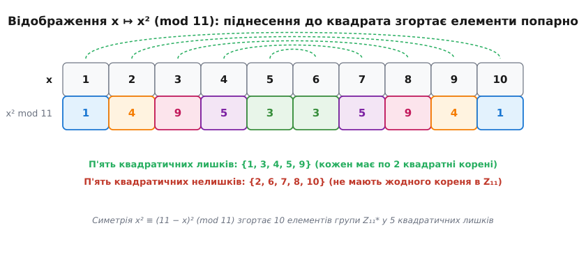
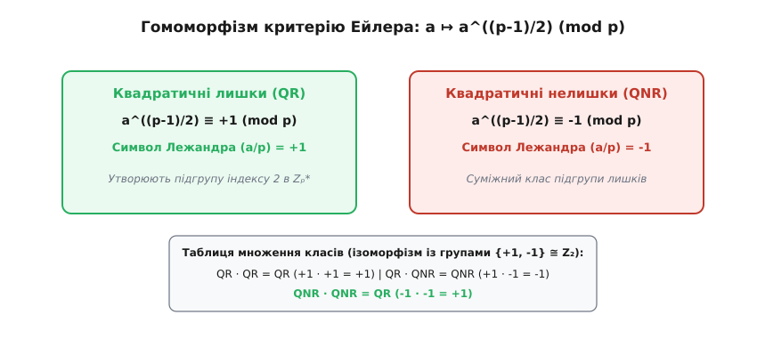
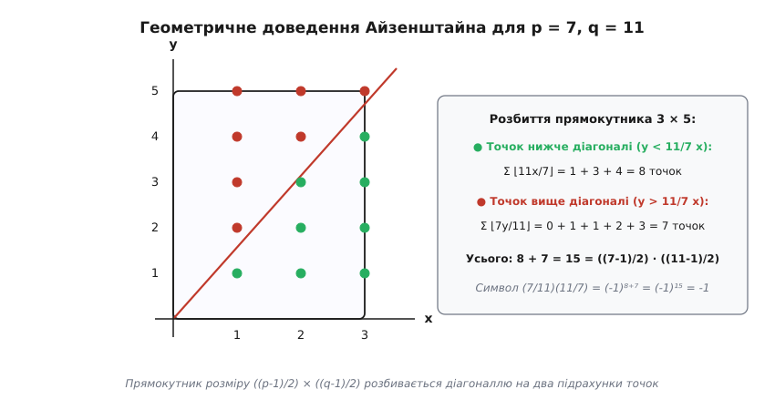
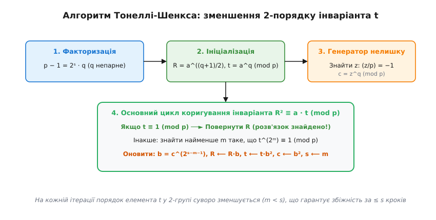

# Квадратичні лишки

<preknowlist>
- [Модульна арифметика](topic:math-number-theory/modular-arithmetic) — кільце запів ℤₘ, додавання, множення та зведення за модулем m.
- [Мала теорема Ферма](topic:math-number-theory/fermat-little-theorem) — тотожність a^(p-1) ≡ 1 (mod p) для непарного простого p та a ≢ 0 (mod p).
- [Первісні корені](topic:math-number-theory/primitive-root) — циклічна структура мультиплікативної групи ℤₚ* та існування твірного елемента.
- [Обернений елемент за модулем](topic:math-number-theory/modular-inverse) — розширений алгоритм Евкліда для знаходження a⁻¹ mod m.
</preknowlist>

У той час як лінійне порівняння `a·x ≡ b (mod m)` завжди легко розв'язується за допомогою НСД та розширеного алгоритму Евкліда, перехід до другого степеня `x² ≡ a (mod m)` кардинально змінює алгебраїчний ландшафт. Якщо спробувати обчислити квадрати за модулем `7`, то піднесення послідовних чисел `1, 2, 3, 4, 5, 6` до квадрата дає лише залишки `1, 4, 2, 2, 4, 1`. Рівняння `x² ≡ 2 (mod 7)` має два розв'язки (`x = 3` та `x = 4`), тоді як порівняння `x² ≡ 3 (mod 7)` чи `x² ≡ 5 (mod 7)` не має жодного розв'язку серед цілих чисел. Кільце залишків розпадається на дві рівні фундаментальні категорії: ті числа, з яких можна добути квадратний корінь, і ті, з яких корінь добути неможливо в принципі.

Ця нелінійна природа квадратичних порівнянь породжує фундаментальну асиметрію, яка лежить в основі сучасної теорії чисел та практичної криптографії. Знаходження квадратного кореня або перевірка спроможності розв'язку вимагає не просто механічних арифметичних дій, а глибокого аналізу мультиплікативної структури скінченних полів, геометрії решіток та незвідних розширень.

---

### 1. Проблема квадратного кореня у модулярній арифметиці

Нехай `m` — ціле число, більше за одиницю. Ціле число `a`, взаємно просте з `m` (тобто `НСД(a, m) = 1`), називається **квадратичним лишком** за модулем `m`, якщо існує хоча б одне ціле число `x`, таке що:

```
x² ≡ a (mod m)
```

Якщо ж таке число `x` не існує, але `НСД(a, m) = 1`, то число `a` називається **квадратичним нелишком** за модулем `m`. Якщо `НСД(a, m) > 1`, число `a` вважається тривіальним або діленим на модуль і виключається з аналізу мультиплікативної групи.

Для довільного модуля `m` множина всіх елементів, взаємно простих із `m`, утворює мультиплікативну групу залишків `ℤₘ*` порядку `φ(m)`, де `φ` — функція Ейлера. Задача визначення того, чи належить дане `a` до підгрупи квадратів, є базовим питанням теорії чисел.

#### Часова складність та апаратна редукція

У практичних обчислювальних системах та алгоритмах довгої арифметики добування квадратного кореня за простою модулем `p` має логарифмічну часову складність `O(log⁴ p)` за кількістю бітових операцій (або `O(log² p)` множень у разі використання апаратного прискорення редукцією Монтгомері). Швидка попередня перевірка символу Лежандра `(a/p)` дозволяє апаратному забезпеченню відсіювати безнадійні запити з квадратичними нелишками на першому ж кроці обчислень, уникаючи ресурсоємних процедур у силівських 2-підгрупах та запобігаючи виснаженню обчислювальних ресурсів криптосерверів.

#### Зведення загального квадратного порівняння до канонічного вигляду

Дослідження довільного квадратного порівняння з трьома коефіцієнтами вигляду:

```
A·x² + B·x + C ≡ 0 (mod p)
```

де `p` — непарне просте число, а `A ≢ 0 (mod p)`, легко зводиться до вивчання квадратичних лишків за допомогою класичного методу виділення повного квадрата.

Оскільки `p` непарне, число `4A` є взаємно простим із `p`, а отже, має обернений елемент у полі `ℤₚ`. Помноживши обидві частини порівняння на `4A`:

```
4A²·x² + 4AB·x + 4AC ≡ 0 (mod p)
```

Додавши та віднявши `B²`, перегрупуємо доданки:

```
(2Ax + B)² - (B² - 4AC) ≡ 0 (mod p)
```

Позначивши `y = 2Ax + B mod p` та дискримінант `D = B² - 4AC mod p`, ми отримуємо канонічне порівняння:

```
y² ≡ D (mod p)
```

Отже, вихідне порівняння `A·x² + B·x + C ≡ 0 (mod p)` має розв'язки тоді й лише тоді, коли дискримінант `D` є квадратичним лишком за модулем `p` (або `D ≡ 0 mod p`). Знайшовши значення `y`, початкові корені `x` обчислюються за лінійною формулою `x ≡ (2A)⁻¹ · (y - B) (mod p)`.

#### Підйом розв'язків за лемою Гензеля за модулем степеня pᵏ

Якщо відомо розв'язок `x₁` порівняння `x² ≡ a (mod p)`, виникає питання: як знайти корені за модулем степеня простого числа `x² ≡ a (mod pᵏ)`?

Замість повторного розв'язування задачі для великого модуля `pᵏ`, **лема Гензеля** дозволяє ітеративно «піднімати» розв'язок `xₖ` за модулем `pᵏ` до розв'язку `xₖ₊₁` за модулем `pᵏ⁺¹`.

Якщо `xₖ² ≡ a (mod pᵏ)`, ми шукаємо розв'язок `xₖ₊₁` у вигляді `xₖ₊₁ = xₖ + t · pᵏ`. Підставивши цей вираз:

```
(xₖ + t · pᵏ)² = xₖ² + 2 · xₖ · t · pᵏ + t² · p²ᵏ ≡ a (mod pᵏ⁺¹)
```

Оскільки `2k ≥ k + 1` при `k ≥ 1`, доданок `t² · p²ᵏ` ділиться на `pᵏ⁺¹` і зникає. Скоротивши вираз на `pᵏ`, отримуємо лінійне порівняння відносно коефіцієнта `t`:

```
2 · xₖ · t ≡ (a - xₖ²) / pᵏ (mod p)
```

Оскільки `НСД(2·xₖ, p) = 1`, коефіцієнт `t` обчислюється однозначно за один крок множення на обернений елемент `(2·xₖ)⁻¹ mod p`.

#### Простеження підйому Гензеля: x² ≡ 2 (mod 49)

1. Для модуля `p = 7` порівняння `x² ≡ 2 (mod 7)` має розв'язок `x₁ = 3` (бо `3² = 9 ≡ 2 mod 7`).
2. Шукаємо розв'язок `x₂` за модулем `7² = 49` у вигляді `x₂ = 3 + 7t`.
3. Обчислюємо різницю: `(a - x₁²) / 7 = (2 - 9) / 7 = -1`.
4. Складаємо лінійне порівняння для `t`: `2 · 3 · t ≡ 6t ≡ -1 ≡ 6 (mod 7)`.
5. Скорочуємо на 6: `t ≡ 1 (mod 7)`.
6. Отримуємо корінь `x₂ = 3 + 7 · 1 = 10`.
7. Перевірка за модулем 49: `10² = 100 = 2 · 49 + 2 ≡ 2 (mod 49)` ✓.

Завдяки лемі Гензеля складна задача розв'язування порівнянь вищого степеня `x² ≡ a (mod pᵏ)` зводиться до одного виклику Тонеллі-Шенкса за модулем `p` та `k - 1` простих лінійних кроків підйому!

#### Фундаментальна відмінність простих та складених модулів

Поведінка квадратних коренів докорінно змінюється при переході від простого модуля `p` до складеного модуля `n = p · q`.

У полі залишків `ℤₚ` (де `p` — просте число) порівняння `x² ≡ a (mod p)` може мати **максимум 2 розв'язки** (що безпосередньо випливає з теореми Лагранжа про корені многочлена над полем). Якщо `x₁` є розв'язком, то другим розв'язком є `x₂ = p - x₁`.

Проте у кільці залишків `ℤₙ` за складеним модулем `n = p · q` (де `p` та `q` — різні непарні прості числа) порівняння `x² ≡ a (mod n)` у випадку існування розв'язку має **рівно 4 розв'язки**!

За Китайською теоремою про залишки (CRT), порівняння `x² ≡ a (mod n)` еквівалентне системі двох незалежних порівнянь:

```
x² ≡ a (mod p)
x² ≡ a (mod q)
```

Нехай розв'язками першого порівняння є `±r`, а другого — `±s`. Комбінуючи ці корені за допомогою системи Китайської теореми про залишки, ми отримуємо 4 різні розв'язки за модулем `n`:
- `x₁ ≡ (+r mod p, +s mod q)`
- `x₂ ≡ (-r mod p, -s mod q) ≡ -x₁ (mod n)`
- `x₃ ≡ (+r mod p, -s mod q)`
- `x₄ ≡ (-r mod p, +s mod q) ≡ -x₃ (mod n)`

#### Проблема розрізнення квадратичних лишків (QRP)

Для складеного модуля `n = p · q` обчислення символу Якобі `(a/n) = (a/p) · (a/q)` дає значення `+1` у двох принципово різних випадках:
1. `(a/p) = +1` та `(a/q) = +1`: число `a` є **справжнім квадратичним лишком** за модулем `n` (існує 4 корені).
2. `(a/p) = -1` та `(a/q) = -1`: число `a` є **псевдолишком (нелишком)** за модулем `n` (жодного розв'язку не існує, але символ Якобі все одно дорівнює `(-1)·(-1) = +1`).

**Проблема розрізнення квадратичних лишків (Quadratic Residuosity Problem, QRP)** полягає у розрізненні справжніх лишків від псевдолишків серед елементів з `(a/n) = +1`. Без знання множників `p` та `q` ця задача вважається обчислювально нерозв'язною для модулів розміром від 2048 біт, що є фундаментом криптографічних протоколів Голдвассер-Мікалі та генератора BBS.

---

### 2. Алгебраїчна структура та розбиття 50/50

Нехай `p` — непарне просте число. Мультиплікативна група `ℤₚ* = {1, 2, …, p-1}` містить рівно `p - 1` елементів і є циклічною групою.

#### Теорема про рівну кількість лишків та нелишків

У мультиплікативній групі `ℤₚ*` для непарного простого `p` існує рівно `(p-1)/2` квадратичних лишків та рівно `(p-1)/2` квадратичних нелишків.

#### Алгебраїчне доведення через відображення згортання

Розглянемо відображення піднесення до квадрата `f: ℤₚ* → ℤₚ*`, яке задається формулою `f(x) = x² mod p`.

Якщо `x² ≡ y² (mod p)`, то за формулою різниці квадратів:

```
x² - y² = (x - y) · (x + y) ≡ 0 (mod p)
```

Оскільки `p` — просте число, воно є елементом цілісного кільця і не містить дільників нуля. Отже, `p` мусить ділити або `(x - y)`, або `(x + y)`. Це означає, що порівняння `x² ≡ y² (mod p)` виконується тоді й лише тоді, коли `x ≡ y (mod p)` або `x ≡ -y ≡ p - y (mod p)`.

Таким чином, кожний квадратичний лишок `a` має точно два протилежних корені у групі `ℤₚ*`: число `x` та число `p - x`. Оскільки жоден елемент `x` не може дорівнювати своєму протилежному `p - x` у полі `ℤₚ` при непарному `p` (бо це вимагало б `2x ≡ 0 mod p ⇒ x ≡ 0`, що неможливо для `x ∈ ℤₚ*`), усі `p - 1` елементів групи `ℤₚ*` розбиваються на `(p-1)/2` неперетинних пар `{x, p - x}`. Кожна така пара при піднесенні до квадрата дає один і той самий лишок.


*Рис. 1: Геометричне відображення згортання елементів x та p-x у квадратичні лишки за модулями p = 7 та p = 11.*

Оскільки множина квадратичних лишків є образом відображення `f(x) = x² mod p`, загальна кількість лишків строго дорівнює кількості неперетинних пар, тобто `(p-1)/2`. Відповідно, кількість нелишків дорівнює різниці `(p - 1) - (p-1)/2 = (p-1)/2`. █

#### Ізоморфізм через первісний корінь та дискретний логарифм

Найглибше розуміння структури квадратичних лишків дає теорія **первісних коренів**. За теоремою про первісний корінь, мультиплікативна група `ℤₚ*` є циклічною. Це означає, що існує твірний елемент `g ∈ ℤₚ*` (первісний корінь), степені якого `g⁰, g¹, g², …, gᵖ⁻²` вичерпують усі `p - 1` елементів групи `ℤₚ*`.

Будь-який елемент `a ∈ ℤₚ*` можна єдиним чином представити у вигляді `a ≡ gᵏ (mod p)`, де `k ∈ {0, 1, …, p-2}` — дискретний логарифм (або індекс) елемента `a` за основою `g`.

Розглянемо порівняння `x² ≡ a (mod p)`. Запишемо `x` та `a` через степені генератора `g`: `x ≡ gᵐ (mod p)` та `a ≡ gᵏ (mod p)`.
Тоді порівняння перетворюється на вираз у показниках степенів:

```
(gᵐ)² = g^(2m) ≡ gᵏ (mod p)
```

Оскільки порядок первісного кореня `g` дорівнює `p - 1`, ця тотожність еквівалентна лінійному порівнянню в кільці залишків за модулем `p - 1`:

```
2m ≡ k (mod p - 1)
```

Це лінійне порівняння має розв'язок відносно `m` тоді й лише тоді, коли `НСД(2, p - 1) = 2` ділить показник `k`. Оскільки `p` — непарне просте число, `p - 1` є парним числом.

Отже, порівняння `2m ≡ k (mod p - 1)` має розв'язок тоді й лише тоді, коли **показник k є парним числом**!

Звідси випливає фундаментальний критерій:
- **Квадратичні лишки** — це елементи, які є **парними степенями** первісного кореня: `a ≡ g⁰, g², g⁴, …, gᵖ⁻³ (mod p)`.
- **Квадратичні нелишки** — це елементи, які є **непарними степенями** первісного кореня: `a ≡ g¹, g³, g⁵, …, gᵖ⁻² (mod p)`.

Оскільки серед чисел `{0, 1, 2, …, p-2}` є рівно `(p-1)/2` парних та `(p-1)/2` непарних індексів, ми знову отримуємо строге підтвердження розбиття 50/50.

#### Точна послідовність та фактор-група

У термінах теорії груп підгрупа квадратичних лишків `QRₚ = ℤₚ*²` утворює ядро мультиплікативного характерного гомоморфізму:

```
1 ⟶ {+1, -1} ⟶ ℤₚ* ⟶ C₂ ⟶ 1
```

Фактор-група `ℤₚ* / QRₚ` є ізоморфною циклічній групі другого порядку `C₂`. Кожен суміжний клас складається з `(p-1)/2` елементів. Один клас дає підгрупу лишків, а другий — множину нелишків.

З цієї ізоморфної відповідності `a ↦ k mod 2` випливають точні правила множення знаків:

1. **Лишок × Лишок = Лишок:**
   `g^(2i) · g^(2j) = g^(2(i+j))`, що відповідає додаванню двох парних чисел: `парне + парне = парне`.
2. **Лишок × Нелишок = Нелишок:**
   `g^(2i) · g^(2j+1) = g^(2(i+j)+1)`, що відповідає виразу: `парне + непарне = непарне`.
3. **Нелишок × Нелишок = Лишок:**
   `g^(2i+1) · g^(2j+1) = g^(2(i+j+1))`, що відповідає виразу: `непарне + непарне = парне`.

Ці правила показують, що гомоморфізм знаків на групі залишків повністю аналогічний арифметиці парності або множенню дійсних чисел `(+1)·(+1) = +1`, `(+1)·(-1) = -1`, `(-1)·(-1) = +1`.

#### Розподіл лишків на коротких інтервалах та нерівність Поліа-Виноградова

У аналітичній теорії чисел фундаментальним питанням є псевдовипадковість розподілу знаків символів Лежандра `(n/p)` у послідовних цілих числах `n = 1, 2, 3, ...`.

Чи розподілені квадратичні лишки та нелишки рівномірно? **Нерівність Поліа-Виноградова** (Polya-Vinogradov inequality, 1918) встановлює суворий верхній межу для суми залишків на довільному інтервалі довжини `M`:

```
| ∑_{n=N+1}^{N+M} (n/p) | < √p · ln p
```

Це означає, що відхилення кількості лишків від кількості нелишків на будь-якому відрізку не може перевищувати `O(√p · log p)`. Знаки символу Лежандра поводяться подібно до незалежних випадкових кидків монети, що дозволяє використовувати їх у генераторах псевдовипадкових чисел та алгоритмах випадкового пошуку.

---

### 3. Критерій Ейлера та символ Лежандра

У 1748 році Леонард Ейлер відкрив ефективний метод перевірки того, чи є число квадратичним лишком, який вимагає лише одного модульного піднесення до степеня замість перебору коренів.

#### Теорема (Критерій Ейлера)

Нехай `p` — непарне просте число, `a ≢ 0 (mod p)`. Число `a` є квадратичним лишком за модулем `p` тоді й лише тоді, коли:

```
a^((p-1)/2) ≡ 1 (mod p)
```

Число `a` є квадратичним нелишком за модулем `p` тоді й лише тоді, коли:

```
a^((p-1)/2) ≡ -1 (mod p)
```

Строге доведення критерію Ейлера через теорему Лагранжа про корені многочленів над полем та розклад на множники різниці квадратів наведено у виведенні [math-legendre-reciprocity-proof.md](topic:math-number-theory/quadratic-residues/math-legendre-reciprocity-proof.md).

З точки зору первісного кореня `g`, доведення критерію Ейлера стає абсолютно прозорим. Якщо `a ≡ gᵏ (mod p)`, то:

```
a^((p-1)/2) ≡ (gᵏ)^((p-1)/2) = g^(k · (p-1)/2) (mod p)
```

- Якщо `a` є лишком, то `k` є парним (`k = 2m`). Тоді `g^(2m · (p-1)/2) = (g^(p-1))^m ≡ 1^m = 1 (mod p)`.
- Якщо `a` є нелишком, то `k` є непарним (`k = 2m + 1`). Тоді `g^((2m+1) · (p-1)/2) = (g^(p-1))^m · g^((p-1)/2) ≡ 1^m · (-1) = -1 (mod p)` (бо `g^((p-1)/2)` не може дорівнювати 1 для первісного кореня `g`).


*Рис. 2: Гомоморфізм піднесення до степеня (p-1)/2, який розщеплює групу залишків на 1 (лишки) та -1 (нелишки).*

#### Символ Лежандра

У 1798 році Адрієн-Марі Лежандр запропонував компактне математичне позначення для квадратичного характеру. Для цілого `a` та непарного простого `p` **символ Лежандра** `(a/p)` визначається як:

```
(a/p) =  1,   якщо a є квадратичним лишком mod p
(a/p) = -1,   якщо a є квадратичним нелишком mod p
(a/p) =  0,   якщо a ≡ 0 mod p (a ділиться на p)
```

Формула Ейлера дозволяє записати символ Лежандра у вигляді компактного порівняння:

```
(a/p) ≡ a^((p-1)/2) (mod p)
```

#### Властивості символу Лежандра

1. **Мультиплікативність:** `(a·b / p) = (a/p) · (b/p)` (символ добутку дорівнює добутку символів).
2. **Періодичність:** Якщо `a ≡ b (mod p)`, то `(a/p) = (b/p)` (значення залежить лише від класи залишків).
3. **Квадратична тривіальність:** `(a² / p) = 1` для будь-якого `a ≢ 0 (mod p)`.
4. **Символ одиниці:** `(1/p) = 1` завжди.

#### Характеристики Діріхле та Ортогональність

Символ Лежандра `χ(a) = (a/p)` є первинним прикладом **квадратичного характеру Діріхле** за модулем `p`. У гармонічному аналізі над скінченними полями характери задовольняють співвідношення ортогональності:

```
∑_{a=0}^{p-1} (a/p) = 0
```

Це означає, що сума всіх значень символу Лежандра по повному комплексу залишків тотожно дорівнює нулю, оскільки кількість значень `+1` точно врівноважується кількістю значень `-1`.

#### Густина простих чисел та теорема Чеботарьова

За фундаментальною теоремою Чеботарьова про густину (Chebotarev density theorem), для будь-якого фіксованого цілого числа `a`, яке не є точним квадратом, асимптотична густина простих чисел `p`, для яких `a` є квадратичним лишком `(a/p) = 1`, точно дорівнює **50%** (1/2). Це підкреслює глибоку алгебраїчну симетрію залишків над усім полем простих чисел.

---

### 4. Золота теорема: Закон квадратичної взаємності Ґаусса

Найглибшим результатом класичної теорії чисел є **Закон квадратичної взаємності**, який Карл Фрідріх Ґаусс назвав *Theorema Aureum* (Золотою теоремою). Він встановлює фундаментальний дзеркальний зв'язок між розв'язністю порівняння `x² ≡ p (mod q)` та розв'язністю порівняння `y² ≡ q (mod p)` для двох різних непарних простих чисел `p` та `q`.

#### Формулювання Теореми

Нехай `p` та `q` — два різних непарних простих числа. Тоді виконується тотожність:

```
(p/q) · (q/p) = (-1)^(((p-1)/2) · ((q-1)/2))
```

Цю формулу можна перекласти на звичайну мову наступними умовними правилами:

- Якщо принаймні одне з чисел `p` або `q` має вигляд `4k + 1`, то `(p/q) = (q/p)` (символи взаємно рівні).
- Якщо обидва числа `p` та `q` мають вигляд `4k + 3`, то `(p/q) = -(q/p)` (символи мають протилежні знаки).

Детальну історію створення закону взаємності від Ейлера та Лежандра до 8 доведень Ґаусса та узагальнень у програмі Ленглендса висвітлено в історичній вставці [hist-quadratic-reciprocity.md](topic:math-number-theory/quadratic-residues/hist-quadratic-reciprocity.md).

#### Перший та другий доповняльні закони

Для обчислення символів Лежандра для від'ємних чисел та числа 2 використовуються два доповняльних закони:

1. **Перший доповняльний закон (знак числа -1):**

   ```
   (-1/p) = (-1)^((p-1)/2)
   ```

   - Якщо `p ≡ 1 (mod 4)`, то `(-1/p) = 1` (число -1 є квадратичним лишком, тобто рівняння `x² ≡ -1 mod p` має розв'язки).
   - Якщо `p ≡ 3 (mod 4)`, то `(-1/p) = -1` (число -1 є квадратичним нелишком).

2. **Другий доповняльний закон (знак числа 2):**

   ```
   (2/p) = (-1)^((p²-1)/8)
   ```

   - Якщо `p ≡ 1` або `p ≡ 7 (mod 8)`, то `(2/p) = 1` (число 2 є квадратичним лишком).
   - Якщо `p ≡ 3` або `p ≡ 5 (mod 8)`, то `(2/p) = -1` (число 2 є квадратичним нелишком).


*Рис. 3: Геометрична решітка цілочисельних точок Айзенштайна розміру (p-1)/2 × (q-1)/2 для підрахунку знаків.*

Детальне геометричне доведення Айзенштайна за допомогою сітки точок решітки під діагональною лінією `y = (q/p)x` наведено у математичному виведенні [math-legendre-reciprocity-proof.md](topic:math-number-theory/quadratic-residues/math-legendre-reciprocity-proof.md).

#### Бінарні квадратичні форми Ґаусса та зображення простих чисел

Ґаусс пов'язав закон квадратичної взаємності з теорією бінарних квадратичних форм `F(x, y) = a·x² + b·x·y + c·y²` з цілими коефіцієнтами та дискримінантом `D = b² - 4ac`.

За фундаментальною теоремою Ґаусса, непарне просте число `p` представляється у формі `x² + n·y²` (наприклад, `p = x² + y²` або `p = x² + 2y²`) тоді й лише тоді, коли дискримінант `-n` є квадратичним лишком за модулем `p`, тобто `(-n/p) = 1`.

- Для `n = 1`: `p = x² + y²` ⟺ `(-1/p) = 1` ⟺ `p ≡ 1 (mod 4)`.
- Для `n = 2`: `p = x² + 2y²` ⟺ `(-2/p) = 1` ⟺ `p ≡ 1` або `p ≡ 3 (mod 8)`.
- Для `n = 3`: `p = x² + 3y²` ⟺ `(-3/p) = 1` ⟺ `p ≡ 1 (mod 3)`.

---

### Символ Якобі та алгоритм швидкого обчислення

Обчислення символу Лежандра `(a/p)` за формулою Ейлера вимагає знання того, що знаменник `p` є простим числом. У 1837 році Карл Якобі узагальнив символ на довільні непарні додатні числа `n = p₁^e₁ ··· pₖ^eₖ`:

```
(a/n) = (a/p₁)^e₁ · (a/p₂)^e₂ ··· (a/pₖ)^eₖ
```

Головна практична перевага символу Якобі полягає у тому, що він задовольняє той самий закон квадратичної взаємності:

```
(m/n) = (n/m) · (-1)^(((m-1)/2) · ((n-1)/2))
```

Це дозволяє обчислювати `(a/n)` за допомогою швидкорозрахункового алгоритму (аналогічного алгоритму Евкліда) зі складністю `O(log² n)` **без факторизації чисел на прості множники**!

#### Покроковий приклад швидкого обчислення (159 / 713)

Простежимо обчислення символу Якобі `(159 / 713)` крок за кроком:

```
(159 / 713) = (713 / 159) · (-1)^(((159-1)/2) · ((713-1)/2))     [оскільки 713 ≡ 1 mod 4, знак +1]
            = (713 / 159)
            = (713 mod 159 / 159)                                [оскільки 713 = 4 · 159 + 77]
            = (77 / 159)
            = (159 / 77) · (-1)^(((77-1)/2) · ((159-1)/2))       [оскільки 77 ≡ 1 mod 4, знак +1]
            = (159 / 77)
            = (159 mod 77 / 77)                                  [оскільки 159 = 2 · 77 + 5]
            = (5 / 77)
            = (77 / 5) · (-1)^(((5-1)/2) · ((77-1)/2))           [оскільки 5 ≡ 1 mod 4, знак +1]
            = (77 / 5)
            = (77 mod 5 / 5)
            = (2 / 5)
            = (-1)^((5²-1)/8) = (-1)³ = -1                       [за 2-м доповняльним законом]
```

Результат: `(159 / 713) = -1`. Число 159 є квадратичним нелишком за модулем 713.

#### Узагальнення Кронекера на від'ємні та парні знаменники

У 1885 році Леопольд Кронекер узагальнив символ Якобі на всі цілі числа `n ∈ ℤ`.

Запишемо `n = u · 2^e₀ · p₁^e₁ ··· pₖ^eₖ`, де `u = ±1`. Символ Кронекера `(a/n)` визначається як:

```
(a/n) = (a/u) · (a/2)^e₀ · (a/p₁)^e₁ ··· (a/pₖ)^eₖ
```

з розширеними правилами:
1. `(a/1) = 1` для всіх `a`.
2. `(a/-1) = 1`, якщо `a ≥ 0`, та `(a/-1) = -1`, якщо `a < 0`.
3. `(a/2) = 0`, якщо `a` парне; `(a/2) = 1`, якщо `a ≡ 1, 7 (mod 8)`; `(a/2) = -1`, якщо `a ≡ 3, 5 (mod 8)`.

Це розширення дозволило формулювати закон взаємності для дискримінантів квадратичних полів `ℚ(√d)` без жодних винятків для парних модулів.

#### Взаємність вищих степенів: Від Ґаусса до програми Ленглендса

Закон квадратичної взаємності став першим кроком у створенні сучасної алгебраїчної теорії чисел.
- **Кубічний закон взаємності:** Карл Якобі та Готгольд Айзенштайн довели закон взаємності для кубічних лишків `x³ ≡ α (mod π)` у кільці цілих чисел Ейзенштейна `ℤ[ω]`, де `ω = e^(2πi/3)`.
- **Біквадратичний закон взаємності:** Ґаусс довів закон для лишків 4-го степеня у кільці гауссових цілих чисел `ℤ[i]`.
- **Закон взаємності Артіна (1927):** Еміль Артін узагальнив усі класичні закони взаємності на довільні абелеві розширення числових полів через ізоморфізм Артіна у теорії полів класів (Class Field Theory).
- **Програма Ленглендса:** Сучасний грандіозний проект у математиці, який пов'язує неабелеві закони взаємності з автоматичними формами та теорією представлень груп Лі.

---

### 5. Алгоритм Тонеллі-Шенкса: Ефективний витяг кореня

Знання того, що `(a/p) = 1`, гарантує існування розв'язку порівняння `x² ≡ a (mod p)`. Але як швидко знайти самі корені `x` для великого простого модуля `p`?

#### Окремі прискорені випадки

1. **Випадок p ≡ 3 (mod 4):**
   Показник `(p+1)/4` є цілим числом. Розв'язок обчислюється за один крок модульного піднесення до степеня:

   ```
   x ≡ a^((p+1)/4) (mod p)
   ```

   Перевірка коректності: `x² ≡ (a^((p+1)/4))² = a^((p+1)/2) = a · a^((p-1)/2) ≡ a · 1 ≡ a (mod p)`.

2. **Випадок p ≡ 5 (mod 8):**
   Показник `(p-5)/8` є цілим числом. Обчислюється `v ≡ (2a)^((p-5)/8) mod p` та `i ≡ 2a·v² mod p`. Тоді корінь дається формулою `x ≡ a·v·(i - 1) mod p`.

#### Загальний випадок p ≡ 1 (mod 4): Алгоритм Тонеллі-Шенкса

Для простих чисел вигляду `p ≡ 1 (mod 4)` група `ℤₚ*` містить високий степінь двійки. Алгоритм розкладає `p - 1 = 2ˢ · q` з непарним `q`.


*Рис. 4: Структурна схема алгоритму Тонеллі-Шенкса з підтриманням інваріанта R² ≡ a·t mod p.*

Алгоритм обирає довільний квадратичний нелишок `z` (`(z/p) = -1`), обчислює початкові інваріанти:
- `c ≡ z^q (mod p)`
- `R ≡ a^((q+1)/2) (mod p)`
- `t ≡ a^q (mod p)`
- `M = s`

На кожному кроці циклу підтримується фундаментальний інваріант `R² ≡ a · t (mod p)`. Поки `t ≢ 1 (mod p)`, алгоритм знаходить найменший індекс `m < M`, для якого `t^(2ᵐ) ≡ 1 (mod p)`, і коригує змінні множником `b ≡ c^(2ᴹ⁻ᵐ⁻¹) mod p`.

#### Покрокове числове простеження: Розв'язання x² ≡ 5 (mod 41)

Простежимо виконання алгоритму Тонеллі-Шенкса для числа `a = 5` за модулем `p = 41`:
1. `p - 1 = 40 = 2³ · 5` `⇒ s = 3, q = 5`.
2. Квадратичний нелишок `z = 3` (`3²⁰ ≡ -1 mod 41`).
3. Генератор 2-підгрупи: `c ≡ 3⁵ ≡ 38 ≡ -3 (mod 41)`.
4. Початкове наближення: `R ≡ 5³ ≡ 2 (mod 41)`.
5. Початковий інваріант помилки: `t ≡ 5⁵ ≡ 9 (mod 41)`.
6. Порядок `M = 3`.
7. **Ітерація 1:** `t = 9 ≢ 1`. `9² ≡ -1`, `9⁴ ≡ 1 mod 41` `⇒ m = 2`.
   Множник корекції: `b ≡ c^(2³⁻²⁻¹) ≡ c¹ ≡ 38 (mod 41)`.
   Нові значення: `R ⟵ 2·38 ≡ 35 (mod 41)`, `t ⟵ 9·38² ≡ 40 ≡ -1 (mod 41)`, `c ⟵ 9 (mod 41)`, `M ⟵ 2`.
8. **Ітерація 2:** `t = 40 ≢ 1`. `40² ≡ 1 mod 41` `⇒ m = 1`.
   Множник корекції: `b ≡ c¹ ≡ 9 (mod 41)`.
   Нові значення: `R ⟵ 35·9 ≡ 28 (mod 41)`, `t ⟵ 40·9² ≡ 1 (mod 41)`.
9. **Завершення:** `t = 1 (mod 41)`. Корінь `x = 28`. Другий корінь `41 - 28 = 13`.
   Перевірка: `28² = 784 = 19 · 41 + 5 ≡ 5 (mod 41)` ✓.

#### Друге покрокове числове простеження: Розв'язання x² ≡ 2 (mod 17)

Розглянемо випадок з модулем `p = 17` та `a = 2`:
1. `p - 1 = 16 = 2⁴ · 1` `⇒ s = 4, q = 1`.
2. Перевірка нелишку: `z = 3` (`3⁸ ≡ -1 mod 17`).
3. Генератор: `c ≡ 3¹ ≡ 3 (mod 17)`.
4. Початкові інваріанти: `R ≡ 2¹ = 2`, `t ≡ 2¹ = 2`, `M = 4`.
5. **Ітерація 1:** `t = 2 ≢ 1`. `2² = 4`, `2⁴ = 16 ≡ -1`, `2⁸ ≡ 1 mod 17` `⇒ m = 3`.
   Множник корекції: `b ≡ c^(2⁴⁻³⁻¹) ≡ c¹ = 3 (mod 17)`.
   Оновлені значення: `R ⟵ 2·3 = 6 (mod 17)`, `t ⟵ 2·9 = 18 ≡ 1 (mod 17)`.
6. **Завершення за один крок:** `t = 1 (mod 17)`.
   Перший корінь: `x₁ = 6`. Другий корінь: `x₂ = 17 - 6 = 11`.
   Перевірка: `6² = 36 = 2 · 17 + 2 ≡ 2 (mod 17)` ✓.

#### Послідовність порядків у силівській 2-підгрупі

Алгоритм Тонеллі-Шенкса алгебраїчно заснований на структуруванні Силівської 2-підгрупи мультиплікативної групи `ℤₚ*`.
Оскільки порядок елемента `t` є степенем двійки, на кожній ітерації алгоритм вираховує черговий біт дискретного логарифма за допомогою методу Поліґа-Геллмана.
Кожен крок зменшує індекс `M` (порядок кореня з одиниці), що ґарантує завершення алгоритму максимум за `s` ітерацій, де `s` — показник максимального степеня двійки у розкладі `p - 1 = 2ˢ · q`.

#### Альтернативний підхід: Алгоритм Чиполли у розширенні полів

Альтернативою Тонеллі-Шенксу є **алгоритм Чиполли** (Cipolla's algorithm, 1907).
Замість розкладу 2-підгрупи він шукає таке ціле `t`, щоб вираз `ω = t² - a` виявився квадратичним нелишком за модулем `p` (`(ω/p) = -1`).

Перейшовши до розширення поля `𝔽ₚ² = 𝔽ₚ[√ω]`, корінь обчислюється тотожністю:

```
x ≡ (t + √ω)^((p+1)/2) (mod p)
```

Алгоритм Чиполли є суворо детермінованим за часом виконання `O(log p)` множень у `𝔽ₚ²`, що робить його зручним для захисту від атак по сторонніх каналах (Timing Attacks).

#### Порівняльний аналіз для системного програмування

У системному програмуванні та розробці криптобібліотек (наприклад, libsodium чи OpenSSL) вибір між Тонеллі-Шенксом та Чиполлою спирається на вимоги до апаратної обробки:
- **Тонеллі-Шенкс** є суттєво швидшим для фіксованих криптографічних полів (наприклад, `p = 2²⁵⁵ - 19` у Curve25519 чи `p = 2²⁵⁶ - 2³² - 977` у secp256k1), де `s` є невеликим числом (`s = 2` або `s = 1`). У цьому разі цикл виконує мінімум множень і досягає максимального попадання в кєш CPU (Cache Hit Ratio).
- **Чиполла** переважна для динамічних полів і для випадків, де критична стійкість до атак по сторонніх каналах (Constant-Time Execution), оскільки алгоритм не містить динамічних розгалужень у циклі (Branch Prediction Friendly).

Повні програмні реалізації мовами C та C++ з урахуванням 64-бітового множення та захисту від переповнення представлено у практичній вставці [proj-tonelli-shanks.md](topic:math-number-theory/quadratic-residues/proj-tonelli-shanks.md).

---

### 6. Практичні застосування та криптографічні схеми

> 🔧 **Навіщо це.** Квадратичні лишки та закон взаємності є не просто теоретичною математикою XIX століття. Це операційний двигун сучасної криптографії з відкритим ключем: від стиснення публічних ключів у гаманцях Bitcoin/Ethereum та безпечного дешифрування у криптосистемі Рабіна до побудови генераторів псевдовипадкових чисел Блюма-Блюма-Шуба та алгоритмів факторизації великих чисел.

#### Повний розбір криптографічних застосувань:

1. **Стиснення точок еліптичних кривих (secp256k1 / Ed25519 / Curve25519):**
   У криптографії на еліптичних кривих точка `P = (x, y)` задовольняє рівняння Вайєрштрасса `y² = x³ + ax + b (mod p)` або рівняння Монтгомері `v² = u³ + A·u² + u (mod p)`. Передача двох 256-бітних координат `x` та `y` вимагає 64 байти. Оскільки `y` є квадратним коренем з `α = x³ + ax + b mod p`, достатньо передати лише 32 байти координати `x` та 1 біт парності `y`. Одержувач обчислює `y` за допомогою алгоритму Тонеллі-Шенкса за лічені мікросекунди. Для кривої Curve25519, де модуль `p = 2²⁵⁵ - 19 ≡ 5 (mod 8)`, корінь добувається за один крок швидкою формулою `y ≡ α^((p+3)/8) · 2^((p-1)/4) mod p`. Це зменшує навантаження на мережу в блокчейнах Bitcoin та Ethereum удвічі.

2. **Криптосистема Рабіна (Rabin Cryptosystem):**
   Асиметрична криптосистема, у якій зашифрування виконується піднесенням до квадрата `c = m² mod n` (де `n = p · q`), а дешифрування — добуванням квадратних коренів за відомими секретними простими числами `p` та `q`. Стійкість криптосистеми Рабіна математично доведена: її злам строго еквівалентний розв'язанню задачі факторизації цілих чисел.

3. **Генератор псевдовипадкових чисел Blum Blum Shub (BBS):**
   Криптографічно стійкий генератор псевдовипадкових біт, який будується на послідовності `xₖ₊₁ = xₖ² mod n`, де `n = p · q` — модуль Блюма (`p ≡ q ≡ 3 mod 4`). Передбачення наступного біта послідовності без знання `p` та `q` доведено еквівалентне складній задачі розрізнення квадратичних лишків (Quadratic Residuosity Problem).

4. **Деталізований тест простоти Соловея-Штрассена:**
   Імовірнісний тест простоти чисел, запропонований Робертом Соловеєм та Фолькером Штрассеном у 1977 році. Для непарного цілого `n` тест обирає випадкову основу `a ∈ [2, n - 1]` та обчислює:
   - Символ Якобі `j = (a/n)` (швидким алгоритмом взаємності за `O(log² n)`).
   - Критерій Ейлера `e = a^((n-1)/2) mod n`.
   
   Якщо `j == 0` або `e ≢ j (mod n)`, число `n` є **гарантовано складеним**! Якщо ж `e ≡ j (mod n)`, число `n` називається псевдопростим Ейлера за основою `a`. Для будь-якого складеного `n` ймовірність того, що випадково обране `a` обдурить тест, не перевищує 50%. Повторивши перевірку `k` разів з різними випадковими основами `a`, імовірність помилкового визначення складеного числа як простого зменшується до `(1/2)ᵏ`, що при `k = 100` дає абсолютну практичну надійність.
   Навіть для псевдопростих чисел Кармайкла (таких як 561 = 3 · 11 · 17), які обдурюють стандартний тест Ферма, тест Соловея-Штрассена негайно виявляє складеність завдяки розбіжності символу Якобі з показником Ейлера.

5. **Протоколи доведення з нульовим розголошенням (Zero-Knowledge Proofs - ZKP):**
   У протоколі Голдвассер-Мікалі доведення знання факторизації `n = p · q` відбувається шляхом демонстрації спроможності визначати квадратичну нелишковість елементів без розкриття дільників `p` та `q`. Доводжувач створює випадкові вибірки `rᵢ`, а перевіряючий вимагає розпізнати їхні знаки `(rᵢ/p)`. Цей механізм є базовим цеглинником сучасних конфіденційних обчислень та ZK-SNARK у WEB3.

6. **Квадратичне сито (Quadratic Sieve):**
   Один із найпотужніших алгоритмів факторизації великих цілих чисел (до 100 знаків). Алгоритм знаходить такі числа `x` та `y`, що `x² ≡ y² (mod n)` та `x ≢ ±y (mod n)`. Тоді обчислення `НСД(x - y, n)` дає нетривіальний дільник модуля `n`. Квадратичні лишки слугують фундаментом побудови вектора гладких чисел у ситі.
