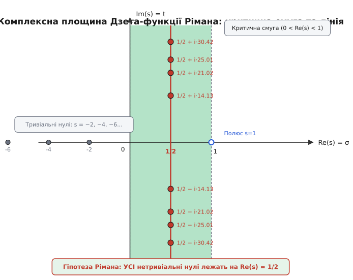
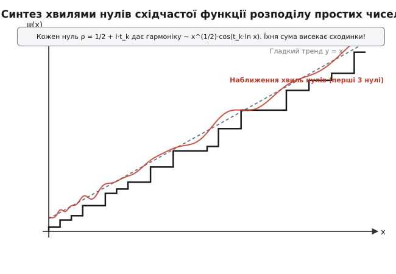

# Гіпотеза Рімана

<preknowlist>
- [Розподіл простих чисел](root:math-number-theory/prime-distribution) — лічильна функція π(x), інтегральний логарифм Li(x) та асимптотичний закон простих чисел.
- [Формула добутку Ейлера](root:math-number-theory/euler-product-formula) — тотожність, що пов'язує нескінченну суму обернених степенів з добутком по всіх простих числах.
- [Комплексні числа](root:math-analysis/complex-numbers) — комплексна площина, дійсна та уявна частини `s = σ + i·t`, комплексна показникові функція.
</preknowlist>

Коли алгоритм генерації ключів для захищеного з'єднання обчислює мільйонні прості числа, він покладається на прогноз ймовірності натрапити на просте число в заданому діапазоні. Формула Гаусса — інтегральний логарифм `Li(x)` — дає надзвичайно точну орієнтовну кількість простих чисел, але реальна лічильна функція `π(x)` постійно коливається навколо цього гладкого тренду. В одних інтервалах простих чисел виявляється трохи більше, в інших — трохи менше. Якщо відхилення між реальністю та моделлю випадково виявиться занадто великим, криптографічні алгоритми втратять оцінку обчислювальної складності, а перевірка чисел на простоту дасть збій. Задача контролю цих відхилень зводиться до одного з найглибших питань сучасної науки: яка сила утримує коливання простих чисел у суворо обмеженому коридорі?

## Проблема відхилення: чому гладка модель розходиться з дійсністю

Теорема про розподіл простих чисел доводить, що головний напрямок росту кількості простих чисел `π(x)` задається функцією `Li(x)`. Для макроскопічних значень `x` відношення `π(x) / Li(x)` прямує до ідеальної одиниці. Проте якщо ми обчислимо різницю `Δ(x) = π(x) - Li(x)` для конкретних значень `x`, ми побачимо складну хвильову картину:

- Для `x = 1 000`: точне число `π(x) = 168`, а `Li(x) ≈ 178`, що дає відхилення `Δ(x) = -10`.
- Для `x = 1 000 000`: точне `π(x) = 78 498`, а `Li(x) ≈ 78 627`, відхилення `Δ(x) = -129`.
- Для `x = 10⁹`: точне `π(x) = 50 847 534`, а `Li(x) ≈ 50 849 235`, відхилення `Δ(x) = -1 701`.
- Для `x = 10¹²`: точне `π(x) = 37 607 912 018`, а `Li(x) ≈ 37 607 950 280`, відхилення `Δ(x) = -38 262`.

Математики тривалий час спостерігали, що для всіх обчислених значень `x` інтегральний логарифм `Li(x)` систематично завищує точну кількість простих чисел, тобто `π(x) < Li(x)`. Це навело Карла Фрідріха Гаусса та Адрієна-Марі Лежандра на припущення, що `Li(x)` завжди лежить строго вище за `π(x)`.

Проте у 1914 році британський математик Джон Еденсор Літтлвуд довів вражаючий результат: різниця `π(x) - Li(x)` змінює свій знак нескінченну кількість разів! Вона не просто коливається, а перетинає нуль знову і знову. Перша точка перетину знаків (відома як число Ск'юза) лежить надзвичайно високо — початкові оцінки Стенлі Ск'юза давали межу `10^(10^(10^34))`, яку пізніше уточнили до `x ≈ 10³¹⁶`.

Ці відхилення не є випадковими похибками вимірювання. Вони являють собою фундаментальний шум, породжений самою дискретною природою цілих чисел. Щоб зрозуміти джерело цього шуму з перших принципів, уявімо побудову натурального ряду. Кожне нове просте число `p` вносить у числову пряму свій власний "ритм" — періодичне викреслювання всіх чисел, кратних `p`. Оскільки ці ритми для різних простих чисел `p₁, p₂, p₃...` мають несумірні періоди, їхнє сумісне накладення створює складну інтерференційну картину.

Математиків турбувало головне питання: наскільки великими можуть бути ці хвильові сплески у нескінченності? Чи може відхилення `|π(x) - Li(x)|` на якійсь віддаленій ділянці числової осі зрости до величини порядку `x⁰·⁸` чи навіть `x⁰·⁹⁹`, зруйнувавши передбачуваність розподілу? Відповідь прихована у структурі комплексної Дзета-функції, яку в 1859 році дослідив Бернхард Ріман.

## Аналітичне продовження ζ(s) на комплексну площину

Леонард Ейлер розглядав функцію `ζ(s)` для дійснозначних значень `s > 1` у вигляді нескінченного ряду:

```
ζ(s) = 1/1ˢ + 1/2ˢ + 1/3ˢ + 1/4ˢ + ... = ∑ (1 / nˢ)
```

Цей ряд чудово збігається, коли `s > 1`. Проте якщо підставити `s = 1`, ми отримуємо розбіжний гармонічний ряд `1 + 1/2 + 1/3 + ... = ∞`. Для значень `s ≤ 1` сума повністю втрачає зміст у класичній арифметиці.

Ріман зробив вирішальний крок: він замінив дійсну змінну `s` на комплексне число `s = σ + i·t`, де `σ = Re(s)` — дійсна частина, а `t = Im(s)` — уявна частина. У комплексному просторі доданок `1 / nˢ` перетворюється на спіральну хвилю:

```
1 / nˢ = 1 / nˢ⁺ⁱᵐᵗ = (1 / nˢ) · e⁻ⁱᵐᵗᵐˡⁿ⁽ⁿ⁾ = (1 / nˢ) · [cos(t · ln n) - i · sin(t · ln n)]
```

Дійсна частина `σ` відповідає за затухання амплітуди (швидкість зменшення доданків), а уявна частина `t` визначає частоту обертання вектора на комплексній площині.

Щоб поширити функцію `ζ(s)` на область, де `Re(s) ≤ 1`, скористаємося альтернативним рядом — знакопочередним рядом Діріхле (Дзета-функцією Ета `η(s)`):

```
η(s) = ∑ ((-1)ⁿ⁺¹ / nˢ) = 1/1ˢ - 1/2ˢ + 1/3ˢ - 1/4ˢ + ...
```

Пов'язуючи суми `ζ(s)` та `η(s)`, отримуємо тотожність:

```
η(s) = (1 - 2¹⁻ˢ) · ζ(s)  ⇒  ζ(s) = η(s) / (1 - 2¹⁻ˢ)
```

Ряд `η(s)` збігається для всіх комплексних чисел з дійсною частиною `Re(s) > 0`. Це дозволяє негайно продовжити `ζ(s)` на всю півплощину `Re(s) > 0`, крім точки `s = 1`, де знаменник `1 - 2¹⁻ˢ` перетворюється на нуль, утворюючи простий полюс з лишком 1.

Використовуючи інтегральне представлення через Гамма-функцію `Γ(s)` та тотожності тета-функцій Якобі, Ріман довів, що `ζ(s)` можна єдиним чином продовжити на ВСЮ комплексну площину.

Вивчення геометрії продовженої Дзета-функції розкрило існування двох класів точок, у яких значення функції перетворюється на нуль (`ζ(s) = 0`):

1. **Тривіальні нулі**: знаходяться на від'ємній дійсій осі в точках `s = -2, -4, -6, -8...`. Вони виникають математично через множник `sin(π·s / 2)` у функціональному рівнянні і не несуть у собі інформації про тонкі коливання простих чисел.
2. **Нетривіальні нулі**: нескінченний масив комплексних точок `ρ = σ + i·t`, які лежат у так званій **критичній смузі** `0 < Re(s) < 1`.


*Комплексна площина Дзета-функції: критична смуга 0 < Re(s) < 1, критична лінія Re(s) = 1/2, тривіальні нулі на від'ємній дійсій осі та нетривіальні нулі.*

Симетрія функціонального рівняння `ξ(s) = ξ(1 - s)` вимагає, щоб нетривіальні нулі розташовувалися строго симетрично відносно центральної осі `Re(s) = 1/2` та відносно дійсної осі `Im(s) = 0`. Якщо `ρ = σ + i·t` є нулем, то точки `1 - σ + i·t`, `σ - i·t` та `1 - σ - i·t` також обов'язково є нулями, утворюючи симетричну четвірку у критичній смузі.

## Спектральний синтез: Явна формула Рімана та хвилі нулів

Чому саме комплексні нулі `ρ` виявилися ключем до розподілу цілих чисел? Відповідь дає виведена Ріманом та доопрацьована Гансом фон Мангольдтом **Явна формула** (*Explicit Formula*).

Замість безпосереднього підрахунку кількості простих чисел `π(x)` розіб'ємо задачу на два етапи. Розглянемо зважену лічильну функцію Чебишова `ψ(x)`, яка додає значення `ln(p)` для кожного простого числа `p` та його степенів `pᵏ ≤ x`:

```
ψ(x) = ∑ Λ(n)      [сума по n ≤ x]
```

Тут `Λ(n)` — функція фон Мангольдта, яка дорівнює `ln(p)`, якщо `n = pᵏ`, і `0` в інших випадках. Зв'язок між логарифмічною похідною Дзета-функції `-ζ'(s)/ζ(s)` та функцією `ψ(x)` дається інтегралом Перрона.

Застосовуючи теорему про лишки з комплексного аналізу, ми замикаємо контур інтегрування у лівій напівплощині. Сумування по всіх особливих точках дає точну **Явну формулу Рімана–Мангольдта**:

```
ψ(x) = x - ∑ (xᵨ / ρ) - ln(2·π) - (1/2) · ln(1 - x⁻²)
```

Детальне математичне виведення аналітичного продовження, комплексної функції Ксі та явної формули Мангольдта наведено у вставці [Вивід явної формули та Дзета-функції](root:math-number-theory/riemann-hypothesis/math-explicit-formula.md).

Зв'язок між функцією Чебишова `ψ(x)` та стандартною лічильною функцією `π(x)` здійснюється через точну формулу Ейлера–Рімана для точкової функції `J(x)`:

```
J(x) = π(x) + (1/2)·π(x¹/²) + (1/3)·π(x¹/³) + (1/4)·π(x¹/⁴) + ...
```

Застосовуючи обернення Мьобіуса, отримуємо вираз для `π(x)`:

```
π(x) = ∑ (μ(n) / n) · J(x¹/ⁿ) = J(x) - (1/2)·J(x¹/²) - (1/3)·J(x¹/³) - (1/5)·J(x¹/⁵) + ...
```

Розберемо фізичну та геометричну аналогію цієї формули. Складові частини рівняння працюють як елементи акустичного аналізатора або синтезатора звуку:

1. **Головний член `x` у `ψ(x)` (або `Li(x)` у `π(x)`)**: задає базовий постійний тренд росту (середній рівень).
2. **Постійний член `ln(2·π)` та логарифм `(1/2)·ln(1 - x⁻²)`**: дрібні гладкі поправки від полюса `s = 0` та тривіальних нулів `s = -2k`.
3. **Нескінченна сума `∑ (xᵨ / ρ)`**: це сума гармонійних хвиль, де КОЖЕН нетривіальний нуль `ρ` виступає як окремий генератор сигналів (обертон).

Розкриємо доданок від одного нуля `ρ = σ + i·t`:

```
xᵨ = xˢ⁺ⁱᵐᵗ = xˢ · eⁱᵐᵗᵐˡⁿ⁽ˣ⁾ = xˢ · [cos(t · ln x) + i · sin(t · ln x)]
```

Цей вираз показує, що кожен нуль генерує гармонійне коливання по змінній `ln(x)`. При цьому:
- **Уявна частина нуля `t = Im(ρ)`** визначає **частоту** коливань. Перший нуль з `t₁ ≈ 14.13` дає низькочастотну основну хвилю. Наступні нулі з `t₂ ≈ 21.02`, `t₃ ≈ 25.01` додають все більш високочастотні гармоніки.
- **Дійсна частина нуля `σ = Re(ρ)`** визначає **амплітуду** (висоту) цих хвиль, яка дорівнює `xˢ`.


*Сума гармонік від нетривіальних нулів точно відтворює східчасту функцію розподілу простих чисел.*

Коли ми підсумовуємо нескінченну кількість таких плавно коливальних синусоїдальних хвиль, відбувається диво аналітичного синтезу. Вершини і западини мільйонів неперервних хвиль зіштовхуються у просторі, гасять одна одну на пласких ділянках і резонують під час проходження через прості числа. В результаті неперервні синусоїди "висікають" ідеально гострі сходинки, створюючи дискретні стрибки функції `ψ(x)` точно в точках `x = 2, 3, 4, 5, 7, 8, 9, 11...`!

## Сутність Гіпотези Рімана: чому саме Re(s) = 1/2

Тепер ми підійшли до центрального ядра проблеми. Амплітуда кожної хвилі в явній формулі пропорційна `xˢ`, де `σ` — дійсна частина відповідного нуля.

Німецький математик Бернхард Ріман у 1859 році висловив припущення:

> **Гіпотеза Рімана:** Всі нетривіальні нулі Дзета-функції `ζ(s)` лежать строго на одній вертикальній прямій `Re(s) = 1/2`. Цю пряму називають **критичною лінією**.

Чому значення `σ = 1/2` є настільки фундаментальним з точки зору матаналізу та фізики?

Розглянемо два альтернативні сценарії:

### Сценарій А: Гіпотеза Рімана істинна (`σ = 1/2` для всіх нулів)

Якщо всі нулі лежать на критичній лінії, дійсна частина кожного нуля точно дорівнює `1/2`. Це означає, що амплітуда КОЖНОЇ хвилі в явній формулі обмежена величиною `x¹/² = √x`.

Об'єднаємо доданки для сопряженої пари нулів `ρ = 1/2 + i·t` та `p̄ = 1/2 - i·t`:

```
(x¹/²⁺ⁱᵐᵗ / (1/2 + i·t)) + (x¹/²⁻ⁱᵐᵗ / (1/2 - i·t)) = (2·√x / (1/4 + t²)) · [(1/2)·cos(t·ln x) + t·sin(t·ln x)]
```

Для великих значень `t` знаменник `1/4 + t² ≈ t²`, а чисельник росте як `t · √x`. Отже, кожен окремий доданок спадає як `√x / t`.

Сума всіх хвиль дає загальне відхилення, яке не перевищує за порядком величини:

```
| ψ(x) - x | ≤ C · √x · ln²(x)
```

Переходячи до стандартної лічильної функції простих чисел `π(x)`, ми отримуємо найтісніший з усіх можливих коридорів похибки:

```
| π(x) - Li(x) | = O(√x · ln x)
```

Це математичний еквівалент ідеально збалансованого статистичного шуму. Коливання простих чисел поводяться як найменш можливий вимірний шум (аналог випадкового блукання або білого шуму у фізиці). Прості числа розподілені настільки рівномірно і регулярного, наскільки це взагалі припускає їхній дискретний характер.

Пряма `Re(s) = 1/2` є єдиною віссю симетрії, де енергетичний потік функціонального рівняння `ξ(s) = ξ(1-s)` перебуває у стані точної термодинамічної та аналітичної рівноваги.

### Сценарій Б: Гіпотеза Рімана хибна (існує нуль з `σ > 1/2`)

Припустимо на мить, що існує бодай один "аномальний" нуль, дійсна частина якого дорівнює, наприклад, `σ = 0.8`.

Через симетрію функціонального рівняння поруч із ним виникне четверка аномальних нулів з координатами `0.8 + i·t`, `0.2 + i·t`, `0.8 - i·t`, `0.2 - i·t`.

Доданок від цього нуля в явній формулі згенерує хвилю з амплітудою `x⁰·⁸`. 

При великих значеннях `x` (скажімо, `x = 10²⁰`) величина `x⁰·⁸ = 10¹⁶` у мільйони разів перевищить стандартний шум `√x = 10¹⁰`. Ця аномальна хвиля розгойдуватиме графік `π(x)`, утворюючи гігантські прогалини та скупчення простих чисел. Бездоганна гармонія розподілу розпадеться, а похибка наближення зросте до катастрофічних масштабів `O(x⁰·⁸)`.

Отже, Гіпотеза Рімана — це твердження про **ідеальне згасання амплітуди відхилень** і відсутність раптових резонансних викидів у розподілі простих чисел.

Історію відкриття 1859 року, 8-му проблему Гільберта та столітній шлях чисельної перевірки описано у вставці [Історія Гіпотези Рімана](root:math-number-theory/riemann-hypothesis/hist-riemann-hypothesis.md).

## Квантовий хаос і матриці GUE: спектральне відчуття теорії чисел

Тривалий час Гіпотеза Рімана вважалася чисто арифметичною сухістю. Проте у другій половині XX століття з'ясувалося, що нулі Дзета-функції приховують у собі глибинні закони квантової фізики.

У 1910-х роках Давид Гільберт та Йозеф Поя висловили глибоку гіпотезу: нетривіальні нулі `ρ = 1/2 + i·t` можуть бути пов'язані з власними значеннями деякого самоспряженого оператора (Гамільтоніана `H`) у комплексному Гільбертовому просторі:

```
H · Ψₙ = tₙ · Ψₙ
```

Оскільки власні значення будь-якого самоспряженого оператора у квантовій механіці строго ДІЙСНІ (`tₙ ∈ ℝ`), це автоматично означало б, що всі нулі мають вигляд `1/2 + i·tₙ`, тобто лежать строго на критичній лінії!

Справжній прорив у розумінні цієї гіпотези стался у 1972 році завдяки працям Г'ю Монтгомері та Фрімена Дайсона. Монтгомері обчислив парну кореляційну функцію для відстаней між сусідніми нулями Дзета-функції. Виявилося, що нормований розподіл відстаней між нулями описується формулою:

```
R₂(x) = 1 - (sin(π·x) / (π·x))²
```

Цей вираз показує вражаючий ефект: коли відстань між двома нулями прямує до нуля (`x → 0`), ймовірність їхнього зближення прямує до нуля (`R₂(0) = 0`). Це явище називається **квантовим відштовхуванням рівнів** (*level repulsion*). Нулі Дзета-функції "не люблять" сидіти близько один до одного; вони немов відштовхуються однаковими електричними зарядами, підтримуючи збалансовану дистанцію.


*Нулі Дзета-функції демонструють рівномірне відштовхування, тотожне спектрам квантових хаотичних систем.*

Порівняємо це з класичним випадковим процесом Пуассона (наприклад, падаючими краплями дощу на асфальт). Випадкові точки Пуассона часто утворюють скупчення (кластери) та залишають великі порожні прогалини. Нулі Рімана поводяться геть інакше: вони демонструють витончений спектральний порядок.

Дайсон помітив, що формула Монтгомері точнісінько збігається з розподілом власних значений великих випадкових комплексних гермітових матриць Гаусового унітарного ансамблю (*Gaussian Unitary Ensemble*, GUE). Такі матриці використовуються в квантовій фізиці для опису важких атомних ядер (наприклад, ядра Урану-238) та квантових систем із хаотичним рухом.

Фізики Майкл Беррі та Джонатан Кітінг сформулювали гіпотезу Беррі–Кітінга: існує класична хаотична динамічна система з Гамільтоніаном `H = x·p`, квазікласичне квантування якої породжує нулі Рімана як свої енергетичні рівні. У цій фізичній моделі:
- Замкнені періодичні орбіти класичної частинки мають періоди `Tₚ = ln(p)`, що відповідають логарифмам простих чисел.
- Квантові рівні енергії `Eₙ = tₙ` відповідають уявним частинам нетривіальних нулів.

Формула сліду Ґуцвіллера у квантовому хаосі виявляється словесним еквівалентом Явної формули Рімана–Мангольдта!

## Чисельні обчислення та перевірка мільярдних нулів

Оскільки строге математичне доведення Гіпотези Рімана залишається невирішеним, вчені розробили потужні обчислювальні інструменти для експериментальної перевірки.

Головний інструмент пошуку нулів на критичній лінії — дійснозначна **функція Харді `Z(t)`**:

```
Z(t) = eⁱᵐθ⁽ᵗ⁾ · ζ(1/2 + i·t)
```

Де `θ(t)` — фазовий кут Рімана–Зігеля:

```
θ(t) ≈ (t/2) · ln(t / (2·π)) - (t/2) - (π / 8) + 1 / (48·t)
```

Функція `Z(t)` є строго дійсною для дійсних `t`, а її модуль дорівнює модулю Дзета-функції: `|Z(t)| = |ζ(1/2 + i·t)|`. Зміна знаку функції `Z(t)` (коли `Z(t₁) · Z(t₂) < 0`) гарантує наявність нетривіального нуля на критичній лінії між точками `t₁` та `t₂`.

Математики розробили спеціальні точки Ґрама `gₙ`, які визначаються умовою `θ(gₙ) = n·π`. Згідно з **Законом Ґрама**, нетривіальні нулі зазвичай чергуються з точками Ґрама: між `gₙ` та `gₙ₊₁` лежить рівно один нуль `tₙ`.

Хоча Закон Ґрама іноді порушується (перше порушення закону Ґрама виникає при `n = 126`), розроблені алгоритми (зокрема метод Тюрінга) дозволяють строго контролювати загальну кількість нулів у прямокутних контурах і гарантувати відсутність пропущених нулів поза критичною лінією.

Практичний алгоритм пошуку нулів та його реалізацію мовами Python, C і C++ наведено у вставці [Обчислення нулів Дзета-функції на критичній лінії](root:math-number-theory/riemann-hypothesis/proj-riemann-zeros.md).

Перші три нетривіальні нулі на критичній лінії мають координати:
- `ρ₁ = 1/2 + i·14.134725...`
- `ρ₂ = 1/2 + i·21.022040...`
- `ρ₃ = 1/2 + i·25.010858...`

Завдяки алгоритму Одлижка–Схюнгаге та розподіленим обчислювальним мережам на сьогодні чисельно перевірено понад **10 трильйонів (`10¹³`) перших нетривіальних нулів**. Усі вони без жодного винятку лежать строго на критичній лінії `Re(s) = 1/2`.

## Наслідки для математики, криптографії та Проблема тисячоліття

Чому доведення Гіпотези Рімана є настільки принциповим для сучасної науки?

1. **Гіпотеза Ґольдбаха та інтервали між простими числами**: доведення Гіпотези Рімана гарантує, що відстань між двома послідовними простими числами `pₙ` та `pₙ₊₁` підпорядковується межі `pₙ₊₁ - pₙ = O(√pₙ · ln pₙ)`. Це повністю виключає можливість існування великих аномальних "пустель" без простих чисел.
2. **Узагальнена гіпотеза Рімана (GRH)**: розширення гіпотези на L-функції Діріхле `L(s, χ)` дозволяє встановити точний розподіл простих чисел у арифметичних прогресіях `a·n + b` (теорема Діріхле). Це має вирішальне значення для теорії числових полів та алгебраїчної геометрії.
3. **Алгоритми тестування простоти**: детерміновані криптографічні тести простоти (наприклад, детермінований варіант тесту Міллера–Рабіна) за умови істинності Узагальненої гіпотези Рімана (GRH) працюють за поліноміальний час `O(ln⁴ n)`, що робить їх практично миттєвими для довільно великих чисел.
4. **Еліптичні криві та криптографія**: стійкість криптосистем на еліптичних кривих (ECC) та оцінка кількості точок над скінченними полями спираються на аналог Гіпотези Рімана для L-функцій еліптичних кривих (доведений Андре Вейлем для алгебраїчних кривих у 1948 році та П'єром Делінем у 1974 році для гіпотез Вейля).

У 2000 році Математичний інститут Клея оголосив Гіпотезу Рімана однією з семи Проблем тисячоліття, встановивши нагороду в **1 мільйон доларів США** за її розв'язання.

Гіпотеза Рімана — це більше ніж математичне припущення. Це фундаментальна константа гармонії цілих чисел. Вона доводить, що за зовнішнім хаосом простих чисел приховано найтонший, ідеально відкалібрований хвильовий порядок у Всесвіті, партитура якого записана нулями Дзета-функції на критичній лінії `Re(s) = 1/2`.
