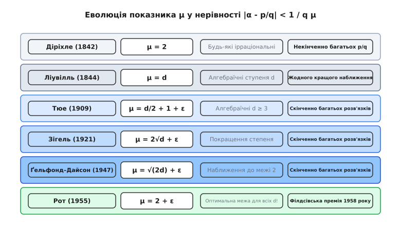
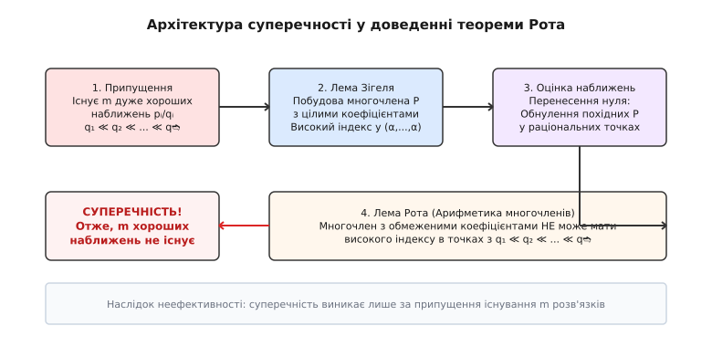

# Теорема Рота про діофантові наближення

<preknowlist>
- [Ірраціональні числа](topic:math-number-theory/irrational-numbers) — міра ірраціональності, алгебраїчні та трансцендентні числа.
- [Ланцюгові дроби](topic:math-number-theory/continued-fractions) — найкращі раціональні наближення дійсних чисел.
- [Діофантові рівняння](topic:math-number-theory/diophantine-equations) — рівняння у цілих числах та класифікація їхніх розв'язків.
</preknowlist>

Для алгебраїчного ірраціонального числа `√2 ≈ 1.41421356...` пошук раціональних наближень `p / q` із точністю `|√2 - p/q| < 1 / q²` дає нескінченний ланцюжок дробів: `3/2` з помилкою `0.014`, `7/5` з помилкою `0.0057`, `41/29` з помилкою `0.00017`, `99/70`, `239/169`, `577/408` і далі без зупинки. Проте якщо вимогу до точності посилити хоча б на найменшу величину `ε > 0` і шукати дроби з умовою `|√2 - p/q| < 1 / q^(2 + 0.00001)`, то потік наближень негайно й остаточно вичерпується: таких дробів існує лише скінченне число. 

Теорема Клауса Рота (Klaus Roth, 1955) доводить, що це раптове зникнення наближень є не арифметичною випадковістю для `√2`, а фундаментальним законом для **всіх** алгебраїчних (лат. algebraicus, від араб. الجبر / al-jabr) ірраціональних чисел довільного ступеня `d ≥ 2`. Жоден корінь многочлена з цілими коефіцієнтами принципово неможливо наближати раціональними числами краще, ніж із показником `2 + ε`.

## 1. Фундаментальний спектр діофантових наближень

Проблема діофантова (дав.-гр. Διόφαντος / Diophantos) наближення полягає у дослідженні того, наскільки тісно дійсні числа підпускають до себе раціональні дроби `p / q` відносно розміру знаменника `q`. Якщо для даного числа `α` існує нескінченно багато дробів `p / q`, які задовольняють нерівність:

```
|α - p/q| < 1 / q^μ
```

то число `μ` називається **показником наближення** (або мірою ірраціональності). Що більшим є `μ`, то «легше» число наближається раціональними дробами.

Геометрія дійсних чисел створює суворий спектр можливих значень `μ`, який ділить усі числа на три різкі класи:

```
[ μ < 2 ]               [ μ = 2 ]                 [ 2 < μ < ∞ ]             [ μ = ∞ ]
Раціональні числа      Універсальна межа         Область теореми Рота       Числа Ліувіля
(Скінченна кількість   Діріхле для всіх          (Лише трансцендентні       (Спеціальні
наближень)             ірраціональних чисел      числа)                     трансцендентні)
```

1. **Раціональні числа (`α = a / b`):** Для будь-якого раціонального числа `p / q ≠ a / b` різниця `|a/b - p/q| = |aq - bp| / (bq) ≥ 1 / (bq)`. Тому показник `μ` не може перевищувати `1`. Для `μ > 1` існує лише скінченна кількість розв'язків (а саме єдиний розв'язок `a / b`).
2. **Універсальний поріг Діріхле (`μ = 2`):** У 1844 році Петер Ґустав Лежен Діріхле довів, що для **будь-якого** ірраціонального числа (як алгебраїчного, так і трансцендентного) існує нескінченно багато раціональних наближень, для яких `|α - p/q| < 1 / q²`. Отже, для кожного ірраціонального числа `μ ≥ 2`.
3. **Межа Рота для алгебраїчних чисел (`μ = 2 + ε`):** Теорема Рота стверджує, що для будь-якого алгебраїчного ірраціонального числа `α` та будь-якого `ε > 0` нерівність з показником `2 + ε` має лише **скінченне число** розв'язків.

Це означає, що точний верхній показник наближення для **усіх** алгебраїчних ірраціональних чисел дорівнює точно `2`. Вони поводяться з погляду наближень так само «погано», як і найпростіші квадратні ірраціональності. Будь-яке число, яке припускає нескінченно багато наближень із показником `μ > 2`, **зобов'язане бути трансцендентним**.


*Еволюція показника діофантова наближення від закону Діріхле через результати Ліувіля, Тюе, Зігеля та Ґельфонда–Дайсона до остаточної межі Рота.*

[📜 Історія діофантових наближень та шлях до теореми Рота](topic:math-number-theory/roth-theorem/hist-roth-approximation.md)

## 2. Теорема Діріхле та нижня межа ірраціональності

Щоб зрозуміти, чому показник `2` виникає як природна межа, розглянемо доведення теореми Діріхле про наближення за допомогою принципу комірок (ящиків).

Нехай `α` — довільне ірраціональне число, а `N` — натуральне число. Розглянемо `N + 1` чисел у напівінтервалі `[0, 1)`:

```
{0·α}, {1·α}, {2·α}, ..., {N·α}
```

де `{x} = x - ⌊x⌋` позначє дробову частину числа `x`.

Розділимо напівінтервал `[0, 1)` на `N` однакових частин (комірок) довжиною `1 / N`:

```
[0, 1/N), [1/N, 2/N), ..., [(N-1)/N, 1)
```

За принципом Діріхле, оскільки ми розподіляємо `N + 1` точок по `N` комірках, щонайменше дві точки мусять потрапити в одну й ту саму комірку. Нехай це точки `{q₁ α}` та `{q₂ α}` для деяких цілих `0 ≤ q₁ < q₂ ≤ N`.

Позначивши `q = q₂ - q₁` (причому `1 ≤ q ≤ N`), отримуємо, що відстань між цими дробовими частинами менша за довжину комірки `1 / N`:

```
|{q₂ α} - {q₁ α}| < 1 / N
```

Запишемо дробові частини через цілі частини `p₁ = ⌊q₁ α⌋` та `p₂ = ⌊q₂ α⌋`:

```
|(q₂ α - p₂) - (q₁ α - p₁)| < 1 / N
|(q₂ - q₁) α - (p₂ - p₁)| < 1 / N
```

Поклавши `p = p₂ - p₁`, маємо:

```
|q α - p| < 1 / N
```

Поділивши обидві частини нерівності на `q`, отримуємо:

```
|α - p/q| < 1 / (q N)
```

Оскільки `q ≤ N`, то `1 / (q N) ≤ 1 / q²`, що й дає класичну нерівність Діріхле:

```
|α - p/q| < 1 / q²
```

Оскільки `N` можна обирати довільно великим, а число `α` є ірраціональним, цей процес будує нескінченну послідовність різних раціональних дробів `p / q`. 

Цей результат підтверджує, що для **будь-якого** ірраціонального числа показник наближення `μ` не може бути меншим за `2`.

## 3. Теорема Ліувіля та перший крок до алгебраїчних чисел

Першим, хто з'ясував, що алгебраїчні числа не можуть наближатися раціональними дробами *довільно добре*, був Жозеф Ліувіль у 1844 році.

**Теорема Ліувіля (1844):**
Нехай `α` — алгебраїчне ірраціональне число ступеня `d ≥ 2`, яке є коренем непривідного многочлена `P(x) = a_d xᵈ + a_{d-1} xᵈ⁻¹ + ... + a_0` із цілими коефіцієнтами. Тоді існує обчислювана константа `c(α) > 0`, така що для всіх цілих `p, q` (при `q > 0`) виконується нерівність:

```
|α - p/q| > c(α) / qᵈ
```

### Строге виведення теореми Ліувіля

Нехай `p / q` — раціональний дріб, який не дорівнює `α`. Розглянемо значення многочлена `P(x)` у точці `p / q`:

```
P(p/q) = a_d (p/q)ᵈ + a_{d-1} (p/q)ᵈ⁻¹ + ... + a_0
       = (a_d pᵈ + a_{d-1} pᵈ⁻¹ q + ... + a_0 qᵈ) / qᵈ
```

Чисельник цього виразу `A = a_d pᵈ + a_{d-1} pᵈ⁻¹ q + ... + a_0 qᵈ` є цілим числом. 

Оскільки многочлен `P(x)` є непривідним над `ℚ` і має ступінь `d ≥ 2`, він не має раціональних коренів. Отже, чисельник `A` не може дорівнювати нулю (`A ≠ 0`). Оскільки `A` — ненульове ціле число, його абсолютне значення не менше за одиницю: `|A| ≥ 1`.

Звідси випливає нижня оцінка для модуля значення многочлена:

```
|P(p/q)| = |A| / qᵈ ≥ 1 / qᵈ
```

З іншого боку, оскільки `P(α) = 0`, застосуємо теорему Лагранжа про скінченний приріст (формулу середнього значення) на відрізку між `α` та `p / q`:

```
|P(p/q) - P(α)| = |P'(c)| · |α - p/q|
```

де `c` — деяка точка між `α` та `p / q`.

Якщо `p / q` лежить у скінченному околі точки `α` (наприклад, `|α - p/q| ≤ 1`), то точка `c` також належить цьому обмеженому околу. Позначимо через `M` максимум модуля першої похідної `|P'(x)|` на цьому околі:

```
M = max |P'(x)|   [при |x - α| ≤ 1]
```

Тоді маємо верхню оцінку:

```
|P(p/q)| = |P(p/q) - P(α)| ≤ M · |α - p/q|
```

Зіставляючи нижню алгебраїчну оцінку `1 / qᵈ` та верхню аналітичну оцінку `M · |α - p/q|`, отримуємо нерівність:

```
1 / qᵈ ≤ |P(p/q)| ≤ M · |α - p/q|
```

Поділивши на `M`, маємо:

```
|α - p/q| ≥ (1 / M) / qᵈ
```

Поклавши `c(α) = min(1, 1 / M)`, отримуємо остаточну оцінку Ліувіля:

```
|α - p/q| > c(α) / qᵈ
```

Нерівність Ліувіля показує, що для алгебраїчного числа ступеня `d` показник наближення не може перевищувати `d`. Це дозволило Ліувілю побудувати перші приклади трансцендентних чисел — так звані числа Ліувіля (наприклад, `L = ∑ 10^(-k!)`), які мають нескінченно багато наближень з довільно великим показником `μ`.

Проте для алгебраїчних чисел високих ступеней (наприклад, `d = 100`) оцінка Ліувіля `1 / q¹⁰⁰` виявилася надзвичайно слабкою. Вона залишала гігантський розрив між межею Діріхле `2` та межею Ліувіля `d`.

## 4. Сформульована теорема Рота та її оптимальність

Строге формулювання теореми Клауса Рота включає два еквівалентні твердження — нерівнісне та межеве.

**Теорема (Клаус Рот, 1955):**
Нехай `α` — алгебраїчне ірраціональне число над полем раціональних чисел `ℚ`. Для будь-якого фіксованого дійсно-додатного числа `ε > 0` нерівність:

```
|α - p/q| < 1 / q²⁺ᵉ
```

має лише скінченне число розв'язків у взаємно простих цілих числах `p, q` (при `q > 0`).

Еквівалентно, існує додатна константа `c(α, ε) > 0`, така що для **всіх** раціональних дробів `p / q` виконується нижня оцінка:

```
|α - p/q| > c(α, ε) / q²⁺ᵉ
```

### Чому показник `2 + ε` є неперевершуваним?

Щоб зрозуміти точність теореми Рота, необхідно зіставити її з теоремою Діріхле. Діріхле гарантує, що для **кожного** ірраціонального числа `α` існує нескінченна послідовність дробів `p_k / q_k`, така що:

```
|α - p_k / q_k| < 1 / q_k²
```

Якщо припустити, що теорему Рота можна було б посилити, прибравши `ε` і поклавши `ε = 0`, то нерівність `|α - p/q| < 1 / q²` мала б лише скінченне число розв'язків. Але це прямо суперечить теоремі Діріхле! 

Отже, показник `2` є точним нижнім порогом, а показник `2 + ε` — точним верхнім порогом для нескінченних наближень. Величина `ε` не може бути вилучена: щойно показник степеня перевищує `2` бодай на `10⁻¹⁰⁰`, нескінченна послідовність наближень миттєво руйнується.

## 5. Принципова неефективність теореми Рота

Найважливішою та найдраматичнішою характеристикою теореми Рота є її **неефективність** (англ. ineffectiveness).

У теорії чисел доведення твердження про скінченність кількості розв'язків називається **ефективним**, якщо воно дає явний алгоритм або обчислювану верхню межу `Q₀` для знаменників `q` усіх можливих розв'язків `p / q`. Маючи таку межу `Q₀`, математик або комп'ютер може перевірити скінченний діапазон `q ≤ Q₀` і знайти **всі** розв'язки або переконатися у їхній відсутності.

Доведення теореми Рота є принципово **неефективним**: воно стверджує, що розв'язків нерівності `|α - p/q| < 1 / q²⁺ᵉ` скінченна кількість, але воно **не надає жодного способу обчислити константу `c(α, ε)` або верхню межу `Q₀` для знаменників**.

### Звідки береться неефективність?

Неефективність закладена у саму структуру логічного доведення Рота. Вона спирається на доведення від протилежного за допомогою припущення про існування **двох дуже великих розв'язків**.

Схема суперечності працює так:
1. Припускаємо, що існує один перший, надзвичайно великий розв'язок `p₁ / q₁` з величезним знаменником `q₁`.
2. Використовуючи значення `q₁`, будується багатовимірний допоміжний многочлен `P(X₁, X₂, ..., X_m)` за допомогою леми Зігеля.
3. Потім доводиться, що існування *другого* розв'язку `p₂ / q₂` зі знаменником `q₂`, який перевищує велетенську вежу експонент від `q₁`:

```
q₂ > exp( exp( ... exp(q₁) ... ) )
```

призводить до арифметичної суперечності з лемою Рота про індекс многочлена.

Звідси робиться висновок: **другого ще більшого розв'язку `p₂ / q₂` бути не може**.

Проте цей висновок створює логічну пастку: межа `Q₀` для другого розв'язку `q₂` прямо залежить від знаменника **першого невідомого розв'язку `q₁`**. Якщо ми не знаємо, чи існує перший розв'язок `p₁ / q₁` і який його розмір, ми не можемо обчислити межу `Q₀`. Якщо першого розв'язку немає, константа залишається неокресленою; якщо `q₁ = 10¹⁰⁰`, то межа для `q₂` дорівнює `10^(10^100)`; а якщо `q₁ = 10^(10^100)`, межа стає ще більшою.

Через це теорема Рота дає відповідь «розв'язків скінченна кількість», але не дає жодного способу знайти ці розв'язки на комп'ютері. Для подолання цієї неефективності в окремих випадках знадобився метод логарифмічних форм Алана Бейкера (Alan Baker, 1966), який дає менш точні за показником, але принципово **ефективні** оцінки.

## 6. Внутрішній механізм доведення: Лема Зігеля та Лема Рота

Щоб зрозуміти, як Клаус Рот подолав бар'єри Тюе, Зігеля та Дайсона, необхідно розглянути три стовпи його доведення.


*Побудова многочлена через лему Зігеля змушує його мати високий індекс у раціональних точках, що вступає у суперечність із межею леми Рота.*

### 1. Поняття індексу многочлена

Центральним аналітичним поняттям є **індекс** (лат. index — вказівник) багатовимірного многочлена `P(X₁, X₂, ..., X_m)` у точці `x = (x₁, ..., x_m)` відносно вагових степеней `r = (r₁, ..., r_m)`.

Індекс `I_P(x; r)` визначається як мінімальне значення зваженого порядку частинної похідної:

```
I_P(x; r) = min { (i₁ / r₁) + (i₂ / r₂) + ... + (i_m / r_m) }
```

взяте за всіма мультиіндексами `(i₁, ..., i_m)`, для яких нормована похідна Тейлора не дорівнює нулю у точці `x`:

```
(1 / (i₁! ... i_m!)) · (∂^(i₁+...+i_m) P / ∂X₁ⁱ¹ ... ∂X_mⁱᵐ)(x) ≠ 0
```

Високий індекс `I_P ≥ σ` означає, що многочлен `P` та всі його частинні похідні низьких порядків тотожно обнуляються у точці `x`.

### 2. Побудова за допомогою леми Зігеля

Припустивши існування `m` дуже хороших раціональних наближень `p₁/q₁, ..., p_m/q_m` до алгебраїчного числа `α`, Рот будує ненульовий многочлен `P(X₁, ..., X_m)` із цілими коефіцієнтами, ступені якого за змінними `X_k` не перевищують `r_k`.

Завдяки лемі Зігеля про системи лінійних однорідних рівнянь із цілими коефіцієнтами (де кількість невідомих більша за кількість умов), можна підбрати коефіцієнти `P` так, що:
- Індекс `P` у точці `(α, α, ..., α)` виявляється дуже високим: `I_P(α, ..., α; r) ≥ (m / 2) · (1 - δ)`.
- Коефіцієнти `P` обмежені відносно помірною величиною.

Оскільки раціональні точки `p_k / q_k` лежать надзвичайно близько до `α`, з високого порядку обнулення в точці `(α, ..., α)` випливає, що значення похідних у раціональній точці `(p₁/q₁, ..., p_m/q_m)` є дробами з малим чисельником. Оскільки чисельник цілий і за модулем менший за `1`, він **зобов'язаний дорівнювати нулю**.

Отже, многочлен `P` має високий індекс і у раціональній точці:

```
I_P(p₁/q₁, ..., p_m/q_m; r) ≥ m / 2 - ε'
```

### 3. Лема Рота (Заборона високого індексу)

Тут Рот застосовує свій головний математичний прорив.

**Лема Рота:** Якщо `p₁/q₁, ..., p_m/q_m` — раціональні числа, знаменники яких зростають надзвичайно швидко (`q₁ʳ¹ ≤ q₂ʳ² ≤ ... ≤ q_mʳᵐ`), а многочлен `P` має обмежені цілі коефіцієнти, то індекс `P` у цій раціональній точці **не може бути великим**:

```
I_P(p₁/q₁, ..., p_m/q_m; r) ≤ ω
```

де `ω` може бути зроблено довільно малим при виборі великого `m`.

Об'єднання двох оцінок створює непереборну суперечність:
- З леми Зігеля та наближень: `I_P ≥ m / 2 - ε'` (при `m = 100` індекс більший за `45`).
- З леми Рота: `I_P ≤ 0.1`.

Отримане ствердження `45 ≤ 0.1` є суперечністю. Вона доводить, що припущення про існування `m` послідовних дуже хороших наближень із швидко зростаючими знаменниками є хибним.

[🧮 Лема Рота та індекс багатовимірного многочлена](topic:math-number-theory/roth-theorem/math-roths-lemma.md)

## 7. Застосування теореми Рота у теорії чисел

Попри неефективність, теорема Рота зробила колосальний вплив на алгебраїчну теорію чисел та діофантів аналіз.

### 1. Рівняння Тюе та скінченність розв'язків

Однорідне діофантове рівняння вигляду:

```
F(x, y) = a_n xⁿ + a_{n-1} xⁿ⁻¹ y + ... + a_0 yⁿ = m
```

де `F(x, y)` — непривідний многочлен ступеня `n ≥ 3` із цілими коефіцієнтами, а `m ≠ 0` — ціле число, називається **рівнянням Тюе**.

Якщо `(x, y)` є цілим розв'язком із великим `|y|`, то перепишемо рівняння як `yⁿ F(x/y, 1) = m`. Оскільки `F(t, 1) = a_n (t - α₁) ... (t - α_n)`, де `α_i` — корені, то для одного з коренів `α` дріб `x / y` опиняється надзвичайно близько до `α`:

```
|α - x/y| < C / |y|ⁿ
```

Оскільки `n ≥ 3`, дріб `x / y` дає наближення з показником `n ≥ 3 > 2`. 

За теоремою Рота, нерівність `|α - x/y| < 1 / |y|³` може мати лише **скінченне число** раціональних розв'язків `x / y`. Отже, рівняння Тюе `F(x, y) = m` має лише **скінченне число цілих розв'язків** `(x, y)`.

### 2. Загальна теорема Зігеля про цілі точки на кривих

У 1929 році Карл Зігель довів, що будь-яка алгебраїчна крива афінного роду `g ≥ 1` (або роду `0` з щонайменше 3 точками на нескінченності) має лише скінченне число цілих точок. Теорема Рота дозволила спростити й узагальнити доведення теореми Зігеля для багатьох класів алгебраїчних кривих (зокрема для еліптичних кривих `y² = x³ + ax + b`).

### 3. Теорема Шмідта про підпростори (Subspace Theorem)

Найзнаменитішим узагальненням теореми Рота стала **теорема про підпростори**, доведена Вольфгангом Шмідтом у 1972 році.

Шмідт переніс теорему Рота з одного алгебраїчного числа на системи з `n` лінійних форм від `n` змінних. Теорема Шмідта стверджує, що якщо `L₁, L₂, ..., L_n` — лінійно незалежні лінійні форми з алгебраїчними коефіцієнтами, то розв'язки нерівності:

```
|L₁(x) L₂(x) ... L_n(x)| < 1 / ||x||ᵉ
```

у цілих векторах `x = (x₁, ..., x_n) ∈ ℤⁿ` лежать у **скінченному числі власніших гіперпідпросторів** простору `ℚⁿ`.

Теорема Шмідта про підпростори є потужним інструментом сучасної діофантової геометрії, який використовується для доведення трансцендентності систем чисел та аналізу S-одиничних рівнянь.

### 4. Порівняння методів діофантова аналізу

Для систематизації уявлення про класичні результати діофантових наближень наведено зведену таблицю порівняння основних теорем:

```
| Теорема         | Рік  | Показник μ         | Гарантія              | Ефективність   |
|-----------------|------|-------------------|-----------------------|----------------|
| Діріхле        | 1842 | μ = 2             | Нескінченно розв'язків | Ефективна      |
| Ліувіль         | 1844 | μ = d             | Жодного кращого       | Ефективна      |
| Тюе             | 1909 | μ = d/2 + 1 + ε    | Скінченно розв'язків  | Неефективна    |
| Зігель          | 1921 | μ = 2√d + ε       | Скінченно розв'язків  | Неефективна    |
| Ґельфонд–Дайсон| 1947 | μ = √(2d) + ε      | Скінченно розв'язків  | Неефективна    |
| Рот             | 1955 | μ = 2 + ε          | Скінченно розв'язків  | Неефективна    |
| Бейкер          | 1966 | (Форми логарифмів)| Обчислювані межі     | Ефективна      |
```

## 8. p-адичний аналог: Теорема Рота–Малера

У 1957 році німецько-австралійський математик Курт Малер (Kurt Mahler) узагальнив теорему Рота на випадки `p`-адичних метрик.

Нехай `S = {p₁, p₂, ..., p_s}` — скінченна множина простих чисел. `p`-адична норма `|x|_p` вимірює подільність цілочисельної різниці на прості числа `p ∈ S`: що вищий степінь `pᵏ` ділить чисельник або знаменник, то меншою є `p`-адична відстань.

**Теорема Рота–Малера:**
Нехай `α` — алгебраїчне число, а `S` — скінченна множина простих чисел. Для будь-якого `ε > 0` нерівність:

```
|α - p/q| · ∏_{p ∈ S} |p α - q|_p < 1 / q²⁺ᵉ
```

має лише скінченне число розв'язків у цілих числах `p, q`.

Це узагальнення є фундаментальним для дослідження `S`-одиничних рівнянь `u + v = 1`, де змінні `u, v` можуть мати прості дільники лише з множини `S`.

## 9. Аналогія Діофанта–Неванлінни та гіпотеза Войта

У 1987 році американський математик Пол Войт (Paul Vojta) виявив глибокий паралелізм між теорією діофантових наближень у теорії чисел та теорією розподілу значень мероморфних функцій (теорією Неванлінни) у комплексному аналізі.

У цьому словнику аналогій зіставляються такі об'єкти:

```
| Теорія чисел (Геометрія Діофанта) | Комплексний аналіз (Теорія Неванлінни) |
|------------------------------------|----------------------------------------|
| Числове поле K                     | Комплексна компактна ріманова поверхня |
| Точка з раціональними координатами | Мероморфна функція f: C -> X           |
| Абсолютна висота h(x)              | Функція характеристики Неванлінни T(r,f)|
| Логарифми знаменників              | Функція підрахунку нулів N(r, f)       |
| Теорема Рота (показник 2 + ε)     | Друга головна теорема Неванлінни      |
```

Згідно зі словником Войта, показник `2` у теоремі Рота відповідає точним коефіцієнтам у Другій головній теоремі Неванлінни для логарифмічних похідних. Гіпотеза Войта узагальнює теорему Рота та теорему про підпростори Шмідта на довільні алгебраїчні многовивиди високих вимірів.

[⚙️ Чисельне дослідження показника діофантова наближення](topic:math-number-theory/roth-theorem/proj-roth-approximation.md)

> 🔧 **Навіщо це.**
> Теорема Рота встановлює принципову межу обчислювальності та структури дійсного простору. У теоретичній комп'ютерній науці та алгоритмічній номерній теорії теорема Рота гарантує, що при розкладанні алгебраїчних чисел у ланцюгові дроби знаменники підхідних дробів не можуть зростати надто швидко без втрати точності. Крім того, розуміння неефективності теореми Рота стимулювало розвиток сучасних конструктивних методів — зокрема LLL-редукції та еліптичних логарифмів, які лежать в основі комп'ютерної алгебри (PARI/GP, SageMath) та алгоритмів криптоаналізу.
