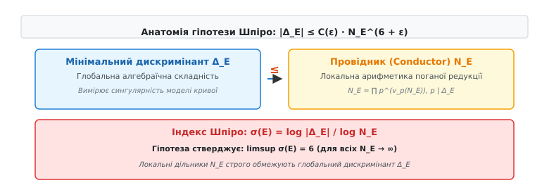
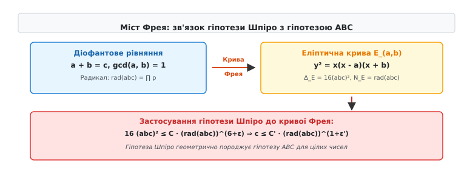
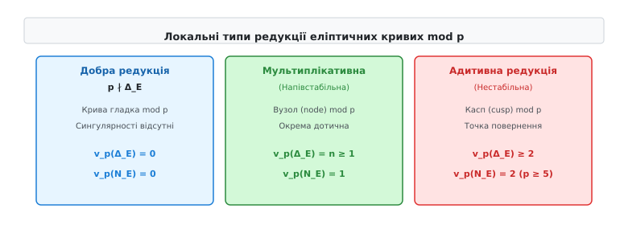

# Гіпотеза Шпіро

<preknowlist>
- [Основна теорема арифметики](topic:math-number-theory/fundamental-theorem-arithmetic) — унікальність розкладу натуральних чисел на прості множники.
- [Діофантові рівняння](topic:math-number-theory/diophantine-equations) — рівняння у цілих числах та класичні методи їх розв'язання.
- [Гіпотеза ABC](topic:math-number-theory/abc-conjecture) — зв'язок між адитивною сумою та мультиплікативним радикалом цілих чисел.
- [Велика теорема Ферма](topic:math-number-theory/fermats-last-theorem) — неможливість цілочисельних розв'язків xⁿ + yⁿ = zⁿ для n ≥ 3 та роль кривих Фрея.
</preknowlist>

Розклад двох натуральних чисел `a` та `b` на прості множники не містить жодної інформації про прості дільники їхньої адитивної суми `c = a + b`. При додаванні навіть двох числових велетнів, які складаються з малого набору простих дільників (таких як `2¹⁰` чи `3²⁰`), підсумкова сума отримує повністю непередбачувану мультиплікативну структуру. Цей фундаментальний розрив між операціями додавання та множення протягом століть блокував створення універсальних методів для розв'язання діофантових рівнянь. Спроба контролювати цілочисельні розв'язки суто через арифметику чисел вимагала побудови окремих громіздких теорій для кожного конкретного рівняння.

Арифметична геометрія пропонує принципово інший підхід: замість того щоб аналізувати ізольовані цілі числа `a`, `b`, `c`, вона пов'язує їх із геометричним об'єктом — **еліптичною кривою**. Досліджуючи гладкість, сингулярності та топологічну структуру цієї кривої над полем раціональних чисел `Q`, математики отримали змогу вимірювати складність цілочисельних співвідношень через неперервні алгебраїчні інваріанти.

Кожна еліптична крива над полем `Q` володіє двома фундаментальними числовими характеристиками, які описують її складність на двох різних рівнях:
1. **Мінімальний дискримінант `Δ_E`** — глобальна геометрична характеристика, яка вимірює загальний ступінь сингулярності алгебраїчної моделі кривої.
2. **Провідник (conductor) `N_E`** — локальна арифметична характеристика, що дорівнює добутку усіх простих чисел, у яких крива втрачає гладкість (має погану редукцію), з урахуванням типів локальних сингулярностей.

Фундаментальне питання, поставлене французьким математиком Люсьєном Шпіро у 1983 році, полягає в наступному: чи може глобальна геометрична складність еліптичної кривої `|Δ_E|` зростати довільно швидко відносно її локальної арифметичної складності `N_E`? **Гіпотеза Шпіро** стверджує, що існує непорушний арифметичний бар'єр: абсолютна величина мінімального дискримінанта `|Δ_E|` завжди жорстко обмежується шостим степенем її провідника `N_E⁶⁺ᵉ`.

## Геометрична інтуїція: від чисел до еліптичних кривих

Щоб зрозуміти, як геометрія кривих контролює арифметику чисел, розглянемо канонічне рівняння Вейєрштрасса для еліптичної кривої над полем раціональних чисел `Q`:

```
E: y² = x³ + A · x + B
```

де `A` та `B` — цілі числа, для яких кубічний многочлен `f(x) = x³ + A · x + B` не має кратних коренів. Умова відсутності кратних коренів означає, що дискримінант кубічного многочлена `Δ = -16 · (4 A³ + 27 B²)` є відмінним від нуля (`Δ ≠ 0`). Якщо дискримінант не дорівнює нулю, крива `E` є гладким одновимірним алгебраїчним многовидом роду 1 з виділеною раціональною точкою.

Геометричний зміст дискримінанта `Δ` полягає у вимірюванні того, наскільки близько корені кубічного многочлена підходять один до одного. У дійсному просторі, коли два корені многочлена зливаються, петля еліптичної кривої стягується у точку з утворенням вузла (самоперетину) або каспа (повернення), і крива втрачає гладкість.

Арифметична складність починає проявлятися при розгляді рівняння кривої за модулем простих чисел `p` — процес, який називається **редукцією за модулем `p`**:

```
E mod p: y² ≡ x³ + A · x + B  (mod p)
```

Залежно від того, як поводиться редукція за модулем кожного простого числа `p`, виникають три можливі ситуації:
- **Добра редукція (Good reduction):** Просте число `p` не ділить дискримінант (`p ∤ Δ`). За модулем `p` крива залишається гладкою еліптичною кривою над скінченним полем `F_p`.
- **Погана мультиплікативна редукція (Multiplicative reduction):** Просте число `p` ділить дискримінант (`p ∣ Δ`), але за модулем `p` крива має просту сингулярність типу "вузол" (node) з двома окремими дотичними.
- **Погана адитивна редукція (Additive reduction):** Просте число `p` ділить дискримінант (`p ∣ Δ`), і за модулем `p` крива має складнішу сингулярність типу "касп" (cusp, точка повернення) зі спільною дотичною.

Провідник еліптичної кривої `N_E` збирає інформацію про всі прості числа поганої редукції у єдиний натуральний числове значення:

```
N_E = ∏ p^(v_p(N_E))
```

де `v_p(N_E) = 1` для точок мультиплікативної редукції, та `v_p(N_E) ≥ 2` для точок адитивної редукції.

Виникає природне арифметичне напруження. Дискримінант `Δ_E` може містити прості числа, піднесені до дуже високих степенів (наприклад, `p¹⁰⁰ ∣ Δ_E`). Натомість у провіднику `N_E` це ж саме просте число `p` входить лише у першому або другому степені (`p¹` або `p²`). Чи може дискримінант накопичувати велетенські степені простих чисел при збереженні відносно компактного провідника? Саме це питання лежить у серці гіпотези Шпіро.

## Математична формалізація: Дискримінант, Провідник та Висота Фальтінгса

Для точного математичного формулювання необхідно переконатися, що ми аналізуємо не випадкове рівняння Вейєрштрасса, а його **мінімальну модель**.

Однорідні заміни змінних вигляду `x = u² · x'` та `y = u³ · y'` (де `u` — раціональне число) змінюють коефіцієнти `A` та `B` і масштабують дискримінант у `u¹²` разів:

```
Δ' = u⁻¹² · Δ
```

Модель Вейєрштрасса з цілими коефіцієнтами називається **мінімальною моделлю Вейєрштрасса в простому числі `p`**, якщо ординал `v_p(Δ)` є найменшим можливим серед усіх еквівалентних моделей над цілими числами. Модель, яка є мінімальною одночасно у всіх простих числах, називається **глобальною мінімальною моделлю Вейєрштрасса**, а її дискримінант називається **мінімальним дискримінантом еліптичної кривої `Δ_E`**.

Зв'язок між мінімальним дискримінантом та глобальною алгебраїчною висотою кривої формалізується через **висоту Фальтінгса** `h_F(E)`. Для еліптичної кривої `E` над `Q` висота Фальтінгса виражається логарифмом мінімального дискримінанта та періодами канонічного інваріантного диференціала `ω = d x / (2 y)`:

```
h_F(E) = (1 / 12) · log |Δ_E| - (1 / 2) · log (∫_{E(C)} |ω ∧ ω̄|)
```

Висота Фальтінгса `h_F(E)` вимірює арифметичний розмір кривої як об'єкта в модулярному просторі. Гіпотеза Шпіро у термодинаміці висот еквівалентна твердженню, що висота Фальтінгса не перевищує пів-логарифма її провідника:

```
h_F(E) ≤ (1 / 2 + ε) · log N_E + C(ε)
```

Розглянемо важливий клас кривих — **напівстабільні еліптичні криві** (semistable elliptic curves).

Еліптична крива `E` над `Q` називається **напівстабільною**, якщо вона не має адитивної редукції у жодному простому числі `p`. Це означає, що у кожному простому числі `p` крива має або добру редукцію, або погану мультиплікативну редукцію.

Для напівстабільної еліптичної кривої `E` локальний показник провідника приймає найпростіший можливий вигляд:
- `v_p(N_E) = 0`, якщо `p ∤ Δ_E` (добра редукція);
- `v_p(N_E) = 1`, якщо `p ∣ Δ_E` (мультиплікативна редукція).

Внаслідок цього для напівстабільних кривих провідник `N_E` дорівнює безквадратному добутку (радикалу) усіх простих дільників мінімального дискримінанта:

```
N_E = ∏_{p ∣ Δ_E} p = rad(Δ_E)  (для напівстабільних кривих)
```

Для загального випадку (із можливими точками адитивної редукції) провідник зв'язаний із радикалом дискримінанта нерівністю:

```
rad(Δ_E) ≤ N_E ≤ ∏_{p ∣ Δ_E} p²
```

Отже, провідник `N_E` завжди лежить між радикалом дискримінанта та його "квадратичним розширенням".

## Формулювання гіпотези Шпіро

У 1983 році Люсьєн Шпіро висунув припущення, що для будь-якої еліптичної кривої над полем раціональних чисел абсолютна величина мінімального дискримінанта не може довільно перевищувати степені її провідника.

**Гіпотеза Шпіро (основне формулювання):**
Для будь-якого дійсного числа `ε > 0` існує додатна константа `C(ε) > 0`, така що для кожної еліптичної кривої `E` над `Q` з мінімальним дискримінантом `Δ_E` та провідником `N_E` виконується нерівність:

```
|Δ_E| ≤ C(ε) · N_E⁶⁺ᵉ
```

Щоб оцінити якість цієї межі для конкретної кривої `E`, вводиться **індекс Шпіро (або коефіцієнт Шпіро)** `σ(E)`:

```
σ(E) = log |Δ_E| / log N_E
```

Еквівалентно, гіпотеза Шпіро стверджує, що верхня границя індексу Шпіро для послідовності всіх еліптичних кривих при зростанні провідника не перевищує 6:

```
limsup_{N_E → ∞} σ(E) ≤ 6
```


*Співвідношення між мінімальним дискримінантом Δ_E, провідником N_E та індексом Шпіро σ(E) для еліптичних кривих.*

### Загальне формулювання для числових полів

Гіпотеза Шпіро природно узагальнюється на довільне числове поле `K` (скінченне розширення поля раціональних чисел `Q`). Для еліптичної кривої `E` над числовим полем `K` норми дискримінанта `N_{K/Q}(Δ_E)` та норми провідника `N_{K/Q}(N_E)` задовольняють нерівність:

```
N_{K/Q}(Δ_E) ≤ C(K, ε) · (N_{K/Q}(N_E))⁶⁺ᵉ
```

де константа `C(K, ε)` залежить від абсолютного дискримінанта числового поля `D_K` та ступеня розширення `[K : Q]`.

### Чому саме показник 6?

Показник 6 у формулюванні гіпотези Шпіро виникає з фундаментальних геометричних та алгебраїчних властивостей еліптичних поверхонь і модулярних форм.

У теорії модулярних форм рівень еліптичної кривої відповідає її провіднику `N_E`. Простір модулярних форм ваги 2 пов'язаний із диференціалами першого роду на модулярній кривій `X₀(N)`. У той же час мінімальний дискримінант `Δ` є модулярною формою ваги 12. Відношення ваги дискримінанта (12) до ваги найпростішого голоморфного диференціала (2) дорівнює:

```
12 / 2 = 6
```

При масштабуванні координат Вейєрштрасса `(x, y) ↦ (u² x, u³ y)` коефіцієнти кривої змінюються як `A ↦ u⁴ A` та `B ↦ u⁶ B`, а дискримінант масштабується як `u¹²`. Локальний інваріант висоти (висота Фальтінгса) зростає пропорційно `(1/12) log |Δ_E|`. Геометрична теорія інваріантів Кодаіри-Спенсера підтверджує, що саме співвідношення 6 є природним геометричним градієнтом розшарування.

### Модифікована гіпотеза Шпіро

Для еліптичних кривих із точками адитивної редукції провідник `N_E` може містити вищі степені простих чисел (наприклад, `p²` чи `p⁶` для `p = 2`). Щоб усунути аномалії адитивних точок, сформульовано **модифіковану гіпотезу Шпіро** (Modified Szpiro Conjecture):

Для будь-якого `ε > 0` існує константа `C'(ε) > 0`, така що для довільної еліптичної кривої `E` над `Q`:

```
|Δ_E| ≤ C'(ε) · (rad(Δ_E))⁶⁺ᵉ
```

Оскільки для напівстабільних кривих `rad(Δ_E) = N_E`, у напівстабільному випадку обидва формулювання повністю збігаються.

## Міст Фрея: зв'язок із гіпотезою ABC

Найбільшим триумфом гіпотези Шпіро стало з'ясування того, що вона є фундаментальною причиною справедливості гіпотези ABC у цілочисельній арифметиці.

У 1985–1986 роках Жозеф Остерле, Девід Массер та Ґергард Фрей відкрили спосіб перетворення довільної адитивної трійки цілих чисел `a + b = c` на геометричний об'єкт. Для взаємно простої трійки натуральних чисел `a`, `b`, `c` (`нсд(a, b) = 1`, `a + b = c`) будується **крива Фрея**:

```
E_(a,b): y² = x · (x - a) · (x + b)
```

Корені кубічного многочлена у правій частині дорівнюють `e₁ = 0`, `e₂ = a`, `e₃ = -b`. Попарні різниці коренів виражаються безпосередньо через числа `a`, `b` та `c`:

```
e₁ - e₂ = -a
e₁ - e₃ = b
e₂ - e₃ = a + b = c
```

Обчисливши дискримінант кубічного многочлена через квадрати різниць його коренів, отримуємо дивовижне співвідношення:

```
Δ_(a,b) = 16 · (e₁ - e₂)² · (e₁ - e₃)² · (e₂ - e₃)² = 16 · (a · b · c)²
```

Дискримінант кривої Фрея виражається точним квадратом добутку трьох чисел `a · b · c`!

Детальний аналіз локальної редукції показує, що крива Фрея є напівстабільною у всіх непарних простих числах `p > 2`. Її провідник дорівнює радикалу добутку `abc` з можливим множником 2 для врахування парності:

```
N_E ≤ 256 · rad(a · b · c)
```


*Перехід від діофантового рівняння a + b = c до еліптичної кривої Фрея та виведення гіпотези ABC з гіпотези Шпіро.*

Підставимо дискримінант `Δ_E = 16 (abc)²` та провідник `N_E ≤ 256 rad(abc)` у нерівність Шпіро `|Δ_E| ≤ C(ε) · N_E⁶⁺ᵉ`:

```
16 · (a · b · c)² ≤ C(ε) · (256 · rad(a · b · c))⁶⁺ᵉ
```

Добудемо квадратний корінь з обох частин:

```
4 · a · b · c ≤ C'(ε) · (rad(a · b · c))³⁺(ᵉ/²)
```

Оскільки для натуральних чисел `a + b = c` добуток `a · b · c` за порядком величини відповідає `c³ / 4`, добування кубічного кореня дає остаточну нерівність:

```
c ≤ C_ABC(ε') · (rad(a · b · c))¹⁺ᵉ'
```

Це рівняння є точним формулюванням **гіпотези ABC**. Таким чином, гіпотеза Шпіро геометрично породжує гіпотезу ABC: якщо дискримінант еліптичної кривої обмежений 6-м степенем провідника, то сума цілих чисел `c` обмежена 1-м степенем їхнього радикалу.

Детальний алгебраїчний розрахунок інваріантів кривої Фрея та покрокове виведення асимптотичних меж наведено у математичній вставці [Математичне виведення зв'язку Шпіро та ABC](topic:math-number-theory/szpiro-conjecture/math-frey-curve-derivation.md).

## Редукція еліптичних кривих та анатомія провідника

Щоб глибше зрозуміти, чому провідник `N_E` є фундаментальною мірою локальної складності кривої, розглянемо класифікацію Кодаіри-Нєрона для типів редукції еліптичних кривих над локальними полями.

При зменшенні геометрії кривої за модулем простого числа `p` її мінімальна модель утворює особливий шар над кільцем p-адичних цілих чисел `Z_p`. Геометрична структура цього особливого шару визначає локальний показник провідника `v_p(N_E)` за формулою Оґґа:

```
v_p(N_E) = v_p(Δ_E) + 1 - m_p
```

де `m_p` — кількість непривідних компонентів особливого шару з кратністю 1 на геометричній точці редукції.


*Класифікація типів локальної редукції еліптичних кривих mod p та їхній вплив на локальний показник провідника v_p(N_E).*

Розрізняють три основні класи:

1. **Гладка редукція (Тип `I₀`):** `v_p(Δ_E) = 0`, `v_p(N_E) = 0`. Особливий шар є гладкою еліптичною кривою.
2. **Мультиплікативна редукція (Тип `I_n`, `n ≥ 1`):** `v_p(Δ_E) = n`, `v_p(N_E) = 1`. Особливий шар є циклом з `n` раціональних кривих, що перетинаються у вузлах. Оскільки `v_p(N_E) = 1` незалежно від `n`, дискримінант може накопичувати довільно великий степінь `n = v_p(Δ_E)`, тоді як провідник утримує локальний внесок на рівні `p¹`.
3. **Адитивна редукція (Типи `II`, `III`, `IV`, `I_n*`, `IV*`, `III*`, `II*`):** `v_p(Δ_E) ≥ 2`, `v_p(N_E) = 2` (для `p ≥ 5`). Особливий шар містить раціональні криві, що перетинаються в одній точці (касп або складніша конфігурація).

Напівстабільні еліптичні криві мають лише редукції типів `I₀` та `I_n`. Для них показник провідника дорівнює 1 для всіх точок поганої редукції, що робить їхній провідник точним безквадратним радикалом дискримінанта. Число компонентів особливого шару `m_p = n = v_p(Δ_E)` у формулі Оґґа дає `v_p(N_E) = n + 1 - n = 1`, що ідентично підтверджує напівстабільну структуру.

## Доведений аналог над функціональними полями

Найсильнішим аргументом на користь справедливості гіпотези Шпіро є те, що її геометричний аналог **вже доведений** над функціональними полями.

У 1981 році Люсьєн Шпіро досліджував еліптичні криві над полем раціональних функцій `K = k(C)`, де `C` — гладка повна алгебраїчна крива роду `g(C)` над полем комплексних чисел `C`. Еліптична крива над функціональним полем відповідає алгебраїчній поверхні `S`, яка розшаровується над кривою `C` з еліптичними шарами (еліптична поверхня `π: S → C`).

Шпіро довів наступну теорему (Теорема Шпіро для функціональних полів):

Для будь-якого нетривіального напівстабільного еліптичного розшарування `π: S → C` з `s` особливими шарами степінь дивизора мінімального дискримінанта `deg(Δ)` задовольняє строгу нерівність:

```
deg(Δ) ≤ 6 · (2 · g(C) - 2 + s)
```

де `g(C)` — рід базової кривої `C`, а `s` — кількість точок поганої редукції (кількість особливих шарів).

У цій нерівності значення `2 g(C) - 2 + s` є евклідовим аналогом провідника `log N_E`, а `deg(Δ)` — аналогом логарифма дискримінанта `log |Δ_E|`. Коефіцієнт 6 виникає як точне числове співвідношення між степенем пучка дискримінанта та канонічним дивизором базової кривої.

Паралель між полями чисел та функціональними полями наведено нижче:

```
Функціональне поле K = k(C)         Числове поле K = Q
---------------------------         ------------------
Базова крива C                      Спектр Spec Z
Рід кривої g(C)                     Аналог роду (архімедові норми)
Особливі шари s                     Провідник log N_E
Степінь дискримінанта deg(Δ)        Логарифм дискримінанта log |Δ_E|
deg(Δ) ≤ 6(2g - 2 + s)              log |Δ_E| ≤ 6 log N_E + O(1)
```

Оскільки геометрична теорема Шпіро є математично доведеним фактом над функціональними полями, гіпотеза Шпіро для `Q` є природним перенесенням цієї геометричної істини на мову числових полів.

Історію викристалізації геометричних ідей Люсьєна Шпіро та появу арифметичної геометрії описано в історичній вставці [Історія виникнення гіпотези Шпіро](topic:math-number-theory/szpiro-conjecture/hist-szpiro-origin.md).

## Наслідки гіпотези Шпіро для діофантового аналізу

Якби гіпотеза Шпіро була доведена для поля раціональних чисел `Q`, вона миттєво розв'язала б цілий спектр найскладніших відкритих проблем діофантового аналізу.

### 1. Асимптотична Велика теорема Ферма

Для рівняння Ферма `xⁿ + yⁿ = zⁿ` при `n ≥ 6` побудуємо криву Фрея `y² = x(x - xⁿ)(x + yⁿ)`. Її дискримінант дорівнює `Δ = 16 (x y z)²ⁿ`, а провідник `N_E ≤ 256 rad(x y z)`.

За застосуванням гіпотези Шпіро з `ε = 1`:

```
16 · (x · y · z)²ⁿ ≤ C · (256 · rad(x · y · z))⁷ ≤ C' · (x · y · z)⁷
```

Для `n ≥ 6` ліва частина містить `(xyz)¹²`, що перевищує праву частину `(xyz)⁷` для всіх достатньо великих значень `x, y, z`. Це дає миттєве доведення відсутності розв'язків рівняння Ферма для всіх степенів `n ≥ 6` у кілька рядків прозорого розрахунку.

### 2. Загальна гіпотеза Каталана (Рівняння Тійдемана)

Рівняння `xᵖ - y𝑞 = 1` для невідомих степенів `p, q ≥ 2` має лише один цілочисельний розв'язок `3² - 2³ = 1` (доведено Предою Міхайлеску у 2002 році). Гіпотеза Шпіро дає альтернативне ефективне обмеження на показники `p` та `q` для будь-яких узагальнених рівнянь вигляду `xᵖ - y𝑞 = k`.

### 3. Гіпотеза Холла (Hall's Conjecture)

Гіпотеза Холла стверджує, що різниця між кубом та квадратом натуральних чисел не може бути довільно малою відносно самих чисел:

```
|x³ - y²| ≥ C · x^(1/2 - ε)
```

З гіпотези Шпіро безпосередньо випливає справедливість гіпотези Холла, що встановлює нижню межу для апроксимації між степенями цілих чисел. Розглядаючи морфізми Вейєрштрасса `y² = x³ + k`, де `k = x³ - y²`, дискримінант виражається як `Δ = -432 k²`, звідки межа Шпіро обмежує `|k|` через провідник `N_E`.

### 4. Ефективна теорема Фальтінгса (Теорема Морделла)

Теорема Фальтінгса (1983) стверджує, що будь-яка гладка алгебраїчна крива роду `g ≥ 2` над `Q` має лише **скінченну кількість** раціональних точок. Однак доведення Фальтінгса є неефективним: воно не дає алгоритму для обчислення верхньої межі висоти цих раціональних точок.

Гіпотеза Шпіро дає явну висотну оцінку для раціональних точок, перетворюючи неефективну теорему Фальтінгса на практичний алгоритм для знаходження всіх раціональних точок на кривих вищих родів.

## Обчислювальний пошук та екстремальні еліптичні криві

Для перевірки межі Шпіро математики проводять масштабні комп'ютерні експерименти зі сканування еліптичних кривих у базах даних та спеціалізованих сімействах.

Основний інструмент аналізу — розрахунок логарифмічного індексу Шпіро `σ(E) = log |Δ_E| / log N_E`.

У базі даних Ендрю Кремони (Cremona Database), що містить сотні тисяч еліптичних кривих із провідниками `N_E ≤ 500000`, абсолютна більшість кривих має індекс Шпіро в межах `1.2 ≤ σ(E) ≤ 2.5`.

Однак для кривих із малими провідниками виявлено аномальні екземпляри з високим значенням індексу:

1. **Крива Кремони-Нітажа (`N_E = 15042`):**
   Побудована за трійкою Бенне де Вегера `2 + 6436341 = 6436343` (`2 + 3¹⁰ · 109 = 23⁵`).
   Дискримінант цієї кривої сягає `|Δ_E| ≈ 1.34 · 10¹³`, а її індекс Шпіро дорівнює:
   ```
   σ(E) ≈ 7.95
   ```

2. **Крива Местра (`N_E = 55`):**
   Еліптична крива з провідником `N_E = 55` та дискримінантном `|Δ_E| = 11⁵ = 161051`.
   Його індекс Шпіро дорівнює:
   ```
   σ(E) = log(161051) / log(55) ≈ 3.00
   ```

Наявність окремих кривих із `σ(E) > 6` для малих провідників не спростовує гіпотезу Шпіро. Гіпотеза Шпіро стверджує, що для будь-якого `ε > 0` існує лише **скінченна кількість** кривих із `σ(E) > 6 + ε`. Сплески індексу спостерігаються лише у зоні малих провідників (`N_E < 10⁵`), де знаменник `log N_E` є відносно малим. При зростанні провідника `N_E → ∞` максимальні значення індексу монотонно зближуються з теоретичним порогом 6.

Алгоритми обчислення дискримінанта, провідника та автоматизованого пошуку еліптичних кривих з екстремальним індексом Шпіро реалізовано в практичній вставці [Обчислювальний аналіз та пошук екстремальних кривих](topic:math-number-theory/szpiro-conjecture/proj-szpiro-search.md).

## Сучасний стан та Міжвсесвітня теорія Тейхмюллера (IUT)

Станом на сьогодні гіпотеза Шпіро залишається відкритою проблемою для поля раціональних чисел `Q` та всіх числових полів.

У серпні 2012 року японський математик Шінічі Мочізукі (Університет Кіото) виклав у відкритий доступ чотири фундаментальні статті під загальною назвою **"Inter-Universal Teichmüller Theory" (IUT)**. Спираючись на розроблену ним аналітичну геометрію та логарифмічно-голоморфну теорію Галуа, Мочізукі проголосив доведення модифікованої гіпотези Шпіро та гіпотези ABC.

Ключова ідея IUT полягає в тому, що замість розгляду еліптичної кривої у рамках однієї фіксованої схеми Ґротендіка, теорія "розриває" кольорові структури полів чисел і зіставляє їх у різних "математичних всесвітах" через логарифмічний зв'язок (Log-Kummer correspondence). Це дозволяє вимірювати деформацію арифметичних носіїв і отримувати нерівності для дискримінантів.

Однак складність та незвичність математичного апарату IUT виявилися безпрецедентними. Математична спільнота витратила роки на спроби верифікації текстів Мочізукі.

У 2018 році лауреат премії Філдса Петер Шольце (Peter Scholze) та Якоб Стікс (Jakob Stix) провели серію зустрічей із Мочізукі в Кіото та опублікували науковий звіт. Шольце та Стікс стверджують, що у доведенні Наслідку 3.12 (Corollary 3.12) теорії IUT існує логічний розрив: при спрощенні нерівностей оцінка втрачає чутливість і стає надто слабкою для доведення нерівності Шпіро. Мочізукі опублікував спростування їхніх зауважень, заявивши про неправильне тлумачення його теорії.

У 2021 році праці Мочізукі були опубліковані у журналі *Publications of the Research Institute for Mathematical Sciences* (RIMS), головним редактором якого є сам Мочізукі. Через відсутність консенсусу серед більшості провідних спеціалістів з арифметичної геометрії, гіпотеза Шпіро та гіпотеза ABC досі офіційно вважаються **недоведеними**.

Гіпотеза Шпіро залишається центральним дороговказом сучасної теорії чисел. Вона встановлює невидимий, але непорушний зв'язок між топологією еліптичних кривих та арифметегою цілих чисел, об'єднуючи геометричний аналіз із фундаментальною структурою простих множників.
