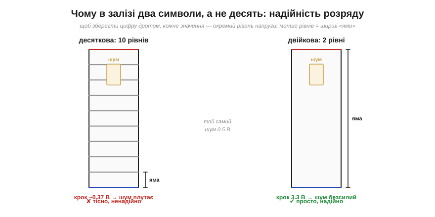
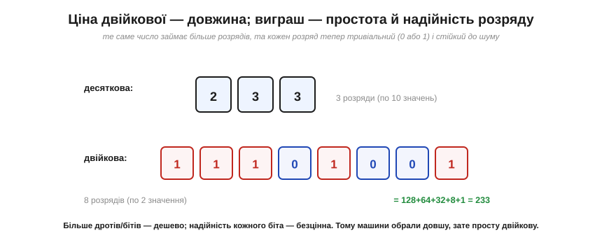
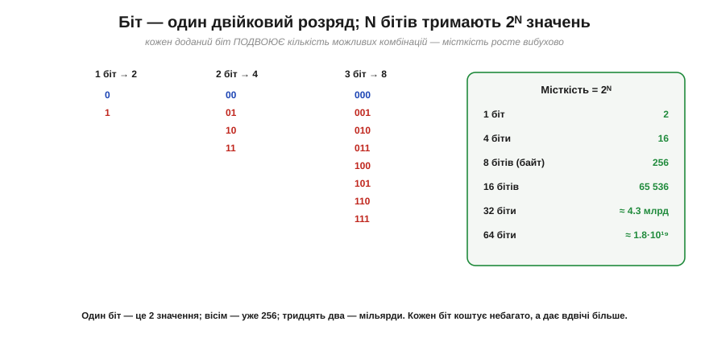
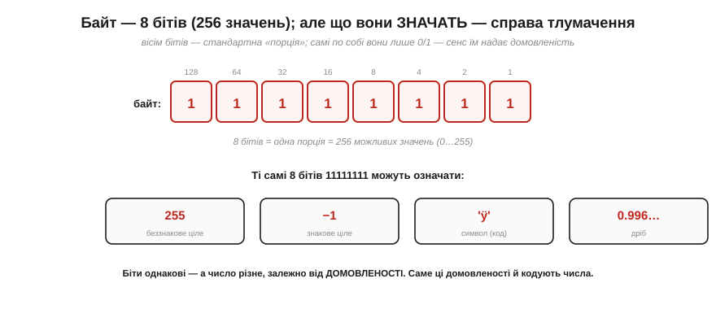
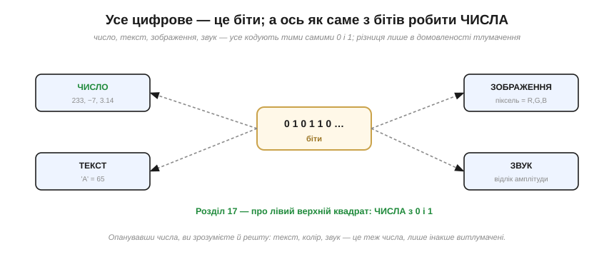

# Чому двійкова: два стани надійніші

Записати числа двома символами **можна** — Лейбніц довів це триста років тому. Та лишається питання: чому машини обрали саме двійкову, а не звичну десяткову? Адже людині десяткова зручніша. Відповідь та сама, що зробила [цифрову електроніку надійною](topic:hw-digital/why-digital), і вона про **надійність**: два стани переживають шум, який убив би десять. Ця тема — про те, чому «бідна» двійкова виявилася для заліза **найкращою**, і про найперші поняття без яких не рушити далі: біт, байт, місткість.

### Десяткова в залізі — це кошмар

Уявімо, що ми вперто хочемо зберігати числа в **десятковій** прямо в апаратурі — і то найпрямолінійнішим способом: **одна десяткова цифра = один рівень напруги** на дроті, десять різних рівнів в одному діапазоні. (Реальні десяткові машини, як-от ENIAC, насправді робили інакше — через десяткові лічильники чи BCD-коди, де кожну цифру однаково складали з кількох двійкових елементів; та щоб відчути, чому «багато рівнів на одному дроті» — погана ідея, найнаочніша саме ця пряма модель.) А тут спрацьовує те саме, що й у [логіці на двох рівнях](topic:hw-digital/why-digital): що **більше** рівнів утиснути в той самий розмах напруги, то **вужчі** [«ями» між ними](topic:hw-digital/noise-margin) й то легше шум переплутає сусідні значення.

*Зберігаючи десяткову цифру одним дротом, ми мусимо втиснути **десять** рівнів напруги — крок між ними мізерний (~0.37 В на 3.3 В), і навіть невеликий шум плутає сусідні цифри. У двійковій рівнів **два**, між ними зяє вся напруга — і той самий шум безсилий. Це точнісінько та сама [«яма Шеннона»](topic:hw-digital/why-digital), застосована не до логіки, а до **зберігання числа**.*

Ось і відповідь. Десяткова в залізі вимагала б тонкого розрізнення десяти рівнів — крихкого, чутливого до найменшої завади, температури, старіння. Двійкова ж потребує розрізнити лише «низько» й «високо» — найгрубіше, найнадійніше рішення, яке тільки можна уявити. Машина обрала двійкову не тому, що вона «красива» (хоч Лейбніц вважав саме так), а тому, що вона **виживає** там, де десяткова потоне в шумі.

### Ціна — довжина, виграш — надійність

За цю надійність ми платимо — і чесно назвімо ціну. Двійкові числа **довші** за десяткові: одне й те саме число займає більше розрядів.

*Число 233 у десятковій — це три розряди; у двійковій — аж вісім (11101001 = 128+64+32+8+1). Двійковий запис **утричі** довший. Та погляньте, чим ми заплатили й що отримали: кожен десятковий розряд мусив би розрізняти десять станів, а кожен двійковий — лише два. Розрядів більше, зате кожен — тривіальний і стійкий до шуму.*

Цей обмін — **довжина проти простоти розряду** — виявився надзвичайно вигідним. Додати ще один біт (ще один дріт, ще один тригер) — **дешево**: кремній дозволяє ставити їх мільярдами. А от зробити кожен розряд **надійним** — безцінно, бо від цього залежить, чи працюватиме машина взагалі. Тому інженерія без вагань обрала довшу, зате просту й надійну двійкову. Зайва довжина — дрібна плата за те, що кожен розряд має **величезний запас до шуму** й помиляється набагато рідше. (Зовсім без помилок не буває — лишаються і шум, і збої від випромінювання, і [метастабільність на межах](topic:hw-digital/metastability-timing); та двійковий розряд переживає те, що десятковий не пережив би.)

### Біт і місткість 2ᴺ

Тепер найперші терміни. Один двійковий розряд — це **біт** (*bit*, скорочення від *binary digit*; саме слово запропонував Джон Тьюкі 1947 року, а в науку його ввів Клод Шеннон). Біт — атом цифрової інформації: він зберігає рівно **одне з двох** значень, 0 або 1. А скільки різних значень зберігає кілька бітів разом?

*Кожен доданий біт **подвоює** кількість можливих комбінацій: 1 біт — це 2 значення (0, 1), 2 біти — 4 (00, 01, 10, 11), 3 біти — 8, і так далі. Загальне правило: **N бітів тримають 2ᴺ різних значень**. Місткість росте вибухово: 8 бітів — уже 256, 16 — понад 65 тисяч, 32 — більш як 4 мільярди, 64 — близько 1.8·10¹⁹.*

Запам'ятайте формулу **2ᴺ** — вона всюди. Це та сама «вибуховість», що роздуває [таблицю істинності](topic:hw-digital/gates-to-functions), а для чисел постає з **доброго** боку: як **місткість**. Кожен біт коштує небагато, а **подвоює** діапазон чисел, які можна виразити. Саме тому процесори бувають «8-бітні», «32-бітні», «64-бітні»: число бітів прямо каже, наскільки великі числа машина тримає в одному «шматку».

### Байт — і «те саме, та різне»

Серед усіх розмірів один став **стандартною порцією** — **байт** (*byte*), вісім бітів. Байт тримає 2⁸ = **256** значень, і саме байтами міряють пам'ять, файли, дані.

*Байт — вісім бітів, 256 можливих комбінацій. Та ось ключова думка: самі по собі біти — це лише 0 і 1, **без жодного вродженого сенсу**. Ті самі вісім одиниць 11111111 можуть означати 255 (беззнакове ціле), [−1 (знакове)](topic:math-number-theory/twos-complement-algebra), якийсь символ або [дріб 0.996…](topic:hw-arch/fixed-point) — залежно від **домовленості**, як їх тлумачити. Біти однакові, а число різне.*

Це — найважливіша ідея цифрової техніки. **Біти не містять сенсу — сенс надає їм домовленість.** Той самий байт 11111111 — це і 255, і −1, і буква, і частинка дробу, залежно від того, **як домовилися** його читати. Усі способи кодувати числа — це, по суті, каталог таких **домовленостей**: як тлумачити біти, щоб дістати [додатні](topic:math-number-theory/positional-systems) числа, [від'ємні](topic:math-number-theory/twos-complement-algebra), [дробові](topic:hw-arch/fixed-point), [великі](topic:hw-arch/floating-point). Кожна — це окремий «спосіб читання» тих самих 0 і 1.

### Усе цифрове — це біти

І ще одна думка, що ставить усе на місце. Не лише числа — **геть усе** цифрове закодоване тими самими 0 і 1.

*Число, текст, зображення, звук — усе це послідовності бітів; різниця лише в **домовленості тлумачення**. Текст — це числа-коди букв; піксель — це числа яскравості кольорів; звук — це числа-відліки амплітуди. У глибині все зводиться до чисел, а числа — до 0 і 1. Опанувавши, як із бітів постають **числа**, ви тримаєте ключ до решти.*

Ось чому кодування чисел таке фундаментальне: число — це **первинна** домовленість, з якої виростають усі інші. Навчившись кодувати числа, ви триматимете ключ до всього цифрового — бо текст, колір, звук — це теж числа, лише інакше витлумачені. Найпростіша з цих домовленостей, але вже не зовсім очевидна, — як власне [читати двійковий запис](topic:math-number-theory/positional-systems) як число, і чому програмісти так люблять його шістнадцятковий «скоропис».

> 🔧 **Навіщо це.** Три думки на все життя з цифрою. Перша: машини двійкові не з примхи, а заради **надійності** — два рівні дають величезний запас на шум, десять — мізерний; це той самий [компроміс](topic:hw-digital/why-digital), що визначив усю цифрову епоху. Друга: **N бітів = 2ᴺ значень** — ця формула підкаже, чи влізе ваше число в змінну: 8-бітна тримає 256 значень, 16-бітна — 65 тисяч, тож «лічильник на 8 біт» перерахує лише до 255 (а далі — [переповнення](topic:sf-lang/overflow-wraparound)). Третя, найголовніша: **біти самі по собі не мають сенсу** — той самий байт може бути 255, −1, буквою чи дробом; що він означає, вирішує **тип/домовленість**, яку ви, програміст, оголошуєте. Більшість «дивних» багів із числами — це коли біти прочитали **не за тією** домовленістю (знакове як беззнакове, ціле як дріб). Тримайте це в голові — і половина таких пасток вас омине.
