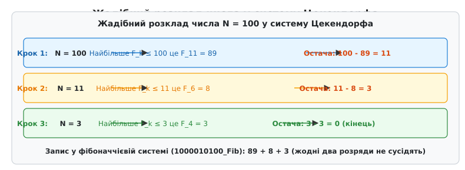
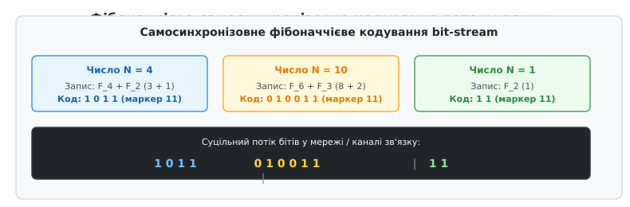
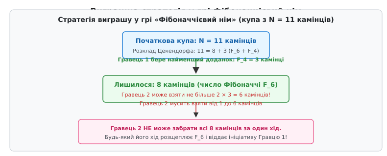

# Теорема Цекендорфа

<preknowlist>
- [Числа Фібоначчі](root:math-number-theory/fibonacci-numbers) — послідовність Fₙ = Fₙ₋₁ + Fₙ₋₂, де кожне наступне число є сумою двох попередніх.
- [Золотий перетин](root:math-number-theory/golden-ratio) — ірраціональне число φ = (1 + √5)/2, до якого прямує відношення сусідніх чисел Фібоначчі.
- [Математична індукція](root:math-logic/mathematical-induction) — метод доведення тверджень для всіх натуральних чисел через базу та індуктивний крок.
- [Двійкова арифметика](root:hw-digital/binary-arithmetic) — позиційна система числення за основою 2, ваги розрядів як степені двійки.
- [Рекурсія](root:sf-algorithms/recursion) — спосіб визначення функції або процедури через виклики самої себе.
</preknowlist>

Запис цілих чисел у вигляді суми доданків є основною ідеєю будь-якої системи числення. У звичайній двійковій системі ми розкладаємо число за степенями двійки: `1, 2, 4, 8, 16, 32, …`, де кожна вага розряду вдвічі більша за попередню. Спробуємо замінити степені двійки на числа Фібоначчі: `1, 2, 3, 5, 8, 13, 21, 34, 55, 89, …`. Візьмемо число `100` і спробуємо подати його як суму цих елементів. Одним зі способів є `89 + 8 + 3 = 100`. Проте це не єдиний спосіб: те саме число `100` можна подати як `55 + 34 + 8 + 3 = 100`, або як `55 + 21 + 13 + 8 + 3 = 100`, або навіть як `34 + 21 + 13 + 8 + 5 + 3 + 2 + 1 + 1 = 100`. На відміну від степенів двійки, де розклад на одиниці й нулі єдиний, числа Фібоначчі через своє рекурентне правило додавання дають безліч комбінацій для одного й того самого числа. Без додаткового обмеження така система запису стає неоднозначною і непридатною для надійного збереження чи обчислень.

Теорема Цекендорфа стверджує, що неоднозначність повністю зникає, якщо ввести одне-єдине природне правило: **у розкладі заборонено використовувати будь-які два числа Фібоначчі, що стоять поруч у вихідній послідовності**. Як тільки ми забороняємо взяття сусідніх розрядів (наприклад, заборонено одночасно брати `8` і `5`, або `34` і `21`), для будь-якого натурального числа `N` залишається рівно один-єдиний розклад. Це перетворює числа Фібоначчі на строгу позиційну систему числення, яка володіє унікальними комбінаторними й арифмометричними властивостями.

## Від неоднозначності до єдиничного розкладу

Щоб розібратися, чому заборона сусідніх доданків відновлює єдиність запису, подивімося на саме правило побудови чисел Фібоначчі:

```
Fₙ = Fₙ₋₁ + Fₙ₋₂
```

Це співвідношення показує, що будь-яку пару сусідніх чисел Фібоначчі `Fₙ₋₁` та `Fₙ₋₂` можна миттєво замінити на одне більше число `Fₙ`. Наприклад, замість суми `5 + 3` ми завжди можемо записати `8`. Замість суми `34 + 21` — записати `55`. Якщо у певному розкладі числа виникли два сусідні члени, вони є «незгорнутою» парою. Послідовне згортання таких пар від менших чисел до більших зменшує кількість доданків і зсуває їх убік вищих розрядів.

Виникає запитання: чи завжди процес згортання зупиняється на єдиному варіанті, і чи не можна отримати два різні «нескоротні» розклади для одного й того самого числа?

Для формулювання строгої теореми потрібно перш за все правильно впорядкувати базову послідовність. У класичному ряді Фібоначчі перші два члени дорівнюють одиниці: `F₁ = 1, F₂ = 1, F₃ = 2, F₄ = 3, F₅ = 5, …`. Якби ми дозволили використовувати і `F₁`, і `F₂`, то число `1` можна було б записати двома способами: як `F₁` або як `F₂`. Щоб уникнути цього дріб'язкового дублювання, у теоремі Цекендорфа першу одиницю `F₁ = 1` відкидають і починають нумерацію з `F₂ = 1`.

Тоді наша базова послідовність бере вигляд:

```
F₂ = 1
F₃ = 2
F₄ = 3
F₅ = 5
F₆ = 8
F₇ = 13
F₈ = 21
F₉ = 34
F₁₀ = 55
F₁₁ = 89
…
```

У цій послідовності кожний наступний член строго більший за попередній: `F₂ < F₃ < F₄ < F₅ < …`.

**Формулювання теореми Цекендорфа:** Будь-яке натуральне число `N ≥ 1` можна подати у вигляді суми одного або кількох різних чисел Фібоначчі з послідовності `(F₂ = 1, F₃ = 2, F₄ = 3, …)` так, щоб жодні два доданки не були сусідніми членами послідовності. Таке подання є абсолютно єдиним для кожного `N`.

Математично це записується так:

```
N = F_k₁ + F_k₂ + … + F_kₘ
```

де індекси доданків задовольняють умови:

```
k₁ > k₂ > … > kₘ ≥ 2
kⱼ − kⱼ₊₁ ≥ 2  для всіх j = 1, 2, …, m − 1
```

Нерівність `kⱼ − kⱼ₊₁ ≥ 2` якраз і означає, що різниця між індексами будь-яких двох сусідніх у розкладі доданків становить щонайменше `2`, тобто між ними в базовій послідовності пропускається принаймні один член.

## Жадібний алгоритм: побудова розкладу за кроками

Існування розкладу Цекендорфа доводиться конструктивно за допомогою **жадібного алгоритму** (англ. *greedy algorithm*). Ідея жадібного підходу полягає у тому, що на кожному кроці ми віднімаємо від поточного числа найбільше число Фібоначчі, яке не перевищує це число.

Розглянемо алгоритм покроково:

1. Нехай маємо поточне число `N`. Знайдемо у послідовності Фібоначчі таке число `F_k₁`, що `F_k₁ ≤ N < F_{k₁+1}`.
2. Запишемо `F_k₁` як найбільший доданок розкладу.
3. Обчислимо остачу `R₁ = N − F_k₁`.
4. Якщо `R₁ = 0`, алгоритм завершено.
5. Якщо `R₁ > 0`, повторимо процес для остачі `R₁`, знайшовши найбільше `F_k₂ ≤ R₁`.

Простежимо роботу алгоритму на конкретному числі `N = 100`:

1. Шукаємо найбільше число Фібоначчі, яке не перевищує `100`. Це `F₁₁ = 89` (наступне `F₁₂ = 144 > 100`).
   Перший доданок: `89`.
   Обчислюємо остачу: `100 − 89 = 11`.
2. Шукаємо найбільше число Фібоначчі, яке не перевищує `11`. Це `F₆ = 8` (наступне `F₇ = 13 > 11`).
   Другий доданок: `8`.
   Обчислюємо остачу: `11 − 8 = 3`.
3. Шукаємо найбільше число Фібоначчі, яке не перевищує `3`. Це `F₄ = 3` (наступне `F₅ = 5 > 3`).
   Третій доданок: `3`.
   Обчислюємо остачу: `3 − 3 = 0`.
4. Остача дорівнює нулю. Процес завершено.

Отримуємо розклад: `100 = 89 + 8 + 3 = F₁₁ + F₆ + F₄`.

Перевіримо індекси вибраних доданків: `11, 6, 4`.
Різниці між індексами: `11 − 6 = 5 ≥ 2` та `6 − 4 = 2 ≥ 2`.
Жодні два доданки не є сусідніми. Алгоритм збудував коректний розклад Цекендорфа.


*Жадібний розклад числа 100: на кожному кроці вибирається найбільше доступне число Фібоначчі, що залишає остачу, меншу за наступний нижчий розряд.*

Чому жадібний алгоритм **гарантовано** ніколи не вибирає сусідні числа Фібоначчі?

Доведення цього факту спирається на нерівність для остачі. Нехай на першому кроці ми обрали `F_k₁ ≤ N < F_{k₁+1}`.
Тоді остача `R₁ = N − F_k₁` задовольняє строгому обмеженню:

```
R₁ = N − F_k₁
< F_{k₁+1} − F_k₁    [оскільки N < F_{k₁+1}]
= F_{k₁−1}             [за рекурентним правилом F_{k₁+1} = F_k₁ + F_{k₁−1}]
```

Отже, остача `R₁` **строго менша** за `F_{k₁−1}`. Це означає, що наступне число Фібоначчі `F_k₂`, яке ми виберемо для остачі `R₁`, має бути строго меншим за `F_{k₁−1}`, тобто `F_k₂ ≤ R₁ < F_{k₁−1}`.
Звідси негайно випливає, що `k₂ ≤ k₁ − 2`, тобто `k₁ − k₂ ≥ 2`.

Ця проста нерівність є ключем до розуміння теореми: жадібний вибір на кожному кроці залишає остачу, яка фізично не здатна вмістити сусідній член Фібоначчі. Індуктивне застосування цієї нерівності доводить існування розкладу без сусідніх доданків для будь-якого натурального числа `N`.

> 🔧 **Навіщо це.** Жадібний алгоритм Цекендорфа виконується за логарифмічний час `O(log N)` і потребує лише таблиці чисел Фібоначчі. Це дозволяє використовувати його у мікроконтролерах та апаратних обчислювачах для швидкої конверсії чисел у стиснені розрядні форми без використання операцій ділення чи множення.

## Фібоначчієва система числення (Fibnotation)

За аналогією з двійковою системою числення, розклад Цекендорфа дозволяє записати будь-яке ціле число у вигляді послідовності бітів. Якщо розряд з вагою `Fₖ` присутній у розкладі, ми ставимо `1` на відповідній позиції; якщо відсутній — ставимо `0`.

Сформуємо таблицю розрядів, де молодший розряд `b₀` відповідає `F₂ = 1`, розряд `b₁` відповідає `F₃ = 2`, `b₂` відповідає `F₄ = 3`, і так далі:

```
Індекс розряду:  b₉   b₈   b₇   b₆   b₅   b₄   b₃   b₂   b₁   b₀
Вага розряду:   89   55   34   21   13    8    5    3    2    1
               ───  ───  ───  ───  ───  ───  ───  ───  ───  ───
Для N = 100:     1    0    0    0    0    1    0    1    0    0
```

Запис числа `100` у фібоначчієвій системі числення має вигляд:

```
100 = 1000010100_Fib
```

Головна комбінаторна особливість такого запису полягає у тому, що підпослідовність `11` **категорично заборонена** у будь-якому місці канонічного числа. Дві одиниці підряд означали б присутність двох сусідніх чисел Фібоначчі `Fₖ + Fₖ₋₁`, які замінюються на `Fₖ₊₁` (`011_Fib ⟶ 100_Fib`).

Порівняємо позиційні характеристики звичайної двійкової системи та фібоначчієвої системи:

1. **Основа системи:** У двійковій системі основа дорівнює `2`, ваги розрядів ростуть як `2ⁿ`. У фібоначчієвій системі відношення сусідніх ваг прямує до золотого перетину `φ ≈ 1.6180339887…`.
2. **Щільність одиниць:** У двійковій системі середній відсоток одиниць у випадковому числі становить `50%`. У фібоначчієвій системі через заборону `11` щільність одиниць значно нижча і становить близько `27.6%` (детальніше це описує [теорема Леккеркеркера](root:math-number-theory/zeckendorf-theorem/math-zeckendorf-proof.md)).
3. **Надлишковість:** Без умови Цекендорфа система з вагами Фібоначчі є надлишковою (одне число має багато записів). Умова Цекендорфа відсікає всі неканонічні записи, залишаючи рівно один розклад.

## Порівняння з іншими нетрадиційними системами числення

Система Цекендорфа не є єдиною нетрадиційною системою числення у теорії чисел. Порівняємо її із двома найближчими родинними конструкціями: розкладом за числами Люка та системою Бергмана (система числення з ірраціональною основою `φ`).

### Розклад за числами Люка

Послідовність чисел Люка визначається тими самими рекурентними співвідношеннями `Lₙ = Lₙ₋₁ + Lₙ₋₂`, але з іншими початковими значеннями: `L₀ = 2, L₁ = 1, L₂ = 3, L₃ = 4, L₄ = 7, L₅ = 11, L₆ = 18, …`.

Цекендорф довів, що натуральне число `N` також можна подати у вигляді суми несусідніх чисел Люка, проте з двома важливими застереженнями:
1. Заборона сусідства зберігається для більшості розрядів (`Lᵢ + Lᵢ₊₁` заборонено).
2. Оскільки `L₀ = 2` та `L₁ = 1`, сума `L₀ + L₁ = 3 = L₂`. Щоб зберегти єдиність для всіх натуральних чисел, вводиться додаткове обмеження: якщо у розкладі присутній доданок `L₀ = 2`, то доданок `L₂ = 3` також забороняється.

### Система числення Бергмана (Основа φ)

У 1960 році американський математик Джордж Бергман запропонував позиційну систему числення, де основою є ірраціональне число `φ = (1 + √5)/2`. Ваги розрядів у ній дорівнюють степеням золотого перетину: `… φ³, φ², φ¹, φ⁰, φ⁻¹, φ⁻², …`.

Оскільки `φ² = φ + 1`, у системі Бергмана також діє правило `011_φ ⟶ 100_φ`. Будь-яке ціле число можна записати у цій системі за допомогою скінченної кількості бітів після коми (наприклад, `2 = 10.01_φ = φ¹ + φ⁻² = 1.618 + 0.382 = 2`).

Зв'язок між системою Цекендорфа та системою Бергмана виявляється у тому, що цілочисельна частина розкладу Бергмана після згортання точно відображається на коефіцієнти Цекендорфа. Проте система Цекендорфа працює **виключно із цілими числами Фібоначчі**, не потребуючи дробових розрядів та від'ємних степенів.

## Динамічне програмування та обчислення комбінаторних кількостей

Як підрахувати кількість усіх можливих дозволених бітових послідовностей довжиною `k` бітів, які не містять жодної пари сусідніх одиниць `11`?

Позначимо через `A(k)` кількість валідних бітових послідовностей довжиною `k` бітів.
Розділимо всі такі послідовності за останнім бітом:
1. Послідовності, які закінчуються на `0`. Перед цим `0` може стояти будь-яка валідна послідовність довжиною `k − 1` бітів. Кількість таких варіантів дорівнює `A(k − 1)`.
2. Послідовності, які закінчуються на `1`. За правилом Цекендорфа, біт перед цією одиницею **мусить бути `0`**! А перед цим `0` може стояти будь-яка валідна послідовність довжиною `k − 2` бітів. Кількість таких варіантів дорівнює `A(k − 2)`.

Отже, загальна кількість допустимих бітових векторів довжиною `k` бітів задовольняє рекурентності:

```
A(k) = A(k − 1) + A(k − 2)
```

Базові значення: `A(1) = 2` (послідовності `0` та `1`), `A(2) = 3` (послідовності `00`, `01`, `10`).
Далі отримуємо послідовність: `2, 3, 5, 8, 13, 21, 34, 55, …`.

Це точно зсунута послідовність чисел Фібоначчі `A(k) = F_{k+2}`!

Цей комбінаторний факт показує глибинний взаємозв'язок між числами Фібоначчі та умовою відсутності сусідніх одиниць: кількість усіх можливих «чистих» бітових слів довжиною `k` бітів точно дорівнює `F_{k+2}`.

## Арифметика у фібоначчієвій системі: додавання без десятків

Як додавати числа, записані у фібоначчієвій системі, не переводячи їх попередньо у звичайну десяткову або двійкову форму?

У класичній двійковій арифметиці додавання викликає переноси за правилом `1 + 1 = 10` (дві одиниці в даному розряді дають одиницю у вищому). У фібоначчієвій арифметиці правило переносу складніше через те, що ваги розрядів задовольняють співвідношенню `Fₖ = Fₖ₋₁ + Fₖ₋₂`.

Для нормалізації бітового вектора після додавання застосовуються два основні правила локального згортання:

1. **Правило переносу сусідів (`011 ⟶ 100`):** Якщо у бітовому векторі утворилися дві одиниці підряд на позиціях `k − 1` та `k − 2`, вони замінюються на `00`, а на позицію `k` додається `1`. Це відповідає тотожності `Fₖ₋₁ + Fₖ₋₂ = Fₖ`.
2. **Правило розщеплення дубліката (`0200 ⟶ 1001`):** Якщо внаслідок додавання у деякому розряді `k` утворилася цифра `2` (два однакові доданки `2 Fₖ`), ця цифра розщеплюється на один вищий і один нижчий розряд:

```
2 Fₖ = Fₖ₊₁ + Fₖ₋₂    (для k ≥ 3)
```

Перевіримо це правило на числах: `2 · F₄ = 2 · 3 = 6`. А `F₅ + F₂ = 5 + 1 = 6`. Рівність виконується тотожно.

Для малих розрядів розщеплення двійки має окремі базові випадки:
- `2 F₂ = 2 · 1 = 2 = F₃` (тобто `2` у розряді `F₂` перетворюється на `1` у розряді `F₃`).
- `2 F₃ = 2 · 2 = 4 = 3 + 1 = F₄ + F₂` (тобто `2` у розряді `F₃` перетворюється на `1` у розряд `F₄` та `1` у розряд `F₂`).

Процес додавання двох чисел у фібоначчієвій системі складається з порозрядного додавання бітових векторів (що може утворити цифри `2` або сусідні одиниці `11`), після чого виконується серія локальних перетворень за правилами `0200 ⟶ 1001` та `011 ⟶ 100` доти, доки вектор не стане канонічним вектором Цекендорфа.

Простежимо приклад додавання `N₁ = 4` (`101_Fib`) та `N₂ = 6` (`1001_Fib`):

```
Крок 1: Порозрядне додавання
  0 1 0 0 1   (6 = 5 + 1)
+ 0 0 1 0 1   (4 = 3 + 1)
─────────────
  0 1 1 0 2

Крок 2: Обробка двійки у розряді F₂ (b₀): 2 · F₂ = F₃
  Розряд b₀ зменшується на 2, розряд b₁ (F₃) збільшується на 1:
  0 1 1 1 0

Крок 3: Виявлення триплету одиниць 0 1 1 1 0
  Застосовуємо 011 ⟶ 100 до старшої пари 11 на позиціях F₅, F₄:
  1 0 0 1 0   (значення: F₆ + F₃ = 8 + 2 = 10)
```

Перевірка значення: `10010_Fib` відповідає `F₆ + F₃ = 8 + 2 = 10`.
Початкова сума: `4 + 6 = 10`.
Результат канонізовано повністю без переведення у десяткову систему.

## Застосування 1: Самосинхронізовне фібоначчієве кодування

У теорії інформації та передачі даних однією з головних проблем є **поділ суцільного бітового потоку на окремі кодові слова**. У класичних кодах (наприклад, ASCII) кожне слово має фіксовану довжину (8 бітів). Проте для передачі чисел, які часто бувають малими й рідко — великими, фіксована довжина марнує пропускну здатність.

Коди змінної довжини (наприклад, код Гаффмана) потребують або насилання таблиці префіксів, або використання спеціальних розділових знаків.

Заборона підпослідовності `11` у розкладі Цекендорфа дає елегантне розв'язання цієї проблеми, відоме як **фібоначчієве кодування Еліаса-Фібоначчі**.

### Принцип побудови фібоначчієвого коду

Щоб закодувати натуральне число `N`:
1. Знаходимо розклад Цекендорфа для `N` у вигляді бітового вектора: `b₀ b₁ b₂ … bₖ`.
2. Записуємо біти розкладу у зворотному порядку — від молодшого розряду `b₀` до старшого `bₖ`.
3. Додаємо в самий кінець отриманого слова **один додатковий термінальний біт `1`**.

Оскільки канонічний розклад Цекендорфа закінчується одиницею на старшому розряді `bₖ = 1`, додавання ще однієї одиниці утворює на самому кінці кодового слова комбінацію `11`.

А оскільки у самому тілі розкладу `b₀ b₁ … bₖ` жодні дві одиниці не стоять поруч, пара `11` **ніколи не може з'явитися у середині кодового слова**. Вона виникає **виключно як маркер завершення числа**!


*Суцільний потік даних розділяється на числа без вказання довжини: декодер просто шукає першу пару одиниць 11, яка слугує неушкоджуваним маркером межі.*

Проілюструємо передачу триплету чисел `(4, 10, 1)` у вигляді суцільного бітового потоку:
- Число `4 = F₄ + F₂` (`101_Fib`). Запис від молодшого до старшого + термінатор: `1 0 1 1`.
- Число `10 = F₆ + F₃` (`10100_Fib` від старшого, або від молодшого: `0 1 0 0 1`). З термінатором: `0 1 0 0 1 1`.
- Число `1 = F₂` (`1_Fib`). З термінатором: `1 1`.

Суцільний потік бітів у каналі зв'язку:

```
101101001111
```

Декодер зчитує біт за бітом і шукає комбінацію `11`:
1. `1 0 1 1` ⟶ знайдено `11` на 4-му біті! Перше число: біти `1 0 1`, дешифруємо як `F₂ + F₄ = 1 + 3 = 4`.
2. `0 1 0 0 1 1` ⟶ знайдено `11` на 10-му біті! Друге число: біти `0 1 0 0 1`, дешифруємо як `F₃ + F₆ = 2 + 8 = 10`.
3. `1 1` ⟶ знайдено `11` на 12-му біті! Третє число: біт `1`, дешифруємо як `F₂ = 1`.

Потік розшифровано однозначно й без жодного додаткового байта метаданих.

### Порівняння ефективності з кодами Еліаса (Gamma та Delta)

У порівнянні з класичними кодами Еліаса (`γ` та `δ`), фібоначчієве кодування забезпечує кращу щільність для малих цілих чисел і вищу стійкість до збоїв:

| Число `N` | Двійковий код | Код Еліаса Gamma | Код Еліаса Delta | Фібоначчієвий код (з `11`) |
| :--- | :--- | :--- | :--- | :--- |
| `1` | `1` | `1` (1 біт) | `1` (1 біт) | `11` (2 біти) |
| `2` | `10` | `010` (3 біти) | `0100` (4 біти) | `011` (3 біти) |
| `3` | `11` | `011` (3 біти) | `0101` (4 біти) | `0011` (4 біти) |
| `4` | `100` | `00100` (5 бітів) | `01100` (5 бітів) | `1011` (4 біти) |
| `5` | `101` | `00101` (5 бітів) | `01101` (5 бітів) | `00011` (5 бітів) |
| `10` | `1010` | `0001010` (7 бітів) | `00100010` (8 бітів) | `010011` (6 бітів) |
| `100` | `1100100` | `0000001100100` (13 бітів) | `00111100100` (11 бітів) | `10000101001` (11 бітів) |

З таблиці видно, що для чисел `N ≥ 4` фібоначчієвий код часто коротший або рівний за довжиною за код Еліаса Delta, але на відміну від нього володіє властивістю **миттєвої самосинхронізації** при довільному зміщенні бітового вказівника.

Головна перевага фібоначчієвого коду — **стійкість до втрати синхронізації**. Якщо внаслідок збою в мережі один біт спотвориться або пропаде, декодер помилиться лише у поточному числі, але як тільки у потоці з'явиться наступна пара `11`, декодер **миттєво відновить синхронізацію** для всіх наступних слів. У звичайних двійкових кодах зміщення на один біт руйнує весь подальший потік даних до самого кінця файлу.

> 🔧 **Навіщо це.** Фібоначчієве кодування активно використовується в алгоритмах стиснення інвертованих індексів у пошукових рушіях (наприклад, для збереження списків документів), де потрібно зберігати мільйони малих цілочислових різниць (d-gaps) із мінімальними накладними витратами на роздільники.

## Застосування 2: Комбінаторні ігри та Фібоначчієвий нім

Теорема Цекендорфа несподівано виявляється виграшною стратегією у математичній грі **Фібоначчієвий нім** (англ. *Fibonacci Nim*), винайденій Майклом Левіном у 1963 році.

### Правила гри

1. Грають двоє гравців із єдиною купою з `N` камінців.
2. Перший гравець першим ходом може взяти будь-яку кількість камінців `k`, але не менше `1` і **не більше `N − 1`** (заборонено забирати всю купу на першому ході).
3. На кожному наступному ході поточний гравець може взяти від `1` до **`2m`** камінців, де `m` — кількість камінців, яку взяв попередній гравець на своєму попередньому ході.
4. Виграє той, хто забирає останній камінець.

Здавалося б, обмеження «не більше ніж удвічі більше за суперника» утворює складне дерево залежностей. Проте теорема Цекендорфа дає повний і точний критерій виграшних та програшних позицій.

### Виграшна стратегія Цекендорфа

**Теорема про Фібоначчієвий нім:** Другий гравець має виграшну стратегію тоді й лише тоді, коли початкова кількість камінців `N` є числом Фібоначчі. Якщо `N` не є числом Фібоначчі, виграшну стратегію має Перший гравець.

Розглянемо виграшну алгоритмічну інструкцію для Першого гравця, коли `N` не є числом Фібоначчі:

1. Записати поточну кількість камінців `N` у вигляді розкладу Цекендорфа:

```
N = F_k₁ + F_k₂ + … + F_kₘ
```

де `F_kₘ` — найменший доданок у розкладі.

2. Зробити хід: забрати рівно `F_kₘ` камінців.

Чому цей хід є припустимим і гарантує перемогу?

За умовою теореми Цекендорфа, різниця між індексами найменшого `F_kₘ` та передостаннього `F_{kₘ₋₁}` доданків становить щонайменше `2`: `kₘ₋₁ ≥ kₘ + 2`.
Звідси випливає фундаментальна оцінка для чисел Фібоначчі:

```
F_{kₘ₋₁} ≥ F_{kₘ + 2} = F_{kₘ + 1} + F_kₘ > 2 · F_kₘ
```

Отже, передостанній доданок `F_{kₘ₋₁}` **строго більший за подвоєне значення найменшого доданка** `2 · F_kₘ`!

Це означає, що після того, як Перший гравець забрав `F_kₘ` камінців, Другий гравець наступним ходом може взяти не більше `2 · F_kₘ` камінців. Але оскільки наступний доданок `F_{kₘ₋₁}` строго більший за `2 · F_kₘ`, Другий гравець **фізично не здатний забрати весь наступний доданок `F_{kₘ₋₁}`**!


*Виграшний крок у Фібоначчієвому німі: зняття найменшого доданка Цекендорфа (F₄ = 3) залишає купу F₆ = 8, яку суперник не може забрати за один хід.*

Будь-який хід Другого гравця лише «розщепить» наступне число Фібоначчі, утворивши новий нетривіальний розклад Цекендорфа, у якому Перший гравець знову зможе забрати найменший новий доданок. Процес продовжується доти, доки Перший гравець не забере останній камінець і не здобуде остаточну перемогу.

Простежимо гру на прикладі купи з `N = 11` камінців:
1. `11` не є числом Фібоначчі. Розклад Цекендорфа: `11 = 8 + 3 = F₆ + F₄`.
2. Найменший доданок: `F₄ = 3`.
3. Перший гравець забирає `3` камінці. У купі залишається `8` камінців.
4. Другий гравець може взяти не більше `2 · 3 = 6` камінців. Він не може забрати всі `8` камінців.
5. Хай що зробить Другий гравець (наприклад, візьме `2` камінці, залишивши `6 = 5 + 1`), Перший гравець на наступному кроці забере найменший доданок `1` і збереже повний контроль над грою до перемоги.

## Щільність і статистика: Теорема Леккеркеркера

Окрім чистої алгебри та комбінаторики, теорема Цекендорфа володіє глибокими статистичними властивостями.

У 1952 році нідерландський математик Герріт Леккеркеркер дослідив запитання: якщо вибрати випадкове ціле число `N` в інтервалі від `1` до `Fₙ`, скільки несусідніх доданків Фібоначчі у середньому міститиме його розклад Цекендорфа?

Леккеркеркер довів, що середня кількість доданків `Z̄ₙ` для чисел, менших за `Fₙ`, асимптотично задовольняє формулі:

```
        n            n
Z̄ₙ  ≈  ───────  ≈  ───────  ≈  0.1381966 · n
       1 + φ²       5 + √5
```

де `φ = (1 + √5)/2 ≈ 1.618` — золотий перетин.

Оскільки сама кількість доступних розрядів для числа `N < Fₙ` дорівнює `n − 2`, середня частка розрядів, встановлених у `1`, прямує до межі:

```
    1           1
─────────  =  ──────  ≈  0.2763932  (27.64%)
 1 + 1/φ       2 + φ
```

Це показує, що фібоначчієва система числення є природно **розрідженою**: лише трохи більше ніж чверть усіх бітів є одиницями.

У 2010-х роках математик Стівен Міллер довів ще більший факт: **розподіл кількості доданків у розкладі Цекендорфа підкоряється гауссовій (нормальній) кривій** при `n ⟶ ∞`. Кількість доданків для випадкового числа з інтервалу `[1, Fₙ]` флуктує довкола середнього значення `0.138 n` із дисперсією, яка також росте лінійно від `n`.

Детальніші матеріали про різні аспекти теореми Цекендорфа винесені у відповідні вставки:
- Про [історію відкриття Цекендорфом під час воєнного полону та працю Островського](root:math-number-theory/zeckendorf-theorem/hist-zeckendorf-discovery.md).
- Про [строге математичне доведення єдиносутності та теореми Леккеркеркера](root:math-number-theory/zeckendorf-theorem/math-zeckendorf-proof.md).
- Про [програмну реалізацію алгоритму та розрядного кодувальника](root:math-number-theory/zeckendorf-theorem/proj-zeckendorf-code.md).
- Про [довідник інтерфейсу API та таблиці розрядів](root:math-number-theory/zeckendorf-theorem/api-zeckendorf.md).

## Синтез

Теорема Цекендорфа показує, як нехитра заборона на сусідство у послідовності Фібоначчі перетворює неоднозначну суму на канонічну систему числення. Вона поєднує фундаментальні властивості елементарної теорії чисел із практичними потребами теорії інформації та алгоритмів: від самосинхронізовних мережевих кодів, стійких до втрати бітів, до аналізу виграшних стратегій у комбінаторних іграх. Завдяки логарифмічній швидкості розкладу та низькій щільності одиниць фібоначчієва система залишається важливим містком між діофантовим аналізом та сучасною комп'ютерною арифметикою.
