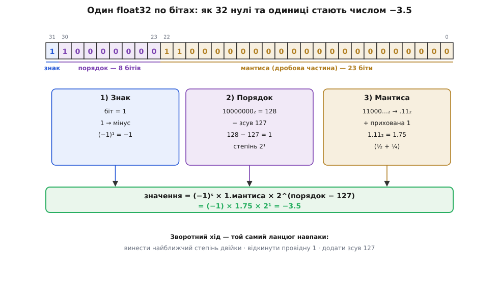
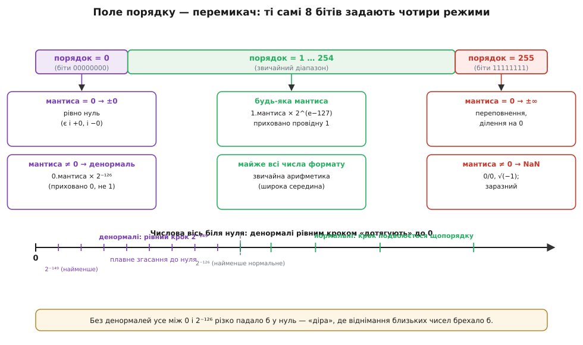

# 🧮 IEEE 754

> Математична вставка до [плаваючої коми](root:hw-arch/floating-point). Формат загалом простий: знак, порядок, мантиса і правило «значення = (−1)ˢ × 1.мантиса × 2^(порядок−127)». Але за цим правилом ховаються тонкощі — чому саме **зсув 127**, звідки береться **прихована одиниця**, що відбувається на самих **краях** діапазону — біля нуля й біля нескінченності. Тут розібрано ці 32 біти **до останнього розряду**: як декодувати запис, закодувати число назад і які чотири режими складають формат. Назва — від комітету IEEE (*Institute of Electrical and Electronics Engineers*, Інститут інженерів електротехніки й електроніки) та номера проєкту 754; історію стандарту винесено окремо: [Вільям Кехен і IEEE 754](root:hw-arch/floating-point/hist-ieee754.md).

### Три поля під мікроскопом

Почнімо з конкретного прикладу. Візьмемо запис `1 10000000 11000000000000000000000` (тридцять два біти float32) і відновимо число, яке він кодує. Кожне з трьох полів читається окремо, а тоді все зводиться в одну формулу.


*Формат IEEE 754 крок за кроком. **Знак** (1 біт): 1 означає мінус, тож множник (−1)¹ = −1. **Порядок** (*exponent*, 8 бітів): двійкове 10000000 — це 128; віднімаємо **зсув** (*bias*) 127 і дістаємо справжній степінь 2¹. **Мантиса** (*significand*, 23 біти): біти 11000…₂ дають дробову частину .11₂ = 0.75, до якої додаємо **приховану одиницю**, тож повне значення мантиси — 1.11₂ = 1.75. Разом: (−1) × 1.75 × 2¹ = −3.5. Унизу позначено, що кодування числа — це той самий ланцюг навпаки.*

Уся механіка зведена до трьох незалежних дій: знак дає множник ±1, порядок дає степінь двійки, мантиса дає число в межах [1, 2). Перемноживши їх, дістаємо значення. Уся ж цікавість формату — у питанні «а що як поле порядку має не звичайне 128, а крайнє значення?»; та перш ніж дійти до країв, варто зрозуміти, чому порядок узагалі зберігається зі зсувом.

### Зсунутий порядок: чому не доповняльний код

Порядок мусить бути **знаковим** — велике число має додатний степінь (2¹⁰⁰), крихітне від'ємний (2⁻¹⁰⁰). Знаковий формат для цілих уже є — [доповняльний код](root:math-number-theory/twos-complement-algebra) (*two's complement*). Чому ж тут не він, а дивний «відняти 127»?

Причина практична й елегантна. **Зсунутий порядок** (*biased exponent*) зберігає не сам степінь e, а суму e + 127, тобто завжди **невід'ємне** число від 0 до 255. Вигода в тому, що додатні float тоді можна **порівнювати як звичайні цілі**: більший порядок — більші біти — більше число, тож процесор сортує їх дешевим цілочисловим порівнянням, без спецкоду для знаку степеня. Доповняльний код такої властивості не дав би: його старший біт «перевертає» порядок зростання, і порівняння збилося б на межі знаку.

Зсув для float32 — рівно 127 (= 2⁷ − 1), для подвійної точності — 1023 (= 2¹⁰ − 1): половина діапазону поля, тож степені діляться приблизно навпіл на додатні й від'ємні. Звичайні (нормальні) числа займають значення поля від 1 до 254; два крайні, 0 і 255, зарезервовано — і саме вони роблять формат цікавим.

### Прихована одиниця і як закодувати число назад

Перш ніж дійти до країв, доберімо ще одну хитрість формату — **приховану одиницю** (*hidden bit*, *implicit leading 1*). У двійковій нормалізованій нотації будь-яке ненульове число подають як 1.щось × 2^e: провідна цифра **завжди** одиниця, бо нулів зліва ми позбулися нормалізацією. А якщо вона завжди одна й та сама — її нема сенсу зберігати. Тож IEEE 754 її **викидає**: 23 біти мантиси несуть лише дробову частину після коми, а одиницю перед комою формат домальовує сам. Так float32 безкоштовно отримує 24-й біт точності — звідси й ≈ 7 десяткових цифр, а не 6.

Той самий ланцюг працює й **у зворотний бік** — так компілятор перетворює літерал `-3.5f` у вихідному коді на 32 біти в пам'яті:

```
−3.5  →  знак мінус                    s = 1
        |−3.5| = 3.5 = 1.75 × 2¹       нормалізуємо: 1.xxx × 2^e
        степінь e = 1                  → порядок = e + 127 = 128 = 10000000₂
        мантиса 1.75 = 1.11₂           дробова частина .11 → 11000000000000000000000
підсумок: 1 | 10000000 | 11000000000000000000000
```

Три кроки кодування — винести найближчий степінь двійки, відкинути провідну одиницю, додати зсув 127 — дзеркальні до трьох кроків декодування.

Той самий розбір легко зробити в коді — це частий прийом на мікроконтролері, коли треба вручну дістати порядок числа чи перевірити його биті. Щоб дотягтися до окремих полів, біти `float` спершу копіюють у ціле тієї самої ширини (саме `memcpy`, а не приведення вказівників — інакше це невизначена поведінка), а тоді розрізають масками й зсувами.

**Розберемо ті самі 32 біти float32 у три поля й відновимо значення −3.5.**

:::tabs
```c
#include <stdint.h>
#include <string.h>
#include <math.h>

// Дістати з float три поля IEEE 754 single і зібрати значення назад.
float decode_f32(float x) {
    uint32_t bits;
    memcpy(&bits, &x, sizeof bits);        // біти float як ціле — без UB

    uint32_t s    =  bits >> 31;           // 1 біт знаку (позиція 31)
    uint32_t exp  = (bits >> 23) & 0xFF;   // 8 бітів порядку (30..23)
    uint32_t mant =  bits & 0x7FFFFF;      // 23 біти мантиси (22..0)

    // −3.5f → s = 1, exp = 128, mant = 0x600000 (двійкове 110...0)
    float sign = (s ? -1.0f : 1.0f);
    float frac = 1.0f + (float)mant / 0x800000;   // прихована 1 + дріб/2^23
    return sign * frac * ldexpf(1.0f, (int)exp - 127);   // × 2^(exp−127)
}
```
```python
import struct

# Дістати з float три поля IEEE 754 single і зібрати значення назад.
def decode_f32(x):
    # біти float32 як ціле — без UB (пакування в 4 байти)
    bits = struct.unpack("<I", struct.pack("<f", x))[0]

    s    =  bits >> 31          # 1 біт знаку (позиція 31)
    exp  = (bits >> 23) & 0xFF  # 8 бітів порядку (30..23)
    mant =  bits & 0x7FFFFF     # 23 біти мантиси (22..0)

    # −3.5 → s = 1, exp = 128, mant = 0x600000 (двійкове 110...0)
    sign = -1.0 if s else 1.0
    frac = 1.0 + mant / 0x800000   # прихована 1 + дріб/2^23
    return sign * frac * 2.0 ** (exp - 127)   # × 2^(exp−127)
```
:::

Підставивши `-3.5f`, дістаємо `s = 1`, `exp = 128`, `mant = 0x600000`; тоді `frac = 1 + 0x600000/0x800000 = 1.75`, а `ldexpf(1, 128−127) = 2`, тож результат — рівно `-3.5`. Гілки для денормалей і `exp = 255` тут свідомо опущено — їх додають окремою перевіркою, коли поле порядку набуває крайнього значення, бо тоді правило збирання числа міняється.

### Чотири режими поля порядку

Тепер — обіцяні краї. Усе хитре в IEEE 754 ховається в тому, що з **256** значень поля порядку два крайні (усе нулі та всі одиниці) формат тлумачить **особливо**. Виходить не один режим, а чотири.


*Те саме 8-бітове поле порядку керує **усім**. **Порядок = 0** (усе нулі): якщо мантиса теж нульова — це рівно **±0** (так, є і додатний, і від'ємний нуль); якщо мантиса ненульова — це **денормаль** зі степенем 2⁻¹²⁶ і **прихованим нулем** замість одиниці. **Порядок = 1…254**: звичайні (нормальні) числа за основною формулою формату — переважна більшість усіх значень. **Порядок = 255** (усі одиниці): нульова мантиса дає **±∞**, ненульова — **NaN**. Унизу — числова вісь біля нуля: денормалі рівномірним кроком «дотягують» від найменшого нормального (2⁻¹²⁶) аж до нуля, закриваючи діру, яка без них зяяла б.*

Запам'ятати легко так: **порядок — це перемикач режиму**, а мантиса лише уточнює, що саме всередині режиму. Звичайні числа займають широку середину; обидва краї відведено під особливі випадки, без яких арифметика плавала б нерівно.

### Денормалі: плавне заникання до нуля

Найтонший із країв — **порядок = 0** з ненульовою мантисою. Тут формат міняє правило: прихована одиниця стає **прихованим нулем**, а степінь фіксується на 2⁻¹²⁶. Значення стає 0.мантиса × 2⁻¹²⁶ — це **денормаль** (*subnormal*, *denormal*).

Навіщо такий виняток? Без нього найменше додатне нормальне число — 2⁻¹²⁶ ≈ 1.2 × 10⁻³⁸, а **наступне** за ним донизу було б уже нуль; між ними зяяла б прірва, у якій будь-який менший результат різко падав би в нуль — **раптове заникання** (*underflow*). Це не косметична вада. Відніміть два майже рівні числа a і b: різниця має бути дрібною, та не нульовою, а формат округлив би її в нуль. Тоді перевірка «a ≠ b, отже a − b ≠ 0» зламалася б, і подальше ділення на (a − b) дало б ділення на нуль — на рівному місці.

Денормалі закривають цю прірву **поступовим заниканням** (*gradual underflow*): між найменшим нормальним числом і нулем формат розставляє рівномірно віддалені денормалі з кроком аж до 2⁻¹⁴⁹ (найменше додатне float32-число). Числа біля нуля не обриваються, а плавно тануть, втрачаючи по біту точності, аж доки м'яко не дійдуть до нуля. Кехен бився за цей режим у комісії саме тому, що він рятує тонкі числові алгоритми (про цю битву — в історичній вставці поряд). Ціна — апаратна: денормалі рідкісні, тож деякі процесори обробляють їх повільно, і числовий код інколи навмисне округлює їх у нуль.

### ∞ і NaN: коли порядок весь в одиницях

Протилежний край — **порядок = 255** (усі вісім бітів одиниці). Він теж розпадається на два випадки за мантисою.

Нульова мантиса дає **нескінченність** (*infinity*, ±∞). Вона виникає від переповнення (число завелике для формату) або ділення додатного на нуль, і поводиться за правилами математики границь: ∞ + 1 = ∞, 1/∞ = 0. Знак ∞ задає звичний біт знаку, тож є і +∞, і −∞.

Ненульова мантиса дає **NaN** (*Not a Number*, «не число») — результат операції, що **не має** осмисленого значення: 0/0, ∞ − ∞, √(−1), log(−1). NaN **заразний**: будь-яка арифметика з ним дає знову NaN, тож одна хибна операція позначає весь подальший ланцюг. Має NaN і ще одну дивну рису: він **не дорівнює нічому, навіть собі**. Вираз `x != x` істинний **тільки** тоді, коли x — це NaN; це стандартний спосіб його впіймати.

Оскільки під NaN підходить **будь-яка** ненульова мантиса (23 біти), бітових комбінацій NaN — мільйони. Старший біт мантиси розрізняє два ґатунки: **тихий** NaN (*quiet*, qNaN — той біт = 1) мовчки поширюється далі, а **сигнальний** (*signaling*, sNaN — той біт = 0) призначений збуджувати апаратний виняток, коли в обчисленні з'явилося щось геть неприпустиме. Решта бітів мантиси може нести діагностичний «вантаж» (*payload*) — підказку, звідки взялося це не-число.

> 🔧 **Навіщо це.** Знати ці краї треба не з цікавості. На мікроконтролері в обчисленнях раптом з'являється `inf` — майже завжди це переповнення float32 (вийшли за ~3.4 × 10³⁸) або ділення на нуль, яке варто було відсікти заздалегідь. Бачите `nan` у логах — десь трапилося 0/0 чи корінь з від'ємного, і його треба ловити **в місці народження**, перевіркою `x != x`, поки він не отруїв увесь розрахунок (порівняння `x == NAN` не спрацює — NaN не дорівнює навіть собі). А коли дешевий сенсор віддає підозріло «прилипле» крихітне число, що ніяк не дійде до нуля, — це денормалі, і на чипі без апаратної їх підтримки вони здатні непомітно сповільнити цикл.

### Крок між числами: ULP

Залишилося **точно** виміряти головну особливість [плаваючої коми](root:hw-arch/floating-point) — нерівномірну точність. Відстань між сусідніми float-числами зветься **ULP** (*unit in the last place*, «одиниця останнього розряду»). Усередині одного порядку 23 біти мантиси ділять відрізок [2ᵉ, 2ᵉ⁺¹) на 2²³ рівних крихт, тож крок там сталий:

```
ULP(x) ≈ 2^(e − 23),   де e — порядок числа x (степінь двійки)

біля 1   (e = 0):   ULP = 2⁻²³ ≈ 1.2 × 10⁻⁷    ← звідси ~7 значущих цифр
біля 2¹⁶ (65 536):  ULP = 2⁻⁷  ≈ 0.0078
біля 2²³ (8.4 млн): ULP = 2⁰   = 1             ← цілі ще представні точно
біля 2²⁴ і далі:    ULP ≥ 2                    ← навіть +1 уже «зникає»
```

Звідси механіка зникання видна строго: щойно число переростає 2²⁴, його ULP стає більшим за 1, і додавання одиниці не зрушує жодного біта мантиси — результат тотожний доданку. Ось чому `1e9 + 1 == 1e9` у float32: при e = 29 крок ULP ≈ 64, тож одиниця тоне далеко під ним. **Відносна** точність float (сталі ~7 цифр на будь-якому масштабі) — це прямий наслідок того, що ULP подвоюється щопорядку, рівно як подвоюється й сам відрізок [2ᵉ, 2ᵉ⁺¹).

### Де це працює на практиці

Розкладений на окремі біти, формат [плаваючої коми](root:hw-arch/floating-point) перестає бути загадкою, і кожна його деталь має прямий практичний слід. **Зсунутий порядок** пояснює, чому порівняння float дешеве, — і одразу його межу: безпечно порівнювати як цілі можна лише додатні числа, бо знак і NaN ламають монотонність, тож **результати обчислень** через `==` порівнювати не варто. **ULP** перетворює туманне «точність відносна» на формулу 2^(e−23), якою оцінюють, чи переживе доданок додавання до великого числа. **Денормалі**, **∞** і **NaN** — це крайні стани, через які реальні розрахунки на МК і ламаються, і кожен упізнаваний за полем порядку. А **прихована одиниця** показує, чим float відрізняється від [фіксованої коми](root:hw-arch/fixed-point): та тримала всі біти явно й рівний крок, а float цим кроком жертвує заради діапазону — і саме прихований біт та зсунутий порядок є тим механізмом, яким він цей розмін здійснює.
