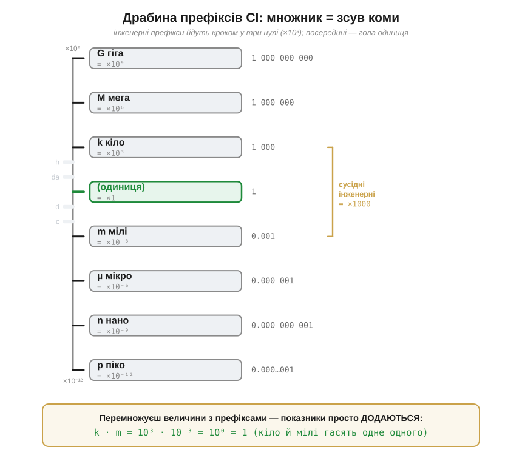
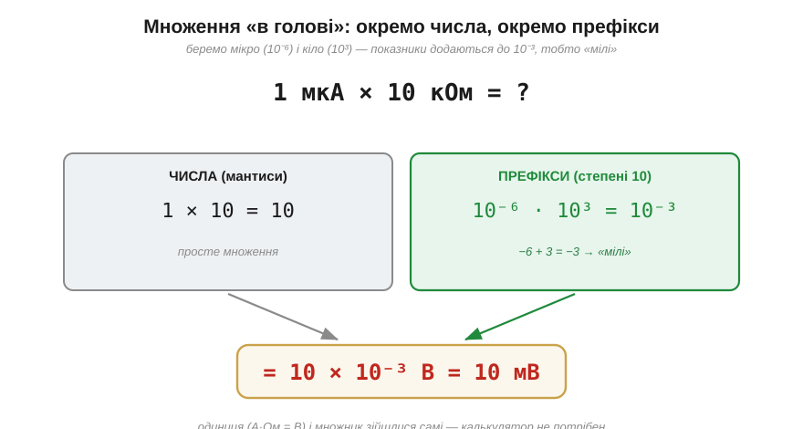

# 🧮 Префікси СІ та інженерна нотація: 1 мкА × 10 кОм = 10 мВ у голові

### Префікс — це просто множник, степінь десятки

Спочатку головне й найпростіше: **префікс** (лат. *praefixus* — прикріплений спереду) **не міняє величину, він міняє лише множник перед нею**. «Кіло» — це завжди ×1000, хоч до метрів, хоч до омів, хоч до джоулів. «Мілі» — завжди ÷1000. Префікс — це коротке ім'я для степеня десятки, і нічого більше:

```
кіло  (k)  = ×10³   = ×1000
мега  (M)  = ×10⁶   = ×1 000 000
мілі  (m)  = ×10⁻³  = ÷1000
мікро (µ)  = ×10⁻⁶  = ÷1 000 000
нано  (n)  = ×10⁻⁹
```

Тому «10 кОм» — це не якась окрема одиниця, а просто `10 × 10³ Ом = 10000 Ом`, записане коротше й читабельніше. А «1.5 [вольта](root:hw-sensing/volt)» і «1500 мВ» — це **те саме число**, лише вбране в різні приставки.


*Драбина префіксів. Кожен щабель — степінь десятки; зелений центр — гола одиниця (×1). Робочі (інженерні) префікси стоять кроком **у три нулі** — k, M, G вгору й m, µ, n, p вниз; бліді сусіди (санти, деци, гекто) у техніці майже не вживаються. Праворуч унизу — головний фокус усієї теми: при множенні показники просто **додаються**.*

### Чому в техніці крок саме «через три нулі»

Придивіться до драбини: робочі префікси йдуть не підряд, а **через три порядки** — кіло, мега, гіга; мілі, мікро, нано, піко. Між ними сидять санти й деци, але інженери їх майже не чіпають (сантиметр — рідкісний виняток, що дожив з побуту). Чому?

Бо так влаштована **інженерна нотація** (*engineering notation*) — близька родичка наукової. У науковій нотації показник буває будь-яким (`4.7 × 10⁻⁵`). В інженерній показник завжди **кратний трьом** (`47 × 10⁻⁶`), і кожному такому показнику відповідає рівно один префікс. Це не примха: саме на крок у три нулі розрахований і калькулятор з кнопкою `EXP`, і запис номіналів на схемах. Тому `0.000047 Ф` інженер запише не як `4.7 × 10⁻⁵ Ф`, а як `47 мкФ` — ту саму величину, але вже з готовим префіксом і без зайвих нулів.

> 🔧 **Навіщо це.** Уся номенклатура електроніки тримається на цих кроках через три нулі: резистори лічать в Ом / кОм / МОм, конденсатори — у пФ / нФ / мкФ, струми — в мкА / мА / А. Якщо приставки в голові «клацають» одразу на потрібний степінь, даташит читається без перекладача; якщо ні — кожен номінал доводиться спершу подумки переписувати на нулі, і тут легко проґавити порядок.

### Головний фокус: при множенні показники додаються

Тепер — те, заради чого все. Будь-яке число з префіксом зручно бачити як **дві частини**: звичайне число (мантиса; лат. *mantissa* — додаток) і множник-степінь. Коли дві такі величини перемножуються, ці частини живуть **окремо**:

```
числа    перемножуємо як завжди:   a × b
степені  лише ДОДАЄМО показники:   10ᵐ × 10ⁿ = 10ᵐ⁺ⁿ
```

Це єдине правило степенів, і воно перетворює страшний на вигляд добуток на дві дрібниці, які робляться усно. Візьмемо заголовний приклад. Хай крізь опір 10 кОм тече струм 1 мкА (мікроампер — типовий «тихий» струм давача чи витоку). Перемножимо роздільно:


*Той самий добуток «в голові». Ліворуч — мантиси: 1 × 10 = 10. Праворуч — префікси: мікро (10⁻⁶) на кіло (10³); показники додаються, −6 + 3 = −3, а 10⁻³ — це і є «мілі». Звести докупи: 10 × 10⁻³ = 10 мВ. Калькулятор не торкнувся.*

```
числа:    1 × 10            = 10
префікси: µ × k = 10⁻⁶ × 10³ = 10⁻³  (це «мілі»)
разом:    10 × 10⁻³ В       = 10 мВ
```

Помітьте найкрасивіше: **мікро й кіло частково гасять одне одного**. −6 + 3 = −3 — з мікроампера й кілоома виходить не якийсь дикий порядок, а охайні мілівольти. Це не випадок, а закономірність, варта запам'ятовування на все життя:

```
µ × k = 10⁻⁶ × 10³ = 10⁻³ = m      (мікро × кіло = мілі)
m × k = 10⁻³ × 10³ = 10⁰  = 1      (мілі × кіло = одиниця)
```

Друга з цих рівностей — улюблениця інженерів: **мілі та кіло скорочуються начисто**. Тому мілі-щось, помножене на кіло-щось, одразу дає голу одиницю результату — приставки зникають іще до того, як ви дописали приклад.

### Звідки взявся вольт у цьому прикладі

Можливо, ви помітили, що множення ампера на ом дало саме вольти. Звідки? Це проста перевірка одиниць у дусі [аналізу розмірностей](root:math-numeric/dimensional-analysis): добуток `А × Ом` за самими одиницями зводиться до вольта (А·Ом = В). Те, що опір в омах саме так [пов'язує струм із напругою](root:hw-analog/ohms-law), має власне пояснення; тут важливе інше: **алгебра префіксів працює однаково, хоч би які величини ви перемножували**. Ампер на ом, кулон на вольт, ват на секунду — щоразу мантиси множаться, а показники додаються. Сам прийом від фізики не залежить.

### Підводний камінь: спершу базові одиниці, потім дроби й корені

Просте додавання показників діє бездоганно для множення й ділення. Та з ним пов'язана найчастіша пастка новачка, і про неї варто сказати прямо: [перевірка розмірностей](root:math-numeric/dimensional-analysis) **не ловить** помилки в префіксах — одиниці зійдуться, а множник буде хибний. Тож тримаймо два правила.

Перше: у складніших формулах — де величини **діляться**, підносяться до квадрата чи стоять під коренем, — найбезпечніше спершу перевести все у **базові одиниці** (вольти, ампери, оми, фаради, секунди), порахувати, а префікс навісити вже на відповідь. Бо при діленні показники **віднімаються**, а при піднесенні до степеня **множаться** — і «кіло» під квадратом тихо стає «мега» (10³ у квадраті = 10⁶), що легко проґавити поспіхом.

Друге, дрібне, але дошкульне на письмі: **великі й малі літери — різні приставки**. `M` — це мега (×10⁶), а `m` — мілі (×10⁻³); вони розходяться в **мільярд** разів. Так само `k` (кіло) пишуть малою — `K` зарезервована під зовсім інше. Сплутати регістр у позначенні — це помилитися не на трохи, а на дев'ять порядків.

### Де це працює

Цей рефлекс — фоновий навик усієї практичної електроніки. Той самий прийом стоїть, наприклад, за перерахунком ємності батарейки з `мА·год` у кулони (теж гра приставок з [електричним зарядом](root:ph-electromagnetism/electric-charge)). Добутки на кшталт `мкА × кОм` трапляються чи не на кожній сторінці даташита — і кожен має згортатися в голові за секунду. Та сама пара чисто скорочується і в зарядженні-розрядженні конденсатора: `мкФ × кОм` дає мілісекунди (10⁻⁶ × 10³ = 10⁻³ с) — це і є [стала часу RC](root:hw-analog/rc-time-constant). Навичка одна: бачити в «1 мкА × 10 кОм» не множення дрібних чисел, а просто `1×10` для мантис і `−6+3` для степенів — і половина усної арифметики електроніки робитиметься, поки рука ще тягнеться до калькулятора.
