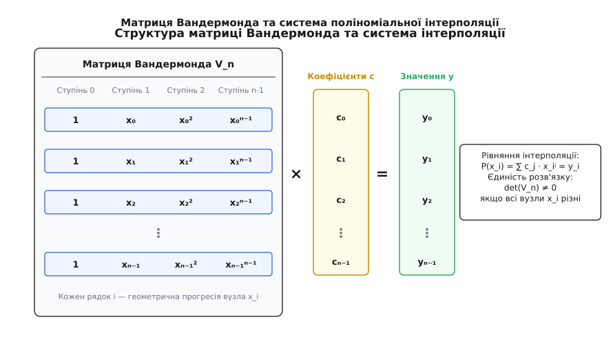
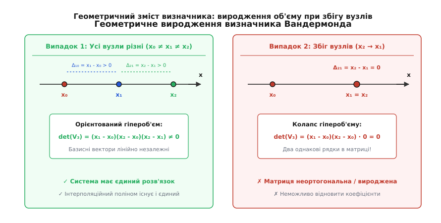
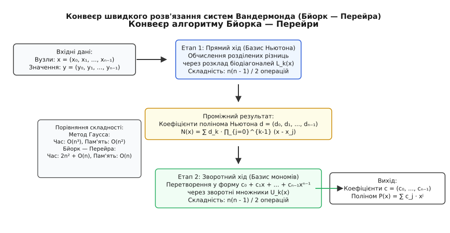

# Визначник Вандермонда

<preknowlist>
- [Многочлени](root:math-algebra/polynomials) — алгебраїчні многочлени, коефіцієнти, степені, корені та теорема Безу.
- [Лінійні системи рівнянь](root:math-algebra/linear-systems) — системи лінійних алгебраїчних рівнянь, матрична форма A · x = b, поняття невиродженості та сумісності.
- [Поліноміальна інтерполяція Лагранжа](root:math-numeric/lagrange-interpolation) — побудова многочлена степеня n - 1, що точно проходить крізь n заданих точок.
- [Число обумовленості](root:math-numeric/condition-number) — чутливість розв'язку лінійної системи до збурень у вхідних даних та втрата точності з плаваючою комою.
</preknowlist>

Коли бортовий комп'ютер безпілотного апарата відновлює просторову траєкторію польоту за дискретними відліками інерціальних датчиків та супутникового приймача, або коли криптографічний сервер розподіляє майстер-ключ доступу між п'ятьма адміністраторами за схемою порогової безпеки, в основі цих різних інженерних систем лежить одне й те саме алгебраїчне завдання: знайти неперервний поліном, який точно проходить крізь заданий набір дискретних точок.

Уявімо ситуацію: під час калібрування вимірювального приладу інженер отримує `n` експериментальних пар даних `(x₀, y₀), (x₁, y₁), ..., (x_{n-1}, y_{n-1})`. Координати `x_i` являють собою моменти часу або просторові координати датчиків, причому всі ці точки є строго різними (`x_i ≠ x_j` при `i ≠ j`), а величини `y_i` — виміряними фізичними показниками (температурою, тиском, напругою або значеннями криптографічних часток). Природне інженерне прагнення — знайти єдину аналітичну залежність у вигляді алгебраїчного многочлена:

```
P(x) = c₀ + c₁ · x + c₂ · x² + ... + c_{n-1} · x^{n-1}
```

який точно задовольняє умови інтерполяції `P(x_i) = y_i` для кожного індексу `i` від `0` до `n - 1`.

Якщо виписати цю вимогу окремо для кожної точки, ми отримаємо систему з `n` лінійних алгебраїчних рівнянь відносно `n` невідомих коефіцієнтів `c₀, c₁, ..., c_{n-1}`:

```
c₀ · 1 + c₁ · x₀ + c₂ · x₀² + ... + c_{n-1} · x₀ⁿ⁻¹ = y₀
c₀ · 1 + c₁ · x₁ + c₂ · x₁² + ... + c_{n-1} · x₁ⁿ⁻¹ = y₁
c₀ · 1 + c₁ · x₂ + c₂ · x₂² + ... + c_{n-1} · x₂ⁿ⁻¹ = y₂
...
c₀ · 1 + c₁ · xₙ₋₁ + c₂ · xₙ₋₁² + ... + c_{n-1} · xₙ₋₁ⁿ⁻¹ = yₙ₋₁
```

Матриця коефіцієнтів цієї системи має фундаментальну структуру: її `i`-й рядок складено з послідовних степенів вузла `x_i`, починаючи від нульового степеня `x_i⁰ = 1` і закінчуючи максимальним степенем `x_i^{n-1}`. Цю таблицю чисел у лінійній алгебрі називають **матрицею Вандермонда**.

Чи гарантовано існує такий поліном для будь-яких довільно обраних висот `y_i`? Чи не може виявитися, що система не має розв'язку або має безліч різних розв'язків? З курсу лінійної алгебри відомо: квадратна система рівнянь має єдиний розв'язок для будь-якої правої частини тоді й лише тоді, коли визначник матриці коефіцієнтів не дорівнює нулю. Для матриці Вандермонда цей визначник згортається у дивовижно елегантну формулу — він точно дорівнює добутку всіх можливих попарних різниць між координатами вузлів. Якщо всі вузли є різними числами, жодна з різниць не дорівнює нулю, отже, визначник гарантовано ненульовий, а інтерполяційний поліном існує і є абсолютно єдиним.

А про те, як французький вчений Александр-Теофіль Вандермонд у 1771 році відкрив ці закони симетрії під час дослідження спільних коренів рівнянь, розписано в історичному нарисі: [як Александр-Теофіль Вандермонд досліджував функції у 1771 році та чому матриця отримала його ім'я](root:math-numeric/vandermonde-determinant/hist-vandermonde-origins.md).

---

### Анатомія матриці Вандермонда та постановка задачі

Нехай задано впорядкований набір із `n` елементів `x₀, x₁, x₂, ..., x_{n-1}`, які ми надалі називатимемо **вузлами інтерполяції**. Залежно від конкретної прикладної задачі ці вузли можуть бути дійсними числами на числовій осі, комплексними фазовими експонентами на одиничному колі або елементами скінченного поля Галуа `GF(256)`.

Квадратна матриця Вандермонда розміру `n × n`, яку ми позначатимемо символом `V_n(x₀, x₁, ..., x_{n-1})`, будується за універсальним законом: елемент на перетині рядка з номером `i` (де індекс `i` змінюється від `0` до `n - 1`) та стовпчика з номером `j` (де індекс `j` змінюється від `0` до `n - 1`) дорівнює `j`-му степеню вузла `x_i`:

```
V_{i, j} = x_i^j
```

Розгорнемо повну таблицю матриці:

```
|  1    x₀    x₀²   ...  x₀ⁿ⁻¹  |
|  1    x₁    x₁²   ...  x₁ⁿ⁻¹  |
|  1    x₂    x₂²   ...  x₂ⁿ⁻¹  |
|  ⋮     ⋮     ⋮     ⋱     ⋮    |
|  1   xₙ₋₁  xₙ₋₁²  ... xₙ₋₁ⁿ⁻¹ |
```

Погляньмо, як ця матриця організовує взаємозв'язок між коефіцієнтами многочлена та його значеннями:


*Структура матриці Вандермонда: зв'язок між степенями вузлів інтерполяції та вектором значень многочлена.*

Кожен рядок цієї матриці являє собою відрізок геометричної прогресії зі знаменником `x_i`. Коли ми множимо `i`-й рядок матриці на вектор-стовпчик коефіцієнтів `c = [c₀, c₁, ..., c_{n-1}]^T`, ми обчислюємо значення многочлена `P(x)` у точці `x_i`:

```
c₀ · 1 + c₁ · x_i + c₂ · x_i² + ... + c_{n-1} · x_i^{n-1} = P(x_i)
```

Отже, вся сукупність умов інтерполяції записується у компактній матричній формі:

```
V_n · c = y
```

де `y = [y₀, y₁, ..., y_{n-1}]^T` — вектор заданих значень у точках спостереження.

Наша головна мета полягає у дослідженні визначника `det(V_n)` цієї матриці: знайти його явну алгебраїчну формулу, з'ясувати геометричний зміст та оцінити чисельну стійкість при обчисленнях на цифрових процесорах.

---

### Від маленьких розмірностей до загального правила

Щоб зрозуміти внутрішній механізм виникнення формули добутку різниць, простежимо поведінку визначника на базових розмірностях `n = 2` та `n = 3`, де всі перетворення можна перевірити безпосередньо.

#### Випадок розмірності 2×2: відновлення прямої лінії

Розглянемо дві експериментальні точки `(x₀, y₀)` та `(x₁, y₁)`. Ми шукаємо коефіцієнти лінійної функції `P(x) = c₀ + c₁ · x`, графіком якої є пряма лінія на площині.

Матриця Вандермонда має розмір `2 × 2`:

```
V₂ = | 1  x₀ |
     | 1  x₁ |
```

Обчислимо визначник за правилом різниці добутків елементів головної та побічної діагоналей:

```
det(V₂)
= 1 · x₁ - 1 · x₀       [визначник 2×2: різниця діагональних добутків]
= x₁ - x₀               [базовий вираз для двох вузлів]
```

Визначник `det(V₂)` дорівнює простій різниці між координатами другого та першого вузлів.

Проаналізуємо цей результат:
- Якщо `x₁ ≠ x₀`, різниця `x₁ - x₀ ≠ 0`, визначник ненульовий, і система має єдиний розв'язок: крізь дві різні точки площини завжди проходить рівно одна пряма лінія.
- Якщо `x₁ = x₀`, визначник перетворюється на нуль: ми намагаємося задати дві різні висоти `y₀` та `y₁` в одній і тій самій точці координатної осі, що суперечить визначенню функції (вертикальна лінія не є графіком функції від змінної `x`).

#### Випадок розмірності 3×3: відновлення параболи

Для трьох точок `(x₀, y₀)`, `(x₁, y₁)` та `(x₂, y₂)` ми шукаємо квадратичну функцію `P(x) = c₀ + c₁ · x + c₂ · x²` (параболу).

Матриця Вандермонда розміру `3 × 3` має вигляд:

```
V₃ = | 1  x₀  x₀² |
     | 1  x₁  x₁² |
     | 1  x₂  x₂² |
```

Замість того, щоб розкривати визначник за правилом трикутників (що дає довгий вираз без явної структури), виконаємо елементарні перетворення стовпчиків, які зберігають значення визначника незмінним.

1. **Крок 1:** Від третього стовпчика віднімемо другий стовпчик, помножений на скаляр `x₀` (`C₂ := C₂ - x₀ · C₁`):
   ```
   | 1   x₀   x₀² - x₀ · x₀ |     | 1   x₀        0         |
   | 1   x₁   x₁² - x₀ · x₁ |  =  | 1   x₁   (x₁ - x₀) · x₁ |
   | 1   x₂   x₂² - x₀ · x₂ |     | 1   x₂   (x₂ - x₀) · x₂ |
   ```

2. **Крок 2:** Від другого стовпчика віднімемо перший стовпчик, помножений на той самий скаляр `x₀` (`C₁ := C₁ - x₀ · C₀`):
   ```
   | 1   x₀ - x₀ · 1   0         |     | 1        0               0         |
   | 1   x₁ - x₀ · 1   (x₁-x₀)·x₁|  =  | 1   (x₁ - x₀) · 1   (x₁ - x₀) · x₁ |
   | 1   x₂ - x₀ · 1   (x₂-x₀)·x₂|     | 1   (x₂ - x₀) · 1   (x₂ - x₀) · x₂ |
   ```

3. **Крок 3:** Перший рядок тепер має вигляд `[1, 0, 0]`. Розкладемо визначник за елементами першого рядка:
   ```
   det(V₃)
   = 1 · det | (x₁ - x₀) · 1   (x₁ - x₀) · x₁ |                 [розклад за першим рядком]
             | (x₂ - x₀) · 1   (x₂ - x₀) · x₂ |
   = (x₁ - x₀) · (x₂ - x₀) · det | 1  x₁ |                      [винесення спільних множників з рядків мінора]
                                 | 1  x₂ |
   = (x₁ - x₀) · (x₂ - x₀) · (x₂ - x₁)                          [обчислення визначника матриці 2×2]
   ```

Ми отримали повністю факторизований вираз: визначник матриці `V₃` дорівнює добутку трьох попарних різниць `(x₁ - x₀)`, `(x₂ - x₀)` та `(x₂ - x₁)`.

Він дорівнює нулю тоді й тільки тоді, коли хоча б якісь два вузли збігаються між собою:
`x₁ = x₀`, або `x₂ = x₀`, або `x₂ = x₁`. Якщо всі три вузли різні, визначник строго ненульовий.

---

### Загальна формула та доведення для розмірності `n`

Узагальнюючи отримані результати на матрицю довільного порядку `n × n`, ми приходимо до фундаментальної теореми лінійної алгебри.

> **Теорема (Формула визначника Вандермонда).**
> Визначник матриці Вандермонда `V_n(x₀, x₁, ..., x_{n-1})` дорівнює добутку всіх попарних різниць `(x_j - x_i)` для всіх індексів `j > i`:
>
> ```
> det(V_n) = ∏_{0 ≤ i < j < n} (x_j - x_i)
> ```

#### Пояснення позначень:
- Символ `∏` (грецька літера «Пі») позначає операцію добутку співмножників.
- Умова `0 ≤ i < j < n` означає, що ми перебираємо всі можливі невпорядковані пари індексів `(i, j)`, для кожної пари віднімаємо від елемента з більшим індексом `x_j` елемент із меншим індексом `x_i` та перемножуємо всі отримані дужки.
- Загальна кількість дужок у добутку дорівнює кількості способів обрати 2 елементи з `n`, тобто біноміальному коефіцієнту `C(n, 2) = n(n - 1) / 2`.
  - Для `n = 2`: `2 · 1 / 2 = 1` співмножник `(x₁ - x₀)`.
  - Для `n = 3`: `3 · 2 / 2 = 3` співмножники `(x₁ - x₀)(x₂ - x₀)(x₂ - x₁)`.
  - Для `n = 4`: `4 · 3 / 2 = 6` співмножників.
  - Для `n = 10`: `10 · 9 / 2 = 45` співмножників.

#### Алгебраїчне виведення через властивості многочленів

Розглянемо останній вузол як змінну величину `x`, зафіксувавши решту вузлів `x₀, ..., x_{n-2}`. Розглядаючи детермінант як функцію `P(x) = det(V_n(x₀, ..., x_{n-2}, x))`, ми бачимо:

1. Розклад за останнім рядком показує, що `P(x)` є многочленом від змінної `x` степеня не вище `n - 1`:
   ```
   P(x) = A₀ + A₁ · x + A₂ · x² + ... + A_{n-1} · x^{n-1}
   ```
   де старший коефіцієнт `A_{n-1}` є алгебраїчним доповненням до кутового елемента `(n-1, n-1)`, яке в точності дорівнює визначнику Вандермонда попереднього порядку `det(V_{n-1}(x₀, ..., x_{n-2}))`.

2. Якщо ми підставимо замість змінної `x` будь-який із попередніх вузлів `x_k` (`k = 0, 1, ..., n - 2`), останній рядок матриці стане тотожно рівним `k`-му рядку. Оскільки матриця з двома однаковими рядками має нульовий визначник, кожне число `x_k` є коренем многочлена:
   ```
   P(x_k) = 0   для всіх k ∈ {0, 1, ..., n - 2}
   ```

3. За теоремою Безу многочлен степеня `n - 1`, що має `n - 1` відомих коренів, однозначно факторизується:
   ```
   P(x) = det(V_{n-1}) · (x - x₀) · (x - x₁) · ... · (x - x_{n-2})
   ```

Підставляючи вихідне значення `x = x_{n-1}`, отримуємо точну рекурентну формулу:

```
det(V_n(x₀, ..., x_{n-1}))
= det(V_{n-1}(x₀, ..., x_{n-2})) · ∏_{k=0}^{n-2} (x_{n-1} - x_k)  [рекурентне вираження]
```

Розгортаючи цей рекурентний ланцюжок від `n` до базового випадку `n = 2`, ми отримуємо добуток усіх можливих попарних різниць `(x_j - x_i)`.

А про комбінаторне виведення за формулою Лейбніца та узагальнення для випадку кратних вузлів читайте у спеціальній математичній вставці: [детальне комбінаторне виведення через кососиметричні многочлени та узагальнені визначники Конфлюентного Вандермонда](root:math-numeric/vandermonde-determinant/math-vandermonde-proof.md).

---

### Алгебраїчні симетрії: знакозмінні многочлени та дискримінант

Формула Вандермонда займає центральне місце у вищій алгебрі завдяки фундаментальній теоремі про знакозмінні функції від багатьох змінних.

Многочлен `A(x₀, x₁, ..., x_{n-1})` називається **знакозмінним (кососиметричним)**, якщо при перестановці будь-яких двох змінних `x_p` та `x_q` він змінює знак на протилежний:

```
A(..., x_q, ..., x_p, ...) = -A(..., x_p, ..., x_q, ...)
```

Оскільки при підстановці `x_p = x_q` будь-який знакозмінний многочлен перетворюється на нуль, за теоремою Безу він обов'язково ділиться на кожну різницю `(x_q - x_p)` без остачі в кільці многочленів.

Звідси випливає фундаментальна теорема класичної алгебри:

> **Теорема про факторизацію знакозмінних многочленів.**
> Будь-який знакозмінний многочлен `A(x₀, x₁, ..., x_{n-1})` однозначно факторизується у вигляд:
>
> ```
> A(x₀, x₁, ..., x_{n-1}) = S(x₀, x₁, ..., x_{n-1}) · det(V_n)
> ```
>
> де `S(x₀, ..., x_{n-1})` — деякий симетричний многочлен (який не змінює свого значення при будь-яких перестановках змінних).

Визначник Вандермонда `det(V_n)` є **найпростішим нетривіальним знакозмінним многочленом**: він має мінімально можливий степінь `n(n - 1) / 2` та виступає універсальним дільником для всього класу кососиметричних виразів.

#### Зв'язок із дискримінантом многочлена

Якщо ми піднесемо визначник Вандермонда до квадрата, будь-яка зміна знака при перестановці змінних зникає (`(-1)² = +1`). Отриманий вираз стає **повністю симетричним многочленом**:

```
( det(V_n) )² = ∏_{0 ≤ i < j < n} (x_j - x_i)²
```

Цей квадрат визначника називається **дискримінантом многочлена** `f(x) = (x - x₀)(x - x₁) ... (x - x_{n-1})`.

За основною теоремою про симетричні многочлени будь-який симетричний поліном від коренів можна виразити через елементарні симетричні многочлени (коефіцієнти рівняння за формулами Вієта, [формули Вієта](root:math-algebra/vieta-formulas)). Для квадратного тричлена `x² + p x + q = 0` це дає класичний шкільний дискримінант:

```
(x₁ - x₀)² = (x₀ + x₁)² - 4 x₀ x₁ = p² - 4q
```

А для кубічного рівняння `x³ + p x + q = 0` квадрат визначника Вандермонда `det(V₃)²` дає знамениту формулу Кардано:

```
disc(f) = -4 p³ - 27 q²
```

Таким чином, визначник Вандермонда є алгебраїчним коренем дискримінанта довільного алгебраїчного рівняння.

---

### Зв'язок із правилом Крамера та базисом Лагранжа

Погляньмо, що станеться, якщо розв'язати систему інтерполяції `V_n · c = y` за класичним правилом Крамера:

```
c_j = det(V_n^{(j)}) / det(V_n)
```

де `V_n^{(j)}` — матриця, утворена заміною `j`-го стовпчика матриці Вандермонда на вектор правої частини `y = [y₀, y₁, ..., y_{n-1}]^T`.

Якщо розкласти визначник `det(V_n^{(j)})` за стовпчиком `y`:

```
det(V_n^{(j)}) = ∑_{i=0}^{n-1} y_i · (-1)^{i + j} · M_{i, j}
```

де `M_{i, j}` — відповідний мінор розміру `(n - 1) × (n - 1)`.

Оскільки мінор `M_{i, j}` сам є узагальненим визначником Вандермонда без вузла `x_i`, при діленні на `det(V_n) = ∏_{p < q} (x_q - x_p)` майже всі різниці вузлів у чисельнику та знаменнику взаємно скорочуються!

У знаменнику залишається лише добуток відстаней від вузла `x_i` до всіх решти вузлів:

```
∏_{k ≠ i} (x_i - x_k)
```

А підсумковий многочлен набуває канонічного вигляду **інтерполяційного полінома Лагранжа**:

```
P(x) = ∑_{i=0}^{n-1} y_i · [ ∏_{k ≠ i} (x - x_k) / ∏_{k ≠ i} (x_i - x_k) ]
```

Це доводить фундаментальну еквівалентність: відновлення полінома через розв'язання системи Вандермонда та пряма інтерполяція Лагранжа — це два погляди на один і той самий математичний об'єкт.

---

### Крайові випадки: кластеризація вузлів та масштабне згасання

Розглянемо важливий фізичний та чисельний крайовий випадок: що відбувається з визначником, коли група з `k` вузлів збирається у тісний кластер розміру `ε` довкола деякої центральної точки `x*`?

Нехай `x₀, x₁, ..., x_{k-1}` розташовані на відстанях порядку `ε` один від одного:
`x_j = x* + ε · δ_j`, де `ε ≪ 1`.

Оцінимо порядок згасання визначника:
- Усі попарні різниці між вузлами всередині кластера мають порядок `x_j - x_i = O(ε)`.
- Кількість таких внутрішньокластерних різниць дорівнює `k(k - 1) / 2`.
- Різниці між вузлами кластера та зовнішніми вузлами мають порядок `O(1)`.

Отже, повний визначник Вандермонда поводиться як степенева функція від розміру кластера:

```
det(V_n) = O( ε^{k(k - 1) / 2} )
```

Погляньмо на швидкість згасання об'єму для різних розмірів кластера:
- Якщо зближуються `2` вузли (`k = 2`): визначник згасає лінійно як `O(ε¹)`.
- Якщо зближуються `3` вузли (`k = 3`): визначник згасає як `O(ε³)`.
- Якщо зближуються `5` вузлів (`k = 5`): визначник згасає як `O(ε¹⁰)`.

При `ε = 10⁻³` (три знаки після коми) для кластера з 5 точок визначник падає на `30` порядків величини (`10⁻³⁰`), що призводить до миттєвого арифметичного переповнення знизу (underflow) у стандартних числових типах процесора.

---

### Чому мономіальний базис Вандермонда поступається сплайнам у САПР

В інженерних пакетах комп'ютерного проєктування (AutoCAD, SolidWorks, CATIA) та комп'ютерній графіці виникає завдання побудови плавних кривих обводів літаків, корпусів автомобілів та анімаційних траєкторій.

Чому інженери-конструктори рідко використовують глобальну інтерполяцію через матрицю Вандермонда при великій кількості точок (`n > 10`), віддаючи перевагу кривим Безьє (базис Бернштейна) та неоднорідним раціональним B-сплайнам (NURBS)?

1. **Глобальний вплив локальної точки:**
   У матриці Вандермонда зміна координати `y_i` хоча б однієї точки призводить до зміни всіх коефіцієнтів `c₀, ..., c_{n-1}`. Якщо конструктор пересуне одну опорну точку крила літака, поліном почне коливатися вздовж усієї довжини фюзеляжу.
2. **Феномен Рунге:**
   При рівновіддалених вузлах поліноми високих степенів демонструють дикі неконтрольовані коливання біля країв відрізка.
3. **Чисельна нестійкість:**
   Зміна мономіального базису `x^j` на кусочно-поліноміальний базис сплайнів B-spline замінює щільну погано обумовлену матрицю Вандермонда на розріджену стрічкову тридіагональну матрицю, яка розв'язується методом прогонки за час `O(n)` із числом обумовленості `κ = O(1)`.

---

### Повний числовий приклад інтерполяції

Щоб переконатися у бездоганній роботі теорії на практиці, розберемо повний числовий розрахунок від початку до кінця для системи четвертого порядку.

Нехай експериментальні вимірювання дали чотири точки на площині:
- Точка 0: `(x₀ = 1, y₀ = 2)`
- Точка 1: `(x₁ = 2, y₁ = 5)`
- Точка 2: `(x₂ = 4, y₂ = 17)`
- Точка 3: `(x₃ = 5, y₃ = 26)`

Ми шукаємо кубічний многочлен `P(x) = c₀ + c₁ x + c₂ x² + c₃ x³`, що проходить крізь усі чотири точки.

#### Крок 1: Обчислення визначника Вандермонда

Запишемо всі `6` попарних різниць між вузлами `x = [1, 2, 4, 5]`:
- `j = 1, i = 0`: `x₁ - x₀ = 2 - 1 = 1`
- `j = 2, i = 0`: `x₂ - x₀ = 4 - 1 = 3`
- `j = 3, i = 0`: `x₃ - x₀ = 5 - 1 = 4`
- `j = 2, i = 1`: `x₂ - x₁ = 4 - 2 = 2`
- `j = 3, i = 1`: `x₃ - x₁ = 5 - 2 = 3`
- `j = 3, i = 2`: `x₃ - x₂ = 5 - 4 = 1`

Перемножимо всі отримані співмножники:

```
det(V₄)
= (1) · (3) · (4) · (2) · (3) · (1)   [підстановка попарних різниць]
= 72                                  [кінцеве значення визначника]
```

Оскільки `det(V₄) = 72 ≠ 0`, матриця строго невироджена, і розв'язок гарантовано існує та єдиний.

#### Крок 2: Формування та розв'язання лінійної системи

Матриця Вандермонда розміру `4 × 4` для нашого набору вузлів має вигляд:

```
| 1   1    1     1   |   | c₀ |   |  2 |
| 1   2    4     8   | · | c₁ | = |  5 |
| 1   4   16    64   |   | c₂ |   | 17 |
| 1   5   25   125   |   | c₃ |   | 26 |
```

Розв'язавши цю систему лінійних рівнянь (методом Гаусса або за алгоритмом Бйорка — Перейри), ми отримуємо точні значення невідомих коефіцієнтів:

```
c₀ = 1,   c₁ = 0,   c₂ = 1,   c₃ = 0
```

Отже, шуканий інтерполяційний многочлен має вигляд:

```
P(x) = 1 + x²
```

Перевіримо точність відновлення у кожній експериментальній точці:
- `P(1) = 1 + 1² = 2 = y₀` (збігається)
- `P(2) = 1 + 2² = 5 = y₁` (збігається)
- `P(4) = 1 + 4² = 17 = y₂` (збігається)
- `P(5) = 1 + 5² = 26 = y₃` (збігається)

Многочлен відновлено абсолютно бездоганно.

---

### Геометричний зміст: орієнтований гіпероб'єм та колапс виродження

Визначник будь-якої матриці `n × n` має фундаментальну геометричну інтерпретацію: за модулем він дорівнює `n`-вимірному орієнтованому гіпероб'єму паралелепіпеда, натягнутого на вектори-рядки цієї матриці у просторі `ℝⁿ`.

Для матриці Вандермонда рядками є базисні вектори степенів:
`v_i = [1, x_i, x_i², ..., x_i^{n-1}]`.

Усі ці вектори лежать на геометричній кривій у просторі `ℝⁿ`, відомій як **моментна крива** (moment curve) `γ(t) = [1, t, t², ..., t^{n-1}]`.


*Геометричне тлумачення: орієнтований гіпероб'єм системи базисних векторів колапсує в нуль при збігу будь-яких двох вузлів.*

Погляньмо, що відбувається з геометричним об'ємом за різних умов:

1. **Усі вузли різні та рівномірно розподілені:**
   Вектори `v₀, v₁, ..., v_{n-1}` вказують у різні напрямки простору, натягуючи повновимірний гіпероб'єм. Система векторів є лінійно незалежною, а визначник `det(V_n) ≠ 0`.

2. **Два вузли наближаються один до одного (`x₂ → x₁`):**
   При зближенні координат вектор `v₂` починає неперервно наближатися до вектора `v₁`. Відстань між ними `||v₂ - v₁|| → 0`. Паралелепіпед починає сплющуватися вздовж одного з вимірів, а його об'єм зменшується пропорційно різниці `(x₂ - x₁)`.

3. **Точний збіг двох вузлів (`x₂ = x₁`):**
   Два рядки стають ідентичними. Базисні вектори стають лінійно залежними, багатовимірний паралелепіпед повністю вироджується у фігуру меншої розмірності, а його гіпероб'єм миттєво обнуляється: `det(V_n) = 0`.

Ця геометрична властивість показує: чим ближче два вузли розташовані один до одного на числовій осі, тим ближчою матриця стає до виродженої, і тим складніше комп'ютеру розрізнити внески відповідних точок під час чисельних розрахунків.

---

### Де визначник Вандермонда працює в реальному світі

Матриця та визначник Вандермонда є не просто теоретичною конструкцією, а щоденним робочим інструментом у ключових галузях сучасних інформаційних технологій.

#### 1. Завадостійкі коди Ріда — Соломона (Reed-Solomon Codes)

У супутниковому зв'язку, цифровому телебаченні DVB, оптичних дисках Blu-ray, накопичувачах пам'яті RAID-6 та двовимірних матричних кодах (QR-кодах) основним засобом боротьби з пакетами помилок є коди Ріда — Соломона ([теорія завадостійких кодів](root:com-modulation/reed-solomon)).

Математична конструкція коду базується на обчисленні значень многочленів над скінченними полями Галуа `GF(256)`. Нехай блок корисних даних складається з `k` байтів `m₀, m₁, ..., m_{k-1}`. З цих байтів формується інформаційний поліном:

```
M(x) = m₀ + m₁ · x + m₂ · x² + ... + m_{k-1} · x^{k-1}
```

Щоб захистити інформацію від спотворень, кодер обчислює значення цього полінома у `n` фіксованих ненульових точках поля `x₀, x₁, ..., x_{n-1}` (де `n > k`, зазвичай `n = 255` для байтового поля).

Процедура кодування відповідає множенню вектора повідомлення на прямокутну матрицю Вандермонда розміру `n × k`:

```
|   y₀   |   |  1    x₀    x₀²   ...  x₀^{k-1}  |   |   m₀   |
|   y₁   |   |  1    x₁    x₁²   ...  x₁^{k-1}  |   |   m₁   |
|   ⋮    | = |  ⋮     ⋮     ⋮     ⋱      ⋮      | · |   ⋮    |
|  yₙ₋₁  |   |  1   xₙ₋₁  xₙ₋₁²  ... xₙ₋₁^{k-1} |   | m_{k-1}|
```

Під час передачі радіоканалом або зчитування з подряпаного диска частина закодованих символів `y_i` спотворюється або губиться. Нехай приймач отримав будь-які `k` неушкоджених символів.

Оскільки будь-які `k` рядків матриці Вандермонда утворюють квадратну підматрицю `V_k` порядку `k`, її визначник дорівнює добутку різниць відповідних вузлів:

```
det(V_k) = ∏_{0 ≤ r < s < k} (x_{i_s} - x_{i_r}) ≠ 0
```

Оскільки всі вузли скінченного поля є попарно різними, визначник `det(V_k)` ніколи не дорівнює нулю. Це означає, що **будь-яка квадратна підматриця матриці кодування є строго невиродженою**.

У теорії інформації такі коди називають кодами з максимальною відстанню (Maximum Distance Separable, MDS). Вони досягають теоретичної межі Сінглтона: мінімальна кодова відстань становить `d_{min} = n - k + 1`. Це гарантує, що приймач може повністю відновити вихідні дані за наявності до `n - k` відомих стирань (erasure decoding) або до `(n - k) / 2` довільних невідомих спотворень, розв'язавши систему синдромних рівнянь за допомогою алгоритму Берлекампа — Мессі ([алгоритм Берлекампа](root:math-algebra/berlekamp-algorithm)).

#### 2. Порогова криптографія: схема розділення секрету Шаміра

У системах захисту банківських сховищ, розподіленому керуванні кореневими сертифікатами CA (Certificate Authority) та безпеці блокчейн-гаманців застосовують схему Шаміра ([порогова криптографія](root:sf-security/shamir-secret-sharing)).

Поставимо практичне завдання: розділити конфіденційний майстер-пароль `S` між `n` адміністраторами так, щоб будь-які `k` з них могли відновити доступ, але жодна група з `k - 1` осіб не могла отримати жодного біта інформації про пароль.

Математична реалізація повністю опирається на матриці Вандермонда над скінченним полем:
1. Секрет `S` призначається нульовим коефіцієнтом випадкового многочлена степеня `k - 1`:
   ```
   P(x) = S + a₁ · x + a₂ · x² + ... + a_{k-1} · x^{k-1}
   ```
   де коефіцієнти `a₁, ..., a_{k-1}` генеруються криптографічно стійким генератором випадкових чисел.
2. Кожному з `n` учасників видається пара `(x_i, y_i = P(x_i))`, де `x_i ≠ 0`.
3. Коли `k` учасників збираються разом, їхні частки утворюють систему `k` рівнянь із `k` невідомими `[S, a₁, ..., a_{k-1}]`.

Оскільки матриця системи є матрицею Вандермонда `k × k` із ненульовим визначником `∏ (x_j - x_i) ≠ 0`, система завжди має єдиний розв'язок, що дозволяє миттєво обчислити секрет `S = P(0)`.

Якщо ж зловмисник перехоплює лише `k - 1` часток, він отримує систему з `k - 1` рівняннями та `k` невідомими. Для кожного можливого значення секрету `S' ∈ GF(q)` існує рівно один унікальний поліном, який проходить крізь усі `k - 1` перехоплені точки. Це гарантує ідеальну секретність за Шенноном: перехоплення `k - 1` часток не дає жодної ймовірнісної переваги.

#### 3. Дискретне перетворення Фур'є (DFT та FFT)

У цифровій обробці звукових файлів (MP3, AAC), стисненні зображень (JPEG), комп'ютерній томографії та бездротовому зв'язку OFDM (Wi-Fi, 5G LTE) базовим математичним оператором є Дискретне перетворення Фур'є ([швидке перетворення Фур'є](root:com-signal/fft)).

Пряме перетворення Фур'є вектора дискретного сигналу `x = [x₀, x₁, ..., x_{n-1}]^T` у спектральний вектор `X = [X₀, X₁, ..., X_{n-1}]^T` задається формулою:

```
X_k = ∑_{j=0}^{n-1} x_j · e^{-2πi · j · k / n}   для k = 0, 1, ..., n - 1
```

Позначимо первісний комплексний корінь `n`-го степеня з одиниці через `ω = e^{-2πi / n}`. Тоді формулу можна переписати через степені:

```
X_k = ∑_{j=0}^{n-1} x_j · (ω^k)ʲ
```

У матричній формі це перетворення записується як `X = F_n · x`, де матриця Фур'є `F_n` має елементи:

```
(F_n)_{k, j} = ω^{k · j} = (ω^k)ʲ
```

Це в точності матриця Вандермонда, побудована на системі вузлів, які є послідовними комплексними степенями кореня з одиниці:
`x₀ = 1, x₁ = ω, x₂ = ω², ..., x_{n-1} = ω^{n-1}`.

Обчислимо визначник матриці Фур'є за загальною формулою Вандермонда:

```
det(F_n) = ∏_{0 ≤ j < k < n} (ω^k - ωʲ)
```

Завдяки досконалій круговій симетрії комплексних коренів на одиничному колі добуток усіх хорд між вершинами правильного `n`-кутника дає точне аналітичне значення для модуля визначника:

```
|det(F_n)| = n^{n / 2}
```

Це означає, що матриця `(1 / √n) · F_n` є унітарною: її стовпчики попарно ортогональні в комплексному евклідовому просторі `ℂⁿ`:

```
∑_{k=0}^{n-1} (ω^p)^k · (ω^q)^{-k} = n · δ_{p, q}
```

де `δ_{p, q}` — символ Кронекера (дорівнює 1 при `p = q` і 0 при `p ≠ q`).

Саме ортогональність та степенева структура матриці Вандермонда на коренях з одиниці дозволяє факторизувати її у добуток `log₂ n` розріджених матриць метеликів, що зменшує обчислювальну складність алгоритму FFT з наївних `O(n²)` до швидких `O(n log n)`.

#### 4. Інтерполяція Ерміта та конфлюентні матриці

В автоматичному керуванні та робототехніці часто виникає потреба спланувати траєкторію маніпулятора, коли у кожній опорній точці `x_i` відома не лише бажана координата `y_i`, але й миттєва швидкість руху `y'_i` та прискорення `y''_i`.

Така задача називається **інтерполяцією Ерміта**. Якщо ми спробуємо повторити той самий вузол `x_i` двічі, класична матриця Вандермонда отримає два однакові рядки, а її визначник перетвориться на нуль.

Проте заміна дубльованого рядка на вектор похідних `[0, 1, 2x_i, 3x_i², ..., (n-1)x_i^{n-2}]` утворює **конфлюентну матрицю Вандермонда**. Її визначник дорівнює:

```
det(W) = [ ∏_{r=1}^k ∏_{s=0}^{m_r - 1} s! ] · ∏_{1 ≤ r < p ≤ k} (x_p - x_r)^{m_r · m_p}
```

де `m_r` — кількість заданих похідних у вузлі `x_r`. Ненульове значення цього узагальненого визначника математично гарантує, що гладка траєкторія з фіксованими швидкостями та прискореннями завжди існує і будується однозначно.

---

### Обчислювальна пастка: чому не можна розв'язувати Гауссом

Хоча визначник Вандермонда теоретично ніколи не дорівнює нулю для різних вузлів, пряме чисельне розв'язання систем Вандермонда на комп'ютері у дійсній арифметиці з плаваючою комою (типи `float` та `double`) таїть у собі колосальну небезпеку.

Матриця Вандермонда є класичним прикладом **погано обумовленої матриці** (ill-conditioned matrix). Показником чутливості системи до похибок округлення є **число обумовленості** `κ(V_n) = ||V_n|| · ||V_n^{-1}||` ([число обумовленості та втрата точності](root:math-numeric/condition-number)).

Для рівновіддалених вузлів на відрізку `[-1, 1]` швейцарський математик Вальтер Гаутчі (Walter Gautschi) у 1970-х роках довів фундаментальну нижню оцінку:

```
||V_n^{-1}||_\infty ≥ 2^{n - 1}
```

Зі збільшенням розмірності `n` число обумовленості матриці Вандермонда зростає з експоненційною швидкістю:

```
κ(V_n) ≈ O(e^{c · n})
```

- При `n = 5`: `κ(V₅) ≈ 10³` (втрата 3 десяткових знаків точності).
- При `n = 10`: `κ(V₁₀) ≈ 10⁷` (втрата 7 знаків точності — половина мантиси типу `double`).
- При `n = 20`: `κ(V₂₀) ≈ 10¹⁶` (втрата всіх 16 знаків стандарту IEEE 754 — повна втрата значущості).

Якщо спробувати розв'язати таку систему стандартним методом Гаусса для `n = 25`, отримані коефіцієнти являтимуть собою випадкове сміття, породжене накопиченням похибок округлення під час віднімання близьких чисел.

```
Гаусс на рівновіддалених вузлах:  O(n³) операцій  +  експоненційна катастрофа обумовленості
Бйорк — Перейра на Чебишові:     O(n²) операцій  +  висока чисельна стійкість
```


*Двоетапний алгоритм Бйорка — Перейри: прямий хід через розділені різниці та зворотний хід до мономіального базису за O(n²) операцій.*

Для подолання цієї обчислювальної проблеми інженери та математики застосовують два обов'язкові прийоми:
1. **Вузли Чебишова:** Відмовляються від рівновіддаленої сітки вузлів на користь коренів поліномів Чебишова `x_k = cos((2k + 1)π / (2n))` ([поліноми Чебишова](root:math-numeric/chebyshev-polynomials)), які згущуються біля кінців інтервалу і пригнічують коливання інтерполянта (феномен Рунге).
2. **Алгоритм Бйорка — Перейри:** Застосовують спеціалізований розв'язувач складності `O(n²)`, який використовує точну факторизацію оберненої матриці та уникає руйнівних ділень на нуль.

Детальну програмну реалізацію цього методу разом із повним проєктом схеми Шаміра наведено у практичній вставці: [алгоритм Бйорка — Перейри та відновлення секрету Шаміра мовами C та C++](root:math-numeric/vandermonde-determinant/proj-vandermonde-solver.md).

---

### Підсумок

Визначник Вандермонда поєднує в собі математичну красу та колосальну прикладну міць:
- **Алгебраїчна суть:** добуток усіх попарних різниць координат `∏_{i < j} (x_j - x_i)` є найпростішою знакозмінною функцією від кількох змінних.
- **Критерій невиродженості:** матриця інтерполяції має ненульовий детермінант тоді й лише тоді, коли всі вузли вимірювання є різними точками.
- **Цифровий фундамент:** на цій властивості тримаються сучасні стандарти завадостійкого кодування інформації (коди Ріда — Соломона), пороговий захист секретних ключів (схема Шаміра) та спектральний аналіз сигналів (перетворення Фур'є).
- **Чисельна дисципліна:** висока чутливість до похибок у дійсній арифметиці вимагає грамотного вибору вузлів інтерполяції та використання швидких спеціалізованих алгоритмів складності `O(n²)`.
