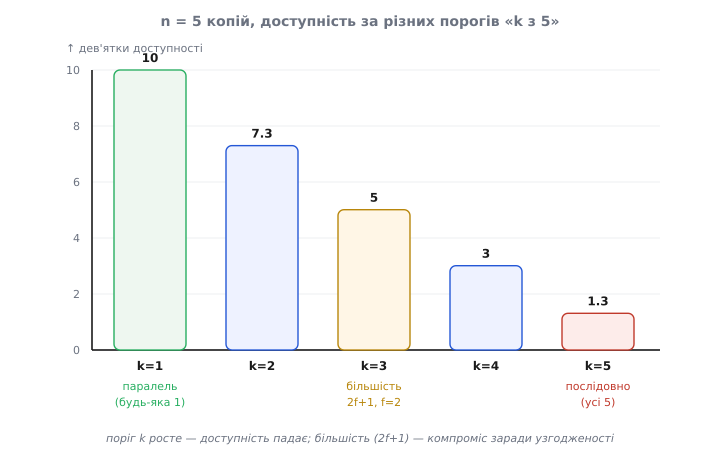
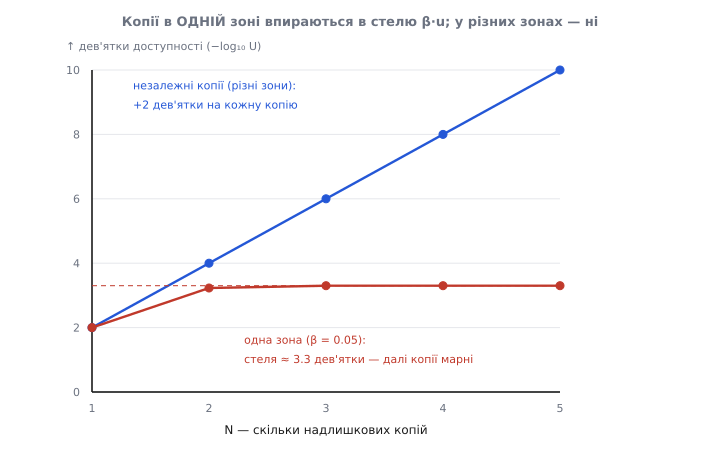
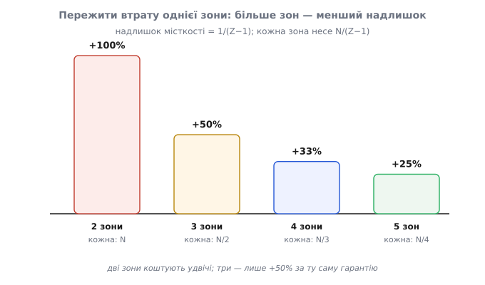

# Математика надійності систем

<preknowlist>
- [Імовірність як міра непевності](topic:math-probability/probability-basics) — ймовірність як число від 0 до 1, частка випадків, у яких подія справджується.
- [Комбінації і біноміальний коефіцієнт](topic:math-combinatorics/combinations) — `C(n,i) = n!/(i!·(n−i)!)`: скількома способами обрати `i` предметів із `n`.
- [Логарифми](topic:math-analysis/logarithms) — `log₁₀` як показник степеня десятки; ним міряють «дев'ятки» доступності.
</preknowlist>

Систему збирають із частин, і кожна частина рано чи пізно відмовляє: диск сиплеться, процес падає, каналом пробігає збій. Одна частина ненадійна — а проте з ненадійних частин будують системи, яким довіряють роками. Спосіб один: тримати копії й розводити їх так, щоб відмова однієї не валила ціле. Лишається питання, на яке треба вміти відповісти **числом**: скільки саме копій, у скількох незалежних місцях, дають потрібну надійність — і скільки простою на рік лишиться попри все?

Апарат, що перетворює «три копії у двох незалежних місцях» на «стільки-то хвилин простою на рік», — це елементарна теорія ймовірностей, пройдена один раз від першого принципу. Та сама арифметика працює скрізь, де надійність будують із надлишковості: дублювання дисків у сховищі (RAID), кворум реплік у розподіленій базі, резервні тракти в телекомі, дублі приладів на борту. Пройдімо її повністю — тоді кожне рішення про надлишковість перестає бути здогадом і стає короткою лічбою.

## Доступність — це ймовірність

Спершу — що таке **доступність** (англ. *availability*) насправді, бо від цього означення залежить усе інше. Інтуїтивно це «яку частку часу система жива». Формально `A` — це **частка часу** в робочому стані від усього часу спостереження; число між 0 і 1.

І тут — маленький крок, який відмикає весь подальший апарат. Частку часу можна прочитати як **ймовірність**. Якщо система жива 99% часу, то, тицьнувши пальцем у випадкову мить, ти з імовірністю 0.99 влучиш у момент, коли вона працює. **Доступність — це ймовірність застати систему живою навмання обраної миті.** Щойно ми це визнали, уся машинерія ймовірностей — множення незалежних подій, доповнення до одиниці, біноміальний розподіл — стає законним інструментом лічити доступність систем із багатьох частин.

Числа доступності зручно міряти не відсотками, а **дев'ятками** — скільки дев'яток у записі `A`. Причина проста: недоступність `U = 1 − A` падає на порядок із кожною дев'яткою, а простій — величина логарифмічна за відчуттям. Ось скільки простою ховає кожна дев'ятка (рік = 525 960 хвилин):

```
A         U = 1−A     простій на рік
0.9       10⁻¹        ≈ 36.5 доби      «одна дев'ятка»
0.99      10⁻²        ≈ 3.65 доби      «дві дев'ятки»
0.999     10⁻³        ≈ 8.77 години    «три дев'ятки»
0.9999    10⁻⁴        ≈ 52.6 хвилини   «чотири дев'ятки»
0.99999   10⁻⁵        ≈ 5.26 хвилини   «п'ять дев'яток»
```

Далі ми весь час рахуватимемо саме `U` — недоступність, — бо в добрих системах вона мала, і з малими числами арифметика чесніша: множення й додавання `10⁻ⁿ` одразу показує, скільки дев'яток ти купуєш або втрачаєш.

## Звідки береться A = MTBF/(MTBF+MTTR)

Перш ніж збирати систему з частин, треба знати доступність **однієї** частини. Її не вгадують — її **вимірюють** за поведінкою в часі, і формула виводиться з одного спостереження.

Компонент, який ремонтують, живе циклами: працює якийсь час → падає → його відновлюють → знову працює → знову падає. Це **процес відновлення** (англ. *renewal process*): нескінченна вервечка «живий–мертвий–живий–мертвий». Нехай за довгий проміжок сталося `n` таких циклів. Позначмо середню тривалість живого відрізка `U̅` (mean uptime), а середню тривалість мертвого — `D̅` (mean downtime). Тоді:

```
увесь час живий   = n · U̅
увесь час мертвий  = n · D̅

           n · U̅            U̅
A = ─────────────────── = ────────      // n скорочується!
     n · U̅ + n · D̅        U̅ + D̅
```

Зверніть увагу на найважливіше: **`n` скоротилося**. Доступність не залежить від того, як часто компонент падає, — лише від **відношення** середнього живого часу до середнього мертвого. Компонент, що падає раз на добу й лагодиться за 14 хвилин, і компонент, що падає раз на місяць і лагодиться за 7 годин, мають **однакову** доступність: обидва живі 99.0% часу. Це неочевидно, поки не побачиш, як `n` виходить із рівняння.

Тепер про назви. Середній живий час `U̅` в інженерії надійності звуть **MTTF** (mean time to failure — середній час до відмови), середній мертвий час `D̅` — **MTTR** (mean time to repair — середній час на відновлення). Часто, коли ремонт швидкий, `U̅` називають ще й **MTBF** (mean time between failures — середній час між відмовами), і формула набуває звичного вигляду:

```
A = MTBF / (MTBF + MTTR)          // стандартна «інгерентна доступність»
```

*(Усталений факт: це канонічна формула інгерентної доступності в теорії надійності.)* Тут варто бути точним, бо назви плутають. Строго кажучи, MTBF — це **весь** цикл від відмови до відмови, тобто `U̅ + D̅`, а не сам живий час. Коли `D̅ ≪ U̅` (лагодимо швидко порівняно з напрацюванням), різниця між MTBF і MTTF мізерна, і обидві форми дають майже те саме. Але сама доступність завжди чесно є `живий_час / (живий_час + мертвий_час)` — решта є лише про те, як позначити ці два середні.

> 🔧 **Навіщо це.** Формула розділяє дві геть різні інженерні важелі. `MTTF` підіймають, роблячи компонент **надійнішим** (менше падінь) — це дорого й повільно. `MTTR` зменшують, роблячи відновлення **швидшим** (автоперезапуск, гаряче перемикання, відкат за секунди) — це часто дешевше й дає ту саму доступність. Дві дев'ятки можна купити або героїчною надійністю заліза, або банальним автоперезапуском за 14 хвилин на добовий цикл падінь. Формула каже, що для `A` це **байдуже**, — тож бери дешевший важіль.

## Незалежність — двигун усього подальшого

Далі ми з'єднуватимемо доступності частин у доступність системи. Робити це дозволяє один закон: якщо дві події **незалежні**, ймовірність, що сталися **обидві**, дорівнює **добутку** їхніх імовірностей.

```
P(A і B) = P(A) · P(B)          ⟺   A і B незалежні
```

Чому саме добуток — варто відчути, а не завчити. Незалежність означає, що знання про одну подію **нічого не каже** про другу. Уяви, що подія `A` «відбирає» частку `P(A)` усіх випадків, а всередині цієї частки подія `B` відбирає свою частку `P(B)` — і відбирає її **так само**, як усюди, бо їй байдуже до `A`. Частка від частки — це множення: `P(A)·P(B)`. Якби `B` залежала від `A` (усередині `A`-випадків поводилася інакше), множник був би інший — і саме тут згодом усе зламається. Але спершу вичавимо з незалежності все, що вона дає.

## Послідовно: доступності множаться, недоступності додаються

Перша топологія — **послідовна** (англ. *series*). Робота мусить пройти крізь `M` компонентів по черзі, і **кожен** має бути живим: спершу вхід, потім обробка, потім перевірка, потім запис. Ланцюг живий тоді й лише тоді, коли живі **всі** ланки.

«Усі живі» — це перетин `M` подій. Якщо відмови незалежні, ймовірність перетину — добуток:

```
система жива ⟺ УСІ M ланок живі
  A_посл = a₁ · a₂ · … · a_M = ∏ aᵢ        // добуток доступностей
```

**Умова.** П'ять ланок на критичному шляху, кожна «двохдев'яткова»: `a = 0.99`. Яка доступність ланцюга?

```
A_посл = 0.99⁵
       = 0.99 · 0.99 · 0.99 · 0.99 · 0.99
       ≈ 0.951                              // ледь «одна дев'ятка»!
U_посл = 1 − 0.951 = 0.049 ≈ 18 діб простою на рік
```

**Висновок.** Послідовність **відбирає** доступність: п'ять двохдев'яткових ланок дали ціле, **гірше за будь-яку окрему ланку**. Це видно ще ясніше через недоступності. Розкриймо добуток `∏(1 − uᵢ)`, де `uᵢ = 1 − aᵢ` малі:

```
∏(1 − uᵢ) = 1 − Σuᵢ + Σ(uᵢuⱼ) − …          // члени вищого порядку — мізерні
  ⇒  U_посл ≈ Σuᵢ = u₁ + u₂ + … + u_M       // недоступності ДОДАЮТЬСЯ
  перевірка: 5 · 0.01 = 0.05  ✓ (точне 0.049)
```

Ось коротке правило, яке варто носити в голові: **у послідовності недоступності додаються**. Кожна нова ланка на критичному шляху додає свій простій до цілого. Це надійнісний двійник того, як у синхронному ланцюгу додаються затримки: що довший критичний шлях, то ненадійніша й повільніша система — з тієї самої причини, бо кожна ланка мусить спрацювати.

## Паралельно: недоступності множаться, копії додають дев'ятки

Друга топологія — **паралельна** (англ. *parallel*): `N` надлишкових копій одного вузла, і досить, щоб жила **хоч одна**. Тут напрошується рахувати «жива хоч одна» напряму, але це складно (варіантів багато). Хитрість — рахувати **протилежну** подію, яка проста: система мертва тоді й лише тоді, коли мертві **всі** копії.

«Усі мертві» — знову перетин незалежних подій, знову добуток, тепер уже недоступностей. А доступність — доповнення до цього:

```
система мертва ⟺ УСІ N копій мертві
  P(усі мертві) = (1−a₁)(1−a₂)…(1−a_N) = ∏(1−aᵢ)
  A_пар = 1 − ∏(1−aᵢ) = 1 − (1−a)^N          // доповнення до «всі впали»
  ⇒  U_пар = ∏uᵢ = u^N                        // недоступності МНОЖаться
```

**Умова.** Копії з `a = 0.99` (`u = 0.01 = 10⁻²`). Що дає надлишковість?

```
N = 1 → U = 10⁻²          дві дев'ятки    (~3.65 доби/рік)
N = 2 → U = 10⁻⁴          чотири дев'ятки (~52 хв/рік)
N = 3 → U = 10⁻⁶          шість дев'яток  (~32 с/рік)
```

**Висновок.** Оскільки `u = 10⁻²`, то `u^N = 10^(−2N)` — **кожна незалежна копія додає рівно дві дев'ятки**. Одна й та сама логічна модель, розгорнута послідовно чи паралельно, дає `0.951` проти `0.9999` — різниця в сотні разів за простоєм, і вся вона живе не в самих компонентах, а в **топології резервування**: у тому, послідовно чи паралельно вони з'єднані. Симетрія двох топологій точна й гарна: у послідовності недоступності **додаються** (ланка шкодить), у паралелі — **множаться** (копія рятує). Це два боки одного закону множення незалежних подій, прикладеного раз до «живий», раз до «мертвий».

## k з n: кворум, більшість і біноміальний розподіл

Послідовно (треба **всі**) і паралельно (треба **хоч одна**) — це два кінці однієї шкали. Посередині живе **кворум**: із `n` копій треба, щоб працювали принаймні `k`. Щоб порахувати таку доступність, потрібен точніший інструмент — **біноміальний розподіл**.

Побудуймо його з нуля. Нехай кожна з `n` копій незалежно жива з імовірністю `a`. Спитаймо спершу: яка ймовірність, що живі **рівно** `i` копій (а решта `n−i` мертві)? Один конкретний розклад — скажімо, перші `i` живі, останні `n−i` мертві — має ймовірність `a^i · (1−a)^(n−i)` (добуток незалежних). Але «рівно `i` живих» справджується багатьма розкладами — стільки, скількома способами можна обрати, **які саме** `i` з `n` живі. Це число сполучень `C(n,i)`. Складаємо:

```
P(рівно i живих) = C(n, i) · a^i · (1−a)^(n−i)          // біноміальний розподіл
                          де C(n,i) = n! / (i!·(n−i)!)
```

Кворум «принаймні `k`» — це сума всіх випадків від `k` до `n`:

```
A(k з n) = P(живих ≥ k) = Σ  C(n,i)·a^i·(1−a)^(n−i)
                          i=k..n
```

Ця формула **містить обидві крайні топології** як окремі випадки, і саме тому вона центральна: `k = 1` — це паралель (досить однієї), `k = n` — це послідовність (треба всіх). Кворум сидить між ними, і зі зростанням порога `k` доступність **монотонно падає** — від паралельної стелі до послідовного дна.



*Одна множина з п'яти копій, різний поріг «k з 5»: `k=1` (паралель, будь-яка одна) дає максимум дев'яток, `k=5` (послідовно, усі) — мінімум, а більшість `k=3` сидить посередині. Поріг обирає не схема резервування, а вимога до узгодженості: скільки копій мусять погодитися, щоб відповідь була правдива.*

### Чому саме 2f+1 переживає f відмов

Найважливіший кворум — **більшість** (англ. *majority*): `k = ⌊n/2⌋ + 1`. Він з'являється всюди, де копії мусять **погодитися** на спільному стані (реплікована база, розподілений журнал, вибір лідера), а не просто обслужити запит. Питання ставлять так: скільки копій треба, щоб пережити `f` відмов і все одно мати більшість? Навіть коли `f` копій мертві, серед решти мусить лишатися строга більшість:

```
n − f > n/2   ⟺   n > 2f   ⟺   n ≥ 2f + 1
```

Мінімум — `n = 2f + 1`. Три копії (`f=1`) переживають одну відмову; п'ять (`f=2`) — дві. Але навіщо саме **більшість**, а не «хоч одна»? Бо мета кворуму тут — не вижити, а **не роздвоїтися**. Дві більшості в системі з `2f+1` вузлів завжди **перетинаються**: `(f+1) + (f+1) = 2f+2 > 2f+1`, тож за принципом Діріхле будь-які дві групи по `f+1` вузлів мають спільний вузол. Цей спільний вузол — свідок, що не дасть двом половинам системи повірити в різні істини (немає «розколу мозку», split-brain). Ось точна причина, чому консенсус коштує більшості, а не однієї копії.

**Умова.** Порахуймо доступність більшості для `n=3`, `k=2`, `a=0.99` — і порівняймо з паралеллю й послідовністю тих самих трьох копій.

```
A(2 з 3) = C(3,2)·a²·(1−a) + a³
         = 3 · 0.99² · 0.01 + 0.99³
         = 3 · 0.009703 + 0.970299
         = 0.029109 + 0.970299 = 0.99970      // ~3.5 дев'ятки, переживає 1 відмову

порівняння тих самих 3 копій:
  паралель  (k=1): 1 − 0.01³ = 0.999999       // 6 дев'яток, але БЕЗ узгодженості
  послідовно(k=3): 0.99³     = 0.970          // гірше за одну копію
```

**Висновок.** Більшість `0.99970` лягла точно між паралеллю `0.999999` і послідовністю `0.970`. За консистентність (жодного розколу) платимо доступністю: більшість менш доступна за «хоч одну», бо їй мало вижити — їй треба, щоб вижила **більшість**. Це не вада, а свідома ціна: реплікованій базі роздвоєння істини страшніше за короткий простій.

### Коли голосів більше — а гірше

Є тонкість, яку легко проґавити: більшість допомагає **лише якщо копії надійніші за монетку**. Формально це **теорема присяжних Кондорсе** (Nicolas de Condorcet, французький математик, праця *«Essai sur l'application de l'analyse à la probabilité des décisions rendues à la pluralité des voix»*, 1785). *(Усталений факт, звірено.)* Вона каже: якщо кожен «голос» правильний із імовірністю `a`, то за `a > ½` більшість надійніша за окремий голос і прямує до 1 зі зростанням `n`; але за `a < ½` більшість **гірша**, і що більше голосів, то гірше. Причина прозора: якщо кожна копія частіше бреше, ніж каже правду, то додавати їх у голосування — множити брехунів, і більшість певніше помиляється. Кворум — підсилювач: він підсилює правду в надійних вузлів і брехню в ненадійних. Тому голосування має сенс лише над компонентами, у яких `a` й так добра.

## Кореляція ламає незалежність: чому копії в одному місці майже не рятують

Тепер — найважливіша частина, бо саме тут наївна арифметика найгучніше бреше. Усі формули вище стояли на одному припущенні: **відмови незалежні**. У реальній системі це часто **неправда**. Дві копії в одному місці мають спільну долю: одна аварія живлення, один поганий деплой конфігурації, один збій ядра ОС на спільному хості — і падають **обидві разом**. Це **спільнопричинна відмова** (англ. *common-cause failure*, CCF), і вона руйнує множення недоступностей.

Щоб побачити, наскільки, потрібна **модель кореляції**. Класична в інженерії надійності — **β-модель** (англ. *beta-factor model*): відмову однієї копії розділяють на дві частини. Частка `β` усіх відмов — **спільні**: вони б'ють по **всіх** копіях одночасно. Решта `(1−β)` — **власні**, незалежні для кожної копії. *(Усталений факт: β-фактор — стандартна параметрична модель CCF; за доброї інженерії `β ≈ 0.001…0.05`, за поганої — до 0.25.)*

```
u        = недоступність однієї копії
u_спільна = β · u          // спільний струс валить УСІ копії разом
u_власна  = (1−β) · u      // незалежна, множиться по копіях
```

Тепер зберемо `N` копій, що ділять спільний струс. Система мертва, якщо стався спільний струс **або** всі копії впали власними, незалежними відмовами:

```
U_пар(N) ≈ β·u + ((1−β)·u)^N
              ▲         ▲
              │         └── власна частина: множиться, летить до нуля
              └── спільна частина: НЕ множиться, лишається як стеля
```

Ось де ховається вся суть. Власна частина `((1−β)u)^N` слухняно множиться й прямує до нуля — це той самий подарунок надлишковості. Але спільна частина `β·u` **лінійна**: вона не залежить від `N` зовсім. Скільки копій не додавай у **ту саму** межу відмови — нижче за `β·u` ти не опустишся. Це **стеля кореляції**.

**Умова.** `u = 0.01` (двохдев'яткова копія), `β = 0.05` (спільна доля — 5% відмов). Порівняймо чесну β-модель із наївним припущенням незалежності.

```
наївно (незалежні):  U = u^N
  N=2 → 10⁻⁴  (4 дев'ятки)     N=3 → 10⁻⁶  (6 дев'яток)

чесно (β-модель):    U = β·u + ((1−β)·u)^N,   β·u = 5·10⁻⁴
  N=1 → 0.01                    (2 дев'ятки)
  N=2 → 5·10⁻⁴ + (0.0095)² = 5.0·10⁻⁴ + 0.9·10⁻⁴ ≈ 5.9·10⁻⁴  (~3.2 дев'ятки)
  N=3 → 5·10⁻⁴ + (0.0095)³ ≈ 5.0·10⁻⁴                          (~3.3 дев'ятки — СТЕЛЯ)
  N=4 → 5·10⁻⁴ + …          ≈ 5.0·10⁻⁴                          (те саме — платиш дарма)
```

**Висновок.** Наївно ти чекав від двох копій чотирьох дев'яток, а від трьох — шести. Насправді на другій копії ти впираєшся в стелю `β·u ≈ 3.3 дев'ятки`, і третя копія в тому самому місці не додає **нічого**. Заплатив за три машини — купив доступності на дві. Ось точна, вимірна причина, чому «дві копії в одному місці» — це ілюзія надлишковості.



*Незалежні копії (різні місця) додають дев'ятки без кінця — пряма вгору. Копії в одному місці впираються в стелю `β·u`: спільна частина недоступності не множиться, і після другої-третьої копії надлишковість перестає працювати. Різниця між двома лініями — це і є ціна кореляції.*

Той самий факт можна сказати мовою **коефіцієнта кореляції**. Візьмімо дві копії й познач їхні «індикатори відмови» `X, Y` (1 — мертва, 0 — жива), кожен із `P = u`. Тоді:

```
P(обидві мертві) = E[XY] = u² + Cov(X,Y) = u² + ρ·u·(1−u)
                                              ▲
                    незалежність (ρ=0): u²    │  кореляція додає лінійний член
```

За незалежності `ρ = 0` і виходить чисте `u²`. Але додатна кореляція `ρ > 0` додає член `ρ·u(1−u)`, **лінійний** за `u`, — і для малого `u` він **домінує** над квадратичним `u²`. Порівнявши з β-моделлю (`P(обидві) ≈ β·u`), дістаємо `ρ ≈ β`: **коефіцієнт кореляції відмов — це і є β-фактор**. Кореляція завжди тільки **шкодить** паралелі (за `ρ ≥ 0` спільна ймовірність відмови лише зростає) — вона ніколи не рятує.

Звідси й ліки: щоб `β` (а отже й `ρ`) впало до нуля, копії мусять не мати **жодного спільного струсу** — різні місця, різне залізо, різні мережеві шляхи. У **різних** незалежних місцях спільна відмова одного місця стає незалежною подією, добуток недоступностей відновлюється, і `u^N` знову працює. Одне застереження, яке коштувало багатьом системам ночей: не всі спільні струси географічні. Поганий деплой **конфігурації** розкочується на **всі** місця одночасно — для нього `β ≈ 1` навіть за трьох дата-центрів. Тому зміни конфігурації — головне джерело корельованих відмов, і саме їх, а не аварії заліза, викочують поетапно (canary), щоб штучно **знизити** `β`.

## N+k: скільки копій справді купувати

Тепер зайдемо з іншого боку. Досі ми питали «яка доступність за такої топології». На практиці частіше питають зворотне: **скільки копій купити**, щоб витримати навантаження й пережити відмови? Це задача розміру надлишковості — **N+k**.

Логіка пряма. Нехай для піку навантаження треба `N` **робочих** одиниць. Якщо провізувати рівно `N`, то втрата хоч однієї копії — це вже нестача місткості (перевантаження, деградація). Щоб пережити `k` одночасних утрат **без** втрати місткості, треба тримати `N + k` одиниць: `k` із них — «запас», що вбирає відмови й планове обслуговування.

Скільки саме `k` — визначає біноміальний хвіст. Маючи `m = N + k` одиниць, кожна жива з `a`, вимагаємо, щоб живих було **принаймні** `N` із заданою доступністю:

```
P(живих ≥ N) = Σ  C(m,i)·a^i·(1−a)^(m−i)  ≥  A_ціль
               i=N..m
```

Але — і тут змикається все попереднє — цей розрахунок чесний **лише** якщо відмови незалежні. Спільнопричинна відмова цілого місця одним ударом забирає не одну одиницю, а **все, що в ньому**. Тому реальне розмірне правило рахують не по машинах, а по **незалежних місцях** (зонах), і питають: скільки місткості тримати в кожній зоні, щоб пережити втрату цілої зони?

Якщо є `Z` зон і треба пережити втрату `f` із них, то місткість `N` мусять покрити ті `Z − f` зон, що лишилися. Отже, кожна зона несе `N/(Z−f)`, а всього виходить:

```
місткість на зону = N / (Z − f)
загальна місткість = Z · N / (Z − f)
надлишок          = Z/(Z−f) − 1 = f/(Z−f)
```

**Умова.** Пережити втрату **однієї** зони (`f = 1`) за різного числа зон `Z`:

```
Z = 2 → кожна зона несе N,    усього 2N     → надлишок +100%
Z = 3 → кожна зона несе N/2,  усього 1.5N   → надлишок  +50%
Z = 4 → кожна зона несе N/3,  усього 1.33N  → надлишок  +33%
```

**Висновок.** Та сама гарантія — «переживемо втрату будь-якої однієї зони» — коштує **вдвічі** на двох зонах і лише **+50%** на трьох. Причина проста: коли зона падає, її частку підхоплюють **інші**, і що більше цих інших, то менша частка на кожну, то менший запас треба тримати даремно. Ось чому «три зони» — майже галузевий стандарт: це найдешевша точка, де втрата зони перестає бути катастрофою.



*Надлишок місткості, щоб пережити втрату однієї зони, дорівнює `1/(Z−1)`: дві зони вимагають подвоєння, три — лише половини зверху, чотири — третини. Більше зон — дешевша та сама відмовостійкість, бо частку впалої зони ділять на більше плечей.*

## Інваріанти для перевірки себе

Увесь апарат тримається на кількох перевірках, які варто пробігти очима над кожним розрахунком доступності — вони ловлять помилку швидше, ніж переобчислення:

```
0 ≤ A ≤ 1                                    завжди; вийшло поза — помилка
послідовно:  A = ∏aᵢ ≤ min aᵢ                ланка лише ЗНИЖУЄ ціле
паралельно:  A = 1 − ∏(1−aᵢ) ≥ max aᵢ         копія лише ПІДІЙМАЄ ціле
k з n:       k=1 → паралель,  k=n → послідовно  (крайні випадки однієї формули)
незалежні:   u_посл ≈ Σuᵢ (додаються),  u_пар = ∏uᵢ (множаться)
кореляція:   ρ = β > 0 лише ШКОДИТЬ; стеля паралелі = β·u, глибше не опустишся
```

Перші два — найкорисніші. Якщо порахував послідовну систему й вийшло **більше** за найслабшу ланку — десь помилка знаку. Якщо порахував паралельну надлишковість і вийшло **менше** за одну копію — так само. А якщо додав копії й доступність не зрушила — не шукай помилку в арифметиці: перевір, чи не лежать усі копії в **одній** спільній межі відмови. Майже завжди причина саме там.

## Де цей апарат живе

Уся ця математика — один калькулятор надійності, і його входи ті самі в будь-якій царині. `a` кожної одиниці дає пара MTTF/MTTR; `M` — довжина послідовного ланцюга, крізь який мусить пройти робота; `N` — скільки надлишкових копій працюють паралельно; `k` — скільки з них мусять погодитися (більшість для реплікованого стану); `β` — чи ділять копії спільну межу відмови; `Z` — на скільки незалежних місць рознесено систему. Підставив числа надлишковості — дістав хвилини простою на рік.

Той самий апарат рахує дублювання дисків у сховищі, кворум реплік у розподіленому журналі, резервні тракти в телекомі, дублі бортових приладів. Що саме **реалізує** паралель і кворум у конкретній системі — активне резервування, гаряче перемикання з журналом, голосування реплік — то вже інженерія тих механізмів; для програмних систем їх розбирають [тактики доступності](topic:sf-apps/availability-tactics). Порядок правильний саме такий: спершу порахувати, чи топологія взагалі здатна дати потрібну доступність, і лише потім обирати механізм, що її втілить. Бо жоден механізм не переможе стелю `β·u` — її долають не кодом, а рознесенням копій по різних, незалежних межах відмови.
