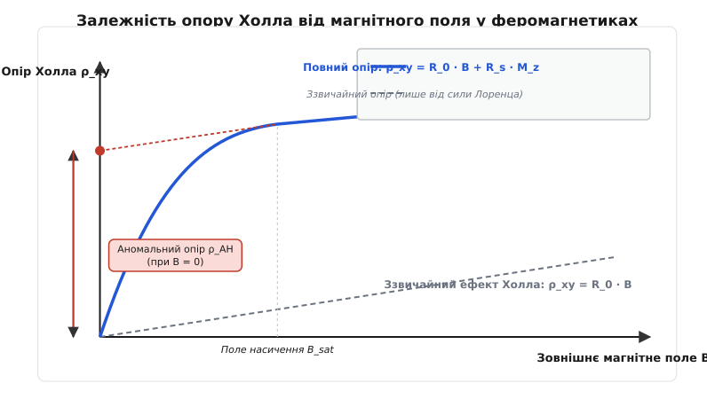
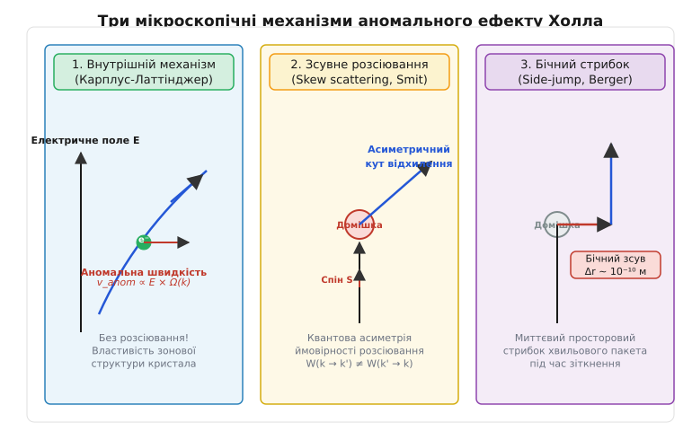
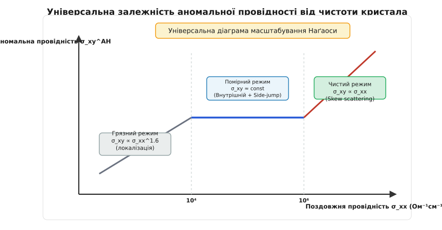

# Аномальний ефект Холла: від спонтанної намагніченості до кривини Беррі

<preknowlist>
- [Ефект Холла](root:ph-condensed/hall-effect) — утворення поперечної різниці потенціалів при відхиленні носіїв заряду магнітним полем.
- [Сила Лоренца](root:ph-electromagnetism/lorentz-force) — сила, що діє на рухомий заряд у магнітному полі та повертає його траєкторію.
- [Феромагнетизм](root:ph-condensed/ferromagnetism) — спонтанна паралельна орієнтація електронних спінів у кристалічній ґратці.
- [Опір і провідність](root:ph-condensed/conductivity) — електронний транспорт у твердих тілах, час між зіткненнями та тензор питомого опору.
- [Квантовий ефект Холла](root:ph-condensed/quantum-hall-effect) — квантування поперечної провідності 2D-електронів та топологічні інваріанти Черна.
</preknowlist>

Якщо крізь звичайну мідну чи алюмінієву пластину пропустити електричний струм і прикласти перпендикулярне магнітне поле, сила Лоренца відхиляє носії заряду до одного з бокових країв. Утворюється поперечна напруга Холла, яка зростає суворо лінійно зі збільшенням індукції зовнішнього поля. Проте, якщо повторити цей самий експеримент на пластинці з феромагнітного металу — заліза, нікелю чи кобальту — класична лінійна залежність руйнується. При слабких магнітних полях поперечна напруга зростає у сотні й тисячі разів швидше, ніж у немагнітних металах. Після досягнення поля насичення зростання сповільнюється, повертаючись до звичайного похилого градієнта, але при повному вимкненні зовнішнього магнітного поля поперечна напруга не зникає. У зразку зберігається величезна спонтанна напруга Холла. Це явище отримало назву **аномального ефекту Холла** (*Anomalous Hall Effect*, AHE).

Протягом майже сімдесяти років вважалося, що аномальний опір є простим наслідком внутрішнього магнітного поля, створеного впорядкованими додоменами феромагнетика. Проте прямий розрахунок сили Лоренца від внутрішньої намагніченості дав результат, який виявився у 100–1000 разів меншим за експериментально виміряний. Виявилося, що аномальний ефект Холла викликаний не магнітним полем як таким, а квантовою взаємодією між внутрішнім спіном електрона, його орбітальним рухом та квантовою геометрією зонової структури кристала.

---

### Феноменологія П'ю та тензорний опис провідності

Для макроскопічного опису електронного транспорту у магнітних провідниках використовують тензорну форму закону Ома. У загальному випадку тривимірного провідника електричне поле `E` зв'язане з густиною струму `j` через тензор питомого опору `ρ`:

```
E_i = ∑_j ρ_ij · j_j
```

У планарній геометрії вимірювального містка Холла, де струм `j_x` проганяється вздовж осі `x`, а магнітна індукція `B_z` та спонтанна намагніченість `M_z` спрямовані перпендикулярно до площини зразка вздовж осі `z`, тензор питомого опору має вигляд:

```
    ┌               ┐
    │  ρ_xx   ρ_xy  │
ρ = │               │
    │ -ρ_xy   ρ_xx  │
    └               ┘
```

Поперечна компонента електричного поля `E_y` визначається виразом `E_y = ρ_xy · j_x`.

У 1930-х роках Емерсон П'ю вивів феноменологічну формулу, яка розділила повний опір Холла у феромагнетиках на дві незалежні частини:

```
ρ_xy = R_0 · B_z + R_s · M_z
```

де:
- `R_0` — **звичайний коефіцієнт Холла** (*Ordinary Hall coefficient*), який визначається концентрацією носіїв заряду `n` та їхнім знаком: `R_0 = 1 / (n · q)`. Цей член прямо пропорційний зовнішній магнітній індукції `B_z` і зумовлений класичною силою Лоренца.
- `R_s` (або `R_AH`) — **спонтанний (аномальний) коефіцієнт Холла** (*Anomalous Hall coefficient*), який визначається спонтанною намагніченістю матеріалу `M_z`.


*Залежність опору Холла ρ_xy від магнітного поля B у звичайному провіднику та феромагнетику. У феромагнетику опір стрімко зростає при слабких полях разом із намагніченістю M, виходить на насичення й зберігає скінченне значення ρ_AH при B = 0.*

Графік залежності `ρ_xy(B)` чітко розпадається на дві області:

1. **Ділянка технічного намагнічування (`0 < B < B_sat`)**:
   Зовнішнє поле `B` повертає магнітні домени зразка та збільшує проекцію макроскопічної намагніченості `M_z`. Оскільки у феромагнетиках `R_s · M_z >> R_0 · B`, крива `ρ_xy` стрімко зростає, повторюючи форму класичної петлі гістерезису або кривої намагнічування `M(B)`.

2. **Ділянка магнітного насичення (`B > B_sat`)**:
   Усі домени матеріалу вже вишикувалися вздовж поля, тож намагніченість досягає граничного значення насичення `M_z = M_sat = const`. При подальшому збільшенні зовнішнього поля `B` крива `ρ_xy` продовжує зростати зі значно меншим нахилом, визначеним звичайним коефіцієнтом `R_0`.

Екстраполяція лінійної похилої ділянки з області насичення назад до нульового поля (`B = 0`) вирізає на осі ординат значення **аномального опору Холла** `ρ_AH = R_s · M_sat`. У таких матеріалах, як пермалой (`Ni_80 Fe_20`) або феромагнітні напівпровідники (`Ga_1-x Mn_x As`), аномальний опір `ρ_AH` може перевищувати ззвичайний опір `R_0 · B` на три-чотири порядки.

#### Зв'язок між тензором питомого опору та тензором провідності
Для зв'язку мікроскопічних розрахунків із експериментом необхідно виконати інверсію тензора питомого опору `σ = ρ⁻¹`:

```
σ_xx =  ρ_xx / (ρ_xx² + ρ_xy²)
σ_xy = -ρ_xy / (ρ_xx² + ρ_xy²)
```

У металевих феромагнетиках поздовжня провідність набагато більша за поперечну (`ρ_xy << ρ_xx`), тому зв'язок спрощується до важливого співвідношення:

```
ρ_xy ≈ -σ_xy / σ_xx²
```

Це співвідношення має критичне значення для аналізу теорії: воно показує, як саме внутрішня провідність `σ_xy`, обчислена з зонової структури, перераховується у вимірюваний експериментальний аномальний опір `ρ_xy`.

Детальний аналіз 120-річної історії відкриття цього феномену, розбіжностей у вимірюваннях Едвіна Холла та хронології великої наукової суперечки ХХ століття наведено у вставці 📜 [Історія аномального ефекту Холла: від суперечки 1881 року до топологічного перевороту](root:ph-condensed/anomalous-hall-effect/hist-anomalous-hall.md).

---

### Спін-орбітальна взаємодія: квантовий міст між спіном і рухом

Головне фізичне питання аномального ефекту Холла полягає у наступному: **як спіновий магнітний момент електрона здатний змінити напрямок його просторового руху?**

У класичній електродинаміці магнітний момент `μ` під дією однорідного магнітного поля зазнає лише обертального моменту `τ = μ × B`, який повертає спін, але не створює поступальної сили, здатної штовхнути електрон убік. Пряма дія дипольного магнітного поля сусідніх атомів дає мікроскопічне відхилення, яке є занадто слабким.

Розв'язок цієї загадки криється у релятивістському ефекті — **спін-орбітальній взаємодії** (*Spin-Orbit Coupling*, SOC).

Коли електрон із масою `m` та імпульсом `p` рухається у внутрішньому електростатичному потенціалі `V(r)`, створеному позитивно зарядженими ядрами кристалічної ґратки, у власній супутній системі відліку електрона цей електростатичний потенціал перетворюється на ефективне внутрішнє магнітне поле `B_eff = -(v × ∇V) / c²`.

З квантового рівняння Дірака у нерелятивістському граничному наближенні Паулі випливає оператор спін-орбітальної взаємодії `H_SO`:

```
H_SO = [ℏ / (4 · m² · c²)] · (∇V × p) · σ
```

де `σ = (σ_x, σ_y, σ_z)` — матриці Паулі, що описують спін електрона.

Фізичний зміст рівняння спін-орбітальної взаємодії має вирішальне значення:

```
Електростатичне поле атомних ядер ∇V (спрямоване радіально)
                       ×
Вектор руху (імпульс) електрона p
                       ▼
Ефективне внутрішнє магнітне поле B_eff у системі електрона
                       ▼
Взаємодія з векторним спіном електрона σ
                       ▼
Відхилення носія у напрямку, перпендикулярному І до p, І до σ
```

У немагнітному металі кількість електронів зі спіном «вгору» (`σ_z = +1`) та «вниз» (`σ_z = -1`) є суворо однаковою. Під дією електричного поля електрони зі спіном «вгору» відхиляються ліворуч, а електрони зі спіном «вниз» — праворуч. В результаті електричні заряди на протилежних краях пластини точно компенсують один одного (поперечний електричний струм дорівнює нулю), але виникає чисто спіновий струм — феномен, відомий як **спіновий ефект Холла** (*Spin Hall Effect*).

У **феромагнетику** ситуація принципово змінюється. Завдяки квантовій обмінній взаємодії рівновага між спіновими станами порушена: кількість носіїв зі спіном вздовж макроскопічного поля намагніченості `M` перевищує кількість носіїв із протилежним спіном (`n_up ≠ n_down`). В результаті компенсація бічних електричних зарядів руйнується: відхилення преобладаючої групи спінів створює невизначений макроскопічний поперечний електричний струм і генерує напругу Холла **навіть за відсутності зовнішнього магнітного поля**.

---

### Три мікроскопічні механізми аномального відхилення

Мікроскопічна теорія електронного транспорту виділяє три фундаментальні механізми, які відповідають за виникнення аномальної напруги Холла. Вони поділяються на дві категорії: **внутрішній** (зумовлений чистою зоновою структурою кристала) та два **зовнішніх** (зумовлені розсіюванням на домішках).


*Порівняння трьох мікроскопічних механізмів: внутрішнього механізму Карплуса-Латтінджера (неперервна аномальна швидкість між зіткненнями), зсувного розсіювання Сміта (асиметричний кут відхилення при зіткненні з домішкою) та бічного стрибка Бергера (миттєвий просторовий зсув хвильового пакета).*

#### 1. Внутрішній (Intrinsic) механізм Карплуса — Латтінджера
Цей механізм виникає у чистому кристалі **між зіткненнями електронів з домішками**.

Коли до кристала прикладено зовнішнє електричне поле `E`, електронний хвильовий пакет розганяється у просторі квазіімпульсів за законом `ℏ · k̇ = -e · E`. У наявності спін-орбітальної взаємодії блохівські хвильові функції `|u_n(k)⟩` отримують квантово-геометричну фазу.

В результаті квантовомеханічне рівняння руху центру мас хвильового пакета набуває додаткового члена — **аномальної швидкості** (*anomalous velocity*):

```
v_n(k) = (1/ℏ) · ∇_k E_n(k) + (e/ℏ) · E × Ω_n(k)
```

де `Ω_n(k)` — **кривина Беррі** (*Berry curvature*) `n`-ї енергетичної зони у просторі імпульсів.

Кривина Беррі виконує роль «магнітного поля у просторі імпульсів». Електричне поле `E_x`, діючи на електрон, завдяки кривині Беррі `Ω_z(k)` неперервно підштовхує його у поперечному напрямку `y` протягом усього часу вільного пробігу між зіткненнями.

Оскільки внутрішній механізм є власною квантовою характеристикою зонової структури кристала, внутрішня аномальна провідність `σ_xy^int` **абсолютно не залежить від часу релаксації `τ`** та кількості домішок у кристалі:

```
σ_xy^int = const(τ)
```

Завдяки тензорному співвідношенню `ρ_xy ≈ -σ_xy / σ_xx²`, для внутрішнього механізму випливає сувора квадратична залежність аномального опору від поздовжнього опору:

```
ρ_xy^int ∝ ρ_xx²
```

#### 2. Зсувне розсіювання (Skew Scattering, механізм Сміта)
Це **зовнішній дисипативний механізм**, розроблений Яном Смітом. Вже після розгону між зіткненнями електрон натрапляє на іонізовану домішку або дефект ґратки.

Потенціал домішки `V_imp(r)` створює локальне електричне поле. Через спін-орбітальну взаємодію квантова ймовірність розсіювання електрона з квазіімпульсом `k` у стан `k'` виявляється асиметричною відносно напрямку спіну. У теорії квантового розсіювання фазові зсуви сферичних хвиль `δ_l` стають залежними від орієнтації спіну, що робить диференціальний переріз розсіювання асиметричним:

```
W(k → k') ≠ W(-k → -k')
```

Електрони зі спіном «вгору» при зіткненні з домішкою відхиляються на кут `+θ` (переважно праворуч), а електрони зі спіном «вниз» — на кут `-θ` (переважно ліворуч). У феромагнетику з надлишком спінів одного напрямку це створює макроскопічний поперечний струм.

Оскільки зсувне розсіювання відбувається при кожному акті зіткнення, його ефективність прямо пропорційна часу вільного пробігу електронів `τ`. В результаті аномальна провідність для зсувного розсіювання пропорційна поздовжній провідності:

```
σ_xy^skew ∝ τ ∝ σ_xx
```

Відповідно, аномальний опір Холла для зсувного розсіювання прямо пропорційний **першому степеню** поздовжнього опору:

```
ρ_xy^skew ∝ ρ_xx
```

Цей механізм є домінуючим у **надчистих металах та монокристалах при екстремально низьких температурах**, де час вільного пробігу `τ` є величезним (`ρ_xx → 0`).

#### 3. Бічний стрибок (Side-Jump, механізм Бергера)
Це другий **зовнішній механізм**, запропонований Люціаном Бергером. Він описує квантовомеханічну поведінку хвильового пакета електрона у самий момент зіткнення з домішкою.

Під дією електричного поля домішки спін-орбітальна взаємодія зміщує центр мас хвильового пакета електрона у просторі. При кожному розсіюванні електрон здійснює миттєвий просторовий зсув у бічному напрямку:

```
Δr_side ≈ [ℏ / (m · c)] · (k × σ) / |k|  ~  10⁻¹⁰ м
```

Хоча цей стрибок становить лише частки нанометра, його величина `Δr_side` **не залежить від швидкості електрона та часу між зіткненнями `τ`**. При збільшенні кількості домішок частота зіткнень `1/τ` зростає точно так само, як зменшується довжина пробігу. В результаті сумарний внесок бічного стрибка в аномальну провідність виявляється **незалежним від часу релаксації `τ`**:

```
σ_xy^side-jump = const(τ)
```

Отже, механізм бічного стрибка Бергера показує точно таку саму квадратичну залежність від поздовжнього опору, як і внутрішній механізм Карплуса-Латтінджера:

```
ρ_xy^side-jump ∝ ρ_xx²
```

Математичні виведення аномальної швидкості, векторної зв'язності Беррі та матричних елементів спін-орбітального розщеплення зон детально розібрано у вставці 🧮 [Математичний апарат кривини Беррі та аномальної швидкості носіїв](root:ph-condensed/anomalous-hall-effect/math-berry-ahe.md).

---

### Універсальна діаграма масштабування Наґаоси

Для експериментального розрізнення трьох механізмів та визначення того, який саме з них домінує у конкретному матеріалі, використовують **метод масштабування** (*scaling law analysis*). Експериментатори змінюють поздовжній опір `ρ_xx` матеріалу (варіюючи температуру `T`, змінюючи товщину плівки або рівень легування домішками) та будують залежність `ρ_AH(ρ_xx)`.

У 2007 році Наото Наґаоса разом із колегами об'єднав експериментальні дані для десятків феромагнітних металів, окислів та напівпровідників у єдину універсальну діаграму масштабування аномальної провідності `σ_xy^AH` від поздовжньої провідності `σ_xx`.


*Універсальна діаграма масштабування Наґаоси для аномальної провідності σ_xy^AH від поздовжньої провідності σ_xx. У чистих металах панує зсувне розсіювання, у помірно забруднених — внутрішня кривина Беррі та бічний стрибок (σ_xy ≈ const), а у грязних — квантова локалізація.*

Діаграма Наґаоси чітко виділяє три режими електронного транспорту:

```
1. Високопровідний (чистий) режим        (σ_xx > 10⁶ Ом⁻¹см⁻¹)
   Домінує Skew Scattering:              σ_xy^AH ∝ σ_xx   (тобто ρ_AH ∝ ρ_xx)

2. Проміжний (помірний) режим            (10⁴ < σ_xx < 10⁶ Ом⁻¹см⁻¹)
   Домінують Intrinsic Berry & Side-jump: σ_xy^AH ≈ const  (тобто ρ_AH ∝ ρ_xx²)

3. Низькопровідний (брудний) режим        (σ_xx < 10⁴ Ом⁻¹см⁻¹)
   Домінує квантова локалізація:         σ_xy^AH ∝ σ_xx¹.⁶ (аномальна провідність згасає)
```

У більшості практичних феромагнітних матеріалів (пермалой, сплави кобальт-залізо, магнітні напівпровідники) провідність знаходиться у помірному режимі (`10⁴ < σ_xx < 10⁶` Ом⁻¹см⁻¹). Це означає, що **головним джерелом аномального ефекту Холла в сучасних матеріалах є внутрішня кривина Беррі її зонової структури**.

---

### Спіновий ефект Холла (SHE) та Обернений спіновий ефект Холла (ISHE)

Аномальний ефект Холла тісно пов'язаний із іншим фундаментальним транспортним явищем — **спіновим ефектом Холла** (*Spin Hall Effect*, SHE).

Якщо в аномальному ефекті Холла відхилення носіїв відбувається у феромагнетику із некомпенсованим спіновим населенням (`n_up ≠ n_down`), то спіновий ефект Холла відбувається у **немагнітних важких металах із сильної спін-орбітальною взаємодією** (платина `Pt`, тантал `Ta`, вольфрам `W`, золото `Au`).

```
Звичайний ефект Холла:   Магнітне поле B  ==> Відхиляє ВСІ заряди  ==> Електричний струм j_y
Аномальний ефект Холла:   Намагніченість M ==> Відхиляє n_up ≠ n_down ==> Електричний струм j_y
Спіновий ефект Холла:     Спін-орбіталь    ==> Відхиляє n_up = -n_down ==> Спіновий струм j_s
```

Коли крізь пластинку платини проганяється звичайний електричний струм `j_e`, спін-орбітальна взаємодія відхиляє електрони зі спіном «вгору» до верхньої межі, а електрони зі спіном «вниз» — до нижньої межі. Оскільки кількість носіїв обох спінів однакова, чисто електрична напруга на краях дорівнює нулю, але виникає чисто **поперечний спіновий струм** `j_s`:

```
j_s = θ_SH · (ℏ / 2e) · (j_e × σ)
```

де `θ_SH = σ_xy^S / σ_xx` — **кут спінового ефекту Холла** (*Spin Hall Angle*), який характеризує ефективність перетворення електричного струму у спіновий. У важких металах, таких як `β-W` або `Ta`, `θ_SH` може досягати `0.1–0.4` (від 10% до 40% перетворення).

#### Обернений спіновий ефект Холла (ISHE)
Існує й обернений процес: якщо у немагнітну платинову плівку інжектувати чисто спіновий струм `j_s` (наприклад, за допомогою спінової накачки `spin pumping` із сусіднього феромагнетика), спін-орбітальна взаємодія перетворює його на макроскопічний поперечний електричний струм `j_e`:

```
j_e = θ_SH · (2e / ℏ) · (j_s × σ)
```

Обернений спіновий ефект Холла (ISHE) слугує головним методичним інструментом для детектування спінових струмів та спінових хвиль (магнонів) у сучасній спінтроніці.

---

### Топологія кривини Беррі, точкові монополі Вейля та Квантовий аномальний ефект Холла (QAHE)

У сучасній фізиці конденсованого стану внутрішній аномальний ефект Холла розглядається як фундаментальний топологічний феномен.

У тривимірній зоні Бріллюена кривина Беррі `Ω(k)` проектується на всі заповнені енергетичні зони нижче рівня Фермі. Загальна внутрішня аномальна провідність отримується інтегруванням кривини Беррі по заповнених станах:

```
σ_xy^AH = -(e² / ℏ) · ∑_n ∫ [d³k / (2π)³] · f(E_n(k)) · Ω_n,z(k)
```

Особливо яскраво топологічна природа проявляється, коли в зоновій структурі наявні **точки антиперетину зон** або **вейлівські вузли** (*Weyl nodes*). У вейлівських напівметалах (наприклад, `TaAs`, `Co_3 Sn_2 S_2`) точкові перетини енергетичних зон працюють як математичні **топологічні монополі кривини Беррі** у просторі імпульсів. Вони випромінюють або поглинають потік `Ω(k)`, створюючи колосальні сплески аномальної провідності Холла навіть при незначних змінах рівня Фермі.

#### Квантовий аномальний ефект Холла (QAHE)
У 1988 році Данкан Галдейн (*F. Duncan Haldane*) теоретично передбачив, що аномальний ефект Холла може бути повністю квантованим навіть за відсутності зовнішнього магнітного поля (`B = 0`).

Якщо створити двовимірний матеріал (наприклад, тонкому плівку топологічного ізолятора `(Bi,Sb)_2 Te_3`, леговану атомами хрому `Cr` або ванадію `V`), внутрішній феромагнетизм відкриває енергетичну щілу у поверхневих дираківських станах.

Коли рівень Фермі потрапляє всередину цієї щілини, сумарна кривина Беррі всіх заповнених зон інтегрується по двовимірній зоні Бріллюена у строго ціле **число Черна** `C ∈ ℤ`:

```
C = (1 / 2π) · ∬_BZ d²k · Ω_z(k)
```

В результаті виникає **квантовий аномальний ефект Холла** (*Quantum Anomalous Hall Effect*, QAHE):

```
R_xy = h / (C · e²) ≈ 25812.807 / C Ом   (при B = 0!)
R_xx = 0
```

У 2013 році група Сюе Цюкуня (*Xue Qikun*) в Університеті Цінхуа експериментально підтвердила квантовий аномальний ефект Холла при мілікельвінових температурах. Електрони рухалися вздовж країв зразка по бездисипативних хіральних каналах без жодного зовнішнього магнітного поля, що стало триумфом топологічної фізики. За ці теоретичні відкриття Галдейн був нагороджений Нобелівською премією з фізики 2016 року.

---

### Суміжні геометричні ефекти: Топологічний, Планарний та Нелінійний ефекти Холла

Розвиток квантової геометрії привів до виявлення цілого сімейства суміжних ефектів Холла, які важливо чітко розрізняти між собою.

#### 1. Топологічний ефект Холла (Topological Hall Effect, THE)
У той час як звичайний ефект Холла викликаний зовнішнім полем `B`, а аномальний — спін-орбітальною взаємодією та внутрішньою намагніченістю `M`, **топологічний ефект Холла** виникає у зразках із некопланарними магнітними текстурами у **реальному просторі** (наприклад, у кристалах із магнітними **скірміонами** або кіральними спіновими спіралями у `MnSi` чи `FeGe`).

Коли електрон рухається крізь спіновий вихор (скірміон), його спін адіабатично підлаштовується під локальний напрямок намагніченості. Цей процес генерує геометричну фазу Беррі у реальному просторі. В результаті електрон відчуває **ефективне топологічне магнітне поле** `B_em`:

```
B_em,z = (ℏ / 2e) · n · (∂n/∂x × ∂n/∂y)
```

де `n(r) = M(r) / |M(r)|` — векторний напрямок локальної намагніченості. Цей ефект генерує додаткову напругу Холла `ρ_xy^THE`, яка прямо міряє топологічний заряд (кількість скірміонів) у зразку.

#### 2. Планарний ефект Холла (Planar Hall Effect, PHE)
Якщо магнітне поле `B` та намагніченість `M` прикласти не перпендикулярно, а **всередині площини** зразка під кутом `φ` до електричного струму `j_x`, виникає **планарний ефект Холла**.

Він не пов'язаний із відхиленням носіїв силою Лоренца або кривиною Беррі, а є наслідком **анізотропного магнітоопору** (AMR). Поперечне електричне поле визначається виразом:

```
E_y = (1/2) · (ρ_parallel - ρ_perp) · sin(2φ) · j_x
```

Планарний ефект Холла використовується у високочутливих планарних магнітометрах для визначення кута орієнтації векторів намагніченості у спінтронічних елементах.

#### 3. Нелінійний аномальний ефект Холла (Nonlinear AHE)
У нецентросиметричних кристалах без магнітного впорядкування (де інверсійна симетрія `P` порушена, а симетрія інверсії часу `T` збережена) аномальний ефект Холла у першому порядку за електричним полем `E` суворо дорівнює нулю.

Проте у другому порядку виникає **нелінійний ефект Холла** (*Nonlinear Hall Effect*):

```
j_y = χ_yxx · E_x²
```

Тензор `χ` визначається не самою кривиною Беррі, а **диполем кривини Беррі** (*Berry curvature dipole*) `D_ij = ∫ [d³k / (2π)³] · f_0 · (∂Ω_j / ∂k_i)`. Цей феномен дозволяє генерувати подвоєну частоту та випрямляти високочастотні терагерцові сигнали у безмагнітних квантових матеріалах.

---

### Аномальний ефект Холла у неколінеарних антиферомагнетиках та альтермагнетиках

Протягом понад 130 років вважалося незаперечною догмою: **аномальний ефект Холла можливий лише у матеріалах із великою спонтанною макроскопічною намагніченістю (`M ≠ 0`)**. Вважалося, що в антиферомагнетиках, де сусідні спіни спрямовані протилежно і повністю гасять макроскопічний магнітний момент (`M = 0`), аномальний ефект Холла суворо дорівнює нулю.

Проте у 2014–2015 роках відбувся новий фундаментальний прорив. Теоретичні розрахунки Гуаня Чена (*Hua Chen*), Цяня Ніу та Алана Макдональда, а також експерименти груп Сатоші Накацуджі (*Satoru Nakatsuji*) та Клаудії Фельсер (*Claudia Felser*) довели, що **це правило не є абсолютним**.

У неколінеарних антиферомагнетиках зі структурою решітки Кагоме (наприклад, металеві інтерметаліди `Mn_3 Sn` та `Mn_3 Ge`) три магнітні спіни атомів марганцю в кожному трикутнику розташовані під кутом `120°` один до одного.

```
       Неколінеарний антиферомагнетик Mn₃Sn (решітка Кагоме)
                    
                       Mn (спін ↗)
                         /\
                        /  \
                       /    \
         (спін ↖) Mn /______\ Mn (спін ➔)
         
     Макроскопічна намагніченість:  M_net ≈ 0
     Сумарна кривина Беррі:         ∫ Ω(k) d³k >> 0  ==> ВЕЛИЧЕЗНИЙ AHE!
```

Завдяки такій особливій симетрії спінового впорядкування макроскопічна намагніченість решітки є практично нульовою (`M ≈ 0`), але квантовомеханічне змішування хвильових функцій у просторі імпульсів створює **гігантську сумарну кривину Беррі `Ω(k)`**!

#### Новий клас магнетизму: Альтермагнетизм (Altermagnetism)
У 2022 році теоретична фізика (група Лібора Шмейкала, Томаша Юнгвірта та Яйро Сінови — Libor Šmejkal, Tomáš Jungwirth, Jairo Sinova) відкрила третій фундаментальний клас магнетизму — **альтермагнетизм** (*Altermagnetism*, матеріали на зразок `RuO_2`, `MnTe`, `CrSb`).

В альтермагнетиках макроскопічна намагніченість дорівнює нулю (`M = 0`), як і в звичайних антиферомагнетиках. Проте у квазіімпульсному просторі кристалічна симетрія створює **знакозмінне спінове розщеплення енергетичних зон** (`d`-хвильової або `g`-хвильової симетрії). Це розщеплення генерує величезний аномальний ефект Холла та спінові струми без жодного зовнішнього або паразитного макроскопічного магнітного поля, що відкриває революційні перспективи для надшвидкої спінтроніки терагерцового діапазону.

---

### Спінтроніка та практичні застосування

Аномальний ефект Холла є одним із головних інструментів сучасної **магнітної мікроелектроніки та спінтроніки**.

> 🔧 **Навіщо це.** Без аномального ефекту Холла сучасна спінтроніка не мала б швидкого та надійного способу електричного зчитування стану магнітної нанопам'яті (MRAM). На відміну від оптичних чи механічних методів, напруга Холла дає миттєвий електричний сигнал про орієнтацію намагніченості у плівках товщиною всього кілька атомних шарів.

Основними сферами застосування є:

1. **Електричне зчитування осередків пам'яті MRAM та SOT-MRAM**:
   У пристроях енергонезалежної оперативної пам'яті (`STT-MRAM` та `SOT-MRAM`) логічні одиниця та нуль кодуються напрямком намагніченості тонкої феромагнітної плівки («вгору» або «вниз»). Вимірювання знаку аномальної напруги Холла `+V_AH` або `-V_AH` дозволяє прямо зчитати записаний біт інформації за пікосекунди.

2. **Спін-орбітальний обертальний момент (Spin-Orbit Torque, SOT)**:
   Поєднання спінового ефекту Холла (SHE) у важкому металі (`Pt` або `Ta`) та аномального ефекту Холла у прилеглій феромагнітній плівці дозволяє генерувати потужні спінові струми, які перемикають намагніченість осередку пам'яті без проходження електричного струму крізь тонкий тунельний бар'єр. Це збільшує надійність пам'яті на багато порядків.

3. **Детектування магнітних доменних стінок та скірміонів**:
   Магнітні скірміони — це топологічно захищені нанорозмірні магнітні вихори. Коли скірміон проходить крізь місток Холла, локальна зміна намагніченості породжує сплеск аномальної напруги Холла (а також так званий топологічний ефект Холла, THE), що дозволяє підраховувати та відстежувати рух скірміонів у трековій пам'яті (*Racetrack Memory*).

4. **Характеризація тонких магнітних плівок у наноелектроніці**:
   У виробництві жорстких дисків та магнітних сенсорів вимірювання залежності `ρ_AH(B)` є стандартом для визначення перпендикулярної магнітної анізотропії (PMA), поля насичення та коерцитивної сили ультратонких шарів кобальту, заліза та нікелю.

---

### Двовимірні ван-дер-ваальсівські магнетики, температурна еволюція та оптичні методи

Новою фронтирною галуззю дослідження аномального ефекту Холла стало відкриття двовимірних ван-дер-ваальсівських магнітних матеріалів (таких як `Fe_3 GeTe_2`, `CrI_3`, `Fe_5 GeTe_2` та `VSe_2`).

У ван-дер-ваальсівських атомарно тонких кристалах аномальний ефект Холла має кілька унікальних особливостей:
1. **Електричне керування намагніченістю та AHE**: Завдяки двовимірній природі та малій ємності носіїв, прикладання зовнішнього поля затвора (*gate voltage*) дозволяє зміщувати рівень Фермі відносно вузлів кривини Беррі, змінюючи величину та навіть знак аномальної провідності `σ_xy^AH` без жодної зміни зовнішнього магнітного поля.
2. **Атомарно тонка межа**: У моношарі `Fe_3 GeTe_2` аномальний кут Холла `θ_AH = σ_xy / σ_xx` досягає рекордно великих значень (до 10–12%), що перевершує об'ємні феромагнітні метали.

#### Температурна еволюція та флуктуації спінів біля точки Кюрі
При зміні температури `T` від абсолютного нуля до температури фазового переходу Кюрі `T_c` аномальний опір зазнає складного еволюційного трансформаційного шляху:
- При екстремально низьких температурах (`T << T_c`) поздовжній опір `ρ_xx` є малим, і головний внесок у `ρ_AH` забезпечується внутрішньою кривиною Беррі та зсувним розсіюванням на статичних дефектах.
- При наближенні до температури Кюрі (`T → T_c`) теплові флуктуації спінів створюють потужне додаткове спін-флуктуаційне розсіювання (*spin-fluctuation scattering*). Оскільки спінові флуктуації руйнують дальній магнітний порядок, намагніченість спадає за степеневим законом `M(T) ∝ (1 - T/T_c)^β`, але зростання `ρ_xx(T)` за рахунок магнонного розсіювання компенсує спад намагніченості, створюючи виражений максимум на кривій `ρ_AH(T)` безпосередньо поблизу `T_c`.

#### Оптичні аналоги: Магнітооптичний ефект Керра (MOKE) та Sagnac-інтерферометрія
Внутрішня кривина Беррі визначає відгук електронної системи не лише на постійне електричне поле (`ω = 0`), але й на високочастотне оптичне поле (`ω > 0`).

Антисиметрична частина тензора високочастотної провідності `σ_xy(ω)` прямо відповідає за **магнітооптичний ефект Керра** (*Magneto-Optical Kerr Effect*, MOKE) та ефект Фарадея:
- Коли лінійно поляризоване світло відбивається від поверхні феромагнетика, спін-орбітальна взаємодія та кривина Беррі повертають площину поляризації на кут Керра `θ_K ∝ Re[σ_xy(ω)]` та створюють еліптичність `ε_K ∝ Im[σ_xy(ω)]`.
- Високоточна світлодіодна та лазерна Sagnac-інтерферометрія дозволяє безконтактно вимірювати аномальний відгук Холла у наноструктурах розміром у кілька нанометрів без приварювання електричних контактів, що є незамінним для контролю якості у напівпровідниковому виробництві.

---

### Інженерні приклади розрахунку

#### Приклад 1. Обчислення аномальної напруги Холла для гетероструктури з перпендикулярною анізотропією
Розглянемо тонку багатошарову наноструктуру Кобальт-Платина (`Co / Pt`) з перпендикулярною магнітною анізотропією (PMA), яка використовується як комірка пам'яті SOT-MRAM.
Параметри феромагнітного шару кобальту:
- Товщина шару `d = 2.0` нм (`2.0 × 10⁻⁹` м).
- Поздовжній питомий опір `ρ_xx = 40` мкОм·см (`4.0 × 10⁻⁷` Ом·м).
- Внутрішня аномальна провідність `σ_xy^AH = 200` Ом⁻¹см⁻¹ (`2.0 × 10⁴` Ом⁻¹м⁻¹).
- Струм зчитування `I = 500` мкА (`5.0 × 10⁻⁴` А).

Обчислимо вихідну аномальну напругу Холла `V_AH`, яка подається на вхід сенсорного підсилювача зчитування пам'яті.

**Крок 1. Обчислення аномального питомого опору `ρ_AH`:**
Використовуємо тензорне співвідношення `ρ_AH ≈ σ_xy^AH · ρ_xx²`:

```
ρ_AH = σ_xy^AH · ρ_xx²
ρ_AH = (2.0 × 10⁴ Ом⁻¹м⁻¹) · (4.0 × 10⁻⁷ Ом·м)²
ρ_AH = (2.0 × 10⁴) · (1.6 × 10⁻¹³)
ρ_AH = 3.2 × 10⁻⁹ Ом·м
```

**Крок 2. Обчислення аномальної напруги Холла `V_AH`:**

```
V_AH = (I · ρ_AH) / d
V_AH = (5.0 × 10⁻⁴ А · 3.2 × 10⁻⁹ Ом·м) / (2.0 × 10⁻⁹ м)
V_AH = (1.6 × 10⁻¹²) / (2.0 × 10⁻⁹)
V_AH = 8.0 × 10⁻⁴ В = 0.8 мВ = 800 мкВ
```

**Висновок:** Вихідна напруга `800` мікровольт є достатньо великою для впевненого спрацьовування напівпровідникового диф-підсилювача MRAM на кристалі за кілька пікосекунд.

---

#### Приклад 2. Експериментальне розрізнення механізмів за допомогою аналізу масштабування
У лабораторії досліджується нова плівка феромагнітного вейлівського напівметалу `Co_3 Sn_2 S_2`.
Виміряно параметри транспорту при двох різних температурах:
- При `T_1 = 10` К: `ρ_xx1 = 15` мкОм·см, `ρ_AH1 = 3.0` мкОм·см, поздовжня провідність `σ_xx1 = 6.67 × 10⁴` Ом⁻¹см⁻¹.
- При `T_2 = 150` К: `ρ_xx2 = 60` мкОм·см, `ρ_AH2 = 48.0` мкОм·см, поздовжня провідність `σ_xx2 = 1.67 × 10⁴` Ом⁻¹см⁻¹.

Визначимо показник степеня `n` у законі масштабування `ρ_AH ∝ (ρ_xx)^n` та аномальну провідність `σ_xy^AH` для обох температур.

**Крок 1. Обчислення показника степеня `n`:**

```
ρ_AH2 / ρ_AH1 = (ρ_xx2 / ρ_xx1)^n
48.0 / 3.0 = (60 / 15)^n
16.0 = 4.0^n
```

Беручи логарифм від обох частин: `ln(16) = n · ln(4) ⇒ n = 2.0`.

**Крок 2. Обчислення аномальної провідності `σ_xy^AH`:**

```
σ_xy1^AH = ρ_AH1 / ρ_xx1² = (3.0 × 10⁻⁶) / (15 × 10⁻⁶)² = 1.33 × 10⁴ Ом⁻¹м⁻¹ = 133 Ом⁻¹см⁻¹
σ_xy2^AH = ρ_AH2 / ρ_xx2² = (48.0 × 10⁻⁶) / (60 × 10⁻⁶)² = 1.33 × 10⁴ Ом⁻¹м⁻¹ = 133 Ом⁻¹см⁻¹
```

**Висновок:** Показник степеня `n = 2.0`, а аномальна провідність `σ_xy^AH = 133` Ом⁻¹см⁻¹ є абсолютно константною впродовж усього температурного інтервалу від `10` К до `150` К. Це беззаперечно доводить, що аномальний ефект Холла у даному вейлівському напівметалі має **топологічну внутрішню природу (зумовлений кривиною Беррі вейлівських вузлів)**.
