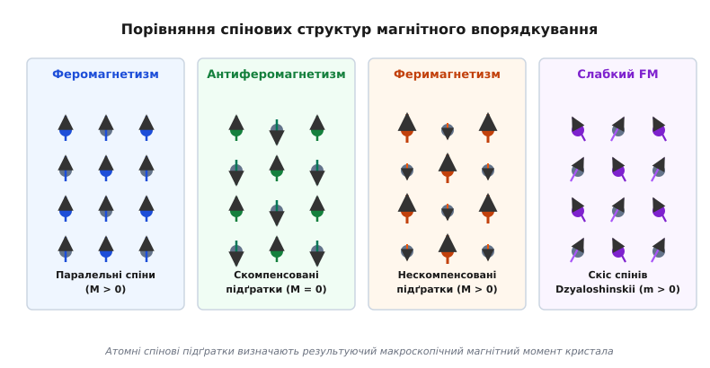
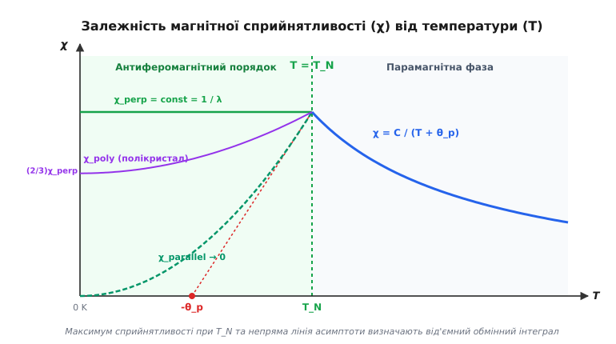
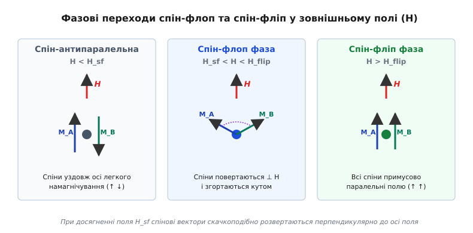
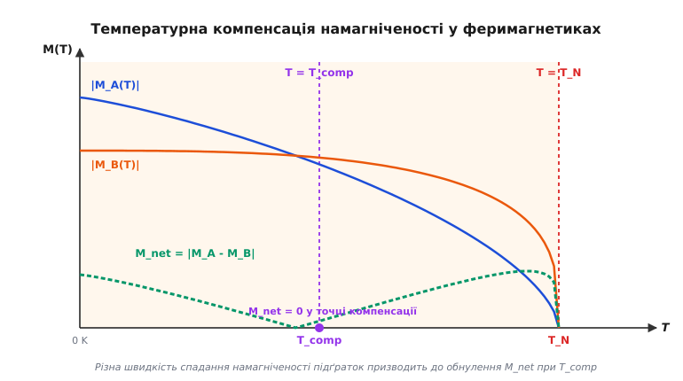

# Антиферомагнетизм і феримагнетизм

<preknowlist>
- [Феромагнетизм](topic:ph-condensed/ferromagnetism) — спонтанне паралельне впорядкування магнітних моментів електронів.
- [Точка Кюрі](topic:ph-condensed/curie-temperature) — фазовий перехід 2-го роду з упорядкованого магнітного стану у парамагнітний.
</preknowlist>

Якщо охолодити кристал оксиду марганцю (`MnO`) від кімнатної температури до мінусових 150 °C і виміряти його макроскопічні властивості звичайним магнітометром, інструмент не зафіксує жодного спонтанного магнітного поля. Речовина не притягує залізні тирси, не відхиляє стрілку компаса й поводиться як пересічний слабкий парамагнетик. Проте прецизійний калориметр при температурі 122 K (-151 °C) показує потужний сплеск теплоємності (характерний λ-пік фазового переходу другого роду), а вимірювання магнітної сприйнятливості фіксують різкий максимум, після якого здатність кристала намагнічуватися у зовнішньому полі починає спадати. Кристал зазнає глибокої внутрішньої перебудови, але його результуючий макроскопічний магнітний момент залишається строго нульовим.

Цей парадокс виникає через існування в твердому тілі прихованого внутрішнього порядку. Квантова обмінна взаємодія між атомами перехідного металу має від'ємний знак, що змушує сусідні електронні спіни шикуватися не паралельно, а у строго протилежних напрямках. Магнітні моменти сусідніх атомних площин утворюють протилежно спрямовані спінові підґратки, які ідеально компенсують одна одну в об'ємі речовини.

---

### 1. Феномен макроскопічно "невидимого" магнітного порядку

У класичних феромагнетиках (залізі, кобальті, нікелі) обмінний інтеграл позитивний (`J > 0`), що призводить до паралельної орієнтації сусідніх електронних спінів. Це формує макроскопічні домени з високою спонтанною намагніченістю `M > 0`. Вище температури Кюрі `T_C` тепловий рух руйнує цей порядок, і магнітна сприйнятливість описується класичним законом Кюрі — Вейсса з позитивною температурою `θ_p > 0`:

```
χ = C / (T - θ_p)
```

Проте велика група кристалів — оксиди перехідних металів (`MnO`, `NiO`, `FeO`, `Cr₂O₃`), галогеніди (`MnF₂`, `FeCl₂`), а також чистий металевий хром (`Cr`) — виявляють принципово іншу магнітну поведінку. У високотемпературній парамагнітній області їхня сприйнятливість також описується законом Кюрі — Вейсса, але з від'ємною константою `θ_p < 0`:

```
χ = C / (T + |θ_p|)
```

Від'ємний знак `θ_p` свідчить про те, що міжатомні сили прагнуть розвернути сусідні магнітні диполі антипаралельно. При зниженні температури до критичного порогу, названого **температурою Нееля** (`T_N`, на честь французького фізика Луї Нееля, фр. *Louis Néel*), кристалічна ґратка скачкоподібно переходить у впорядкований стан. Проте на відміну від феромагнетика, у якому виникає спонтанна намагніченість, результуючий макроскопічний магнітний момент залишається нульовим.


*Антипаралельне впорядкування спінових підґраток у феромагнетиках, антиферомагнетиках та феримагнетиках*

Залежно від відносного модуля та спрямованості спінових моменів у кристалічній ґратці магнітний порядок поділяють на чотири фундаментальні класи:
1. **Феромагнетизм:** Усі спіни орієнтовані паралельно (`↑ ↑ ↑ ↑`), макроскопічна намагніченість велика (`M > 0`).
2. **Антиферомагнетизм:** Спіни розділені на дві ідентичні протилежно спрямовані підґратки (`↑ ↓ ↑ ↓`), сумарний момент строго нульовий (`M_net = 0`).
3. **Феримагнетизм:** Спінові підґратки спрямовані протилежно, але є нееквівалентними за величиною (`⇈ ↓ ⇈ ↓`), створюючи спонтанний нескомпенсований момент (`M_net = |M_A - M_B| > 0`).
4. **Слабкий феромагнетизм (скошений антиферомагнетизм):** Через тонку квантову взаємодію спини підґраток відхиляються від строго антипаралельної лінії на малий кут, утворюючи невелику поперечну намагніченість.

Класифікація спінових структур у перовськітах (наприклад, у манганітах `LaMnO₃` та `SrMnO₃`) виділяє кілька геометрій впорядкування підґраток:
- **G-тип:** Кожен спін оточений 6 сусідніми антипаралельними спінами у трьох вимірах (класична тривимірна шахівниця).
- **A-тип:** Спіни у межах одного двовимірного шару `(xy)` орієнтовані паралельно, але сусідні шари уздовж осі `z` орієнтовані антипаралельно.
- **C-тип:** Спінові ланцюжки вздовж осі `z` орієнтовані паралельно, але сусідні ланцюжки у площині `(xy)` орієнтовані антипаралельно.

---

### 2. Квантовий механізм непрямого суперобміну (Superexchange) та ДЗЗ-взаємодія

У металевому залізі або кобальті атомні 3d-орбіталі перекриваються безпосередньо у просторі, забезпечуючи **прямий обмін** (*direct exchange*). Проте у більшості антиферомагнетиків і феримагнетиків (зокрема в оксидах `MnO` або `Fe₂O₃`) відстань між сусідніми катіонами перехідних металів становить близько 0.4 нм. Пряме перекриття їхніх внутрішніх d-оболонок є нехтовно малим і не може забезпечити потужне обмінне поле з температурою впорядкування у сотні кельвінів.

Між кожній парою катіонів металу `Mn²⁺` розташований немагнітний аніон кисню `O²⁻` із повністю заповненою зовнішньою 2p-електронною оболонкою. Виникає фундаментальне питання: як магнітна інформація про орієнтацію спінів передається між катіонами через проміжний немагнітний атом?

Фізичний механізм цього явища, розроблений Хендріком Крамерсом та Філіпом Андерсоном, отримав назву **непрямого суперобміну** (*superexchange*).

```
[ Катіон M1 (d⁵) ] <--- (2p-орбіталь O²⁻) ---> [ Катіон M2 (d⁵) ]
       ↑                     ↓  ↑                    ↓
```

Процес відбувається шляхом віртуального квантового переносу електрона:
1. Заповнена 2p-орбіталь аніона кисню містить два електрони з протилежними спінами (`↓` та `↑`).
2. Один із 2p-електронів (наприклад, зі спіном `↑`) тимчасово перескокує на незаповнену d-орбіталь лівого катіона `M1`.
3. Згідно з **правилом Гунда**, якщо d-оболонка катіона `M1` вже напівзаповнена спінами вгору (`↑`), віртуальний електрон може сісти на неї лише зі спіном донизу (`↓`). Це означає, що спін катіона `M1` мусить бути спрямований вгору (`↑`).
4. Другий електрон кисневої орбіталі (що залишився зі спіном `↑`) взаємодіє з правим катіоном `M2`. Щоб мінімізувати кулонівську енергію, спін катіона `M2` змушений орієнтуватися донизу (`↓`).

В результаті проміжний аніон кисню виступає квантовим мостком: він передає антипаралельну орієнтацію між катіонами `M1` та `M2`, створюючи ефективний від'ємний обмінний інтеграл `J_eff < 0`.

Геометрія міжатомного зв'язку грає вирішальну роль у знаці та силі суперобміну. Згідно з **правилами Ґуденафа — Канаморі** (*Goodenough-Kanamori rules*):
- Якщо кут валентного зв'язку `M1 — O — M2` становить **180°** (лінійний зв'язок з перекриттям p-орбіталей вздовж осі), суперобмін є **сильно антиферомагнітним** (`J < 0`).
- Якщо кут зв'язку наближається до **90°**, перекриття відбуваються з різними орбітальними симетріями, і суперобмін стає **слабким феромагнітним** (`J > 0`).

#### Взаємодія Дзялошинського — Морія (DMI)
У кристалах без центру інверсії (наприклад, у гематиті `α-Fe₂O₃` або `FeBO₃`) спин-орбітальна взаємодія викликує додатковий асиметричний обмін — **взаємодію Дзялошинського — Морія** (*Dzyaloshinskii-Moriya Interaction*, DMI):

```
E_DMI = D · (S_i × S_j)
```

де `D` — вектор Дзялошинського.

Ця взаємодія прагне розвернути сусідні спіни під кутом **90°** один до одного. У змаганні з потужним антиферомагнітним суперобміном (`J < 0`, який вимагає 180°) спіни підґраток злегка скішуються на малий кут (порядку 0.1–1°). В результаті антипаралельність порушується і виникає слабка нескомпенсована поперечна намагніченість `m ~ 10⁻³ M_0`, відома як **слабкий феромагнетизм**.

Детальний історичний екскурс про те, як гіпотеза Нееля подолала скепсис провідних теоретиків того часу та була остаточно підтверджена експериментами з дифракції теплових нейтронів, читайте у вставці [Історія відкриття антиферомагнетизму та феримагнетизму](topic:ph-condensed/antiferromagnetism/hist-neel-antiferromagnetism.md).

---

### 3. Двопідґраткова модель Нееля та температура Нееля (T_N)

Для математичного опису антиферомагнетика Луї Неель запропонував розділити кристал на дві вкладені кристалографічні підґратки `A` та `B`. Усі вузли підґратки `A` мають намагніченість `M_A`, а вузли підґратки `B` — намагніченість `M_B`.

За відсутності зовнішнього поля внутрішні ефективні молекулярні поля, що діють на кожну підґратку, описуються співвідношеннями:

```
H_A = - λ_AB · M_B + λ_AA · M_A
H_B = - λ_AB · M_A + λ_BB · M_B
```

де `λ_AB > 0` — константа міжпідґраткового антиферомагнітного обміну, а `λ_AA = λ_BB` — константа внутрішньопідґраткового обміну.

Оскільки в симетричному кристалі підґратки є повністю ідентичними, при `T < T_N` їхні спонтанні намагніченості рівні за модулем і протилежні за напрямком:

```
|M_A| = |M_B| = M_0(T)
M_net = M_A + M_B = 0
```

Температура фазового переходу з впорядкованого антиферомагнітного стану у парамагнітний визначається виразом:

```
T_N = (C / 2) · (λ_AB + λ_AA)
```

де `C` — константа Кюрі матеріалу.


*Температурна залежність магнітної сприйнятливості для антиферомагнетика*

Головною експериментальною ознакою антиферомагнетика є сильна **анізотропія магнітної сприйнятливості** при температурах нижче точки Нееля (`T < T_N`):

1. **Перпендикулярна сприйнятливість (`χ_perp`):**
   Якщо зовнішнє магнітне поле `H` прикладене перпендикулярно до осі орієнтації спінів, воно відхиляє обидва вектори `M_A` та `M_B` на малий кут у напрямку поля. Оскільки енергетична протидія виконується лише обмінним полем `λ_AB`, перпендикулярна сприйнятливість є повністю **незалежною від температури**:

   ```
   χ_perp = 1 / λ_AB = const
   ```

2. **Паралельна сприйнятливість (`χ_parallel`):**
   Якщо поле `H` прикладене паралельно до осі спінів, воно намагається підсилити одну підґратку й послабити іншу. При `T → 0 K` спіни абсолютно жорстко зафіксовані обмінним полем і не можуть змінити свої модулі. В результаті паралельна сприйнятливість строго спадає до нуля:

   ```
   χ_parallel(0 K) = 0
   ```

3. **Полікристалічна сприйнятливість (`χ_poly`):**
   У хаотично орієнтованому полікристалічному зразку магнітна сприйнятливість при `0 K` становить точно **дві треті** від свого максимального значення при температурі Нееля:

   ```
   χ_poly(0 K) = (2/3) · χ_perp
   ```

#### Геометрична магнітна фрустрація
Якщо спини розташовані у геометрії трикутної ґратки, кагоме (*kagome*) або пірохлору (*pyrochlore*), від'ємна антиферомагнітна взаємодія між найближчими сусідами не може задовольнити усі зв'язки одночасно. Виникає **магнітна фрустрація** (*magnetic frustration*). 

Ступінь фрустрації характеризується фактором `f = θ_p / T_N`. У сильних фрустрованих магнітниках значення `f > 10–100`. Замість звичайного Неелівського порядку у таких кристалах при наднизьких температурах реалізуються екзотичні квантові стани матерії: **спінова рідина** (*spin liquid*) або **спіновий лід** (*spin ice*) із дробовими квазічастинковими збудженнями (магнітними монополями).

Повний математичний вивід рівнянь молекулярного поля, матричного детермінанта температури Нееля та тензора сприйнятливості наведено у вставці [Двопідґраткова теорія середнього поля Нееля](topic:ph-condensed/antiferromagnetism/math-neel-two-sublattice.md).

---

### 4. Динаміка у зовнішньому магнітному полі: спін-флоп та спін-фліп переходи

Якщо прикласти до антиферомагнітного монокристала зовнішнє магнітне поле `H` строго вздовж осі легкого намагнічування спінів, у системі виникає гостре енергетичне протиборство.

З одного боку, кристалографічна анізотропія (з енергією `K_anisotropy`) намагається утримати спіни уздовж осі. З іншого боку, як ми бачили вище, паралельна сприйнятливість `χ_parallel` при низьких температурах близька до нуля, тоді як перпендикулярна сприйнятливість `χ_perp` є високою. Системі енергетично вигідніше виграти магнітну енергію `(1/2) · χ_perp · H²`, розвернувши свої спіни перпендикулярно до зовнішнього поля!


*Переходи спін-флоп та спін-фліп у зовнішньому магнітному полі*

При поступовому зростанні зовнішнього поля `H` кристал зазнає послідовності двох фазових переходів:

1. **Спін-флоп перехід (Spin-Flop transition):**
   При досягненні першого критичного поля `H_sf` виграш у вихровій перпендикулярній сприйнятливості перевищує енергію магнітної анізотропії. Вектори спінів двох підґраток скачкоподібно розвертаються на **90°**, стаючи майже перпендикулярними до зовнішнього поля `H`, і злегка складаються кутом у напрямку поля.

   Величина поля спін-флоп переходу визначається середнім геометричним між обмінним полем `H_E` та полем анізотропії `H_K`:

   ```
   H_sf = √(2 · H_E · H_K)
   ```

   Оскільки `H_E ~ 100–1000 Тл`, а `H_K ~ 0.1–1 Тл`, характерне поле спін-флоп переходу становить кілька Тесла (наприклад, для `MnF₂` при 4.2 K поле `H_sf ≈ 9.3 Тл`).

2. **Спін-фліп перехід (Spin-Flip transition):**
   Якщо продовжувати збільшувати поле до гігантських значень, кут між спінами підґраток плавно зменшується. При досягненні другого критичного поля `H_flip` обмінна взаємодія повністю подавляється зовнішнім полем, і обидві підґратки схлопуються в паралельний феромагнітний стан (індуковане насичення):

   ```
   H_flip ≈ 2 · H_E
   ```

3. **Метамагнетизм:**
   У кристалах із надзвичайно високою магнітною анізотропією (де `H_K > H_E`, наприклад, у шаруватому `FeCl₂`) спін-флоп фаза виявляється енергетично невигідною. При досягненні критичного метамагнітного поля відбуваються не 90-градусний поворот, а скачкоподібний перехід першого роду безпосередньо зі спін-антипаралельного у паралельний феромагнітний стан.

Ознайомитися з практичним алгоритмом чисельного моделювання спінових фазових переходів методом Монте-Карло та завантажити робочий код мовами C та C++ можна у вставці [Моделювання антиферомагнетика методом Монте-Карло](topic:ph-condensed/antiferromagnetism/proj-sublattice-spin-sim.md).

---

### 5. Феримагнетизм: нескомпенсовані підґратки та точка компенсації

Що станеться, якщо кристалографічні підґратки `A` та `B` є нееквівалентними? Це спостерігається у кристалах, де:
- Кількість атомних позицій у підґратці `A` не дорівнює кількості позицій у підґратці `B`.
- Катіони у підґратках мають різні валентності та різні магнітні моменти (наприклад, іони `Fe²⁺` із моментом `4 μ_B` та `Fe³⁺` із моментом `5 μ_B`).

Такі речовини називаються **феримагнетиками**. Антиферомагнітна взаємодія між підґратками (`J_AB < 0`) змушує спіни шикуватися антипаралельно, проте через нерівність модулів повна векторна компенсація стає неможливою:

```
M_net = |M_A - M_B| > 0
```

Феримагнетики поєднують мікроскопічну антипаралельну структуру з макроскопічними властивостями феромагнетиків: вони демонструють спонтанну намагніченість, розпадаються на магнітні домени й притягуються зовнішніми магнітами.


*Температурна компенсація намагніченості підґраток у феримагнетиках*

Головні класи практичних феримагнетиків:
- **Магнітні шпінелі (`MFe₂O₄`):** Мінерал магнетит (`Fe₃O₄`), а також технічні ферити (`MnZn`, `NiZn`, `CuFe₂O₄`), де катіони займають тетраедричні 8a (підґратка `A`) та октаедричні 16d (підґратка `B`) позиції.
- **Ферити-гранати (`R₃Fe₅O₁₂`):** Зокрема ітрій-залізистий гранат (**YIG**, `Y₃Fe₅O₁₂`), який володіє найменшою у фізиці шириною лінії магнітного резонансу та використовується у НВЧ-приладах.
- **Гексаферити (`BaFe₁₂O₁₉`):** Гексагональні оксиди з високою кристалографічною анізотропією, які застосовуються як жорсткі постійні магніти.

Оскільки підґратки `A` та `B` мають різний хімічний склад і різне кристалічне оточення, температурні залежності їхніх намагніченостей `M_A(T)` та `M_B(T)` описуються різними кривими.

Якщо підґратка `A` має більший магнітний момент при 0 K, але її намагніченість спадає з температурою швидше, ніж у підґратки `B`, криві `M_A(T)` та `M_B(T)` перетинаються при критичній температурі `T_comp < T_N`.

У цій точці виникає феномен **точки компенсації** (*compensation point*):

```
M_A(T_comp) = M_B(T_comp)  ⇒  M_net(T_comp) = 0
```

При температурі компенсації результуюча спонтанна намагніченість макрозразка обнуляється, хоча мікроскопічний феримагнітний порядок і підґратки повністю зберігаються. При подальшому нагріванні вище `T_comp` макроскопічний вектор намагніченості відновлюється і напрямок результуючого моменту розвертається на 180°.

Явище точки компенсації використовується в надшвидкому надщільному оптичному записі інформації (All-Optical Helicity-Dependent Switching, AO-HDS) на аморфних плівках `GdFeCo`. При опроміненні фемтосекундним лазерним імпульсом матеріал миттєво нагрівається крізь точку `T_comp`, що дозволяє змінювати напрямок намагніченості осередку за субпікосекундні часи (`< 1 пс`) без застосування зовнішніх магнітних полів.

Детальний опис технічних параметрів, частотних характеристик та механізмів втрат у практичних феритових осердях наведено у вставці [Феритові осердя у високочастотних індуктивних компонентах](topic:ph-condensed/antiferromagnetism/comp-ferrite-cores.md).

---

### 6. Антиферомагнітна динаміка, високочастотний резонанс (AFMR) та магнони

Динамічний відгук антиферомагнетиків на змінні височастотні магнітні поля докорінно відрізняється від традиційного [Феромагнітного резонансу](topic:ph-condensed/ferromagnetic-resonance) (FMR).

У феромагнетику прецесія вектора намагніченості у зовнішньому полі `H_0` відбувається на частоті Лармора `ω_FMR = γ · H_0`, яка для стандартних полів у кілька кілогаус лежить у гігагерцовому діапазоні (`1–10 ГГц`).

В антиферомагнетиках спинові вектори обох підґраток `M_A` та `M_B` пов'язані гігантським внутрішнім міжпідґратковим обмінним полем `H_E`. При відхиленні спінів від осі анізотропії обмінне поле створює потужний повертальний момент, що призводить до **обмінного підсилення частоти резонансу** (*exchange-enhanced resonance*).

Частота антиферомагнітного резонансу (**AFMR**) за відсутності зовнішнього поля описується формулою Киттеля:

```
ω_AFMR = γ · √(2 · H_E · H_K + H_K²)
```

Оскільки обмінне поле `H_E` сягає сотень Тесла, власний спіновий резонанс антиферомагнетиків зміщується з гігагерцового у **терагерцовий діапазон** (від **100 ГГц до 10 ТГц**).

Дисперсійне співвідношення для квазічастинок магнітних збуджень — **магнонів** (*magnons*) — в антиферомагнетиках також є принципово іншим:
- У феромагнетиках енергія магнона при малих хвильових векторах `k` є квадратичною: `ω(k) ∝ k²`.
- В антиферомагнетиках через симетричний зв'язок підґраток закон дисперсії є **лінійним**:

```
ω(k) = √( ω_AFMR² + v_sw² · k² )
```

де `v_sw` — швидкість спінових хвиль, яка сягає колосальних значень **10–30 км/с** (що на два порядки перевищує швидкість звуку в кристалі). Це забезпечує надшвидке перенесення спинового кутового моменту без перенесення електричного заряду.

Внаслідок лінійного закону дисперсії магнонів решіткова магнонна теплоємність антиферомагнетика при наднизьких температурах описується кубічною залежністю, точно аналогічною до закону Дебая для фононів:

```
C_magnon ∝ T³                            [магнонна теплоємність АФМ]
```

тоді як у феромагнетиках через квадратичний закон дисперсії теплоємність магнонів підпорядковується закону Блоха `C_magnon ∝ T^(3/2)`.

---

### 7. Експериментальні методи діагностики спінових підґраток

Оскільки антиферомагнетики не створюють зовнішніх макроскопічних дипольних полів, для прямих дослідження їхньої мікроскопічної спінової структури виявилося необхідним розробити цілий спектр спеціальних ядерно-фізичних та синхротронних методів:

1. **Нейтронографія (Neutron Scattering):**
   Прямий і найбільш беззаперечний метод. Оскільки нейтрон має власний спін і магнітний момент `μ_n = -1.913 μ_N`, він зазнає Бреггівського відбивання від атомних спинів підґраток, створюючи надструктурні магнітні піки дифракції. Непружне розсіяння нейтронів (*inelastic neutron scattering*) дозволяє картографувати повний спектр дисперсії магнонів `ω(k)` по усій зоні Бріллюена.

2. **Ядерний магнітний резонанс (ЯМР) та Ефект Мессбауера:**
   Локальні ядерні зонди дозволяють вимірювати надтонке магнітне поле `H_hf ~ 10–50 Тл`, яке орієнтовані d-електрони створюють безпосередньо на власному ядрі іона (`⁵⁷Fe`, `⁵⁵Mn`). Це дає змогу визначати абсолютне значення підґраткової намагніченості `M_A(T)` з прецизійною точністю.

3. **Синхротронна рентгенівська спектроскопія (XMLD та PEEM):**
   Рентгенівський магнітний лінійний дихроїзм (*X-ray Magnetic Linear Dichroism*, XMLD) у поєднанні з фотоемісійною електронною мікроскопією (PEEM) дозволяє візуалізувати антиферомагнітні домени та напрямок вектора Нееля на поверхні кристала з просторовою роздільною здатністю до 10–20 нм.

---

### 8. Практичне застосування та антиферомагнітна спінтроніка

Протягом десятиліть антиферомагнетики вважалися академічною фундаментальною физикою без практичного застосування. Проте розвиток мікроелектроніки та спінтроніки перетворив їх на один із найважливіших технологічних матеріалів XXI століття.

#### Ефект обмінного зміщення (Exchange Bias)
При напиленні тонкої феромагнітної плівки (наприклад, `Permalloy Ni₈₀Fe₂₀`) безпосередньо на антиферомагнітну підкладку (`IrMn` або `FeMn`) і охолодженні системи в магнітному полі виникає феномен **обмінного зміщення** (*exchange bias*).

Жорстко зафіксовані спіни поверхневого шару антиферомагнетика "пришивають" напрямок намагніченості сусіднього феромагнетика, зміщуючи петлю гістерезису вздовж осі полів на величину `H_eb`.

```
[ Спін-зафіксований Антиферомагнетик (IrMn) ]  <-- Інтерфейсне обмінне зачеплення
[ Вільний Феромагнітний шар (NiFe)         ]  <-- Зафіксований опорний шар (Pinned layer)
```

Цей ефект став технологічною основою для створення:
- Спінових вентилів та спинових світлодіодів.
- Зчитувальних головок жорстких дисків на основі гігантського (GMR) та тунельного (TMR) магнітоопору.
- Елементів енергонезалежної магніторезистивної оперативної пам'яті (**MRAM**).

#### Електричне керування вектором Нееля (Néel Vector Switching)
У металевих антиферомагнетиках із нецентросиметричною підґраткою (наприклад, `CuMnAs` та `Mn₂Au`) проходження електричного струму генерує локальні спінові поля Вейсса — Слончевського за рахунок спінового ефекту Рашби. Це дозволяє перевертати вектор Нееля `L = M_A - M_B` за допомогою коротких електричних імпульсів струму, створюючи надшвидкі елементи пам'яті без макроскопічних магнітних полів розсіювання.

> 🔧 **Навіщо це.**
> Антиферомагнітна спінтроніка відкриває нову еру напівпровідникової та обчислювальної техніки. Завдяки відсутності макроскопічного магнітного поля антиферомагнітні осередки пам'яті не створюють паразитного дипольного перехресного наводження на сусідні осередки, що дозволяє ущільнювати елементи MRAM до нанометрових розмірів. А терагерцова власна динаміка спінів дозволяє здійснювати перемикання магнітного стану за фемтосекундні інтервали часу (`~10⁻¹³ с`), підвищуючи тактову частоту магнітної логіки до 1–10 Терагерц.
