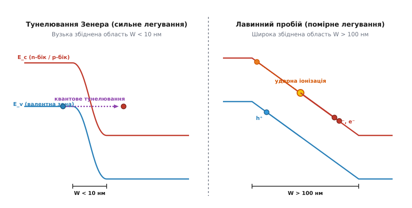
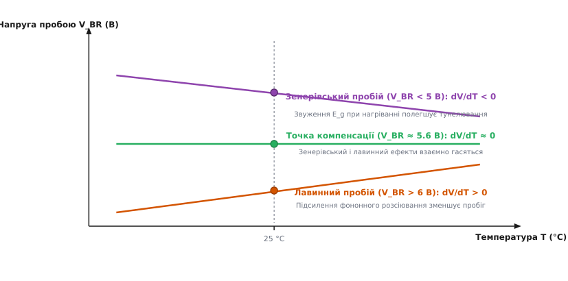
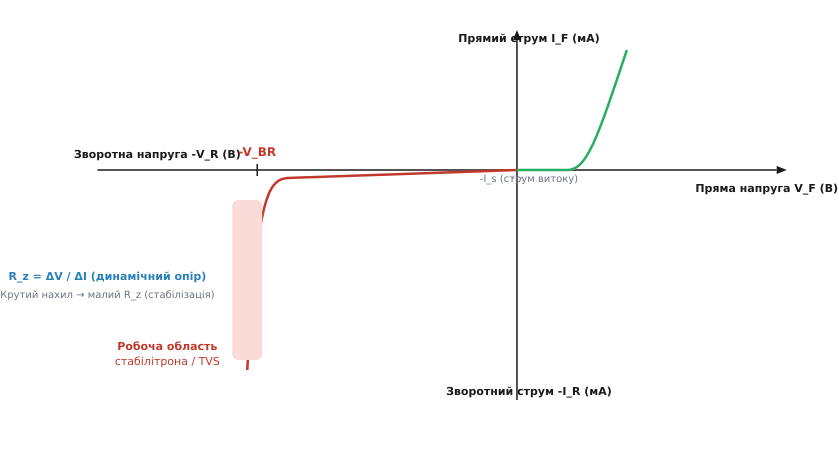

# Лавинний пробій і тунелювання Зенера

<preknowlist>
- [PN-перехід: бар'єр і збіднена область](topic:ph-condensed/pn-junction) — структура зворотного зміщення, збіднена область та електричне поле.
- [Зонна теорія напівпровідників](topic:ph-condensed/semiconductor) — валентна зона, зона провідності та заборонена зона (bandgap).
- [Електронний дрейф і рухливість носіїв](topic:ph-condensed/electron-drift) — прискорення носіїв у полі, довжина вільного пробігу та теплова швидкість.
</preknowlist>

Коли до напівпровідникового діода прикладають зворотну напругу, позитивний потенціал зовнішнього джерела живлення підключають до n-області, а негативний — до p-області. Зовнішня напруга підсумовується з внутрішнім контактивним потенціалом, унаслідок чого потенціальний бар'єр для основних носіїв зростає, а ширина збідненої області розширюється. Основні носії заряду — вільні електрони в n-області та дірки в p-області — відтягуються від металургійної межі вглиб кристала. Через перехід здатні проходити лише неосновні носії, число яких обмежене швидкістю теплової генерації. Зворотний струм падає до крихітного струму насичення, що становить частки мікроампера, і напівпровідниковий прилад поводиться як відмінний електричний ізолятор.

Проте ця ізоляція не є безмежною. Якщо продовжувати збільшувати зворотну напругу, настає критичний поріг, за якого зворотний струм раптово зростає на п'ять-сім порядків при практично незмінній напрузі на приладі. Напівпровідник миттєво втрачає запираючі властивості та переходить у режим **електричного пробою** (*breakdown*).

Перше повсякденне уявлення підказує, що пробій — це незворотна катастрофа, яка повністю руйнує кристал. Однак у фізиці напівпровідників це не так. Електричний пробій є цілком оборотним електронним процесом: якщо струм у колі обмежити зовнішнім баластним опором, кристал залишається повністю неушкодженим і негайно повертається до вихідного високомного стану при знятті напруги. Фізичну природу цього явища визначають два абсолютно різних фундаментальних механізми — класична ударна іонізація (лавинний пробій) та квантовомеханічне тунелювання електронів (тунельний пробій Зенера).

---

### Бар'єр під напругою: розподіл поля, рівняння Пуассона та межа обратимості

Щоб зрозуміти, звідки береться катастрофічне зростання струму, необхідно детально розглянути структуру збідненої області зворотньо зміщеного переходу. Позитивно заряджені оголені іони донорів у n-області та негативні іони акцепторів у p-області утворюють подвійний шар нерухомого об'ємного електричного заряду. Згідно з електростатичним рівнянням Пуассона, розподіл напруженості електричного поля `E(x)` уздовж координати `x` у збідній області зв'язаний з густиною об'ємного заряду `ρ(x)` співвідношенням:

```
dE / dx = ρ(x) / ( ε · ε₀ )
```

Для резкого p-n переходу зі ступенчатим профілем легування густина заряду з n-боку дорівнює `ρ = q · N_D`, а з p-боку — `ρ = -q · N_A`. Інтегрування рівняння Пуассона показує, що напруженість електричного поля змінюється за лінійним законом від нуля на зовнішніх межах збідненої зони до максимуму на самій металургійній межі `x = 0`.

Оскільки вся прикладена зворотна напруга `V_R` зосереджена у тонкому шарі збідненої зони шириною `W`, максимальна напруженість електричного поля `E_max` досягає велетенських значень — від сотень кіловольт до кількох мегавольт на сантиметр (`10⁵ ... 10⁶ В/см` або `10⁷ ... 10⁸ В/м`).

```
E_max = ( 2 · (V_bi + V_R) ) / W = √ ( (2 · q · N_d · (V_bi + V_R)) / (ε · ε₀) )
```

Поки електричне поле перебуває у помірних межах, єдиним джерелом носіїв у збідній області є теплова генерація електрон-діркових пар. Неосновні електрони, що випадково виникають у p-області внаслідок теплового тремтіння ґратки, дрейфують полем у n-область, а неосновні дірки з n-області — у p-область. Це формує тепловий струм насичення `I_s`, який практично не залежить від зворотної напруги, аж поки напруженість поля `E_max` не наближається до критичного значення `E_crit`.

При досягненні `E_crit` виникає один із двох фізичних сценаріїв:
1. Сильне поле надає неосновним носіям таку високу кінетичну енергію між зіткненнями з ґраткою, що вони починають іонізувати нейтральні атоми напівпровідника при зіткненні — виникає **лавинний пробій**.
2. Потенціальний бар'єр стає настільки вузьким, що електрони з валентної зони дістають можливість пробивати його наскрізь за рахунок квантовомеханічного тунелювання — виникає **тунельний пробій Зенера**.

Принципово важливо розрізняти **електричний пробій** та **тепловий пробій**. Електричний пробій є суто електронним процесом і відбувається за частки пікосекунди. Він не пов'язаний із пошкодженням кристалічної ґратки. Знищення приладу виникає лише тоді, коли неконтрольований струм пробою викликає локальний джоулів нагрів `P = V_BR · I`, який розігріває кристал до температури плавлення кремнію (`1414 °C`). Якщо ж зовнішнє коло обмежує струм, електричний пробій стає стабільним робочим режимом.

Історично наукова спільнота не одразу розрізнила ці два шляхи. Детальніше про те, як теорія Зенера вважалася єдиним поясненням, поки вимірювання 1950-х років у Bell Labs не відкрили лавинне множення, описано в вставці [Історія відкриття ефекту Зенера та лавинного множення](topic:ph-condensed/avalanche-breakdown/hist-zener.md).

---

### Тунелювання Зенера: квантовий прорив крізь вузьку заборонену зону

Для розуміння ефекту Зенера слід звернутися до зонної діаграми напівпровідника під сильною зворотною напругою. У нейтральному стані або при малому зміщенні валентна зона p-області та зона провідності n-області розділені за енергією забороненою зоною `E_g` (для кремнію `E_g ≈ 1.12 еВ` за кімнатної температури). Електрон валентної зони перебуває у зв'язаному стані й бере участь у ковалентних зв'язках кристала; щоб перевести його у вільний стан у зону провідності, йому потрібно надати енергію, не меншу за `E_g`.

Проте при збільшенні зворотної напруги `V_R` енергетичні зони p-боку зміщуються вгору відносно зон n-боку. Напруженість поля `E` визначає нахил зон на зонній діаграмі: `dE/dx = q · E`. Коли нахил стає надзвичайно крутим, стеля валентної зони `E_v` з p-боку опиняється на тій самій енергетичній висоті, що й дно зони провідності `E_c` з n-боку.


*Зонні діаграми зворотньо зміщеного PN-переходу. Ліворуч: тунелювання Зенера при сильному легуванні — збіднена область W < 10 нм настільки вузька, що електрони з валентної зони p-боку тунелюють прямо в зону провідності n-боку. Праворуч: лавинний пробій при помірному легуванні — ширша область W > 100 нм дозволяє носіям прискорюватись полем та викликати ударну іонізацію.*

З погляду класичної фізики електрон не може перейти з валентної зони p-боку в зону провідності n-боку, бо між ними лежить просторовий бар'єр забороненої зони шириною `W`. У класичній механіці частинка з енергією, меншою за висоту бар'єра, відбивається від нього на 100%.

Але електрон підпорядковується хвильовому рівнянню Шредінгера. Хвильова функція електрона `Ψ(x)` всередині забороненої зони не перетворюється негайно на нуль, а згасає за експоненційним законом. Якщо просторова ширина бар'єра `W` є надзвичайно малою (менше ніж 10 нанометрів, що відповідає всього 20–30 атомарним шарам кремнію), хвильова функція не встигає повністю згаснути. Електрон виходить із протилежного боку бар'єра у вільній зоні провідності n-області. Це і є **квантовомеханічне тунелювання**.

Ймовірність тунелювання `P` залежить експоненційно від маси електрона `m*`, ширини забороненої зони `E_g` та напруженості електричного поля `E`:

```
P ≈ exp( - (C · m*^(1/2) · E_g^(3/2)) / (q · ℏ · E) )
```

Головним фактором, який визначає прояв тунелювання Зенера, є **рівень легування напівпровідника**. Ширина збідненої області `W` у ступенчатому p-n переході обернено пропорційна квадратному кореню з концентрації домішок:

```
W = √ ( (2 · ε · ε₀ · (V_bi + V_R)) / (q · N_d) )
```

Якщо обидві області p-n переходу леговані дуже сильно (концентрація донорів та акцепторів `N_A, N_D > 10¹⁸ см⁻³`), збіднена область виходить надзвичайно вузькою (`W < 10 нм`). У такому разі вже при відносно невеликій зворотній напрузі (`V_R < 5 В`) напруженість поля досягає критичної межі `E_crit ≈ 10⁶ В/см` (`10⁸ В/м`), і тунельний струм Зенера вибухоподібно зростає.

Квантове тунелювання має важливу особливість: воно є майже **безперервним та безінерційним процесом**. Перехід електрона крізь бар'єр відбувається за квантовий час порядка `10⁻¹⁵` секунди (фемтосекунди). Тому зенерівські стабілітрони не мають затримки відкриття й демонструють низький рівень флуктуаційного шуму порівняно з лавинними приладами.

Строгий математичний вивід ймовірності ВКБ-тунелювання та густини струму Зенера наведено у вставці [Математична модель ударної іонізації та тунелювання Зенера](topic:ph-condensed/avalanche-breakdown/math-avalanche.md).

---

### Лавинний пробій: ударна іонізація, асиметрія носіїв та ланцюгова реакція

Якщо напівпровідник легований помірно або слабо (`N_A, N_D < 10¹⁷ см⁻³`), ширина збідненої області `W` виявляється значною — від 100 нанометрів до кількох мікрометрів. На такій товщині просторовий бар'єр надто широкий для квантового тунелювання: ймовірність тунельного прориву `P` прямує до нуля. Тунелювання Зенера стає неможливим.

Проте велика ширина збідненої області відкриває шлях іншому фізичному процесу. Неосновний електрон, що потрапляє у збіднену область із p-боку, підхоплюється сильним електричним полем і починає прискорюватися у напрямку n-боку. Рухаючись крізь кристалічну ґратку, електрон безперервно зіштовхується з її тепловими коливаннями — **фононами**.

Між двома послідовними зіткненнями з фононами електрон пролітає середній шлях, який називається **довжиною вільного пробігу** `λ_fp`. На цій відстані електричне поле `E` виконує над електроном роботу і надає йому додаткову кінетичну енергію:

```
E_k = q · E · λ_fp
```

Якщо напруженість поля досягає порогу `E ≈ 10⁵ ... 5·10⁵ В/см`, кінетична енергія електрона перед зіткненням перевищує **порогову енергію іонізації** `E_th`. Для прямих іонізаційних процесів у кремнії порогова енергія становить приблизно `E_th ≈ 1.5 · E_g` (близько 1.6–1.8 еВ), оскільки крім утворення пар необхідно задовольнити закон збереження імпульсу.

Коли такий високоенергетичний («гарячий») електрон врізається у нейтральний атом кремнію, він віддає частину кінетичної енергії зв'язаному валентному електрону і вибиває його з ковалентного зв'язку в зону провідності. Цей процес називається **ударною іонізацією** (*impact ionization*).

У результаті одного акту ударної іонізації замість одного початкового електрона виникають **три рухливі носії заряду**:
- Первинний електрон (який утратив частину енергії, але залишився в зоні провідності);
- Вторинний електрон (вибитий з валентної зони в зону провідності);
- Породжена валентна дірка (порожнє місце у валентній зоні).

Далі починається ланцюгова реакція. Електричне поле розганяє обидва електрони в напрямку n-області, а породжену дірку — у протилежному напрямку, до p-області. Пролетівши свою довжину вільного пробігу, кожен з цих носіїв знову здійснює ударну іонізацію, породжуючи нові й нові електрон-діркові пари.

#### Асиметрія іонізації електронів та дірок у кремнії
Принциповою фізичною рисою кремнію є сильна **асиметрія коефіцієнтів ударної іонізації**: коефіцієнт іонізації електронів `α_n` суттєво перевищує коефіцієнт іонізації дірок `α_p` при однакових полях (`α_n >> α_p`). Це зумовлено складнішою зонною структурою валентної зони (наявністю важких та легких дірок) та сильнішим розсіюванням дірок на оптичних фононах.

Внаслідок цієї асиметрії лавинне множення у кремнієвих p⁺-n переходах (де іонізація починається з вприскування електронів зі слаболегованого n-боку) розвивається за нижчих напруженостей поля і є більш стабільним, ніж у n⁺-p переходах.

Інтенсивність множення характеризується **коефіцієнтом лавинного множення** `M`. Для струму зворотного пробою зв'язок із початковим струмом витоку `I_s` визначається співвідношенням:

```
I_R = M · I_s
```

Емпірична формула Міллера описує зростання `M` при наближенні прикладеної напруги `V_R` до напруги лавинного пробою `V_BR`:

```
M = 1 / ( 1 - (V_R / V_BR)^n )
```

Коли `V_R` досягає `V_BR`, знаменник перетворюється на нуль, а коефіцієнт множення `M` прямує до нескінченності. Один випадковий тепловий електрон на вході викликає безперервний потік мільярдів носіїв — лавинний пробій завершено, і перехід стає високопровідним.

---

### Температурний коефіцієнт: критерій розрізнення двох механізмів

На практиці виникає важливе інженерне питання: як визначити, який саме механізм — Зенера чи лавинний — відповідає за пробій конкретного діода? Зручним і надійним критерієм є **знак температурного коефіцієнта напруги пробою** (*TC_V = dV_BR / dT*).

Обидва механізми демонструють прямо протилежну залежність від температури через різну фізичну природу процесу.

#### 1. Температурна залежність тунелювання Зенера (від'ємний ТКН)

При підвищенні температури кристала амплітуда теплових коливань ґратки зростає, що призводить до незначного збільшення міжатомних відстаней (теплове розширення). Внаслідок зміни періоду потенціалу ґратки **ширина забороненої зони кремнію `E_g` зменшується** зі швидкістю приблизно `dE_g/dT ≈ -0.28 мВ/°C`.

Оскільки ймовірність квантового тунелювання експоненційно зростає при зменшенні `E_g`, нагрівання напівпровідника робить потенціальний бар'єр «легшим» для прориву електронів. Отже, для виклику тунельного струму потрібна **менша напруженість електричного поля**, і напруга пробою Зенера `V_BR` **зменшується** з ростом температури:

```
dV_BR / dT < 0    [від'ємний температурний коефіцієнт]
```


*Температурна залежність напруги пробою V_BR. Фіолотова лінія (V_BR < 5 В): тунельний пробій Зенера з від'ємним нахилом. Помаранчева лінія (V_BR > 6 В): лавинний пробій із додатним нахилом. Зелена горизонтальна лінія (V_BR ≈ 5.6 В): термокомпенсована точка, де обидва ефекти взаємно гасяться.*

#### 2. Температурна залежність лавинного пробою (додатний ТКН)

Для лавинного пробою вирішальним фактором є не ширина забороненої зони, а **довжина вільного пробігу носія `λ_fp`**. При підвищенні температури інтенсивність теплових коливань ґратки (концентрація оптичних фононів `N_q`) різко зростає згідно зі статистикою Бозе–Ейнштейна:

```
N_q ∝ 1 / ( exp( ℏ·ω₀ / (k·T) ) - 1 )
```

Електрони та дірки частіше зіштовхуються з фононами й інтенсивніше розсіюють свою кінетичну енергію у вигляді тепла. У результаті середня довжина вільного пробігу `λ_fp` **скорочується**. На коротшому шляху між зіткненнями при тому самому електричному полі електрон не встигає набрати порогову енергію іонізації `E_th`. Щоб електрон усе ж розігнався до `E_th` на коротшому шляху `λ_fp`, потрібно прикласти **сильніше електричне поле**, тобто вищу зворотну напругу:

```
dV_BR / dT > 0    [додатний температурний коефіцієнт]
```

#### Магічний поріг 5.6 Вольта у кремнії

Завдяки протилежним знакам температурних коефіцієнтів у кремнієвих p-n переходах спостерігається чітке розділення за напругою пробою:

- **`V_BR < 5.0 В`:** Домінує тунелювання Зенера. ТКН від'ємний (приблизно `-1.5 ... -3.0 мВ/°C`).
- **`V_BR > 6.0 В`:** Домінує лавинне множення. ТКН додатний (приблизно `+2.0 ... +10.0 мВ/°C`).
- **`V_BR ≈ 5.6 В`:** Область взаємної компенсації. Тунельний та лавинний ефекти діють одночасно й виявляють однакову інтенсивність. Від'ємний дрейф Зенера `dV_Z/dT` точно зрівноважується додатним дрейфом лавини `dV_Av/dT`.

Спеціально виготовлені стабілітрони з напругою пробою `5.6 В` (наприклад, популярні прилади 1N4734A або прецизійні серії 1N821) мають практично **нульовий температурний коефіцієнт** (`TC_V ≈ 0`). Саме вони слугують високостабільними джерелами опорної напруги для аналогових вимірювальних систем.

---

### Мікроплазми, крайовий ефект та профільний захист переходу

При проектуванні реальних планарних напівпровідникових діодів виникає серйозна проблема: пробій у реальному кристалі майже ніколи не відбувається рівномірно по всій площі переходу.

#### 1. Ефект концентрації поля на краях (Крайовий пробій)
У планарній технології домішки впроваджуються через вікна в захисному оксиді `SiO₂`. По краях вікна межа p-n переходу вигинається з радіусом кривини `r_j`. Згідно з законами електростатики, напруженість електричного поля на вигнутій поверхні є значно вищою, ніж на плоскій ділянці:

```
E_edge ≈ E_bulk · ( 1 + 2 · W / r_j )
```

У результаті електричне поле на криволінійних краях досягає порогу `E_crit` набагато раніше, ніж у плоскій об'ємній частині. Виникає **крайовий пробій**, який локалізується у тонкому кільці довкола діода. Це різко знижує максимально допустиму потужність приладу.

Для боротьби з крайовим пробоєм застосовують конструктивні методи профілювання поля:
- **Захисні кільця (Guard Rings):** Додаткові глибоко леговані області з більшим радіусом кривини, які розмивають концентрацію силових ліній поля.
- **Польові електроди (Field Plates):** Металеві розширення анода над шаром оксиду, які керують розподілом потенціалу на поверхні.
- **Фаски та профілювання країв (Beveling):** Механічне або хімічне сточування країв високовольтних силових тиристорів під кутом 45°–60°.

#### 2. Мікроплазми та кристалічні дефекти
Навіть у плоскій частині переходу лавинний пробій на початковій стадії розпадається на окремі провідні канали діаметром близько `0.1 ... 1 мкм` — **мікроплазми**.

Мікроплазми виникають у точках виходу дислокацій, скупчень точкових дефектів або домішок важких металів (заліза, міді, золота). У цих точках місцева ширина забороненої зони є дещо вужчою, а поле — вищим. Кожна мікроплазма вмикається зі своїм характерним шумом — так званим **бістабільним лавинним шумом**, який створює хаотичні імпульси струму на ВАХ. Зі зростанням струму число мікроплазм збільшується, вони зливаються, і пробій стає однорідним по всій площі переходу.

---

### Вольт-амперна характеристика, динамічний опір і теплова межа

Вольт-амперна характеристика p-n переходу в області зворотного пробою характеризується надзвичайно високою крутизною. Після досягнення точки пробою напруга на діоді залишається майже сталою при зміні струму на кілька порядків.


*Вольт-амперна характеристика PN-переходу. У третьому квадранті при досягненні зворотної напруги -V_BR спостерігається гостре «коліно» пробою. Нахил прямої у робочій області визначається динамічним опором R_z = ΔV / ΔI.*

Ділянку пробою описують еквівалентною схемою, що складається з послідовно з'єднаного ідеального джерела напруги `V_BR` та **динамічного опору** `R_z`:

```
V_d = V_BR + I_R · R_z
```

Динамічний (або диференціальний) опір визначається як відношення приросту зворотної напруги до приросту зворотного струму:

```
R_z = dV_R / dI_R
```

Що меншим є динамічний опір `R_z` (типово від 1 до 20 Ом), то ефективніше прилад стабілізує напругу. Мале значення `R_z` означає, що навіть при значних пульсаціях струму навантаження напруга на діоді змінюється лише на мілівольти.

Повний динамічний опір стабілітрона складається з трьох фізичних компонентів:
1. **Внутрішнього опору p-n переходу `r_j`**, зумовленого нелінійністю коефіцієнта множення Міллера.
2. **Опору об'ємного заряду `r_sc`**, пов'язаного з тим, що висока концентрація рухливих електронів та дірок у збідній зоні частково екранує іони домішок і розширює збіднену область під струмом.
3. **Опору нейтральних областей напівпровідникового кристала та омічних контактів `R_bulk`**.

Застосування приладів, що працюють у режимі пробою (стабілітронів, захисних TVS-діодів та однофотонних детекторах APD/SPAD), детально розкрито у вставці [Компоненти на основі пробою: стабілітрони, TVS-діоди та лавинні фотодіоди](topic:ph-condensed/avalanche-breakdown/comp-tvs.md).

#### Перехід від електричного пробою до теплового руйнування

Електричний пробій залишається оборотним лише доти, доки температура напівпровідникового кристала `T_j` не перевищує максимально допустиму межу (типово `150 ... 175 °C` для кремнію).

Якщо струм у колі пробою нічим не обмежений, виділяється висока теплова потужність `P = V_BR · I_R`. Це викликає швидкий локальний нагрів кристала. Зі зростанням температури концентрація **власних носіїв заряду** `n_i` зростає за експоненційним законом:

```
n_i(T) ∝ T^(3/2) · exp( - E_g / (2 · k · T) )
```

Коли температура кристала сягає `200 ... 250 °C`, концентрація власних носіїв `n_i` стає порівнянною з концентрацією легуючих домішок `N_d`. Збіднена область зникає, оскільки кристал перетворюється на власну (intrinsic) провідну плазму. Опір діода падає, струм зростає ще дужче, викликаючи додатковий нагрів.

Виникає позитивний зворотний зв'язок:

```
Нагрів  →  Зростання n_i  →  Падіння опору  →  Зростання струму  →  Ще сильніший нагрів
```

Цей процес називається **тепловим пробоєм** (*thermal breakdown*). Він завершується локальним розплавленням кремнію, утворенням струмопровідного металевого каналу (шнуруванням струму) та остаточним короткочасовим замиканням або вигорянням приладу.

Щоб запобігти тепловому пробою, у будь-якому практичному колі зі стабілітроном послідовно вмикають **баластний резистор** `R_s`, який обмежує максимальний струм до безпечного рівня:

```
I_max = ( V_src - V_BR ) / R_s  <  P_Dmax / V_BR
```

Програмну реалізацію розрахунку робочої точки кола стабілізації та чисельного моделювання ВАХ наведено у вставці [Чисельне моделювання вольт-амперної характеристики пробою](topic:ph-condensed/avalanche-breakdown/proj-breakdown-sim.md).

---

### Порівняльний підсумок двох механізмів

Для узагальнення фізичних властивостей лавинного та тунельного пробою зведемо їхні ключові характеристики в порівняльну таблицю:

| Характеристика | Тунельний пробій Зенера | Лавинний пробій |
| :--- | :--- | :--- |
| **Фізичний механізм** | Квантовомеханічне тунелювання електронів крізь заборонену зону | Класична ударна іонізація атомами та лавинне множення носіїв |
| **Рівень легування p-n переходу** | Дуже високий (`N > 10¹⁸ см⁻³`) | Помірний чи низький (`N < 10¹⁷ см⁻³`) |
| **Товщина збідненої області W** | Надвузька (`W < 10 нм`) | Широка (`W > 100 нм`) |
| **Критична напруженість поля E** | Надвисока (`E > 10⁶ В/см`) | Помірна (`E ≈ 10⁵ ... 5·10⁵ В/см`) |
| **Типова напруга пробою V_BR** | Мала (`V_BR < 5 В`) | Висока (`V_BR > 6 В`) |
| **Знак ТКН (dV_BR / dT)** | Від'ємний (`TC_V < 0`) через звуження `E_g` | Додатний (`TC_V > 0`) через розсіювання на фононах |
| **Крутизна коліна ВАХ** | Менш різка при низьких напругах | Дуже різка, практично вертикальна |
| **Шумові характеристики** | Низький рівень шуму | Високий рівень лавинного шуму через дробові флуктуації |

Розуміння цих двох фізичних шляхів дозволяє не лише правильно вибирати компоненти для захисту та стабілізації напруги, а й конструювати спеціалізовані напівпровідникові прилади — від надчутливих однофотонних детектов у квантовій оптиці до надшвидкодіючих TVS-супресорів у сучасній мікроелектроніці.
