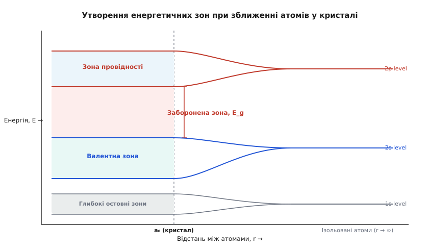
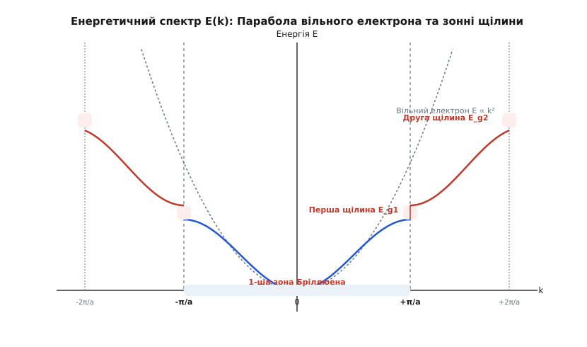
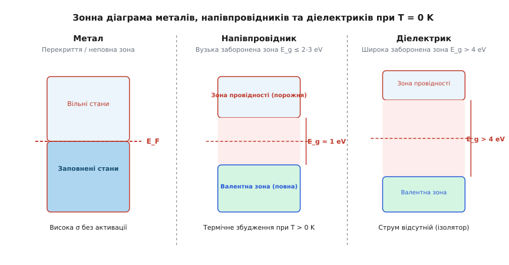
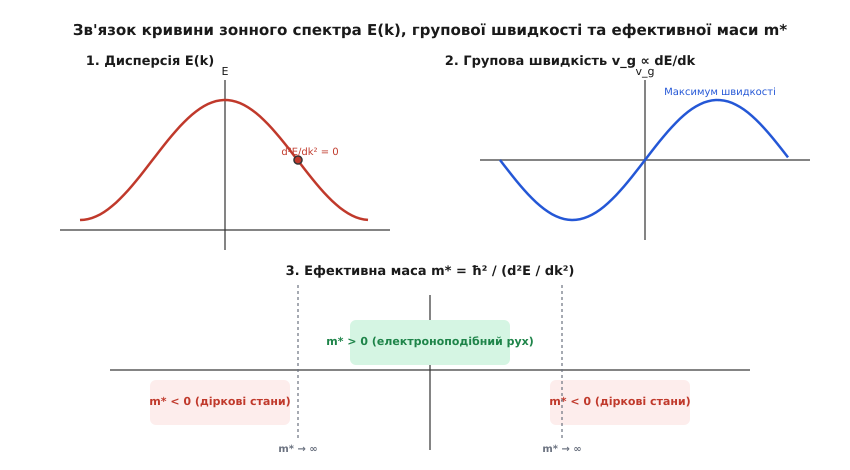

# Зонна теорія твердого тіла

<preknowlist>
- [Одновимірне стаціонарне рівняння Шредінгера](topic:ph-quantum/stationary-schrodinger-equation) — хвильова функція та стаціонарні рівні енергії в потенціальному полі.
- [Принцип заборони Паулі](topic:ph-quantum/pauli-exclusion) — ферміони не можуть займати один і той самий квантовий стан.
- [Квантове тунелювання](topic:ph-quantum/quantum-tunnelling) — проходження частинки через потенціальний бар'єр.
- [Модель Друде](topic:ph-condensed/drude-model) — класичне уявлення про газ вільних електронів та його межі.
</preknowlist>

Зіставлення двох звичайних речовин — кристалічної міді та диелектричного алмазу — виявляє глибоку фізичну загадку. Обидва кристали мають високу густину речовини та порівнянну концентрацію електронів порядку `10²³ см⁻³`. Проте мідь демонструє колосальну електропровідність, вільно пропускаючи електричний струм, тоді як алмаз є майже ідеальним прозорим ізолятором, питомий опір якого більший у `10²⁴` разів. Класична фізика, яка вважала всі валентні електрони однаковими вільними носіями заряду, виявилася принципово нездатною пояснити цю фундаментальну відмінність.

Розгадку дає зонна теорія твердого тіла — квантовомеханічне вчення про енергетичний спектр електронів, що рухаються у періодичному потенційному полі кристалічної ґратки. Вона доводить, що електричні, оптичні та магнітні властивості твердих тіл визначаються не просто наявністю електронів, а характером розподілу квантових станів за енергіями та ступенем заповнення цих станів згідно з принципом заборони Паулі. [Історія виникнення зонної теорії](topic:ph-condensed/band-theory/hist-band-theory.md) показує, як відкрито прозорість кристала для електронних хвиль.

## Провал класичного наближення та квантовий парадокс провідності

У класичній моделі Друде — Зоммерфельда електрони у металі розглядалися як електронний газ, що рухається у внутрішньому просторі кристала з постійним потенціалом `V = 0`. Іони кристалічної ґратки вважалися жорсткими кулями, на яких електрони хаотично розсіюються, подібно до молекул газу.

Ця картина містила нездоланний парадокс. Експерименти при низьких температурах показують, що у надчистих монокристалах довжина вільного пробігу електронів `l` сягає кількох міліметрів, що відповідає проходженню понад `10⁶` міжатомних періодів ґратки без жодного зіткнення. З погляду класичної механіки електрон, який є точковою частинкою, обов'язково мав би врізатися у найближчий іон на відстані перших декількох ангстремів.

Квантова механіка усуває цей парадокс через корпускулярно-хвильовий дуалізм. Електрон у кристалі описується де Бройлівською хвилею, довжина якої `λ = h / p` є співмірною з міжатомною відстанню `a` (порядку `0.1–0.5 нм`). Коли хвиля поширюється у строго періодичній структурі іонів, відбиті від окремих атомів хвилі когерентно інтерферують.

У результаті цієї інтерференції **ідеальна періодична ґратка не викликає розсіяння електронної хвилі**. Хвиля вільно поширюється крізь кристал, а електричний опір виникає виключно на порушеннях періодичності — дефектах, домішках або теплових коливаннях іонів (фононах).

Проте періодичний потенціал іонів `V(r + R) = V(r)` докорінно змінює самий енергетичний спектр електрона: замість неперервної параболи вільного руху `E = ħ²k² / (2m)` виникає складна зонна структура з чергуванням дозволених та заборонених інтервалів енергії.

## Фізичний механізм формування енергетичних зон

Щоб зрозуміти, як виникає зонний спектр, розглянемо уявний експеримент: збирання кристала з `N` ізольованих атомів, які спочатку знаходяться на нескінченно великій відстані один від одного.

Коли атоми ізольовані, електрони кожного з них займають чітко визначені дискретні атомні рівні енергії (`1s, 2s, 2p, ...`), що є однаковими для всіх `N` атомів. Спіновий фактор та принцип Паулі дозволяють кожному такому стану містити строго визначену кількість електронів.

Коли атоми наближаються на рівноважну міжатомну відстань кристала `a₀`, електронні хмари (орбіталі) сусідніх атомів починають перекриватися. Внаслідок хвильової взаємодії та перекриття потенціальних ям виникає квантовомеханічна зсувна взаємодія:

1. **Розщеплення рівнів**: кожен дискретний атомний рівень розщеплюється на `N` близьких квантових станів, утворюючи енергетичний колектив системи.
2. **Формування зони**: оскільки кількість атомів у реальному кристалі макроскопічно велика (`N ≈ 10²³`), відстань між сусідніми розщепленими рівнями стає мізерно малою (`ΔE ≈ 10⁻²² еВ`). Сукупність цих `N` станів утворює квазінеперервну **дозволену енергетичну зону** (зона від грец. *ζώνη* — «пояс, смуга»).
3. **Заборонені зони**: між дозволеними зонами залишаються інтервали енергій, у яких немає жодного квантового стану. Ці інтервали називаються **забороненими енергетичними зонами** або зонними щілинами (bandgap, `E_g`).


*Залежність енергетичного спектра електронів від міжатомної відстані r. При зближенні ізольованих атомів до рівноважної відстані кристала a₀ дискретні рівні розщеплюються у дозволені енергетичні зони, розділені забороненими щілинами E_g.*

Величина розщеплення залежить від того, наскільки сильно перекриваються хвильові функції електронів сусідніх атомів:
- **Глибокі остовні електрони** (наприклад, `1s`-орбіталі внутрішніх оболонок) міцно зв'язані зі своїми ядрами, а їхні хвильові функції майже не перекриваються. Тому остовні рівні розщеплюються слабко і перетворюються на дуже вузькі зони.
- **Валентні електрони** зовнішніх оболонок мають великий радіус орбіталей та сильно перекриваються. Їхні рівні розщеплюються у широкі валентні зони шириною в кілька електронвольт (`2–10 еВ`).

## Теорема Блоха та геометрія квазіімпульсу

Математичним фундаментом зонної теорії є доведення того, які саме хвильові функції описують електрони у періодичному полі. Нехай `V(r)` — потенціальна енергія електрона у кристалі, що має просторову періодичність стосовно будь-якого вектора трансляції ґратки `R`:

```
V(r + R) = V(r)
```

Оператор трансляції `T_R`, дія якого на довільну функцію полягає в зсуві аргументу на вектор `R` (`T_R ψ(r) = ψ(r + R)`), комутує з гамільтоніаном системи `H = -[ħ²/(2m)]∇² + V(r)`:

```
[H, T_R] = H·T_R - T_R·H = 0
```

Оскільки оператори комутують, вони мають спільну систему власних функцій. Враховуючи умову нормування та властивість послідовних трансляцій `T_R1 · T_R2 = T_(R1+R2)`, власні значення оператора трансляції мають вигляд фазового множника `e^(i · k · R)`.

Звідси випливає **теорема Блоха**: власні функції рівняння Шредінгера для електрона в періодичному полі є блохівськими хвилями — плоскими хвилями, модульованими періодичною функцією ґратки `u_k(r)`:

```
ψ_k(r) = u_k(r) · e^(i · k · r)
```

де амплітудна функція `u_k(r)` має таку саму періодичність, як і кристалічна ґратка: `u_k(r + R) = u_k(r)`.

Вектор `k` називається **хвильовим вектором електрона у кристалі**, а величина `p = ħ·k` — **квазіімпульсом** (від лат. *quasi* — «майже, якби» та *impulsus* — «поштовх»).

### Чому квазіімпульс не є справжнім імпульсом

Відмінність між звичайним імпульсом і квазіімпульсом є фундаментальною:
1. **Звичайний імпульс** збережується внаслідок однорідності простору (неперервна трансляційна симетрія). У кристалі неперервна симетрія порушена і зведена до дискретної трансляційної симетрії. Тому справжній імпульс електрона у кристалі **не збережується** — електрон безперервно обмінюється імпульсом із ґраткою як цілим.
2. **Квазіімпульс** збережується з точністю до вектора оберненої ґратки `G`. Зсув хвильового вектора на вектор оберненої ґратки `k' = k + G` не змінює блохівську хвильову функцію, оскільки множник `e^(i · G · r)` можна включити в періодичну функцію `u_k(r)`.

Оскільки стани з векторами `k` та `k + G` є фізично тотожними, вектор `k` достатньо розглядати лише у межах однієї комірки оберненої ґратки. Вона називається **першою зоною Бріллюена** (на честь французького фізика Леона Бріллюена).

Для одновимірного ланцюжка з періодом `a` перша зона Бріллюена відповідає інтервалу хвильового вектора:

```
-π/a ≤ k ≤ +π/a
```

Повний математичний розв'язок рівняння Шредінгера для одновимірного періодичного потенціалу детально виведено у вставці [Математична модель Кроніґа — Пенні](topic:ph-condensed/band-theory/math-kronig-penney.md).

## Механізм виникнення заборонених зон: дифракція Бреґґа та стоячі хвилі

Щоб отримати наочне фізичне уявлення про те, чому саме на межах зон Бріллюена утворюються заборонені енергетичні щілини, скористаємося **моделлю майже вільних електронів**.

Розглянемо електрон, який вільно рухається вздовж одновимірного кристала з потенціалом, що є слабким збудженням. Коли хвильовий вектор електрона віддалений від меж зони Бріллюена, його хвильова функція є майже чистою плоскою хвилею `e^(i·k·x)`, а енергія описується параболою `E ≈ ħ²k² / (2m)`.

Проте коли хвильовий вектор `k` наближається до межі першої зони Бріллюена `k = ±π/a`, довжина хвилі де Бройля дорівнює `λ = 2π / k = 2a`.

Ця умова збігається з **умовою дифракції Бреґґа** для відбиття хвилі від періодичної системи площин ґратки: хвиля, що біжить праворуч `e^(i·(π/a)·x)`, піддається бреґґівському відбиттю і породжує однакову за амплітудою хвилю, що біжить ліворуч `e^(-i·(π/a)·x)`.

Інтерференція цих двох зустрічних хвиль утворює не падаючу біжучу хвилю, а **дві можливі стоячі хвилі**:

1. **Симетрична стояча хвиля `ψ₊`**:
   ```
   ψ₊(x) = (1/√a) · [e^(i·(π/a)·x) + e^(-i·(π/a)·x)] = √(2/a) · cos(π·x / a)
   ```
   Густина ймовірності виявлення електрона для цього стану дорівнює:
   ```
   |ψ₊(x)|² = (2/a) · cos²(π·x / a)
   ```
   Ця функція має максимуми у точках `x = 0, ±a, ±2a, ...`, тобто **безпосередньо на позитивних іонах ґратки**. Оскільки негативний електрон локалізується поблизу позитивних ядер, його середня потенціальна енергія притягання є мінімальною (нижчий рівень).

2. **Антисиметрична стояча хвиля `ψ₋`**:
   ```
   ψ₋(x) = (i/√a) · [e^(i·(π/a)·x) - e^(-i·(π/a)·x)] = -√(2/a) · sin(π·x / a)
   ```
   Густина ймовірності для цього стану дорівнює:
   ```
   |ψ₋(x)|² = (2/a) · sin²(π·x / a)
   ```
   Ця функція має максимуми у точках `x = ±a/2, ±3a/2, ...`, тобто **у міжвузлях, посередині між іонами**. Електрон віддалений від позитивних ядер, тому його потенціальна енергія є вищою (вищий рівень).


*Дисперсійне співвідношення E(k) для електронів у періодичному полі. На межах зон Бріллюена (k = ±π/a, ±2π/a) виникають розриви неперервності спектра та розщеплення енергій на дозволені зони і заборонені щілини E_g.*

Через різницю в просторовому розподілі заряду двох стоячих хвиль енергія стану `ψ₋` виявляється строго більшою за енергію стану `ψ₊`.

Величина виниклого енергетичного розриву (забороненої зони `E_g`) дорівнює подвоєній амплітуді Фурьє-компоненти потенціалу ґратки `V_G`:

```
E_g = E(ψ₋) - E(ψ₊) = 2 · |V_G|
```

Таким чином, саме бреґґівська дифракція та просторовий розподіл електронної густини відносно іонів ґратки є причиною розриву спектра та виникнення зонних щілин на межах зон Бріллюена.

## Класифікація матеріалів: метали, напівпровідники та діелектрики

Зонна теорія дає вичерпне квантове пояснення ділення всіх твердих тіл на три макроскопічні класи за електричною провідністю. Заповнення дозволених зон електронами відбувається при `T = 0 K` послідовно від найнижчих енергій до рівня **енергії Фермі `E_F`** відповідно до принципу Паулі.

Залежно від того, як саме рівень Фермі розташований відносно зонної структури, речовини поділяються на метали, напівпровідники та діелектрики.


*Розподіл заповнення енергетичних зон електронами у металах, напівпровідниках та діелектриках при температурі T = 0 K. Штриховою лінією позначено рівень Фермі E_F.*

### 1. Метали

Металевий стан реалізується у двох випадках:
- **Частково заповнена зона**: найвища дозволена зона, що містить електрони, заповнена лише частково. Рівень Фермі `E_F` проходить безпосередньо всередині цієї зони (наприклад, у лужних металах `Na, K` або у шляхетних металах `Cu, Ag, Au`).
- **Перекриття зон**: верхня заповнена зона та наступна порожня зона просторово та енергетично перекриваються, створюючи спільну неповну зону (наприклад, у двовалентних металах `Be, Mg, Ca`).

Оскільки безпосередньо над рівнем Фермі у металах знаходяться вільні неіснуючі квантові стани, розділені нескінченно малою енергією `δE`, навіть найслабше зовнішнє електричне поле переводить електрони у вищі енергетичні стани, викликаючи впорядкований дрейф носіїв. Метали мають високу провідність `σ ≈ 10⁴–10⁶ Ом⁻¹·см⁻¹`, яка не потребує термічної активації.

### 2. Діелектрики (Ізолятори)

У діелектриках при `T = 0 K` найвища дозволена зона, що містить електрони (**валентна зона**), заповнена повністю, а наступна вища зона (**зона провідності**) є абсолютно порожньою. Вони відокремлені широкою забороненою зоною (`E_g > 3–4 еВ`, наприклад, у кварцу `SiO₂` вона становить `9 еВ`, у алмазу — `5.5 еВ`).

Повністю заповнена зона не може давати внеску в електричний струм: під дією зовнішнього поля кількість електронів, що рухаються у напрямку поля та проти нього, залишається суворо однаковою через відсутність вільних станів для переходу.

Для виклику струму електрон має загартувати енергію, не меншу за `E_g`, щоб стрибнути через зонну щілину у зону провідності. Імовірність термічного кидка через таку широку щілину при кімнатній температурі пропорційна `exp[-E_g / (2·k_B·T)]` і є практично нульовою (порядку `10⁻³⁰`), що робить діелектрики непровідними.

### 3. Напівпровідники

Напівпровідники мають зонну структуру, якісно аналогічну діелектрикам: при `T = 0 K` валентна зона повністю заповнена, зона провідності порожня, а рівень Фермі розташований посередині забороненої зони.

Головна відмінність полягає у **невеликій ширині забороненої зони** (`E_g ≤ 2–3 еВ`). Наприклад, при `300 K` ширина щілини кремнію `Si` становить `1.12 еВ`, германію `Ge` — `0.67 еВ`, арсеніду галію `GaAs` — `1.42 еВ`.

Завдяки вузькій щілині при `T > 0 K` частина електронів з верхніх станів валентної зони дістає достатню теплову енергію `k_B·T` і переходить у зону провідності. У результаті виникає два типи носіїв струму:
- **Електрони провідності** у зоні провідності.
- **Дірки** — вакантні квантові стани, що залишилися у валентній зоні.

## Густина квантових станів D(E) та особливості Ван Хова

Для визначення термодинамічних та кінетичних властивостей системи принципове значення має не лише спектр `E(k)`, але й **густина квантових станів `D(E)`** — кількість доступних квантових станів в інтервалі енергій від `E` до `E + dE` на одиницю об'єму.

Математично густина станів обчислюється як інтеграл за ізоенергетичною поверхнею у `k`-просторі:

```
D(E) = [2 / (2π)ᵈ] · ∫ [ dS_k / |∇_k E(k)| ]
```

де `d` — розмірність простору (`d = 1, 2, 3`), а множник `2` враховує спін електрона.

Характер залежності `D(E)` сильно залежить від розмірності системи:
- **Тривимірний кристал (3D)**: поблизу дна зони провідності, де спектр є параболічним `E = E_c + ħ²k² / (2m*)`, густина станів зростає за корінним законом:
  ```
  D_3D(E) = [1 / (2π²)] · (2m* / ħ²)^(3/2) · √(E - E_c)
  ```
- **Двовимірний газ (2D, квантова яма)**: густина станів має східчастий вигляд `D_2D(E) = m* / (π·ħ²) = const`.
- **Одновимірний дріт (1D)**: густина станів прямує до нескінченності біля меж зони за законом `D_1D(E) ∝ 1 / √(E - E_c)`.

Особливі точки у `k`-просторі, де градієнт енергії перетворюється на нуль (`∇_k E(k) = 0`), називаються **критичними точками** або **особливостями Ван Хова (Van Hove singularities)**. У цих точках похідна густини станів `dD/dE` або сама густина станів має математичні розриви чи злами.

Особливості Ван Хова прямо спостерігаються в оптичних спектрах поглинання та відбиття кристалів, створюючи чіткі піки при енергіях фотонів, що відповідають міжзонним переходам між критичними точками валентної зони та зони провідності.

## Динаміка електрона у ґратці та ефективна маса

Коли на електрон у кристалі діє зовнішнє електричне поле `E_ext`, його рух не підпорядковується звичайному другому закону Ньютона з масою вільного електрона `m_e`. Кристалічна ґратка чинить на електрон власні внутрішні квантові сили, які додаються до зовнішнього поля.

Щоб врахувати вплив періодичного поля ґратки, вводять поняття **ефективної маси** `m*`.

Розглянемо рух хвильового пакета блохівського електрона. Його групова швидкість `v_g` дорівнює першій похідній від енергії за хвильовим вектором:

```
v_g = (1/ħ) · (dE / dk)
```

Прискорення пакета під дією зовнішньої сили `F_ext = q · E_ext` дорівнює:

```
a = dv_g / dt = (1/ħ) · d/dt (dE / dk) = (1/ħ) · (d²E / dk²) · (dk / dt)
```

Оскільки зміна квазіімпульсу під дією зовнішньої сили описується рівнянням `ħ · (dk/dt) = F_ext`, підстановка дає:

```
a = (1/ħ²) · (d²E / dk²) · F_ext
```

Порівнюючи цей вираз із класичним другим законом Ньютона `a = F_ext / m*`, отримуємо **формулу ефективної маси**:

```
m* = ħ² / (d²E / dk²)
```

У тривимірному кристалі ефективна маса є тензором другого рангу, компоненти якого визначаються другою похідною енергії за компонентами хвильового вектора:

```
(m*⁻¹)_(ij) = (1/ħ²) · (∂²E / ∂k_i ∂k_j)
```


*Співвідношення між дисперсійною кривою E(k), груповою швидкістю електрона v_g та його ефективною масою m*. Зміна знака кривини вгорі зони призводить до від'ємних ефективних мас і виникнення діркових станів.*

### Фізичний зміст та аномалії ефективної маси

Знак та величина ефективної маси повністю визначаються кривиною дисперсійної кривої `E(k)`:

1. **Біля дна зони провідності**: кривина є додатною (`d²E/dk² > 0`), тому `m* > 0`. Електрон поводиться як звичайна частинка з додатною масою, але його маса може бути значно меншою за масу вільного електрона (наприклад, в арсеніді галію `GaAs` ефективна маса електрона становить `m* ≈ 0.067 · m_e`).
2. **У точці інфлексії**: кривина дорівнює нулю (`d²E/dk² = 0`), тому ефективна маса прямує до нескінченності `m* → ∞`. У цьому стані зовнішнє поле взагалі не прискорює електрон, оскільки сила поля повністю компенсується реакцією кристалічної ґратки.
3. **Біля верху валентної зони**: кривина є від'ємною (`d²E/dk² < 0`), тому ефективна маса електрона стає **від'ємною** (`m* < 0`). Це означає, що під дією зовнішньої сили електрон прискорюється у напрямку, протилежному силі!

### Концепція дірок

Рух майже заповненої валентної зони з електронами від'ємної ефективної маси математично й фізично еквівалентний руху кількох фіктивних частинок з позитивним зарядом та додатною масою.

Ці квазічастинки називаються **дірками** (holes). Вони мають:
- Електричний заряд: `q_h = +e`
- Ефективну масу: `m_h* = -m_e* > 0`
- Зарядковий рух, що повністю відповідає експериментально спостережуваній дірковій провідності у напівпровідниках.

## Прямі та непрямі міжзонні переходи

Форма зонного спектра реальних тривимірних матеріалів залежить від напрямку у хвильовому просторі `k`. За залежністю енергетичного мінімуму зони провідності від максимуму валентної зони всі напівпровідники поділяються на дві фундаментальні групи:

```
Прямозонний напівпровідник (GaAs, InP):    k_min(E_c) = k_max(E_v) = 0  (Г-точка)
Непрямозонний напівпровідник (Si, Ge):    k_min(E_c) ≠ k_max(E_v)
```

1. **Прямозонні напівпровідники (Direct-gap semiconductors)**:
   Мінімум зони провідності та максимум валентної зони знаходяться при одному й тому самому значенні квазіімпульсу (зазвичай у центрі зони Бріллюена `k = 0`, Г-точка). 

   При поглинанні або випромінюванні фотона квант світла має енергію `h·ν = E_g`, але його імпульс `p_photon = h/λ` є мізерно малим порівняно з розмірами зони Бріллюена (`p_photon ≪ ħ/a`). 

   Тому міжзонний перехід у `k`-просторі є вертикальним. Прямозонні матеріали (арсенід галію `GaAs`, нітрид галію `GaN`, фосфід індію `InP`) мають високу ймовірність випромінювальної рекомбінації і є основою для світлодіодів, напівпровідникових лазерів та фотодетекторів.

2. **Непрямозонні напівпровідники (Indirect-gap semiconductors)**:
   Максимум валентної зони розташований у центрі зони Бріллюена (`k = 0`), тоді як мінімум зони провідності знаходиться на периферії зони Бріллюена (наприклад, у кремнію `Si` — уздовж напрямку `[100]` поблизу межі зони, у германію `Ge` — у `L`-точці вздовж напрямку `[111]`).

   Вертикальний оптичний перехід з випромінюванням лише фотона є неможливим, оскільки це порушило б закон збереження квазіімпульсу. Для здійснення переходу електрон повинен одночасно взаємодіяти з фотоном (який дає енергію `h·ν`) та з **фононом** — квантом коливань ґратки, який віддає або забирає необхідний імпульс `q_phonon = k_c - k_v`.

   Оскільки тричастинковий процес (електрон + фотон + фонон) є набагато менш ймовірним, непрямозонні напівпровідники (кремній `Si`, германій `Ge`) погано випромінюють світло. Саме з цієї причини кремнієвий світлодіод є вкрай неефективним, хоча кремній ідеально підходить для мікропроцесорів та сонячних батарей.

## Зонна структура реальних 3D напівпровідників

У реальних тривимірних кристалах зонна структура ускладнюється тривимірною симетрією ґратки та спін-орбітальною взаємодією:

- **Спін-орбітальне розщеплення валентної зони**: взаємодія спінового магнітного моменту електрона з внутрішнім магнітним полем, створеним його рухом навколо ядра, знімає виродження валентних `p`-орбіталей. 
  У результаті валентна зона у центрі зони Бріллюена (`k = 0`) розщеплюється на три підзони:
  1. Зона **важких дірок** (heavy holes) з більшою кривиною та більшою масою.
  2. Зона **легких дірок** (light holes) з високою кривиною та малою масою.
  3. **Спін-орбітально відщеплена зона** (split-off band), осаджена вниз на енергію спін-орбітального розщеплення `Δ_so` (для кремнію `Δ_so = 0.044 еВ`, для арсеніду галію `Δ_so = 0.34 еВ`).
- **Анізотропія зони провідності**: ізоенергетичні поверхні поблизу мінімумів зони провідності у Si та Ge є не сферами, а витягнутими еліпсоїдами обертання. Це робить ефективну масу електрона анізотропною: вона ділиться на поздовжню масу `m_l*` (вздовж осі еліпсоїда) та поперечну масу `m_t*`.

## Температурна та тискова залежність забороненої зони

Ширина забороненої зони `E_g` не є абсолютно незмінною константою матеріалу — вона залежить від температури та механічного напруження:

1. **Температурна залежність**: зі зростанням температури ширина забороненої зони більшості напівпровідників зменшується. Це описується емпіричною **формулою Варшні (Varshni equation)**:
   ```
   E_g(T) = E_g(0) - [α · T²] / (T + β)
   ```
   де `E_g(0)` — ширина щілини при `0 K`, а `α` та `β` — константи матеріалу (для кремнію `α = 4.73·10⁻⁴ еВ/К`, `β = 636 К`).
   Фізично це зменшення зумовлене двома факторами: тепловим розширенням ґратки (яке збільшує міжатомну відстань `a`) та електрон-фононною взаємодією, що розмиває та зсуває краї зон.

2. **Залежність від гідростатичного тиску**: притискання кристала зменшує міжатомну відстань `a₀`, що змінює інтеграли перекриття орбіталей. Залежно від симетрії зонний зазор може як розширюватися, так і звужуватися зі швидкістю `dE_g / dP` порядку кількох мевегапаскаль (`1–10 меВ/кбар`).

## Легування та домішкові рівні в зонній картині

Введення сторонніх атомів (легування) додає у зонну картину локалізовані енергетичні рівні всередині забороненої зони:

- **Донорні домішки (n-тип)**: атоми з більшою валентністю, ніж у кристала (наприклад, фосфор `P` або миш'як `As` у кремнію `Si`). П'ятий валентний електрон не бере участі у ковалентних зв'язках і слабко зв'язаний зі своїм іоном.
  Він утворює **мілкий донорний рівень `E_d`** безпосередньо під дном зони провідності (`E_c - E_d ≈ 0.045 еВ`). При кімнатній температурі теплова енергія `k_B·T ≈ 0.026 еВ` легко іонізує донори, скидаючи електрони в зону провідності.

  Енергія зв'язку донорного електрона добре описується водородоподібною моделлю в діелектричному середовищі:
  ```
  E_c - E_d = 13.6 еВ · (m* / m_e) / ε²
  ```
  де `ε` — діелектрична проникність кристала (для Si `ε ≈ 11.9`).

- **Акцепторні домішки (p-тип)**: атоми з меншою валентністю (наприклад, бор `B` у кремнію). Бор захоплює електрон з валентної зони для заповнення ковалентного зв'язку, утворюючи **мілкий акцепторний рівень `E_a`** безпосередньо над верхом валентної зони (`E_a - E_v ≈ 0.045 еВ`). При `300 K` електрони з валентної зони термічно захоплюються на акцепторні рівні, створюючи вільні дірки у валентній зоні.

При винадзвичайно високих концентраціях домішок (`N > 10¹⁹ см⁻³`) хвильові функції сусідніх домішкових атомів починають перекриватися, утворюючи домішкову зону, яка зливається з зоною провідності або валентною зоною. Це явище називається **звуженням забороненої зони (bandgap narrowing)** та переводить напівпровідник у вироджений (металоподібний) стан.

## Межі застосовності та сильнокорельовані системи

Класична зонна теорія побудована на **одноелектронному наближенні** (наближенні Hartree — Fock чи теорії функціонала густини DFT), у якому кожен електрон розглядається як незалежна частинка, що рухається в усредненій самоузгодженій періодичній потенційній ямі, створеній іонами та рештою електронів.

Це наближення блискуче працює для більшості простих металів, напівпровідників та широкощілинних діелектриків. Проте існують класи матеріалів, де зонна теорія у своєму одночастинковому вигляді зазнає краху:

1. **Мотовські діелектрики (Mott Insulators)**: за зонною теорією матеріали з непарною кількістю електронів на елементарну комірку (наприклад, оксиди перехідних металів `NiO, FeO, La₂CuO₄`) повинні мати частково заповнену `d`-зону і бути металами. Проте експериментально вони є потужними діелектриками.
   Причина полягає у **сильній кулонівській міжелектронній кореляції**: локальне кулонівське відштовхування двох електронів на одному вузлі `U` перевищує ширину зони `W`. Це кулонівське блокування забороняє перескок електрона на сусідній атом і розщеплює одну неповну зону на дві мотовські підзони, блокуючи провідність.
2. **Поларони та електрон-фононна взаємодія**: у сильно полярних кристалах електрон створює навколо себе локальну деформацію кристалічної ґратки (поляризаційну хмару фононів). Електрон разом із проведеною деформацією поводиться як важка квазічастинка — **поларон**, ефективна маса якого може у сотні разів перевищувати зонну масу.

Незважаючи на ці граничні квантові ефекти, зонна теорія залишається фундаментальною мовою сучасної фізики конденсованого стану, без якої неможливо спроектувати жоден напівпровідниковий прилад.

> 🔧 **Навіщо це.**
> Зонна теорія є прямим робочим інструментом розробників сучасної мікро- та наноелектроніки.
> - **Зонна інженерія (Bandgap engineering)**: шляхом вирощування багатошарових гетероструктур із потрібним складом (наприклад, поєднання шарів `Al_x Ga_(1-x) As` та `GaAs`) інженери керують шириною забороненої зони та вигином потенціальних бар'єрів. Це дозволяє створювати високоефективні світлодіоди (LED), напівпровідникові лазери для волоконної оптики та каскадні сонячні батареї з ККД понад 45%.
> - **Квантово-розмірні прилади**: зменшення товщини напівпровідникового шару до розмірів, порівняних із довжиною хвилі де Бройля електрона, призводить до розмірного квантування зонного спектра. На цьому принципі працюють квантові ями, квантові точки, польові транзистори з високою рухливістю електронів (HEMT) та сучасні транзистори FinFET/GAAFET у процесорах з топологічними нормами 3 нм і нижче.
