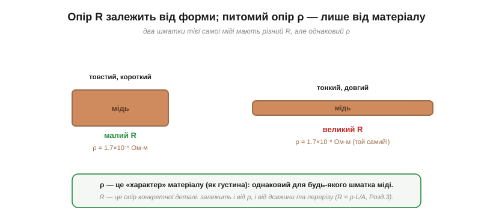
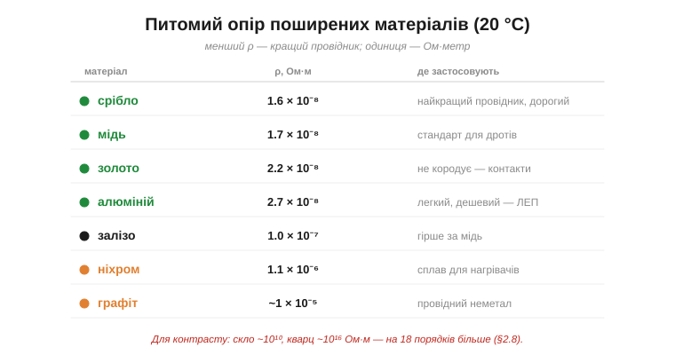
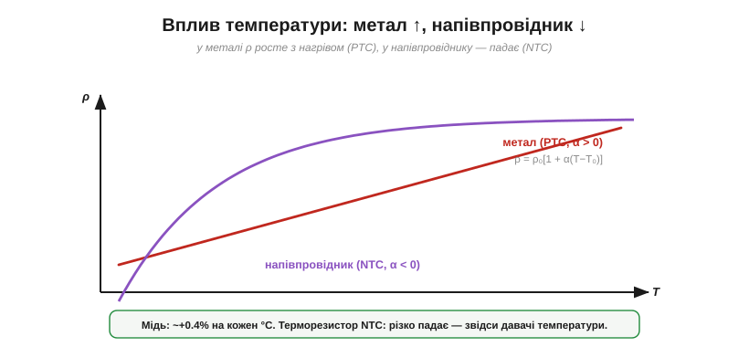
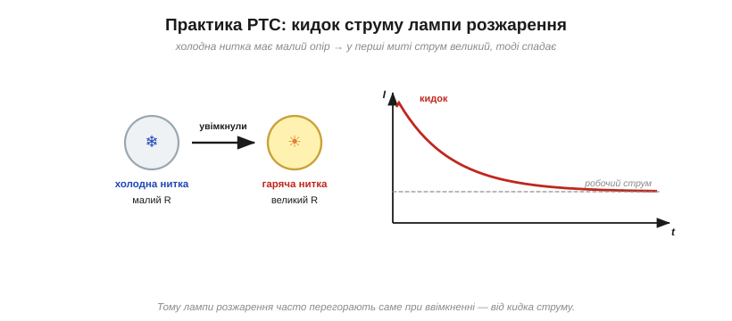

# Провідність як властивість матеріалу і вплив температури

Опір виникає через [зіткнення носіїв із решіткою](topic:ph-condensed/resistance-origin). Та опір **конкретного дроту** залежить і від матеріалу, і від форми (товстий чи тонкий, довгий чи короткий). Щоб порівнювати самі **матеріали**, треба відділити «характер речовини» від «розмірів деталі». Це і робить поняття **питомого опору** — а заразом воно дає число тому, як на провідність впливає **температура**.

### Опір деталі проти питомого опору матеріалу

Розрізняймо дві різні величини. **Опір** (*resistance*, R, в омах) — це властивість **конкретного предмета**: цього дроту, цього резистора. А **питомий опір** (*resistivity*, ρ, в Ом·метрах) — це властивість самого **матеріалу**, незалежна від форми й розміру.


*Два шматки **тієї самої** міді: товстий короткий має малий опір R, тонкий довгий — великий. Але **питомий опір ρ в обох однаковий** — це «характер» міді, як її густина. [Опір деталі R](topic:ph-condensed/resistance) залежить і від ρ, і від геометрії (R = ρ·L/A).*

Аналогія з **густиною** тут точна: густина — властивість речовини (залізо щільніше за дерево незалежно від того, цвях це чи балка), а маса — властивість конкретного предмета (залежить і від матеріалу, і від розміру). Так само ρ характеризує матеріал, а R — деталь. Часто зручніше говорити про обернену величину — **питому провідність** (*conductivity*, σ = 1/ρ, в сименсах на метр): що більша σ, то краще матеріал проводить.

(Для тонких плівок і доріжок на платі в обіг беруть ще проміжну величину — **поверхневий опір** в омах «на квадрат»: він уже враховує товщину плівки, тож опір смужки рахують просто за числом «квадратів» у її довжині. Та це деталь для конкретних задач; основне розрізнення — між матеріальним ρ і деталевим R.)

**Приклад (провідність міді).** Питомий опір міді ρ ≈ 1.7×10⁻⁸ Ом·м. Яка її питома провідність?

```
σ = 1/ρ = 1 / (1.7 × 10⁻⁸) ≈ 5.9 × 10⁷ См/м
```

### Скільки в кого: таблиця матеріалів

Питомий опір — це число, яке шукають у довідниках, добираючи матеріал.


*Срібло й мідь — найкращі звичайні провідники (ρ ≈ 1.6–1.7×10⁻⁸ Ом·м); алюміній трохи гірший, зате легкий і дешевий; ніхром (сплав) має на два порядки більший ρ — саме тому з нього роблять нагрівачі. А скло й кварц — на 18 порядків «гірші», тобто чудові [ізолятори](topic:ph-condensed/conductors-insulators).*

Звідки ці числа беруться? Питомий опір тим менший, чим **більше носіїв** (n) і чим **рідші зіткнення** (довший час τ між ними): грубо ρ ∝ 1/(n·τ). Точніше модель Друде дає **ρ = m/(n·e²·τ)** — у знаменнику стоять і густина носіїв n, і час вільного пробігу τ. Це робить наочною всю картину: більше носіїв або рідші зіткнення — менший опір. Метали виграють завдяки величезному n; найкращі провідники серед них — ще й завдяки великому τ (чиста, гладка решітка). У сплавах (ніхром) чужі атоми частять зіткнення, τ падає — і ρ зростає.

Цікаво, що ρ залежить навіть від **обробки** того самого металу: коли дріт гнуть і клепають, у ньому з'являються дефекти, і ρ трохи росте; а відпал (нагрівання) «загоює» решітку — і ρ знову падає. Тому дроти й контакти іноді спеціально відпалюють, щоб поліпшити провідність.

> 🔧 **Навіщо це.** Звідси інженерний вибір матеріалу провідника. **Мідь** — стандарт (чудовий ρ за помірну ціну). **Срібло** — там, де треба найкраще (ВЧ-контакти), але дороге. **Алюміній** — у ЛЕП і великих шинах: він гірший за мідь, зате втричі легший і дешевший, тож на довгих лініях виграє. **Золото** — для контактів, бо не кородує. А **ніхром/константан** — навпаки, коли потрібен великий опір (нагрівачі, дротяні резистори). Дивлячись на ρ, ви відразу бачите, для чого матеріал годиться.

### Вплив температури: метал нагору, напівпровідник униз

Лишається головне питання: як ρ залежить від температури. І тут два класи матеріалів поводяться **протилежно**.


*У **металі** ρ майже лінійно **росте** з температурою (більше коливань решітки → більше зіткнень) — це додатний температурний коефіцієнт (**PTC**). У **напівпровіднику** ρ **падає** (нагрів додає носіїв) — від'ємний коефіцієнт (**NTC**). Криві йдуть у різні боки.*

Для металів залежність у робочому діапазоні описують простою формулою з **температурним коефіцієнтом** α (*temperature coefficient*):

```
ρ(T) = ρ₀ · [1 + α·(T − T₀)]
```

де ρ₀ — питомий опір за опорної температури T₀. Для міді α ≈ 0.004 на градус — тобто опір росте приблизно на **0.4% на кожен °C**. Те саме стосується й опору самої деталі R (бо R ∝ ρ).

**Приклад (як «розбухає» опір від нагріву).** Мідний провід має опір 10 Ом за 20 °C. Який його опір, коли він нагріється до 80 °C?

```
R(T) = R₀ · [1 + α·(T − T₀)]
R = 10 · [1 + 0.004·(80 − 20)]
R = 10 · [1 + 0.24] = 12.4 Ом
```

Опір зріс на 24% — і це не дрібниця: гарячий провід проводить помітно гірше за холодний.

### PTC і NTC на практиці: давачі й кидки струму

Цей знак коефіцієнта — не абстракція, а робочий інструмент. [**NTC-терморезистори**](topic:hw-sensing/ntc-thermistor) (напівпровідникові, опір різко падає з нагрівом) — найпоширеніші **давачі температури**: міряєш опір — знаєш температуру. А **PTC-елементи** (опір росте з нагрівом) самообмежують струм: нагрілися — підвищили опір — пригасили струм; так працюють самовідновні запобіжники й обмежувачі пускового струму.

А там, де метал поводиться передбачувано, його PTC теж ставлять на службу: **платиновий термоопір** (RTD, як-от Pt100) використовує рівний, добре відомий ріст опору платини, щоб міряти температуру **точно** — у промисловості й лабораторіях. Тож обидва знаки коефіцієнта дали свій тип давача: NTC-термістор — дешевий і чутливий, RTD — точний і стабільний.


*Нитка лампи розжарення холодною має **малий** опір, тож у першу мить після ввімкнення крізь неї б'є великий **кидок струму** (*inrush*). Нитка миттю розжарюється, її опір зростає (метал, PTC) — і струм спадає до робочого. Тому лампи розжарення найчастіше й перегорають саме в мить увімкнення.*

> 🔧 **Навіщо це.** Температурний коефіцієнт треба тримати в голові постійно. У **точних** колах резистори добирають із **малим** tempco (спецсплави на кшталт константану), щоб номінал не «плив» від нагріву. Навпаки, **NTC-термістор** — це готовий копійчаний термометр (у кожному зарядному, термостаті, акумуляторі він стежить за температурою). А **кидок струму** холодних ниток і обмоток ураховують, добираючи запобіжники й ключі: пусковий струм буває в рази більший за робочий, і коло має його витримати.

Варто пам'ятати про одну межу. Усе сказане про ρ і R стосується **постійного** струму. На **високих частотах** з'являється окремий ефект: струм перестає текти рівномірно по перерізу й тісниться до **поверхні** провідника (**скін-ефект**, *skin effect*), через що ефективний опір помітно зростає. Тому для радіочастот важлива не лише площа дроту, а й площа його **поверхні**.

---

Коротко: **опір R** — властивість деталі (залежить від матеріалу й форми), а **питомий опір ρ** (і обернена йому **провідність σ = 1/ρ**) — властивість самого матеріалу, як густина. Менший ρ — кращий провідник: срібло й мідь — чемпіони, ніхром — для нагрівачів. З температурою ρ металів **росте** (PTC, ~0.4%/°C у міді), а напівпровідників — **падає** (NTC); на цьому стоять терморезистори-давачі й ефект пускового кидка струму. Усе це стосувалося металів, де струм несуть електрони; та [струм буває й іонним](topic:ph-electromagnetism/ionic-conduction) — у розчинах, розплавах і навіть у тілі людини.

---
