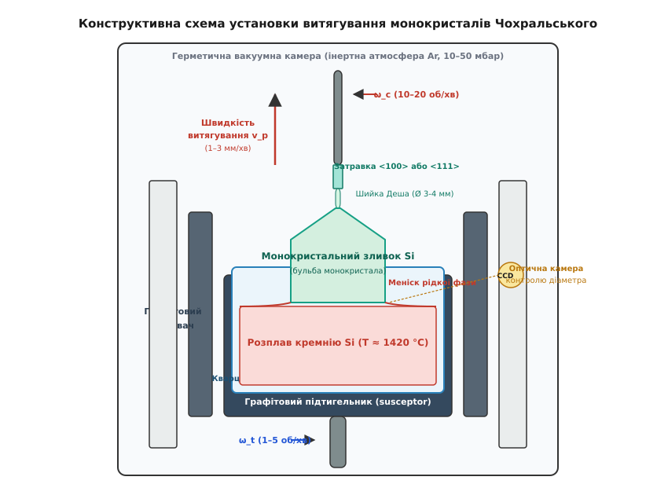
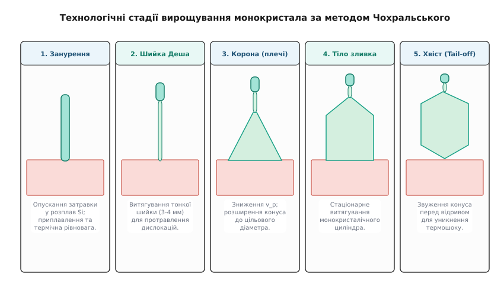
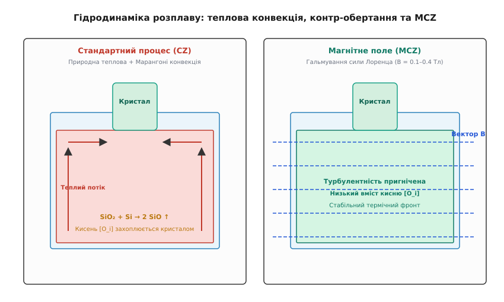

# Метод Чохральського: витягування монокристала з розплаву

<preknowlist>
- [Фазові переходи першого роду](topic:physics/condensed-matter-physics/phase-transitions) — кристалізація, прихована теплота плавлення та термодинамічна рівновага фаз.
- [Кристалічна ґратка](topic:physics/condensed-matter-physics/crystal-lattice) — кубічна структура типу алмазу, кристалографічні напрямки <100> та <111>.
- [Легування напівпровідників](topic:ph-condensed/doping) — введення домішок p- та n-типу, коефіцієнт сегрегації.
- [Зонне очищення кремнію](topic:ph-condensed/zone-refining) — термодинаміка розподілу домішок між рідкою та твердою фазами.
</preknowlist>

Сучасне виготовлення мікропроцесорів із мільярдами транзисторів на один чіп вимагає вихідних кремнієвих пластин стандарту 300 мм із практично ідеальною атомарною впорядкованістю. Якщо в об'ємі кремнієвої пластини товщиною 775 мкм опиниться хоча б одна міжкристалічна межа чи сітка дислокацій, дрейф носіїв заряду в електричних полях інтенсивністю понад `10⁵ В/см` лавиноподібно зірветься: виникнуть струми витоку p-n переходів, локальне перегрівання та миттєвий пробій структури.

Полікристалічний кремній електронної чистоти (чистота 9N–11N), отриманий хімико-металургійним Сименс-процесом, володіє потрібною хімічною чистотою, але складається з безлічі дрібних хаотично орієнтованих кристалітів розміром від кількох мікрометрів до міліметрів. Перетворити цей роздроблений матеріал на суцільний, бездефектний та високооднорідний монокристалічний циліндр вагою понад 300 кг дозволяє метод витягування монокристалів із розплаву — **метод Чохральського** (Czochralski growth process, CZ).

## Фізико-хімічна сутність витягування з розплаву

В основі методу Чохральського лежить керована фазова кристалізація рідкого розплаву речовини на опущеній у нього монокристалічній затравці заданої кристалографічної орієнтації. 

З термодинамічної точки зору, при температурі плавлення чистий кремній перебуває у стані фазової рівноваги, коли вільні енергії Гіббса рідкої `G_L` та твердої `G_S` фаз є рівними (`ΔG = G_S - G_L = 0`). Якщо створити незначне локальне переохолодження рідкої фази біля поверхні затравки (`ΔT = T_m - T < 1 K`), виникає термодинамічна рушійна сила кристалізації:

```
ΔG = L_m · ΔT / T_m
```

де `L_m` — питома прихована теплота плавлення, `T_m = 1420 °C` (1693 K) — температура плавлення кремнію.

Атоми розплавленого кремнію, осаджуючись на орієнтованій поверхні затравки, шикуються у строго визначену кристалічну ґратку зі структурою алмазу (дві вкладені гранецентровані кубічні ґратки, зсунуті на чверть просторової діагоналі). При цьому ростучий монокристал успадковує напрямок кристалографічних осей затравки — найчастіше напрямок `<100>` для кремнію високоінтегрованих КМОН-процесорів або напрямок `<111>` для силових напівпровідникових тиристорів та сонячних елементів.

Атомарний механізм приєднання елементів до ростучої поверхні залежить від кристалографічного напрямку. Площина `{111}` володіє найвищою поверхневою щільністю атомів та найменшою поверхневою енергією, через що її ріст відбувається нормальним шаруватим механізмом шляхом утворення та просування атомарних сходів (граней). Це призводить до появи на бічній поверхні зливка чотирьох або трьох чітких поздовжніх плоских граней росту («пелюсток»). Площина `{100}` виростає без виражених бічних граней, що забезпечує круглашу циліндричну форму зливка.

Процес витягування монокристала є складною самоорганізованою системою, у якій одночасно збалансовані чотири фундаментальні фізичні явища:
1. **Теплоперенос**: відведення прихованої теплоти кристалізації через ростучий твердий кристал та радіаційне випромінювання у вакуумну камеру.
2. **Масоперенос та гідродинаміка**: теплова конвекція розплаву у тиглі, вимушена конвекція від обертання та дифузія домішок біля фронту кристалізації.
3. **Капілярна рівновага**: формування рідкого меніска (грец. *meniskos* — півмісяць) у точці трифазного контакту (розплав-кристал-газ).
4. **Кінетика кристалізації**: вирівнювання поверхневих напружень та витиснення або захоплення домішкових атомів.

## Конструкція печі та підготовка розплаву

Обладнання для витягування монокристалів кремнію за методом Чохральського являє собою високоекранований герметичний вакуумно-термічний реактор.


*Конструктивна схема печі Чохральського: кварцовий тигель у графітовому підтигельнику, розплав кремнію, монокристальний зливок, система контр-обертання та оптична камера контролю діаметра.*

Ключовим вузлом ростової камери є тигель (нім. *Tiegel*), у який завантажується сировина. До матеріалу тигля висуваються надзвичайно жорсткі вимоги: він повинен витримувати температуру понад 1500 °C, володіти високою чистотою та не вступати у хімічні реакції, які б забруднювали розплав шкідливими перехідними металами (залізом, міддю, нікелем, хромом).

У виробництві монокристалічного кремнію використовують **тиглі з високочистого синтетичного кварцу** (`SiO₂`). Синтетичний кварц виготовляється паровізним осадженням із трихлорсилану, що забезпечує вміст важких металів нижче `0.1 ppm`. Оскільки кварцеве скло при температурі 1420 °C розм'якшується і втрачає механічну міцність, кварцовий тигель вставляють у зовнішній чашоподібний графітовий тигелетримач — **сусцептор** (*susceptor*).

Нагрів шихти здійснюється циліндричним графітовим нагрівачем опору або високочастотним індуктором, розташованим коаксіально довкола сусцептора. Нагрівач виготовляється з ізостатично пресованого графіту високої чистоти і розділяється на кілька незалежних секцій по висоті для точного формування вертикального температурного профілю. Термічна зона оточується багатошаровими графітовими тепловими екранами з вуглецевої повсті для створення заданого вертикального та радіального температурних градієнтів.

Процес проводиться у герметичній вакуумній камері з нержавіючої сталі з водяним охолодженням. З камери попередньо відкачується повітря до тиску `10⁻⁴ мбар`, після чого вона безперервно продувається високочистим аргоном (`Ar` чистотою 99.9999 %) при робочому тиску `10–50 мбар`. Продувка аргоном необхідна для відведення леткого монооксиду кремнію `SiO(g)`, який випаровується зі поверхні розплаву і при конденсації на холодних стінках може випадати у вигляді часточок твердого оксиду назад у розплав, спричиняючи дислокаційний збій росту.

Детальні конструктивні параметри та технологічні допуски реактора наведено у вставці [Технологічні параметри та специфікація печі Чохральського](topic:ph-condensed/czochralski-growth/api-czochralski-process-params.md).

## Стадії процесу Чохральського: від затравки до кінцевого конуса

Вирощування монокристалічного зливка кремнію — це неперервний цикл, що триває від 30 до 72 годин і складається з п'яти послідовних технологічних етапів.


*П'ять технологічних стадій процесу Чохральського: занурення затравки, вирощування тонкої шийки Деша, формування корони, стаціонарний ріст тіла зливка та кінцевий відривний хвіст.*

### 1. Плавлення шихти та гомогенізація розплаву
Куски полікристалічного кремнію високої чистоти разом із точним дозуванням легувальної домішки (бор, фосфор, арсен або сурма) завантажуються у кварцовий тигель. Потужність нагрівача плавно піднімається до 150–200 кВт. Після повного розплавлення кремнію при температурі ~1430 °C розплав витримується протягом 2–4 годин для гомогенізації складу, вирівнювання температури та виходу бульбашок розчинених газів.

### 2. Занурення затравки та приплавлення
Монокристалічна затравка — тонкий орієнтований стержень перерізом 7×7 мм або діаметром 10 мм — закріплюється у верхньому штоку витягування. Затравка повільно опускається у ростову камеру. Оскільки температура затравки дорівнює кімнатній, її занурення у розплав з температурою 1420 °C викликає гігантський термічний шок. У зоні контакту виникають механічні напруження, що перевищують межу текучості кремнію, генеруючи густу сітку лінійних дислокацій (зсувів атомарних площин). Для усунення напружень кінчик затравки злегка підплавляють і витримують у розплаві для встановлення термічної рівноваги.

### 3. Вирощування шийки за методом Деша (Dash Necking)
Щоб позбутися дислокацій, розроблено метод **шиї Деша** (*Dash necking*). Швидкість витягування затравки різко підвищують до `4–10 мм/хв`, а потужність нагрівача злегка збільшують. У результаті ростучий кристал звужується до тонкої нитки — шийки діаметром всього `3–4 мм` і довжиною `50–100 мм`.

Фізика дислокаційного очищення за Дешем полягає у тому, що кут ковзання лінійних дислокацій у кубічній ґратці кремнію вздовж площин `{111}` становить близько 54° до осі росту. При високій швидкості витягування швидкість просування фронту кристалізації перевищує швидкість розмноження дислокацій. Усі дислокації, створені термічним шоком, проростають похило і виходять на вільну бічну поверхню тонкої шийки, повністю зникаючи з об'єму. Подальший кристал виростає повністю бездефектним (dislocation-free).

Незважаючи на малий діаметр 3–4 мм, тонка бездефектна шийка кремнію володіє колосальною міцністю на розрив (понад `2 × 10⁸ Па`) завдяки відсутності поверхових дефектів та міжзеренних меж, що дозволяє їй витримувати витягування зливків масою понад 400 кг.

про історію винайдення цього методу та роль Вільяма Деша читайте у вставці [Історія відкриття та розвитку методу Чохральського](topic:ph-condensed/czochralski-growth/hist-czochralski.md).

### 4. Формування корони (плечей конуса)
Після створення бездефектної шийки швидкість витягування плавно знижують до `1.5–2.5 мм/хв`, а температуру розплаву знижують на кілька градусів. Кристал починає розширюватися вбік під кутом 30–60°, утворюючи конусоподібну «корону» або «плечі» (*crown / shoulder*). Розширення триває доти, доки діаметр кристала не досягне цільового значення (наприклад, 305 мм для подальшої механічної обробки на 300 мм пластини).

### 5. Вирощування основного тіла (бульби/зливка)
Коли діаметр досягає цільового значення, автоматична система управління переводить процес у стаціонарний режим росту тіла зливка (*body growth*). Кристал витягується зі сталою швидкістю `0.8–1.2 мм/хв`. Спеціальна оптична камера неперервно вимірює діаметр ростучого циліндра та кут рідкого меніска, корегуючи швидкість витягування та струм нагрівача. Довжина циліндричної частини зливка може досягати 1.5–2.2 метра.

### 6. Формування кінцевого конуса (хвоста/tail-off)
Наприкінці росту, коли у тиглі залишається 10–15 % вихідного розплаву, процес не можна зупинити просто раптовим вийманням зливка. Моментальний відрив кристала від розплаву спричинить термічний удар, від якого хвиля термонапружень пройде вгору по всьому зливку, згенерує мільйони нових дислокацій і повністю зіпсує монокристал. 

Тому швидкість витягування знову підвищують, а температуру піднімають, плавно звужуючи діаметр кристала у конус — **хвіст** (*tail-off*). Тільки коли діаметр кінчика зменшиться до 2–4 мм, кристал плавно відривають від розплаву і повільно охолоджують у ростовій вежі протягом 10–15 годин.

## Гідродинаміка розплаву, контр-обертання та пригнічення конвекції магнітним полем (MCZ)

Рідкий кремній при температурі 1420 °C являє собою металізовану рідину з низькою в'язкістю (близько `0.88 мПа·с`, що порівняно з в'язкістю води) та високою електропровідністю (`σ ≈ 1.2 × 10⁶ См/м`). У великому тиглі об'ємом 100–200 літрів неминуче виникає інтенсивна **природна теплова конвекція**.


*Потоки у розплаві печі Чохральського: ліворуч — турбулентна конвекція у класичному CZ-процесі; праворуч — ламінарна стабілізація та пригнічення потоків у магнітному полі (MCZ).*

Гідродинамічний режим розплаву характеризується високим числом Грасгофа (`Gr > 10⁸`) та числом Релея (`Ra > 10⁷`), що відповідає переходу від ламінарної течії до розвиненої турбулентності. Тепліші й менш щільні шари розплаву біля гарячих бічних стінок тигля піднімаються вгору, рухаються до центру поверхні і, охолоджуючись біля холоднішого ростучого кристала, опускаються вниз у центрі. Одночасно на вільній поверхні розплаву виникає термокапілярна конвекція Марангоні, викликана градієнтом поверхневого натягу (`dγ/dT < 0`).

Турбулентна теплова конвекція спричиняє хаотичні пульсації температури біля фронту кристалізації з амплітудою до `±5–10 K`. Це призводить до періодичного підплавлення та прискореного росту кристала, що створює смугасту неоднорідність розподілу домішок — **смуги росту** (*striations*).

Для пригнічення турбулентності та забезпечення циліндричної симетрії застосовують **контр-обертання**:
- Кристал обертається навколо своєї осі зі швидкістю `ω_c = 10–20 об/хв`.
- Тигель обертається у протилежний бік зі швидкістю `ω_t = 1–5 об/хв`.

Обертання кристала діє як відцентровий насос Бодедекера: воно відкидає розплав під фронтом кристалізації від центру до периферії, створюючи під кристалом локальний висхідний ламінарний потік та формуючи відносно стабільний гідродинамічний дифузійний шар товщиною `δ`. При цьому між зоною вимушеної конвекції під кристалом та зоною природної конвекції біля стінок тигля виникають осередки Тейлора-Проудмана, які ізолюють міжфазну межу від температурних коливань стінок.

У сучасній мікроелектроніці при витягуванні зливків діаметром 300 мм механічного обертання виявляється недостатньо. Для повного контролю гідродинаміки застосовують **метод Чохральського у магнітному полі** — **MCZ** (*Magnetic Czochralski*).

На ростову камеру накладають зовнішнє постійне магнітне поле з індукцією `B = 0.1–0.4 Тл`. Оскільки рідкий кремній є провідником, рух розплаву через лінії магнітного поля зі швидкістю `u` наводить індуковані струми `j = σ · (u × B)`. Взаємодія цього струму з магнітним полем створює **силу Лоренца** `F_L = j × B`, яка прямо протилежна напрямку руху рідини. 

Магнітна в'язкість діє як потужне «повітряне гальмо», пригнічуючи турбулентні пульсації розплаву, роблячи потік строго ламінарним та стабілізуючи температурний фронт росту.

Залежно від геометрії полюсів магнітної системи розрізняють три конфігурації MCZ:
1. **Поперечне поле (H-MCZ)**: силові лінії горизонтальні. Пригнічують меридіональні конвективні комірки, зменшуючи розчинення тигля та знижуючи вміст кисню.
2. **Осьове поле (V-MCZ)**: силові лінії вертикальні. Пригнічують радіальне обертання, покращують азимутальну симетрію, але можуть збільшувати насичення киснем.
3. **Куспідальне поле (C-MCZ)**: зустрічні котушки створюють радіальні лінії біля дзеркала розплаву і нульове поле в центрі, що дає змогу незалежно регулювати концентрацію кисню у вирощуваному зливку.

Програмний алгоритм автоматичного управління швидкостями та температурним контуром наведено у вставці [Симуляція авторегулювання витягування та діаметра бульби](topic:ph-condensed/czochralski-growth/proj-czochralski-pull-control.md).

## Термодинаміка та тепловий баланс на фронті кристалізації

Швидкість витягування монокристала `v_p` не є довільним параметром: вона жорстко обмежена рівнянням збереження енергії на межі поділу фаз `z = z_f`. 

У сталому режимі потік тепла, що відводиться від фронту кристалізації вгору через ростучий твердий кристал `Q_S`, повинен точно дорівнювати сумі тепла, що надходить з перегрітого розплаву `Q_L`, та прихованої теплоти кристалізації `Q_latent`, яка виділяється при замерзанні кремнію:

```
Q_S = Q_L + Q_latent
```

За законом Фур'є теплові потоки виражаються через температурні градієнти:

```
k_S · (dT/dz)_S = k_L · (dT/dz)_L + L_m · ρ_S · v_p
```

де:
- `k_S ≈ 22 Вт/(м·К)` — теплопровідність твердого кремнію при температурі плавлення;
- `k_L ≈ 67 Вт/(м·К)` — теплопровідність рідкого кремнію;
- `(dT/dz)_S` — аксіальний градієнт температури у твердій фазі біля фронту;
- `(dT/dz)_L` — градієнт температури у рідкій фазі біля фронту;
- `L_m = 1.8 × 10⁶ Дж/кг` — питома прихована теплота плавлення кремнію;
- `ρ_S = 2330 кг/м³` — густина твердого кремнію.

Звідси отримуємо вираз для максимальної теоретичної швидкості витягування `v_max`, коли нагрів розплаву зведений до мінімуму `(dT/dz)_L → 0`:

```
v_max = (k_S · (dT/dz)_S) / (L_m · ρ_S)
```

Значення градієнта `(dT/dz)_S` визначається тепловідведенням за рахунок випромінювання з бічної поверхні зливка у вакуумну камеру і є обернено пропорційним квадратному кореню з радіуса кристала `R_c`:

```
(dT/dz)_S ∝ 1 / √(R_c)
```

Це пояснює фундаментальне фізичне обмеження методу Чохральського: **чим більший діаметр монокристала, тим повільніше його доводиться витягувати**. Якщо для тонкої шийки Деша (`Ø 3 мм`) швидкість росту сягає `10 мм/хв`, то для масивного зливка діаметром 300 мм робоча швидкість становить всього `0.8–1.2 мм/хв` (близько 5–7 см на годину).

Особливе значення володіє кривизна фронту кристалізації (межі поділу фаз). Якщо фронт викривлений у бік розплаву (опуклий) або у бік кристала (вгнутий), у вирощуваному зливку виникають додаткові радіальні температурні градієнти `dT/dr`. Ці градієнти викликають нерівномірні термічні розширення, що призводить до виникнення внутрішніх термонапружень. Якщо термонапруження перевищують критичне напруження ковзання `τ_crit` для кремнію при високих температурах, у монокристалі спонтанно виникають точкові та петльові дислокації. Для отримання повністю бездефектних зливків термічну зону печі проектують так, щоб фронт кристалізації залишався практично плоскопаралельним.

Математичний вивід систем диференціальних рівнянь теплового балансу та BPS-моделі наведено у вставці [Термодинаміка, тепловий баланс та кінетика кристалізації](topic:ph-condensed/czochralski-growth/math-czochralski-thermal-kinetics.md).

## Легування та сегрегація домішок при витягуванні

Для створення напівпровідникових пластин із заданим типом провідності (p-тип чи n-тип) та питомим електричним опором у розплав додають дозовану кількість елементарних домішок: бор (`B`) для p-типу, фосфор (`P`), арсен (`As`) або сурму (`Sb`) для n-типу.

Розподіл домішки між ростучим кристалом та розплавом описується **ефективним коефіцієнтом сегрегації** `k_eff = C_S / C_L`. Відповідно до теорії Бартона-Прима-Сліхтера (BPS), `k_eff` залежить від рівноважного коефіцієнта `k_0`, швидкості витягування `v_p` та товщини дифузійного шару `δ`:

```
k_eff = k_0 / [ k_0 + (1 - k_0) · exp(-v_p · δ / D) ]
```

Оскільки для більшості домішок у кремнії `k_0 < 1` (наприклад, для фосфору `k_0 = 0.35`, для сурми `k_0 = 0.023`), ростучий кристал відштовхує домішкові атоми назад у розплав. У результаті під час витягування розплав збагачується домішкою, і концентрація домішки в кристалі вздовж осі росту `z` поступово зростає за законом направленої кристалізації Шеїла:

```
C_S(g) = k_eff · C_0 · (1 - g)^(k_eff - 1)
```

де `C_0` — початкова концентрація домішки у розплаві, `g` — частка закристалізованого матеріалу (`0 ≤ g < 1`).

Для домішок із малим `k_0` (наприклад, сурма `k_0 = 0.023`) це призводить до значного градієнта питомого опору вздовж довжини зливка: початкова частина зливка виходить високоомною, а кінцева — низькоомною. Єдиною домішкою із коефіцієнтом сегрегації, близьким до одиниці, є бор (`k_0 = 0.80`), що робить p-тип кремнію винятково однорідним за електрофізичними параметрами.

При легуванні важколетучими домішками (бор, фосфор) їхня масова частка у розплаві залишається постійною з точністю до витиснення кристалом. При легуванні сурмою чи арсеном виникає додатковий потік втрат через випаровування з вільної поверхні розплаву при робочому тиску аргону `10–50 мбар`. Це вимагає впровадження безперервної дозації домішки у розплав протягом процесу росту (метод безперервної підживлення розплаву, Continuous Czochralski, CCZ).

## Поведінка кисню і вуглецю: розчинення тигля та внутрішнє гетерування

Особливістю кремнієвих зливків Чохральського (CZ-Si), яка відрізняє їх від бестигельного зонного очищення (Float Zone, FZ-Si), є наявність високої концентрації розчиненого кисню.

Джерелом кисню є сам кварцовий тигель `SiO₂`. При температурі 1420 °C рідкий кремній повільно розчиняє внутрішню стінку тигля за хімічною реакцією:

```
SiO₂(твердий тигель) + Si(рідкий розплав) → 2 SiO(газоподібний розчин)
```

Атомарний кисень переходить у розплав, де його концентрація сягає `10¹⁸ атом/см³`. Близько 99 % утвореного монооксиду кремнію `SiO` випаровується з вільної поверхні розплаву і відновиться покроком аргону, але 1–2 % кисню захоплюється ростучим кристалом, займаючи міжвузлові положення `[O_i]` у кристалічній ґратці кремнію.

Типовий вміст міжвузлового кисню у CZ-кремнії становить `(5–9) × 10¹⁷ атом/см³` (близько 10–20 ppm). Поведінка кисню у кремнії має подвійний фізико-технологічний характер:

### Негативний ефект: термодонори
При термічній обробці пластин у діапазоні температур 450–500 °C атоми міжвузлового кисню об'єднуються у дрібні кластери з 3–4 атомів (`SiO₄`), які діють як дрібні **термодонори** електричної провідності. Це небажано змінює питомий опір кремнію n-типу або нейтралізує акцептори у кремнії p-типу. Для розпаду термодонорів пластини піддають відпалу при 650 °C із швидким охолодженням.

### Позитивний ефект: зміцнення ґратки та внутрішнє гетерування
Попри утворення термодонорів, атомарний кисень є незамінним елементом сучасних кремнієвих пластин:
1. **Механічне зміцнення**: Атоми кисню блокують рух дислокацій, роблячи 300 мм пластини стійкими до викривлення при високотемпературних процесах окиснення та дифузії (до 1100 °C).
2. **Внутрішнє гетерування** (*Internal Gettering, IG*): При спеціальному тристадійному термічному відпалі кисень у товщі пластини випадає у вигляді мікроскопічних преципітатів оксиду кремнію `SiO_x`. Ці преципітати створюють мікронапруження, які діють як ефективні пастки («гетери») для важких перехідних металів (`Fe, Cu, Ni, Au`). Метали притягуються до преципітатів у глибині пластини, вимиваючись із тонкого поверхневого приповерхневого робочого шару (denuded zone), де формуються транзистори.

Тристадійний цикл внутрішнього гетерування складається з трьох послідовних відпалів пластин:
- **Стадія 1: Високотемпературний відпал (High Temp, 1100 °C, 2–4 години)**: Кисень активно випаровується з приповерхневого шару товщиною 10–20 мкм. У цій приповерхневій зоні (Denuded Zone, DZ) концентрація кисню падає нижче межі розчинності, утворюючи абсолютно чистий бездефектний кремній для виготовлення транзисторів.
- **Стадія 2: Низькотемпературний відпал (Low Temp, 650–750 °C, 8–16 годин)**: У глибині пластини, де концентрація кисню залишилася високою, починається інтенсивне зародкоутворення преципітатів `SiO_x`.
- **Стадія 3: Середньотемпературний відпал (Medium Temp, 1000 °C, 4–8 годин)**: Преципітати `SiO_x` розростаються до розмірів 100–300 нм, генеруючи довкола себе дислокаційні петлі та упаковувальні дефекти. Ці дефекти ефективно захоплюють атоми важких металів із поверхні під час подальшого виготовлення інтегральних схем.

Другою фоновою домішкою є вуглець `[C_s]` (з елементів графітового нагрівача), концентрацію якого у сучасних печах обмежують на рівні `< 10¹⁵ атом/см³`, оскільки вуглець прискорює небажане преципітування кисню.

Завдяки високому ступеню автоматизації, контролю дислокацій за Дешем, пригніченню конвекції магнітним полем MCZ та керованому вмісту кисню, метод Чохральського забезпечує понад 95 % світового попиту на монокристалічний кремній для сучасної напівпровідникової мікроелектроніки та нанотехнологій.
