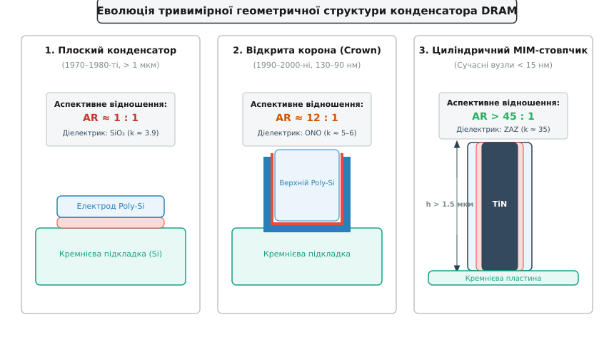
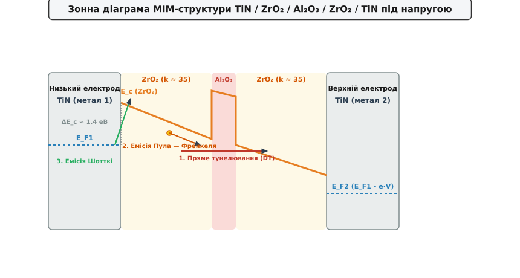

# Масштабування конденсатора DRAM

<preknowlist>
- [Діелектрична проникність](root:ph-electromagnetism/permittivity) — поляризація середовища та послаблення електричного поля у діелектриках.
- [Зонна теорія твердих тіл](root:ph-condensed/band-theory) — заборонена зона, смуга провідності та валентна смуга в ізоляторах і напівпровідниках.
- [Квантове тунелювання](root:ph-quantum/quantum-tunnelling) — проходження мікрочастинки крізь потенціальний бар'єр скінченної ширини.
- [Бар'єр Шотткі](root:ph-condensed/schottky-barrier) — контакт метал–діелектрик, робота виходу та енергетичний бар'єр термоелектронної емісії.
</preknowlist>

У сучасній напівпровідниковій індустрії оперативно запам'ятовуючий пристрій динамічного типу (*Dynamic Random-Access Memory*, DRAM, від грецького `dynamikos` — сильний, рухливий) виступає головним масивом робочої оперативної пам'яті комп'ютерних систем, серверів та мобільних пристроїв. Архітектура кожного елементарного осередку DRAM будується на класичній схемотехнічній концепції 1T-1C: один доступний польовий транзистор (*access transistor*) та один накопичувальний конденсатор (*storage capacitor*). Логічна одиниця («1») відповідає наявності накопиченого електричного заряду `Q` на пластинах конденсатора, а логічний нуль («0») — його відсутності.

Коли топологічні норми літографії масштабуються від мікронних розмірів до декількох нанометрів, площа, відведена під один осередок пам'яті на кремнієвій пластині, зменшується в десятки тисяч разів. Проте фізика зчитування інформації накладає суворе фізичне обмеження: електроємність конденсатора осередку `C_cell` зобов'язана залишатися практично незмінною на рівні **25–30 фемтофарад** (`25 · 10⁻¹⁵ Ф`, фемтофарад — від данського `femten` — п'ятнадцять та прізвища англійського фізика Майкла Фарадея). Це утворення створило одну з найскладніших фізико-технологічних проблем твердотільної мікроелектроніки — **масштабування конденсатора DRAM**.

---

### 1. Фізична природа межі «25 фемтофарад»: чому ємність осередку не масштабується разом із транзистором

У класичній напівпровідниковій літографії масштабування польових транзисторів описується законом Деннарда: зменшення геометричних розмірів у `α` разів зменшує площу транзистора в `α²` разів, одночасно знижуючи споживану потужність та підвищуючи швидкодію. Проте накопичувальний конденсатор DRAM підпорядковується зовсім іншим вимогам термодинаміки, квантової фізики та завадостійкості аналогових систем зчитування.

#### А. Фізика обміну зарядом та поріг чутливості підсилювачів

Зчитування інформації з осередку DRAM є неруйнівним за своєю вихідною метою, але руйнівним за фізичним виконанням. Воно здійснюється шляхом перерозподілу та обміну зарядом (*charge sharing*) між маленькою ємністю осередку `C_cell` та значно більшою паразитною ємністю довгої розрядної шини `C_bitline` (`100–150 fF`), до якої паралельно підключені сотні осередків одного стовпчика.

Перед початком операції зчитування розрядна шина попередньо заряджається до опорного потенціалу `V_DD / 2`. Коли сигнал керування на словесній шині (*wordline*) відкриває доступний транзистор, накопичений заряд з осередку перетікає на розрядну шину. Це викликає малий змік напруги `ΔV_sense` на шині, значення якого обчислюється за фундаментальною формулою зваженої ємності:

```
ΔV_sense = (V_DD / 2) · [ C_cell / (C_cell + C_bitline) ]
```

Для надійного спрацьовування диференціального аналогового підсилювача зчитування (*sense amplifier*) величина `ΔV_sense` повинна перевищувати сумарний рівень внутрішніх теплових шумів кремнієвої підкладки, флікер-шумів транзисторів, розкиду порогових напруг `ΔV_th` та ємнісних перехресних наводок, становлячи щонайменше `100–150 мВ`. Оскільки паразитну ємність шини `C_bitline` важко зменшити нижче `100 fF` через велику довжину металізації та близькість сусідніх провідників, падіння ємності осередку `C_cell` нижче `25 fF` приводить до того, що корисний сигнал `ΔV_sense` повністю тоне в електричних шумах, викликаючи спотворення та масові помилки втрати даних.

Крім того, швидкість наростання сигналу зчитування обмежується постійною часу `τ = R_bitline · C_bitline`. Якщо ємність осередку недостатня, час досягнення стабільного рівня `ΔV_sense` затягується, що призводить до падіння швидкодії всієї шини пам'яті (збільшення латентності зчитування tRCD та tAA).

#### Б. Термодинаміка збереження заряду та час регенерації (Retention Time)

Другий фундаментальний чинник — **час збереження заряду** (*retention time*). Через неминучі струми витоку `I_leak` крізь закритий p-n перехід транзистора, струми міжзонного тунелювання (BTBT), підпороговий виток канала (*subthreshold leakage*), виток, індукований затвором (GIDL), та виток крізь тонкий діелектрик конденсатора накопичений заряд `Q = C_cell · V_DD` постійно витікає.

Для дотримання міжнародного стандарту JEDEC щодо витримування даних протягом `64 мс` (або `32 мс` при підвищеній робочій температурі `85 °C`) ємність осередку повинна утримувати достатню дискретну кількість вільних носіїв заряду:

```
N_electrons = (C_cell · V_DD) / q
N_electrons = (25 · 10⁻¹⁵ Ф · 1.0 В) / (1.602 · 10⁻¹⁹ Кл) ≈ 156 000 електронів
```

Зменшення ємності до `2–3 fF` означало б, що осередок зберігає лише кілька тисяч електронів. У такому разі випадкова квантова флуктуація тунелювання або влучання альфа-частинки космічного випромінювання довільно змінювала б записаний стан біта (викликаючи так звані м'які помилки, *Soft Errors*).

Температурна залежність витоку носіїв у кремнії визначається генерацією електронно-діркових пар у збідненій зоні і описується співвідношенням `I_gen ∝ n_i ∝ T^(3/2) · exp(-E_g / (2 · k_B · T))`. При підвищенні температури від `25 °C` до `95 °C` швидкість витоку зростає в десятки разів. Якщо початковий заряд `Q` занадто малий, період циклічного перезапису (рефрешу tREFI) доведеться скорочувати до мікросекундних інтервалів.

Крім того, втрата заряду загострює уразливість до дифузійних паразитних атак типу **Row Hammer**: активне перемикання сусідніх слівних шин індукує прискорений виток носіїв із закритих осередків через інжекцію гарячих носіїв та перехресне ємнісне наведення, що вимагає втримання ємності на максимально можливому фізичному рівні.

#### В. Геометрична дилема масштабування

З класичної формули плоского конденсатора з площею пластин `A`, товщиною діелектрика `d` та відносною діелектричною проникністю `k` випливає співвідношення:

```
C_cell = (ε₀ · k · A) / d = 25 fF
```

Коли топологічний розмір осередку `F` зменшується від `100 нм` до `10 нм`, доступна горизонтальна площа на кремнієвій пластині падає в 100 разів. Щоб втримати ємність `C_cell` незмінною на рівні `25 fF`, мікроелектроніка змушена була рухатися трьома паралельними напрямками:
1. **Геометрична тривимірність**: збільшення діючої площі `A` за рахунок вертикальних 3D-структур.
2. **High-k діелектрики**: заміна діоксиду кремнію на матеріали з високою діелектричною проникністю.
3. **Металеві електроди MIM**: усунення паразитного збіднення на межі електрода.

> 🔧 **Навіщо це.** Без збереження константи `25 fF` оперативна пам'ять сучасного смартфона чи сервера втрачала б вміст за мікросекунди. Це вимагало б постійного регенераційного перезапису (рефрешу), який заблокував би шину даних і споживав десятки ватів енергії лише на підтримку пам'яті в робочому стані.

---

### 2. Тривимірна геометрія: від плоских осередків до циліндричних стовпчиків із крайнім аспективним відношенням

На зорі напівпровідникової індустрії (1970–1980-ті роки) конденсатор DRAM виконувався у вигляді звичайної горизонтальної планарної пластини над поверхнею підкладки. Проте вже на вузлі `4 мегабіти` (`F ≈ 1 мкм`) плоскій структурі не вистачило площі.

Історичний розвиток тривимірної геометрії пройшов три головні етапи:
- **Глибокі канавки** (*Deep Trench Capacitors*): тралення вузьких вертикальних колодязів у глиб кремнієвої підкладки на глибину до `5–8 мкм`.
- **Стекові корони** (*Crown / Stacked Capacitors*): формування порожнистих тривимірних склянок над поверхнею транзистора.
- **Циліндрични MIM-стовпчики** (*Pillar / Cylinder Capacitors*): нарощування суцільних або циліндричних металевих голок заввишки в кілька мікрометрів.


*Еволюція конструкції та аспективного відношення конденсатора DRAM: від планарної структури до тривимірної корони та сучасного циліндричного MIM-стовпчика.*

Головним геометричним параметром сучасного конденсатора є **аспективне відношення** (*Aspect Ratio*, AR) — відношення висоти стовпчика `h` до його критичного діаметра `D`:

```
AR = h / D
```

Для циліндричного стовпчика бічна поверхня `A_side ≈ π · D · h = π · AR · D²`. Збільшення аспективного відношення дозволяє лінійно нарощувати площу конденсатора при незмінному п'єдесталі на пластині.

#### Послідовність маршруту виготовлення циліндричних MIM-стовпчиків

Технологічний процес виготовлення циліндричного MIM-конденсатора насучасніших вузлах включає наступні прецизійні кроки:
1. **Осадження жертовного матричного оксиду**: осадження товстого шару `SiO₂` (завтовшки `1.5–2.0 мкм`) методом PECVD.
2. **Вбудовування підтримуючих сіток**: формування кількох тонких проміжних шарів нітриду кремнію `Si₃N₄` (*supporter layers*), які слугуватимуть механічними мостиками.
3. **Глибоке реактивно-іонне травлення (HAR DRIE)**: витравлювання глибоких отворів із діаметром `30–35 нм` та витримуванням вертикальності стінок з точністю кращою за `0.05°`.
4. **Атомарно-шарове осадження нижнього електрода (TiN)**: покриття внутрішніх стін циліндра конформним шаром нітриду титану товщиною `3–5 нм`.
5. **ALD-осадження High-k діелектрика (ZAZ)**: нанесення наноламінату `ZrO₂ / Al₂O₃ / ZrO₂` загальною товщиною `4–5 нм`.
6. **ALD-осадження верхнього електрода (TiN)**: заповнення залишкового об'єму циліндра металом.
7. **Селективне видалення жертовної матриці**: видалення оксиду `SiO₂` за допомогою парів HF, що лишає ліс вільних тривимірних стовпчиків, скріплених підтримками `Si₃N₄`.

#### Фізика капілярного зламу та суперкритична сушка

У сучасних топологічних вузлах `1a / 1b нм` (`D ≈ 30–35 нм`) висота стовпчика `h` досягає `1.5–2.0 мкм`. Це відповідає екстремальному аспективному відношенню **AR > 45–50 : 1**.

На цьому масштабі виникає критичне фізико-механічне обмеження: **механічна нестійкість та капілярне злипання** (*Stiction / Structural Collapse*).

Під час мокрого хімічного промивання після видалення жертовного оксиду між сусідніми стовпчиками утворюються рідинні меніски. Сила поверхневого натягу `γ` викликає капілярний перепад тиску, який описується рівнянням Юнга — Лапласа:

```
ΔP = (2 · γ · cos θ) / r
```

де `θ` — кут змочування, `r` — відстань між стовпчиками. Цей тиск створює вигинаючий момент. Якщо вигинаюча сила перевищує межу пружності металевого стовпчика, сусідні стовпчики незворотно злипаються між собою, створюючи короткі замикання.

Для усунення капілярного зламу впроваджують сушку в **суперкритичному флюїді діоксиду вуглецю** (*Supercritical CO₂ Drying*, SCD). Перехід `CO₂` у суперкритичний стан (при тиску `P > 7.38 МПа` та температурі `T > 31.1 °C`) повністю ліквідує межу розділу «рідина-газ», завдяки чому поверхневий натяг падає до нуля (`γ = 0`), запобігаючи руйнуванню 3D-структур.

Детальний опис того, як розгорталася технологічна боротьба між концепціями канавок та коронованих стовпчиків, наведено в [історії переходу на High-k діелектрики та MIM-структури в DRAM](root:ph-condensed/dram-capacitor-scaling/hist-high-k-dram.md).

---

### 3. Фізика High-k діелектриків: заміна ONO на перехідні метали та компроміс з шириною забороненої зони

Незважаючи на нарощування висоти стовпчиків, подальше зменшення діаметра осередку вимагає тоншання ізолюючого шару діелектрика. У класичних мікросхемах використовувався діоксид кремнію `SiO₂` (`k = 3.9`) або тришаровий шар ONO (`SiO₂ / Si₃N₄ / SiO₂`, `k ≈ 5–6`). Проте при товщині `SiO₂` менше `2.0 нм` через діелектрик починає протікати катастрофічний струм прямого квантового тунелювання.

Для розв'язання цієї проблеми впроваджено матеріали з високою діелектричною проникністю — **High-k діелектрики** (*High-permittivity dielectrics*, від англійського `high` — високий та позначення діелектричної проникності літерою `k` або `ε_r`).

Для зручного порівняння High-k матеріалів із діоксидом кремнію введено поняття **еквівалентної товщини оксиду** (*Equivalent Oxide Thickness*, EOT):

```
EOT = d_phys · (k_SiO₂ / k_high_k) = d_phys · (3.9 / k_high_k)
```

Завдяки високому значенням `k_high_k` фізична товщина діелектрика `d_phys` може залишатися відносно великою (наприклад, `5.0 нм`), запобігаючи тунелюванню електронів, тоді як з точки зору електроємності шар поводиться як ультратонкий `SiO₂` з `EOT < 0.5 нм`.

#### Мікроскопічні джерела поляризованості High-k оксидів

Сумарна макроскопічна діелектрична проникність `k` обчислюється через мікроскопічну поляризовуваність атомів `α` за формулою Клаузіуса — Моссотті:

```
(k - 1) / (k + 2) = (1 / (3 · ε₀)) · ∑ N_j · α_j
```

Поляризовуваність складається з трьох компонентів: електронної `α_e`, іонної `α_i` та орієнтаційної `α_d`. У твердих керамічних оксидах перехідних металів (`ZrO₂`, `HfO₂`, `TiO₂`) надвисокі значення `k` зумовлені не електронною зміщенням, а **сильною іонною поляризовуваністю** `α_i`.

Наявність важких катіонів перехідних металів із незаповненими d-орбіталями та м'яких оптичних фононних коливальних мод (*Soft Transverse Optical Phonon Modes*) створює гігантський іонний відгук на зовнішнє електричне поле.

Еволюція діелектричних матеріалів у DRAM проходила через такі ключові сполуки:
- **Пентаоксид танталу (`Ta₂O₅`, `k ≈ 25`)**: застосовувався на вузлах `140–110 нм`.
- **Оксид гафнію (`HfO₂`, `k ≈ 20–25`)** та **Оксид цирконію (`ZrO₂`, `k ≈ 35–40`)**: стали стандартом для вузлів `90–20 нм`.
- **Оксид титану (`TiO₂`, `k ≈ 80–100`)**: перспективний матеріал для суб-10 нм вузлів.

```
Матеріал діелектрика     |  k (проникність)  |  E_g (заборонена зона)  |  ΔE_c (бар'єр до TiN)
-------------------------+-------------------+-------------------------+------------------------
Dioxide silicon (SiO₂)   |       3.9         |         8.9 еВ          |        3.1 еВ
Nitride silicon (Si₃N₄)  |       7.5         |         5.1 еВ          |        2.1 еВ
Hafnium oxide (HfO₂)     |       25.0        |         5.8 еВ          |        1.4 еВ
Zirconium oxide (ZrO₂)   |       35.0        |         5.8 еВ          |        1.4 еВ
Titanium oxide (TiO₂)    |       80.0        |         3.2 еВ          |        0.8 еВ
```

Тут проявляється фундаментальний **фундаментальний компроміс фізики твердого тіла**: у більшості оксидів відносна діелектрична проникність `k` перебуває у зворотній залежності від ширини забороненої зони `E_g` (*bandgap*):

```
E_g ∝ (1 / k)^(2/3)
```

Збільшення діелектричної проникності неминуче приводить до звуження забороненої зони `E_g` та зменшення висоти потенціального бар'єра Шотткі `ΔE_c` на межі з металевим електродом. Це експоненціально підвищує струми витоку.

---

### 4. Квантові механізми тунелювання та струмів витоку: як електрон долає потенціальний бар'єр

Для забезпечення часу збереження заряду `64 мс` густина струму витоку крізь конденсатор DRAM `J_leak` зобов'язана не перевищувати критичного значення **10⁻⁸ А/см²** (або менше `1 фемтоампера` на один осередок) при робочій напрузі `V_DD ≈ 0.8–1.0 В`.

Виток заряду крізь High-k діелектрик визначається трьома основними квантово-механічними та термопольовими механізмами.


*Енергетична зонна діаграма MIM-структури TiN / ZrO₂ / Al₂O₃ / ZrO₂ / TiN під напругою: показано пряме тунелювання (1), емісію Пула — Френкеля крізь ловушки (2) та термоелектронну емісію Шотткі (3).*

1. **Пряме квантове тунелювання** (*Direct Tunneling*, DT): при фізичній товщині `d_phys < 3 нм` хвильова функція електрона проникає крізь усю прямокутну товщину потенціального бар'єра. Густина струму описується наближенням ВЕНК:
   ```
   J_DT ∝ exp[ - (4 · π · d_phys / h) · √(2 · m* · q · ΔE_c) ]
   ```
2. **Тунелювання Фаулера — Нордгейма** (*Fowler–Nordheim Tunneling*, FN): при високих напруженостях поля `E > 3 МВ/см` електрон тунелює крізь трикутну вершину збідненої зони провідності діелектрика.
3. **Об'ємно-обмежена емісія Пула — Френкеля** (*Poole–Frenkel Emission*, PF): є головним джерелом витоку в High-k оксидах при підвищених температурах (`85–105 °C`). Електрони захоплюються дефектами кристалічної ґратки (кисневими вакансіями). Під дією зовнішнього електричного поля `E` потенціальний бар'єр ями дефекту знижується на величину `ΔΦ_PF = √(q³ · E / (π · ε₀ · k_opt))`, що викликає термічне вивільнення електронів у зону провідності:
   ```
   J_PF = C_0 · E · exp[ - (q · Φ_T - q · √( (q · E) / (π · ε₀ · k_opt) )) / (k_B · T) ]
   ```

#### Інженерний прорив: ZAZ-наноламінати

Щоб подолати виток Пула — Френкеля в монолітному `ZrO₂`, у 2008 році було створено гетероструктурний наноламінат **ZAZ** (`ZrO₂ / Al₂O₃ / ZrO₂`).

У цій тришаровій структурі між двома шарами `ZrO₂` (`k ≈ 35`, `E_g = 5.8 еВ`) вставляється надтонкий проміжок оксиду алюмінію `Al₂O₃` товщиною усього **0.4–0.6 нм** (2–3 атомарні шари). Хоча `Al₂O₃` має низьке `k ≈ 9`, його рекордно широка заборонена зона (**E_g = 8.8 еВ**) створює високий внутрішній квантовий спайк `ΔE_c ≈ 2.8 еВ`, який перериває кристалічні межі `ZrO₂` і блокує тунелювання електронів, зберігаючи загальну проникність структури на рівні `k_eff ≈ 30–32`.

Повний математичний апарат розрахунку тунельних струмів витоку наведено у [математичному виведенні еквівалентної товщини оксиду та струмів тунельного витоку](root:ph-condensed/dram-capacitor-scaling/math-tunneling-leakage.md).

---

### 5. Металеві електроди MIM та фазово-індукована кристалізація High-k оксидів

До початку 2000-х років електроди конденсаторів виготовлялися з полікристалічного кремнію (структури PIP або MIS). Проте при прикладанні напруги на межі кремнієвого електрода виникав **ефект збіднення полікремнію** (*Polysilicon Depletion Effect*, PDE).

#### Фізика збіднення та паразитний EOT

Під дією електричного поля в поверхневому шарі полікристалічного кремнію утворювалася збіднена зона носіїв завтовшки `W_dep = √(2 · ε_Si · Φ_s / (q · N_poly))`. Цей шар діяв як паразитний послідовний конденсатор з ємністю `C_dep = (ε_Si · A) / W_dep`, що додавало `0.5–1.0 нм` до загальної еквівалентної товщини оксиду EOT:

```
1 / C_total = 1 / C_high_k + 1 / C_dep
```

Для ліквідації PDE мікроелектроніка перейшла до архітектури **MIM** (*Metal-Insulator-Metal*), де обидва електроди виконуються з металів чи проводячих нітридів із високою густиною електронів на рівні Фермі.

```
Електродний матеріал     |  Тип структури  |  Робота виходу (W_m)  |  Вплив на PDE
-------------------------+-----------------+-----------------------+-------------------------
Poly-Silicon (p+/n+)     |  PIP / MIS      |  4.0 – 5.1 еВ         |  EOT збільшується на +0.8 нм
Titanium Nitride (TiN)   |  MIM            |  4.5 – 4.7 еВ         |  PDE відсутній (0 нм)
Ruthenium (Ru)           |  MIM            |  4.7 – 5.0 еВ         |  PDE відсутній, орієнтація t-фази
```

Застосування нітриду титану `TiN` або рутенію `Ru` осадженого методом атомарно-шарового осадження (ALD) повністю усунуло паразитне збіднення і знизило опір електродів.

#### Інженерія кристалічних фаз: тетрагональна фаза `ZrO₂`

Ще одним відкриттям фізики твердого тіла стала залежність діелектричної проникності `ZrO₂` та `HfO₂` від кристалічної симетрії:
- **Моноклінна фаза** (*m-phase*): низькотемпературна фаза, `k ≈ 18–20`.
- **Тетрагональна фаза** (*t-phase*): високосиметрична фаза, `k ≈ 35–40`.
- **Кубічна фаза** (*c-phase*): `k ≈ 35–45`.

У вільному стані тетрагональна фаза `ZrO₂` існує лише при температурах вище `1100 °C`. Проте вченим вдалося стабілізувати її при кімнатній температурі за рахунок двох ефектів:
1. **Шаблонний ефект підкладки** (*Template effect*): металевий нижній електрод (наприклад, кристалічний `TiN` або `Ru`) під час ALD-осадження створює двовимірні стискаючі напруження, що індукують епітаксійний ріст тетрагональної фази.
2. **Легування нанодомішками**: введення легуючих атомів алюмінію (`Al`), ітрію (`Y`) або лантану (`La`) у концентраціях `1–3%` блокує перехід тетрагональної фази в моноклінну під час швидкого відпалу (*Rapid Thermal Annealing*, RTA при `500–600 °C`).

---

### 6. Практичне моделювання та межі подальшого масштабування: 3D DRAM та сегнетоелектрики

Для оцінки фізичних меж масштабування використовують комплексне чисельне моделювання, яке враховує геометричне аспективне відношення, EOT та квантові струми витоку.

Результати чисельного моделювання для різних топологічних поколінь DRAM наведено у вставці [моделювання параметрів та струмів витоку конденсатора DRAM](root:ph-condensed/dram-capacitor-scaling/proj-dram-cap-sim.md).

#### Межа 10-нанометрового топологічного вузла

При досягненні топологічних норм менше `10 нм` вертикальне масштабування класичного циліндричного MIM-конденсатора досягає абсолютного фізичного тупика:
1. **Механічна межа**: створення стовпчиків з аспективним відношенням `AR > 60 : 1` призводить до їхнього масового руйнування під дією власних внутрішніх напружень.
2. **Квантова межа EOT**: товщина ZAZ-діелектрика менше `3.5 нм` (`EOT < 0.35 нм`) викликає квантовий виток, який неможливо зупинити в рамках класичних діелектриків.

#### Майбутнє: 3D DRAM та сегнетоелектричний HfO₂

Для продовження закону Мура в оперативній пам'яті індустрія розробляє дві концептуально нові фізичні платформи:

1. **Горизонтальна 3D DRAM** (*3D Stacked DRAM*): за аналогією з 3D NAND флеш-пам'яттю, масив осередків розвертають на 90 градусів. Конденсатори та транзистори формуються горизонтально, а нарощування об'єму відбувається шляхом шарування десятків або сотень планарних рівнів один над одним.
2. **Сегнетоелектричний HfO₂ (FeRAM / Ferroelectric DRAM)**: використання сегнетоелектричної орторомбічної фази оксиду гафнію (`o-phase` `HfO₂`), легованого цирконієм або кремнієм. Замість збереження вільного електричного заряду біт інформації кодується **напрямком спонтанної залишкової поляризації** `P_r` кристалічної ґратки.

Крім того, у сегнетоелектриках спостерігається ефект **негативної диференціальної ємності** (*Negative Capacitance*), який дозволяє підсилити поверхневий заряд і подолати класичну межу тунелювання, відкриваючи шлях для масштабування DRAM у наступні десятиліття.
