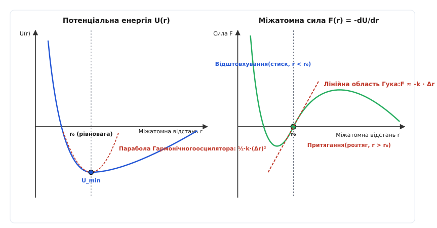
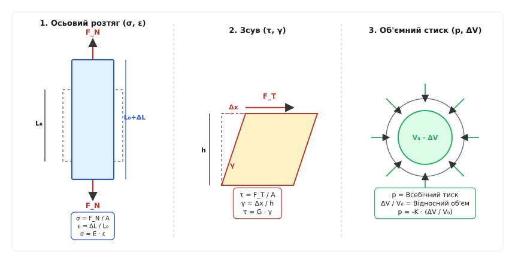
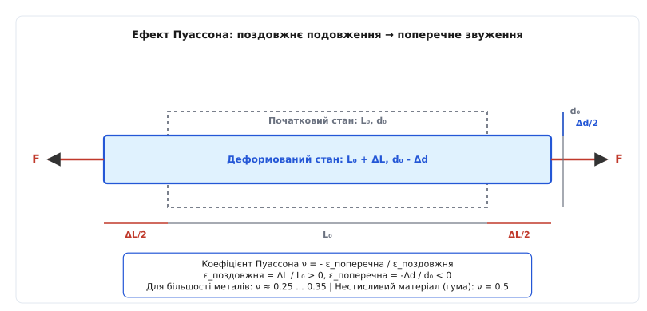
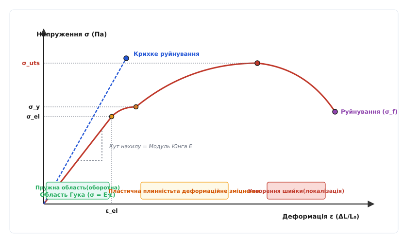

# Пружна деформація і закон Гука

<preknowlist>
- [Другий закон Ньютона](topic:physics/mechanics/newton-laws) — сила викликає зміну імпульсу та прискорення маси.
- [Похідна](topic:math-analysis/derivative) — миттєва швидкість зміни функції та геометричний зміст дотичної.
- [Векторні й матричні операції](topic:math/linear-algebra/matrices) — лінійні перетворення та матричні множення.
</preknowlist>

Коли залізничний потяг масою 3000 тонн в'їжджає на сталевий міст, його опорні сталеві балки під дією розтягувальних зусиль у сотні мегапаскалів видовжуються на кілька сантиметрів, але щойно потяг з'їжджає — конструкція миттєво повертається до свого початкового розміру з точністю до мікрометрів. Без цієї здатності твердих тіл накопичувати механічну енергію та оборотно відновлювати форму будь-який хмарочос, залізнична рейка, годинникова пружина чи мікроелектромеханічний акселерометр у смартфоні після першого ж навантаження зазнали б незворотної деформації або розсипалися б на уламки. 

### 1. Мікроскопічна природа пружності: від міжатомного потенціалу до сили відновлення

Причина, з якої тверде тіло чинить опір зміні форми, криється на міжатомному рівні. Кристалічна ґратка металу чи напівпровідника є рівноважною системою атомних ядер та електронних хмар. Взаємодія між двома сусідніми атомами визначається двома протилежними силами: кулонівським відштовхуванням однойменно заряджених ядер і внутрішніх електронних оболонок на малих відстанях та квантово-механічним притяганням перекритих електронних хмар на більших відстанях.

Потенціальна енергія взаємодії двох атомів `U(r)` як функція відстані між ними `r` має глибокий мінімум у точці рівноважної відстані `r₀` *(лат. aequilibrium — рівновага)*. У цій точці рівнодійна сила взаємодії `F(r) = -dU/dr` дорівнює нулю: атоми перебувають у спокої (якщо не враховувати теплові коливання).

```
U(r)
= U(r₀) + (dU/dr)|r₀ · (r - r₀) + 1/2 · (d²U/dr²)|r₀ · (r - r₀)² + ...   [розклад потенціалу у ряд Тейлора біля r₀]
= U(r₀) + 0 + 1/2 · k · (Δr)²                                            [(dU/dr)|r₀ = 0 у мінімумі потенціалу]
```

Оскільки перша похідна у точці мінімуму `r₀` дорівнює нулю, для малих відхилень `Δr = r - r₀` потенціальна енергія з високою точністю описується квадратичною параболою Гармонічного осцилятора: `U(Δr) ≈ U(r₀) + 1/2 · k · (Δr)²`.

Взявши від'ємну похідну від потенціальної енергії по зміщенню, отримуємо силу, що прагне повернути атоми у стан рівноваги:

```
F(Δr) 
= -dU / d(Δr)                            [визначення сили через градієнт потенціалу]
= -d/d(Δr) [U(r₀) + 1/2 · k · (Δr)²]      [підстановка квадратичного потенціалу]
= -k · Δr                                  [диференціювання: k = (d²U/dr²)|r₀ — жорсткість зв'язку]
```


*Міжатомна потенціальна енергія U(r) та повертальна сила F(r). У точці рівноваги r₀ сила дорівнює нулю. При малих зміщеннях Δr параболічна яма потенціалу породжує строго лінійну повертальну силу F = -k·Δr (закон Гука на атомному рівні).*

З цього мікроскопічного виведення випливають три фундаментальні фізичні висновки:

1. **Лінійність пружності при малих деформаціях.** Поки зміщення атомів `Δr` мале порівняно з міжядерною відстанню `r₀` (`Δr / r₀ < 0.001`), макроскопічна сила відновлення строго лінійна щодо деформації. Це і є фізичний зміст **закону Гука** *(англ. Hooke's law)*.
2. **Асиметрія потенціалу та ангармонізм.** Реальна потенціальна крива `U(r)` асиметрична: при стиску (`r < r₀`) потенціал зростає куди крутіше через сильну кулонівську відштовхувальну силу електронних оболонок, ніж при розтягу (`r > r₀`). Завдяки цьому тверді тіла краще чинять опір стисненню, ніж розтягуванню, а при нагріванні амплітуда коливань зсуває середню відстань між атомами вправо — що пояснює явище теплового розширення.
3. **Модуль пружності як жорсткість зв'язку.** Друга похідна потенціалу `k = (d²U/dr²)|r₀` визначає жорсткість міжатомних зв'язків. У ковалентних кристалах (алмаз, кремній) електронні хмари перекриті сильно, яма потенціалу дуже вузька й глибока, тому `k` колосальне — матеріали мають гігантську жорсткість. У металах із металічним зв'язком потенціальна яма ширша, а у полімерах із вандерваальсовими міжмолекулярними зв'язками — дуже мілка, що дає малі модулі пружності.

### 2. Перехід до інтенсивних величин: напруження та деформація

Проста формула Гука `F = -k · x`, отримана пружинним осцилятором, залежить від геометричних розмірів конкретного тіла: довша сталева дріт витягується сильніше за коротку при тій самій силі, а товстий сталевий стрижень — значно менше за тонкий. Щоб сформулювати закон пружності як фундаментальну властивість **самого матеріалу**, механіка суцільних середовищ переходить від екстенсивних величин (сила `F`, подовження `ΔL`) до інтенсивних (напруження `σ`, відносна деформація `ε`).

#### Осьове нормальне напруження і відносна деформація розтягу

Уявімо однорідний стержень початковою довжиною `L₀` та площею поперечного перерізу `A₀`, до кінців якого прикладено розтягувальні сили `F`.

**Механічне нормальне напруження** *(англ. normal stress)* `σ` *(гр. τάσις — натяг)* визначається як відношення нормальної сили `F` до площі перерізу `A₀`:

```
σ = F / A₀
```

Одиницею вимірювання напруження у системі SI є Паскаль (1 Па = 1 Н/м²). На практиці в конструкційних матеріалах напруження вимірюють у мегапаскалях (1 МПа = 10⁶ Па = 1 Н/мм²) або гігапаскалях (1 ГПа = 10⁹ Па).

**Відносна поздовжня деформація** *(англ. longitudinal strain)* `ε` — це безрозмірна величина, що дорівнює відношенню абсолютного подовження `ΔL = L - L₀` до початкової довжини `L₀`:

```
ε = ΔL / L₀
```

У цих величинах **одновимірний закон Гука** для розтягу/стиску набирає витонченого і компактного вигляду:

```
σ = E · ε
```

Коефіцієнт пропорційності `E` називається **модулем Юнга** *(англ. Young's modulus)* або модулем пружності першого роду. Він вимірюється в паскалях (Па або ГПа) і характеризує здатність матеріалу чинити опір одноосьовому розтягу або стиску. Фізичний зміст модуля Юнга `E` — це гіпотетичне напруження, яке потрібно було б прикласти до стержня, щоб подвоїти його довжину (`ε = 1`), якби матеріал при цьому залишався повністю пружним.

Для порівняння пружних властивостей різних матеріалів наведено типові значення модуля Юнга:
- Алмаз: `E ≈ 1050 ГПа` (найвища жорсткість серед відомих монолітних матеріалів);
- Вуглецеві нанотрубки: `E ≈ 1000 ГПа`;
- Оксид кремнію (кварц): `E ≈ 70 ГПа`;
- Монокристалічний кремній `Si [100]`: `E ≈ 130 ГПа`;
- Конструкційна сталь: `E ≈ 200–210 ГПа`;
- Мідь: `E ≈ 110–120 ГПа`;
- Алюміній: `E ≈ 69–70 ГПа`;
- Гума та еластомери: `E ≈ 0.001–0.05 ГПа`.

#### Зсувна деформація та модуль зсуву

Якщо сила прикладена не перпендикулярно, а паралельно поверхні тіла (як при зсуві книжкового блоку або скручуванні вала), виникає **дотичне напруження** *(англ. shear stress)* `τ`:

```
τ = F_tangential / A₀
```

Під дією дотичного напруження прямокутний елемент об'єму перекошується на кут зсуву `γ` *(англ. shear strain)*, який вимірюється в радіанах: `γ ≈ Δx / h`.

Закон Гука при зсуві виражається через **модуль зсуву** `G` *(англ. shear modulus)*:

```
τ = G · γ
```

Модуль зсуву `G` характеризує опір матеріалу зміні форми без зміни його об'єму. Для більшості металів модуль зсуву становить приблизно `35–40%` від модуля Юнга (`G ≈ 0.38 · E`).

#### Об'ємна деформація та модуль всебічного стиску

При всебічному гідростатичному тиску `p` (наприклад, при зануренні тіла на велику глибину в океан чи у барокамеру) форма тіла зберігається, але його об'єм зменшується від `V₀` до `V₀ - ΔV`.

Відносна об'ємна деформація `θ = ΔV / V₀` пов'язана з тиском `p` через **модуль всебічного стиску** `K` *(англ. bulk modulus)*:

```
p = -K · (ΔV / V₀)
```

Знак "мінус" указує на те, що зростання тиску (`p > 0`) призводить до зменшення об'єму тіла (`ΔV < 0`). Модуль `K` описує опір матеріалу зміні об'єму при збереженні геометричної форми.


*Три фундаментальні режими пружної деформації: 1 — осьовий розтяг (модуль E); 2 — зсув (модуль G); 3 — всебічний об'ємний стиск (модуль K).*

### 3. Ефект Пуассона та зв'язок між пружними константами

Якщо взяти гумовий джгут чи металеву смугу й сильно розтягнути її вздовж, легко помітити, що вона не лише видовжується, а й стає помітно тоншою. Цей феномен називається **ефектом Пуассона** *(англ. Poisson's effect)* на честь французького математика Сімеона Дені Пуассона.

При одноосьовому розтягу у напрямку осі `Z` виникає поздовжня деформація `ε_z = ΔL / L₀ > 0`. Одночасно у поперечних напрямках `X` та `Y` виникає стискальна деформація `ε_x = ε_y = -Δd / d₀ < 0`.

**Коефіцієнт Пуассона** `ν` *(англ. Poisson's ratio)* визначається як відношення поперечної деформації до поздовжньої, взяте з протилежним знаком:

```
ν = - ε_поперечна / ε_поздовжня = - ε_x / ε_z
```

Оскільки при розтягу `ε_z > 0`, а `ε_x < 0`, коефіцієнт Пуассона для звичайних матеріалів є додатною безрозмірною величиною.


*Ефект Пуассона. При поздовжньому розтягу стержня силою F його довжина зростає на ΔL, а поперечний діаметр d₀ зменшується на Δd. Коефіцієнт Пуассона ν дорівнює відношенню відносного звуження до відносного подовження.*

#### Термодинамічні межі коефіцієнта Пуассона

З умов термодинамічної стабільності суцільного середовища (додатна визначеність потенціальної енергії деформації) випливає, що для макроскопічно ізотропного тіла коефіцієнт Пуассона повинен перебувати у суворих межах:

```
-1.0 < ν ≤ 0.5
```

Проаналізуємо граничні значення:

1. **Ідеально нестисливий матеріал (`ν = 0.5`).** Обчислимо відносну зміну об'єму при розтягу:
   ```
   ΔV / V₀ 
   = (1 + ε_z) · (1 + ε_x) · (1 + ε_y) - 1   [відносна зміна тривимірного об'єму]
   ≈ ε_z + ε_x + ε_y                        [нехтуючи добутками малих деформацій вищого порядку]
   = ε_z · (1 - 2·ν)                         [підстановка поперечних деформацій ε_x = ε_y = -ν·ε_z]
   ```
   Якщо `ν = 0.5`, то `1 - 2·ν = 0`, і відносна зміна об'єму `ΔV / V₀ = 0` при будь-якій деформації! Матеріал змінює форму, але взагалі не змінює свого об'єму. До таких матеріалів дуже близько наближаються ненаповнена гума (`ν ≈ 0.4999`), вода та біологічні м'які тканини.
2. **Типові конструкційні метали (`ν ≈ 0.25 ... 0.35`).** Сталь має `ν ≈ 0.30`, алюміній `ν ≈ 0.33`, мідь `ν ≈ 0.34`, титан `ν ≈ 0.32`. При їхньому розтязі об'єм тіла злегка збільшується.
3. **Корок та ніздрюваті матеріали (`ν ≈ 0`).** У корковому дереві `ν ≈ 0`. Коли ви затискаєте корок у шийку винної пляшки, він стискається уздовж, але майже не розширюється вбоки — саме це дозволяє легко закорковувати пляшки без заклинювання.
4. **Ауксетики (`ν < 0`).** Матеріали з від'ємним коефіцієнтом Пуассона називаються **ауксетиками** *(англ. auxetics, від гр. αὔξησις — зростання)*. При розтягуванні уздовж вони **потовщуються** у поперечному напрямку! Таку властивість мають спеціально сконструйовані метаматеріали з шарнірною заломленою комірчастою структурою, деякі полімерні піни та кристалічний α-кварц при певних напрямках розтягу.

#### Зв'язок між пружними модулями ізотропного тіла

Хоча ми ввели чотири пружні характеристики (`E`, `G`, `K`, `ν`), для макроскопічно ізотропного середовища незалежними є лише **дві з них**. Решта двох можуть бути строго виражені через обрану пару:

```
G = E / (2 · (1 + ν))                  [зв'язок модуля зсуву з E та ν]

K = E / (3 · (1 - 2·ν))                 [зв'язок модуля об'ємного стиску з E та ν]
```

Ці рівності мають фундаментальне значення. Наприклад, підставивши `ν = 0.3` для сталі (`E = 200 ГПа`), одразу отримуємо:
`G = 200 / (2 · 1.3) ≈ 76.9 ГПа`, а `K = 200 / (3 · 0.4) = 166.7 ГПа`.

Для глибшого вивчення алгебраїчного зв'язку між параметрами Ляме `λ` і `μ` та побудови тривимірної матриці жорсткості див. [детальний математичний апарат тензора пружності та нотації Фойгта](topic:ph-condensed/elastic-deformation/math-tensor-elasticity.md).

### 4. Повна діаграма деформування: межі закону Гука

Закон Гука `σ = E · ε` є лінійною апроксимацією, яка справджується лише у вузькому діапазоні відносних деформацій (зазвичай `ε < 0.002` або 0.2% для металів). Якщо продовжувати збільшувати механічне навантаження, лінійний зв'язок порушується, і матеріал переходить у якісно нові режими.

Залежність напруження від деформації у всьому діапазоні аж до руйнування графічно зображують у вигляді **діаграми деформування** *(англ. stress-strain curve)*.


*Повна діаграма деформування (σ - ε) пластичного матеріалу (суцільна червона крива) порівняно з крихким (пунктирна синя крива). Вказано область дії закону Гука, границю плинності σ_y, границю міцності σ_uts та точку руйнування.*

На повній діаграмі деформування пластичного матеріалу (наприклад, м'якої сталі) виділяють такі критичні межі та ділянки:

1. **Область пропорційності та границя пропорційності (`σ_p`).** Ділянка від нуля до точки `σ_p`, де залежність між `σ` та `ε` є строго прямолінійною. Тангенс кута нахилу цієї прямої до осі деформацій дорівнює модулю Юнга: `tg α = E`.
2. **Границя пружності (`σ_el`).** Максимальне напруження, до якого деформація залишається повністю **оборотною**. Якщо зняти навантаження при `σ ≤ σ_el`, зразок повністю повертає свої початкові розміри. На мікрорівні при `σ ≤ σ_el` атоми лише зміщуються зі своїх рівноважних позицій у потенціальних ямах, але не перестрибують до сусідніх вузлів.
3. **Границя плинності (`σ_y`, англ. yield strength).** Напруження, за якого в матеріалі починають масово розвиватися **незворотні пластичні деформації**. При `σ > σ_y` напруження майже зупиняється або коливається (площадка плинності), а деформація стрімко зростає. На мікроскопічному рівні це відповідає початку масового ковзання крайових та гвинтових [дислокацій](topic:ph-condensed/resistance-origin) крізь кристалічну ґратку під дією критичного напруження Паєрлса-Набарро. Зняття навантаження після цієї точки залишає **залишкову пластичну деформацію** `ε_p`.
4. **Границя міцності (`σ_uts`, англ. ultimate tensile strength).** Найвище напруження, яке здатний витримати зразок без локального руйнування. За цією точкою у пластичних матеріалах починається процес **локалізації деформації** — утворення "шийки" *(англ. necking)*: поперечний переріз у найслабшому місці стержня починає лавиноподібно зменшуватися.
5. **Точка руйнування (`σ_f`, англ. fracture point).** Момент фізичного розриву зразка.

#### Крихкі проти пластичних матеріалів

Характер діаграми деформування корінним чином відрізняється для двох класів речовин:
- **Пластичні матеріали** (мідь, алюміній, м'яка сталь, свинець) перед руйнуванням зазнають величезних пластичних деформацій (до 20–40% подовження). Вони добре поглинають енергію ударів за рахунок руху дислокацій та розмноження джерел Франка-Рида.
- **Крихкі матеріали** (скло, кераміка, чугун, монокристалічний кремній, алмаз) деформуються строго за законом Гука аж до точки `σ_f`, після чого раптово руйнуються практично без пластичної плинності (`ε_f < 0.1%`). У них дислокації заблоковані високими бар'єрами, і руйнування відбувається шляхом швидкого проростання мікротріщин під дією концентрації напружень за критерієм Гріффіта.

Детальний аналіз хронології та конкуруючих наукових гіпотез першовідкривачів див. у матеріалі [історичний шлях виявлення закону Гука від анаграми 1676 року](topic:ph-condensed/elastic-deformation/hist-hooke-ut-tensio-sic-vis.md).

### 5. Потенціальна енергія пружної деформації та акустичні хвилі

Пружно деформоване тіло накопичує потенціальну енергію. Коли зовнішня сила `F` розтягує стержень на подовження `x`, вона виконує механічну роботу `W`. Оскільки сила `F(x) = k · x` зростає лінійно від `0` до `F_max`, виконана робота дорівнює площі трикутника під графіком залежності `F(x)`:

```
U = ∫₀ˣ F(x') dx'         [визначення механічної роботи розтягу]
  = ∫₀ˣ (k · x') dx'       [підстановка сили Гука: F(x') = k · x']
  = 1/2 · k · x²            [інтегрування лінійної функції x']
  = 1/2 · F · x             [підстановка сили F = k · x]
```

Перейдемо до інтенсивних характеристик. Обчислимо **густину потенціальної енергії пружної деформації** `w = U / V₀` (енергію на одиницю об'єму матеріалу, Дж/м³):

```
w = U / (A₀ · L₀)           [визначення питомої об'ємної енергії]
  = (1/2 · F · ΔL) / (A₀ · L₀)      [підстановка повної пружної роботи U]
  = 1/2 · (F / A₀) · (ΔL / L₀)      [перегрупування множників]
  = 1/2 · σ · ε             [визначення напруження σ = F/A₀ та деформації ε = ΔL/L₀]
```

Підставивши закон Гука `σ = E · ε`, отримуємо два еквівалентні вирази для питомої пружної енергії:

```
w = 1/2 · E · ε²

w = σ² / (2 · E)
```

Ці формули пояснюють фундаментальні інженерні явища:

1. **Накопичувачі механічної енергії.** Енергія, яку може накопичити пружина чи ресора без руйнування, пропорційна `σ_y² / E`. Щоб створити ефективний акумулятор енергії (наприклад, годинникову пружину чи торсіон підвіски), потрібен матеріал із **високою границею плинності `σ_y`** та помірним модулем Юнга. Саме тому загартована пружинна сталь (`σ_y > 1200 МПа`) накопичує у сотні разів більше енергії на кілограм маси, ніж м'яке залізо (`σ_y ≈ 200 МПа`).
2. **Швидкість звуку в твердих тілах.** Пружні деформації поширюються у суцільному середовищі у вигляді акустичних хвиль (фононів). Швидкість поздовжніх пружних хвиль (P-хвиль) `v_p` та поперечних зсувних хвиль (S-хвиль) `v_s` визначаються модулями пружності та густиною матеріалу `ρ`:
   ```
   v_p = √((K + 4/3 · G) / ρ)      [швидкість поздовжніх пружних хвиль]
   v_s = √(G / ρ)                    [швидкість поперечних пружних хвиль]
   ```
   У сталі (`E = 210 ГПа`, `ρ = 7800 кг/м³`) швидкість звуку становить близько `5100 м/с`, а в алмазі сягає рекордних `18 000 м/с`.

Для практичної розробки алгоритмів обчислення напружено-деформованого стану складених конструкцій див. [чисельну модель розрахунку пружного деформування та розподілу напружень](topic:ph-condensed/elastic-deformation/proj-elastic-stress-sim.md).

> 🔧 **Навіщо це.** Закон Гука та ефект Пуассона — це не просто розділ класичного опору матеріалів, а фундаментальний інструмент сучасної мікроелектроніки та нанотехнологій. У сучасних високопродуктивних процесорах (техпроцеси 7 нм, 5 нм і тонше) застосовують так звану **інженерію напружень** *(англ. strain engineering)*. Шляхом вирощування кремнієвого каналу транзистора на підкладці зі сплаву кремнію та германію `Si_1-x Ge_x` (який має більший період кристалічної ґратки) кремнієвий шар зазнає стискальної або розтягувальної пружної деформації `ε ≈ 1–2%`. Цей пружний зсув атомів розщеплює зони провідності й валентні зони, змінює ефективну масу носіїв струму і підвищує рухливість електронів та дірок у 1.5–2 рази без збільшення енергоспоживання! Також на закон Гука спирається робота всіх п'єзорезистивних давачів тиску в автомобілях, медичних тонометрах та аерокосмічних датчиках деформацій.

### 6. Анізотропія пружних властивостей монокристалів

Усі наведені вище вирази з єдиними модулями `E`, `G` та `ν` стосувалися **ізотропних тіл**, чиї властивості однакові у всіх напрямках (полікристалічні метали з хаотичною орієнтацією зерен або скла). Проте монокристали (наприклад, монокристалічний кремній `Si`, кварц `SiO₂`, сапфір `Al₂O₃`) володіють вираженою **пружною анізотропією** *(англ. elastic anisotropy)*.

Внаслідок різної щільності упаковки атомів уздовж різних кристалографічних напрямків жорсткість міжатомних зв'язків різниться:
- У монокристалічному кремнії модуль Юнга вздовж напрямку `[100]` становить `E_[100] ≈ 130 ГПа`;
- Уздовж напрямку діагоналі куба `[111]` модуль Юнга значно вищий: `E_[111] ≈ 188 ГПа`;
- Уздовж напрямку `[110]` значення становить `E_[110] ≈ 169 ГПа`.

У загальному випадку втричі симетричні координатні вектори деформації `ε_ij` та напруження `σ_ij` пов'язані тензором жорсткості четвертого рангу `C_ijkl`, який у нотації Фойгта згортається до симетричної матриці 6x6. Для кубічного кристала (кремній, германій, арсенід галію) замість двох пружних констант потрібні **три незалежні параметри жорсткості**: `C_11`, `C_12` та `C_44`.

Ступінь анізотропії кубічного кристала вимірюють **коефіцієнтом анізотропії Зенера** *(англ. Zener anisotropy ratio)* `A_Z`:

```
A_Z = (2 · C_44) / (C_11 - C_12)
```

Для повністю ізотропного тіла `A_Z = 1`. Для монокристалічного кремнію `A_Z ≈ 1.56`, а для міді `A_Z ≈ 3.2`, що свідчить про сильну залежність механічного відгуку від кристалографічного зрізу пластини. Саме тому при розробці напівпровідникових чипів та MEMS-пристроїв інженери орієнтують кристалічні пластини strictly за оптичними мітками *(срізами / notches)* уздовж визначених осей `[100]` або `[110]`.
