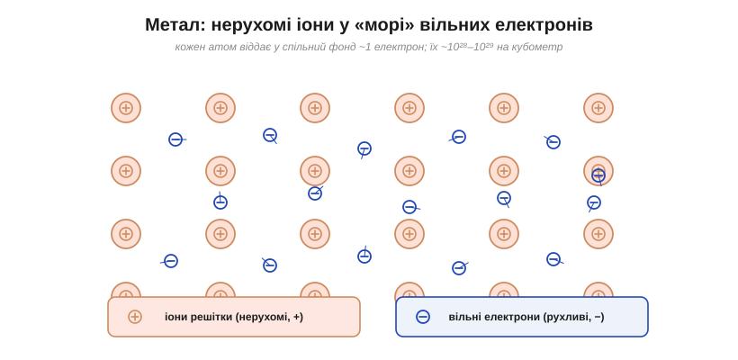
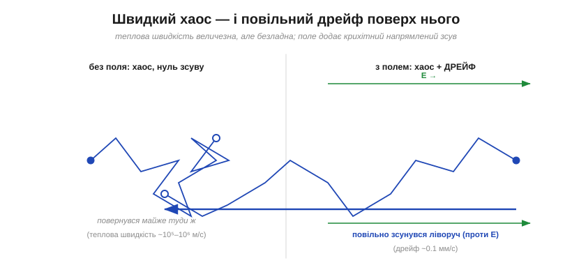
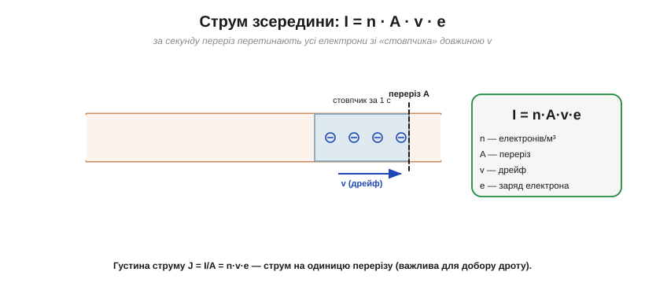
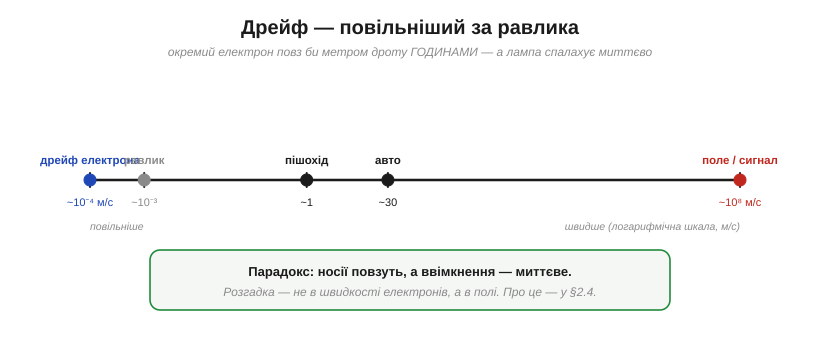

# Що рухається в металі: море електронів і повільний дрейф

Струм — це [потік заряду](topic:ph-electromagnetism/electric-current), а рахуємо його за [умовним напрямком](topic:ph-electromagnetism/current-direction). Та що ж **фізично** відбувається всередині мідного дроту, коли ним «тече струм»? Відповідь напрочуд несподівана, і в ній ховається один із найкрасивіших парадоксів електрики. Зазирнімо в метал.

### Море вільних електронів

Метал улаштований особливо. Його атоми віддають по одному-два зовнішні (валентні) електрони у **спільний фонд** — і ті більше не належать жодному атому конкретно, а вільно блукають по всьому шматку металу. Лишаються нерухомі **додатні іони**, закріплені у вузлах кристалічної решітки, а між ними плещеться **«море» (газ) вільних електронів** — саме та картина, що її ще 1900 року запропонував Пауль Друде.


*У металі важкі додатні іони нерухомо стоять у вузлах решітки, а відірвані від атомів електрони утворюють спільне рухливе «море». Саме ці вільні електрони й переносять струм.*

Чому саме метали так влаштовані? Це наслідок **металевого зв'язку**: у металів зовнішні (валентні) електрони слабко тримаються за свої атоми, тож воліють «усуспільнитися». Цей спільний електронний клей водночас і тримає іони разом, і робить метал блискучим, ковким та — головне для нас — добрим **провідником**. У [діелектриках](topic:ph-condensed/conductors-insulators) (скло, пластик) усе навпаки: там електрони міцно прив'язані до своїх атомів, спільного «моря» немає, і проводити струм нічим.

Цих вільних електронів **неймовірно багато**. Прикиньмо їхню густину для міді.

**Приклад (скільки вільних електронів у міді).** Міркуємо так: у кожному кубометрі — стільки атомів міді, скільки вкладається за її густиною, і кожен дає ~1 вільний електрон.

```
густина міді       ρ = 8960 кг/м³
молярна маса       M = 0.0635 кг/моль
число Авогадро     Nₐ = 6.02 × 10²³ /моль

атомів у м³:  N = ρ/M · Nₐ = (8960 / 0.0635) · 6.02×10²³ ≈ 8.5 × 10²⁸
```

Тобто **n ≈ 8.5 × 10²⁸ вільних електронів на кубічний метр**. Це число завбільшки з кількість піщинок у багатьох пустелях — у крихітному об'ємі дроту. Варто тримати його в голові: саме гігантське *n* робить результат із дрейфовою швидкістю таким разючим.

Тут і криється розгадка, чому метали — добрі провідники: носіїв так багато, що навіть кволий, ледь відчутний дрейф цього моря дає значний струм. Не треба гнати електрони швидко — їх просто **дуже багато**. Це принципово інша ситуація, ніж у напівпровіднику, де вільних носіїв на багато порядків менше, а тому й провідність набагато нижча.

### Швидкий хаос — і повільний дрейф

Тепер найважливіше. Навіть **без** жодного струму ці електрони **не спочивають**: вони шалено снують у всіх напрямках із величезними **тепловими** швидкостями — порядку 10⁵–10⁶ метрів за секунду (сотні кілометрів за секунду!). Звідки ця скажена швидкість? Це просто **теплота**: за будь-якої температури вище абсолютного нуля частинки речовини мають хаотичну кінетичну енергію, і легкі електрони розганяються нею до величезних швидкостей. Але рух цей **безладний**: скільки електронів летить ліворуч, стільки ж праворуч, і в середньому заряд **нікуди не зміщується**. Струму немає.

Прикладімо тепер поле (під'єднавши джерело напруги). Кожен електрон і далі несамовито метається — та поверх хаосу з'являється ледь помітний **спільний знос** усіх електронів в один бік. Цей напрямлений зсув і називають **дрейфом** (*drift*).


*Без поля електрон описує хаотичну ламану й повертається майже туди ж — нульовий зсув. З полем та сама хаотична метушня лишається, але до неї додається повільний **дрейф** проти поля (електрон від'ємний). Саме цей дрейф і є струм.*

Ключова думка: **теплова швидкість величезна, а дрейфова — мізерна**. Хаотичний рух у тисячі разів швидший за напрямлений; дрейф — це лише тонесенький «нахил» у морі бурхливого безладу. Гарна аналогія — натовп у переповненому залі: усі штовхаються туди-сюди швидко й безладно, але весь натовп помалу-помалу суне до виходу.

> 🧮 Наскільки ж мізерна та дрейфова швидкість? Прикиньмо її «на серветці» — і вийде близько 0.06 мм/с, повільніше за равлика: [Оцінки порядків величин](topic:math-numeric/order-of-magnitude-estimation).

### Чому дрейф сталий — і звідки закон Ома

Виникає природне питання: якщо поле весь час штовхає електрон, чому той не розганяється **дедалі швидше**? Бо його раз у раз **збивають зіткнення**. Між двома зіткненнями з іонами решітки електрон трохи прискорюється полем у потрібний бік — а тоді, налетівши на іон, втрачає набуту напрямлену швидкість і відлітає навмання. Далі все повторюється: коротенький розгін — зіткнення — скидання. Усередненим підсумком цих незліченних циклів і є **стала** дрейфова швидкість: розгін якраз урівноважує гальмування зіткненнями.

Звідси випливає й щось глибше. Що сильніше поле — то більший розгін між зіткненнями, а отже, і більша дрейфова швидкість: **v пропорційна E** (а поле, своєю чергою, напрузі). А раз струм I = n·A·v·e пропорційний *v*, то він пропорційний і напрузі — і це не що інше, як **закон Ома** (I ∝ V) у його мікроскопічному корінні. Закон, який Ом здобув суто з дослідів, тут постає сам собою з простої картинки «розгін — зіткнення». А самі зіткнення, що обмежують дрейф, — це і є фізична [природа **опору**](topic:ph-condensed/resistance-origin).

### Струм зсередини: I = n·A·v·e

Зв'яжімо мікроскопічну картину з макроскопічним [струмом](topic:ph-electromagnetism/electric-current). За секунду через переріз дроту проходять усі електрони, що встигли до нього додрейфувати, — а це всі, хто був у «стовпчику» завдовжки в одну дрейфову швидкість *v*. Звідси струм:

```
I = n · A · v · e
```


*За секунду переріз A перетинають усі електрони зі «стовпчика» довжиною v (дрейфова швидкість). Тож струм I = n·A·v·e: густина носіїв × переріз × швидкість дрейфу × заряд. Поділивши на переріз, дістаємо **густину струму** J = I/A = n·v·e.*

Ця формула — місток між «що рухається» і «скільки тече». А тепер скористаймося нею, щоб виміряти ту саму дрейфову швидкість — і отримаємо приголомшливе число.

**Приклад (наскільки повільний дрейф).** Мідний дріт перерізом A = 1 мм² несе струм I = 1 А. Знайдімо швидкість дрейфу:

```
v = I / (n · A · e)
v = 1 / (8.5×10²⁸ · 1×10⁻⁶ · 1.602×10⁻¹⁹)
v ≈ 7.4 × 10⁻⁵ м/с ≈ 0.07 мм/с
```

Сім сотих міліметра за секунду — **повільніше за равлика**. Щоб подолати один метр такого дроту, окремому електронові знадобилося б:

```
t = 1 м / (7.4×10⁻⁵ м/с) ≈ 13500 с ≈ 3.7 години
```

**Приклад (густина струму).** Для того самого дроту (1 А у перерізі 1 мм²):

```
J = I / A = 1 А / (1×10⁻⁶ м²) = 1×10⁶ А/м² = 1 А/мм²
```

Це помірне навантаження: мідь зазвичай витримує кілька ампер на квадратний міліметр тривало, перш ніж перегрітися.

### Майже непорушні носії — і миттєва лампа


*Дрейф (~10⁻⁴ м/с) на логарифмічній шкалі швидкостей лежить нижче за равлика, тоді як «сигнал» (поле) поширюється дротом зі швидкістю ~10⁸ м/с. Окремий електрон повз би годинами — а лампа спалахує миттєво.*

І ось він, парадокс, заради якого все це рахувалося. Якщо електрони повзуть **годинами** на метр, то чому лампа спалахує **тієї ж миті**, щойно клацнеш вмикачем за кілька метрів від неї? Невже сигнал чекає, доки якийсь електрон добіжить? Звісно, ні. Розгадка не в швидкості електронів узагалі, а в тому, [як швидко поширюється сигнал](topic:ph-electromagnetism/signal-speed) у дроті.

Варто одразу відкинути хибні здогади. Ні, електрони не «прискорюються до світлової швидкості», коли вмикаєш живлення. Ні, перший електрон не «пробігає весь дріт» до лампи. І ні — річ не зовсім у тім, що «дріт уже повний електронів», хоча це вже ближче до правди. Точне число — дрейф ~0.07 мм/с — лишається мізерним, а сигнал попри нього долітає майже миттєво.

> 🔧 **Навіщо це.** Величина J = I/A (**густина струму**, А/мм²) — щоденний інструмент проєктувальника. Саме вона, а не сам струм, вирішує, чи перегріється провідник: тонка доріжка на платі з великим струмом має високу J і гріється, товста жила з тим самим струмом — низьку J і лишається холодною. Тому переріз дротів і ширину доріжок добирають під допустиму густину струму (типово одиниці А/мм²). А за надмірної J у мікросхемах виникає навіть **електроміграція** — струм буквально «зносить» атоми металу, руйнуючи провідник.

---

До слова, у [**змінному** струмі](topic:ph-electromagnetism/dc-vs-ac) спрямований дрейф **не накопичується**: електрони лише **тремтять** туди-сюди на місці, бо поле раз у раз міняє напрямок. Дрейф є щомиті, але щопівперіоду розвертається, тож **у середньому за період** жоден електрон нікуди не йде — а енергія все одно передається й лампа світить. Це ще один натяк: переносить енергію не марш електронів, а **поле**, що їх гойдає.

Отже, струм у металі — це **дрейф** електронів зі спільного «моря» вільних зарядів серед нерухомих іонів. Теплова метушня електронів величезна (~10⁵ м/с) і безладна, а напрямлений дрейф — мізерний (~0.1 мм/с); струм зв'язаний із ним формулою I = n·A·v·e. Через гігантську густину носіїв *n* навіть такий повільний дрейф дає відчутний струм — і саме тому лампа спалахує миттєво, хоча самі електрони ледь повзуть.

---
