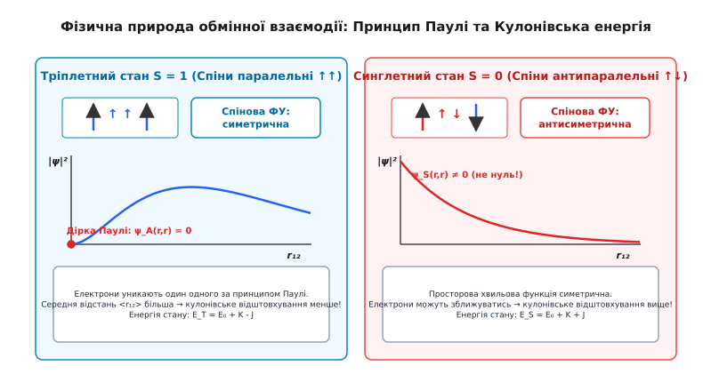
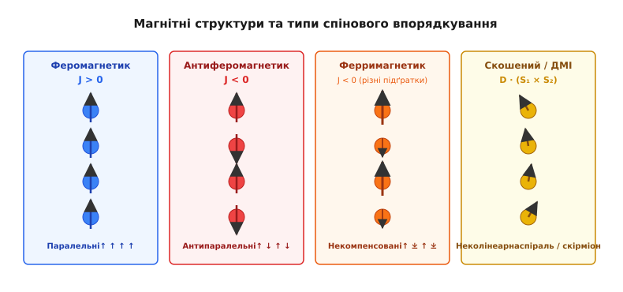
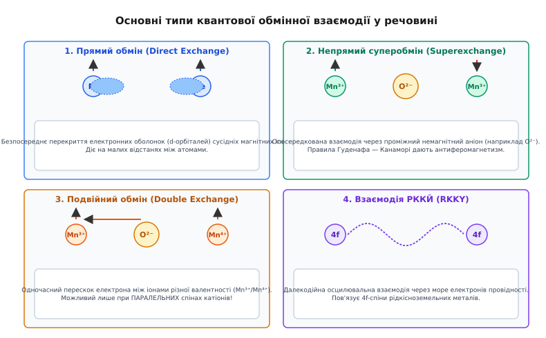
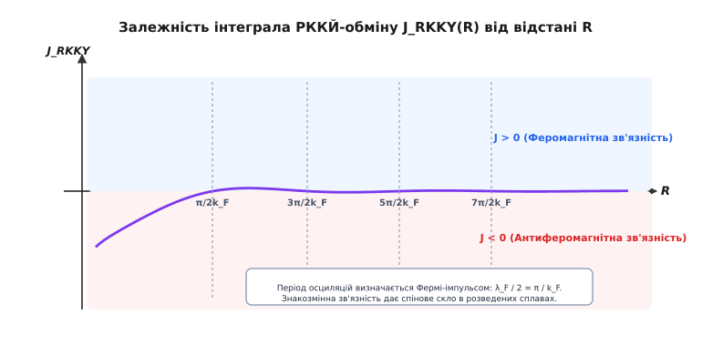

# Обмінна взаємодія

<preknowlist>
- [Спін електрона](root:ph-quantum/electron-spin) — власний квантовий момент електрона та його магнітний момент.
- [Принцип заборони Паулі](root:ph-quantum/pauli-exclusion) — фундаментальна антисиметричність хвильової функції ферміонів при перестановці.
- [Магнітні домени](root:ph-condensed/magnetic-domains) — макроскопічні області самочинного намагнічування у феромагнетиках.
- [Точка Кюрі](root:ph-condensed/curie-temperature) — критична температура фазового переходу з феромагнітного у парамагнітний стан.
</preknowlist>

Звичайний залізний цвях утримує впорядковане намагнічування за кімнатної температури й розмагнічується лише при нагріванні вище 1043 K (770 °C). З погляду класичної електродинаміки це здається абсолютним нонсенсом. Магнітні моменти двох сусідніх атомів заліза, розташованих на атомній відстані близько 0.25 нанометра, взаємодіють між собою як звичайні магнітні диполі. Якщо обчислити енергію такої класичної магнітної взаємодії, вона виявиться крихітною — близько `10⁻⁴` електронвольт. Теплове дрижання атомів за кімнатної температури має енергію `k_B · T ≈ 0.025` електронвольт, що у 250 разів перевищує магнітні дипольні сили. Класичний [феромагнетизм](root:ph-condensed/ferromagnetism) мав би повністю розпадатися від теплового хаосу вже при температурі 1 Кельвін.

Ба більше, фундаментальна теорема Бора — ван Левен стверджує, що у строго класичній статистичній механіці рівноважна намагніченість будь-якої системи зарядів завжди дорівнює нулю. Класична фізика принципово не здатна пояснити існування постійних магнітів.

Щоб пояснити, чому залізо лишається магнітом при тисячі градусів, потрібна взаємодія з енергією близько 0.1–1 електронвольт на атомний зв'язок. Тобто реальна сила, яка вишиковує спіни атомів паралельно, у тисячі разів потужніша за будь-які магнітні дипольні сили. Відповідь дає квантова механіка: ця велетенська сила взагалі не є магнітною. Вона має суто **електростатичну** природу й виникає через поєднання Кулонівського відштовхування електронів та принципу заборони Паулі. Вона називається **обмінною взаємодією** (*exchange interaction*).

Детальний перебіг наукових суперечок та внесок Вернера Гейзенберга, Поля Дірака і Якова Френкеля розкрито у вставці [📜 Історія відкриття обмінної взаємодії](root:ph-condensed/exchange-interaction/hist-heisenberg-dirac.md).

### Квантовомеханічна природа: Паулі плюс Кулон

Уявімо найпростішу систему з двох електронів, кожен з яких належить своєму атому (наприклад, у молекулі водню або між двома сусідніми іонами заліза у кристалічній ґратці). Електрони — це тотожні ферміони зі спіном `1/2`. Повна хвильова функція системи двох електронів `Ψ(1, 2)` мусить бути строго антисиметричною щодо перестановки їхніх координат і спінів за принципом Паулі:

```
Ψ(2, 1) = -Ψ(1, 2)
```

Повну хвильову функцію можна представити як добуток просторової частини `ψ(r₁, r₂)` (яка описує положення електронів у просторі) та спінової частини `χ(s₁, s₂)` (яка описує напрями їхніх спінів):

- **Тріплетний стан (`S = 1`, спіни паралельні `↑↑`):** Спінова хвильова функція `χ_T` є симетричною. Щоб повний добуток був антисиметричним, просторова хвильова функція `ψ_A(r₁, r₂)` мусить бути **антисиметричною**: `ψ_A(r₁, r₂) = -ψ_A(r₂, r₁)`.
- **Синглетний стан (`S = 0`, спіни антипаралельні `↑↓`):** Спінова хвильова функція `χ_S` є антисиметричною. Отже, просторова хвильова функція `ψ_S(r₁, r₂)` мусить бути **симетричною**: `ψ_S(r₁, r₂) = ψ_S(r₂, r₁)`.

Властивість антисиметричної просторової функції `ψ_A(r₁, r₂)` полягає в тому, що коли два електрони намагаються опинитися в одній і тій самій точці простору (`r₁ = r₂`), вона дорівнює строго нулю:

```
ψ_A(r, r) = -ψ_A(r, r)  ⇒  ψ_A(r, r) = 0
```

Це явище називають **ферміоновою діркою Паулі** (*Pauli exclusion hole*). При паралельних спінах електрони квантовомеханічно ухиляються один від одного в просторі, їхня середня відстань `<r₁₂>` зростає, а отже, **Кулонівське електростатичне відштовхування між ними зменшується**.

Натомість при антипаралельних спінах (симетрична просторова функція `ψ_S`) електрони можуть перебувати поруч у просторі (`ψ_S(r, r) ≠ 0`), середня відстань між ними менша, і Кулонівське відштовхування вище.


*Природа обмінного ефекту. У триплетному стані (ліворуч, спіни паралельні) антисиметрія просторової хвильової функції обнуляє ймовірність знаходження електронів в одній точці (дірка Паулі), що знижує кулонівське відштовхування. У синглетному стані (праворуч, спіни антипаралельні) електрони зближуються частіше, що підвищує кулонівську енергію.*

Отже, хоча електричні сили Кулона взагалі не залежать від спіну, вимога симетрії Паулі створює жорсткий зв'язок між орієнтацією спінів та середовищною електростатичною енергією. Енергетична різниця між триплетним та синглетним станами дорівнює подвоєній величині так званого **обмінного інтеграла** `J`:

```
E_triplet - E_singlet = -2 · J
```

де `J` обчислюється через просторове перекриття хвильових функцій двох електронів та потенціал Кулона:

```
J = ∬ φ_A*(r₁) · φ_B*(r₂) · [e² / (4π·ε₀·|r₁ - r₂|)] · φ_A(r₂) · φ_B(r₁) d³r₁ d³r₂
```

Обмінний інтеграл `J` виражає енергію електростатичного перекриття електронних хмар. Саме ця енергія (яка становить десяті частки електронвольта) і діє як гігантська ефективна сила, що впорядковує спіни в кристалі.

Математичні деталі квантового виведення Гайтлера — Лондона та матричні проєкції наведено у вставці [🧮 Квантовомеханічне виведення обмінного інтеграла](root:ph-condensed/exchange-interaction/math-exchange-derivation.md).

### Спіновий гамільтоніан Гейзенберга

Оскільки електростатичні стани прив'язані до спінової симетрії, Поль Дірак і Вернер Гейзенберг показали, що повну кулонівську енергію взаємодіючих електронів можна записати в суто спінових операторах. Для пари спінів `S₁` та `S₂` оператор обмінної енергії набирає вигляду:

```
Ĥ_ex = -2 · J · (Ŝ₁ · Ŝ₂)
```

Для макроскопічного кристала, де кожен іон у вузлі ґратки має спіновий оператор `S_i`, загальний **спіновий гамільтоніан Гейзенберга** записується як сума по всіх парах сусідніх атомів:

```
Ĥ_Heisenberg = -2 · ∑_(⟨i,j⟩) J_ij · (Ŝ_i · Ŝ_j)
```

Знак обмінного інтеграла `J_ij` є вирішальним для всієї магнітної структури речовини:

1. **`J > 0` (Феромагнітний обмін):** Скалярний добуток `S_i · S_j` досягає максимуму, коли спіни паралельні. Енергія мінімальна при сумісній паралельній орієнтації `↑↑↑↑`. Матеріал стає [феромагнетиком](root:ph-condensed/ferromagnetism) (залізо, нікель, кобальт).
2. **`J < 0` (Антиферомагнітний обмін):** Енергія мінімальна, коли скалярний добуток від'ємний, тобто сусідні спіни напрямлені протилежно `↑↓↑↓`. Матеріал стає антиферомагнетиком (оксид марганцю `MnO`, оксид нікелю `NiO`).
3. **Ферримагнетизм (некомпенсований антиферомагнетизм):** Якщо в кристалі є дві нееквівалентні підґратки з різними за величиною спінами `|S_A| ≠ |S_B|` при `J < 0`, підсумкова намагніченість не дорівнює нулю. Такі матеріали називають ферримагнетиками або ферритами (наприклад, магнетит `Fe₃O₄`, ітрій-залізистий гранат `YIG`).


*Класичні магнітні структури залежно від знака обмінного інтеграла J та симетрії кристала. При J > 0 утворюється феромагнетик, при J < 0 — антиферомагнетик або ферримагнетик (якщо підґратки нерівні). Анізотропний обмін Дзялошинського — Морія згортає спіни у спіраль або скірміон.*

Залежно від анізотропії кристала спіновий гамільтоніан може приймати граничні спрощені форми, які мають величезне значення для математичної фізики:
- **Модель Ізінга (`Ising model`):** Враховується лише одна проекція спінів `H = -2J ∑ S_i^z · S_j^z`. Описує сильні двовимірні магнітні шари.
- **Модель XY (планарна модель):** Враховуються лише двовимірні компоненти `H = -2J ∑ (S_i^x · S_j^x + S_i^y · S_j^y)`. Демонструє фазовий перехід Березинського — Костерліца — Таулеса (BKT).

> 🔧 **Навіщо це.** Спіновий гамільтоніан Гейзенберга дозволяє розраховувати магнітні властивості матеріалів без необхідності розв'язувати гігантське багатоелектронне рівняння Шредінгера. На цій моделі тримається чисельне моделювання магнітних носіїв пам'яті, розрахунок спінових хвиль у магніці і проектування постійних магнітів для електромоторів.

Чисельну реалізацію Монте-Карло симуляції Гейзенберга на мовах C, C++, Python та TypeScript наведено у вставці [⚙️ Моделювання спінової системи Гейзенберга](root:ph-condensed/exchange-interaction/proj-heisenberg-model.md).

### Різновиди обмінної взаємодії у речовині

Пряме перекриття електронних хмар d-орбіталей сусідніх іонів (так званий **прямий обмін**) трапляється відносно рідко, оскільки d-оболонки перехідних металів є компактними й сильно локалізованими біля своїх ядер. У реальних конденсаторах, кристалах та сплавах природа реалізує п'ять основних різновидів обмінного зв'язку.


*Схематичний опис п'яти основних механізмів обміну: 1. Прямий обмін d-орбіталей; 2. Непрямий суперобмін через аніон O²⁻; 3. Подвійний обмін із переносом електрона між Mn³⁺ та Mn⁴⁺; 4. Осцилювальний обмін РККЙ через море електронів провідності.*

#### 1. Прямий обмін (Direct Exchange) та Крива Слейтера — Гейзенберга
Виникає при безпосередньому перекритті електронних оболонок сусідніх магнітних атомів. Працює у металевому залізі, кобальті та нікелі. Діє лише на дуже малих відстанях між атомами. Якщо відстань між атомами збільшується, перекриття зникає експоненційно.

Залежність знака обмінного інтеграла прямого обміну від міжатомної відстані описується кривою **Слейтера — Гейзенберга** (*Bethe-Slater curve*). У 3d-металах радіус незаповненої d-оболонки `r_3d` порівнюється з радіусом кристалічної ґратки `a`:
- Для заліза (`Fe`), кобальту (`Co`) та нікелю (`Ni`) відношення `a / r_3d > 1.5` (для заліза близько 1.63, кобальту 1.64, нікелю 1.82). Перекриття d-орбіталей помірне, і потенціальний обмін переважає (`J > 0`, феромагнетизм).
- Для марганцю (`Mn`, відношення 1.47) та хрому (`Cr`, відношення 1.20) атоми знаходяться ближче один до одного щодо розміру d-оболонки (`a / r_3d < 1.5`). Перекриття орбіталей занадто велике, що створює сильно нестійке кінетичне відштовхування (`J < 0`, антиферомагнетизм).

Яскравим підтвердженням кривої Слейтера — Гейзенберга є сплави Гейслера (наприклад, `Cu₂MnAl` або `MnBi`). Чистий марганець є антиферомагнетиком, але якщо розсунути його атоми у кристалічній ґратці за допомогою немагнітних атомів міді чи алюмінію, відношення `a / r_3d` перетинає критичний поріг `1.5`, і марганець перетворюється на сильний феромагнетик.

#### 2. Непрямий суперобмін (Superexchange) та Правила Гуденафа — Канаморі
У магнітних діелектриках (наприклад, оксидах та галогенідах перехідних металів `MnO`, `NiO`, `FeO`, `Fe₂O₃`) магнітні катіони `Mn²⁺` відокремлені немагнітними аніонами кисню `O²⁻`. Пряме перекриття d-орбіталей марганцю неможливе, бо між ними стоїть негативно заряджений іон кисню.

Обмін реалізується через віртуальні перескоки електронів за участю заповненої p-орбіталі аніона кисню. Електрон з p-орбіталі кисню віртуально переходить на незаповнену d-орбіталь катіона металу.

Знак і величина суперобміну описуються **правилами Гуденафа — Канаморі — Андерсона** (*Goodenough-Kanamori-Anderson rules*):
- Якщо геометрія зв'язку `M-O-M` становить `180°` (лінійний зв'язок), одна й та сама p-орбітальна петля кисню перекривається з d-орбіталями двох сусідніх катіонів. Антисиметрія спінів електронів на p-орбіталі вимагає, щоб спіни двох катіонів металу орієнтувалися строго антипаралельно. Це створює сильний **антиферомагнітний** обмін (`J < 0`).
- Якщо кут зв'язку `M-O-M` близький до `90°`, перекриття відбувається з двома різними ортогональними p-орбіталями кисню (`p_x` та `p_y`). За внутрішньоатомним правилом Гунда спіни на ортогональних p-орбіталях паралельні, що дає слабкий **феромагнітний** обмін (`J > 0`).

#### 3. Подвійний обмін (Double Exchange)
Спостерігається у змішано-валентних оксидах марганцю (манганітах зі структурою перовськіту, наприклад `La_(1-x)Sr_xMnO₃`), де в єдиній ґратці одночасно співіснують іони `Mn³⁺` (конфігурація `t₂g³ e_g¹`, спін `S = 2`) та `Mn⁴⁺` (конфігурація `t₂g³ e_g⁰`, спін `S = 3/2`).

У цій системі електрон з `e_g`-орбіталі іона `Mn³⁺` може вільно перескочити через аніон кисню на порожню `e_g`-орбіталь сусіднього іона `Mn⁴⁺`. Проте за квантовомеханічним правилом Гунда спін електрона під час перескоку не повинен змінювати свого напрямку щодо локального спіна ядра `t₂g`. Перескок електрона відбувається без перешкод лише тоді, коли локальні спіни обох іонів марганцю **напрямлені паралельно**.

Амплітуда перескоку дорівнює `t = t₀ · cos(θ / 2)`, де `θ` — кут між спінами двох іонів марганцю. При `θ = 0` (паралельні спіни) амплітуда перескоку максимальна, електрон стає мобільним, знижує свою кінетичну енергію і перетворює діелектрик на метал. Отже, подвійний обмін одночасно стимулює **феромагнетизм** та **високу провідність**. Саме подвійний обмін є причиною явища **колосального магнітоопору** (*Colossal Magnetoresistance, CMR*), коли зовнішнє магнітне поле вишиковує спіни й зменшує електричний опір матеріалу в тисячі разів.

#### 4. Взаємодія Рудермана — Киттеля — Касуї — Йосіди (РККЙ / RKKY)
У рідкісноземельних металах (гадоліній `Gd`, тербій `Tb`, диспрозій `Dy`) магнітні спіни обумовлені глибоко захованими 4f-електронами, які повністю екрановані зовнішніми 5s- та 5p-оболонками. 4f-орбіталі сусідніх атомів взагалі не перекриваються, тому прямий обмін виключений.

Обмін відбувається через колективне «море» електронів провідності. Локалізований 4f-спін у вузлі `R_i` створює спінову поляризацію електронів провідності навколо себе. Подібно до сплеску від каменя, кинутого у воду, ця поляризація осцилює та затухає з відстанню `R`. Ефективний обмінний інтеграл `J_RKKY(R)` має знакозмінний осцилювальний характер:

```
J_RKKY(R) ∝ [ (2·k_F·R)·cos(2·k_F·R) - sin(2·k_F·R) ] / (2·k_F·R)⁴
```

де `k_F` — радіус сфери Фермі електронів провідності.


*Залежність обмінного інтеграла РККЙ від відстані R між магнітними іонами. Знакозмінні осциляції з періодом π/k_F почергово створюють феромагнітну (J > 0) та антиферомагнітну (J < 0) зв'язаність.*

Залежно від відстані `R`, обмін РККЙ може бути як феромагнітним (`J > 0`), так і антиферомагнітним (`J < 0`). Це створює складні спіральні та гвинтові магнітні структури у рідкісноземельних металах, а у розведених магнітних сплавах (наприклад, `Cu-Mn` або `Au-Fe`) призводить до стану **спінового скла** (*spin glass*), де спіни заморожені хаотично.

У сучасній наноелектроніці взаємодія РККЙ застосовується для створення **синтетичних антиферомагнетиків (SAF)** у структурах `Co/Ru/Co`: зміна товщини прошарку рутенію `Ru` всього на кілька ангстрем дозволяє перемикати зв'язок між феромагнітними шарами кобальту з паралельного на строго антипаралельний.

#### 5. Анізотропна взаємодія Дзялошинського — Морія (ДМІ / DMI)
У системах із порушеною інверсійною симетрією кристала та сильним спін-орбітальним зв'язком (наприклад, на межі розділу ультратонких плівок `Fe/Pt` або у неколінеарних кристалах `MnSi`) звичайний симетричний обмін Гейзенберга доповнюється антисиметричним **обміном Дзялошинського — Морія**:

```
Ĥ_DMI = D_ij · (Ŝ_i × Ŝ_j)
```

де `D_ij` — вектор Дзялошинського — Морія. На відміну від гейзенбергівського обміну, який прагне встановити спіни строго колінеарно (паралельно чи антипаралельно), взаємодія ДМІ намагається розвернути сусідні спіни **перпендикулярно** один до одного (під кутом 90°).

Змагання між симетричним обміном Гейзенберга та антисиметричним ДМІ створює хіральні спінові структури: спіральні хвилі та макроскопічни квантові топологічні вихори — **магнітні скірміони** (*magnetic skyrmions*), топологічний заряд яких `Q = ±1` робить їх надзвичайно стабільними частинкоподібними вузлами для трекової пам'яті (racetrack memory).

### Макроскопічні наслідки та застосування

Обмінна взаємодія є фундаментальним джерелом усіх макроскопічних магнітних явищ у конденсованому стані речовини:

- **Магнітний порядок і температура Кюрі:** Обмінна енергія визначає критичну [температуру Кюрі](root:ph-condensed/curie-temperature) `T_C ≈ z · J / (3 · k_B)` (де `z` — кількість найближчих сусідів). Якщо теплове дрижання `k_B · T` перевищує обмінну енергію `J`, спіни втрачають впорядкованість, і речовина переходить із феромагнітного у парамагнітний стан.
- **Динаміка спінів та спінові хвилі:** Відхилення одного спіна від осі намагнічування не залишається локалізованим: через обмінний зв'язок воно передається вздовж ґратки у вигляді хвилі колективної прецесії — [спінової хвилі](root:ph-condensed/spin-wave). Квантами цих хвиль є квазічастинки **магнони**.
- **Доменні стінки:** Товщина перехідного шару між [магнітними доменами](root:ph-condensed/magnetic-domains) визначається балансом двох сил: обмінна взаємодія намагається зробити доменну стінку якомога товщою (щоб кут повороту між сусідніми спінами був мінімальним), а магнітна анізотропія стискає її.
- **Гігантський і тунельний магнітоопір (GMR / TMR):** У багатонашарованих наноструктурах `Fe/Cr/Fe` обмінна взаємодія РККЙ між залізними шарами через тонкий прошарок хрому осцилює зі зміною товщини хрому. На цьому ефекті базуються сучасні зчитувальні голівки жорстких дисків та магніторезистивна оперативна пам'ять (MRAM).

Обмінна взаємодія доводить, що макроскопічний магнетизм речовини є гігантським квантовим ефектом. Без антисиметрії принципу Паулі та електростатичного обмінного інтеграла у Всесвіті не існувало б ані постійних магнітів, ані феромагнетиків, ані сучасної магнітної електроніки.
